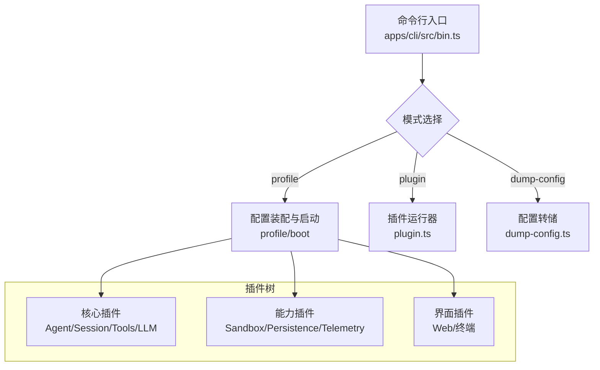
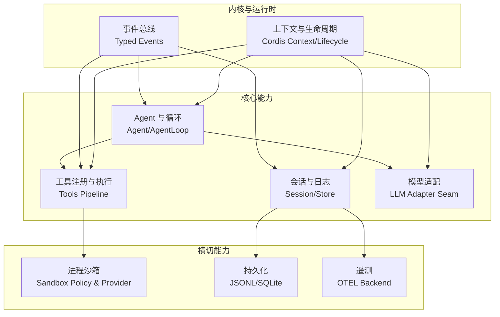
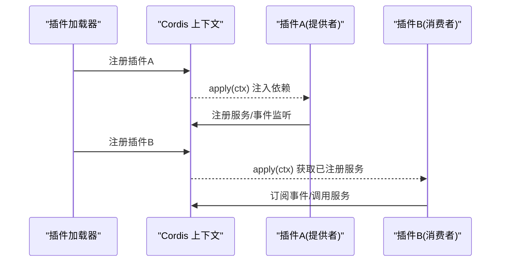
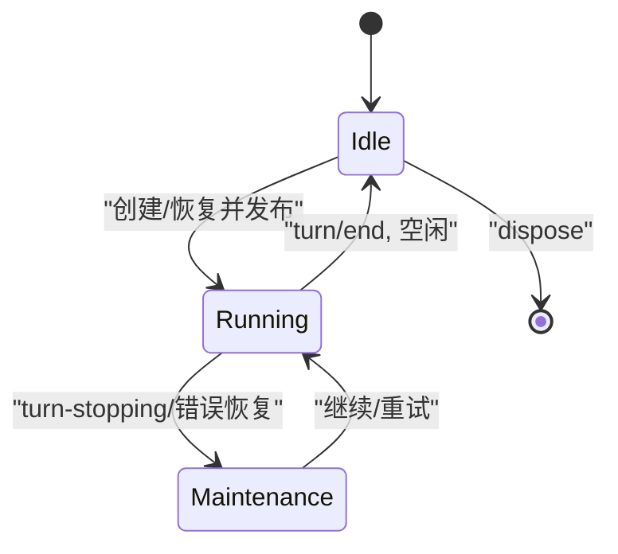
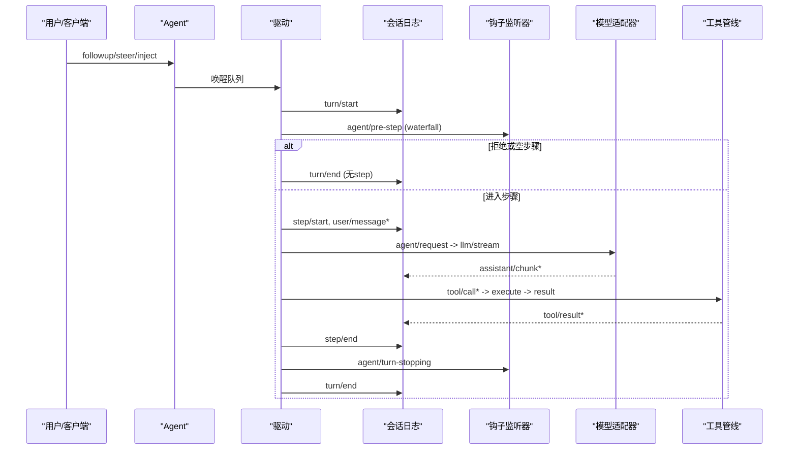
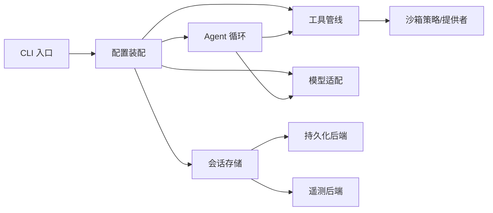
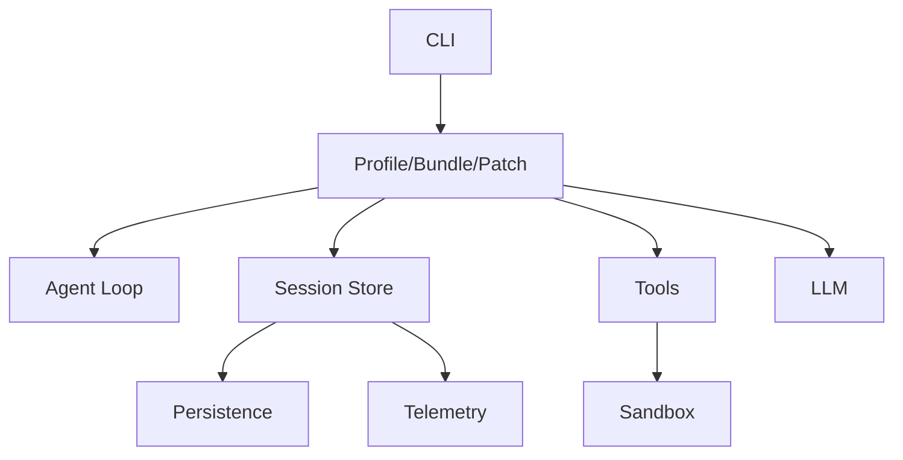

# 架构设计

<cite>
**本文引用的文件**
- [README.md](file://README.md)
- [architecture.md](file://docs/architecture.md)
- [agent-lifecycle.md](file://docs/agent-lifecycle.md)
- [bin.ts](file://apps/cli/src/bin.ts)
- [cordis-primer.md](file://docs/cordis-primer.md)
- [core-agent-README.md](file://packages/core/agent/README.md)
- [sandbox.md](file://docs/subsystems/sandbox.md)
- [persistence.md](file://docs/subsystems/persistence.md)
- [session-telemetry-index.ts](file://packages/session/session-telemetry-otel/src/index.ts)
- [session-telemetry-coordinator.ts](file://packages/session/session-telemetry/src/index.ts)
</cite>

## 目录
1. [简介](#简介)
2. [项目结构](#项目结构)
3. [核心组件](#核心组件)
4. [架构总览](#架构总览)
5. [详细组件分析](#详细组件分析)
6. [依赖关系分析](#依赖关系分析)
7. [性能考量](#性能考量)
8. [故障排查指南](#故障排查指南)
9. [结论](#结论)
10. [附录](#附录)

## 简介
DeepSeek Harness（dsh）是一个以“一切皆插件”为核心理念的开源 Agent 运行框架，基于 Cordis 插件化运行时构建。它通过可组合的配置层、服务注册与事件驱动通信，将模型适配、工具注册、会话日志、Agent 循环等全部能力解耦为可替换的插件。系统支持 Web UI 与无头模式，提供进程沙箱、持久化、遥测、权限策略等横切能力，并通过配置层（profile/bundle/patch）实现多环境装配。

**章节来源**
- [README.md:1-60](file://README.md#L1-L60)

## 项目结构
- 应用入口：CLI 命令分发器按模式动态加载 profile 启动、插件运行或配置转储。
- 文档与教程：Cordis 入门、子系统说明、Agent 生命周期、工具执行流水线等。
- 核心包：Agent、Session、Tools、LLM、Sandbox、Persistence、Telemetry 等。
- 打包与配置：Profile/Bundle/Patch 分层装配机制，允许在运行时覆盖任意行。
- 示例与测试：端到端用例、快照验证、压力测试等。

**图表来源**
- [bin.ts:1-54](file://apps/cli/src/bin.ts#L1-L54)

**章节来源**
- [bin.ts:1-54](file://apps/cli/src/bin.ts#L1-L54)
- [architecture.md:15-38](file://docs/architecture.md#L15-L38)

## 核心组件
- 插件与上下文：Cordis 提供 Service、Context、Inject、Events、Effect 等基础概念，所有功能以插件形式贡献到共享上下文。
- Agent 与循环：Agent 接口与注册表独立于具体循环实现；默认驱动负责 turn/step 编排、事件广播与工具调用。
- 会话日志：append-only 的 SessionEvent 流，作为模型可见历史的唯一事实源，支撑回放、重放、遥测与持久化。
- 能力接缝：以 Service Definition/Provider/Consumer 三件套定义可替换能力（如 LLM、FS、Subprocess、Sandbox）。
- 配置装配：Profile/Bundle/Patch 多层叠加，任何行均可被上层 patch 替换或插入。

**章节来源**
- [cordis-primer.md:1-13](file://docs/cordis-primer.md#L1-L13)
- [architecture.md:9-62](file://docs/architecture.md#L9-L62)
- [core-agent-README.md:1-122](file://packages/core/agent/README.md#L1-L122)

## 架构总览
整体采用微内核 + 插件化的架构：内核仅提供最小化的运行时（上下文、事件、生命周期），业务与能力以插件形式挂载。通过能力接缝与事件总线，模块间低耦合协作；通过配置层实现多形态装配（Web/Headless/自定义）。

**图表来源**
- [architecture.md:9-62](file://docs/architecture.md#L9-L62)
- [core-agent-README.md:1-122](file://packages/core/agent/README.md#L1-L122)
- [sandbox.md:1-219](file://docs/subsystems/sandbox.md#L1-L219)
- [persistence.md:1-386](file://docs/subsystems/persistence.md#L1-L386)
- [session-telemetry-index.ts:50-84](file://packages/session/session-telemetry-otel/src/index.ts#L50-L84)

## 详细组件分析

### 插件化与 Cordis 集成
- 插件以 Service 形式声明依赖（inject）并贡献能力（apply），通过 ctx 键暴露稳定接口。
- 事件用于跨插件通信，支持 waterfall/parallel/serial 等多种分发模式。
- 注册均为可逆 effect，卸载时自动回滚副作用。

**图表来源**
- [cordis-primer.md:1-13](file://docs/cordis-primer.md#L1-L13)

**章节来源**
- [cordis-primer.md:1-13](file://docs/cordis-primer.md#L1-L13)

### Agent 生命周期管理
- Agent 由工厂创建/恢复，进入发布前 setup 阶段，随后进入运行期。
- 关键事件：created、session-start、pre-step、request、turn-stopping、disposed。
- 状态机：idle/running/maintenance，配合 inbox/steer/inject 控制输入与上下文注入。

**图表来源**
- [core-agent-README.md:1-122](file://packages/core/agent/README.md#L1-L122)

**章节来源**
- [core-agent-README.md:1-122](file://packages/core/agent/README.md#L1-L122)

### 事件驱动通信机制
- 会话事件（session/event）为持久化事实，适合需要跨重启保留的状态。
- Agent 事件（agent/*）承载实时协调信息（状态、请求、拦截、错误）。
- 能力事件（fs/*、tools/*、telemetry/*）在不引入循环的前提下扩展能力。

**图表来源**
- [agent-lifecycle.md:1-83](file://docs/agent-lifecycle.md#L1-L83)
- [architecture.md:63-90](file://docs/architecture.md#L63-L90)

**章节来源**
- [agent-lifecycle.md:1-83](file://docs/agent-lifecycle.md#L1-L83)
- [architecture.md:53-90](file://docs/architecture.md#L53-L90)

### 微内核架构的设计决策与权衡
- 决策点
  - 一切皆插件：最大化可替换性，避免特权核心，便于安全审计与热更新。
  - 能力接缝：以抽象服务+提供者+消费者分离，降低耦合度，支持多后端（如 LLM、FS、Sandbox）。
  - 会话日志为单一事实源：保证可回放、可重放、可观测，但要求所有模型可见输入必须可重建。
  - 配置分层装配：profile/bundle/patch 允许运行时覆盖，提升部署灵活性。
- 权衡
  - 事件风暴风险：需严格划分领域事件边界，避免过度耦合。
  - 插件加载顺序：通过 inject 表达依赖，减少手工编排，但需警惕循环依赖。
  - 性能开销：事件分发与持久化批处理需控制延迟与吞吐。

**章节来源**
- [architecture.md:9-133](file://docs/architecture.md#L9-L133)

### 系统边界定义
- 进程边界：CLI 入口按模式动态加载，隔离无关路径。
- 插件边界：每个插件拥有独立生命周期与副作用作用域。
- 能力边界：通过 ctx.* 服务接口限定访问范围（如 sandbox、tools、llm）。
- 数据边界：会话日志为持久化事实；遥测记录经策略过滤后上报。

**章节来源**
- [bin.ts:1-54](file://apps/cli/src/bin.ts#L1-L54)
- [sandbox.md:1-219](file://docs/subsystems/sandbox.md#L1-L219)
- [persistence.md:1-386](file://docs/subsystems/persistence.md#L1-L386)

### 组件交互图与模块依赖关系图

**图表来源**
- [bin.ts:1-54](file://apps/cli/src/bin.ts#L1-L54)
- [architecture.md:39-62](file://docs/architecture.md#L39-L62)
- [sandbox.md:1-219](file://docs/subsystems/sandbox.md#L1-L219)
- [persistence.md:1-386](file://docs/subsystems/persistence.md#L1-L386)
- [session-telemetry-index.ts:50-84](file://packages/session/session-telemetry-otel/src/index.ts#L50-L84)

## 依赖关系分析
- 直接依赖
  - CLI 依赖 args 解析与环境加载，按模式动态导入 profile/plugin/dump-config。
  - Agent 循环依赖 Session、Tools、LLM 与事件总线。
  - 工具执行依赖沙箱策略与提供者。
  - 会话持久化依赖 JSONL/SQLite 后端。
  - 遥测依赖 OTel 后端与协调器。
- 间接依赖
  - 配置层（profile/bundle/patch）影响插件树结构与行为。
  - 能力接缝使多个提供者可互换（如不同 LLM、不同沙箱后端）。
- 潜在循环
  - 通过 inject 声明依赖，避免显式导入；需确保插件间无环。

**图表来源**
- [bin.ts:1-54](file://apps/cli/src/bin.ts#L1-L54)
- [architecture.md:15-38](file://docs/architecture.md#L15-L38)

**章节来源**
- [bin.ts:1-54](file://apps/cli/src/bin.ts#L1-L54)
- [architecture.md:15-38](file://docs/architecture.md#L15-L38)

## 性能考量
- 事件批处理：会话持久化采用固定时间窗口批写，避免阻塞生产者。
- 流式响应：LLM 流式输出通过 assistant/chunk 逐步落盘，兼顾回放与 UI 刷新。
- 资源隔离：沙箱策略限制文件系统访问，减少越界写入带来的性能抖动。
- 遥测开关：默认关闭遥测，按需启用以减少额外开销。

[本节为通用指导，不直接分析具体文件]

## 故障排查指南
- 会话中断恢复：冷加载时若发现未闭合的 turn/start，会合成 turn/end { interrupted } 保持平衡，避免截断历史。
- 遥测关闭与超时：遥测后端具备 shutdown 超时保护，防止阻塞插件树释放。
- 沙箱不可用：当无可用后端时抛出不可用错误，消费者应降级或提示。
- 版本不兼容：持久化后端对未知格式拒绝加载，给出升级方向而非误报损坏。

**章节来源**
- [persistence.md:13-19](file://docs/subsystems/persistence.md#L13-L19)
- [session-telemetry-coordinator.ts:162-178](file://packages/session/session-telemetry/src/index.ts#L162-L178)
- [sandbox.md:152-157](file://docs/subsystems/sandbox.md#L152-L157)
- [persistence.md:92-95](file://docs/subsystems/persistence.md#L92-L95)

## 结论
DeepSeek Harness 以微内核与插件化为核心，借助 Cordis 提供的上下文、事件与生命周期管理，实现了高度可组合、可替换的 Agent 运行平台。通过能力接缝与配置分层，系统在安全性（沙箱）、可靠性（持久化与恢复）、可观测性（遥测）等方面提供了系统化保障。未来可在事件治理、性能优化与跨进程边界一致性方面持续演进。

[本节为总结，不直接分析具体文件]

## 附录
- 技术栈与第三方依赖
  - Node.js 运行时与 TypeScript 工程体系。
  - Cordis 插件框架（vendored）。
  - 持久化后端：JSONL、SQLite。
  - 遥测：OpenTelemetry 后端。
  - 沙箱：bwrap/Landlock、Seatbelt、Windows ACL。
- 版本兼容性
  - 当前为开发者预览，存在破坏性变更可能。
  - 持久化格式版本受控，旧版本拒绝加载未知格式。

**章节来源**
- [README.md:1-60](file://README.md#L1-L60)
- [persistence.md:92-95](file://docs/subsystems/persistence.md#L92-L95)