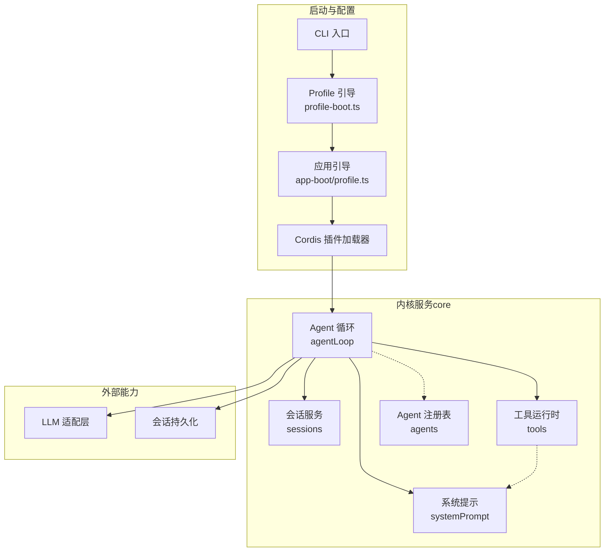
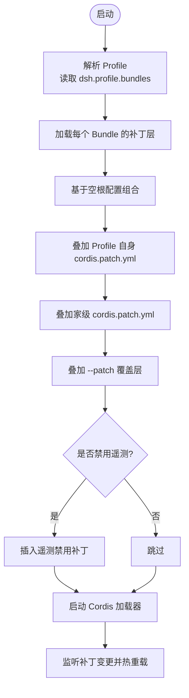
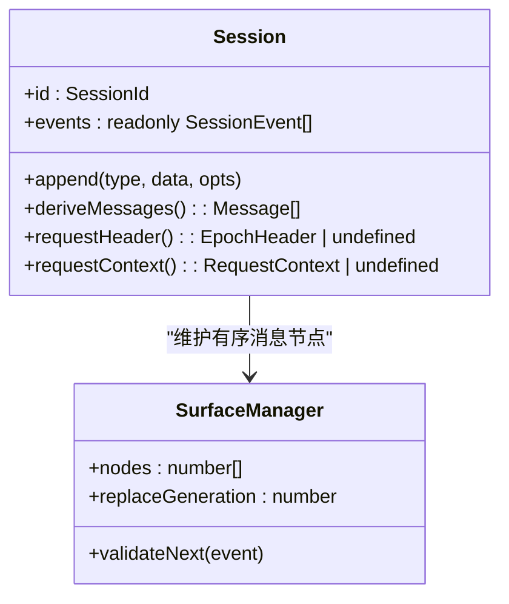
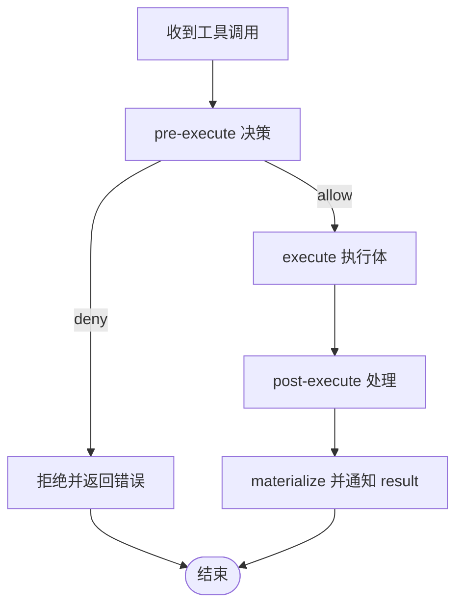
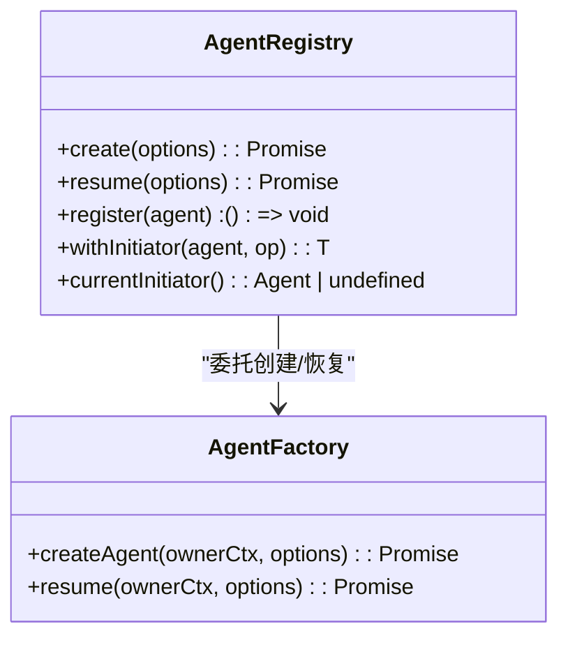
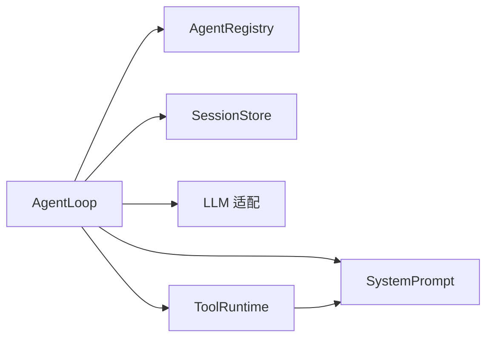

# 核心架构

<cite>
**本文引用的文件**
- [packages/core/README.md](file://packages/core/README.md)
- [docs/subsystems/core.md](file://docs/subsystems/core.md)
- [packages/core/session/src/index.ts](file://packages/core/session/src/index.ts)
- [packages/core/system-prompt/src/index.ts](file://packages/core/system-prompt/src/index.ts)
- [packages/core/tools/src/index.ts](file://packages/core/tools/src/index.ts)
- [packages/core/agent/src/index.ts](file://packages/core/agent/src/index.ts)
- [packages/core/agent-loop/src/index.ts](file://packages/core/agent-loop/src/index.ts)
- [apps/cli/src/profile-boot.ts](file://apps/cli/src/profile-boot.ts)
- [packages/boot/app-boot/src/profile.ts](file://packages/boot/app-boot/src/profile.ts)
- [docs/cordis-primer.md](file://docs/cordis-primer.md)
</cite>

## 目录
1. [简介](#简介)
2. [项目结构](#项目结构)
3. [核心组件](#核心组件)
4. [架构总览](#架构总览)
5. [详细组件分析](#详细组件分析)
6. [依赖关系分析](#依赖关系分析)
7. [性能考量](#性能考量)
8. [故障排查指南](#故障排查指南)
9. [结论](#结论)
10. [附录](#附录)

## 简介
本文件面向 DeepSeek Harness 的核心架构，聚焦微内核设计、Cordis 插件框架集成、插件树构建与配置层叠系统，以及 core 子系统中 session、system-prompt、tools、agent、agent-loop 的职责与交互。文档同时解释 Profile 与 Bundle 在启动过程中的作用，并通过架构图和依赖图展示数据流与控制流。

## 项目结构
Core 子系统由一组“产品级”包组成，提供会话日志、系统提示组装、工具注册表、Agent 类型与默认驱动等稳定能力：
- scope：作用域注册原语（库级，不暴露 ctx key）
- session：事件溯源的会话日志与内存存储（ctx.sessions）
- system-prompt：提示段、动态上下文、工具模式与变量装配（ctx.systemPrompt）
- tools：作用域工具注册表与执行管线（ctx.tools）
- agent：Agent 接口、实时注册表、发起者作用域与事件词汇（ctx.agents）
- agent-default-model：部署默认模型选择（ctx.agentDefaultModel）
- agent-loop：默认 Agent 驱动实现（ctx.agentLoop）

这些包共同构成 Harness 的默认控制脊柱；扩展插件应依赖这些抽象以替换具体驱动或行为。

章节来源
- [packages/core/README.md:1-22](file://packages/core/README.md#L1-L22)
- [docs/subsystems/core.md:1-18](file://docs/subsystems/core.md#L1-L18)

## 核心组件
- 会话服务（session）：以追加式事件日志为唯一事实源，维护内存状态并派生 LLM 消息历史；通过事件总线对外发布创建、事件、刷新与销毁等生命周期事件。
- 系统提示（system-prompt）：按序合并提示段、动态上下文、工具模式与变量，支持完整提示覆盖与运行时上下文开关。
- 工具运行时（tools）：注册工具、声明输出契约、提供 pre-execute/guard/around/post 执行管线，支持 native/code/both 呈现模式与并行调度。
- Agent 注册表（agent）：维护活跃 Agent 实例、工厂委托、进程内发起者作用域，并提供 create/resume 等统一入口。
- Agent 循环（agent-loop）：具体驱动实现，负责创建/恢复 Agent、装配会话、运行循环、管理并发工具调用与生命周期。

章节来源
- [packages/core/session/src/index.ts:1-800](file://packages/core/session/src/index.ts#L1-L800)
- [packages/core/system-prompt/src/index.ts:1-546](file://packages/core/system-prompt/src/index.ts#L1-L546)
- [packages/core/tools/src/index.ts:1-800](file://packages/core/tools/src/index.ts#L1-L800)
- [packages/core/agent/src/index.ts:1-707](file://packages/core/agent/src/index.ts#L1-L707)
- [packages/core/agent-loop/src/index.ts:1-714](file://packages/core/agent-loop/src/index.ts#L1-L714)

## 架构总览
下图展示了 Cordis 插件框架下的微内核组织方式：应用通过 CLI 加载 Profile，组合 Bundle 层与用户补丁，启动 Loader 挂载插件；core 子系统作为内核服务被各插件依赖，Agent 循环驱动一次对话轮次，贯穿 session、system-prompt、tools 与 LLM 适配层。



图表来源
- [apps/cli/src/profile-boot.ts:1-301](file://apps/cli/src/profile-boot.ts#L1-L301)
- [packages/boot/app-boot/src/profile.ts:1-200](file://packages/boot/app-boot/src/profile.ts#L1-L200)
- [packages/core/agent-loop/src/index.ts:296-382](file://packages/core/agent-loop/src/index.ts#L296-L382)
- [packages/core/session/src/index.ts:792-800](file://packages/core/session/src/index.ts#L792-L800)
- [packages/core/system-prompt/src/index.ts:338-355](file://packages/core/system-prompt/src/index.ts#L338-L355)
- [packages/core/tools/src/index.ts:787-800](file://packages/core/tools/src/index.ts#L787-L800)

## 详细组件分析

### 微内核与 Cordis 插件集成
- 插件即 Service：通过 inject 声明依赖，使用 effect/on 注册可逆贡献，事件系统用于解耦通信。
- 上下文即服务仓库：插件通过 ctx.<key> 访问服务，如 ctx.sessions、ctx.systemPrompt、ctx.tools、ctx.agents、ctx.agentLoop。
- 事件类型安全：通过 TypeScript 声明合并定义事件名与载荷，支持 emit/waterfall/parallel/serial 多种分发模式。

章节来源
- [docs/cordis-primer.md:1-13](file://docs/cordis-primer.md#L1-L13)
- [packages/core/session/src/index.ts:37-87](file://packages/core/session/src/index.ts#L37-L87)
- [packages/core/system-prompt/src/index.ts:13-39](file://packages/core/system-prompt/src/index.ts#L13-L39)
- [packages/core/tools/src/index.ts:137-209](file://packages/core/tools/src/index.ts#L137-L209)
- [packages/core/agent/src/index.ts:36-50](file://packages/core/agent/src/index.ts#L36-L50)
- [packages/core/agent-loop/src/index.ts:160-185](file://packages/core/agent-loop/src/index.ts#L160-L185)

### 插件树构建机制与配置层叠系统
- Profile：位于 $DSH_HOME/profiles/<name>，包含 package.json（声明 dsh.profile.bundles）与 cordis.patch.yml（用户补丁）。
- Bundle：npm 包通过 dsh.bundle.patch 导出补丁层；Profile 按 bundles 顺序将每个 bundle 的补丁列表叠加到空根配置上。
- 层叠顺序（应用顺序）：Bundle 层 → Profile 自身补丁 → 家级用户补丁（$DSH_HOME/cordis.patch.yml）→ --patch 覆盖层 → 遥测开关补丁。
- 双锚点解析：bundle 名称优先从 dsh 安装目录解析，其次回退到 profile 目录；Loader 的 baseUrl 指向 profile 目录，保证 node_modules 可解析。
- 热重载：对 profile 与 home 补丁文件进行监听，重新组合并注入 Loader，保持 live reload 一致性。



图表来源
- [apps/cli/src/profile-boot.ts:105-171](file://apps/cli/src/profile-boot.ts#L105-L171)
- [apps/cli/src/profile-boot.ts:227-299](file://apps/cli/src/profile-boot.ts#L227-L299)
- [packages/boot/app-boot/src/profile.ts:1-200](file://packages/boot/app-boot/src/profile.ts#L1-L200)

章节来源
- [apps/cli/src/profile-boot.ts:1-301](file://apps/cli/src/profile-boot.ts#L1-L301)
- [packages/boot/app-boot/src/profile.ts:1-200](file://packages/boot/app-boot/src/profile.ts#L1-L200)

### Profile 与 Bundle 的概念及启动中的作用
- Profile：用户或部署定义的“组合容器”，决定要激活哪些 Bundle 与用户补丁，提供稳定的启动基线。
- Bundle：可复用的补丁单元，通过 dsh.bundle.patch 暴露补丁清单；Profile 通过 dsh.profile.bundles 显式声明其参与顺序，确保确定性。
- 启动时作用：
  - 准备阶段：heal 共享模块回退、写入空根配置、解析 bundles 与用户补丁。
  - 组合阶段：按顺序生成 PatchOptions 列表，必要时注入遥测禁用补丁。
  - 引导阶段：调用 boot() 启动 Cordis，注入宿主槽位（命令行参数、退出信号、环境快照），随后进入 HMR 监听。

章节来源
- [apps/cli/src/profile-boot.ts:85-103](file://apps/cli/src/profile-boot.ts#L85-L103)
- [apps/cli/src/profile-boot.ts:142-171](file://apps/cli/src/profile-boot.ts#L142-L171)
- [packages/boot/app-boot/src/profile.ts:127-168](file://packages/boot/app-boot/src/profile.ts#L127-L168)

### 关键组件职责与交互

#### 会话服务（session）
- 追加式事件日志：所有事件不可变且 JSON 可序列化，seq 连续，作为唯一事实源。
- 派生视图：surface 管理器维护有序的消息节点，deriveMessages 缓存派生结果，避免重复计算。
- 生命周期事件：session/created、session/event、session/flush、session/disposed，供持久化与观测。
- 请求头折叠：requestHeader()/requestContext() 增量折叠最新请求元数据。



图表来源
- [packages/core/session/src/index.ts:425-758](file://packages/core/session/src/index.ts#L425-L758)

章节来源
- [packages/core/session/src/index.ts:1-800](file://packages/core/session/src/index.ts#L1-L800)

#### 系统提示（system-prompt）
- 提示段与上下文：按 order 排序合并，支持 complete 完整提示覆盖。
- 工具模式：收集 ToolSchema，支持 toolOrder 配置与 <unlisted-tools> 占位符。
- 变量插值：严格 {{variable}} 引用，未注册或未赋值会报错。
- 装配水线：system-prompt/assemble 允许拦截与增强最终装配结果。

```mermaid
sequenceDiagram
participant Loop as "Agent 循环"
participant SP as "SystemPrompt"
participant Reg as "工具注册表"
participant Model as "LLM"
Loop->>SP : assemble({scope, signal})
SP->>Reg : tools(context) 获取 ToolSchema
Reg-->>SP : ToolSchema[]
SP->>SP : 合并 sections/context/variables
SP-->>Loop : PromptAssembly
Loop->>Model : 发送提示与工具模式
```

图表来源
- [packages/core/system-prompt/src/index.ts:467-542](file://packages/core/system-prompt/src/index.ts#L467-L542)
- [packages/core/tools/src/index.ts:787-800](file://packages/core/tools/src/index.ts#L787-L800)

章节来源
- [packages/core/system-prompt/src/index.ts:1-546](file://packages/core/system-prompt/src/index.ts#L1-L546)

#### 工具运行时（tools）
- 注册与可见性：全局与作用域注册，支持 allow/deny 限制与 mode（native/code/both）。
- 执行管线：pre-execute（允许/拒绝/询问）、execute（超时/重试/指标）、post-execute（接受/替换/阻断）、result（最终结果观察）。
- 输出契约：ToolDefinition.output.schema 校验返回值，render/presentationMeta 投影模型内容。
- 并行调度：run_code 子调用并发上限与 exclusive 屏障。



图表来源
- [packages/core/tools/src/index.ts:137-209](file://packages/core/tools/src/index.ts#L137-L209)
- [packages/core/tools/src/index.ts:582-600](file://packages/core/tools/src/index.ts#L582-L600)

章节来源
- [packages/core/tools/src/index.ts:1-800](file://packages/core/tools/src/index.ts#L1-L800)

#### Agent 注册表（agent）
- 工厂委托：setFactory 注入 AgentFactory，create/resume 委托给具体实现。
- 作用域与归属：enter/announce 控制发布边界，withInitiator/withoutInitiator 管理发起者作用域。
- 生命周期：register 返回精确 disposer，确保有序卸载与事件配对。



图表来源
- [packages/core/agent/src/index.ts:256-430](file://packages/core/agent/src/index.ts#L256-L430)
- [packages/core/agent/src/index.ts:432-585](file://packages/core/agent/src/index.ts#L432-L585)

章节来源
- [packages/core/agent/src/index.ts:1-707](file://packages/core/agent/src/index.ts#L1-L707)

#### Agent 循环（agent-loop）
- 配置与设置：maxParallelToolCalls、agents 数组（id/provider/model/maxTokens/cwd/resumeSessionId）。
- 启动流程：构造 PreparedAgent，publish 时进入 sessions/agents 注册表并触发 session-start。
- 恢复流程：优先尝试 resume，若不存在则 fallback 到 create。
- 并发控制：每步最大并行工具调用数，受 settings 与 config 双重约束。

```mermaid
sequenceDiagram
participant Caller as "调用方"
participant Loop as "AgentLoop"
participant Prep as "PreparedAgent"
participant Sess as "SessionStore"
participant Ag as "AgentRegistry"
Caller->>Loop : create(resume?)
Loop->>Prep : prepare(id, options, session)
Prep->>Sess : enter(session)
Prep->>Ag : enter(agent, owner)
Prep->>Sess : announce(session)
Prep->>Ag : announce(agent)
Ag-->>Caller : agent/created
Sess-->>Caller : session/created
Loop-->>Caller : agent.session-start
Note over Loop,Sess : 开始运行循环
```

图表来源
- [packages/core/agent-loop/src/index.ts:459-578](file://packages/core/agent-loop/src/index.ts#L459-L578)
- [packages/core/agent-loop/src/index.ts:589-645](file://packages/core/agent-loop/src/index.ts#L589-L645)
- [packages/core/agent-loop/src/index.ts:653-710](file://packages/core/agent-loop/src/index.ts#L653-L710)

章节来源
- [packages/core/agent-loop/src/index.ts:1-714](file://packages/core/agent-loop/src/index.ts#L1-L714)

## 依赖关系分析
下图展示 core 子系统内部的关键依赖与数据流向：
- agent-loop 依赖 agents、sessions、llm、tools、systemPrompt。
- tools 依赖 systemPrompt（工具模式与 schema）。
- session 提供事件与派生消息，被 loop 消费。
- system-prompt 聚合工具模式与变量，供 loop 组装提示。



图表来源
- [packages/core/agent-loop/src/index.ts:296-312](file://packages/core/agent-loop/src/index.ts#L296-L312)
- [packages/core/tools/src/index.ts:787-800](file://packages/core/tools/src/index.ts#L787-L800)
- [packages/core/session/src/index.ts:792-800](file://packages/core/session/src/index.ts#L792-L800)
- [packages/core/system-prompt/src/index.ts:338-355](file://packages/core/system-prompt/src/index.ts#L338-L355)

章节来源
- [packages/core/agent-loop/src/index.ts:296-312](file://packages/core/agent-loop/src/index.ts#L296-L312)
- [packages/core/tools/src/index.ts:787-800](file://packages/core/tools/src/index.ts#L787-L800)
- [packages/core/session/src/index.ts:792-800](file://packages/core/session/src/index.ts#L792-L800)
- [packages/core/system-prompt/src/index.ts:338-355](file://packages/core/system-prompt/src/index.ts#L338-L355)

## 性能考量
- 会话事件缓存：deriveMessages 仅对新 surface 节点进行投影，避免重复计算；事件快照复用冻结对象，减少拷贝。
- 工具并行度：maxParallelToolCalls 控制每步并发，code 模式下 run_code 子调用也有独立上限，避免资源争用。
- 提示装配成本：toolOrder 与变量插值在每次 assemble 时执行，应避免频繁重算；complete 提示可短路多余段落。
- 启动开销：Profile 层叠与 HMR 监听在长生命周期应用中按需启用，避免不必要的重建。

[本节为通用指导，不直接分析具体文件]

## 故障排查指南
- 会话事件无效：检查事件 envelope 与 message 形状，确保 seq 连续、data JSON 可序列化；seed 必须从 0 连续。
- 工具未知：确认工具已注册且未被作用域限制；unknown tool 会抛出结构化错误。
- 提示变量缺失：{{variable}} 必须注册且有值；未注册或未赋值会抛错。
- 启动失败：检查 Profile 是否存在、bundles 是否有效、home 补丁语法是否正确；遥测开关需对应行存在。
- 恢复失败：若 persistence 不存在或后端异常，会报告配置启动失败事件；不存在则 fallback 创建。

章节来源
- [packages/core/session/src/index.ts:212-372](file://packages/core/session/src/index.ts#L212-L372)
- [packages/core/tools/src/index.ts:488-522](file://packages/core/tools/src/index.ts#L488-L522)
- [packages/core/system-prompt/src/index.ts:257-295](file://packages/core/system-prompt/src/index.ts#L257-L295)
- [packages/core/agent-loop/src/index.ts:384-404](file://packages/core/agent-loop/src/index.ts#L384-L404)

## 结论
DeepSeek Harness 采用微内核架构，以 Cordis 插件框架为基础，通过 Profile 与 Bundle 的组合机制实现灵活可插拔的系统。core 子系统提供稳定的产品 API：session 作为事实源，system-prompt 负责提示装配，tools 提供工具执行管线，agent 与 agent-loop 协作完成对话驱动。该设计在保证可扩展性的同时，维持了清晰的职责边界与可控的数据流。

[本节为总结，不直接分析具体文件]

## 附录
- 术语：
  - Profile：用户或部署的组合容器，声明 bundles 与用户补丁。
  - Bundle：可复用的补丁单元，通过 dsh.bundle.patch 暴露补丁清单。
  - 作用域（Scope）：隔离注册与可见性的机制，支持 per-agent 覆盖。
  - 事件（Event）：插件间通信的 typed 通道，支持多种分发模式。

[本节为概念说明，不直接分析具体文件]