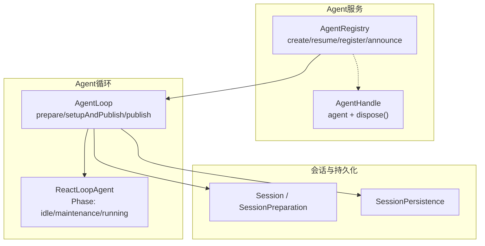
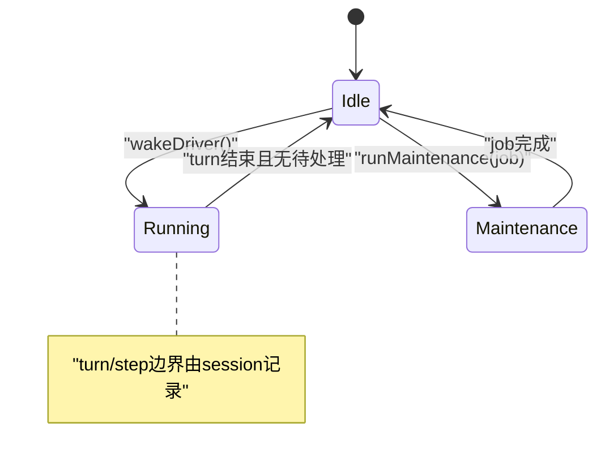
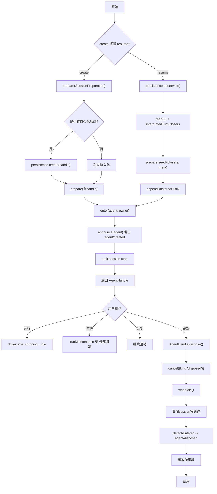
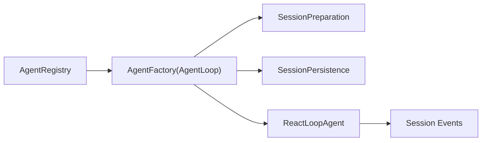

# Agent生命周期管理

<cite>
**本文引用的文件**
- [packages/core/agent/src/index.ts](file://packages/core/agent/src/index.ts)
- [packages/core/agent-loop/src/index.ts](file://packages/core/agent-loop/src/index.ts)
- [packages/core/agent-loop/src/agent.ts](file://packages/core/agent-loop/src/agent.ts)
- [docs/agent-lifecycle.md](file://docs/agent-lifecycle.md)
</cite>

## 目录
1. [简介](#简介)
2. [项目结构](#项目结构)
3. [核心组件](#核心组件)
4. [架构总览](#架构总览)
5. [详细组件分析](#详细组件分析)
6. [依赖关系分析](#依赖关系分析)
7. [性能与并发特性](#性能与并发特性)
8. [故障排查指南](#故障排查指南)
9. [结论](#结论)
10. [附录：最佳实践与示例路径](#附录最佳实践与示例路径)

## 简介
本文件系统性阐述Agent的完整生命周期，覆盖创建、启动、运行、暂停、恢复与销毁各阶段；深入解析AgentRegistry中create()、resume()、register()、announce()等关键方法的作用与调用时机；说明AgentHandle的生命周期控制机制（尤其是dispose()）；给出Agent状态转换图；并提供错误处理与资源清理的最佳实践，帮助开发者正确管理Agent生命周期。

## 项目结构
围绕Agent生命周期的核心代码分布在以下模块：
- Agent服务与注册表：定义AgentHandle、AgentRegistry以及创建/恢复的工厂接口
- Agent循环实现：具体创建、恢复、发布、驱动与销毁流程
- Agent驱动状态机：维护idle/maintenance/running三态，驱动turn/step边界
- 文档：回合与步骤的生命周期时序图



**图表来源**
- [packages/core/agent/src/index.ts:165-208](file://packages/core/agent/src/index.ts#L165-L208)
- [packages/core/agent/src/index.ts:250-425](file://packages/core/agent/src/index.ts#L250-L425)
- [packages/core/agent-loop/src/index.ts:530-677](file://packages/core/agent-loop/src/index.ts#L530-L677)
- [packages/core/agent-loop/src/index.ts:754-916](file://packages/core/agent-loop/src/index.ts#L754-L916)
- [packages/core/agent-loop/src/agent.ts:91-174](file://packages/core/agent-loop/src/agent.ts#L91-L174)

**章节来源**
- [packages/core/agent/src/index.ts:165-208](file://packages/core/agent/src/index.ts#L165-L208)
- [packages/core/agent/src/index.ts:250-425](file://packages/core/agent/src/index.ts#L250-L425)
- [packages/core/agent-loop/src/index.ts:530-677](file://packages/core/agent-loop/src/index.ts#L530-L677)
- [packages/core/agent-loop/src/index.ts:754-916](file://packages/core/agent-loop/src/index.ts#L754-L916)
- [packages/core/agent-loop/src/agent.ts:91-174](file://packages/core/agent-loop/src/agent.ts#L91-L174)

## 核心组件
- AgentHandle：持有Agent实例与dispose能力，用于拥有者释放资源、停止驱动并回收作用域
- AgentRegistry：提供create/resume代理到工厂；提供register/enter/announce以安全地插入、公告与注销Agent
- AgentLoop：实现具体的创建、恢复、准备、发布与销毁；协调Session与持久化；管理Factory级所有权与取消
- ReactLoopAgent：维护Phase状态机（idle/maintenance/running），驱动turn/step，暴露whenIdle/cancel/runMaintenance

**章节来源**
- [packages/core/agent/src/index.ts:165-208](file://packages/core/agent/src/index.ts#L165-L208)
- [packages/core/agent/src/index.ts:250-425](file://packages/core/agent/src/index.ts#L250-L425)
- [packages/core/agent-loop/src/index.ts:530-677](file://packages/core/agent-loop/src/index.ts#L530-L677)
- [packages/core/agent-loop/src/index.ts:754-916](file://packages/core/agent-loop/src/index.ts#L754-L916)
- [packages/core/agent-loop/src/agent.ts:91-174](file://packages/core/agent-loop/src/agent.ts#L91-L174)

## 架构总览
下图展示从创建到销毁的关键交互：

```mermaid
sequenceDiagram
participant Caller as "调用方"
participant Reg as "AgentRegistry"
participant Loop as "AgentLoop"
participant Prep as "SessionPreparation"
participant Pers as "SessionPersistence"
participant Agent as "ReactLoopAgent"
participant Store as "AgentRegistry.store"
Caller->>Reg : create(options)
Reg->>Loop : createAgent(ownerCtx, options)
Loop->>Prep : prepare(sessionId, meta/seed)
alt 有持久化后端
Loop->>Pers : create(header, inheritedEventCount)
Pers-->>Loop : handle
end
Loop->>Loop : prepare(ownerCtx, id, options, session, signal, handle)
Note over Loop : 注册取消信号、跟踪owner fiber卸载
Loop->>Store : enter(agent, owner)
Loop->>Store : announce(agent)
Store-->>Caller : agent/created事件
Loop->>Agent : emit session-start
Loop-->>Caller : AgentHandle{agent, dispose}
Caller->>Reg : resume(options)
Reg->>Loop : resume(ownerCtx, options)
Loop->>Pers : open(id, write)
Loop->>Pers : read(0, undefined)
Loop->>Prep : prepare(seed+closers, meta)
Loop->>Store : enter(agent, owner)
Loop->>Store : announce(agent)
Store-->>Caller : agent/created事件
Loop-->>Caller : AgentHandle{agent, dispose}
Caller->>AH : dispose()
AH->>Agent : cancel({kind : 'disposed'})
AH->>Agent : whenIdle()
AH->>Agent : scope.dispose()
AH->>Store : detachEntered -> agent/disposed
```

**图表来源**
- [packages/core/agent/src/index.ts:400-425](file://packages/core/agent/src/index.ts#L400-L425)
- [packages/core/agent-loop/src/index.ts:754-823](file://packages/core/agent-loop/src/index.ts#L754-L823)
- [packages/core/agent-loop/src/index.ts:831-916](file://packages/core/agent-loop/src/index.ts#L831-L916)
- [packages/core/agent/src/index.ts:469-571](file://packages/core/agent/src/index.ts#L469-L571)
- [packages/core/agent-loop/src/index.ts:575-677](file://packages/core/agent-loop/src/index.ts#L575-L677)

## 详细组件分析

### AgentRegistry：create()/resume()/register()/announce()
- create(options)：将调用委托给已注册的AgentFactory.createAgent，完成创建、setup、发布与启动
- resume(options)：加载持久化会话，修复中断的turn/step，执行setup并发布
- register(agent)：高级用法，等价于enter(agent)+announce(agent)，并以effect形式保证顺序卸载
- enter(agent, owner)：将未发布的Agent插入store，返回detach能力；在announce前可回滚
- announce(agent)：校验唯一性，标记announcing/announced，发出agent/created；若存在detachRequested则立即detach

关键点
- 发布前不可见：enter后、announce前，Agent对订阅者不可见，确保原子性
- 幂等与冲突：同一id重复enter会抛错；announce仅允许一次
- 事件安全：创建/销毁事件通过scope carrier过滤，避免跨作用域误触发

**章节来源**
- [packages/core/agent/src/index.ts:400-425](file://packages/core/agent/src/index.ts#L400-L425)
- [packages/core/agent/src/index.ts:445-571](file://packages/core/agent/src/index.ts#L445-L571)

### AgentLoop：prepare()/setupAndPublish()/publish()
- prepare(...)：构造ReactLoopAgent，绑定取消信号与owner fiber卸载回调，建立dispose事务
- setupAndPublish(...)：执行可选setup与commit，追加未存储后缀，调用publish
- publish(source)：进入session与agent注册表，发出session-start，返回AgentHandle

关键点
- 多源取消：caller.signal、owner fiber卸载、factory teardown三者融合
- 幂等dispose：多次调用合并为单一完成Promise
- 资源顺序：先cancel并等待空闲，再关闭session写路径，最后解绑注册表与作用域

**章节来源**
- [packages/core/agent-loop/src/index.ts:530-677](file://packages/core/agent-loop/src/index.ts#L530-L677)
- [packages/core/agent-loop/src/index.ts:793-823](file://packages/core/agent-loop/src/index.ts#L793-L823)

### AgentHandle：dispose()原理
- 调用Agent.cancel({kind:'disposed'})终止当前或后续工作
- 等待whenIdle()确保无活跃turn/step
- 关闭session写路径，确保最终事件落盘
- 从注册表detach并触发agent/disposed
- 释放作用域，回收所有注册的工具、监听器等

注意
- 如果dispose在setup期间被触发，仍会走完整teardown，但不会对外发布“已创建”的事件
- 并发dispose请求会合并为同一完成Promise，避免重复释放

**章节来源**
- [packages/core/agent-loop/src/index.ts:575-677](file://packages/core/agent-loop/src/index.ts#L575-L677)
- [packages/core/agent/src/index.ts:469-571](file://packages/core/agent/src/index.ts#L469-L571)

### ReactLoopAgent：Phase状态机与驱动
- Phase类型：idle、maintenance、running
- 状态转换
  - idle → running：wakeDriver时开启turn，记录lastTurn
  - running → idle：turn结束且无待处理消息
  - idle → maintenance：runMaintenance独占执行，完成后回到idle
- 当处于maintenance或aborted时，新唤醒会被latch并在收敛时重放
- 错误与取消：throwError上报agent/error；cancel中止当前phase并等待空闲



**图表来源**
- [packages/core/agent-loop/src/agent.ts:91-174](file://packages/core/agent-loop/src/agent.ts#L91-L174)
- [packages/core/agent-loop/src/agent.ts:176-205](file://packages/core/agent-loop/src/agent.ts#L176-L205)
- [packages/core/agent-loop/src/agent.ts:222-293](file://packages/core/agent-loop/src/agent.ts#L222-L293)

**章节来源**
- [packages/core/agent-loop/src/agent.ts:91-174](file://packages/core/agent-loop/src/agent.ts#L91-L174)
- [packages/core/agent-loop/src/agent.ts:176-205](file://packages/core/agent-loop/src/agent.ts#L176-L205)
- [packages/core/agent-loop/src/agent.ts:222-293](file://packages/core/agent-loop/src/agent.ts#L222-L293)

### 完整生命周期流程图


**图表来源**
- [packages/core/agent-loop/src/index.ts:754-823](file://packages/core/agent-loop/src/index.ts#L754-L823)
- [packages/core/agent-loop/src/index.ts:831-916](file://packages/core/agent-loop/src/index.ts#L831-L916)
- [packages/core/agent/src/index.ts:469-571](file://packages/core/agent/src/index.ts#L469-L571)
- [packages/core/agent-loop/src/agent.ts:176-205](file://packages/core/agent-loop/src/agent.ts#L176-L205)

## 依赖关系分析
- AgentRegistry依赖AgentFactory（由AgentLoop实现）进行实际创建/恢复
- AgentLoop依赖SessionPreparation与SessionPersistence进行会话准备与持久化
- ReactLoopAgent依赖Session事件流与工具链，驱动turn/step
- 事件系统：agent/created、agent/session-start、agent/status、agent/inbox/*、agent/error、agent/disposed贯穿生命周期



**图表来源**
- [packages/core/agent/src/index.ts:367-425](file://packages/core/agent/src/index.ts#L367-L425)
- [packages/core/agent-loop/src/index.ts:530-677](file://packages/core/agent-loop/src/index.ts#L530-L677)
- [packages/core/agent-loop/src/index.ts:754-916](file://packages/core/agent-loop/src/index.ts#L754-L916)

**章节来源**
- [packages/core/agent/src/index.ts:367-425](file://packages/core/agent/src/index.ts#L367-L425)
- [packages/core/agent-loop/src/index.ts:530-677](file://packages/core/agent-loop/src/index.ts#L530-L677)
- [packages/core/agent-loop/src/index.ts:754-916](file://packages/core/agent-loop/src/index.ts#L754-L916)

## 性能与并发特性
- 并发创建/恢复：同一id的并发prepare可能同时推进，但最终registry entry仅一个成功，其余回滚
- 取消传播：caller.signal、owner fiber卸载、factory teardown三者融合，避免悬挂任务
- 唤醒节流：maintenance或aborted阶段的唤醒会被latch并在收敛时重放，避免风暴
- 幂等释放：dispose合并为单一完成Promise，避免重复释放导致的竞态

[本节为通用指导，不直接分析具体文件]

## 故障排查指南
常见问题与定位要点
- “no agent factory registered”：未注册AgentFactory即调用create/resume
  - 参考：[packages/core/agent/src/index.ts:385-425](file://packages/core/agent/src/index.ts#L385-L425)
- “agent already registered”：重复enter同一id
  - 参考：[packages/core/agent/src/index.ts:477-487](file://packages/core/agent/src/index.ts#L477-L487)
- “already announced”：重复announce
  - 参考：[packages/core/agent/src/index.ts:549-551](file://packages/core/agent/src/index.ts#L549-L551)
- “cannot resume: session persistence is not configured”：resume但未配置持久化
  - 参考：[packages/core/agent-loop/src/index.ts:831-837](file://packages/core/agent-loop/src/index.ts#L831-L837)
- 设置失败或setup异常：prepare阶段抛出，会触发dispose回滚
  - 参考：[packages/core/agent-loop/src/index.ts:817-823](file://packages/core/agent-loop/src/index.ts#L817-L823)
- 驱动错误：agent/error事件携带turn/step上下文
  - 参考：[packages/core/agent-loop/src/agent.ts:214-220](file://packages/core/agent-loop/src/agent.ts#L214-L220)

建议
- 监听agent/created与agent/disposed配对，确保资源成对分配与释放
- 使用AgentHandle.dispose()统一收尾，不要手动拆分内部步骤
- 在setup中尽量只做纯函数式注册与验证，避免长耗时I/O

**章节来源**
- [packages/core/agent/src/index.ts:385-425](file://packages/core/agent/src/index.ts#L385-L425)
- [packages/core/agent/src/index.ts:477-571](file://packages/core/agent/src/index.ts#L477-L571)
- [packages/core/agent-loop/src/index.ts:817-837](file://packages/core/agent-loop/src/index.ts#L817-L837)
- [packages/core/agent-loop/src/agent.ts:214-220](file://packages/core/agent-loop/src/agent.ts#L214-L220)

## 结论
Agent生命周期通过AgentRegistry与AgentLoop协同实现，采用“准备-发布-驱动-销毁”的清晰边界。create与resume均遵循相同的setup-commit与发布顺序，确保可见性与一致性。AgentHandle作为拥有者的唯一释放入口，负责有序停止驱动、落盘与回收作用域。Phase状态机保证了运行的有序性与可恢复性。遵循本文的实践与排障指引，可构建健壮、可观测、易维护的Agent系统。

[本节为总结性内容，不直接分析具体文件]

## 附录：最佳实践与示例路径
- 创建与启动
  - 使用ctx.agents.create(options)获取AgentHandle，并在需要时调用dispose()
  - 参考路径：[packages/core/agent/src/index.ts:400-425](file://packages/core/agent/src/index.ts#L400-L425)
- 恢复持久化会话
  - 使用ctx.agents.resume(options)并确保sessionPersistence已配置
  - 参考路径：[packages/core/agent-loop/src/index.ts:831-916](file://packages/core/agent-loop/src/index.ts#L831-L916)
- 安全注册与公告
  - 普通场景用register(agent)；复杂异步工厂用enter+announce组合
  - 参考路径：[packages/core/agent/src/index.ts:445-571](file://packages/core/agent/src/index.ts#L445-L571)
- 运行期控制
  - 使用runMaintenance执行后台任务；使用whenIdle等待空闲；使用cancel中止
  - 参考路径：[packages/core/agent-loop/src/agent.ts:154-174](file://packages/core/agent-loop/src/agent.ts#L154-L174)
  - 参考路径：[packages/core/agent-loop/src/agent.ts:176-205](file://packages/core/agent-loop/src/agent.ts#L176-L205)
- 错误与日志
  - 订阅agent/error与agent/status，结合turn/step定位问题
  - 参考路径：[packages/core/agent-loop/src/agent.ts:214-220](file://packages/core/agent-loop/src/agent.ts#L214-L220)
- 生命周期时序参考
  - 回合与步骤的生命周期序列图
  - 参考路径：[docs/agent-lifecycle.md:1-85](file://docs/agent-lifecycle.md#L1-L85)

[本节为实践指引，不直接分析具体文件]