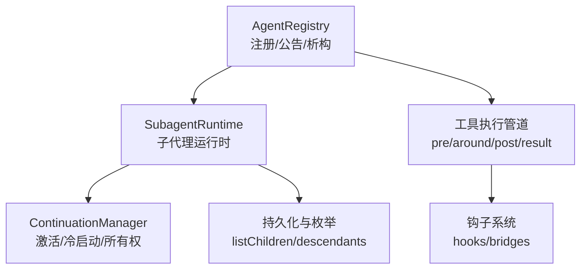
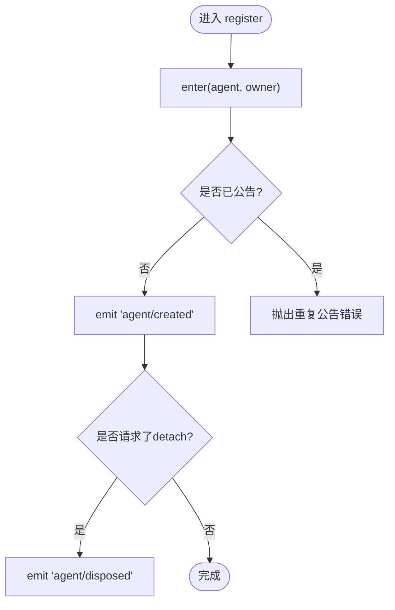
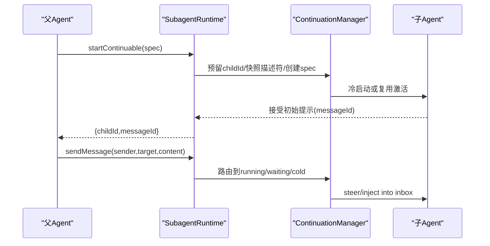
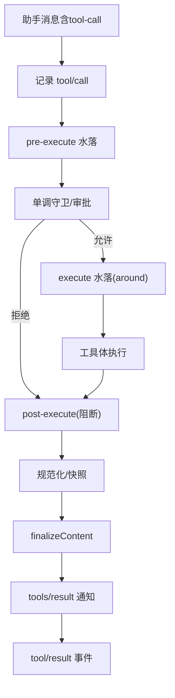
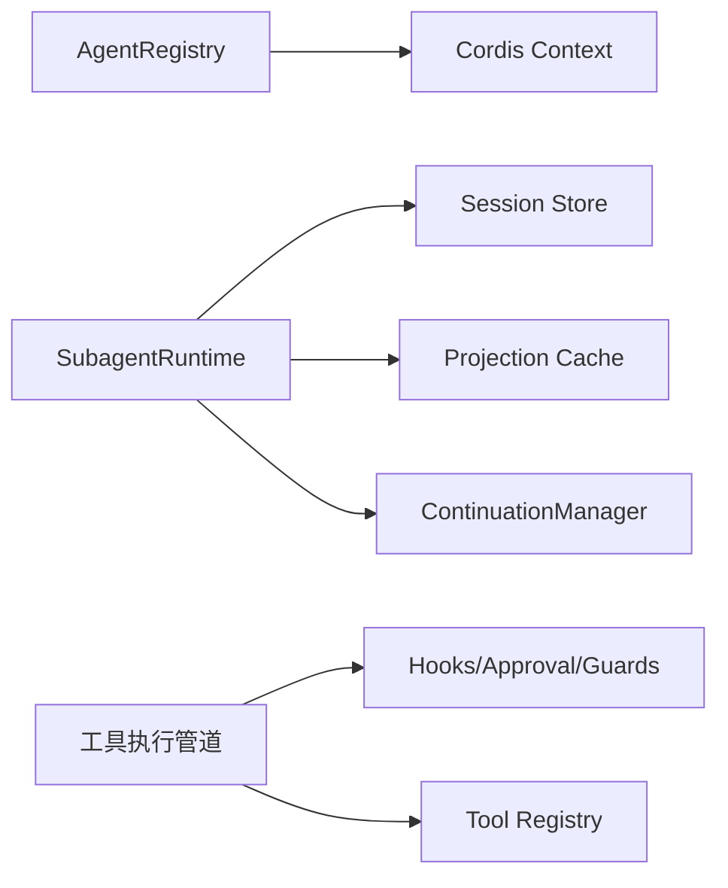

# Agent管理系统

<cite>
**本文引用的文件**
- [packages/core/agent/src/index.ts](file://packages/core/agent/src/index.ts)
- [packages/core/agent/src/types.ts](file://packages/core/agent/src/types.ts)
- [packages/subagent/subagent/src/index.ts](file://packages/subagent/subagent/src/index.ts)
- [packages/subagent/subagent/src/continuation.ts](file://packages/subagent/subagent/src/continuation.ts)
- [docs/subsystems/subagent.md](file://docs/subsystems/subagent.md)
- [docs/tool-execution-pipeline.md](file://docs/tool-execution-pipeline.md)
- [packages/hooks/README.zh.md](file://packages/hooks/README.zh.md)
- [packages/core/tools/tests/tools.spec.ts](file://packages/core/tools/tests/tools.spec.ts)
- [packages/core/tools/tests/ptc.spec.ts](file://packages/core/tools/tests/ptc.spec.ts)
</cite>

## 目录
1. [简介](#简介)
2. [项目结构](#项目结构)
3. [核心组件](#核心组件)
4. [架构总览](#架构总览)
5. [详细组件分析](#详细组件分析)
6. [依赖关系分析](#依赖关系分析)
7. [性能与并发](#性能与并发)
8. [故障排查指南](#故障排查指南)
9. [结论](#结论)
10. [附录：开发指南与示例路径](#附录开发指南与示例路径)

## 简介
本文件系统性地梳理并文档化 Agent 管理系统的接口设计与实现，覆盖 Agent 生命周期、注册发现、状态管理、错误处理策略；说明 Agent 与工具执行管道的集成方式（工具调用、结果处理、异常恢复）；解释扩展点设计（钩子系统、拦截器机制）；并提供创建自定义 Agent、处理事件、管理状态的实践指引。

## 项目结构
- Agent 注册与生命周期由核心 Agent 服务提供，负责工厂委托、进程内发起者上下文、创建/恢复、注册/公告、析构等。
- 子代理能力通过 SubagentRuntime 暴露，支持一次性运行与可继续的持久化子会话，提供消息路由、中断、枚举等能力。
- 工具执行管道在 Session 层以水落式钩子串联，贯穿 pre-execute、execute、post-execute、result 等阶段。
- 钩子系统通过 Cordis 事件与类型化 Decision 面进行扩展，桥接外部协议或内部插件。



**图示来源**
- [packages/core/agent/src/index.ts:250-702](file://packages/core/agent/src/index.ts#L250-L702)
- [packages/subagent/subagent/src/index.ts:190-200](file://packages/subagent/subagent/src/index.ts#L190-L200)
- [packages/subagent/subagent/src/continuation.ts:1235-1252](file://packages/subagent/subagent/src/continuation.ts#L1235-L1252)
- [docs/tool-execution-pipeline.md:1-63](file://docs/tool-execution-pipeline.md#L1-L63)

**章节来源**
- [packages/core/agent/src/index.ts:250-702](file://packages/core/agent/src/index.ts#L250-L702)
- [packages/subagent/subagent/src/index.ts:190-200](file://packages/subagent/subagent/src/index.ts#L190-L200)
- [docs/tool-execution-pipeline.md:1-63](file://docs/tool-execution-pipeline.md#L1-L63)

## 核心组件
- AgentRegistry：Agent 的进程内注册表与生命周期协调器，提供 create/resume/register/announce/dispose 等能力，维护“发起者”上下文边界，保证创建/公告/析构的顺序性与回滚一致性。
- Agent：最小化的公开句柄，包含 id、session、inbox、steer/send/cancel 等运行时能力（具体实现在 agent-loop）。
- SubagentRuntime：子代理能力门面，统一注册 provider、启动一次性子代理、建立可继续子会话、发送消息、中断、枚举子代理。
- ContinuationManager：管理可继续子会话的激活期、冷启动、父子授权、消息路由、最终结算与释放。
- 工具执行管道：以 waterfalls 形式组织 pre-execute、execute、post-execute、result 等阶段，配合审批、沙箱、权限、FS 守卫、结果规范化与 UI 呈现。
- 钩子系统：基于 Cordis 事件的扩展点，提供 per-prompt、session-start、tool 前后、around-dispatch、final-result 等扩展位置。

**章节来源**
- [packages/core/agent/src/index.ts:250-702](file://packages/core/agent/src/index.ts#L250-L702)
- [packages/core/agent/src/types.ts:11-67](file://packages/core/agent/src/types.ts#L11-L67)
- [packages/subagent/subagent/src/index.ts:190-200](file://packages/subagent/subagent/src/index.ts#L190-L200)
- [docs/tool-execution-pipeline.md:1-63](file://docs/tool-execution-pipeline.md#L1-L63)
- [packages/hooks/README.zh.md:34-51](file://packages/hooks/README.zh.md#L34-L51)

## 架构总览
下图展示 Agent 注册、子代理启动、消息传递与工具执行的关键交互。

```mermaid
sequenceDiagram
participant Caller as "调用方"
participant Reg as "AgentRegistry"
participant Loop as "AgentLoop(工厂)"
participant SA as "SubagentRuntime"
participant CM as "ContinuationManager"
participant TP as "工具执行管道"
Caller->>Reg : create()/resume()
Reg->>Loop : createAgent()/resume()
Loop-->>Reg : AgentHandle(已发布)
Caller->>SA : start()/startContinuable()
SA->>CM : 准备/激活/冷启动
CM-->>SA : childId/messageId
SA->>TP : 工具调用/结果/异常
TP-->>Caller : tool/result 事件
```

**图示来源**
- [packages/core/agent/src/index.ts:391-425](file://packages/core/agent/src/index.ts#L391-L425)
- [packages/subagent/subagent/src/index.ts:190-200](file://packages/subagent/subagent/src/index.ts#L190-L200)
- [packages/subagent/subagent/src/continuation.ts:1235-1252](file://packages/subagent/subagent/src/continuation.ts#L1235-L1252)
- [docs/tool-execution-pipeline.md:1-63](file://docs/tool-execution-pipeline.md#L1-L63)

## 详细组件分析

### AgentRegistry：生命周期与注册发现
- 创建与恢复：create/resume 将创建/恢复逻辑委托给已注册的 AgentFactory，并在 setup、commit、公告、启动循环之间保持严格顺序与回滚语义。
- 注册与公告：register 使用 enter+announce 两阶段，确保创建监听器的同步抛出能回滚未发布的条目；announce 仅允许一次，失败时仍会配对 emit disposed。
- 发起者上下文：withInitiator/withoutInitiator 提供进程内因果归属边界，关闭/析构期间拒绝新的发起者边界。
- 所有权与可见性：store 保存 AgentEntry，支持 isOwnedBy、roots、list 等查询；detachEntered 保证注销与析构有序。



**图示来源**
- [packages/core/agent/src/index.ts:445-571](file://packages/core/agent/src/index.ts#L445-L571)

**章节来源**
- [packages/core/agent/src/index.ts:250-702](file://packages/core/agent/src/index.ts#L250-L702)

### SubagentRuntime：子代理能力与消息流
- 一次性子代理：start 校验 provider 能力后委派到 provider.start，返回 run，run.result 承载终态结果，dispose 用于取消与资源回收。
- 可继续子代理：startContinuable 建立持久化子会话，ContinuationManager 负责激活期、冷启动、父子授权、消息投递与最终结算。
- 消息路由：sendMessage 根据目标激活状态选择 steer/wake/cold-resume，并以 Agent.steer 投递至 inbox FIFO。
- 中断：interrupt 以 user/ancestor 两种权威模型对活跃目标下发 cancel，不等待静默即返回。
- 枚举：listChildren/listDescendants 通过 session store 与投影缓存提供只读视图，不加载 Agent。



**图示来源**
- [packages/subagent/subagent/src/index.ts:190-200](file://packages/subagent/subagent/src/index.ts#L190-L200)
- [packages/subagent/subagent/src/continuation.ts:1235-1252](file://packages/subagent/subagent/src/continuation.ts#L1235-L1252)
- [docs/subsystems/subagent.md:122-219](file://docs/subsystems/subagent.md#L122-L219)

**章节来源**
- [docs/subsystems/subagent.md:1-767](file://docs/subsystems/subagent.md#L1-L767)
- [packages/subagent/subagent/src/index.ts:190-200](file://packages/subagent/subagent/src/index.ts#L190-L200)
- [packages/subagent/subagent/src/continuation.ts:1235-1252](file://packages/subagent/subagent/src/continuation.ts#L1235-L1252)

### 工具执行管道：调用、结果与异常恢复
- 阶段顺序：model 生成 tool-call -> 记录 tool/call -> pre-execute 水落（钩子、权限、沙箱）-> 单调守卫 -> around（超时/重试/指标）-> 工具体 -> post-execute（接受/阻断/替换/附加上下文）-> 规范化 -> finalizeContent -> tools/result 通知 -> tool/result 事件。
- 异常处理：任意阶段抛错会被规范化为 isError 结果；tools/pre-execute 抛错会跳过后续阶段但仍产出 tool/code-dispatch  settle 事件。
- PTC 模式：同时发送 run_code 与序列化子调用，子调用携带父 token，记录 tool/code-dispatch，返回拒绝作为绑定拒绝，不包含 additionalContexts。



**图示来源**
- [docs/tool-execution-pipeline.md:1-63](file://docs/tool-execution-pipeline.md#L1-L63)
- [packages/core/tools/tests/tools.spec.ts:1585-1618](file://packages/core/tools/tests/tools.spec.ts#L1585-L1618)
- [packages/core/tools/tests/ptc.spec.ts:984-1013](file://packages/core/tools/tests/ptc.spec.ts#L984-L1013)

**章节来源**
- [docs/tool-execution-pipeline.md:1-63](file://docs/tool-execution-pipeline.md#L1-L63)
- [packages/core/tools/tests/tools.spec.ts:1585-1618](file://packages/core/tools/tests/tools.spec.ts#L1585-L1618)
- [packages/core/tools/tests/ptc.spec.ts:984-1013](file://packages/core/tools/tests/ptc.spec.ts#L984-L1013)

### 扩展点：钩子系统与拦截器
- 设计理念：原生钩子并非独立包，而是订阅标准生命周期事件的普通 Cordis 插件；关键是通过类型化 Decision 面表达跨阶段的决策。
- 覆盖范围：per-prompt 策略、session-start 观察、tool 前后、around-dispatch、final-result 观察、带模型侧原因的继续。
- 桥接：外部协议（如 CC/Codex）通过桥接映射到同一 API，便于纯插件直接实现更强能力。

**章节来源**
- [packages/hooks/README.zh.md:34-51](file://packages/hooks/README.zh.md#L34-L51)

## 依赖关系分析
- AgentRegistry 依赖 Cordis 上下文与服务框架，注入 typert 查找与上下文解析；对外暴露 ctx.agents 访问器。
- SubagentRuntime 依赖 session store、projection、attachment、typert 远程服务，组合 ContinuationManager 与生命周期发射器。
- 工具执行管道依赖 hooks、approval、fs 守卫、registry 定义与 UI 呈现模块。
- 子代理枚举依赖 session-query 与 projection 缓存，避免加载 Agent。



**图示来源**
- [packages/core/agent/src/index.ts:260-293](file://packages/core/agent/src/index.ts#L260-L293)
- [packages/subagent/subagent/src/index.ts:190-200](file://packages/subagent/subagent/src/index.ts#L190-L200)
- [docs/tool-execution-pipeline.md:1-63](file://docs/tool-execution-pipeline.md#L1-L63)

**章节来源**
- [packages/core/agent/src/index.ts:260-293](file://packages/core/agent/src/index.ts#L260-L293)
- [packages/subagent/subagent/src/index.ts:190-200](file://packages/subagent/subagent/src/index.ts#L190-L200)
- [docs/tool-execution-pipeline.md:1-63](file://docs/tool-execution-pipeline.md#L1-L63)

## 性能与并发
- 消息分发去重与串行化：团队邮箱尝试按消息 ID 去重，跟踪 in-flight 操作，避免重复派发；通过序列化派发保障单进程内精确一次。
- 发起者边界计数：initiatorRuns 计数与 drain 机制确保在关闭期间不再新建边界，等待所有边界释放后再禁用存储。
- 工具管道短路：pre-execute 抛错立即短路后续阶段，减少不必要开销；规范化与 finalize 保证结果一致性与最小化传输。
- 枚举优化：live-preferred 合并 + 投影缓存命中，避免冷日志读取；失败降级为不可用诊断，不影响健康子代理。

**章节来源**
- [packages/subagent/subagent/src/continuation.ts:1254-1283](file://packages/subagent/subagent/src/continuation.ts#L1254-L1283)
- [packages/core/agent/src/index.ts:614-698](file://packages/core/agent/src/index.ts#L614-L698)
- [docs/tool-execution-pipeline.md:1-63](file://docs/tool-execution-pipeline.md#L1-L63)

## 故障排查指南
- 创建/恢复失败：若未注册工厂会抛出明确错误；setup/commit 失败会回滚未发布条目，不会发出 created/disposed 对。
- 监听器异常：agent/created 与 agent/disposed 监听器抛错会被捕获并记录警告，不会中断主流程。
- 工具执行异常：pre-execute 抛错导致跳过主体与 post-execute，但 settle 事件仍携带错误信息；PTC 模式下子调用拒绝作为绑定拒绝返回。
- 子代理中断：interrupt 为 fire-and-return，未认领的待处理入队工作保留，被抢占的工作不重新排队；未知/已结束目标视为无操作。

**章节来源**
- [packages/core/agent/src/index.ts:522-571](file://packages/core/agent/src/index.ts#L522-L571)
- [packages/core/tools/tests/ptc.spec.ts:984-1013](file://packages/core/tools/tests/ptc.spec.ts#L984-L1013)
- [docs/subsystems/subagent.md:152-167](file://docs/subsystems/subagent.md#L152-L167)

## 结论
Agent 管理系统通过清晰的职责划分与严格的边界控制，实现了高可靠的生命周期管理、可扩展的子代理能力与强大的工具执行管道。注册/公告/析构的原子性、消息投递的幂等性、工具管道的可观测性与钩子系统的类型化决策，共同构成了稳定且易扩展的 Agent 平台。开发者可基于这些扩展点构建自定义 Agent、事件处理器与工具链，满足复杂业务场景需求。

## 附录：开发指南与示例路径
- 创建自定义 Agent
  - 通过 AgentRegistry.create/resume 创建或恢复 Agent，并在 setup 中装配 scoped tools、prompt sections、restrictions 等。
  - 参考路径：[packages/core/agent/src/index.ts:108-126](file://packages/core/agent/src/index.ts#L108-L126)、[packages/core/agent/src/index.ts:391-425](file://packages/core/agent/src/index.ts#L391-L425)
- 处理 Agent 事件
  - 订阅 agent/created、agent/disposed、agent/status、agent/session-start 等事件，注意监听器异常会被捕获并记录。
  - 参考路径：[packages/core/agent/src/index.ts:522-571](file://packages/core/agent/src/index.ts#L522-L571)
- 管理 Agent 状态
  - 使用 Agent.status、whenIdle、steer/send/cancel 控制运行态；通过 InboxTarget 区分 next-turn/next-step 队列。
  - 参考路径：[packages/core/agent/src/types.ts:28-67](file://packages/core/agent/src/types.ts#L28-L67)
- 子代理开发与消息路由
  - 使用 SubagentRuntime.start/startContinuable 启动一次性或可继续子代理；通过 sendMessage 向父/子投递消息；使用 interrupt 中断活跃任务。
  - 参考路径：[docs/subsystems/subagent.md:122-219](file://docs/subsystems/subagent.md#L122-L219)、[packages/subagent/subagent/src/continuation.ts:1235-1252](file://packages/subagent/subagent/src/continuation.ts#L1235-L1252)
- 工具管道与钩子扩展
  - 在 pre-execute/execute/post-execute/result 阶段插入策略、审批、审计与转换逻辑；利用 hooks 桥接外部协议。
  - 参考路径：[docs/tool-execution-pipeline.md:1-63](file://docs/tool-execution-pipeline.md#L1-L63)、[packages/hooks/README.zh.md:34-51](file://packages/hooks/README.zh.md#L34-L51)