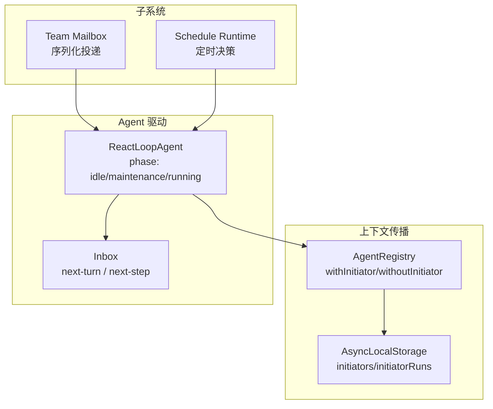
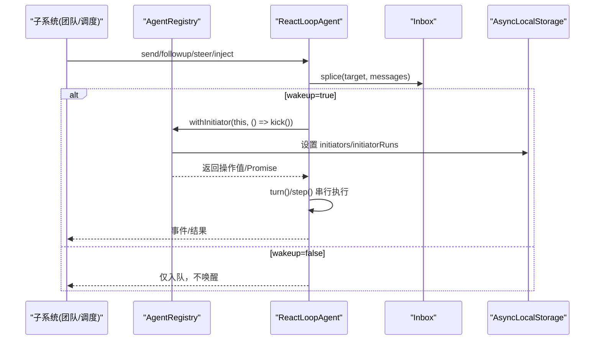
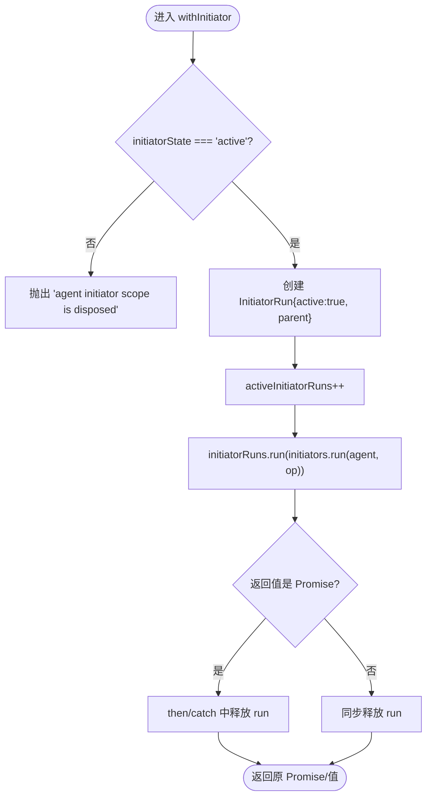
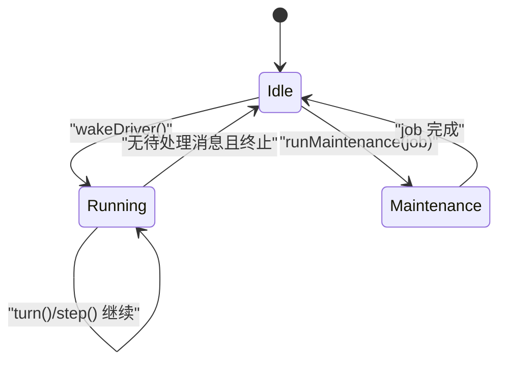
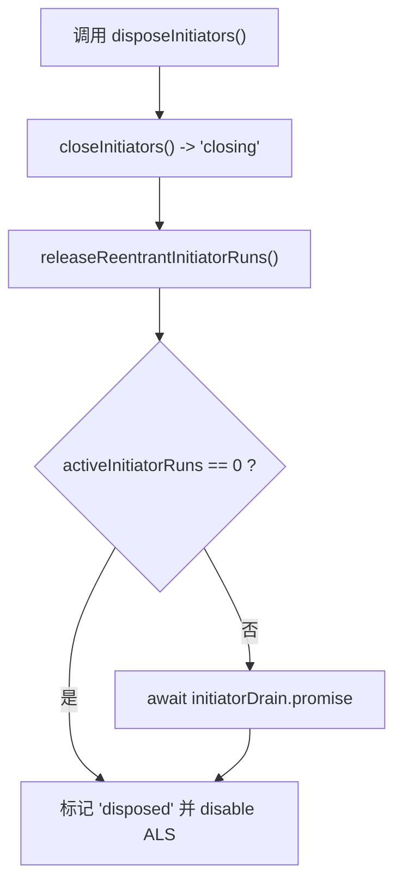
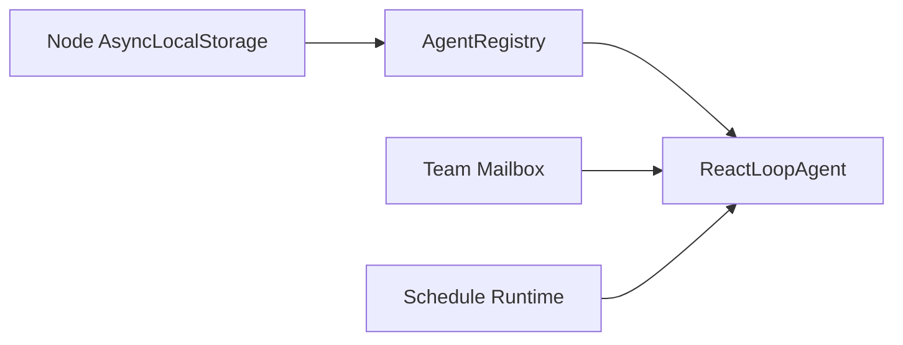

# 并发控制机制

<cite>
**本文引用的文件**
- [packages/core/agent/src/index.ts](file://packages/core/agent/src/index.ts)
- [packages/core/agent/tests/agent-initiator.spec.ts](file://packages/core/agent/tests/agent-initiator.spec.ts)
- [packages/core/agent-loop/src/agent.ts](file://packages/core/agent-loop/src/agent.ts)
- [packages/experimental/agent-team/src/mailbox.ts](file://packages/experimental/agent-team/src/mailbox.ts)
- [packages/schedule/schedule/src/runtime.ts](file://packages/schedule/schedule/src/runtime.ts)
- [.agents/notes/implemented/architecture/2026-07-15-agent-initiator-scope.md](file://.agents/notes/implemented/architecture/2026-07-15-agent-initiator-scope.md)
</cite>

## 目录
1. [简介](#简介)
2. [项目结构](#项目结构)
3. [核心组件](#核心组件)
4. [架构总览](#架构总览)
5. [详细组件分析](#详细组件分析)
6. [依赖关系分析](#依赖关系分析)
7. [性能考量](#性能考量)
8. [故障排查指南](#故障排查指南)
9. [结论](#结论)
10. [附录：使用示例与最佳实践](#附录使用示例与最佳实践)

## 简介
本文件系统性阐述 Agent 的并发控制机制，重点围绕 AgentRegistry 的并发安全设计、AsyncLocalStorage 的使用、InitiatorRun 状态管理、activeInitiatorRuns 计数器等关键组件；解释 withInitiator()、withoutInitiator()、currentInitiator() 等方法如何实现线程安全的上下文传播；说明 Agent 的并发执行模型（消息队列处理、任务调度策略、死锁避免）；并给出并发边界管理（initiatorState 状态机、closeInitiators()、disposeInitiators()）的实现原理与使用指南。

## 项目结构
Agent 并发控制涉及三层协作：
- 进程级上下文传播层：AgentRegistry 通过 AsyncLocalStorage 维护“发起者 Agent”的进程局部异步上下文，提供 withInitiator/withoutInitiator/currentInitiator/requireInitiator 等 API。
- Agent 驱动层：ReactLoopAgent 基于 Inbox 的消息队列和 phase 状态机驱动 turn/step 循环，并通过 withInitiator 将驱动链绑定到具体 Agent。
- 子系统集成层：如团队消息投递、定时调度等子系统在各自边界内调用 Agent API，确保并发与顺序约束。

图表来源
- [packages/core/agent/src/index.ts:250-337](file://packages/core/agent/src/index.ts#L250-L337)
- [packages/core/agent-loop/src/agent.ts:39-48](file://packages/core/agent-loop/src/agent.ts#L39-L48)
- [packages/experimental/agent-team/src/mailbox.ts:153-170](file://packages/experimental/agent-team/src/mailbox.ts#L153-L170)
- [packages/schedule/schedule/src/runtime.ts:217-249](file://packages/schedule/schedule/src/runtime.ts#L217-L249)

章节来源
- [packages/core/agent/src/index.ts:250-337](file://packages/core/agent/src/index.ts#L250-L337)
- [packages/core/agent-loop/src/agent.ts:39-48](file://packages/core/agent-loop/src/agent.ts#L39-L48)

## 核心组件
- AgentRegistry：进程级 Agent 注册表与“发起者”上下文载体。维护 initiators 与 initiatorRuns 两个 AsyncLocalStorage 实例，以及 initiatorState、activeInitiatorRuns、initiatorDrain、initiatorDisposal 等生命周期字段。
- InitiatorRun：记录一次 withInitiator 边界的活跃性与父链，用于 teardown 时正确释放计数与唤醒 drain。
- ReactLoopAgent：Agent 驱动，维护 phase（idle/maintenance/running），通过 wakeDriver/kick/turn/step 实现单驱动串行化执行，结合 Inbox 完成消息排队与调度。
- Team Mailbox 与 Schedule Runtime：在各自子系统边界内保证消息/任务的有序与可恢复性，避免并发竞争导致的重复或丢失。

章节来源
- [packages/core/agent/src/index.ts:215-258](file://packages/core/agent/src/index.ts#L215-L258)
- [packages/core/agent/src/index.ts:614-698](file://packages/core/agent/src/index.ts#L614-L698)
- [packages/core/agent-loop/src/agent.ts:39-48](file://packages/core/agent-loop/src/agent.ts#L39-L48)
- [packages/experimental/agent-team/src/mailbox.ts:153-170](file://packages/experimental/agent-team/src/mailbox.ts#L153-L170)
- [packages/schedule/schedule/src/runtime.ts:217-249](file://packages/schedule/schedule/src/runtime.ts#L217-L249)

## 架构总览
下图展示了从上层子系统到 Agent 驱动的完整调用链，以及“发起者”上下文如何在异步链路中传播。

图表来源
- [packages/core/agent-loop/src/agent.ts:125-144](file://packages/core/agent-loop/src/agent.ts#L125-L144)
- [packages/core/agent-loop/src/agent.ts:176-205](file://packages/core/agent-loop/src/agent.ts#L176-L205)
- [packages/core/agent/src/index.ts:323-353](file://packages/core/agent/src/index.ts#L323-L353)

## 详细组件分析

### AgentRegistry 并发安全设计
- 并发上下文存储
  - initiators：以 Agent | undefined 为值的 AsyncLocalStorage，承载当前“发起者 Agent”。
  - initiatorRuns：以 InitiatorRun 为值的 AsyncLocalStorage，记录边界嵌套链，用于 teardown 时释放计数。
- 状态机与计数器
  - initiatorState：'active' | 'closing' | 'disposed'，控制新边界是否允许创建。
  - activeInitiatorRuns：统计当前活跃的 withInitiator 边界数量，归零时触发 drain 完成。
  - initiatorDrain：PromiseWithResolvers<void>，供 disposeInitiators 等待所有已返回 Promise 的边界结束。
  - initiatorDisposal：缓存单次 dispose 流程，避免重复销毁。
- 关键方法
  - currentInitiator()：可选读取当前发起者，若 disposed 则抛错。
  - requireInitiator()：强制要求存在发起者，否则抛出“no initiating agent is active”。
  - withInitiator(agent, operation)：建立边界，保存返回值/Promise 精确身份，并在 settle 时释放 run。
  - withoutInitiator(operation)：清空发起者上下文，适用于后台任务、定时器、导出器等不应继承 Agent 的场景。
  - closeInitiators()：将状态切换为 closing，阻止新边界进入。
  - disposeInitiators()：先关闭新边界，再释放调用栈上的 reentrant runs，等待 activeInitiatorRuns 归零，最后禁用 ALS 并标记 disposed。
  - releaseReentrantInitiatorRuns()：释放当前 fiber 上所有嵌套边界，避免自身 teardown 被自己的 drain 阻塞。
  - releaseInitiatorRun(run)：将 run.active 置 false，递减计数器；当计数器归零时 resolve drain。

图表来源
- [packages/core/agent/src/index.ts:634-665](file://packages/core/agent/src/index.ts#L634-L665)
- [packages/core/agent/src/index.ts:614-632](file://packages/core/agent/src/index.ts#L614-L632)
- [packages/core/agent/src/index.ts:682-698](file://packages/core/agent/src/index.ts#L682-L698)

章节来源
- [packages/core/agent/src/index.ts:250-353](file://packages/core/agent/src/index.ts#L250-L353)
- [packages/core/agent/src/index.ts:614-698](file://packages/core/agent/src/index.ts#L614-L698)
- [packages/core/agent/tests/agent-initiator.spec.ts:37-265](file://packages/core/agent/tests/agent-initiator.spec.ts#L37-L265)

### 线程安全的上下文传播
- 隔离性：每个 withInitiator 调用都通过 AsyncLocalStorage 建立独立作用域，即使多个调用并发交错，各自的 requireInitiator() 始终返回正确的 Agent。
- 嵌套与清理：withInitiator 支持嵌套；withoutInitiator 可临时屏蔽继承的 Agent；异常（同步/异步）均能正确恢复外层上下文。
- 跨 Realm 兼容：测试覆盖跨 realm Promise 场景，确保边界在 await 后仍保持正确上下文。
- 精确返回值传递：withInitiator 保留 operation 的同步值或 Promise 对象身份，便于上层判断与组合。

章节来源
- [packages/core/agent/tests/agent-initiator.spec.ts:45-163](file://packages/core/agent/tests/agent-initiator.spec.ts#L45-L163)
- [packages/core/agent/tests/agent-initiator.spec.ts:165-265](file://packages/core/agent/tests/agent-initiator.spec.ts#L165-L265)

### Agent 并发执行模型
- 消息队列与目标
  - Inbox 支持 next-turn 与 next-step 两类目标，分别对应轮次边界与步骤边界。
  - send/followup/steer/inject 根据 wakeup 标志决定是否立即唤醒驱动。
- 驱动状态机
  - phase：idle → running（wakeDriver 开启）→ idle（kick finally 恢复）。maintenance 用于非用户请求的后台作业。
  - wakeRequested：在非 idle 阶段收到唤醒时 latch，收敛后自动重入。
- 任务调度策略
  - 单驱动串行：同一 Agent 在同一时刻只有一个 running 驱动，避免竞态。
  - 批处理：turn 内部循环 step，直到无更多 next-step 消息或达到终止条件。
- 死锁避免
  - 取消与中止：AbortController 贯穿 turn/step，确保取消快速传播。
  - 唤醒 latch：避免在 maintenance/aborted 阶段重复唤醒导致饥饿或抖动。
  - 驱动边界：错误与取消在驱动边界内捕获，不影响外部调用。

图表来源
- [packages/core/agent-loop/src/agent.ts:39-48](file://packages/core/agent-loop/src/agent.ts#L39-L48)
- [packages/core/agent-loop/src/agent.ts:125-174](file://packages/core/agent-loop/src/agent.ts#L125-L174)
- [packages/core/agent-loop/src/agent.ts:176-235](file://packages/core/agent-loop/src/agent.ts#L176-L235)

章节来源
- [packages/core/agent-loop/src/agent.ts:125-235](file://packages/core/agent-loop/src/agent.ts#L125-L235)

### 并发边界管理：initiatorState、closeInitiators、disposeInitiators
- initiatorState 状态机
  - active：允许创建新边界。
  - closing：拒绝新边界，但允许已返回 Promise 的边界继续运行直至 settle。
  - disposed：完全失效，任何访问都会抛错。
- closeInitiators()
  - 幂等地将 active 切换到 closing，防止新的 withInitiator/withoutInitiator 进入。
- disposeInitiators()
  - 先关闭新边界，再释放当前 fiber 上的嵌套边界（避免自阻塞）。
  - 若仍有活跃边界，等待 activeInitiatorRuns 归零（initiatorDrain.promise）。
  - 最终禁用 ALS 并标记 disposed，确保后续访问失败。

图表来源
- [packages/core/agent/src/index.ts:614-632](file://packages/core/agent/src/index.ts#L614-L632)
- [packages/core/agent/src/index.ts:682-698](file://packages/core/agent/src/index.ts#L682-L698)

章节来源
- [packages/core/agent/src/index.ts:614-698](file://packages/core/agent/src/index.ts#L614-L698)

### 子系统集成与并发边界
- 团队消息投递（Mailbox）
  - 对每条消息进行去重与序列化投递，避免重复消费与乱序。
  - 使用 AbortSignal 控制生命周期，确保在 dispose 时停止投递。
- 定时调度（Schedule Runtime）
  - 决策函数封装异常，避免固定频率决策失败影响运行时。
  - 预检查持久化后再做决策，减少无效唤醒。

章节来源
- [packages/experimental/agent-team/src/mailbox.ts:153-170](file://packages/experimental/agent-team/src/mailbox.ts#L153-L170)
- [packages/experimental/agent-team/src/mailbox.ts:234-270](file://packages/experimental/agent-team/src/mailbox.ts#L234-L270)
- [packages/schedule/schedule/src/runtime.ts:217-249](file://packages/schedule/schedule/src/runtime.ts#L217-L249)

## 依赖关系分析
- AgentRegistry 依赖 Node AsyncLocalStorage 实现进程局部异步上下文。
- ReactLoopAgent 依赖 AgentRegistry.withInitiator 将驱动链绑定到具体 Agent。
- 子系统（团队、调度）通过 Agent API 与驱动交互，遵守其并发与顺序契约。

图表来源
- [packages/core/agent/src/index.ts:250-353](file://packages/core/agent/src/index.ts#L250-L353)
- [packages/core/agent-loop/src/agent.ts:176-205](file://packages/core/agent-loop/src/agent.ts#L176-L205)

章节来源
- [packages/core/agent/src/index.ts:250-353](file://packages/core/agent/src/index.ts#L250-L353)
- [packages/core/agent-loop/src/agent.ts:176-205](file://packages/core/agent-loop/src/agent.ts#L176-L205)

## 性能考量
- 最小分配路径：withInitiator 仅在必要时包装 Promise，避免不必要的 then 链。
- 精准释放：通过 InitiatorRun.parent 链式释放，避免全局扫描。
- 单驱动串行：降低锁竞争与上下文切换开销。
- 唤醒节流：wakeRequested 避免频繁唤醒造成抖动。
- 子系统优化：
  - Mailbox 使用 inFlightMessages 去重与序列化，减少重复处理。
  - Schedule 决策失败降级为日志，避免阻塞主循环。

[本节为通用性能建议，不直接分析具体代码行]

## 故障排查指南
- 常见错误
  - “no initiating agent is active”：在 withoutInitiator 或无边界处调用 requireInitiator。
  - “agent initiator scope is disposed”：在 disposeInitiators 之后访问 currentInitiator/requireInitiator/withInitiator。
- 定位要点
  - 检查是否在合适的边界内调用 API。
  - 确认 disposeInitiators 是否已被调用，以及是否有未完成的 Promise 边界。
  - 验证子系统是否正确传递 AbortSignal，避免长驻任务泄漏。
- 调试技巧
  - 使用 currentInitiator 打印上下文，确认继承链。
  - 在 withInitiator 的 operation 中埋点，观察异步边界是否保持上下文。
  - 关注 activeInitiatorRuns 是否为 0，确保 drain 正常完成。

章节来源
- [packages/core/agent/src/index.ts:304-321](file://packages/core/agent/src/index.ts#L304-L321)
- [packages/core/agent/src/index.ts:678-680](file://packages/core/agent/src/index.ts#L678-L680)
- [packages/core/agent/tests/agent-initiator.spec.ts:37-43](file://packages/core/agent/tests/agent-initiator.spec.ts#L37-L43)
- [packages/core/agent/tests/agent-initiator.spec.ts:165-186](file://packages/core/agent/tests/agent-initiator.spec.ts#L165-L186)

## 结论
AgentRegistry 通过 AsyncLocalStorage 与严谨的状态机实现了进程级并发安全的“发起者”上下文传播；配合 ReactLoopAgent 的单驱动串行模型与 Inbox 队列，确保了 Agent 执行的有序性与可恢复性。子系统在各自边界内遵循这些契约，避免了重复、丢失与死锁。开发者应严格在合适边界内使用 withInitiator/withoutInitiator，并正确处理异常与取消，以获得稳定高效的并发行为。

[本节为总结性内容，不直接分析具体代码行]

## 附录：使用示例与最佳实践
以下示例以“代码片段路径”形式给出，便于读者在仓库中定位实现与测试用例。

- 基本用法：在驱动链中获取发起者
  - 参考：[packages/core/agent/src/index.ts:304-321](file://packages/core/agent/src/index.ts#L304-L321)
- 建立边界：包裹异步操作并保持返回值身份
  - 参考：[packages/core/agent/src/index.ts:323-353](file://packages/core/agent/src/index.ts#L323-L353)
- 清除上下文：后台任务不使用发起者
  - 参考：[packages/core/agent/src/index.ts:340-353](file://packages/core/agent/src/index.ts#L340-L353)
- 并发隔离：重叠边界互不干扰
  - 参考：[packages/core/agent/tests/agent-initiator.spec.ts:104-125](file://packages/core/agent/tests/agent-initiator.spec.ts#L104-L125)
- 异常恢复：同步/异步异常后上下文正确恢复
  - 参考：[packages/core/agent/tests/agent-initiator.spec.ts:146-163](file://packages/core/agent/tests/agent-initiator.spec.ts#L146-L163)
- 生命周期：关闭与销毁
  - 参考：[packages/core/agent/src/index.ts:614-632](file://packages/core/agent/src/index.ts#L614-L632)
- 驱动集成：Agent 启动驱动并绑定发起者
  - 参考：[packages/core/agent-loop/src/agent.ts:176-205](file://packages/core/agent-loop/src/agent.ts#L176-L205)
- 消息入队与唤醒：send/followup/steer/inject
  - 参考：[packages/core/agent-loop/src/agent.ts:125-144](file://packages/core/agent-loop/src/agent.ts#L125-L144)
- 子系统序列化：团队消息投递
  - 参考：[packages/experimental/agent-team/src/mailbox.ts:153-170](file://packages/experimental/agent-team/src/mailbox.ts#L153-L170)
- 调度容错：固定频率决策失败降级
  - 参考：[packages/schedule/schedule/src/runtime.ts:217-249](file://packages/schedule/schedule/src/runtime.ts#L217-L249)

最佳实践清单
- 始终在 withInitiator 边界内调用 requireInitiator；如需后台任务，使用 withoutInitiator。
- 对可能长时间运行的 Promise 使用 whenIdle 或 AbortSignal 控制生命周期。
- 在 disposeInitiators 之前确保没有悬挂的 withInitiator 边界。
- 子系统在投递/调度时遵循去重与序列化原则，避免重复与竞态。
- 捕获并上报错误，避免未处理异常污染上下文。

[本节为使用指导，不直接分析具体代码行]