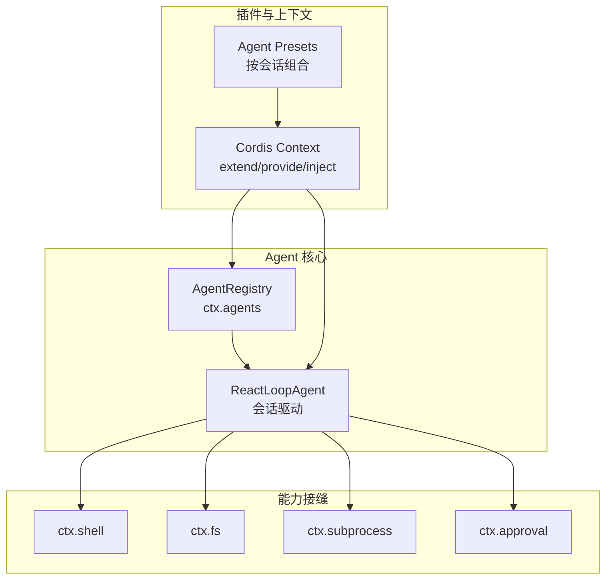
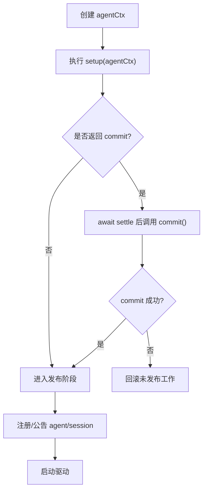
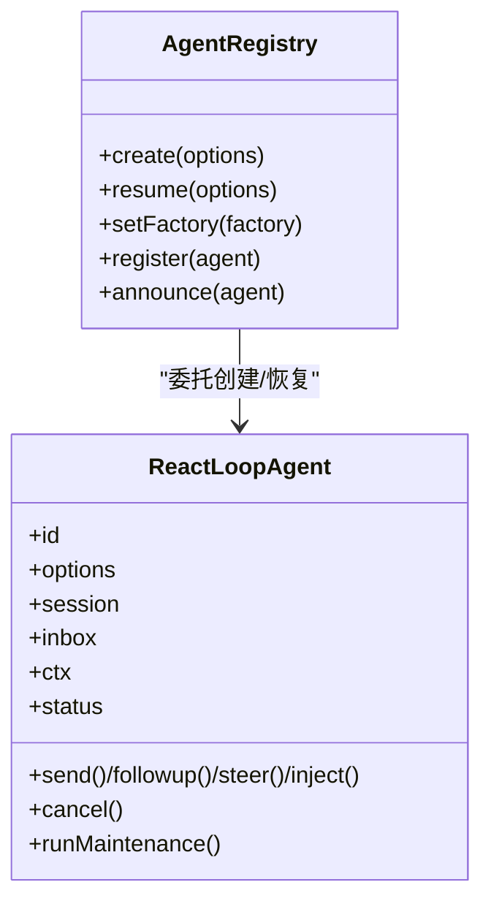
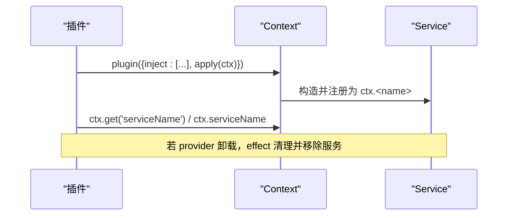
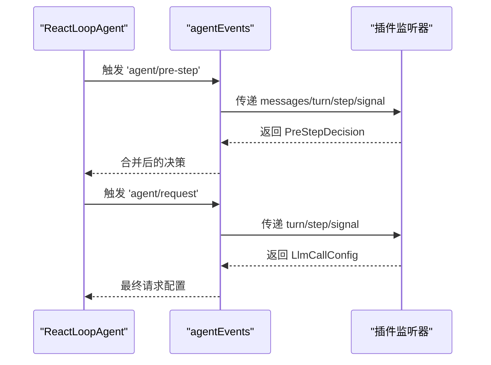
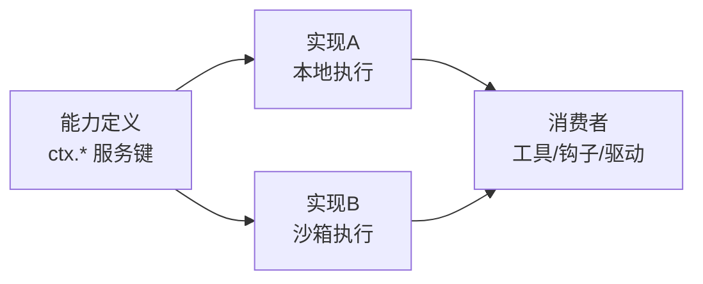
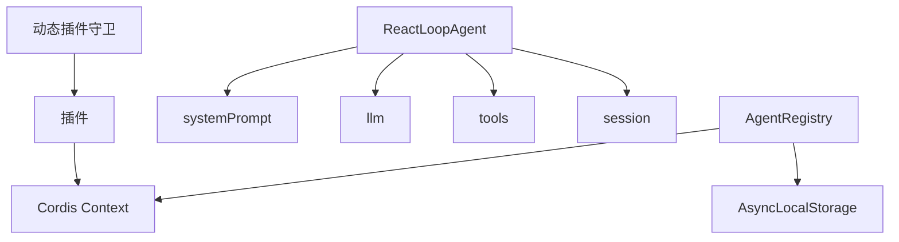

# 扩展机制设计

<cite>
**本文引用的文件**
- [packages/core/agent/src/index.ts](file://packages/core/agent/src/index.ts)
- [packages/core/agent-loop/src/agent.ts](file://packages/core/agent-loop/src/agent.ts)
- [docs/capability-seams.md](file://docs/capability-seams.md)
- [docs/cordis-api/context.md](file://docs/cordis-api/context.md)
- [docs/cordis-api/service.md](file://docs/cordis-api/service.md)
- [packages/preset/agent-presets/src/index.ts](file://packages/preset/agent-presets/src/index.ts)
- [packages/host/directory-picker/README.md](file://packages/host/directory-picker/README.md)
- [packages/subagent/subagent-acp/README.md](file://packages/subagent/subagent-acp/README.md)
- [packages/extensions/tool-cordis/README.zh.md](file://packages/extensions/tool-cordis/README.zh.md)
- [packages/fs/tool-fs-search/README.zh.md](file://packages/fs/tool-fs-search/README.zh.md)
- [packages/code-runtime/code-runtime/tests/service.spec.ts](file://packages/code-runtime/code-runtime/tests/service.spec.ts)
- [packages/client/ui-reference/tests/browser-plugin.client.spec.ts](file://packages/client/ui-reference/tests/browser-plugin.client.spec.ts)
- [packages/typert/registry/src/service.ts](file://packages/typert/registry/src/service.ts)
- [packages/extensions/cordis-client-runner/src/client/guard.ts](file://packages/extensions/cordis-client-runner/src/client/guard.ts)
</cite>

## 目录
1. [简介](#简介)
2. [项目结构](#项目结构)
3. [核心组件](#核心组件)
4. [架构总览](#架构总览)
5. [详细组件分析](#详细组件分析)
6. [依赖关系分析](#依赖关系分析)
7. [性能考量](#性能考量)
8. [故障排查指南](#故障排查指南)
9. [结论](#结论)
10. [附录：开发者扩展指南](#附录开发者扩展指南)

## 简介
本文件系统性阐述 Agent 扩展机制的设计与实现，覆盖以下主题：
- Agent 扩展点：AgentSetup、AgentSetupCommit、插件组合模式
- 服务注入机制：Context 扩展、Service 注册、依赖注入容器
- 钩子系统：生命周期钩子、事件监听器、条件钩子
- 能力接缝模式：抽象接口定义、具体实现替换、运行时配置
- 实战示例：如何扩展 Agent 功能（自定义类型、实现扩展接口、配置扩展点）

目标是帮助开发者在不侵入核心代码的前提下，安全、可组合地扩展 Agent 行为。

## 项目结构
Agent 扩展机制由“核心服务 + 循环驱动 + 能力接缝 + 插件系统”构成：
- 核心服务：AgentRegistry（ctx.agents）提供工厂委托、创建/恢复、注册、作用域传播等能力
- 循环驱动：ReactLoopAgent 负责会话轮次、步骤、工具调用、LLM 流式输出与错误处理
- 能力接缝：通过 ctx.* 服务键暴露可插拔能力（如 shell、fs、subprocess、approval 等）
- 插件系统：Cordis Context/Fiber/Service 提供依赖注入、作用域隔离、生命周期管理



图表来源
- [packages/core/agent/src/index.ts:250-425](file://packages/core/agent/src/index.ts#L250-L425)
- [packages/core/agent-loop/src/agent.ts:70-205](file://packages/core/agent-loop/src/agent.ts#L70-L205)
- [docs/capability-seams.md:493-566](file://docs/capability-seams.md#L493-L566)

章节来源
- [packages/core/agent/src/index.ts:250-425](file://packages/core/agent/src/index.ts#L250-L425)
- [packages/core/agent-loop/src/agent.ts:70-205](file://packages/core/agent-loop/src/agent.ts#L70-L205)
- [docs/capability-seams.md:493-566](file://docs/capability-seams.md#L493-L566)

## 核心组件
- AgentRegistry（ctx.agents）
  - 提供 setFactory(create/resume)、create、resume、register、announce、enter、get/list/roots 等方法
  - 维护 Agent 实例集合、创建工厂槽位、发起者作用域传播（AsyncLocalStorage）
  - 通过 effect 管理生命周期与清理
- ReactLoopAgent
  - 驱动 turn/step 边界、构建请求、执行 LLM 流、处理工具调用、状态机推进
  - 使用 systemPrompt 组装上下文、通过 agentEvents 分发 pre-step/request/error 等钩子
- Cordis Context/Service
  - 通过 extend 创建子作用域、provide 注册服务、inject 声明依赖
  - Service 基类自动注册到 ctx.<name>，并随 Fiber 卸载而清理

章节来源
- [packages/core/agent/src/index.ts:250-702](file://packages/core/agent/src/index.ts#L250-L702)
- [packages/core/agent-loop/src/agent.ts:70-590](file://packages/core/agent-loop/src/agent.ts#L70-L590)
- [docs/cordis-api/context.md:1-186](file://docs/cordis-api/context.md#L1-L186)
- [docs/cordis-api/service.md:1-103](file://docs/cordis-api/service.md#L1-L103)

## 架构总览
Agent 扩展以“能力接缝”为中心：核心只依赖抽象的 ctx.* 服务键，具体实现由不同包提供；插件通过 Context 扩展和 Service 注册接入；Agent 创建/恢复流程通过 AgentSetup/Commit 在发布前完成可回滚的组合。

```mermaid
sequenceDiagram
participant Caller as "调用方"
participant Registry as "AgentRegistry"
participant Factory as "AgentFactory(实现)"
participant Loop as "ReactLoopAgent"
participant Ctx as "Cordis Context"
Caller->>Registry : create(options)
Registry->>Factory : createAgent(ownerCtx, options)
Factory->>Ctx : 创建 agentCtx = scope.extend({agent})
Factory->>Factory : 可选 setup(agentCtx)
Factory->>Factory : 可选 commit()
Factory->>Registry : register(agent) / announce(agent)
Registry-->>Caller : AgentHandle
Note over Loop,Ctx : 启动后通过 agentEvents 分发 pre-step/request 等钩子
```

图表来源
- [packages/core/agent/src/index.ts:367-425](file://packages/core/agent/src/index.ts#L367-L425)
- [packages/core/agent-loop/src/agent.ts:91-108](file://packages/core/agent-loop/src/agent.ts#L91-L108)

## 详细组件分析

### AgentSetup 与 AgentSetupCommit 机制
- AgentSetup：在 Agent 发布前，于 unpublished 的 agentCtx 中执行组合逻辑（注册工具、提示词片段、变量、限制等），可返回同步或异步的 AgentSetupCommit
- AgentSetupCommit：在 setup await settle 之后、立即于发布前执行，用于最终校验与提交；失败将回滚整个未发布的 Agent/Session
- 语义保障：setup 期间的所有注册在 session/created、agent/created、agent/session-start 之前可见；任何抛错或 owner 释放都会回滚



图表来源
- [packages/core/agent/src/index.ts:43-62](file://packages/core/agent/src/index.ts#L43-L62)
- [packages/core/agent/src/index.ts:107-125](file://packages/core/agent/src/index.ts#L107-L125)

章节来源
- [packages/core/agent/src/index.ts:43-62](file://packages/core/agent/src/index.ts#L43-L62)
- [packages/core/agent/src/index.ts:107-125](file://packages/core/agent/src/index.ts#L107-L125)

### 插件组合模式与 Agent 作用域
- 每个 Agent 拥有独立 Scope 与 Context，通过 extend 注入 agent 引用，形成作用域隔离
- 子 Agent 可通过“加入父 Agent 的相同组成”继承已组合的能力（非重新解析，而是绑定同一实例）
- 组合发生在 unpublished 阶段，确保外部观察者不会看到中间态



图表来源
- [packages/core/agent/src/index.ts:250-425](file://packages/core/agent/src/index.ts#L250-L425)
- [packages/core/agent-loop/src/agent.ts:70-205](file://packages/core/agent-loop/src/agent.ts#L70-L205)
- [packages/preset/agent-presets/src/index.ts:429-451](file://packages/preset/agent-presets/src/index.ts#L429-L451)

章节来源
- [packages/core/agent/src/index.ts:250-425](file://packages/core/agent/src/index.ts#L250-L425)
- [packages/core/agent-loop/src/agent.ts:70-205](file://packages/core/agent-loop/src/agent.ts#L70-L205)
- [packages/preset/agent-presets/src/index.ts:429-451](file://packages/preset/agent-presets/src/index.ts#L429-L451)

### 服务注入机制：Context 扩展、Service 注册、依赖注入容器
- Context 扩展：通过 extend 创建子上下文，支持元数据遮蔽与继承；所有服务读取走代理解析
- Service 注册：继承 Service 基类的插件自动注册为 ctx.<name>，并在 Fiber 卸载时移除
- 依赖注入：通过 inject 声明所需服务，动态加载时等待提供者就绪；guard 层对动态插件进行白名单校验



图表来源
- [docs/cordis-api/context.md:1-186](file://docs/cordis-api/context.md#L1-L186)
- [docs/cordis-api/service.md:1-103](file://docs/cordis-api/service.md#L1-L103)
- [packages/extensions/cordis-client-runner/src/client/guard.ts:180-204](file://packages/extensions/cordis-client-runner/src/client/guard.ts#L180-L204)
- [packages/code-runtime/code-runtime/tests/service.spec.ts:74-88](file://packages/code-runtime/code-runtime/tests/service.spec.ts#L74-L88)

章节来源
- [docs/cordis-api/context.md:1-186](file://docs/cordis-api/context.md#L1-L186)
- [docs/cordis-api/service.md:1-103](file://docs/cordis-api/service.md#L1-L103)
- [packages/extensions/cordis-client-runner/src/client/guard.ts:180-204](file://packages/extensions/cordis-client-runner/src/client/guard.ts#L180-L204)
- [packages/code-runtime/code-runtime/tests/service.spec.ts:74-88](file://packages/code-runtime/code-runtime/tests/service.spec.ts#L74-L88)

### 钩子系统：生命周期钩子、事件监听器、条件钩子
- 生命周期钩子：ReactLoopAgent 在 turn/step 边界、request 构建、错误处理等关键点触发事件
- 事件监听器：通过 agentEvents 提供的 waterfall/serial 分发，允许插件拦截/改写下一步决策
- 条件钩子：基于消息、工具调用、模型响应等上下文进行条件判断，决定进入/拒绝/重试等



图表来源
- [packages/core/agent-loop/src/agent.ts:237-255](file://packages/core/agent-loop/src/agent.ts#L237-L255)
- [packages/core/agent-loop/src/agent.ts:484-588](file://packages/core/agent-loop/src/agent.ts#L484-L588)

章节来源
- [packages/core/agent-loop/src/agent.ts:237-255](file://packages/core/agent-loop/src/agent.ts#L237-L255)
- [packages/core/agent-loop/src/agent.ts:484-588](file://packages/core/agent-loop/src/agent.ts#L484-L588)

### 能力接缝模式：抽象接口、实现替换、运行时配置
- 抽象接口：通过 ctx.* 服务键定义能力契约（如 ctx.shell、ctx.fs、ctx.subprocess、ctx.approval）
- 实现替换：不同包提供具体实现（如 bash-local、bash-sandbox、fs-local、fs-sandbox），通过 Service 注册覆盖
- 运行时配置：通过 settings、presets、Typert 宿主上下文等机制在运行时选择/切换实现



图表来源
- [docs/capability-seams.md:493-566](file://docs/capability-seams.md#L493-L566)

章节来源
- [docs/capability-seams.md:493-566](file://docs/capability-seams.md#L493-L566)

### 运行时配置与宿主上下文
- Typert 宿主上下文：通过 configureHost/registerHost 注册跨进程上下文解析器，支持按标识符解析 Agent/Session 上下文
- 宿主不变式：某些能力不发布伴生入口，仅在其所属接缝内约束行为，避免越界依赖

章节来源
- [packages/typert/registry/src/service.ts:395-424](file://packages/typert/registry/src/service.ts#L395-L424)
- [packages/host/directory-picker/README.md:113-114](file://packages/host/directory-picker/README.md#L113-L114)
- [packages/subagent/subagent-acp/README.md:179-180](file://packages/subagent/subagent-acp/README.md#L179-L180)
- [packages/extensions/tool-cordis/README.zh.md:196-197](file://packages/extensions/tool-cordis/README.zh.md#L196-L197)
- [packages/fs/tool-fs-search/README.zh.md:229-230](file://packages/fs/tool-fs-search/README.zh.md#L229-L230)

## 依赖关系分析
- AgentRegistry 依赖 Cordis Context/Service/Fiber 与 AsyncLocalStorage，管理 Agent 生命周期与作用域
- ReactLoopAgent 依赖 systemPrompt、llm、tools、session 等能力接缝，驱动会话执行
- 插件通过 inject 声明依赖，动态加载时受 guard 白名单保护，确保最小权限



图表来源
- [packages/core/agent/src/index.ts:250-702](file://packages/core/agent/src/index.ts#L250-L702)
- [packages/core/agent-loop/src/agent.ts:70-590](file://packages/core/agent-loop/src/agent.ts#L70-L590)
- [packages/extensions/cordis-client-runner/src/client/guard.ts:180-204](file://packages/extensions/cordis-client-runner/src/client/guard.ts#L180-L204)

章节来源
- [packages/core/agent/src/index.ts:250-702](file://packages/core/agent/src/index.ts#L250-L702)
- [packages/core/agent-loop/src/agent.ts:70-590](file://packages/core/agent-loop/src/agent.ts#L70-L590)
- [packages/extensions/cordis-client-runner/src/client/guard.ts:180-204](file://packages/extensions/cordis-client-runner/src/client/guard.ts#L180-L204)

## 性能考量
- 热路径优化：ReactLoopAgent 在构造时融合调度器，减少热点分配
- 流式处理：LLM 流式响应逐步推送，降低内存峰值
- 作用域隔离：Agent 级 Scope 与 Context 隔离，避免全局污染与锁竞争
- 事件分发：waterfall/serial 控制并发与顺序，避免不必要的全量广播

[本节为通用指导，无需特定文件引用]

## 故障排查指南
- 重复服务注册：同一 Context 下重复 provide 会抛出异常；检查插件注入与卸载顺序
- 无 Agent 工厂：在未注册工厂前调用 create/resume 会报错；确认已加载 agent-loop 插件
- 动态插件访问受限：动态插件只能通过 declare 的服务访问，否则被守卫拒绝
- 作用域失效：Fiber 卸载后服务移除；确保订阅/定时器在 effect 中注册并返回清理函数

章节来源
- [packages/code-runtime/code-runtime/tests/service.spec.ts:74-88](file://packages/code-runtime/code-runtime/tests/service.spec.ts#L74-L88)
- [packages/core/agent/src/index.ts:367-425](file://packages/core/agent/src/index.ts#L367-L425)
- [packages/extensions/cordis-client-runner/src/client/guard.ts:180-204](file://packages/extensions/cordis-client-runner/src/client/guard.ts#L180-L204)

## 结论
Agent 扩展机制以“能力接缝 + 插件组合 + 作用域隔离”为核心，通过 AgentSetup/Commit 保证发布前组合的可回滚性，借助 Cordis Context/Service 提供稳定的依赖注入与生命周期管理，配合 agentEvents 钩子实现灵活的运行时行为定制。该设计使扩展点清晰、可替换、可组合，且对核心代码侵入最小。

[本节为总结，无需特定文件引用]

## 附录：开发者扩展指南

### 如何扩展 Agent 功能（步骤与示例指引）
- 自定义 Agent 类型
  - 通过实现 AgentFactory.createAgent/resume 委托创建与恢复 Agent
  - 参考路径：[packages/core/agent/src/index.ts:170-208](file://packages/core/agent/src/index.ts#L170-L208)
- 实现扩展接口（能力接缝）
  - 定义/使用 ctx.* 服务键（如 ctx.shell、ctx.fs、ctx.subprocess）
  - 通过 Service 注册具体实现，供工具/钩子消费
  - 参考路径：[docs/capability-seams.md:493-566](file://docs/capability-seams.md#L493-L566)
- 配置扩展点（AgentSetup/Commit）
  - 在 setup 中注册工具、提示词片段、变量、限制等
  - 如需最终校验，返回 commit 在发布前执行
  - 参考路径：[packages/core/agent/src/index.ts:43-62](file://packages/core/agent/src/index.ts#L43-L62), [packages/core/agent/src/index.ts:107-125](file://packages/core/agent/src/index.ts#L107-L125)
- 使用 Context 扩展与服务注入
  - 通过 extend 创建子上下文，通过 provide/inject 管理服务
  - 动态插件需声明 inject 白名单
  - 参考路径：[docs/cordis-api/context.md:1-186](file://docs/cordis-api/context.md#L1-L186), [docs/cordis-api/service.md:1-103](file://docs/cordis-api/service.md#L1-L103), [packages/extensions/cordis-client-runner/src/client/guard.ts:180-204](file://packages/extensions/cordis-client-runner/src/client/guard.ts#L180-L204)
- 利用钩子系统
  - 监听 agentEvents 的 pre-step/request/error 等事件，实现条件控制
  - 参考路径：[packages/core/agent-loop/src/agent.ts:237-255](file://packages/core/agent-loop/src/agent.ts#L237-L255), [packages/core/agent-loop/src/agent.ts:484-588](file://packages/core/agent-loop/src/agent.ts#L484-L588)
- 组合与继承
  - 子 Agent 可加入父 Agent 的相同组成，继承已组合能力
  - 参考路径：[packages/preset/agent-presets/src/index.ts:429-451](file://packages/preset/agent-presets/src/index.ts#L429-L451)

章节来源
- [packages/core/agent/src/index.ts:43-62](file://packages/core/agent/src/index.ts#L43-L62)
- [packages/core/agent/src/index.ts:107-125](file://packages/core/agent/src/index.ts#L107-L125)
- [packages/core/agent/src/index.ts:170-208](file://packages/core/agent/src/index.ts#L170-L208)
- [docs/capability-seams.md:493-566](file://docs/capability-seams.md#L493-L566)
- [docs/cordis-api/context.md:1-186](file://docs/cordis-api/context.md#L1-L186)
- [docs/cordis-api/service.md:1-103](file://docs/cordis-api/service.md#L1-L103)
- [packages/extensions/cordis-client-runner/src/client/guard.ts:180-204](file://packages/extensions/cordis-client-runner/src/client/guard.ts#L180-L204)
- [packages/core/agent-loop/src/agent.ts:237-255](file://packages/core/agent-loop/src/agent.ts#L237-L255)
- [packages/core/agent-loop/src/agent.ts:484-588](file://packages/core/agent-loop/src/agent.ts#L484-L588)
- [packages/preset/agent-presets/src/index.ts:429-451](file://packages/preset/agent-presets/src/index.ts#L429-L451)