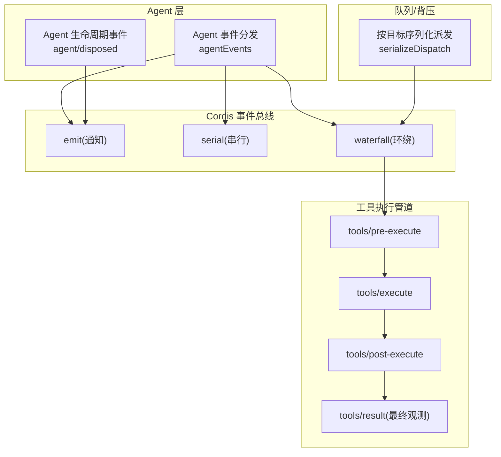
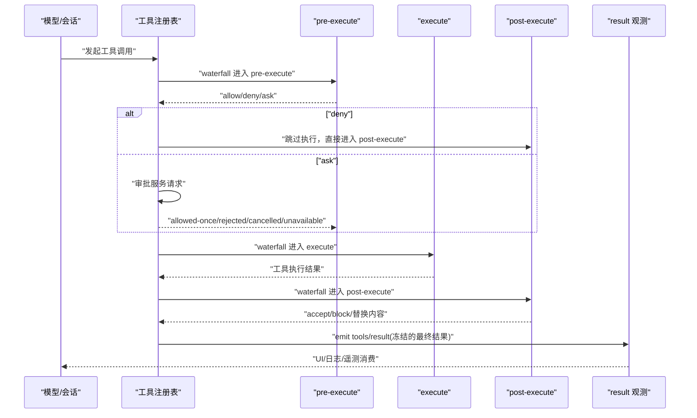
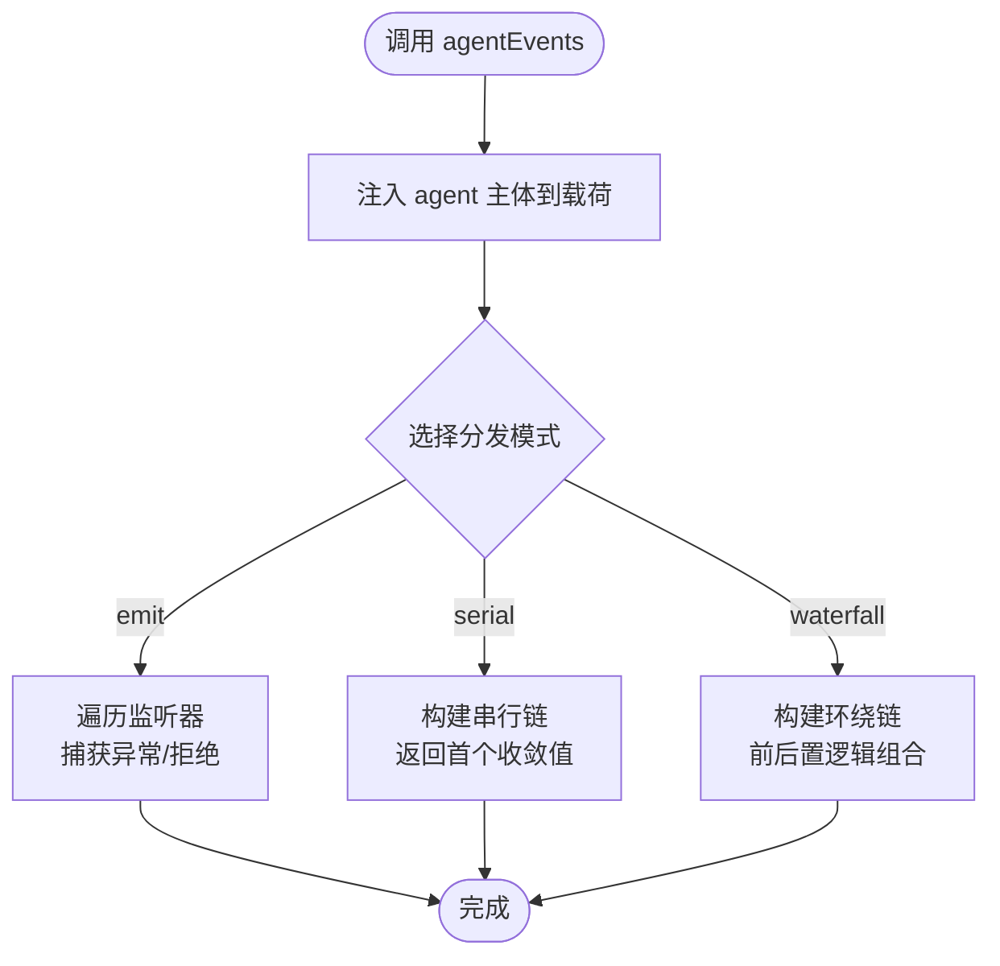
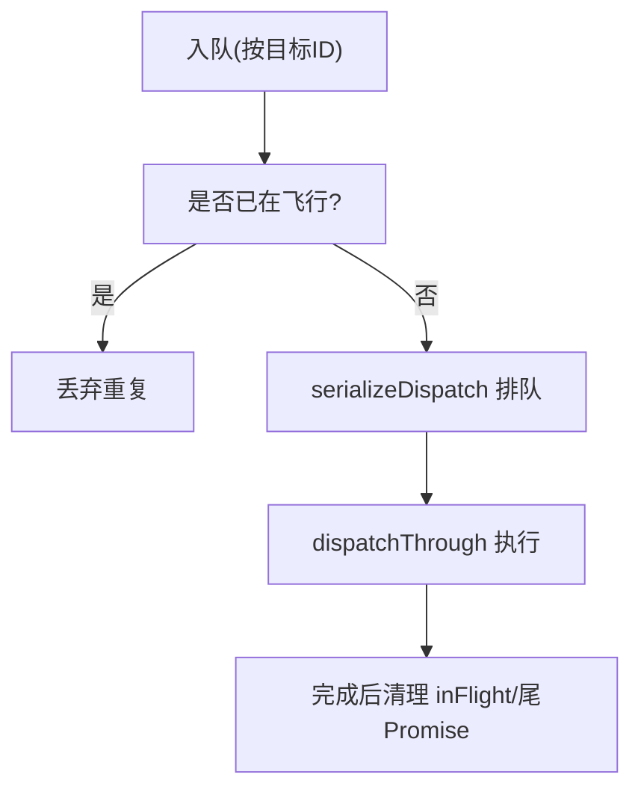
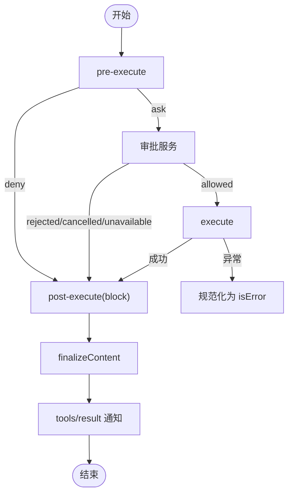
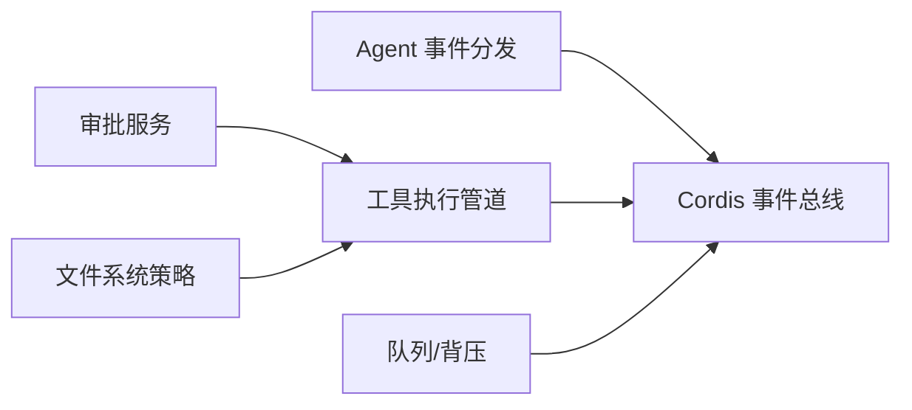

# 消息处理流程

<cite>
**本文引用的文件**
- [packages/core/agent/src/dispatch.ts](file://packages/core/agent/src/dispatch.ts)
- [packages/core/agent/src/index.ts](file://packages/core/agent/src/index.ts)
- [packages/core/tools/src/index.ts](file://packages/core/tools/src/index.ts)
- [packages/experimental/agent-team/src/mailbox.ts](file://packages/experimental/agent-team/src/mailbox.ts)
- [docs/event-producer-consumer.md](file://docs/event-producer-consumer.md)
- [docs/tool-execution-pipeline.md](file://docs/tool-execution-pipeline.md)
- [scripts/gen-doc-graphs.ts](file://scripts/gen-doc-graphs.ts)
- [packages/hooks/README.zh.md](file://packages/hooks/README.zh.md)
- [.agents/notes/implemented/feature/2026-06-30-interception-extension-points.zh.md](file://.agents/notes/implemented/feature/2026-06-30-interception-extension-points.zh.md)
</cite>

## 目录
1. [简介](#简介)
2. [项目结构](#项目结构)
3. [核心组件](#核心组件)
4. [架构总览](#架构总览)
5. [详细组件分析](#详细组件分析)
6. [依赖关系分析](#依赖关系分析)
7. [性能考量](#性能考量)
8. [故障排查指南](#故障排查指南)
9. [结论](#结论)
10. [附录](#附录)

## 简介
本文件系统性梳理 Agent 消息处理流程，覆盖事件系统、消息路由、生产者-消费者模式（队列与背压）、工具执行管道集成、扩展点（钩子与拦截器），并提供开发实践与调试建议。目标是帮助开发者在不深入源码的情况下也能正确设计、实现和排错 Agent 的消息处理链路。

## 项目结构
Agent 消息处理由“事件总线 + 调度器 + 工具执行管道”构成：
- 事件系统：基于 Cordis Context 的 emit/serial/waterfall 三种分发语义，提供通知、串行、环绕能力。
- 调度器：将 Agent 主体与其作用域载体绑定，确保事件主题与作用域一致。
- 工具执行管道：以 waterfalls 串联 pre-execute / execute / post-execute，并配合审批、沙箱、结果规范化与最终观测。
- 队列与背压：在跨进程或持久化场景中通过序列化派发与尾 Promise 控制并发与顺序。

图表来源
- [packages/core/agent/src/dispatch.ts:107-149](file://packages/core/agent/src/dispatch.ts#L107-L149)
- [packages/core/agent/src/index.ts:522-535](file://packages/core/agent/src/index.ts#L522-L535)
- [packages/core/tools/src/index.ts:1560-1612](file://packages/core/tools/src/index.ts#L1560-L1612)
- [packages/experimental/agent-team/src/mailbox.ts:192-209](file://packages/experimental/agent-team/src/mailbox.ts#L192-L209)

章节来源
- [packages/core/agent/src/dispatch.ts:107-149](file://packages/core/agent/src/dispatch.ts#L107-L149)
- [packages/core/agent/src/index.ts:522-535](file://packages/core/agent/src/index.ts#L522-L535)
- [packages/core/tools/src/index.ts:1560-1612](file://packages/core/tools/src/index.ts#L1560-L1612)
- [packages/experimental/agent-team/src/mailbox.ts:192-209](file://packages/experimental/agent-team/src/mailbox.ts#L192-L209)

## 核心组件
- Agent 事件分发器 agentEvents：将 Agent 主体注入到事件载荷中，并通过 Cordis 的 emit/serial/waterfall 完成通知、串行与环绕调用。
- Agent 生命周期事件：如 agent/disposed，使用 emit 广播，监听器异常被捕获并记录，避免阻塞后续监听器。
- 工具执行管道：pre-execute/execute/post-execute 三段式 waterfall，支持审批、超时、重试、结果重写与最终观测。
- 队列与背压：按目标 ID 序列化派发，保证同一目标的有序性与去重；通过 in-flight 集合与尾 Promise 管理并发。

章节来源
- [packages/core/agent/src/dispatch.ts:28-82](file://packages/core/agent/src/dispatch.ts#L28-L82)
- [packages/core/agent/src/dispatch.ts:107-149](file://packages/core/agent/src/dispatch.ts#L107-L149)
- [packages/core/agent/src/index.ts:522-535](file://packages/core/agent/src/index.ts#L522-L535)
- [packages/core/tools/src/index.ts:1560-1612](file://packages/core/tools/src/index.ts#L1560-L1612)
- [packages/experimental/agent-team/src/mailbox.ts:153-209](file://packages/experimental/agent-team/src/mailbox.ts#L153-L209)

## 架构总览
下图展示从模型侧触发工具调用到最终结果观测的完整链路，包括策略拦截、审批、执行、后处理与结果归一化。

图表来源
- [docs/tool-execution-pipeline.md:8-60](file://docs/tool-execution-pipeline.md#L8-L60)
- [packages/core/tools/src/index.ts:1560-1612](file://packages/core/tools/src/index.ts#L1560-L1612)
- [packages/core/tools/src/index.ts:1733-1772](file://packages/core/tools/src/index.ts#L1733-L1772)

## 详细组件分析

### Agent 事件系统与路由策略
- 事件类型与语义
  - emit：通知型，非否决，监听器抛错或拒绝均被捕获并记录，不阻塞后续监听器。
  - serial：串行链，首个返回值作为结果，适合需要顺序收敛的场景。
  - waterfall：环绕中间件，允许前置/后置逻辑组合，适合策略与审计。
- 路由与主体注入
  - agentEvents 将 Agent 主体注入载荷，确保事件主题与作用域一致，防止 payload 中的 agent 字段覆盖。
  - 通过 scopeTarget 绑定 thisArg，使监听器可在 Agent 作用域内访问上下文。
- 典型用法
  - 生命周期事件：agent/disposed 使用 emit 广播，监听器异常隔离。
  - 状态变更：agent/status 等通过 emit 通知订阅者。
  - 停止信号：agent/turn-stopping 通过 serial 传递中止信号。

图表来源
- [packages/core/agent/src/dispatch.ts:107-149](file://packages/core/agent/src/dispatch.ts#L107-L149)
- [packages/core/agent/src/index.ts:522-535](file://packages/core/agent/src/index.ts#L522-L535)

章节来源
- [packages/core/agent/src/dispatch.ts:28-82](file://packages/core/agent/src/dispatch.ts#L28-L82)
- [packages/core/agent/src/dispatch.ts:107-149](file://packages/core/agent/src/dispatch.ts#L107-L149)
- [packages/core/agent/src/index.ts:522-535](file://packages/core/agent/src/index.ts#L522-L535)

### 消息的生产者-消费者模式与队列
- 生产者
  - 各子系统通过 Cordis 事件总线发布消息（emit/serial/waterfall）。
  - 工具调用作为特殊消息流，经 pre/around/post 三段水落管线处理。
- 消费者
  - 监听器订阅特定事件名，进行策略判断、审计、渲染或副作用处理。
- 队列与背压
  - 针对持久化或跨进程场景，按目标 ID 序列化派发，保证顺序与去重。
  - 使用 inFlightMessages 跟踪进行中消息，避免重复投递。
  - 通过 dispatchTails 维护每个目标的尾 Promise，形成单发队列。
- 优先级
  - 当前实现未暴露显式优先级队列；如需优先级，可在入队前对消息排序或在消费端按策略分流。

图表来源
- [packages/experimental/agent-team/src/mailbox.ts:153-209](file://packages/experimental/agent-team/src/mailbox.ts#L153-L209)

章节来源
- [packages/experimental/agent-team/src/mailbox.ts:153-209](file://packages/experimental/agent-team/src/mailbox.ts#L153-L209)

### 工具执行管道与错误传播
- 三段式流水线
  - pre-execute：权限、沙箱、审批 ask 决策。
  - execute：超时、重试、指标收集等 around 包装。
  - post-execute：接受/阻止/替换内容，附加上下文。
- 结果规范化与最终观测
  - 规范化失败会被转换为 isError 结果。
  - finalizeContent 仅做内容级不变量校验。
  - tools/result 同步通知，携带冻结的最终结果。
- 错误传播
  - 任意阶段抛出异常都会被捕获并转为 isError。
  - 审批不可用或缺失时降级为 deny。
  - 取消信号融合：若调用方提前取消，根据工具体是否已执行返回不同中止结果。

图表来源
- [docs/tool-execution-pipeline.md:8-60](file://docs/tool-execution-pipeline.md#L8-L60)
- [packages/core/tools/src/index.ts:1560-1612](file://packages/core/tools/src/index.ts#L1560-L1612)
- [packages/core/tools/src/index.ts:1733-1772](file://packages/core/tools/src/index.ts#L1733-L1772)

章节来源
- [docs/tool-execution-pipeline.md:8-60](file://docs/tool-execution-pipeline.md#L8-L60)
- [packages/core/tools/src/index.ts:1560-1612](file://packages/core/tools/src/index.ts#L1560-L1612)
- [packages/core/tools/src/index.ts:1733-1772](file://packages/core/tools/src/index.ts#L1733-L1772)

### 扩展点：钩子与拦截器
- 原生钩子即普通插件订阅规范的生命周期事件，无需额外协议。
- 关键扩展点
  - per-prompt 策略：用户提示提交时的拦截。
  - session-start：会话启动观测。
  - pre-tool：工具执行前策略（权限、沙箱）。
  - around-dispatch：执行期包装（超时、重试、指标）。
  - post-tool：结果变换（accept/block/替换内容/附加上下文）。
  - final-result：最终结果观测。
- 类型化 Decision 接口统一了各阶段的返回契约，避免监听器顺序带来的终结性问题。

章节来源
- [packages/hooks/README.zh.md:34-51](file://packages/hooks/README.zh.md#L34-L51)
- [.agents/notes/implemented/feature/2026-06-30-interception-extension-points.zh.md:1-60](file://.agents/notes/implemented/feature/2026-06-30-interception-extension-points.zh.md#L1-L60)

### 事件矩阵与路由策略
- 事件矩阵展示了各包对事件的声明、分发与监听关系，便于定位消息流向。
- 路由策略
  - 同主题多订阅：emit 广播所有监听器。
  - 顺序收敛：serial 返回首个收敛值。
  - 可组合策略：waterfall 支持前后置逻辑组合。
- 生成式文档
  - 脚本会扫描 TypeScript 程序，自动识别事件名、分发方式与监听者，保持文档与代码一致。

章节来源
- [docs/event-producer-consumer.md:1-90](file://docs/event-producer-consumer.md#L1-L90)
- [scripts/gen-doc-graphs.ts:1009-1069](file://scripts/gen-doc-graphs.ts#L1009-L1069)

## 依赖关系分析
- 松耦合：事件总线解耦生产与消费，监听器可独立演进。
- 明确边界：工具管道将策略与执行分离，post-execute 负责结果修正，不影响执行体。
- 外部依赖
  - Cordis Context：提供 emit/serial/waterfall 基础能力。
  - 审批服务：可选，缺失时降级为 deny。
  - 文件系统策略：fs/* 事件用于读写意图与观察。

图表来源
- [packages/core/agent/src/dispatch.ts:107-149](file://packages/core/agent/src/dispatch.ts#L107-L149)
- [packages/core/tools/src/index.ts:1560-1612](file://packages/core/tools/src/index.ts#L1560-L1612)
- [packages/experimental/agent-team/src/mailbox.ts:192-209](file://packages/experimental/agent-team/src/mailbox.ts#L192-L209)

## 性能考量
- 热路径优化
  - agentEvents 复用 carrier，避免每次分发分配新对象。
  - 通知型事件使用 emit，监听器异常隔离，避免阻塞。
- 并发控制
  - 按目标序列化派发，避免同一目标乱序与竞态。
  - inFlight 集合防止重复投递。
- 背压策略
  - 队列长度受限于内存与持久化容量；在高吞吐下需监控队列增长与消费速率。
  - 可通过批处理与节流降低峰值压力。
- 工具管道
  - 规范化与快照发生在结果路径，避免重复计算。
  - finalizeContent 仅做内容级校验，保持轻量。

## 故障排查指南
- 常见问题
  - 监听器抛错：emit 会捕获并记录，检查日志中的 “listener threw/rejected”。
  - 审批不可用：无审批服务时 ask 降级为 deny，确认部署是否包含审批模块。
  - 取消未生效：检查调用方信号是否正确融合，以及工具体是否已开始执行。
  - 结果不一致：确认 post-execute 是否替换了 content/value，以及 finalizeContent 是否修改了内容。
- 调试技巧
  - 订阅 tools/result 获取冻结的最终结果，便于比对。
  - 在 pre/around/post 阶段添加日志，追踪决策与转换。
  - 使用事件矩阵定位消息流向，缩小问题范围。

章节来源
- [packages/core/agent/src/index.ts:522-535](file://packages/core/agent/src/index.ts#L522-L535)
- [packages/core/tools/src/index.ts:1647-1667](file://packages/core/tools/src/index.ts#L1647-L1667)
- [docs/tool-execution-pipeline.md:8-60](file://docs/tool-execution-pipeline.md#L8-L60)

## 结论
Agent 消息处理以事件总线为核心，结合 Agent 作用域注入、三段式工具管道与序列化队列，实现了高内聚、低耦合、可扩展的消息流转机制。通过类型化的 Decision 接口与规范的扩展点，开发者可以在不侵入执行体的前提下实现策略、审计与结果修正。建议在设计与实现中重视背压、取消与错误传播，确保系统在高压下的稳定性与可观测性。

## 附录
- 开发实践要点
  - 使用 agentEvents 的 emit/serial/waterfall 分别对应通知、收敛与组合场景。
  - 在 pre-execute 中实现权限与沙箱策略，在 post-execute 中实现结果修正与上下文附加。
  - 对持久化或跨进程消息，采用按目标序列化派发，避免重复与乱序。
  - 利用 tools/result 观测最终结果，结合事件矩阵定位问题。
- 参考路径
  - 事件定义与矩阵：[docs/event-producer-consumer.md](file://docs/event-producer-consumer.md)
  - 工具执行管道流程图：[docs/tool-execution-pipeline.md](file://docs/tool-execution-pipeline.md)
  - Agent 事件分发实现：[packages/core/agent/src/dispatch.ts](file://packages/core/agent/src/dispatch.ts)
  - 工具管道核心逻辑：[packages/core/tools/src/index.ts](file://packages/core/tools/src/index.ts)
  - 队列与背压实现：[packages/experimental/agent-team/src/mailbox.ts](file://packages/experimental/agent-team/src/mailbox.ts)
  - 钩子与拦截器说明：[packages/hooks/README.zh.md](file://packages/hooks/README.zh.md)