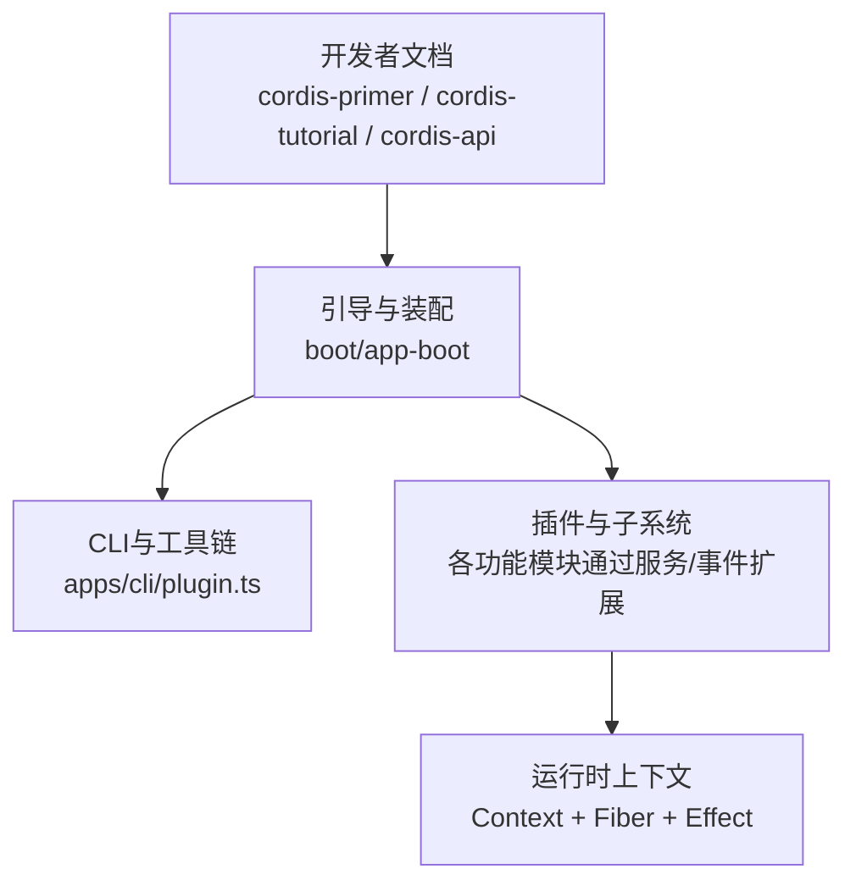
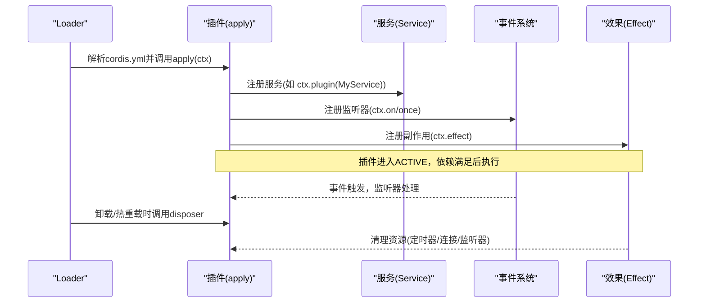
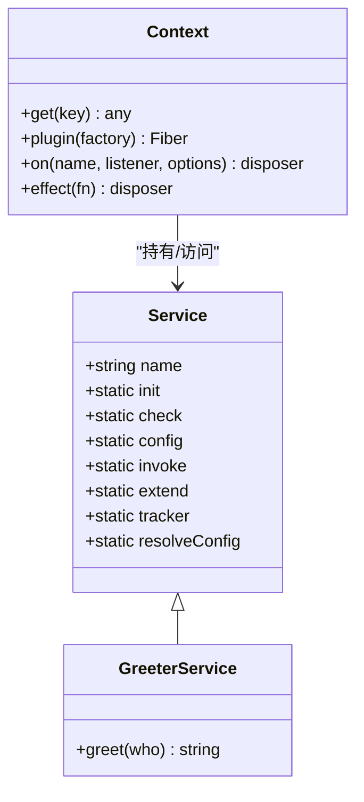
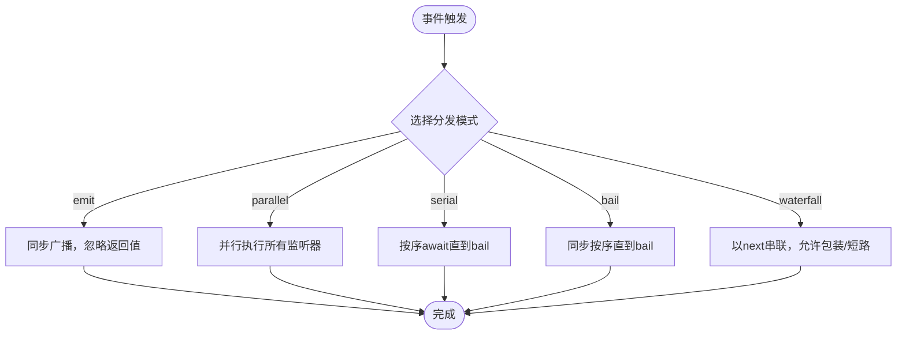
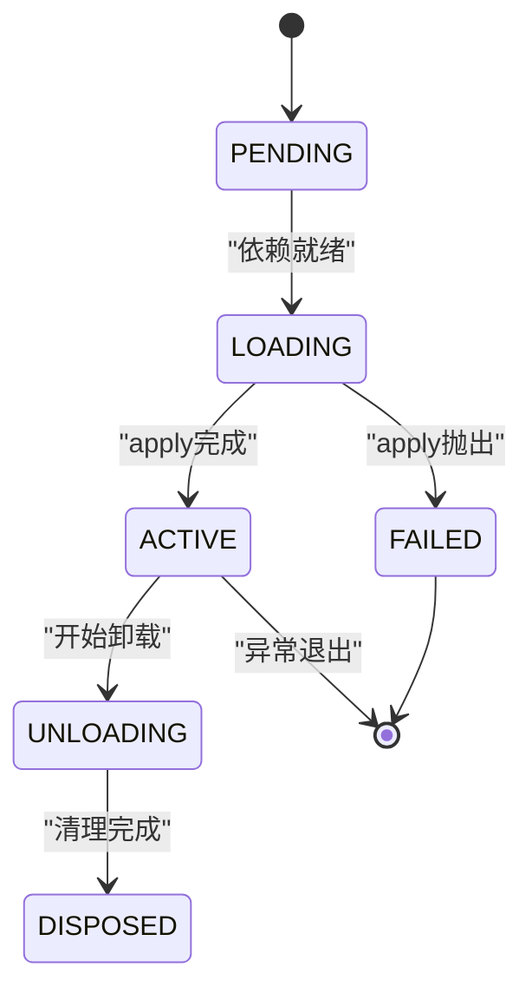
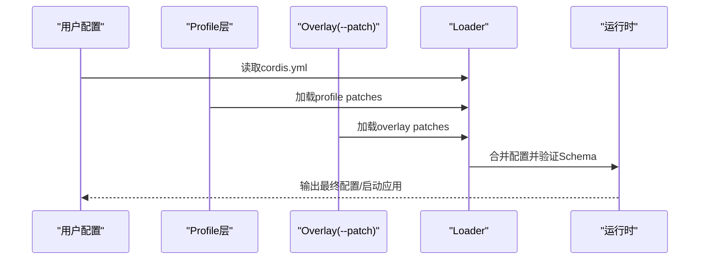
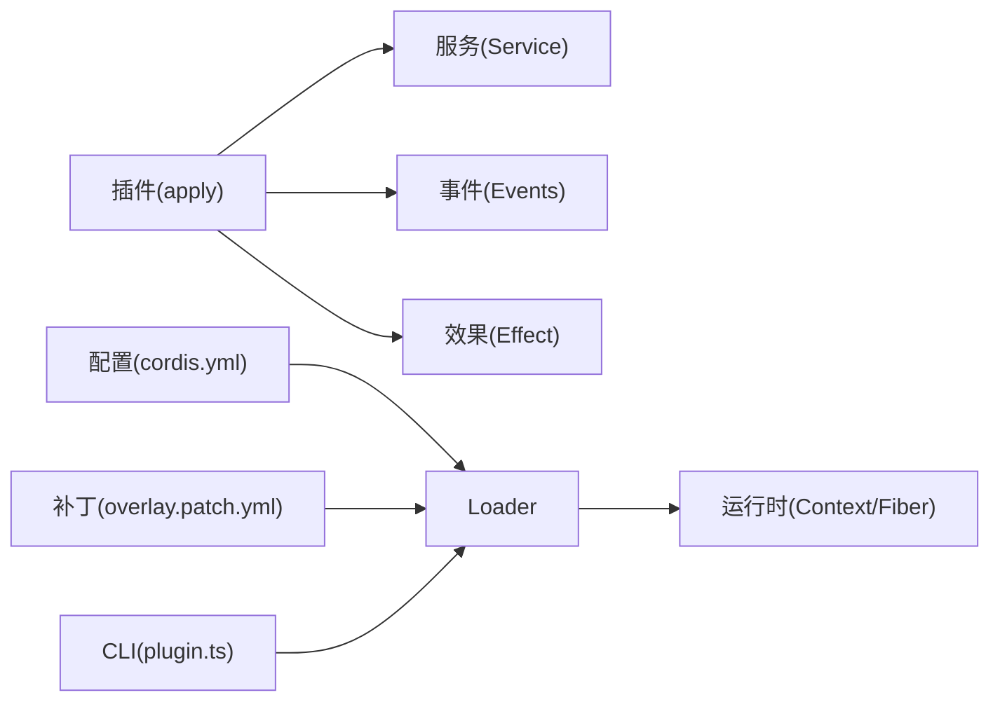

# Cordis框架

<cite>
**本文引用的文件**
- [Cordis入门](file://docs/cordis-primer.md)
- [服务API文档](file://docs/cordis-api/service.md)
- [事件API文档](file://docs/cordis-api/events.md)
- [注册与依赖注入文档](file://docs/cordis-api/registry.zh.md)
- [教程：第一个插件](file://docs/cordis-tutorial/01-first-plugin.md)
- [教程：生命周期与效果](file://docs/cordis-tutorial/02-lifecycle-and-effects.md)
- [教程：服务](file://docs/cordis-tutorial/03-services.md)
- [教程：配置](file://docs/cordis-tutorial/05-config.md)
- [应用启动：加载覆盖补丁](file://packages/boot/app-boot/src/index.ts)
- [CLI插件管理](file://apps/cli/src/plugin.ts)
</cite>

## 目录
1. [简介](#简介)
2. [项目结构](#项目结构)
3. [核心组件](#核心组件)
4. [架构总览](#架构总览)
5. [详细组件分析](#详细组件分析)
6. [依赖关系分析](#依赖关系分析)
7. [性能考量](#性能考量)
8. [故障排查指南](#故障排查指南)
9. [结论](#结论)
10. [附录](#附录)

## 简介
Cordis是DeepSeek Harness内置的插件化运行时，提供“时空可组合”的编程范式：通过上下文（Context）暴露稳定键名的服务、以声明式依赖驱动加载顺序、用类型化事件进行跨插件通信、并以可逆的效果（Effect）管理所有注册与副作用。其设计目标是让插件在任意时间被加载、热重载或卸载，同时保证资源安全释放、状态一致性与可观测性。

- 插件即服务：插件实现服务接口，或通过类继承Service自动注册到ctx。
- 上下文即仓库：服务以稳定键名挂载，消费者按名称查找，不耦合具体实现。
- 依赖驱动加载：通过inject声明所需服务，Cordis等待依赖就绪再执行。
- 类型化事件：支持emit、parallel、serial、bail、waterfall多种分发模式。
- 可逆效果：所有注册（监听器、工具、适配器、提供者等）都是可撤销的Effect，随插件卸载自动回滚。

**章节来源**
- [Cordis入门:7-13](file://docs/cordis-primer.md#L7-L13)

## 项目结构
本仓库将Cordis的使用与扩展分为三层：
- 文档层：面向开发者的教程与API参考，解释理念、用法与最佳实践。
- 运行层：引导与装配逻辑，负责解析配置、加载插件、应用覆盖补丁、维护Fiber生命周期。
- 扩展层：CLI与测试支撑，提供插件包管理与测试场景。

**图示来源**
- [应用启动：加载覆盖补丁:309-326](file://packages/boot/app-boot/src/index.ts#L309-L326)
- [CLI插件管理:120-163](file://apps/cli/src/plugin.ts#L120-L163)

**章节来源**
- [Cordis入门:39-45](file://docs/cordis-primer.md#L39-L45)
- [应用启动：加载覆盖补丁:309-326](file://packages/boot/app-boot/src/index.ts#L309-L326)
- [CLI插件管理:120-163](file://apps/cli/src/plugin.ts#L120-L163)

## 核心组件
- 上下文（Context）：服务的容器，提供事件分发、效果注册、插件挂载等能力。
- 服务（Service）：以键名注册的稳定API；可通过类继承或函数形式提供。
- 事件系统（Events）：类型化事件，支持多种分发模式与监听器注册。
- 效果（Effect）：可撤销的副作用，用于管理定时器、连接、监听器等资源。
- 依赖注入（Inject）：声明式依赖，确保插件在所需服务就绪后才执行。
- 配置与补丁（Config & Patch）：Schema校验的配置与覆盖机制，支持动态表达式与多层叠加。

**章节来源**
- [服务API文档:4-12](file://docs/cordis-api/service.md#L4-L12)
- [事件API文档:4-27](file://docs/cordis-api/events.md#L4-L27)
- [注册与依赖注入文档:123-151](file://docs/cordis-api/registry.zh.md#L123-L151)
- [教程：生命周期与效果:7-11](file://docs/cordis-tutorial/02-lifecycle-and-effects.md#L7-L11)
- [教程：配置:7-34](file://docs/cordis-tutorial/05-config.md#L7-L34)

## 架构总览
Cordis以“插件-服务-事件-效果”为核心，围绕Context组织运行时。Loader读取cordis.yml并挂载插件；每个插件通过Service或effect注册能力；插件之间通过事件协作；配置与补丁在启动时合并，决定最终行为。

**图示来源**
- [教程：第一个插件:23-51](file://docs/cordis-tutorial/01-first-plugin.md#L23-L51)
- [教程：生命周期与效果:64-67](file://docs/cordis-tutorial/02-lifecycle-and-effects.md#L64-L67)
- [事件API文档:125-171](file://docs/cordis-api/events.md#L125-L171)

**章节来源**
- [教程：第一个插件:23-51](file://docs/cordis-tutorial/01-first-plugin.md#L23-L51)
- [教程：生命周期与效果:64-67](file://docs/cordis-tutorial/02-lifecycle-and-effects.md#L64-L67)
- [事件API文档:125-171](file://docs/cordis-api/events.md#L125-L171)

## 详细组件分析

### 服务与依赖注入
- 服务注册：通过Service子类构造时调用super(ctx, name)完成注册，实例作为ctx.<name>可用。
- 依赖声明：插件通过export const inject = ['serviceKey']声明强依赖；Cordis会等待依赖就绪再执行apply。
- 可选依赖：使用ctx.get('key')获取可能不存在的服务，避免硬依赖。
- 类型安全：通过declare module合并Context接口，获得编译期类型检查。

**图示来源**
- [服务API文档:14-103](file://docs/cordis-api/service.md#L14-L103)
- [教程：服务:20-42](file://docs/cordis-tutorial/03-services.md#L20-L42)

**章节来源**
- [服务API文档:14-103](file://docs/cordis-api/service.md#L14-L103)
- [教程：服务:20-42](file://docs/cordis-tutorial/03-services.md#L20-L42)
- [教程：服务:44-79](file://docs/cordis-tutorial/03-services.md#L44-L79)
- [注册与依赖注入文档:123-151](file://docs/cordis-api/registry.zh.md#L123-L151)

### 事件系统与分发模式
- 分发模式：
  - emit：同步广播，忽略返回值。
  - parallel：并发执行所有监听器，返回Promise在所有监听器完成后解决。
  - serial：按序await监听器，遇到bail值停止并返回。
  - bail：同步按序执行，遇到bail值停止。
  - waterfall：最后一个参数为next回调，监听器可包装或短路。
- 监听器注册：ctx.on/ctx.once，支持prepend与global选项。

**图示来源**
- [事件API文档:8-123](file://docs/cordis-api/events.md#L8-L123)
- [Cordis入门:15-36](file://docs/cordis-primer.md#L15-L36)

**章节来源**
- [事件API文档:8-123](file://docs/cordis-api/events.md#L8-L123)
- [Cordis入门:15-36](file://docs/cordis-primer.md#L15-L36)

### 效果与生命周期管理
- 效果（Effect）：通过ctx.effect注册副作用，返回的disposer在插件卸载时调用。
- Fiber状态机：PENDING → LOADING → ACTIVE → UNLOADING → DISPOSED，失败路径为FAILED。
- 插件卸载：当依赖缺失或主动dispose时，插件及其子插件全部清理，异步disposer并发执行。

**图示来源**
- [教程：生命周期与效果:68-83](file://docs/cordis-tutorial/02-lifecycle-and-effects.md#L68-L83)

**章节来源**
- [教程：生命周期与效果:7-11](file://docs/cordis-tutorial/02-lifecycle-and-effects.md#L7-L11)
- [教程：生命周期与效果:64-67](file://docs/cordis-tutorial/02-lifecycle-and-effects.md#L64-L67)
- [教程：生命周期与效果:68-83](file://docs/cordis-tutorial/02-lifecycle-and-effects.md#L68-L83)

### 配置叠加与补丁系统
- 配置Schema：插件导出Config Schema，Loader在apply前校验并填充默认值。
- 动态表达式：YAML中config块支持!!js标签，在加载时计算。
- 覆盖补丁（Overlay/Patch）：通过cordis.patch.yml或命令行--patch指定，按顺序合并配置；id定位行，整体替换config值。
- 应用流程：先加载profile层，再应用用户层与--patch覆盖，最后组装插件树。

**图示来源**
- [教程：配置:7-81](file://docs/cordis-tutorial/05-config.md#L7-L81)
- [应用启动：加载覆盖补丁:309-326](file://packages/boot/app-boot/src/index.ts#L309-L326)

**章节来源**
- [教程：配置:7-81](file://docs/cordis-tutorial/05-config.md#L7-L81)
- [应用启动：加载覆盖补丁:309-326](file://packages/boot/app-boot/src/index.ts#L309-L326)

### 插件开发示例（学习路径）
- 初学者路径：
  - 编写第一个插件：导出name与apply(ctx)，在cordis.yml中引用。
  - 理解生命周期：使用ctx.effect管理外部资源，掌握Fiber状态。
  - 提供服务：通过Service子类注册ctx.<name>，并在其他插件中消费。
  - 事件通信：使用ctx.on/ctx.emit/ctx.waterfall等实现解耦交互。
  - 配置校验：导出Schema，使用!!js动态值，体验覆盖补丁。
- 高级实现细节：
  - 依赖追踪：inject不仅启动时检查，运行期依赖变化也会触发重载。
  - 事件模式选择：根据语义选择emit/parallel/serial/bail/waterfall。
  - 补丁策略：利用id定位行，注意config整体替换语义，避免覆盖丢失。
  - 资源编排：将相关清理步骤放入同一disposer以保证顺序。

**章节来源**
- [教程：第一个插件:23-51](file://docs/cordis-tutorial/01-first-plugin.md#L23-L51)
- [教程：生命周期与效果:64-67](file://docs/cordis-tutorial/02-lifecycle-and-effects.md#L64-L67)
- [教程：服务:20-79](file://docs/cordis-tutorial/03-services.md#L20-L79)
- [事件API文档:8-171](file://docs/cordis-api/events.md#L8-L171)
- [教程：配置:7-81](file://docs/cordis-tutorial/05-config.md#L7-L81)

## 依赖关系分析
- 插件与服务：插件通过Service注册能力，消费者通过ctx键名访问，形成松耦合。
- 事件与监听器：事件作为横切关注点，监听器可插入、包装或短路处理。
- 配置与补丁：配置文件与补丁共同决定最终行为，Loader负责解析与合并。
- CLI与引导：CLI负责初始化与管理插件包，引导层负责装配与启动。

**图示来源**
- [CLI插件管理:120-163](file://apps/cli/src/plugin.ts#L120-L163)
- [应用启动：加载覆盖补丁:309-326](file://packages/boot/app-boot/src/index.ts#L309-L326)

**章节来源**
- [CLI插件管理:120-163](file://apps/cli/src/plugin.ts#L120-L163)
- [应用启动：加载覆盖补丁:309-326](file://packages/boot/app-boot/src/index.ts#L309-L326)

## 性能考量
- 事件分发模式选择：
  - emit适合轻量通知，无阻塞。
  - parallel适合独立任务并行，注意资源竞争。
  - serial/bail适合决策流水线，尽早短路减少开销。
  - waterfall适合中间件式包装，谨慎嵌套深度。
- 依赖注入与加载顺序：通过inject表达依赖，避免手动排序带来的脆弱性。
- 效果清理：将相关清理集中在一个disposer内，避免异步清理并发导致的竞态。
- 配置校验：尽早失败（Fail Loud），避免半配置运行导致的不确定行为。

[本节为通用指导，不直接分析具体文件]

## 故障排查指南
- 插件未执行：
  - 检查cordis.yml是否正确引用插件。
  - 确认依赖是否满足（inject列表中的服务是否存在）。
  - 查看Loader日志，模块解析失败不会崩溃但会记录错误。
- 配置错误：
  - Schema校验失败会明确报错位置，修正后重启。
  - 使用!!js的动态值需确保环境存在。
- 覆盖补丁无效：
  - 确认id定位的行存在。
  - 注意config整体替换语义，避免覆盖丢失。
- 资源泄漏：
  - 确保外部资源通过ctx.effect注册并返回disposer。
  - 复杂清理步骤放在同一disposer内保证顺序。

**章节来源**
- [教程：第一个插件:79-92](file://docs/cordis-tutorial/01-first-plugin.md#L79-L92)
- [教程：生命周期与效果:84-95](file://docs/cordis-tutorial/02-lifecycle-and-effects.md#L84-L95)
- [教程：配置:53-81](file://docs/cordis-tutorial/05-config.md#L53-L81)

## 结论
Cordis通过“插件-服务-事件-效果”的清晰分层，实现了高内聚、低耦合的可组合运行时。依赖驱动的加载顺序、类型化的事件通信、可逆的效果管理以及强大的配置与补丁系统，使得插件可以在任意生命周期阶段安全地扩展系统能力。遵循本文的学习路径与实践建议，开发者可以高效构建可维护、可扩展的插件生态。

[本节为总结，不直接分析具体文件]

## 附录
- 快速上手：
  - 创建插件：导出name与apply(ctx)。
  - 注册服务：继承Service并super(ctx, name)。
  - 监听事件：ctx.on/ctx.emit/ctx.waterfall。
  - 管理资源：ctx.effect返回disposer。
  - 配置校验：导出Schema并使用!!js。
- 进阶主题：
  - 依赖追踪与重载：inject在运行期也生效。
  - 补丁策略：id定位行，config整体替换。
  - 性能优化：合理选择事件分发模式。

[本节为补充信息，不直接分析具体文件]