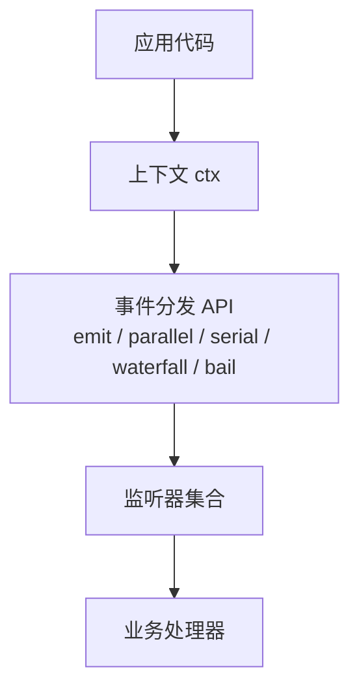
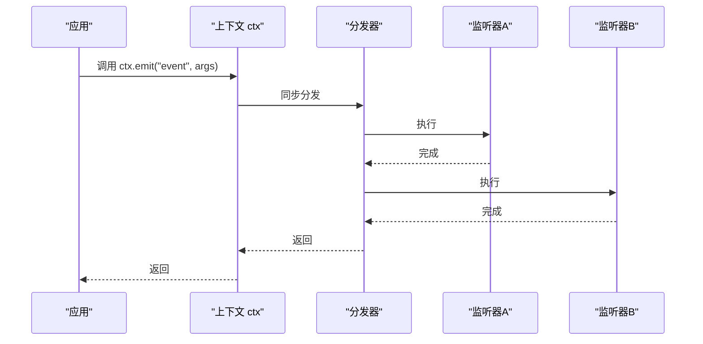
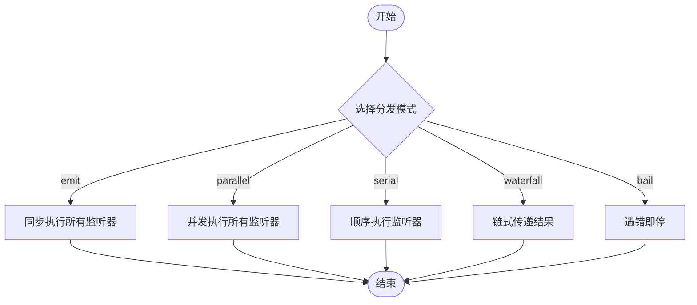
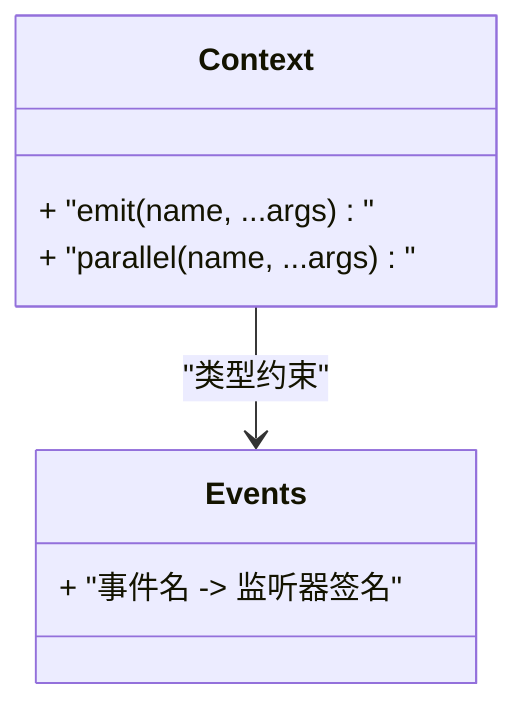
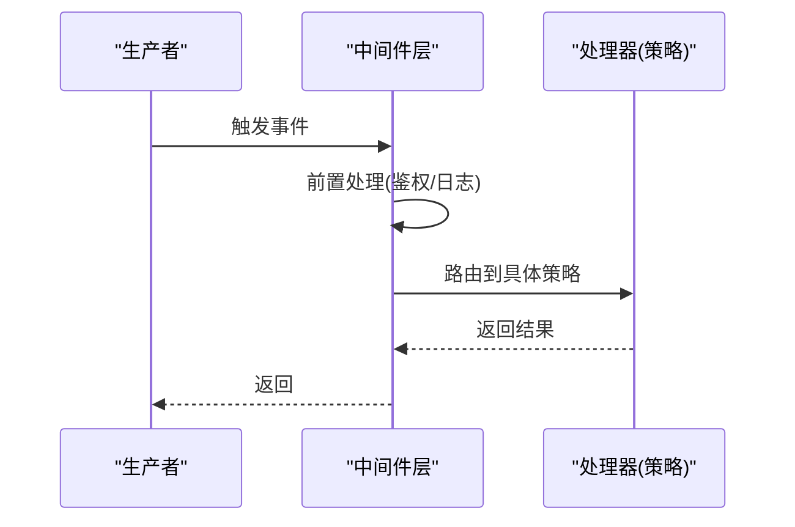
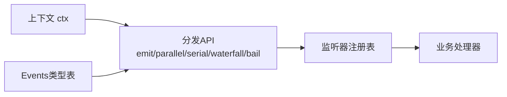

# 事件系统

<cite>
**本文引用的文件**
- [docs/cordis-api/events.md](file://docs/cordis-api/events.md)
- [docs/cordis-api/events.zh.md](file://docs/cordis-api/events.zh.md)
</cite>

## 目录
1. [简介](#简介)
2. [项目结构](#项目结构)
3. [核心组件](#核心组件)
4. [架构总览](#架构总览)
5. [详细组件分析](#详细组件分析)
6. [依赖关系分析](#依赖关系分析)
7. [性能考虑](#性能考虑)
8. [故障排查指南](#故障排查指南)
9. [结论](#结论)
10. [附录](#附录)

## 简介
本文件面向Cordis事件系统的开发者与使用者，系统化阐述事件驱动架构的设计理念与实践：事件的声明、分发、监听与处理机制；五种分发模式（emit、waterfall、parallel、serial、bail）的语义差异与适用场景；TypeScript类型合并如何为事件提供类型安全；以及观察者模式、中间件模式、策略模式在事件系统中的典型用法。同时给出调试方法与性能优化建议，并总结最佳实践与常见陷阱。

## 项目结构
Cordis将事件API混入每个上下文对象中，事件声明及其分发模式会生成到各自所属的子系统页面。事件文档位于docs/cordis-api下，其中events.md/zh.md描述了ctx.emit与ctx.parallel等分发方法，并标注了对应源码位置。

图表来源
- [docs/cordis-api/events.md:1-49](file://docs/cordis-api/events.md#L1-L49)
- [docs/cordis-api/events.zh.md:1-49](file://docs/cordis-api/events.zh.md#L1-L49)

章节来源
- [docs/cordis-api/events.md:1-49](file://docs/cordis-api/events.md#L1-L49)
- [docs/cordis-api/events.zh.md:1-49](file://docs/cordis-api/events.zh.md#L1-L49)

## 核心组件
- 上下文混入的事件API：ctx.emit、ctx.parallel等，用于同步或并发分发事件。
- 事件声明与类型映射：通过类型合并将事件名与监听器签名绑定，确保参数与返回值的类型安全。
- 监听器注册与管理：由框架维护，支持多种分发模式。
- 子系统事件页：各子系统页面集中展示其事件声明与使用方式。

章节来源
- [docs/cordis-api/events.md:1-49](file://docs/cordis-api/events.md#L1-L49)
- [docs/cordis-api/events.zh.md:1-49](file://docs/cordis-api/events.zh.md#L1-L49)

## 架构总览
Cordis事件系统采用“声明+分发”的设计：
- 声明阶段：在各子系统中声明事件名及监听器签名，并通过类型合并形成全局Events映射，使调用处获得强类型提示。
- 分发阶段：通过ctx提供的分发方法（如emit、parallel等）触发事件，框架根据模式调度监听器执行。
- 监听阶段：监听器以观察者模式实现，可组合中间件进行横切关注点处理，也可按策略模式选择不同处理器。

图表来源
- [docs/cordis-api/events.md:31-49](file://docs/cordis-api/events.md#L31-L49)
- [docs/cordis-api/events.zh.md:33-49](file://docs/cordis-api/events.zh.md#L33-L49)

## 详细组件分析

### 事件分发模式与语义
- emit（同步）：同步依次执行所有监听器，忽略返回值。适用于无副作用或轻量级通知场景。
- parallel（并发）：并发运行所有监听器，等待全部完成后返回。适用于I/O密集型且彼此独立的监听器。
- serial（串行）：顺序执行监听器，前一个完成后才执行下一个。适用于需要严格顺序的场景。
- waterfall（瀑布）：上一个监听器的输出作为下一个的输入，形成数据流水线。适用于逐步转换数据的场景。
- bail（短路）：遇到第一个失败或特定条件即停止后续监听器。适用于快速失败或优先级拦截场景。

章节来源
- [docs/cordis-api/events.md:8-49](file://docs/cordis-api/events.md#L8-L49)
- [docs/cordis-api/events.zh.md:10-49](file://docs/cordis-api/events.zh.md#L10-L49)

### TypeScript类型合并与类型安全
- 事件声明与类型映射：通过类型合并将事件名与其监听器函数签名关联，形成全局Events类型表。
- 调用处类型推导：ctx.emit/ctx.parallel等方法对name和args进行约束，编译器可检查参数类型与数量。
- 扩展性：新增事件只需在对应子系统声明，即可自动获得类型提示与校验，避免运行时错误。

章节来源
- [docs/cordis-api/events.md:1-49](file://docs/cordis-api/events.md#L1-L49)
- [docs/cordis-api/events.zh.md:1-49](file://docs/cordis-api/events.zh.md#L1-L49)

### 观察者模式、中间件模式、策略模式
- 观察者模式：监听器订阅事件，被触发时执行；适合解耦生产者和消费者。
- 中间件模式：在事件分发前后插入横切逻辑（如日志、权限、度量），可通过串行或瀑布模式组合。
- 策略模式：根据不同条件选择不同监听器实现同一接口，便于扩展与替换。

章节来源
- [docs/cordis-api/events.md:1-49](file://docs/cordis-api/events.md#L1-L49)
- [docs/cordis-api/events.zh.md:1-49](file://docs/cordis-api/events.zh.md#L1-L49)

### 代码示例路径（不直接展示代码）
- 同步分发示例：参考ctx.emit的使用位置与上下文。
- 并发分发示例：参考ctx.parallel的使用位置与上下文。
- 中间件组合示例：参考在分发链中插入横切逻辑的位置。
- 策略选择示例：参考根据事件属性路由到不同处理器的位置。

章节来源
- [docs/cordis-api/events.md:1-49](file://docs/cordis-api/events.md#L1-L49)
- [docs/cordis-api/events.zh.md:1-49](file://docs/cordis-api/events.zh.md#L1-L49)

## 依赖关系分析
- 上下文与分发API：ctx暴露emit/parallel等方法，依赖内部分发器实现。
- 事件声明与类型：Events类型表由子系统声明聚合而成，供调用方类型推导。
- 监听器与处理器：监听器由框架管理，实际业务逻辑在处理器中实现。

章节来源
- [docs/cordis-api/events.md:1-49](file://docs/cordis-api/events.md#L1-L49)
- [docs/cordis-api/events.zh.md:1-49](file://docs/cordis-api/events.zh.md#L1-L49)

## 性能考虑
- 同步vs并发：emit为同步，可能阻塞主流程；parallel并发执行，适合I/O密集但需保证全部完成。
- 顺序控制：serial保证顺序，适合有状态依赖；waterfall适合数据转换流水线。
- 快速失败：bail可在首个异常时中断，减少不必要开销。
- 监听器粒度：尽量保持监听器轻量，复杂逻辑下沉到异步任务或后台队列。
- 背压与限流：在高吞吐场景下，结合队列与限流策略避免资源耗尽。

[本节为通用指导，不直接分析具体文件]

## 故障排查指南
- 确认事件是否已声明：检查对应子系统的事件页是否有该事件定义。
- 检查分发模式：确认选择的模式是否符合预期（同步/并发/顺序/瀑布/短路）。
- 监听器异常：在bail模式下，首个异常会中断后续处理；在其他模式下，需捕获并记录异常。
- 类型错误：若编译时报参类型不符，核对Events映射与调用处的参数。
- 性能问题：若出现卡顿，评估是否误用emit导致阻塞，或parallel导致资源竞争。

章节来源
- [docs/cordis-api/events.md:1-49](file://docs/cordis-api/events.md#L1-L49)
- [docs/cordis-api/events.zh.md:1-49](file://docs/cordis-api/events.zh.md#L1-L49)

## 结论
Cordis事件系统通过上下文混入的分发API与类型合并，提供了灵活而类型安全的事件机制。五种分发模式覆盖从简单通知到复杂流水线的多样场景。结合观察者、中间件与策略模式，可实现高内聚、低耦合的系统设计。遵循最佳实践并注意常见陷阱，可有效提升可维护性与性能。

[本节为总结，不直接分析具体文件]

## 附录
- 术语
  - 事件：系统内模块间通信的消息单元。
  - 监听器：订阅事件并执行相应逻辑的函数。
  - 分发模式：决定监听器执行顺序与传播方式的策略。
- 参考
  - 事件API文档：docs/cordis-api/events.md/zh.md

[本节为补充信息，不直接分析具体文件]