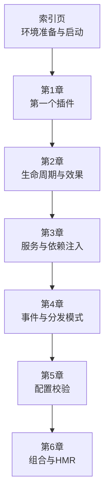
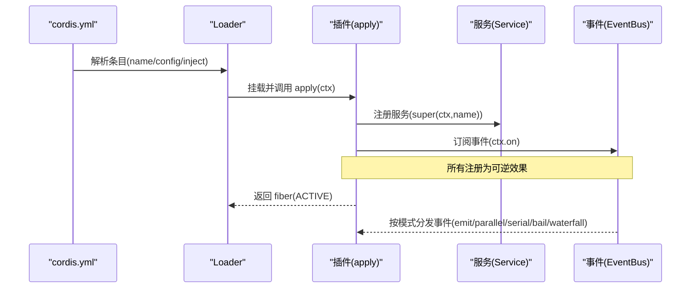
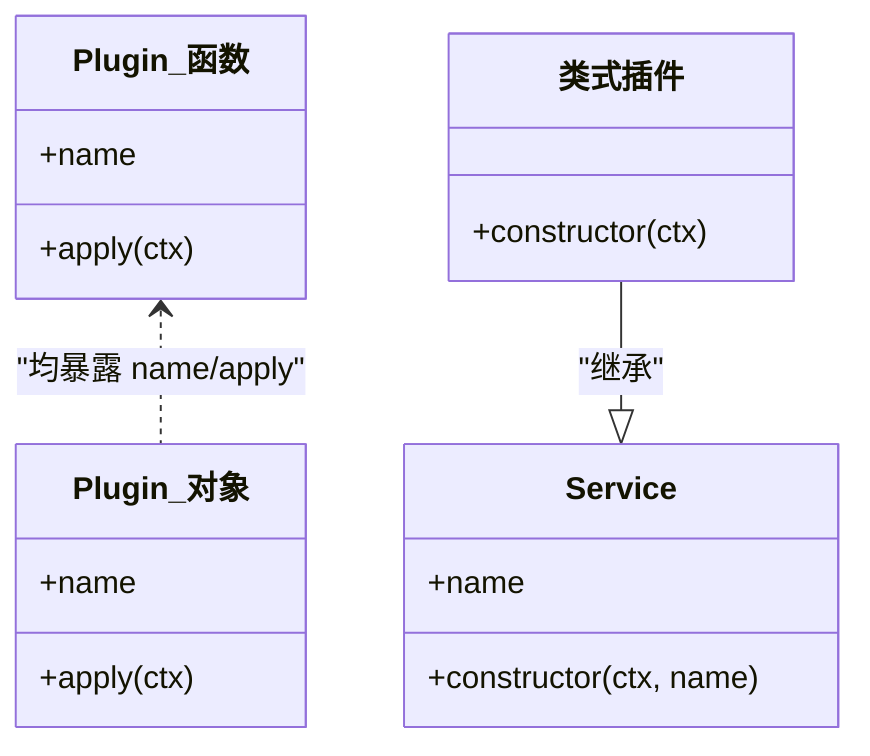
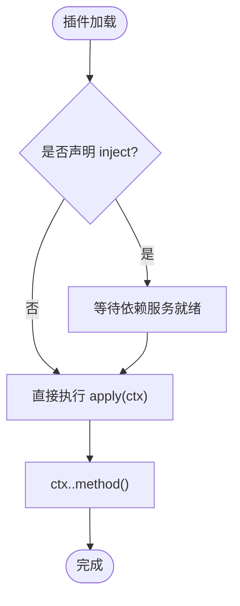
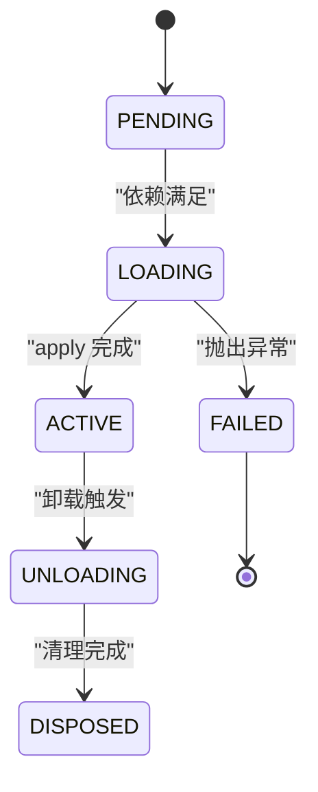
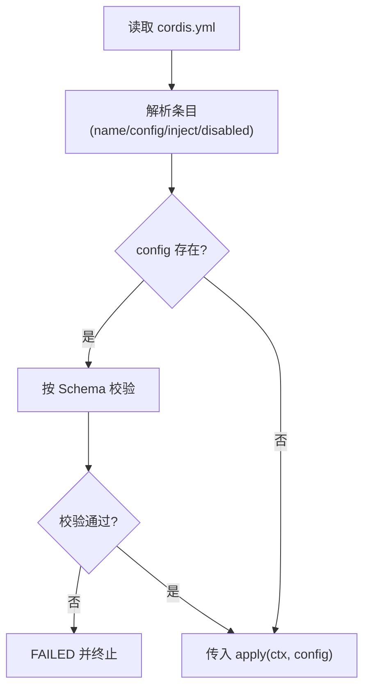
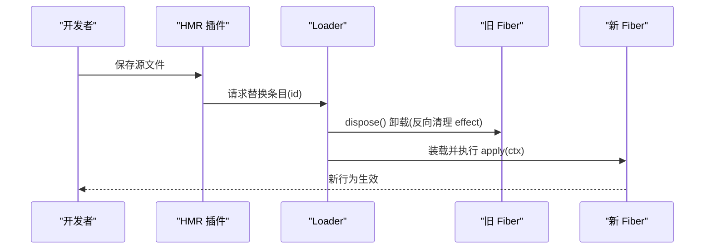

# 插件开发基础

<cite>
**本文引用的文件**
- [01-first-plugin.md](file://docs/cordis-tutorial/01-first-plugin.md)
- [02-lifecycle-and-effects.md](file://docs/cordis-tutorial/02-lifecycle-and-effects.md)
- [03-services.md](file://docs/cordis-tutorial/03-services.md)
- [04-events.md](file://docs/cordis-tutorial/04-events.md)
- [05-config.md](file://docs/cordis-tutorial/05-config.md)
- [06-composition-and-hmr.md](file://docs/cordis-tutorial/06-composition-and-hmr.md)
- [index.md](file://docs/cordis-tutorial/index.md)
- [service.md](file://docs/cordis-api/service.md)
- [cordis-primer.md](file://docs/cordis-primer.md)
</cite>

## 目录
1. [简介](#简介)
2. [项目结构](#项目结构)
3. [核心组件](#核心组件)
4. [架构总览](#架构总览)
5. [详细组件分析](#详细组件分析)
6. [依赖分析](#依赖分析)
7. [性能考虑](#性能考虑)
8. [故障排查指南](#故障排查指南)
9. [结论](#结论)
10. [附录](#附录)

## 简介
本指南面向首次接触 Cordis 的开发者，系统讲解插件的基本概念、Service 接口与生命周期、函数式与类式插件写法、加载机制、依赖注入、事件通信与效果管理。通过从零开始构建一个可运行的最小插件，逐步掌握服务注册、事件监听、配置校验、热重载与诊断等关键能力，并给出最佳实践建议。

## 项目结构
Cordis 教程以“章节式”的方式组织，每章提供可独立运行的示例与说明：
- 第1章：第一个插件（函数式插件、YAML 装配）
- 第2章：生命周期与效果（effect/fiber/卸载）
- 第3章：服务（Service 基类、inject 依赖）
- 第4章：事件（emit/parallel/serial/bail/waterfall）
- 第5章：配置（Schema 校验、!!js 动态值）
- 第6章：组合与热更新（HMR、PENDING 诊断）
- 索引页：环境准备与统一启动命令



**图示来源**
- [index.md:13-46](file://docs/cordis-tutorial/index.md#L13-L46)
- [01-first-plugin.md:23-51](file://docs/cordis-tutorial/01-first-plugin.md#L23-L51)

**章节来源**
- [index.md:13-46](file://docs/cordis-tutorial/index.md#L13-L46)

## 核心组件
- 插件（Plugin）：实现 Service 的对象或函数，包含 name、apply(ctx)、可选 inject 等元信息。
- 上下文（Context）：服务仓库，插件通过 ctx.<key> 访问已注册的服务。
- 服务（Service）：基于基类的命名能力提供者，构造函数中调用 super(ctx, name) 完成注册。
- 事件（Events）：类型化事件总线，支持 emit/parallel/serial/bail/waterfall 多种分发模式。
- 效果（Effect/Fiber）：插件注册均为可逆效果；fiber 表示一个插件实例的生命周期状态机。
- 配置（Config）：通过 Schema 在 apply 前进行强校验，失败即中止加载。

**章节来源**
- [cordis-primer.md:7-13](file://docs/cordis-primer.md#L7-L13)
- [service.md:4-12](file://docs/cordis-api/service.md#L4-L12)
- [02-lifecycle-and-effects.md:67-81](file://docs/cordis-tutorial/02-lifecycle-and-effects.md#L67-L81)
- [04-events.md:80-92](file://docs/cordis-tutorial/04-events.md#L80-L92)
- [05-config.md:5-6](file://docs/cordis-tutorial/05-config.md#L5-L6)

## 架构总览
下图展示了从 YAML 装配到插件加载、服务注册与事件分发的整体流程。



**图示来源**
- [01-first-plugin.md:23-51](file://docs/cordis-tutorial/01-first-plugin.md#L23-L51)
- [02-lifecycle-and-effects.md:67-92](file://docs/cordis-tutorial/02-lifecycle-and-effects.md#L67-L92)
- [03-services.md:7-42](file://docs/cordis-tutorial/03-services.md#L7-L42)
- [04-events.md:7-44](file://docs/cordis-tutorial/04-events.md#L7-L44)

## 详细组件分析

### 插件对象与三种形态
- 函数式插件：导出 apply(ctx)，最常用。
- 对象式插件：导出 { name, apply(ctx) }。
- 类式插件：继承 Service，构造时 super(ctx, name) 完成注册。



**图示来源**
- [01-first-plugin.md:53-77](file://docs/cordis-tutorial/01-first-plugin.md#L53-L77)
- [service.md:4-12](file://docs/cordis-api/service.md#L4-L12)

**章节来源**
- [01-first-plugin.md:53-77](file://docs/cordis-tutorial/01-first-plugin.md#L53-L77)

### 服务与依赖注入
- 提供服务：继承 Service，super(ctx, 'serviceName') 立即注册；通过 declare module 扩展 Context 类型。
- 消费服务：使用 inject = ['serviceName'] 声明硬依赖；Cordis 会等待依赖就绪再运行 apply。
- 可选依赖：使用 ctx.get('name') 探测是否存在。



**图示来源**
- [03-services.md:7-42](file://docs/cordis-tutorial/03-services.md#L7-L42)
- [03-services.md:44-78](file://docs/cordis-tutorial/03-services.md#L44-L78)

**章节来源**
- [03-services.md:7-42](file://docs/cordis-tutorial/03-services.md#L7-L42)
- [03-services.md:44-78](file://docs/cordis-tutorial/03-services.md#L44-L78)

### 事件系统与分发模式
- 声明事件：通过 interface Events 合并事件名与监听器签名。
- 分发模式：
  - emit：同步广播，不收集返回值。
  - parallel：并行执行，全部 await。
  - serial：顺序执行，首个非空结果短路。
  - bail：同步版 serial。
  - waterfall：中间件式拦截，next() 链式传递并可短路。

```mermaid
sequenceDiagram
participant P as "生产者(StatsService)"
participant EB as "事件总线"
participant L1 as "监听器A"
participant L2 as "监听器B"
P->>EB : emit("stats/report", name, count)
EB-->>L1 : 回调(name,count)
EB-->>L2 : 回调(name,count)
Note over EB,L1,L2 : 各模式决定执行顺序与返回值处理
```

**图示来源**
- [04-events.md:7-44](file://docs/cordis-tutorial/04-events.md#L7-L44)
- [04-events.md:80-92](file://docs/cordis-tutorial/04-events.md#L80-L92)

**章节来源**
- [04-events.md:7-44](file://docs/cordis-tutorial/04-events.md#L7-L44)
- [04-events.md:80-92](file://docs/cordis-tutorial/04-events.md#L80-L92)

### 生命周期与效果（Fiber）
- effect：将外部资源（定时器、连接、监听器等）纳入 Cordis 管理，卸载时自动清理。
- fiber 状态机：PENDING → LOADING → ACTIVE → UNLOADING → DISPOSED（异常路径进入 FAILED）。
- 内置效果：ctx.on、ctx.plugin、服务注册等均为 effect。



**图示来源**
- [02-lifecycle-and-effects.md:67-81](file://docs/cordis-tutorial/02-lifecycle-and-effects.md#L67-L81)
- [02-lifecycle-and-effects.md:84-92](file://docs/cordis-tutorial/02-lifecycle-and-effects.md#L84-L92)

**章节来源**
- [02-lifecycle-and-effects.md:67-81](file://docs/cordis-tutorial/02-lifecycle-and-effects.md#L67-L81)
- [02-lifecycle-and-effects.md:84-92](file://docs/cordis-tutorial/02-lifecycle-and-effects.md#L84-L92)

### 配置校验与动态值
- 使用 Schema 在 apply 前校验配置，错误即失败，避免半配置运行。
- 支持 !!js 标签在 config 与 disabled 字段中进行运行时计算。



**图示来源**
- [05-config.md:5-6](file://docs/cordis-tutorial/05-config.md#L5-L6)
- [05-config.md:7-51](file://docs/cordis-tutorial/05-config.md#L7-L51)
- [05-config.md:70-80](file://docs/cordis-tutorial/05-config.md#L70-L80)

**章节来源**
- [05-config.md:5-6](file://docs/cordis-tutorial/05-config.md#L5-L6)
- [05-config.md:7-51](file://docs/cordis-tutorial/05-config.md#L7-L51)
- [05-config.md:70-80](file://docs/cordis-tutorial/05-config.md#L70-L80)

### 组合与热更新（HMR）
- 通过 id 稳定标识条目，便于增量装载/卸载。
- HMR 通过监听文件变更，卸载旧实例并重新加载新代码，effect 自动回滚。
- 诊断 PENDING：遍历 registry 检查 fiber.state。



**图示来源**
- [06-composition-and-hmr.md:7-21](file://docs/cordis-tutorial/06-composition-and-hmr.md#L7-L21)
- [06-composition-and-hmr.md:23-59](file://docs/cordis-tutorial/06-composition-and-hmr.md#L23-L59)
- [06-composition-and-hmr.md:61-109](file://docs/cordis-tutorial/06-composition-and-hmr.md#L61-L109)

**章节来源**
- [06-composition-and-hmr.md:7-21](file://docs/cordis-tutorial/06-composition-and-hmr.md#L7-L21)
- [06-composition-and-hmr.md:23-59](file://docs/cordis-tutorial/06-composition-and-hmr.md#L23-L59)
- [06-composition-and-hmr.md:61-109](file://docs/cordis-tutorial/06-composition-and-hmr.md#L61-L109)

## 依赖分析
- 插件间耦合通过服务键名解耦，而非直接 import 实现。
- 依赖关系由 inject 显式表达，加载顺序由依赖图决定。
- 事件作为松耦合通信通道，降低模块间直接引用。

```mermaid
graph LR
A["插件A(提供者)"] --> |注册服务|"ctx.tools / ctx.llm / ..."| B["插件B(消费者)"]
B --> |inject 声明| A
A --> |emit/waterfall| C["其他监听者"]
```

**图示来源**
- [03-services.md:7-42](file://docs/cordis-tutorial/03-services.md#L7-L42)
- [03-services.md:44-78](file://docs/cordis-tutorial/03-services.md#L44-L78)
- [04-events.md:7-44](file://docs/cordis-tutorial/04-events.md#L7-L44)

**章节来源**
- [03-services.md:7-42](file://docs/cordis-tutorial/03-services.md#L7-L42)
- [03-services.md:44-78](file://docs/cordis-tutorial/03-services.md#L44-L78)
- [04-events.md:7-44](file://docs/cordis-tutorial/04-events.md#L7-L44)

## 性能考虑
- 优先使用事件进行横切关注点（日志、指标、策略），避免阻塞主路径。
- 对昂贵操作使用并行/串行模式按需选择，减少不必要的等待。
- 将资源获取与释放封装在 effect 中，确保卸载时及时回收，避免内存泄漏。
- 合理拆分插件，使每个插件职责单一，缩短加载与热更时间。

[本节为通用指导，无需特定文件来源]

## 故障排查指南
- 插件未运行且无输出：常见原因为 PENDING（缺少依赖）。可通过遍历 registry 检查 fiber.state 定位。
- 配置错误：Schema 校验失败会导致 FAILED，查看具体字段错误信息。
- 热更无效：确认条目是否设置了稳定的 id；没有 id 会在每次配置编辑后被视为“删除+新增”，导致全量重装载。
- 事件未触发：检查事件名与签名是否正确声明，确认监听器已注册且未被提前卸载。

**章节来源**
- [06-composition-and-hmr.md:61-109](file://docs/cordis-tutorial/06-composition-and-hmr.md#L61-L109)
- [05-config.md:53-68](file://docs/cordis-tutorial/05-config.md#L53-L68)
- [02-lifecycle-and-effects.md:67-81](file://docs/cordis-tutorial/02-lifecycle-and-effects.md#L67-L81)

## 结论
Cordis 通过“插件 + 服务 + 事件 + 效果”的组合，提供了高内聚、低耦合、可热更新的扩展体系。初学者可从函数式插件起步，逐步引入服务、事件与配置校验，最终在 Harness 生态中构建可维护、可扩展的能力单元。遵循“声明依赖、注册效果、类型安全、可逆卸载”的原则，能显著提升插件质量与可调试性。

[本节为总结性内容，无需特定文件来源]

## 附录

### 快速上手清单
- 创建第一个插件：导出 name 与 apply(ctx)。
- 编写 cordis.yml：列出插件条目，必要时添加 id 与 config。
- 运行：使用统一启动命令从当前目录加载 cordis.yml。
- 进阶：
  - 用 Service 暴露能力，并用 inject 声明依赖。
  - 用 interface Events 声明事件，并通过 ctx.emit/ctx.waterfall 等分发。
  - 用 Schema 校验配置，利用 !!js 做动态值。
  - 启用 HMR，观察热更与卸载过程。
  - 使用 registry 与 fiber.state 诊断 PENDING 问题。

**章节来源**
- [index.md:13-46](file://docs/cordis-tutorial/index.md#L13-L46)
- [01-first-plugin.md:23-51](file://docs/cordis-tutorial/01-first-plugin.md#L23-L51)
- [03-services.md:7-42](file://docs/cordis-tutorial/03-services.md#L7-L42)
- [04-events.md:7-44](file://docs/cordis-tutorial/04-events.md#L7-L44)
- [05-config.md:7-51](file://docs/cordis-tutorial/05-config.md#L7-L51)
- [06-composition-and-hmr.md:23-59](file://docs/cordis-tutorial/06-composition-and-hmr.md#L23-L59)