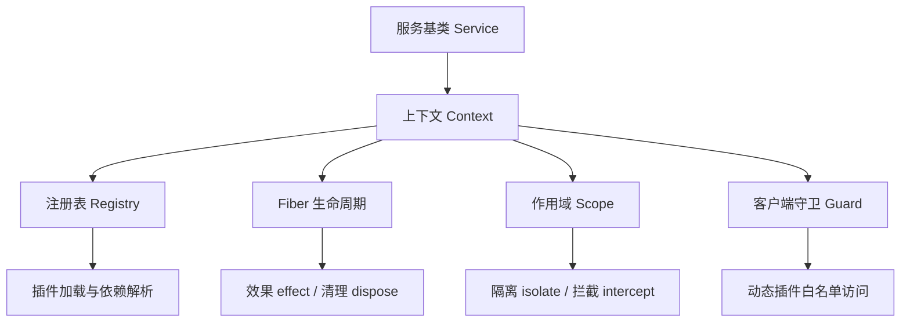
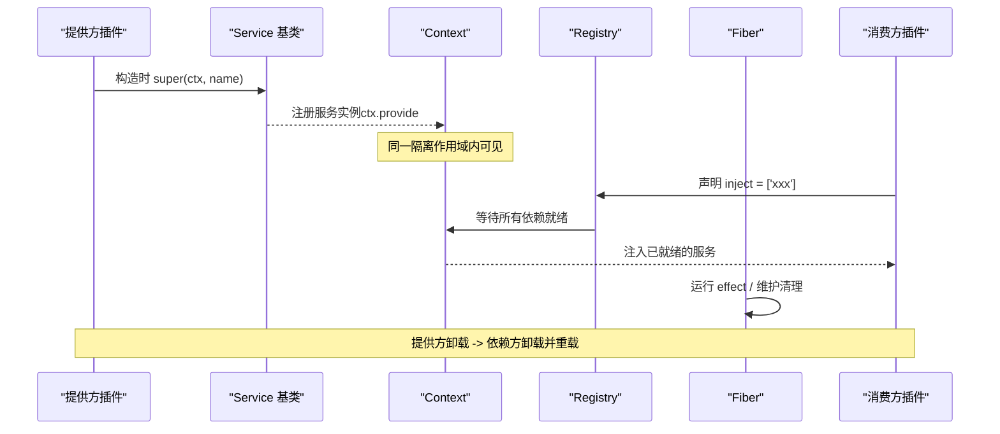
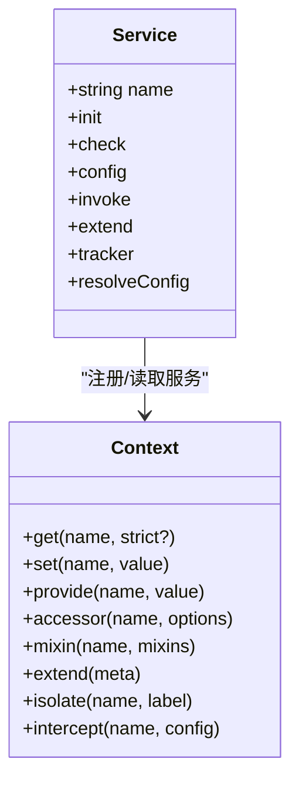
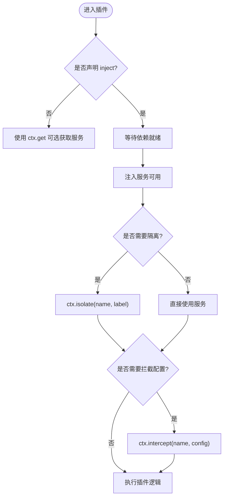
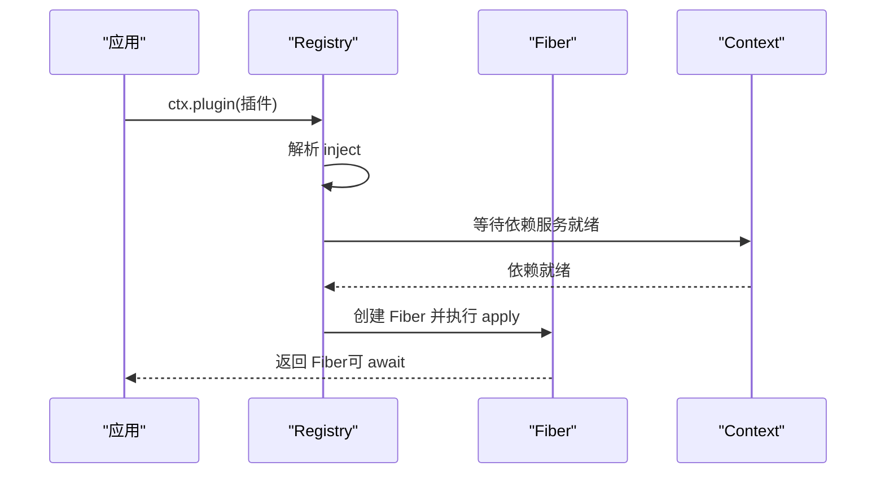
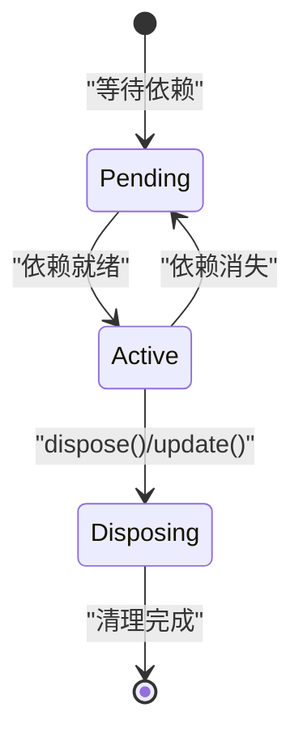
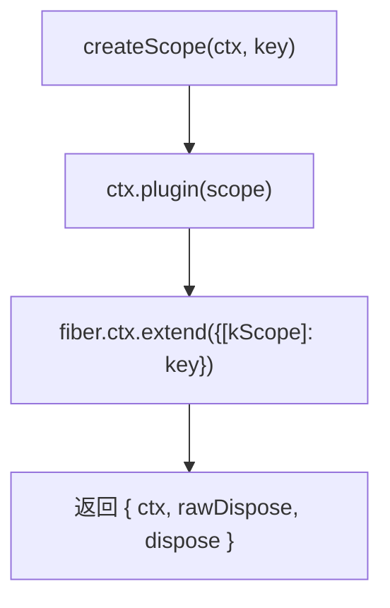
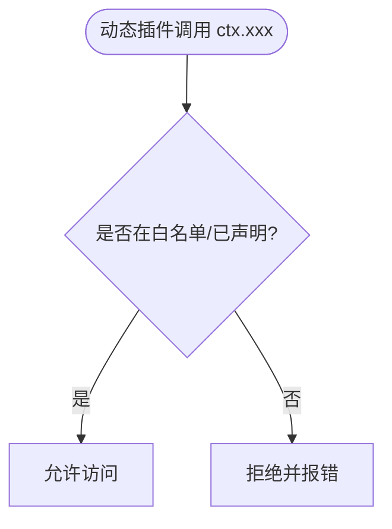
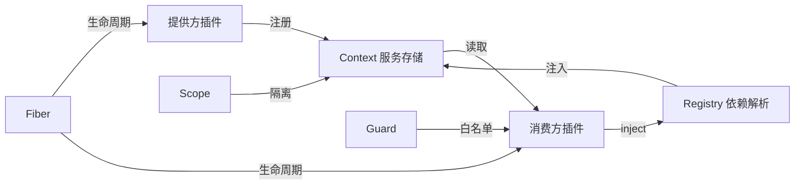

# 服务管理系统

<cite>
**本文引用的文件**
- [docs/cordis-api/service.md](file://docs/cordis-api/service.md)
- [docs/cordis-api/context.md](file://docs/cordis-api/context.md)
- [docs/cordis-api/registry.md](file://docs/cordis-api/registry.md)
- [docs/cordis-api/fiber.md](file://docs/cordis-api/fiber.md)
- [docs/cordis-tutorial/03-services.md](file://docs/cordis-tutorial/03-services.md)
- [docs/cordis-tutorial/03-services.zh.md](file://docs/cordis-tutorial/03-services.zh.md)
- [docs/user/develop/framework/service.zh.md](file://docs/user/develop/framework/service.zh.md)
- [packages/core/scope/src/index.ts](file://packages/core/scope/src/index.ts)
- [packages/extensions/cordis-client-runner/src/client/guard.ts](file://packages/extensions/cordis-client-runner/src/client/guard.ts)
- [packages/code-runtime/code-runtime/tests/service.spec.ts](file://packages/code-runtime/code-runtime/tests/service.spec.ts)
</cite>

## 目录
1. [简介](#简介)
2. [项目结构](#项目结构)
3. [核心组件](#核心组件)
4. [架构总览](#架构总览)
5. [详细组件分析](#详细组件分析)
6. [依赖关系分析](#依赖关系分析)
7. [性能考量](#性能考量)
8. [故障排除指南](#故障排除指南)
9. [结论](#结论)
10. [附录](#附录)

## 简介
本章节面向希望理解并正确使用 Cordis 服务管理系统的开发者。Cordis 将“服务”抽象为插件提供的具名能力，通过上下文（Context）进行注册与发现；插件以声明式方式声明依赖（inject），由框架保证在应用启动或热替换期间按需加载、卸载与重放。服务具备作用域隔离与可见性控制，支持拦截配置注入，并通过 Fiber 生命周期统一管理资源与清理。

## 项目结构
围绕服务管理的关键文档与实现分布在以下位置：
- API 文档：服务基类、上下文、注册表、Fiber 等
- 教程：如何定义服务、消费服务、可选依赖与作用域
- 子系统：Scope 作用域封装、客户端安全守卫对动态插件的访问限制
- 测试：服务重复提供、卸载后清理等行为验证

图表来源
- [docs/cordis-api/service.md:1-103](file://docs/cordis-api/service.md#L1-L103)
- [docs/cordis-api/context.md:1-365](file://docs/cordis-api/context.md#L1-L365)
- [docs/cordis-api/registry.md:1-153](file://docs/cordis-api/registry.md#L1-L153)
- [docs/cordis-api/fiber.md:1-376](file://docs/cordis-api/fiber.md#L1-L376)
- [packages/core/scope/src/index.ts:129-156](file://packages/core/scope/src/index.ts#L129-L156)
- [packages/extensions/cordis-client-runner/src/client/guard.ts:180-204](file://packages/extensions/cordis-client-runner/src/client/guard.ts#L180-L204)

章节来源
- [docs/cordis-api/service.md:1-103](file://docs/cordis-api/service.md#L1-L103)
- [docs/cordis-api/context.md:1-365](file://docs/cordis-api/context.md#L1-L365)
- [docs/cordis-api/registry.md:1-153](file://docs/cordis-api/registry.md#L1-L153)
- [docs/cordis-api/fiber.md:1-376](file://docs/cordis-api/fiber.md#L1-L376)
- [packages/core/scope/src/index.ts:129-156](file://packages/core/scope/src/index.ts#L129-L156)
- [packages/extensions/cordis-client-runner/src/client/guard.ts:180-204](file://packages/extensions/cordis-client-runner/src/client/guard.ts#L180-L204)

## 核心组件
- 服务（Service）：以插件形式加载，构造函数中调用基类完成注册，随所属 fiber 自动移除。
- 上下文（Context）：服务存储与查找的核心代理，支持 extend/isolate/intercept 创建子上下文与作用域。
- 注册表（Registry）：插件加载、依赖注入、inject 声明解析与执行。
- Fiber：插件运行实例，跟踪依赖状态、配置校验、effect 生命周期与清理。
- 作用域（Scope）：基于 ctx 的作用域封装，便于隔离与统一释放。
- 客户端守卫（Guard）：对动态插件暴露的 ctx 进行白名单限制，防止未声明服务被直接访问。

章节来源
- [docs/cordis-api/service.md:1-103](file://docs/cordis-api/service.md#L1-L103)
- [docs/cordis-api/context.md:1-365](file://docs/cordis-api/context.md#L1-L365)
- [docs/cordis-api/registry.md:1-153](file://docs/cordis-api/registry.md#L1-L153)
- [docs/cordis-api/fiber.md:1-376](file://docs/cordis-api/fiber.md#L1-L376)
- [packages/core/scope/src/index.ts:129-156](file://packages/core/scope/src/index.ts#L129-L156)
- [packages/extensions/cordis-client-runner/src/client/guard.ts:180-204](file://packages/extensions/cordis-client-runner/src/client/guard.ts#L180-L204)

## 架构总览
下图展示了服务从提供方到消费方的完整流程，包括注册、依赖解析、作用域隔离与生命周期管理。

图表来源
- [docs/cordis-api/service.md:1-103](file://docs/cordis-api/service.md#L1-L103)
- [docs/cordis-api/context.md:235-365](file://docs/cordis-api/context.md#L235-L365)
- [docs/cordis-api/registry.md:1-153](file://docs/cordis-api/registry.md#L1-L153)
- [docs/cordis-api/fiber.md:1-376](file://docs/cordis-api/fiber.md#L1-L376)

## 详细组件分析

### 服务（Service）：概念、注册与作用域
- 服务是插件提供的具名能力，通过继承 Service 并在构造函数中调用基类完成注册。
- 服务名称在同一应用中处于扁平命名空间，需避免冲突。
- 服务随所属 fiber 的生命周期自动移除，确保资源正确释放。
- 可通过 Service 的静态符号扩展行为（如 init/check/config/invoke/extend/tracker/resolveConfig）。

图表来源
- [docs/cordis-api/service.md:1-103](file://docs/cordis-api/service.md#L1-L103)
- [docs/cordis-api/context.md:235-365](file://docs/cordis-api/context.md#L235-L365)

章节来源
- [docs/cordis-api/service.md:1-103](file://docs/cordis-api/service.md#L1-L103)
- [docs/cordis-api/context.md:235-365](file://docs/cordis-api/context.md#L235-L365)

### 上下文（Context）：服务存储、作用域与拦截
- 服务存取：ctx.get(ctx.set/ctx.provide) 用于读取、覆盖与注册服务。
- 作用域隔离：ctx.isolate(name, label) 为指定服务创建独立作用域，允许不同实现共存。
- 配置拦截：ctx.intercept(name, config) 为下游插件合并服务配置，支持祖先优先策略。
- 元数据扩展：ctx.extend(meta) 可叠加额外元信息而不影响父上下文。

图表来源
- [docs/cordis-api/context.md:39-96](file://docs/cordis-api/context.md#L39-L96)
- [docs/cordis-api/context.md:235-365](file://docs/cordis-api/context.md#L235-L365)

章节来源
- [docs/cordis-api/context.md:39-96](file://docs/cordis-api/context.md#L39-L96)
- [docs/cordis-api/context.md:235-365](file://docs/cordis-api/context.md#L235-L365)

### 注册表（Registry）：插件加载与依赖注入
- ctx.inject(deps, callback)：当依赖服务可用时执行回调，并在依赖变化时重新运行。
- ctx.plugin(plugin, ...args)：加载函数/类/对象形式的插件，返回 Fiber。
- Inject 类型：支持数组或对象形式声明依赖，对象形式可为每个服务附加拦截配置。

图表来源
- [docs/cordis-api/registry.md:1-153](file://docs/cordis-api/registry.md#L1-L153)

章节来源
- [docs/cordis-api/registry.md:1-153](file://docs/cordis-api/registry.md#L1-L153)

### Fiber：生命周期与效果管理
- Fiber 是插件的运行实例，持有 ctx、配置、状态、effects 与清理逻辑。
- ctx.effect(execute, label)：注册清理感知的 effect，在 fiber 卸载或显式 dispose 时按逆序回收。
- fiber.dispose()：卸载插件并完成清理。
- fiber.update(config)：校验新配置并重启插件，支持更新钩子与热替换。
- fiber.restart()：立即卸载并重新加载当前配置。

图表来源
- [docs/cordis-api/fiber.md:1-376](file://docs/cordis-api/fiber.md#L1-L376)

章节来源
- [docs/cordis-api/fiber.md:1-376](file://docs/cordis-api/fiber.md#L1-L376)

### 作用域（Scope）：基于上下文的作用域封装
- createScope(ctx, key, options)：在当前 ctx 下创建一个作用域，继承依赖 API，拥有独立的注册边界。
- scopeOf(ctx)：读取上下文最近的作用域标签，便于路由与诊断。

图表来源
- [packages/core/scope/src/index.ts:129-156](file://packages/core/scope/src/index.ts#L129-L156)

章节来源
- [packages/core/scope/src/index.ts:129-156](file://packages/core/scope/src/index.ts#L129-L156)

### 客户端守卫（Guard）：动态插件的安全访问
- 动态插件接收的 ctx 仅暴露白名单方法与服务，未声明的服务不可直接读取。
- 若尝试访问未声明服务，将触发拒绝逻辑，提示需在插件声明中明确 inject。

图表来源
- [packages/extensions/cordis-client-runner/src/client/guard.ts:180-204](file://packages/extensions/cordis-client-runner/src/client/guard.ts#L180-L204)

章节来源
- [packages/extensions/cordis-client-runner/src/client/guard.ts:180-204](file://packages/extensions/cordis-client-runner/src/client/guard.ts#L180-L204)

### 代码示例路径（不展示具体代码内容）
- 定义服务与声明依赖：参考 [docs/cordis-tutorial/03-services.md:7-42](file://docs/cordis-tutorial/03-services.md#L7-L42)、[docs/cordis-tutorial/03-services.zh.md:7-42](file://docs/cordis-tutorial/03-services.zh.md#L7-L42)
- 消费服务与可选依赖：参考 [docs/cordis-tutorial/03-services.md:44-90](file://docs/cordis-tutorial/03-services.md#L44-L90)、[docs/cordis-tutorial/03-services.zh.md:44-90](file://docs/cordis-tutorial/03-services.zh.md#L44-L90)
- 使用 Service 基类提供服务：参考 [docs/user/develop/framework/service.zh.md:34-63](file://docs/user/develop/framework/service.zh.md#L34-L63)

章节来源
- [docs/cordis-tutorial/03-services.md:7-90](file://docs/cordis-tutorial/03-services.md#L7-L90)
- [docs/cordis-tutorial/03-services.zh.md:7-90](file://docs/cordis-tutorial/03-services.zh.md#L7-L90)
- [docs/user/develop/framework/service.zh.md:34-63](file://docs/user/develop/framework/service.zh.md#L34-L63)

## 依赖关系分析
- 服务提供方通过 Service 基类向 Context 注册实现，注册行为受隔离作用域约束。
- 消费方通过 inject 声明依赖，Registry 负责等待依赖就绪并注入。
- Fiber 管理插件生命周期，确保 effect 与清理顺序正确。
- Scope 提供作用域封装，便于隔离与释放。
- Guard 限制动态插件对 ctx 的访问范围，保障安全。

图表来源
- [docs/cordis-api/service.md:1-103](file://docs/cordis-api/service.md#L1-L103)
- [docs/cordis-api/context.md:235-365](file://docs/cordis-api/context.md#L235-L365)
- [docs/cordis-api/registry.md:1-153](file://docs/cordis-api/registry.md#L1-L153)
- [docs/cordis-api/fiber.md:1-376](file://docs/cordis-api/fiber.md#L1-L376)
- [packages/core/scope/src/index.ts:129-156](file://packages/core/scope/src/index.ts#L129-L156)
- [packages/extensions/cordis-client-runner/src/client/guard.ts:180-204](file://packages/extensions/cordis-client-runner/src/client/guard.ts#L180-L204)

章节来源
- [docs/cordis-api/service.md:1-103](file://docs/cordis-api/service.md#L1-L103)
- [docs/cordis-api/context.md:235-365](file://docs/cordis-api/context.md#L235-L365)
- [docs/cordis-api/registry.md:1-153](file://docs/cordis-api/registry.md#L1-L153)
- [docs/cordis-api/fiber.md:1-376](file://docs/cordis-api/fiber.md#L1-L376)
- [packages/core/scope/src/index.ts:129-156](file://packages/core/scope/src/index.ts#L129-L156)
- [packages/extensions/cordis-client-runner/src/client/guard.ts:180-204](file://packages/extensions/cordis-client-runner/src/client/guard.ts#L180-L204)

## 性能考量
- 依赖就绪前保持 PENDING：不会阻塞事件循环，避免不必要的资源占用。
- 作用域隔离减少冲突：通过 isolate 将同名服务在不同作用域隔离，降低耦合。
- 拦截配置合并：祖先优先策略减少重复配置，提升可维护性。
- 热替换与重载：通过 update/restart 平滑切换实现，结合 effect 清理旧资源，避免内存泄漏。

## 故障排除指南
- 重复提供错误：同一作用域内重复 provide 会抛出异常，检查提供方是否唯一。
- 卸载后服务不可用：提供方 fiber 卸载后服务自动移除，确认依赖方是否正确处理依赖消失。
- 动态插件访问受限：未声明的服务无法通过 ctx 直接读取，需在插件中声明 inject。
- 作用域与拦截问题：确认 isolate 的 label 是否一致，intercept 的配置是否按预期合并。

章节来源
- [packages/code-runtime/code-runtime/tests/service.spec.ts:74-88](file://packages/code-runtime/code-runtime/tests/service.spec.ts#L74-L88)
- [packages/extensions/cordis-client-runner/src/client/guard.ts:180-204](file://packages/extensions/cordis-client-runner/src/client/guard.ts#L180-L204)

## 结论
Cordis 的服务管理系统通过 Service、Context、Registry、Fiber 与 Scope 的组合，提供了强大的插件化能力：服务注册与发现、声明式依赖注入、作用域隔离与可见性控制、配置拦截与热替换、以及完整的生命周期管理。借助这些机制，系统能够在复杂应用中保持高内聚、低耦合，并支持运行时灵活组合与调试。

## 附录
- 快速上手：参考教程章节了解如何定义服务、声明依赖与消费服务。
- 进阶用法：结合 isolate 与 intercept 实现多实例与配置覆盖；使用 Scope 管理作用域边界。
- 安全实践：在动态插件中使用 Guard 白名单，避免越权访问。