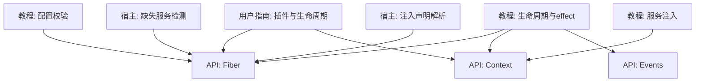
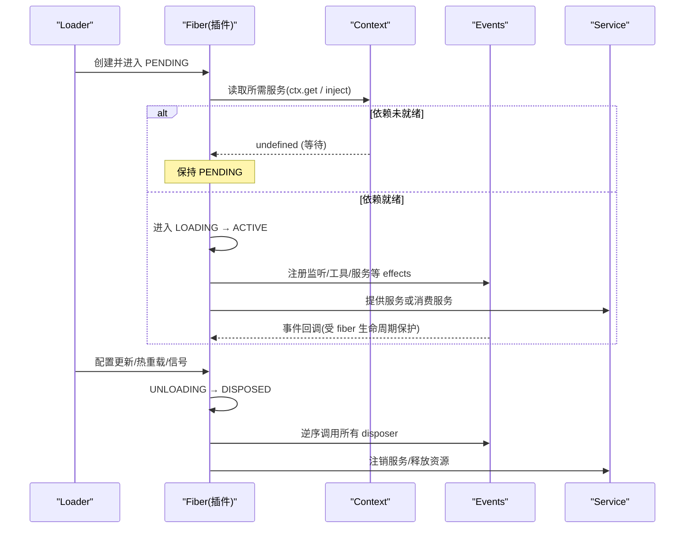
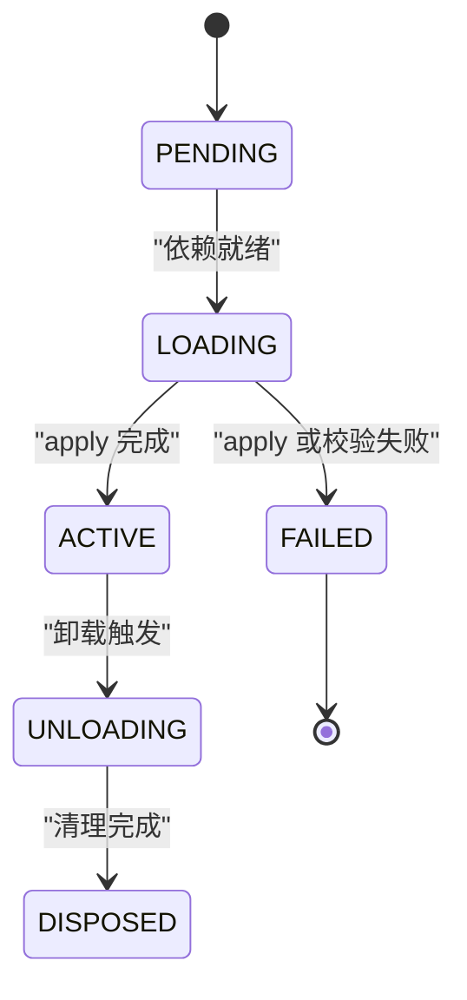
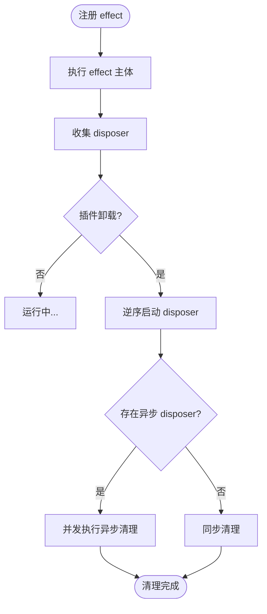
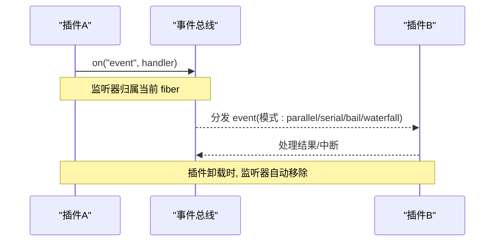
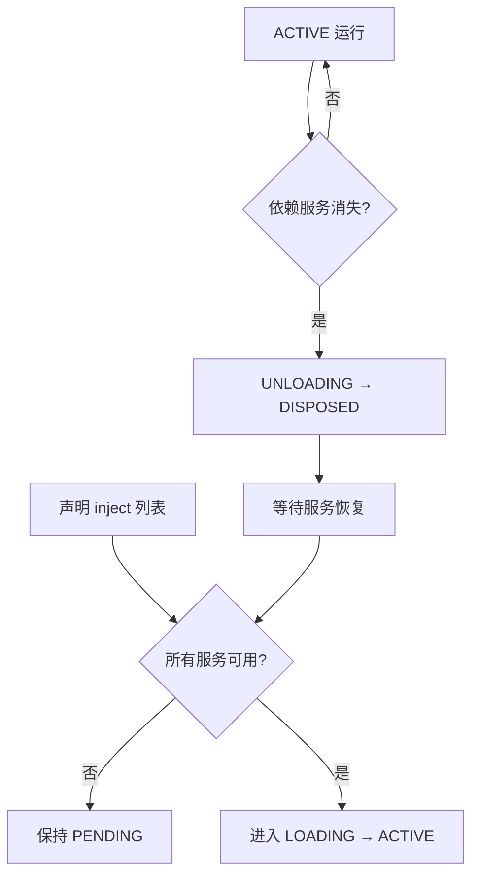
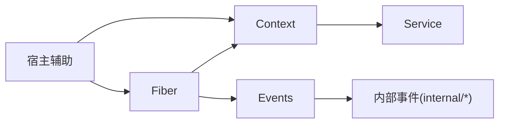

# 生命周期管理

<cite>
**本文引用的文件**
- [02-lifecycle-and-effects.md](file://docs/cordis-tutorial/02-lifecycle-and-effects.md)
- [02-lifecycle-and-effects.zh.md](file://docs/cordis-tutorial/02-lifecycle-and-effects.zh.md)
- [fiber.md](file://docs/cordis-api/fiber.md)
- [events.md](file://docs/cordis-api/events.md)
- [context.md](file://docs/cordis-api/context.md)
- [service.md](file://docs/cordis-api/service.md)
- [inherited.md](file://docs/cordis-api/inherited.md)
- [index.md](file://docs/user/develop/framework/index.md)
- [index.zh.md](file://docs/user/develop/framework/index.zh.md)
- [03-services.md](file://docs/cordis-tutorial/03-services.md)
- [05-config.md](file://docs/cordis-tutorial/05-config.md)
- [05-config.zh.md](file://docs/cordis-tutorial/05-config.zh.md)
- [config.md](file://docs/user/develop/basic/config.md)
- [lifecycle.ts](file://packages/extensions/cordis-host-runner/src/lifecycle.ts)
- [guard.ts](file://packages/extensions/cordis-host-runner/src/guard.ts)
- [testing.md](file://docs/testing.md)
</cite>

## 目录
1. [简介](#简介)
2. [项目结构](#项目结构)
3. [核心组件](#核心组件)
4. [架构总览](#架构总览)
5. [详细组件分析](#详细组件分析)
6. [依赖关系分析](#依赖关系分析)
7. [性能考虑](#性能考虑)
8. [故障排查指南](#故障排查指南)
9. [结论](#结论)
10. [附录](#附录)

## 简介
本文件系统性阐述 Cordis 插件的生命周期管理与 effect 系统，覆盖加载、初始化、激活、运行、卸载等阶段的执行时机与用途；解释效果注册、执行顺序与清理机制；说明插件间依赖如何影响生命周期执行顺序；提供自定义生命周期钩子的实践示例（启动前准备、运行时监控、优雅关闭）；总结资源管理、错误处理与性能优化的最佳实践；并给出调试与问题诊断方法。

## 项目结构
围绕生命周期与 effect 的核心文档与实现分布在教程、API 参考、用户开发指南以及宿主侧的运行时辅助中：
- 教程与入门：生命周期与 effect、服务注入、配置校验
- API 参考：Fiber、Context、Events、Service、继承事件
- 用户指南：插件模型、自动清理、依赖驱动加载
- 宿主侧：缺失服务检测、注入声明解析、守卫包装

图表来源
- [02-lifecycle-and-effects.md:1-99](file://docs/cordis-tutorial/02-lifecycle-and-effects.md#L1-L99)
- [fiber.md:1-376](file://docs/cordis-api/fiber.md#L1-L376)
- [context.md:1-365](file://docs/cordis-api/context.md#L1-L365)
- [events.md:1-208](file://docs/cordis-api/events.md#L1-L208)
- [index.zh.md:1-61](file://docs/user/develop/framework/index.zh.md#L1-L61)
- [03-services.md:59-78](file://docs/cordis-tutorial/03-services.md#L59-L78)
- [05-config.md:1-66](file://docs/cordis-tutorial/05-config.md#L1-L66)
- [lifecycle.ts:47-57](file://packages/extensions/cordis-host-runner/src/lifecycle.ts#L47-L57)
- [guard.ts:680-711](file://packages/extensions/cordis-host-runner/src/guard.ts#L680-L711)

章节来源
- [02-lifecycle-and-effects.md:1-99](file://docs/cordis-tutorial/02-lifecycle-and-effects.md#L1-L99)
- [fiber.md:1-376](file://docs/cordis-api/fiber.md#L1-L376)
- [context.md:1-365](file://docs/cordis-api/context.md#L1-L365)
- [events.md:1-208](file://docs/cordis-api/events.md#L1-L208)
- [index.zh.md:1-61](file://docs/user/develop/framework/index.zh.md#L1-L61)
- [03-services.md:59-78](file://docs/cordis-tutorial/03-services.md#L59-L78)
- [05-config.md:1-66](file://docs/cordis-tutorial/05-config.md#L1-L66)
- [lifecycle.ts:47-57](file://packages/extensions/cordis-host-runner/src/lifecycle.ts#L47-L57)
- [guard.ts:680-711](file://packages/extensions/cordis-host-runner/src/guard.ts#L680-L711)

## 核心组件
- Fiber（插件实例）：维护状态机、已验证配置、effects 集合与清理流程；提供 effect、dispose、await、restart、update、getEffects 等能力。
- Context（上下文）：服务解析、事件总线、插件注册、作用域隔离与拦截配置；所有生命周期 API 通过 ctx 暴露。
- Events（事件）：提供 emit、parallel、serial、bail、waterfall 多种分发模式；监听器随 fiber 卸载自动移除。
- Service（服务）：以命名方式注册到 ctx，生命周期与提供者的 fiber 绑定，消失时触发依赖者卸载与重加载。
- 宿主辅助：检测缺失服务、解析 inject 声明、对服务方法进行守卫包装，保障生命周期安全。

章节来源
- [fiber.md:1-376](file://docs/cordis-api/fiber.md#L1-L376)
- [context.md:1-365](file://docs/cordis-api/context.md#L1-L365)
- [events.md:1-208](file://docs/cordis-api/events.md#L1-L208)
- [service.md:1-103](file://docs/cordis-api/service.md#L1-L103)
- [lifecycle.ts:47-57](file://packages/extensions/cordis-host-runner/src/lifecycle.ts#L47-L57)
- [guard.ts:680-711](file://packages/extensions/cordis-host-runner/src/guard.ts#L680-L711)

## 架构总览
Cordis 以 Fiber 为最小生命周期单元，Context 承载服务与事件，Events 作为跨插件通信通道，Service 提供可被依赖的能力。宿主层在加载阶段检查依赖是否就绪，并在依赖变化时驱动插件卸载与重加载。

图表来源
- [02-lifecycle-and-effects.md:68-94](file://docs/cordis-tutorial/02-lifecycle-and-effects.md#L68-L94)
- [fiber.md:50-131](file://docs/cordis-api/fiber.md#L50-L131)
- [events.md:125-187](file://docs/cordis-api/events.md#L125-L187)
- [context.md:237-314](file://docs/cordis-api/context.md#L237-L314)
- [lifecycle.ts:47-57](file://packages/extensions/cordis-host-runner/src/lifecycle.ts#L47-L57)

## 详细组件分析

### Fiber 状态机与生命周期阶段
- 状态转换：PENDING → LOADING → ACTIVE → UNLOADING → DISPOSED；失败路径 LOADING → FAILED。
- 各阶段职责：
  - PENDING：声明了依赖但尚未就绪，不阻塞事件循环。
  - LOADING：依赖就绪，执行 apply，注册 effects。
  - ACTIVE：插件正常运行，响应事件与服务调用。
  - UNLOADING/DISPOSED：按逆序执行异步/同步 disposer，递归卸载子插件，最终稳定。
- 关键 API：
  - ctx.effect：注册带清理的效果体，返回 disposer；在卸载时统一回收。
  - fiber.dispose：触发卸载并等待全部清理完成。
  - fiber.await：等待当前生命周期工作并重新抛出启动错误。
  - fiber.restart/update：基于新配置重启，先运行 internal/update 水线。

图表来源
- [02-lifecycle-and-effects.md:68-82](file://docs/cordis-tutorial/02-lifecycle-and-effects.md#L68-L82)
- [fiber.md:91-131](file://docs/cordis-api/fiber.md#L91-L131)
- [index.zh.md:7-24](file://docs/user/develop/framework/index.zh.md#L7-L24)

章节来源
- [02-lifecycle-and-effects.md:68-94](file://docs/cordis-tutorial/02-lifecycle-and-effects.md#L68-L94)
- [fiber.md:50-275](file://docs/cordis-api/fiber.md#L50-L275)
- [index.zh.md:7-38](file://docs/user/develop/framework/index.zh.md#L7-L38)

### Effect 系统：注册、执行顺序与清理
- 注册时机：effect 主体在注册时立即执行；disposer 在卸载时按注册逆序执行。
- 并发与顺序：多个异步 disposer 并发执行；若需严格顺序，应在同一 disposer 内依次 await。
- 内置 effect：ctx.on、ctx.plugin、服务注册、工具注册等均自带清理语义。
- 诊断：通过 fiber.getEffects() 获取效果树用于排障。

图表来源
- [02-lifecycle-and-effects.md:7-94](file://docs/cordis-tutorial/02-lifecycle-and-effects.md#L7-L94)
- [fiber.md:276-313](file://docs/cordis-api/fiber.md#L276-L313)
- [fiber.md:195-210](file://docs/cordis-api/fiber.md#L195-L210)

章节来源
- [02-lifecycle-and-effects.md:7-94](file://docs/cordis-tutorial/02-lifecycle-and-effects.md#L7-L94)
- [fiber.md:276-313](file://docs/cordis-api/fiber.md#L276-L313)
- [fiber.md:195-210](file://docs/cordis-api/fiber.md#L195-L210)

### 事件系统与生命周期集成
- 分发模式：emit（同步忽略返回值）、parallel（并行等待）、serial（串行直到 bail）、bail（同步短路）、waterfall（链式 next）。
- 生命周期绑定：监听器由当前 fiber 拥有，卸载时自动移除；once 首次调用后自清理。
- 内部事件：internal/status、internal/plugin 等可用于监控生命周期与插件挂载。

图表来源
- [events.md:8-187](file://docs/cordis-api/events.md#L8-L187)
- [inherited.md:23-39](file://docs/cordis-api/inherited.md#L23-L39)

章节来源
- [events.md:8-187](file://docs/cordis-api/events.md#L8-L187)
- [inherited.md:23-39](file://docs/cordis-api/inherited.md#L23-L39)

### 服务与依赖驱动的加载顺序
- inject 声明：插件声明所需服务，Cordis 将其置于 PENDING 直至全部就绪。
- 动态依赖变化：服务提供者卸载或替换时，依赖该服务的插件自动卸载并待服务恢复后重新加载。
- 配置文件顺序无关：加载顺序由依赖关系决定，而非 cordis.yml 中的条目顺序。

图表来源
- [03-services.md:59-78](file://docs/cordis-tutorial/03-services.md#L59-L78)
- [index.zh.md:26-38](file://docs/user/develop/framework/index.zh.md#L26-L38)
- [lifecycle.ts:47-57](file://packages/extensions/cordis-host-runner/src/lifecycle.ts#L47-L57)
- [guard.ts:700-711](file://packages/extensions/cordis-host-runner/src/guard.ts#L700-L711)

章节来源
- [03-services.md:59-78](file://docs/cordis-tutorial/03-services.md#L59-L78)
- [index.zh.md:26-38](file://docs/user/develop/framework/index.zh.md#L26-L38)
- [lifecycle.ts:47-57](file://packages/extensions/cordis-host-runner/src/lifecycle.ts#L47-L57)
- [guard.ts:700-711](file://packages/extensions/cordis-host-runner/src/guard.ts#L700-L711)

### 配置校验与启动前准备
- 配置 schema：导出同名 Config 类型与运行时 schema，在 apply 前进行校验与默认值填充。
- 失败即停：无效配置直接报错，避免半配置启动。
- 启动前准备：在 effect 中完成连接建立、定时器启动、事件订阅等，确保卸载时能正确清理。

章节来源
- [05-config.md:1-66](file://docs/cordis-tutorial/05-config.md#L1-L66)
- [05-config.zh.md:1-66](file://docs/cordis-tutorial/05-config.zh.md#L1-L66)
- [config.md:1-72](file://docs/user/develop/basic/config.md#L1-L72)
- [02-lifecycle-and-effects.zh.md:7-94](file://docs/cordis-tutorial/02-lifecycle-and-effects.zh.md#L7-L94)

### 自定义生命周期钩子示例
- 启动前准备：在 effect 中建立外部资源（连接、定时器等），返回 disposer 负责关闭。
- 运行时监控：通过 ctx.on 订阅 internal/status 或业务事件，记录指标或告警。
- 优雅关闭：在 effect 中组合多个有序清理步骤，必要时在同一 disposer 内串行 await，保证顺序。

提示：具体代码示例请参考以下路径，避免在此处粘贴源码。
- 示例入口与输出说明：[02-lifecycle-and-effects.md:11-66](file://docs/cordis-tutorial/02-lifecycle-and-effects.md#L11-L66)
- 中文示例与说明：[02-lifecycle-and-effects.zh.md:11-66](file://docs/cordis-tutorial/02-lifecycle-and-effects.zh.md#L11-L66)

章节来源
- [02-lifecycle-and-effects.md:11-66](file://docs/cordis-tutorial/02-lifecycle-and-effects.md#L11-L66)
- [02-lifecycle-and-effects.zh.md:11-66](file://docs/cordis-tutorial/02-lifecycle-and-effects.zh.md#L11-L66)

## 依赖关系分析
- 组件耦合：
  - Fiber 依赖 Context 进行服务解析与事件操作。
  - Events 与 Context 紧密集成，监听器归属 fiber 生命周期。
  - Service 通过 Context 提供/消费，依赖变化驱动 Fiber 状态迁移。
- 外部依赖与集成点：
  - Loader/HMR/Timer 等扩展通过内部事件参与生命周期（如 internal/status、hmr/reload）。
  - 宿主侧通过 missingServices 与 declaredInjects 判断依赖与注入声明，驱动加载与守卫。

图表来源
- [fiber.md:50-131](file://docs/cordis-api/fiber.md#L50-L131)
- [context.md:120-161](file://docs/cordis-api/context.md#L120-L161)
- [events.md:125-187](file://docs/cordis-api/events.md#L125-L187)
- [inherited.md:23-39](file://docs/cordis-api/inherited.md#L23-L39)
- [lifecycle.ts:47-57](file://packages/extensions/cordis-host-runner/src/lifecycle.ts#L47-L57)
- [guard.ts:700-711](file://packages/extensions/cordis-host-runner/src/guard.ts#L700-L711)

章节来源
- [fiber.md:50-131](file://docs/cordis-api/fiber.md#L50-L131)
- [context.md:120-161](file://docs/cordis-api/context.md#L120-L161)
- [events.md:125-187](file://docs/cordis-api/events.md#L125-L187)
- [inherited.md:23-39](file://docs/cordis-api/inherited.md#L23-L39)
- [lifecycle.ts:47-57](file://packages/extensions/cordis-host-runner/src/lifecycle.ts#L47-L57)
- [guard.ts:700-711](file://packages/extensions/cordis-host-runner/src/guard.ts#L700-L711)

## 性能考虑
- 避免在 effect 主体中进行昂贵初始化；必要时延迟到首次使用时再建立。
- 合理使用事件分发模式：高吞吐场景优先 parallel；需要顺序控制时使用 serial 或 waterfall。
- 将必须串行的清理步骤放在同一 disposer 中依次 await，避免多异步 disposer 并发导致竞争。
- 使用 fiber.getEffects() 定期审计效果树，发现泄漏或重复注册。
- 配置校验前置，尽早失败，减少无效启动成本。

## 故障排查指南
- 常见问题定位：
  - 插件无输出：检查是否处于 PENDING（缺少依赖），查看 internal/status 事件与 fiber.state。
  - 启动失败：捕获 ValidationError（配置校验失败）或应用启动抛出的异常。
  - 卸载卡住：确认是否存在未完成的异步任务或未注册的清理逻辑。
- 诊断手段：
  - 监听 internal/status 与 internal/plugin 观察状态迁移。
  - 使用 fiber.getEffects() 查看当前效果树，定位未清理资源。
  - 通过 fiber.restart/update 结合日志，验证配置变更后的行为。
- 测试策略：
  - 单元测试覆盖 dispose 与 HMR 安全路径。
  - e2e 使用真实入口与构建产物，验证端到端生命周期。
  - 快照测试记录会话与 UI 行为，便于回归对比。

章节来源
- [inherited.md:23-39](file://docs/cordis-api/inherited.md#L23-L39)
- [fiber.md:195-210](file://docs/cordis-api/fiber.md#L195-L210)
- [fiber.md:212-275](file://docs/cordis-api/fiber.md#L212-L275)
- [testing.md:1-55](file://docs/testing.md#L1-L55)

## 结论
Cordis 通过 Fiber 状态机与 effect 系统实现了强一致的资源生命周期管理；依赖驱动加载确保插件仅在所需服务就绪时激活；事件系统提供灵活且安全的跨插件通信；配合配置校验与宿主辅助，形成从加载到卸载的全链路可控性。遵循本文的最佳实践与诊断方法，可在复杂系统中稳定地实现启动前准备、运行时监控与优雅关闭。

## 附录
- 快速参考：
  - 生命周期状态与含义：见“Fiber 状态机”
  - effect 注册与清理：见“Effect 系统”
  - 事件分发模式：见“事件系统”
  - 依赖驱动加载：见“服务与依赖驱动的加载顺序”
  - 配置校验：见“配置校验与启动前准备”
  - 自定义钩子示例：见“自定义生命周期钩子示例”