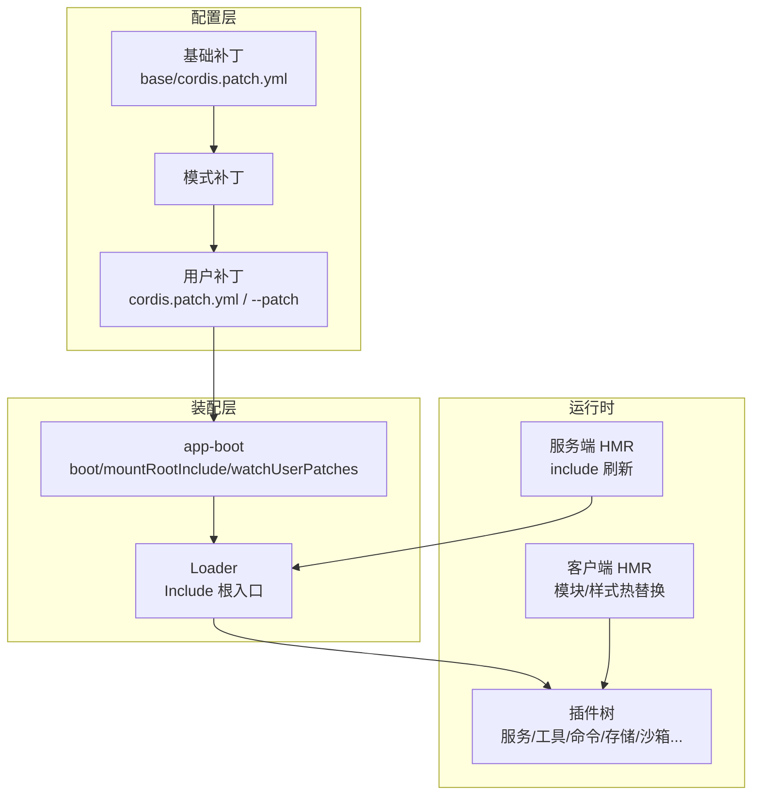
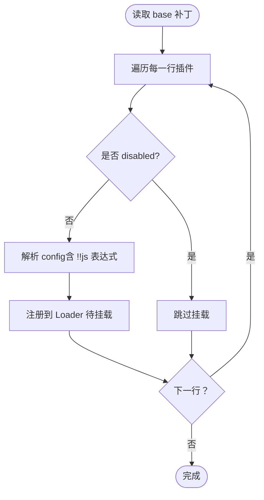
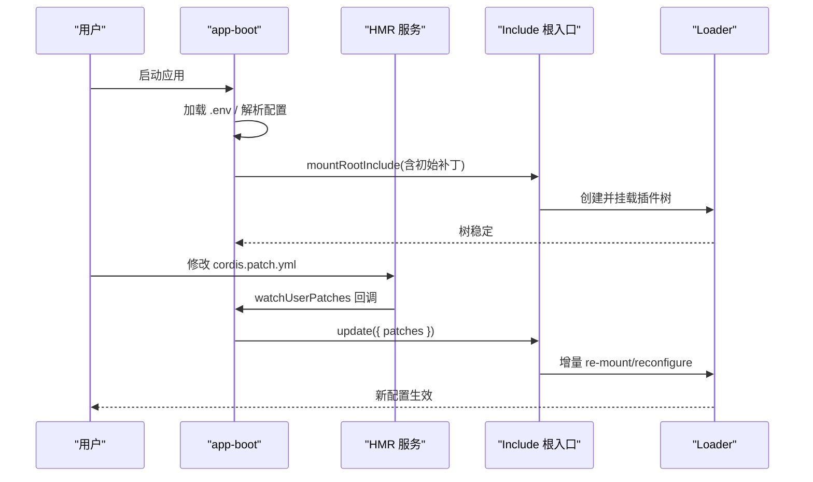
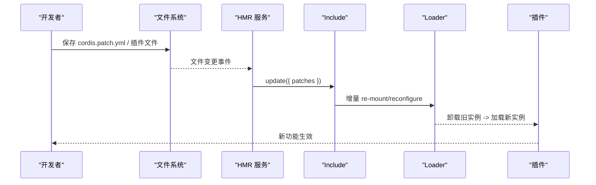
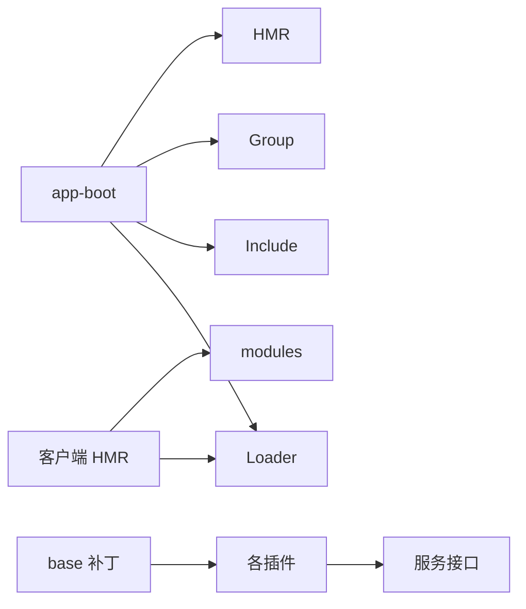

# 组合模式

<cite>
**本文引用的文件**
- [apps/cli/composition.md](file://apps/cli/composition.md)
- [packages/bundle/base/cordis.patch.yml](file://packages/bundle/base/cordis.patch.yml)
- [packages/boot/app-boot/src/index.ts](file://packages/boot/app-boot/src/index.ts)
- [docs/cordis-tutorial/06-composition-and-hmr.md](file://docs/cordis-tutorial/06-composition-and-hmr.md)
- [packages/client/hmr/src/client/index.ts](file://packages/client/hmr/src/client/index.ts)
- [packages/boot/app-boot/tests/config-reload.spec.ts](file://packages/boot/app-boot/tests/config-reload.spec.ts)
- [packages/boot/app-boot/tests/user-patches.spec.ts](file://packages/boot/app-boot/tests/user-patches.spec.ts)
- [packages/boot/app-boot/tests/hmr-config.spec.ts](file://packages/boot/app-boot/tests/hmr-config.spec.ts)
</cite>

## 目录
1. [简介](#简介)
2. [项目结构](#项目结构)
3. [核心组件](#核心组件)
4. [架构总览](#架构总览)
5. [详细组件分析](#详细组件分析)
6. [依赖关系分析](#依赖关系分析)
7. [性能考量](#性能考量)
8. [故障排查指南](#故障排查指南)
9. [结论](#结论)
10. [附录](#附录)

## 简介
本文件围绕 Cordis 的“组合模式”进行系统化说明，聚焦以下目标：
- 时空可组合性：通过配置驱动的插件树、补丁叠加与分组隔离，实现“何时加载、在哪里生效”的可控组合。
- HMR（热模块替换）：开发时热重载与生产环境优化策略，包括用户补丁层的热更新。
- 插件解耦：以接口抽象与服务注入实现松耦合通信。
- 实践示例：如何组合多个插件、处理配置冲突、扩展功能。
- 设计原则：依赖倒置、接口隔离等原则在组合中的落地。
- 调试与性能：组合调试方法与性能优化建议。

## 项目结构
Cordis 的组合由“基础包 + 模式包 + 用户层补丁”三层构成：
- 基础包提供共享能力（LLM、会话、工具、存储、沙箱等），以 cordis.patch.yml 声明式注册。
- 模式包按运行模式（web/headless/sdk 等）选择并覆盖默认值。
- 用户层补丁（cordis.patch.yml 或 --patch 覆盖）对已有行进行 id 定位的配置覆盖与 insert 插入，遵循“后写胜前”的合并规则。

图表来源
- [packages/bundle/base/cordis.patch.yml:1-516](file://packages/bundle/base/cordis.patch.yml#L1-L516)
- [packages/boot/app-boot/src/index.ts:230-285](file://packages/boot/app-boot/src/index.ts#L230-L285)

章节来源
- [apps/cli/composition.md:1-277](file://apps/cli/composition.md#L1-L277)
- [packages/bundle/base/cordis.patch.yml:1-516](file://packages/bundle/base/cordis.patch.yml#L1-L516)

## 核心组件
- 启动与装配器（app-boot）
  - 负责加载 .env、解析配置路径、安装失败快速失败守卫、装载 Include 根入口、应用补丁、驱动 Loader 直到整棵树稳定。
  - 关键能力：
    - 分层环境变量加载与校验（禁止危险变量被 .env 覆盖）。
    - 用户补丁层监听与事务性重应用（watchUserPatches）。
    - 离线渲染配置（renderConfigDump）用于诊断与可追溯性。
    - 启动审计（assertEntriesLoaded/assertEntriesActivated）确保所有条目正常激活。
- 基础补丁（base cordis.patch.yml）
  - 以 id 为锚点声明插件及其默认配置，支持 disabled、config、insert 等元数据。
  - 将运行时无关的默认值与模式相关配置分离，保持单行一职责。
- HMR（热模块替换）
  - 服务端：基于 Loader 的 include 刷新机制，按 id 差异增量 mount/unmount/reconfigure。
  - 客户端：订阅系统事件通道，热替换已构建的模块与样式。

章节来源
- [packages/boot/app-boot/src/index.ts:230-285](file://packages/boot/app-boot/src/index.ts#L230-L285)
- [packages/boot/app-boot/src/index.ts:381-506](file://packages/boot/app-boot/src/index.ts#L381-L506)
- [packages/boot/app-boot/src/index.ts:519-562](file://packages/boot/app-boot/src/index.ts#L519-L562)
- [packages/boot/app-boot/src/index.ts:684-758](file://packages/boot/app-boot/src/index.ts#L684-L758)
- [packages/bundle/base/cordis.patch.yml:15-516](file://packages/bundle/base/cordis.patch.yml#L15-L516)
- [packages/client/hmr/src/client/index.ts:69-102](file://packages/client/hmr/src/client/index.ts#L69-L102)

## 架构总览
下图展示了从配置到运行的完整链路：基础补丁 → 模式补丁 → 用户补丁 → Loader 装配 → 插件树稳定。HMR 在服务端与客户端分别介入，实现热重载。

图表来源
- [packages/bundle/base/cordis.patch.yml:15-516](file://packages/bundle/base/cordis.patch.yml#L15-L516)
- [packages/boot/app-boot/src/index.ts:230-285](file://packages/boot/app-boot/src/index.ts#L230-L285)
- [packages/boot/app-boot/src/index.ts:519-562](file://packages/boot/app-boot/src/index.ts#L519-L562)
- [packages/client/hmr/src/client/index.ts:69-102](file://packages/client/hmr/src/client/index.ts#L69-L102)

## 详细组件分析

### 组件A：基础补丁与插件注册（base cordis.patch.yml）
- 设计要点
  - 每行一个插件，使用稳定的 id 作为锚点，便于后续 patch 层精准覆盖。
  - 通过 disabled/config/insert 控制行为与配置；平台相关项通过 !!js 表达式在运行时求值。
  - 将“存在性”（是否启用某能力）与“具体配置”（如超时、路径）解耦，便于模式层与用户层各自关注自身维度。
- 典型用法
  - 启用/禁用能力：如 hmr、skill-badge 等默认关闭，按需开启。
  - 配置叠加：settings/credentials 等通过用户 settings.yaml 动态覆盖，无需重启。
  - 插入新插件：通过 insert 列表向现有树中追加能力。

图表来源
- [packages/bundle/base/cordis.patch.yml:15-516](file://packages/bundle/base/cordis.patch.yml#L15-L516)

章节来源
- [packages/bundle/base/cordis.patch.yml:15-516](file://packages/bundle/base/cordis.patch.yml#L15-L516)

### 组件B：启动装配与补丁叠加（app-boot）
- 启动流程
  - 解析配置路径（支持 replay 模式切换至快照配置）。
  - 加载分层 .env（进程 > 项目目录 > Harness home），严格拒绝危险变量名。
  - 装载 Include 根入口，应用初始补丁，驱动 Loader 直到树稳定。
  - 安装 fail-loud 守卫，捕获未处理的初始化拒绝并优雅退出。
  - 启动后审计：检查是否有未加载或未激活的条目。
- 用户补丁层热更新
  - 通过 HMR 服务监听 cordis.patch.yml，变化时重新计算 patches 并调用 entry.update 事务性重应用。
  - 保证“后写胜前”的合并语义，且与初次加载一致。

图表来源
- [packages/boot/app-boot/src/index.ts:230-285](file://packages/boot/app-boot/src/index.ts#L230-L285)
- [packages/boot/app-boot/src/index.ts:519-562](file://packages/boot/app-boot/src/index.ts#L519-L562)
- [packages/boot/app-boot/src/index.ts:684-758](file://packages/boot/app-boot/src/index.ts#L684-L758)

章节来源
- [packages/boot/app-boot/src/index.ts:64-72](file://packages/boot/app-boot/src/index.ts#L64-L72)
- [packages/boot/app-boot/src/index.ts:198-219](file://packages/boot/app-boot/src/index.ts#L198-L219)
- [packages/boot/app-boot/src/index.ts:230-285](file://packages/boot/app-boot/src/index.ts#L230-L285)
- [packages/boot/app-boot/src/index.ts:381-506](file://packages/boot/app-boot/src/index.ts#L381-L506)
- [packages/boot/app-boot/src/index.ts:519-562](file://packages/boot/app-boot/src/index.ts#L519-L562)
- [packages/boot/app-boot/src/index.ts:684-758](file://packages/boot/app-boot/src/index.ts#L684-L758)

### 组件C：HMR 工作原理与使用场景
- 服务端 HMR
  - 监听 cordis.patch.yml，变化时重新计算补丁并调用 include.update，仅变更受影响条目。
  - 要求具备 Loader 与 Include 服务，并通过 ctx.get('hmr') 获取 HMR 服务。
- 客户端 HMR
  - 订阅系统 SSE 事件通道，根据模块 id 查找对应 loader entry，移除旧样式标签并热替换模块。
  - 需要注入 loader 与 modules 服务。
- 开发 vs 生产
  - 开发：启用 hmr 插件与 timer（防抖）、console logger（日志可见），编辑 cordis.yml 或插件代码即时生效。
  - 生产：通常禁用 hmr 行（disabled: true），避免额外开销；通过部署层补丁控制能力开关。

图表来源
- [packages/boot/app-boot/src/index.ts:230-285](file://packages/boot/app-boot/src/index.ts#L230-L285)
- [packages/client/hmr/src/client/index.ts:69-102](file://packages/client/hmr/src/client/index.ts#L69-L102)

章节来源
- [docs/cordis-tutorial/06-composition-and-hmr.md:1-114](file://docs/cordis-tutorial/06-composition-and-hmr.md#L1-L114)
- [packages/boot/app-boot/tests/hmr-config.spec.ts:1-40](file://packages/boot/app-boot/tests/hmr-config.spec.ts#L1-L40)
- [packages/client/hmr/src/client/index.ts:69-102](file://packages/client/hmr/src/client/index.ts#L69-L102)

### 组件D：插件间解耦与接口抽象
- 服务注入与依赖声明
  - 插件通过 inject 声明所需服务，Loader 在挂载时按依赖顺序解析，缺失则进入 PENDING 状态等待。
  - 通过 ctx.inject / ctx.plugin 显式声明依赖，避免隐式耦合。
- 分组与隔离
  - 使用 group 与 isolate 为子树提供独立的服务命名空间，避免跨组污染。
- 最佳实践
  - 面向接口编程：插件只依赖抽象服务（如 storage、tools、commands），不直接依赖具体实现。
  - 最小化副作用：在 apply 中只做必要绑定，复杂逻辑延迟到事件或请求触发。

章节来源
- [docs/cordis-tutorial/06-composition-and-hmr.md:61-110](file://docs/cordis-tutorial/06-composition-and-hmr.md#L61-L110)
- [packages/boot/app-boot/src/index.ts:684-758](file://packages/boot/app-boot/src/index.ts#L684-L758)

### 组件E：配置冲突处理与合并策略
- 合并规则
  - 同一 id 的行，后一层覆盖前一层（last write wins）。
  - insert 列表按顺序追加，后续层仍可覆盖/禁用前面插入的行。
- 诊断与可视化
  - renderConfigDump 输出带来源注释的可执行 YAML，标注每行来自哪个文件以及被哪些层覆盖。
- 测试验证
  - 覆盖多层 patch 的场景，确保 later patch 能配置/禁用 earlier patch 插入的行。

章节来源
- [packages/boot/app-boot/src/index.ts:381-506](file://packages/boot/app-boot/src/index.ts#L381-L506)
- [packages/boot/app-boot/tests/config-reload.spec.ts:288-376](file://packages/boot/app-boot/tests/config-reload.spec.ts#L288-L376)

### 组件F：组合调试与性能优化
- 调试
  - 使用 assertEntriesLoaded/assertEntriesActivated 在启动后审计条目状态，定位未加载/未激活的插件。
  - 通过 HMR 日志与 console logger 观察热重载过程。
  - 使用 renderConfigDump 生成带来源注释的配置，快速定位覆盖来源。
- 性能
  - 合理拆分补丁层，减少不必要的重挂载。
  - 在生产禁用 hmr，避免监听与热替换开销。
  - 利用分组与隔离限制作用域，降低全局服务竞争。

章节来源
- [packages/boot/app-boot/src/index.ts:684-758](file://packages/boot/app-boot/src/index.ts#L684-L758)
- [docs/cordis-tutorial/06-composition-and-hmr.md:23-60](file://docs/cordis-tutorial/06-composition-and-hmr.md#L23-L60)

## 依赖关系分析
- 启动装配依赖
  - app-boot 依赖 Loader、Include、Group、HMR（可选）、Logger（可选）。
  - 基础补丁依赖各子系统插件（session、storage、tools、sandbox 等）。
- 运行时依赖
  - 插件之间通过服务接口交互，避免直接引用实现。
  - 客户端 HMR 依赖 loader 与 modules 服务。

图表来源
- [packages/boot/app-boot/src/index.ts:519-562](file://packages/boot/app-boot/src/index.ts#L519-L562)
- [packages/client/hmr/src/client/index.ts:69-102](file://packages/client/hmr/src/client/index.ts#L69-L102)
- [packages/bundle/base/cordis.patch.yml:15-516](file://packages/bundle/base/cordis.patch.yml#L15-L516)

章节来源
- [packages/boot/app-boot/src/index.ts:519-562](file://packages/boot/app-boot/src/index.ts#L519-L562)
- [packages/client/hmr/src/client/index.ts:69-102](file://packages/client/hmr/src/client/index.ts#L69-L102)

## 性能考量
- 启动阶段
  - 使用断言审计尽早发现未激活条目，避免静默失败。
  - 合理设置超时与重试（如 OTLP 导出、工具调用超时），防止阻塞。
- 运行时
  - 通过分组隔离减少全局服务竞争。
  - 在生产禁用 hmr，避免文件监听与热替换开销。
- 配置层
  - 使用 id 稳定锚点，减少因 id 变化导致的重复挂载。
  - 谨慎使用 insert，避免过多插入导致树过深。

[本节为通用指导，不直接分析具体文件]

## 故障排查指南
- 插件从未加载
  - 现象：插件处于 PENDING 状态，无日志。
  - 原因：inject 声明的服务未被提供。
  - 解决：添加对应插件提供该服务，或使用诊断插件枚举 fiber 状态。
- 配置未生效
  - 现象：期望的配置未出现。
  - 原因：id 不匹配或覆盖顺序错误。
  - 解决：使用 renderConfigDump 查看来源与覆盖链，调整补丁顺序。
- HMR 无效
  - 现象：修改配置或代码未热重载。
  - 原因：缺少 HMR 服务或 Logger；未正确注册 include 刷新。
  - 解决：确保引入 HMR 与 Timer，并在 app-boot 中启用 watchUserPatches。

章节来源
- [docs/cordis-tutorial/06-composition-and-hmr.md:61-110](file://docs/cordis-tutorial/06-composition-and-hmr.md#L61-L110)
- [packages/boot/app-boot/src/index.ts:684-758](file://packages/boot/app-boot/src/index.ts#L684-L758)
- [packages/boot/app-boot/tests/user-patches.spec.ts:146-177](file://packages/boot/app-boot/tests/user-patches.spec.ts#L146-L177)

## 结论
Cordis 的组合模式通过“配置即组合”的理念，将插件、配置与生命周期管理统一在 Loader 之上，借助 id 锚点与补丁叠加实现强大的时空可组合性。HMR 进一步提升了开发效率，而严格的启动审计与诊断工具保障了稳定性。遵循依赖倒置与接口隔离原则，可实现高内聚、低耦合的插件生态。

[本节为总结，不直接分析具体文件]

## 附录
- 常用操作速查
  - 启用/禁用插件：在补丁层设置 disabled: true/false。
  - 覆盖配置：使用 id 定位行并覆盖 config。
  - 插入新插件：使用 insert 列表追加。
  - 热重载：启用 HMR 与 Timer，修改 cordis.yml 或插件文件。
  - 诊断：使用 renderConfigDump 与 assertEntries* 系列函数。

[本节为补充信息，不直接分析具体文件]