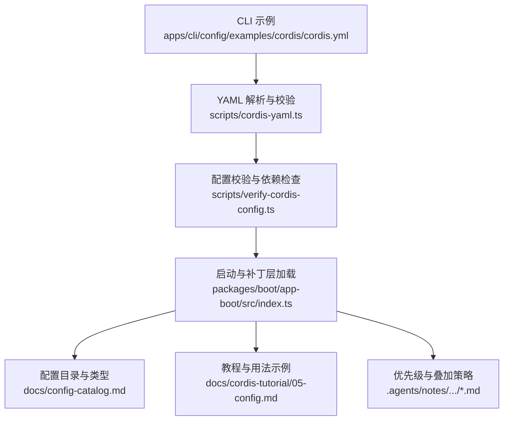
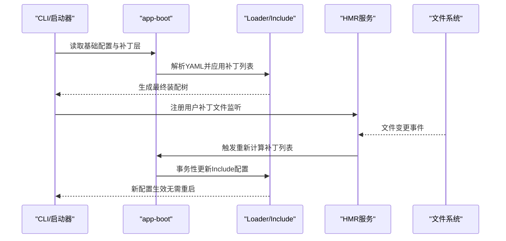
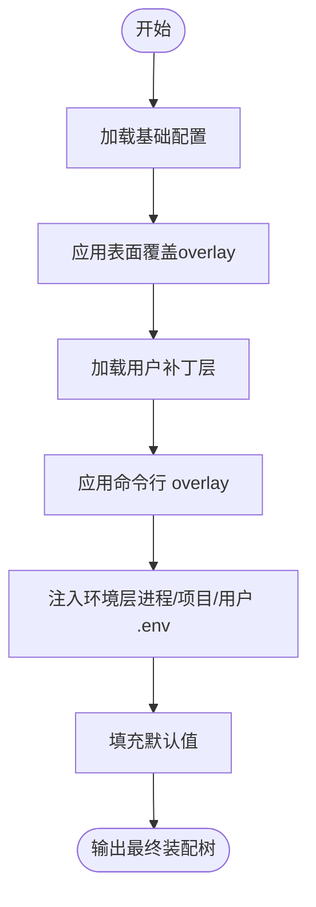
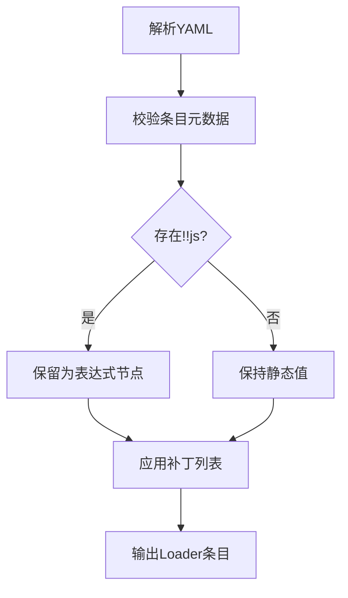
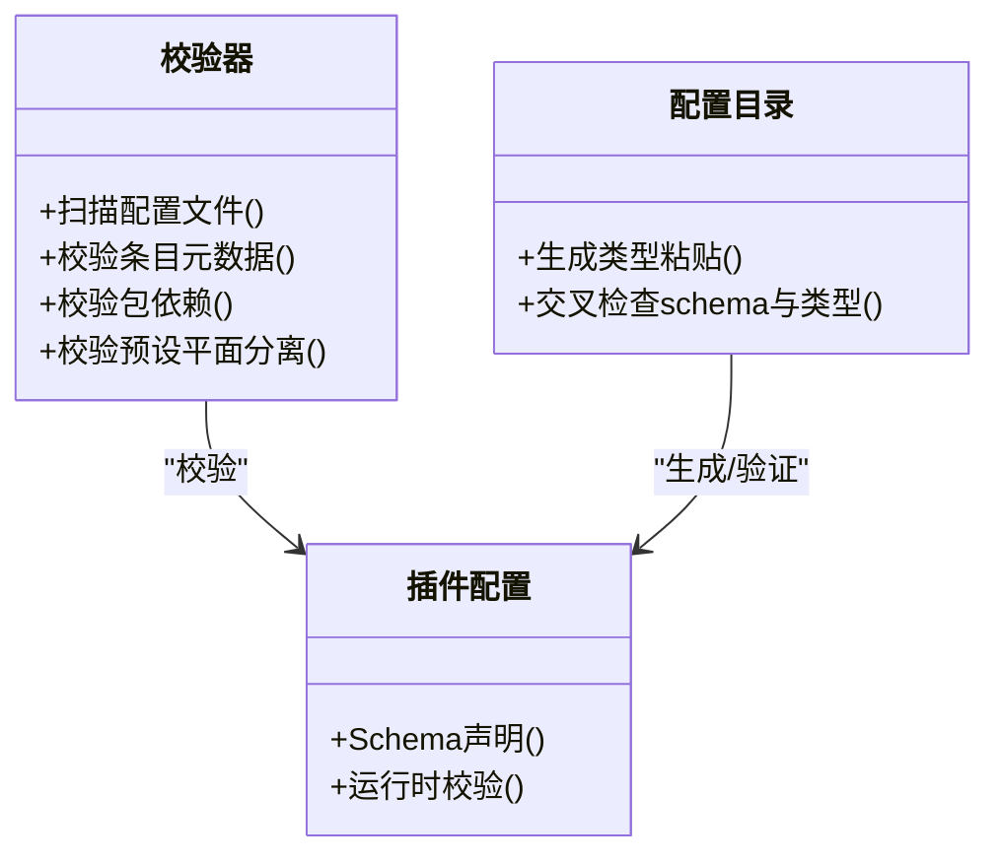
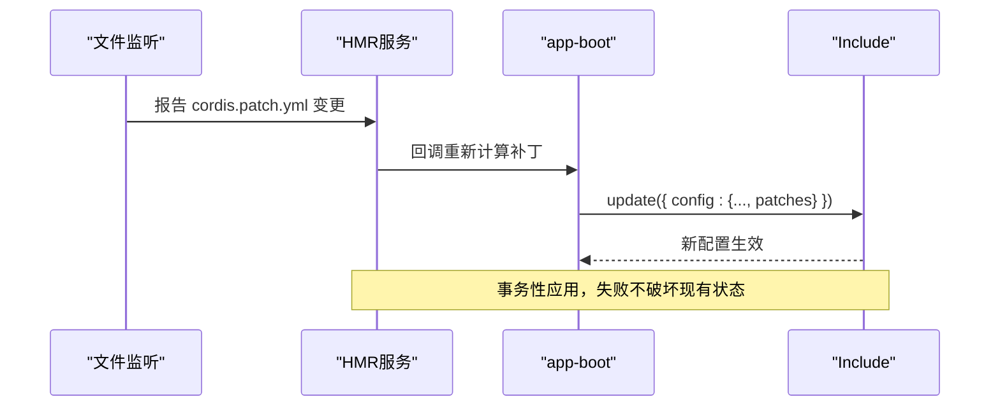
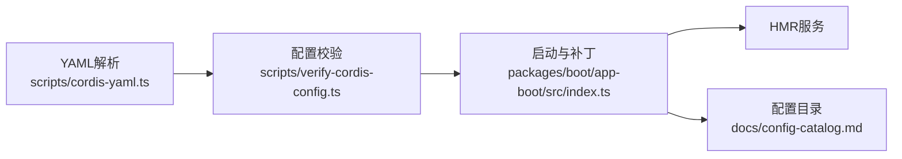

# 配置系统

<cite>
**本文引用的文件**
- [apps/cli/config/examples/cordis/cordis.yml](file://apps/cli/config/examples/cordis/cordis.yml)
- [scripts/cordis-yaml.ts](file://scripts/cordis-yaml.ts)
- [scripts/verify-cordis-config.ts](file://scripts/verify-cordis-config.ts)
- [packages/boot/app-boot/src/index.ts](file://packages/boot/app-boot/src/index.ts)
- [docs/config-catalog.md](file://docs/config-catalog.md)
- [docs/cordis-tutorial/05-config.md](file://docs/cordis-tutorial/05-config.md)
- [.agents/notes/implemented/architecture/2026-08-04-configuration-source-ownership.zh.md](file://.agents/notes/implemented/architecture/2026-08-04-configuration-source-ownership.zh.md)
- [.agents/notes/implemented/simplification/2026-07-29-shared-base-config-overlays.zh.md](file://.agents/notes/implemented/simplification/2026-07-29-shared-base-config-overlays.zh.md)
</cite>

## 目录
1. [简介](#简介)
2. [项目结构](#项目结构)
3. [核心组件](#核心组件)
4. [架构总览](#架构总览)
5. [详细组件分析](#详细组件分析)
6. [依赖关系分析](#依赖关系分析)
7. [性能考虑](#性能考虑)
8. [故障排查指南](#故障排查指南)
9. [结论](#结论)
10. [附录](#附录)

## 简介
本文件系统化说明 Cordis 配置系统的层次结构与叠加机制、配置文件格式与语法、配置验证与类型检查、动态更新与热重载，以及最佳实践与常见问题。Cordis 将应用“以配置即程序”的方式组织：通过 YAML 描述插件条目（entry）及其 `config`，由 Loader 在启动时解析并组装为单一扁平的装配树；运行时通过补丁层（patch overlay）与环境层对配置进行覆盖与扩展。

## 项目结构
仓库中与配置系统直接相关的代码与文档分布在以下位置：
- 示例与测试用的 Cordis 配置文件位于 `apps/cli/config/examples/**`，用于演示 patch overlay 的用法。
- 脚本工具提供 YAML 解析、校验与清单生成能力，如 `scripts/cordis-yaml.ts`、`scripts/verify-cordis-config.ts`。
- 启动器与用户补丁热重载逻辑集中在 `packages/boot/app-boot/src/index.ts`。
- 配置项目录与类型声明由 `docs/config-catalog.md` 自动生成与维护。
- 教程文档 `docs/cordis-tutorial/05-config.md` 展示了配置定义、验证失败与 `!!js` 表达式的使用方式。
- 架构决策笔记说明了优先级顺序与 base/overlay 设计取舍。

**图表来源**
- [apps/cli/config/examples/cordis/cordis.yml:1-20](file://apps/cli/config/examples/cordis/cordis.yml#L1-L20)
- [scripts/cordis-yaml.ts:1-55](file://scripts/cordis-yaml.ts#L1-L55)
- [scripts/verify-cordis-config.ts:60-88](file://scripts/verify-cordis-config.ts#L60-L88)
- [packages/boot/app-boot/src/index.ts:200-399](file://packages/boot/app-boot/src/index.ts#L200-L399)
- [docs/config-catalog.md:1-800](file://docs/config-catalog.md#L1-L800)
- [docs/cordis-tutorial/05-config.md:1-85](file://docs/cordis-tutorial/05-config.md#L1-L85)
- [.agents/notes/implemented/architecture/2026-08-04-configuration-source-ownership.zh.md:17-40](file://.agents/notes/implemented/architecture/2026-08-04-configuration-source-ownership.zh.md#L17-L40)

**章节来源**
- [apps/cli/config/examples/cordis/cordis.yml:1-20](file://apps/cli/config/examples/cordis/cordis.yml#L1-L20)
- [scripts/cordis-yaml.ts:1-55](file://scripts/cordis-yaml.ts#L1-L55)
- [scripts/verify-cordis-config.ts:60-88](file://scripts/verify-cordis-config.ts#L60-L88)
- [packages/boot/app-boot/src/index.ts:200-399](file://packages/boot/app-boot/src/index.ts#L200-L399)
- [docs/config-catalog.md:1-800](file://docs/config-catalog.md#L1-L800)
- [docs/cordis-tutorial/05-config.md:1-85](file://docs/cordis-tutorial/05-config.md#L1-L85)
- [.agents/notes/implemented/architecture/2026-08-04-configuration-source-ownership.zh.md:17-40](file://.agents/notes/implemented/architecture/2026-08-04-configuration-source-ownership.zh.md#L17-L40)

## 核心组件
- YAML 解析与 `!!js` 表达式保留：使用自定义 schema 将 `!!js` 标量作为数据节点保留，供 Loader 在上下文可用时插值执行。
- 配置校验与依赖检查：扫描所有 `*cordis*.yml` 文件，校验 entry 元数据、包依赖解析、预设与宿主平面分离等约束。
- 启动与补丁层：加载基础配置与多个补丁层（profile bundles、用户 patch 层、命令行 overlay），按统一算法合并为最终装配树。
- 配置目录与类型：自动生成每个插件可配置的字段与类型，确保部署侧配置与运行时 schema 一致。
- 热重载与响应：监听用户补丁文件变更，通过 HMR 事务性重新应用补丁到根 Include，避免重启整个树。

**章节来源**
- [scripts/cordis-yaml.ts:1-55](file://scripts/cordis-yaml.ts#L1-L55)
- [scripts/verify-cordis-config.ts:60-88](file://scripts/verify-cordis-config.ts#L60-L88)
- [packages/boot/app-boot/src/index.ts:200-399](file://packages/boot/app-boot/src/index.ts#L200-L399)
- [docs/config-catalog.md:1-800](file://docs/config-catalog.md#L1-L800)

## 架构总览
Cordis 的配置装配遵循“单一扁平装配树”的原则：基础配置（base）与表面特定覆盖（surface overlay）共同构成完整行集合；随后再叠加用户补丁层与命令行 overlay。补丁整体替换目标行的 `config`，而非深合并，因此跨 surface 的差异应放在 overlay 中。

**图表来源**
- [packages/boot/app-boot/src/index.ts:200-399](file://packages/boot/app-boot/src/index.ts#L200-L399)
- [scripts/cordis-yaml.ts:1-55](file://scripts/cordis-yaml.ts#L1-L55)
- [scripts/verify-cordis-config.ts:60-88](file://scripts/verify-cordis-config.ts#L60-L88)

## 详细组件分析

### 配置层次与叠加机制
- 基础配置（base）：包含两个 surface 都会挂载的行与配置项。
- 表面覆盖（overlay）：TUI/Web 各自声明差异化的配置项与插入行，作为同一 include 层级上的平级补丁列表。
- 用户补丁层（user patch layer）：个人 `~/.dsh/config.yaml` 或 profile 的 `cordis.patch.yml`，通过 HMR 监听并事务性重应用。
- 命令行 overlay：`--config` 用单个 overlay 取代个人 overlay；`--config-replace` 以整棵树启动，绕过 base、surface overlay 与个人 overlay。
- 优先级规则（非机密值）：显式运行参数 > 用户设置（settings.yaml）> 组合（profile bundles、用户补丁层、--patch overlays）> 本次 shell 继承环境 > 发现的文件（`.env`）> 默认值（schema default/provider public default）。
- 凭据优先级（独立顺序）：继承进程环境变量（只读且胜出）> `$DSH_HOME/.credentials.yaml`（受管、可写）> `<invocation cwd>/.env` > `$DSH_HOME/.env`。

**图表来源**
- [.agents/notes/implemented/simplification/2026-07-29-shared-base-config-overlays.zh.md:19-27](file://.agents/notes/implemented/simplification/2026-07-29-shared-base-config-overlays.zh.md#L19-L27)
- [.agents/notes/implemented/architecture/2026-08-04-configuration-source-ownership.zh.md:17-40](file://.agents/notes/implemented/architecture/2026-08-04-configuration-source-ownership.zh.md#L17-L40)
- [packages/boot/app-boot/src/index.ts:200-399](file://packages/boot/app-boot/src/index.ts#L200-L399)

**章节来源**
- [.agents/notes/implemented/simplification/2026-07-29-shared-base-config-overlays.zh.md:19-27](file://.agents/notes/implemented/simplification/2026-07-29-shared-base-config-overlays.zh.md#L19-L27)
- [.agents/notes/implemented/architecture/2026-08-04-configuration-source-ownership.zh.md:17-40](file://.agents/notes/implemented/architecture/2026-08-04-configuration-source-ownership.zh.md#L17-L40)
- [packages/boot/app-boot/src/index.ts:200-399](file://packages/boot/app-boot/src/index.ts#L200-L399)

### 配置文件格式与语法
- 顶层必须是 Loader 条目数组；每个条目支持 `id`、`name`、`group`、`inject`、`intercept`、`isolate` 等元数据。
- 支持 `insert` 列表插入新行；`@deepseek-ai/cordis-plugin-include` 的 `patches` 列表用于 id 定位的配置覆盖与插入。
- `!!js` 表达式仅在 `config` 与条目的 `disabled` 字段中允许作为表达式节点；其他元数据字段必须保持静态。
- 补丁文件缺失与不可解析的处理：可选补丁缺失视为无层；必需 overlay 缺失抛出错误。

**图表来源**
- [scripts/cordis-yaml.ts:1-55](file://scripts/cordis-yaml.ts#L1-L55)
- [scripts/verify-cordis-config.ts:488-556](file://scripts/verify-cordis-config.ts#L488-L556)
- [packages/boot/app-boot/src/index.ts:287-371](file://packages/boot/app-boot/src/index.ts#L287-L371)

**章节来源**
- [scripts/cordis-yaml.ts:1-55](file://scripts/cordis-yaml.ts#L1-L55)
- [scripts/verify-cordis-config.ts:488-556](file://scripts/verify-cordis-config.ts#L488-L556)
- [packages/boot/app-boot/src/index.ts:287-371](file://packages/boot/app-boot/src/index.ts#L287-L371)

### 配置验证与类型检查
- 插件配置通过 Schemastery（或其他 Standard Schema）声明，并在 `apply` 前完成校验；无效配置会阻止插件启动。
- 仓库级校验脚本遍历所有 Cordis 配置文件，检查条目合法性、包依赖解析、预设与宿主平面分离、客户端半面声明一致性等。
- 配置目录由源码生成，保证运行时 schema 与粘贴的类型声明一致，防止 loader 接受未在 schema 中声明的键。

**图表来源**
- [scripts/verify-cordis-config.ts:60-88](file://scripts/verify-cordis-config.ts#L60-L88)
- [docs/config-catalog.md:1-800](file://docs/config-catalog.md#L1-L800)
- [docs/cordis-tutorial/05-config.md:1-85](file://docs/cordis-tutorial/05-config.md#L1-L85)

**章节来源**
- [scripts/verify-cordis-config.ts:60-88](file://scripts/verify-cordis-config.ts#L60-L88)
- [docs/config-catalog.md:1-800](file://docs/config-catalog.md#L1-L800)
- [docs/cordis-tutorial/05-config.md:1-85](file://docs/cordis-tutorial/05-config.md#L1-L85)

### 动态更新与热重载
- 用户补丁层通过 HMR 精确路径监听；当文件变更时，重新计算补丁列表并以事务性方式更新根 Include 的配置，避免重启整个树。
- 若缺少 HMR 服务或根 Include，则抛出明确错误；在进程退出期间注册失败会被安全忽略，返回空操作释放器。
- Include 自身配置也可通过 `update` 动态刷新，新的补丁立即生效并保持持久化。

**图表来源**
- [packages/boot/app-boot/src/index.ts:246-285](file://packages/boot/app-boot/src/index.ts#L246-L285)
- [packages/boot/app-boot/src/index.ts:318-371](file://packages/boot/app-boot/src/index.ts#L318-L371)

**章节来源**
- [packages/boot/app-boot/src/index.ts:246-285](file://packages/boot/app-boot/src/index.ts#L246-L285)
- [packages/boot/app-boot/src/index.ts:318-371](file://packages/boot/app-boot/src/index.ts#L318-L371)

### 示例与用法
- 定义配置项：在插件中导出 TypeScript 接口与对应的 Schema，并在 `cordis.yml` 的 `config` 块中设置字段。
- 读取配置值：插件的 `apply(ctx, config)` 接收已验证且完整的配置对象。
- 动态更新配置：通过 HMR 监听用户补丁文件，或使用 Include 的 `update` 方法刷新配置。
- 条件配置：在 `disabled` 字段中使用 `!!js` 表达式基于平台或环境决定是否挂载某一行。

**章节来源**
- [docs/cordis-tutorial/05-config.md:1-85](file://docs/cordis-tutorial/05-config.md#L1-L85)
- [apps/cli/config/examples/cordis/cordis.yml:1-20](file://apps/cli/config/examples/cordis/cordis.yml#L1-L20)
- [packages/boot/app-boot/src/index.ts:246-285](file://packages/boot/app-boot/src/index.ts#L246-L285)

## 依赖关系分析
- 配置解析与校验依赖 `js-yaml` 与自定义 schema，确保 `!!js` 表达式被正确识别与保留。
- 启动器依赖 HMR 服务实现用户补丁的热重载；缺少 HMR 时会明确报错。
- 配置目录生成依赖源码中的 Schema 声明，保证部署配置与运行时 schema 的一致性。
- 校验脚本依赖工作区 manifest 与 tsconfig paths，确保本地包引用通过源平面解析。

**图表来源**
- [scripts/cordis-yaml.ts:1-55](file://scripts/cordis-yaml.ts#L1-L55)
- [scripts/verify-cordis-config.ts:60-88](file://scripts/verify-cordis-config.ts#L60-L88)
- [packages/boot/app-boot/src/index.ts:200-399](file://packages/boot/app-boot/src/index.ts#L200-L399)
- [docs/config-catalog.md:1-800](file://docs/config-catalog.md#L1-L800)

**章节来源**
- [scripts/cordis-yaml.ts:1-55](file://scripts/cordis-yaml.ts#L1-L55)
- [scripts/verify-cordis-config.ts:60-88](file://scripts/verify-cordis-config.ts#L60-L88)
- [packages/boot/app-boot/src/index.ts:200-399](file://packages/boot/app-boot/src/index.ts#L200-L399)
- [docs/config-catalog.md:1-800](file://docs/config-catalog.md#L1-L800)

## 性能考虑
- 补丁列表采用单遍 id 索引与原地重写/追加策略，减少重复计算与内存占用。
- 热重载通过精确路径监听与事务性更新，避免全量重启带来的开销。
- 配置目录生成与校验在构建/CI阶段执行，不影响运行时性能。

[本节为通用指导，无需具体文件分析]

## 故障排查指南
- 配置解析失败：检查 YAML 是否为顶层数组；确认 `!!js` 仅出现在允许的字段（`config`、`disabled`）。
- 依赖解析失败：确保插件名称在对应 manifest 中声明；本地包需通过 tsconfig paths 映射到源文件。
- 热重载未生效：确认已启用 HMR 服务且根 Include 存在；检查监听文件路径是否正确。
- 配置未覆盖预期：核对优先级顺序，确认更高优先级的层未遮蔽期望值；注意补丁整体替换 `config` 的行为。

**章节来源**
- [scripts/verify-cordis-config.ts:488-556](file://scripts/verify-cordis-config.ts#L488-L556)
- [packages/boot/app-boot/src/index.ts:246-285](file://packages/boot/app-boot/src/index.ts#L246-L285)
- [.agents/notes/implemented/architecture/2026-08-04-configuration-source-ownership.zh.md:17-40](file://.agents/notes/implemented/architecture/2026-08-04-configuration-source-ownership.zh.md#L17-L40)

## 结论
Cordis 配置系统以“配置即程序”的理念，通过 YAML 与补丁层实现灵活、可维护的装配模型。其严格的校验与类型检查、清晰的优先级与叠加规则、以及基于 HMR 的热重载机制，使得配置既安全又高效。遵循最佳实践与常见问题的解决方案，可以显著提升开发与运维效率。

[本节为总结，无需具体文件分析]

## 附录
- 参考示例：`apps/cli/config/examples/cordis/cordis.yml` 展示如何以 patch overlay 形式覆盖 webserver 端口并插入 Cordis 工具。
- 教程指引：`docs/cordis-tutorial/05-config.md` 提供配置定义、验证失败与 `!!js` 表达式的实操步骤。
- 配置目录：`docs/config-catalog.md` 列出各插件的可配置字段与类型，便于部署与调试。

**章节来源**
- [apps/cli/config/examples/cordis/cordis.yml:1-20](file://apps/cli/config/examples/cordis/cordis.yml#L1-L20)
- [docs/cordis-tutorial/05-config.md:1-85](file://docs/cordis-tutorial/05-config.md#L1-L85)
- [docs/config-catalog.md:1-800](file://docs/config-catalog.md#L1-L800)