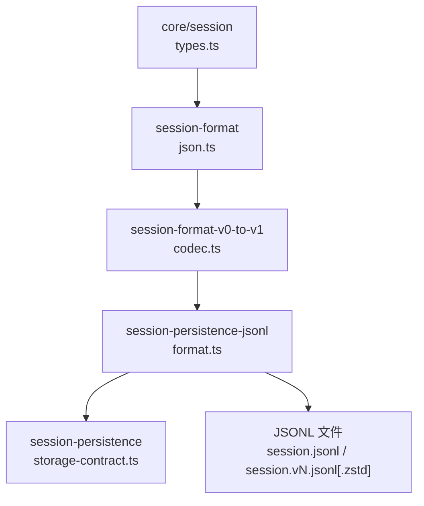
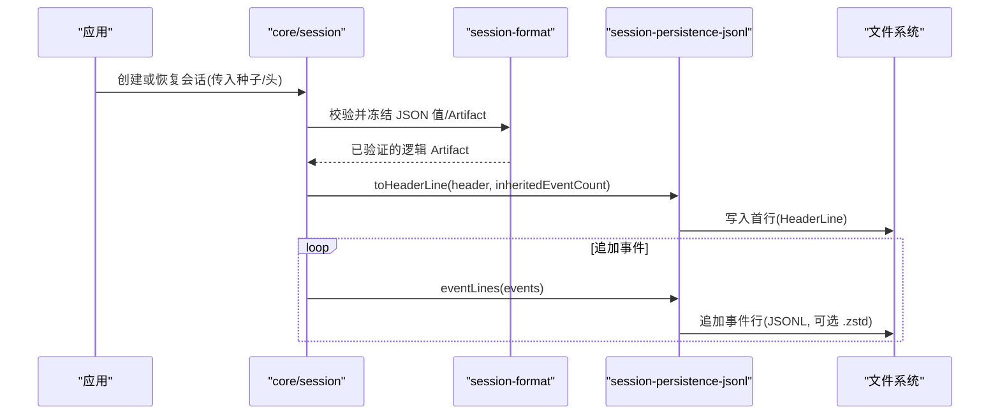
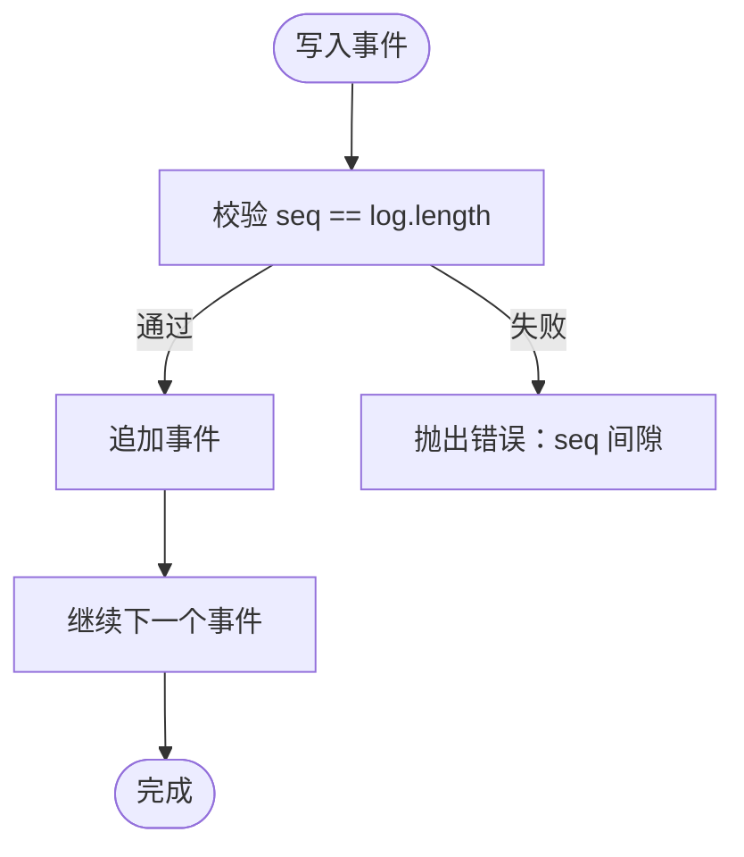
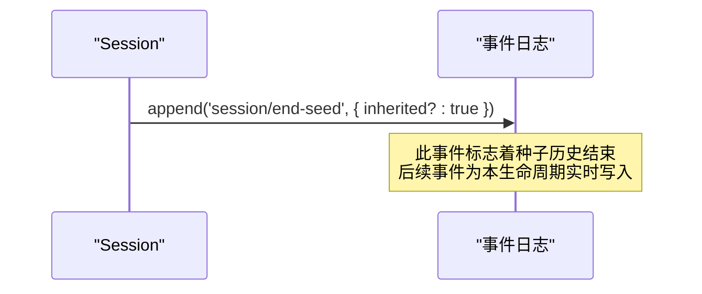
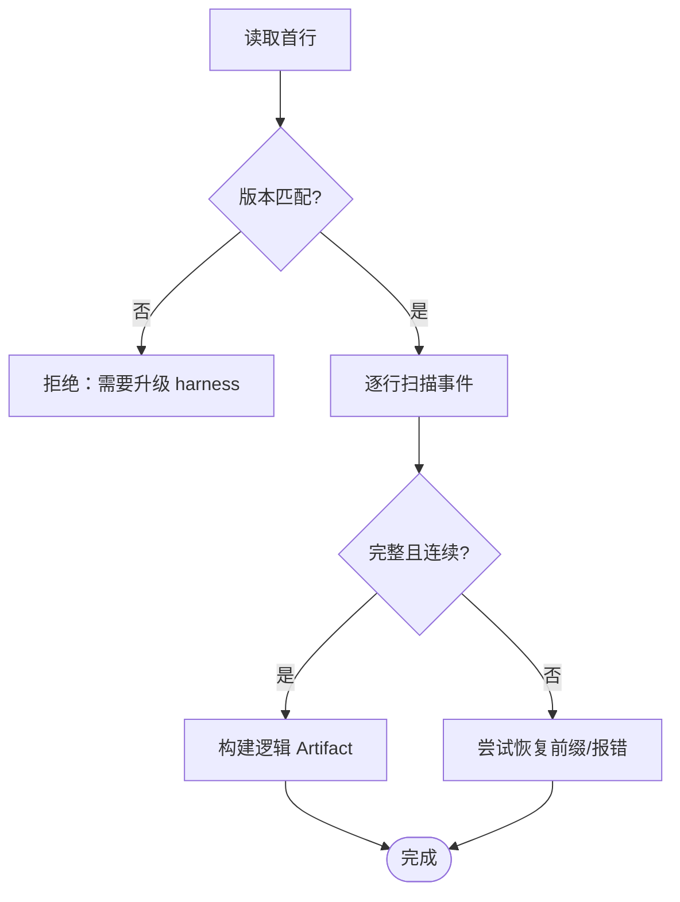
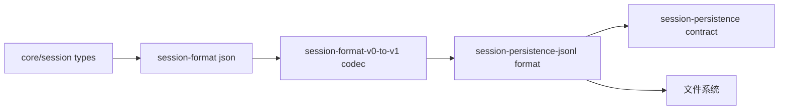

# 事件序列化与持久化

<cite>
**本文引用的文件**
- [packages/core/session/src/types.ts](file://packages/core/session/src/types.ts)
- [packages/session/session-format/src/json.ts](file://packages/session/session-format/src/json.ts)
- [packages/session/session-format-v0-to-v1/src/codec.ts](file://packages/session/session-format-v0-to-v1/src/codec.ts)
- [packages/session/session-persistence-jsonl/src/format.ts](file://packages/session/session-persistence-jsonl/src/format.ts)
- [packages/session/session-persistence/src/storage-contract.ts](file://packages/session/session-persistence/src/storage-contract.ts)
- [docs/subsystems/persistence.md](file://docs/subsystems/persistence.md)
- [docs/persistence-catalog.zh.md](file://docs/persistence-catalog.zh.md)
- [.agents/notes/implemented/architecture/2026-07-30-session-end-seed-log-boundary.md](file://.agents/notes/implemented/architecture/2026-07-30-session-end-seed-log-boundary.md)
- [packages/core/session/tests/session.spec.ts](file://packages/core/session/tests/session.spec.ts)
- [packages/core/session/tests/sequence-types.spec.ts](file://packages/core/session/tests/sequence-types.spec.ts)
</cite>

## 目录
1. [简介](#简介)
2. [项目结构](#项目结构)
3. [核心组件](#核心组件)
4. [架构总览](#架构总览)
5. [详细组件分析](#详细组件分析)
6. [依赖关系分析](#依赖关系分析)
7. [性能考量](#性能考量)
8. [故障排查指南](#故障排查指南)
9. [结论](#结论)
10. [附录](#附录)

## 简介
本文件聚焦会话事件的序列化与持久化，围绕以下目标展开：
- 解释 SESSION_FORMAT_VERSION 版本管理机制，说明为何采用单一单调递增版本号以及何时需要升级。
- 阐述 SessionHeader 的作用与字段含义（version、id、createdAt、cwd 等）。
- 说明事件序列号 seq 与时间戳 time 的设计原理，如何保证顺序性与时间一致性。
- 描述 session/end-seed 事件的作用，区分“种子历史”和“实时事件”。
- 提供序列化格式示例与持久化存储最佳实践，帮助制定长期存储策略。

## 项目结构
与事件序列化与持久化相关的代码分布在多个包中，职责清晰分层：
- 类型与协议定义：core/session 中的 types.ts 定义了会话事件模型、SessionHeader、版本常量等。
- 格式校验与快照：session-format 提供 JSON 值快照、版本检查、artifact 完整性校验。
- 历史格式迁移：session-format-v0-to-v1 负责将旧版物理格式解码为当前逻辑格式。
- 持久化实现：session-persistence-jsonl 提供 JSONL 编码、路径规划、头行解析、扫描恢复等。
- 存储契约：session-persistence 提供版本拒绝策略等通用约束。

图表来源
- [packages/core/session/src/types.ts:65-86](file://packages/core/session/src/types.ts#L65-L86)
- [packages/session/session-format/src/json.ts:51-79](file://packages/session/session-format/src/json.ts#L51-L79)
- [packages/session/session-format-v0-to-v1/src/codec.ts:30-74](file://packages/session/session-format-v0-to-v1/src/codec.ts#L30-L74)
- [packages/session/session-persistence-jsonl/src/format.ts:75-137](file://packages/session/session-persistence-jsonl/src/format.ts#L75-L137)
- [packages/session/session-persistence/src/storage-contract.ts:41-53](file://packages/session/session-persistence/src/storage-contract.ts#L41-L53)

章节来源
- [packages/core/session/src/types.ts:65-86](file://packages/core/session/src/types.ts#L65-L86)
- [packages/session/session-format/src/json.ts:51-79](file://packages/session/session-format/src/json.ts#L51-L79)
- [packages/session/session-format-v0-to-v1/src/codec.ts:30-74](file://packages/session/session-format-v0-to-v1/src/codec.ts#L30-L74)
- [packages/session/session-persistence-jsonl/src/format.ts:75-137](file://packages/session/session-persistence-jsonl/src/format.ts#L75-L137)
- [packages/session/session-persistence/src/storage-contract.ts:41-53](file://packages/session/session-persistence/src/storage-contract.ts#L41-L53)

## 核心组件
- 会话事件模型与版本常量：SessionEvent、SessionHeader、SESSION_FORMAT_VERSION 等。
- 格式校验与快照：对 header、events 进行严格类型与完整性校验，确保可丢失性 JSON。
- 历史格式编解码：v0/v1 到当前逻辑格式的相邻迁移链，保障向后兼容。
- JSONL 持久化：头行与事件行的序列化/反序列化、压缩后缀、路径规范、断点续写与截断恢复。
- 存储契约：拒绝不支持的版本，统一错误语义。

章节来源
- [packages/core/session/src/types.ts:88-128](file://packages/core/session/src/types.ts#L88-L128)
- [packages/session/session-format/src/json.ts:81-115](file://packages/session/session-format/src/json.ts#L81-L115)
- [packages/session/session-format-v0-to-v1/src/codec.ts:76-125](file://packages/session/session-format-v0-to-v1/src/codec.ts#L76-L125)
- [packages/session/session-persistence-jsonl/src/format.ts:310-349](file://packages/session/session-persistence-jsonl/src/format.ts#L310-L349)
- [packages/session/session-persistence/src/storage-contract.ts:41-53](file://packages/session/session-persistence/src/storage-contract.ts#L41-L53)

## 架构总览
下图展示了从创建会话到写入 JSONL 的端到端流程，包括版本检查、头行生成、事件行序列化与压缩。

图表来源
- [packages/core/session/src/types.ts:88-128](file://packages/core/session/src/types.ts#L88-L128)
- [packages/session/session-format/src/json.ts:81-115](file://packages/session/session-format/src/json.ts#L81-L115)
- [packages/session/session-persistence-jsonl/src/format.ts:114-137](file://packages/session/session-persistence-jsonl/src/format.ts#L114-L137)
- [packages/session/session-persistence-jsonl/src/format.ts:310-318](file://packages/session/session-persistence-jsonl/src/format.ts#L310-L318)

## 详细组件分析

### 版本管理：SESSION_FORMAT_VERSION
- 设计要点
  - 使用单一单调递增整数版本，无主/次版本拆分。
  - 版本是否升级由“写入者”决定：当旧运行时无法正确读取新日志时，必须升级版本。仅“能解析但不正确”不算安全。
  - 结构性变更才触发升级：header 形状、事件信封、核心事件语义、表面机制（SurfaceEventType/SurfaceOp）变化。新增普通事件类型不升级，通过 ignorable 标记处理词汇增长。
  - 当前构建只接受当前版本；读取历史数据时通过相邻迁移链逐步转换。
- 何时升级
  - 修改了 SessionHeader 结构。
  - 修改了 SessionEvent 信封或核心事件语义。
  - 改变了 SurfaceEventType 集合或 SurfaceOp 变体。
  - 任何可能导致旧运行时“静默丢弃关键内容”的结构变更。
- 当前值
  - 当前逻辑版本常量为 2。

章节来源
- [packages/core/session/src/types.ts:65-86](file://packages/core/session/src/types.ts#L65-L86)
- [packages/core/session/src/types.ts:86](file://packages/core/session/src/types.ts#L86)

### SessionHeader：元数据与作用
- 字段说明
  - version：当前逻辑格式版本，来自 SESSION_FORMAT_VERSION。
  - id：会话标识，与 Session.id 一致。
  - createdAt：非负安全整数的 Unix 毫秒时间戳，表示会话创建时间。
  - cwd：会话创建的绝对工作目录（可选），用于项目分组与定位。
  - parentSession：父会话 ID（可选），表示 fork 血缘。
  - isSeeded：是否包含继承的事件前缀（fork/replay/resume）。
  - origin：子代理产物分类（可选，'subagent'）。
  - delegationDepth：委托深度（可选），跨重启/恢复保持递归预算。
  - agentPreset：代理预设 ID（可选），决定工具与提示，需持久化以保证恢复一致性。
- 作用
  - 作为独立于事件日志的不可变存储元数据，指导恢复、投影、查询与授权路径。
  - 在 JSONL 中以首行 HeaderLine 形式存在，携带必要键与可选键。

章节来源
- [packages/core/session/src/types.ts:88-128](file://packages/core/session/src/types.ts#L88-L128)
- [docs/subsystems/persistence.md:128-172](file://docs/subsystems/persistence.md#L128-L172)
- [packages/session/session-persistence-jsonl/src/format.ts:75-137](file://packages/session/session-persistence-jsonl/src/format.ts#L75-L137)

### 事件序列号 seq 与时间戳 time：顺序与时间一致性
- 序列号 seq
  - 每个事件拥有单调递增的会话内序号，起始为 0，连续且稠密。
  - 写入路径会校验 seq 与当前长度一致，防止间隙与重复。
  - 历史格式中 sourceEventSeqs 引用更早事件，会被校验为严格递增且不重复。
- 时间戳 time
  - 以 Unix 毫秒记录，要求为安全整数，禁止负零。
  - 用于流式增量与时间相关计算，但顺序由 seq 保证。
- 校验与恢复
  - 扫描器在解析事件行时逐行校验 seq 连续性，遇到损坏会在 turn/end 边界抛出错误，避免静默恢复。
  - 源引用范围编码/解码保证 sourceEventSeqs 合法且不超过事件上限。

图表来源
- [packages/session/session-persistence-jsonl/src/format.ts:498-529](file://packages/session/session-persistence-jsonl/src/format.ts#L498-L529)
- [packages/session/session-format-v0-to-v1/src/codec.ts:266-291](file://packages/session/session-format-v0-to-v1/src/codec.ts#L266-L291)
- [packages/session/session-format-v0-to-v1/src/payload-validation.ts:377-397](file://packages/session/session-format-v0-to-v1/src/payload-validation.ts#L377-L397)

章节来源
- [packages/session/session-persistence-jsonl/src/format.ts:498-529](file://packages/session/session-persistence-jsonl/src/format.ts#L498-L529)
- [packages/session/session-format-v0-to-v1/src/codec.ts:266-291](file://packages/session/session-format-v0-to-v1/src/codec.ts#L266-L291)
- [packages/session/session-format-v0-to-v1/src/payload-validation.ts:377-397](file://packages/session/session-format-v0-to-v1/src/payload-validation.ts#L377-L397)

### session/end-seed：种子历史与实时事件的边界
- 作用
  - 标记构造函数种子的结束位置，是 firstLiveSeq 的可持久化投影。
  - 对于 fork 子会话，在其继承前缀切分处写入一个带 inherited: true 的标记，明确“种子历史”与“本生命周期实时事件”的分界。
  - 仅由 Session 构造器写入，插件不应自行追加。
- 与种子历史的区别
  - 该事件之前的 seq 属于种子历史（resume/fork/replay），并非本次生命周期产生。
  - 该事件之后的 seq 属于本次会话的实时事件，可用于生命周期边界判断与权限控制。
- 恢复与重建
  - 恢复时根据最后一个带 inherited: true 的 session/end-seed 推导继承 cut，结合 isSeeded 标志校验一致性。

图表来源
- [packages/core/session/src/types.ts:354-376](file://packages/core/session/src/types.ts#L354-L376)
- [packages/session/session-persistence-jsonl/src/format.ts:358-371](file://packages/session/session-persistence-jsonl/src/format.ts#L358-L371)
- [.agents/notes/implemented/architecture/2026-07-30-session-end-seed-log-boundary.md:15-19](file://.agents/notes/implemented/architecture/2026-07-30-session-end-seed-log-boundary.md#L15-L19)

章节来源
- [packages/core/session/src/types.ts:354-376](file://packages/core/session/src/types.ts#L354-L376)
- [packages/session/session-persistence-jsonl/src/format.ts:358-371](file://packages/session/session-persistence-jsonl/src/format.ts#L358-L371)
- [.agents/notes/implemented/architecture/2026-07-30-session-end-seed-log-boundary.md:15-19](file://.agents/notes/implemented/architecture/2026-07-30-session-end-seed-log-boundary.md#L15-L19)

### 序列化格式与持久化最佳实践
- 头行（HeaderLine）
  - 首行 JSON 对象，type 固定为 'session'，包含 version、id、createdAt、isSeeded、delegationDepth 等必填键，以及 cwd、parentSession、origin、agentPreset 等可选键。
  - 构建时基于 SessionHeader 生成，缺失可选字段直接省略，从不出现 null。
- 事件行（Event Lines）
  - 每个事件一行 JSON，包含 type、seq、time、data，以及 surface 事件所需的 sourceEventSeqs/surfaceOp。
  - sourceEventSeqs 在存储时被压缩为混合标量与区间对，读取时还原为数组。
- 文件名与压缩
  - v0：session.jsonl（或 .zstd）。
  - vN（N>0）：session.vN.jsonl（或 .zstd），名称不可变，便于识别世代。
- 断点续写与截断恢复
  - 扫描器按行解析，保留完整事件前缀；遇到损坏且在 turn/end 之前可忽略，否则抛出错误。
  - 支持部分尾部写入的健壮恢复，返回可安全追加的字节偏移。
- 路径与隔离
  - 项目目录通过 projectKey 规范化，会话目录通过 encodeSegment 安全编码 SessionId，避免路径穿越与冲突。
- 版本拒绝
  - 读取时若发现非当前版本且不在迁移链范围内，直接拒绝并提示升级 harness。

图表来源
- [packages/session/session-persistence-jsonl/src/format.ts:310-349](file://packages/session/session-persistence-jsonl/src/format.ts#L310-L349)
- [packages/session/session-persistence-jsonl/src/format.ts:389-406](file://packages/session/session-persistence-jsonl/src/format.ts#L389-L406)
- [packages/session/session-persistence-jsonl/src/format.ts:414-546](file://packages/session/session-persistence-jsonl/src/format.ts#L414-L546)
- [packages/session/session-persistence/src/storage-contract.ts:41-53](file://packages/session/session-persistence/src/storage-contract.ts#L41-L53)

章节来源
- [packages/session/session-persistence-jsonl/src/format.ts:75-137](file://packages/session/session-persistence-jsonl/src/format.ts#L75-L137)
- [packages/session/session-persistence-jsonl/src/format.ts:310-349](file://packages/session/session-persistence-jsonl/src/format.ts#L310-L349)
- [packages/session/session-persistence-jsonl/src/format.ts:389-406](file://packages/session/session-persistence-jsonl/src/format.ts#L389-L406)
- [packages/session/session-persistence-jsonl/src/format.ts:414-546](file://packages/session/session-persistence-jsonl/src/format.ts#L414-L546)
- [packages/session/session-persistence/src/storage-contract.ts:41-53](file://packages/session/session-persistence/src/storage-contract.ts#L41-L53)

### 历史格式迁移：v0→v1 与相邻链
- 相邻迁移链
  - 读取事件正文前，组合静态相邻迁移（如 v0→v1、v1→v2），逐步将旧物理格式转换为当前逻辑格式。
  - 每条边负责有界归一化与领域特定转换（如 Assistant stream 嵌入、密集引用重映射）。
- 编解码细节
  - 头行解码时校验必需/可选键，将 seedLength 映射为 isSeeded，并计算继承前缀长度。
  - 事件行解码时对 sourceEventSeqs 进行范围解码，校验严格递增与不越界。
  - 打包行（text/reasoning/tool-call chunks）在读取时展开为独立事件，保证一致性。

章节来源
- [packages/session/session-format-v0-to-v1/src/codec.ts:30-74](file://packages/session/session-format-v0-to-v1/src/codec.ts#L30-L74)
- [packages/session/session-format-v0-to-v1/src/codec.ts:76-125](file://packages/session/session-format-v0-to-v1/src/codec.ts#L76-L125)
- [packages/session/session-format-v0-to-v1/src/codec.ts:150-192](file://packages/session/session-format-v0-to-v1/src/codec.ts#L150-L192)
- [packages/session/session-format-v0-to-v1/src/codec.ts:266-291](file://packages/session/session-format-v0-to-v1/src/codec.ts#L266-L291)

### 测试与不变式
- 头字段校验
  - 拒绝非法标量字段、相对路径、错误类型等，确保头部的强约束。
- 种子与继承
  - 验证种子输入被单次读取、firstLiveSeq 与 ownEvents 行为符合预期。
  - 验证 fork 子会话在继承切分处写入 session/end-seed，且 isOwnSeq 判定正确。

章节来源
- [packages/core/session/tests/session.spec.ts:670-705](file://packages/core/session/tests/session.spec.ts#L670-L705)
- [packages/core/session/tests/session.spec.ts:1178-1200](file://packages/core/session/tests/session.spec.ts#L1178-L1200)
- [packages/core/session/tests/sequence-types.spec.ts:70-106](file://packages/core/session/tests/sequence-types.spec.ts#L70-L106)

## 依赖关系分析
- 松耦合分层
  - core/session 定义协议与类型，不关心具体存储介质。
  - session-format 提供与物理格式无关的校验与快照。
  - session-format-v0-to-v1 专注历史格式转换，不影响当前写入路径。
  - session-persistence-jsonl 实现 JSONL 物理层，依赖上层类型与格式库。
  - storage-contract 提供统一的版本拒绝策略。
- 外部依赖
  - 文件系统路径与压缩（Zstandard）由 JSONL 后端选择。
  - 工具库提供深拷贝、冻结、数值校验等基础能力。

图表来源
- [packages/core/session/src/types.ts:65-86](file://packages/core/session/src/types.ts#L65-L86)
- [packages/session/session-format/src/json.ts:51-79](file://packages/session/session-format/src/json.ts#L51-L79)
- [packages/session/session-format-v0-to-v1/src/codec.ts:30-74](file://packages/session/session-format-v0-to-v1/src/codec.ts#L30-L74)
- [packages/session/session-persistence-jsonl/src/format.ts:75-137](file://packages/session/session-persistence-jsonl/src/format.ts#L75-L137)
- [packages/session/session-persistence/src/storage-contract.ts:41-53](file://packages/session/session-persistence/src/storage-contract.ts#L41-L53)

章节来源
- [packages/core/session/src/types.ts:65-86](file://packages/core/session/src/types.ts#L65-L86)
- [packages/session/session-format/src/json.ts:51-79](file://packages/session/session-format/src/json.ts#L51-L79)
- [packages/session/session-format-v0-to-v1/src/codec.ts:30-74](file://packages/session/session-format-v0-to-v1/src/codec.ts#L30-L74)
- [packages/session/session-persistence-jsonl/src/format.ts:75-137](file://packages/session/session-persistence-jsonl/src/format.ts#L75-L137)
- [packages/session/session-persistence/src/storage-contract.ts:41-53](file://packages/session/session-persistence/src/storage-contract.ts#L41-L53)

## 性能考量
- 压缩与延迟
  - JSONL 使用标准级别 Zstandard 压缩，帧独立可解码，利于后缀读取与断尾恢复。
  - 移除昂贵的 level-19 搜索以降低全量写入与 fork 开销。
- 紧凑编码
  - sourceEventSeqs 使用标量与区间混合编码，减少冗余。
- I/O 友好
  - 每批追加一个校验过的 Zstandard 帧，配合 JSONL 行级解析，降低内存占用与阻塞。

章节来源
- [.agents/notes/implemented/architecture/2026-08-25-persistence-latency-and-page-size.md:1-21](file://.agents/notes/implemented/architecture/2026-08-25-persistence-latency-and-page-size.md#L1-L21)
- [packages/session/session-persistence-jsonl/src/format.ts:310-349](file://packages/session/session-persistence-jsonl/src/format.ts#L310-L349)

## 故障排查指南
- 常见错误
  - 版本不匹配：读取到未来版本或非当前版本且不在迁移链，应提示升级 harness。
  - 头行损坏：首行非 JSON 或缺少必填键，应报告“损坏的会话日志”。
  - 事件行损坏：seq 不连续或超出上限，应在 turn/end 边界抛出错误，避免静默恢复。
  - 种子标记不一致：isSeeded 与是否存在 inherited: true 的 session/end-seed 不匹配，视为损坏。
- 建议步骤
  - 检查文件命名是否符合当前版本规范（session.jsonl 或 session.vN.jsonl[.zstd]）。
  - 确认头行与事件行均能通过校验器。
  - 查看最近一次 flush 是否成功，必要时回滚到上一个已知完好偏移。

章节来源
- [packages/session/session-persistence-jsonl/src/format.ts:389-406](file://packages/session/session-persistence-jsonl/src/format.ts#L389-L406)
- [packages/session/session-persistence-jsonl/src/format.ts:498-529](file://packages/session/session-persistence-jsonl/src/format.ts#L498-L529)
- [packages/session/session-persistence-jsonl/src/format.ts:358-371](file://packages/session/session-persistence-jsonl/src/format.ts#L358-L371)
- [packages/session/session-persistence/src/storage-contract.ts:41-53](file://packages/session/session-persistence/src/storage-contract.ts#L41-L53)

## 结论
本系统通过严格的版本管理、健壮的 JSONL 持久化、精确的序列号与时间戳约束，以及 session/end-seed 的生命周期边界标记，实现了会话事件的高可靠序列化与长期存储。开发者在扩展时应遵循：
- 仅在结构性变更时升级 SESSION_FORMAT_VERSION。
- 保持事件数据的可丢失性 JSON 与 seq/time 的一致性。
- 尊重 session/end-seed 的写入规则，避免破坏种子/实时边界。
- 利用现有迁移链与校验器，确保历史数据可读与新数据可恢复。

## 附录
- 序列化格式示例（概念性）
  - 头行（HeaderLine）
    - type: "session"
    - version: 2
    - id: "会话ID"
    - createdAt: 创建时间戳（毫秒）
    - isSeeded: 布尔值
    - delegationDepth: 数字
    - 可选：cwd、parentSession、origin、agentPreset
  - 事件行（Event Line）
    - type: "turn/start" | "user/message" | "assistant/message" | ...
    - seq: 单调递增序号
    - time: 时间戳（毫秒）
    - data: 事件载荷
    - 表面事件可能包含：sourceEventSeqs、surfaceOp
- 持久化最佳实践
  - 使用 session.vN.jsonl[.zstd] 命名规范，避免非规范名被识别为已提交世代。
  - 每次追加后确保帧完整，利用扫描器进行断尾恢复。
  - 对 sourceEventSeqs 使用范围编码以减少体积。
  - 在恢复时先校验版本与头行，再扫描事件行，遇到损坏及时报错。