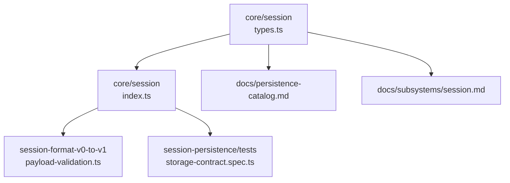
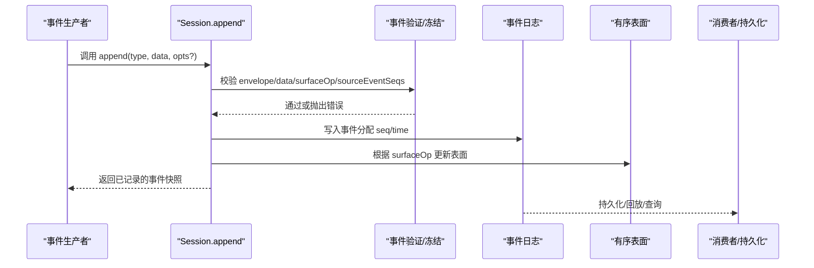
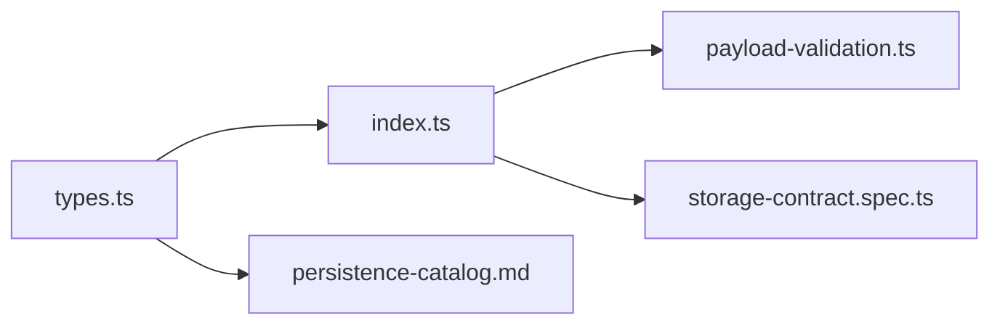

# 事件模型设计

<cite>
**本文引用的文件**
- [packages/core/session/src/types.ts](file://packages/core/session/src/types.ts)
- [packages/core/session/src/index.ts](file://packages/core/session/src/index.ts)
- [docs/persistence-catalog.md](file://docs/persistence-catalog.md)
- [docs/subsystems/session.md](file://docs/subsystems/session.md)
- [docs/subsystems/session.zh.md](file://docs/subsystems/session.zh.md)
- [packages/session/session-format-v0-to-v1/src/payload-validation.ts](file://packages/session/session-format-v0-to-v1/src/payload-validation.ts)
- [packages/session/session-persistence/tests/storage-contract.spec.ts](file://packages/session/session-persistence/tests/storage-contract.spec.ts)
</cite>

## 目录
1. [简介](#简介)
2. [项目结构](#项目结构)
3. [核心组件](#核心组件)
4. [架构总览](#架构总览)
5. [详细组件分析](#详细组件分析)
6. [依赖关系分析](#依赖关系分析)
7. [性能考量](#性能考量)
8. [故障排查指南](#故障排查指南)
9. [结论](#结论)
10. [附录：事件类型参考与使用指南](#附录事件类型参考与使用指南)

## 简介
本文件围绕会话事件模型进行系统化说明，重点解释 SessionEvent 接口的设计原理、事件类型定义、事件结构规范、序列号机制、时间戳与数据来源等元数据的含义与作用；并详细说明 user/message、assistant/message、tool/result 等核心事件的用途与数据结构。文档还涵盖事件验证规则与数据完整性保证机制，并提供创建、验证与处理不同类型事件的实践指引，帮助开发者快速掌握事件类型参考与使用方法。

## 项目结构
- 事件类型与信封定义位于 core/session 的类型模块中，包含 SessionEventMap、SessionEventType、SurfaceEventType、SurfaceOp、SessionEvent 等核心类型。
- 事件验证与冻结逻辑位于 core/session 的入口模块，提供 adoptSessionEvent/snapshotSessionEvent 等工具函数，确保消息内容不可变且可安全跨边界传递。
- 持久化目录维护了完整的“事件目录”，对每个事件类型的载荷、是否 surface、声明位置等进行生成式文档化。
- 子系统文档 session.md 与中文版本 session.zh.md 对会话日志、表面（surface）投影、派生历史等进行了体系化说明。
- v0→v1 迁移校验模块提供了对历史事件载荷的结构与语义校验能力，包括序列号引用、去重、非空约束等。

图表来源
- [packages/core/session/src/types.ts:254-476](file://packages/core/session/src/types.ts#L254-L476)
- [packages/core/session/src/index.ts:158-349](file://packages/core/session/src/index.ts#L158-L349)
- [docs/persistence-catalog.md:12-91](file://docs/persistence-catalog.md#L12-L91)
- [docs/subsystems/session.md:190-372](file://docs/subsystems/session.md#L190-L372)

章节来源
- [packages/core/session/src/types.ts:254-476](file://packages/core/session/src/types.ts#L254-L476)
- [docs/persistence-catalog.md:12-91](file://docs/persistence-catalog.md#L12-L91)
- [docs/subsystems/session.md:190-372](file://docs/subsystems/session.md#L190-L372)

## 核心组件
- SessionEventMap：会话事件的词汇表，定义了所有可追加的事件类型及其载荷结构。它支持通过声明合并扩展（插件可新增 log-only 事件）。
- SurfaceEventType：产生 LLM 消息并可进入有序表面的事件子集，当前为 user/message、assistant/message、tool/result。
- SurfaceOp：描述事件如何进入有序表面，支持 append（追加到尾部）和 replace（替换一段已存在的表面节点）。
- SessionEvent<T>：会话日志中的一条不可变记录，包含 type、seq、time、data，以及可选 ignorable、sourceEventSeqs、surfaceOp。
- 序列号与偏移：SessionSeq、SessionLogOffset、SessionSeqCursor、OptionalSessionSeq 用于标识事件位置与读取偏移，均要求非负安全整数。
- 头部与上下文：EpochHeader、RequestContext、TurnEndReasonMap 等用于记录请求头、路由上下文与会话轮次结束原因。

章节来源
- [packages/core/session/src/types.ts:28-62](file://packages/core/session/src/types.ts#L28-L62)
- [packages/core/session/src/types.ts:218-252](file://packages/core/session/src/types.ts#L218-L252)
- [packages/core/session/src/types.ts:254-476](file://packages/core/session/src/types.ts#L254-L476)
- [docs/subsystems/session.md:190-372](file://docs/subsystems/session.md#L190-L372)

## 架构总览
会话是一个仅追加的日志，所有消息历史均由该日志派生而来。事件按严格顺序写入，每条事件携带单调递增的 seq 与时间戳 time。对于产生消息的事件（SurfaceEventType），必须声明其如何加入有序表面（surfaceOp），并在必要时引用更早的事件（sourceEventSeqs）。非 surface 事件（如 turn/start/end、step/start/end、assistant/attempt 等）不贡献派生历史，但保持完整审计与回放能力。

图表来源
- [packages/core/session/src/index.ts:158-349](file://packages/core/session/src/index.ts#L158-L349)
- [docs/subsystems/session.md:487-529](file://docs/subsystems/session.md#L487-L529)

## 详细组件分析

### 事件信封与元数据
- type：事件类型键，来自 SessionEventMap，支持插件扩展。
- seq：单调递增的会话内序列号，表示事件在日志中的绝对位置。
- time：Unix 毫秒时间戳，记录事件发生时间。
- data：事件载荷，必须可无损 JSON 序列化。
- ignorable：可选标记，允许未知类型在不影响重建的前提下被跳过；未标记则视为必需。
- sourceEventSeqs：仅对 SurfaceEventType 有效，引用更早的事件集合（例如压缩替换时覆盖的节点）。
- surfaceOp：仅对 SurfaceEventType 有效，声明事件如何进入有序表面（append 或 replace）。

章节来源
- [packages/core/session/src/types.ts:447-476](file://packages/core/session/src/types.ts#L447-L476)
- [docs/persistence-catalog.md:12-91](file://docs/persistence-catalog.md#L12-L91)
- [docs/subsystems/session.md:216-260](file://docs/subsystems/session.md#L216-L260)

### 序列号机制
- SessionSeq：标识日志中已有事件的位置，构造函数强制非负安全整数并拒绝负零。
- SessionLogOffset：日志间隙、前缀长度或读取偏移，可为事件总数。
- SessionSeqCursor：包含 -1 的包容性游标，表示尚未有任何事件。
- OptionalSessionSeq：存在或显式缺失。

这些类型在构造时进行严格校验，确保算术运算结果需再次通过构造函数以维持角色语义。

章节来源
- [packages/core/session/src/types.ts:28-62](file://packages/core/session/src/types.ts#L28-L62)
- [docs/subsystems/session.md:190-214](file://docs/subsystems/session.md#L190-L214)

### 表面类型与操作
- SurfaceEventType：user/message、assistant/message、tool/result。
- SurfaceOp：
  - 'append'：正常追加到尾部。
  - { op: 'replace', start, end }：用新事件替换从 start 到 end（含）的表面节点，start 与 end 必须是当前表面中存在的节点；start === end 表示替换单个节点。
- SurfaceIntent：append 参数中对 surface 放置与源事件引用的约束，assistant/message 不允许携带 sourceEventSeqs（因其嵌入 provider stream）。

章节来源
- [packages/core/session/src/types.ts:381-432](file://packages/core/session/src/types.ts#L381-L432)
- [docs/subsystems/session.md:266-328](file://docs/subsystems/session.md#L266-L328)

### 核心事件类型与用途
- user/message：用户侧消息，进入模型可见表面，内容原样投影。
- assistant/message：助手消息，包含 step 的 usage、精确流式记录、可能中断标记；不携带 sourceEventSeqs。
- tool/result：工具调用结果，包含 message、可选 error、可选 meta（必须 JSON 可序列化）。
- assistant/attempt：一次未提交表面消息的尝试，保留失败/重试/取消/流错误的原始流。
- turn/start、turn/end：开启/关闭一轮对话，end 携带结束原因。
- step/start、step/end：开启/关闭一步（一次模型调用及其中工具执行）。
- request/header、request/context：请求头与路由上下文，log-only。
- session/end-seed：标记种子历史结束，区分继承前缀与当前进程产生的事件。

章节来源
- [packages/core/session/src/types.ts:254-376](file://packages/core/session/src/types.ts#L254-L376)
- [docs/persistence-catalog.md:93-800](file://docs/persistence-catalog.md#L93-L800)
- [docs/subsystems/session.md:20-144](file://docs/subsystems/session.md#L20-L144)

### 事件验证规则与数据完整性
- 事件信封校验：type、seq、time、data、ignorable 字段合法性检查；非法字段直接拒绝。
- 消息事件形状校验：user/message、assistant/message、tool/result 的消息对象结构与必要字段校验。
- 流式一致性校验：assistant/message 与 assistant/attempt 的嵌入流与 message.content、usage、replayState 的一致性比对。
- 序列号引用校验：sourceEventSeqs 中的 seq 必须早于当前事件、唯一且不重复；当需要非空时必须满足。
- JSON 可序列化约束：所有 event.data 必须可无损 JSON 序列化，否则在 append 阶段即拒绝。
- 未知事件处理：未知类型若未标记 ignorable，则在加载/恢复时拒绝；标记 ignorable 的可被安全忽略。

章节来源
- [packages/core/session/src/index.ts:158-349](file://packages/core/session/src/index.ts#L158-L349)
- [packages/session/session-format-v0-to-v1/src/payload-validation.ts:297-397](file://packages/session/session-format-v0-to-v1/src/payload-validation.ts#L297-L397)
- [packages/session/session-persistence/tests/storage-contract.spec.ts:121-148](file://packages/session/session-persistence/tests/storage-contract.spec.ts#L121-L148)

### 时间戳、序列号、数据来源的含义与作用
- seq：单调递增，保证日志连续性与可回放性；是派生历史与表面操作的定位依据。
- time：事件发生的 Unix 毫秒时间，用于时序分析与展示。
- sourceEventSeqs：表明当前事件由哪些更早事件推导或替换，保障压缩与替换场景下的可追溯性。
- surfaceOp：明确事件进入有序表面的方式，决定最终模型可见的历史顺序。
- ignorable：控制未知类型在重建时的容忍度，避免静默破坏会话语义。

章节来源
- [packages/core/session/src/types.ts:447-476](file://packages/core/session/src/types.ts#L447-L476)
- [docs/subsystems/session.md:216-260](file://docs/subsystems/session.md#L216-L260)

### 代码示例路径（创建、验证、处理）
- 创建事件：通过 Session.append(type, data, opts?) 追加事件，opts 仅在 SurfaceEventType 时必需。
  - 参考路径：[packages/core/session/src/types.ts:487-529](file://packages/core/session/src/types.ts#L487-L529)
- 验证事件：使用 adoptSessionEvent/snapshotSessionEvent 进行跨边界验证与深冻结。
  - 参考路径：[packages/core/session/src/index.ts:158-193](file://packages/core/session/src/index.ts#L158-L193)
- 处理事件：基于 event.type 分支处理，注意 SurfaceEventType 与非 surface 事件的区别。
  - 参考路径：[packages/core/session/src/index.ts:211-349](file://packages/core/session/src/index.ts#L211-L349)

章节来源
- [packages/core/session/src/types.ts:487-529](file://packages/core/session/src/types.ts#L487-L529)
- [packages/core/session/src/index.ts:158-349](file://packages/core/session/src/index.ts#L158-L349)

## 依赖关系分析
- types.ts 定义了事件词汇表与信封，是所有上层逻辑的基础。
- index.ts 提供事件验证与冻结工具，依赖 types 中的类型与消息形状断言。
- persistence-catalog.md 汇总所有事件类型与载荷，作为生成式参考文档。
- payload-validation.ts 提供历史格式迁移与载荷校验，确保兼容性与正确性。
- storage-contract.spec.ts 验证存储契约，包括未知事件拒绝与 ignorable 行为。

图表来源
- [packages/core/session/src/types.ts:254-476](file://packages/core/session/src/types.ts#L254-L476)
- [packages/core/session/src/index.ts:158-349](file://packages/core/session/src/index.ts#L158-L349)
- [docs/persistence-catalog.md:12-91](file://docs/persistence-catalog.md#L12-L91)
- [packages/session/session-format-v0-to-v1/src/payload-validation.ts:297-397](file://packages/session/session-format-v0-to-v1/src/payload-validation.ts#L297-L397)
- [packages/session/session-persistence/tests/storage-contract.spec.ts:121-148](file://packages/session/session-persistence/tests/storage-contract.spec.ts#L121-L148)

章节来源
- [packages/core/session/src/types.ts:254-476](file://packages/core/session/src/types.ts#L254-L476)
- [packages/core/session/src/index.ts:158-349](file://packages/core/session/src/index.ts#L158-L349)
- [docs/persistence-catalog.md:12-91](file://docs/persistence-catalog.md#L12-L91)
- [packages/session/session-format-v0-to-v1/src/payload-validation.ts:297-397](file://packages/session/session-format-v0-to-v1/src/payload-validation.ts#L297-L397)
- [packages/session/session-persistence/tests/storage-contract.spec.ts:121-148](file://packages/session/session-persistence/tests/storage-contract.spec.ts#L121-L148)

## 性能考量
- 事件追加路径不阻塞 I/O，持久化插件异步缓冲，提升热路径性能。
- 派生历史缓存：每个表面节点仅投影一次，后续调用成本为 O(新节点数)，表面重写时重建。
- 深冻结消息对象复用底层持久化数据，避免二次克隆，降低内存与 CPU 开销。
- 序列号与表面操作保证有序性与可替换性，减少复杂回溯计算。

章节来源
- [docs/subsystems/session.md:545-563](file://docs/subsystems/session.md#L545-L563)
- [packages/core/session/src/index.ts:158-193](file://packages/core/session/src/index.ts#L158-L193)

## 故障排查指南
- 未知事件类型：若未标记 ignorable，加载/恢复时会拒绝；请检查事件类型是否在已知词汇表中。
- 序列号引用错误：sourceEventSeqs 中的 seq 必须早于当前事件且唯一；出现重复或越界将报错。
- JSON 序列化失败：event.data 必须可无损 JSON 序列化；BigInt、函数、symbol、undefined、循环引用等将被拒绝。
- 消息内容不一致：assistant/message 的 message.content、usage、replayState 必须与其嵌入流一致，否则校验失败。
- 表面操作无效：replace 的 start/end 必须存在于当前表面；范围不合法将导致拒绝。

章节来源
- [packages/session/session-persistence/tests/storage-contract.spec.ts:121-148](file://packages/session/session-persistence/tests/storage-contract.spec.ts#L121-L148)
- [packages/session/session-format-v0-to-v1/src/payload-validation.ts:297-397](file://packages/session/session-format-v0-to-v1/src/payload-validation.ts#L297-L397)
- [packages/core/session/src/index.ts:211-349](file://packages/core/session/src/index.ts#L211-L349)

## 结论
会话事件模型以仅追加日志为核心，通过严格的类型系统、序列号机制与表面操作，保证了消息历史的确定性、可回放性与可扩展性。核心事件（user/message、assistant/message、tool/result）承载模型可见交互，其他事件提供执行边界与审计信息。完善的验证与冻结机制确保数据完整性与跨边界安全。开发者应遵循 SurfaceIntent 与 SurfaceOp 约定，正确使用 ignorable 与 sourceEventSeqs，以获得稳定可靠的会话体验。

## 附录：事件类型参考与使用指南

### 事件类型参考
- SurfaceEventType：user/message、assistant/message、tool/result。
- 非 surface 事件：turn/start、turn/end、step/start、step/end、assistant/attempt、request/header、request/context、session/end-seed 等。
- 插件扩展：可通过声明合并新增 log-only 事件，不影响核心 surface 语义。

章节来源
- [packages/core/session/src/types.ts:254-376](file://packages/core/session/src/types.ts#L254-L376)
- [docs/persistence-catalog.md:93-800](file://docs/persistence-catalog.md#L93-L800)

### 使用指南
- 创建事件：
  - 对 SurfaceEventType 事件，必须提供 SurfaceIntent（surfaceOp 与必要的 sourceEventSeqs）。
  - 对非 surface 事件，无需 SurfaceIntent。
  - 参考路径：[packages/core/session/src/types.ts:487-529](file://packages/core/session/src/types.ts#L487-L529)
- 验证事件：
  - 使用 adoptSessionEvent 或 snapshotSessionEvent 进行跨边界验证与深冻结。
  - 参考路径：[packages/core/session/src/index.ts:158-193](file://packages/core/session/src/index.ts#L158-L193)
- 处理事件：
  - 基于 event.type 分支处理，注意 SurfaceEventType 与非 surface 事件的区别。
  - 参考路径：[packages/core/session/src/index.ts:211-349](file://packages/core/session/src/index.ts#L211-L349)

章节来源
- [packages/core/session/src/types.ts:487-529](file://packages/core/session/src/types.ts#L487-L529)
- [packages/core/session/src/index.ts:158-349](file://packages/core/session/src/index.ts#L158-L349)