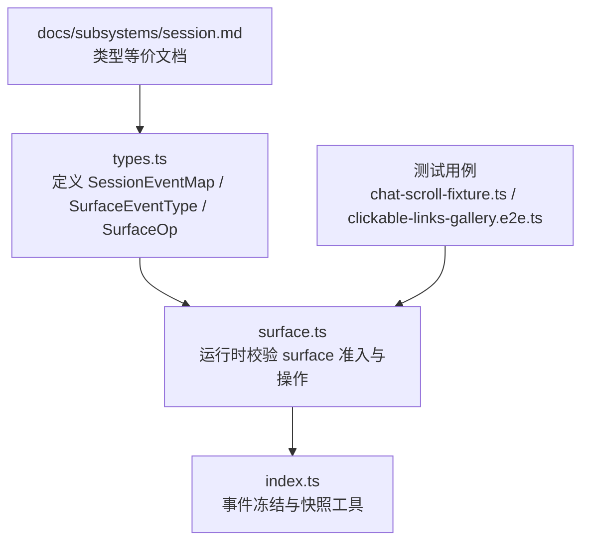
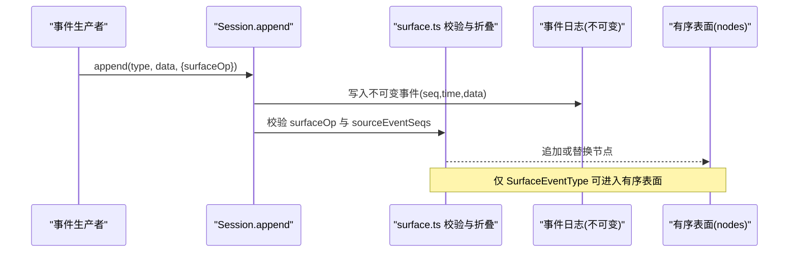
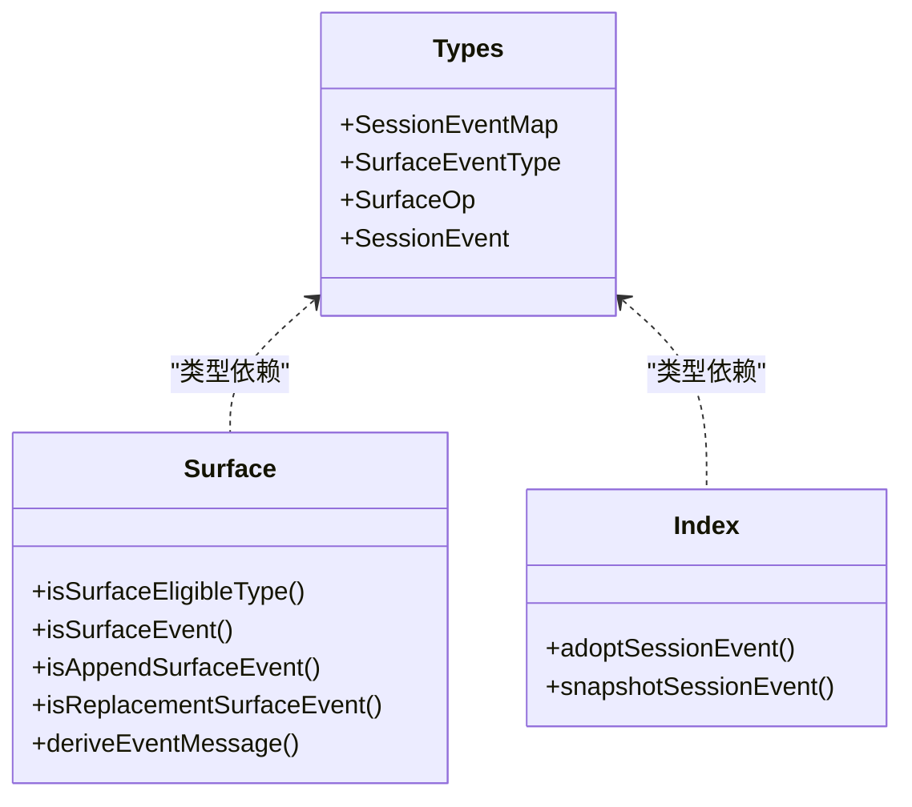
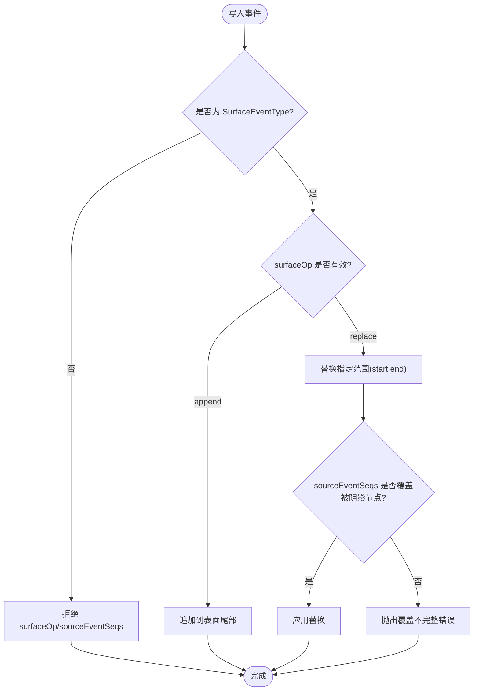

# 事件类型定义

<cite>
**本文引用的文件**
- [packages/core/session/src/types.ts](file://packages/core/session/src/types.ts)
- [packages/core/session/src/surface.ts](file://packages/core/session/src/surface.ts)
- [packages/core/session/src/index.ts](file://packages/core/session/src/index.ts)
- [docs/subsystems/session.md](file://docs/subsystems/session.md)
- [apps/web/tests/chat-scroll-fixture.ts](file://apps/web/tests/chat-scroll-fixture.ts)
- [apps/web/tests/clickable-links-gallery.e2e.ts](file://apps/web/tests/clickable-links-gallery.e2e.ts)
- [apps/cli/tests/profiles/headless/tests/subagent-diagnostic.expected.e2e.ts](file://apps/cli/tests/profiles/headless/tests/subagent-diagnostic.expected.e2e.ts)
</cite>

## 目录
1. [简介](#简介)
2. [项目结构](#项目结构)
3. [核心组件](#核心组件)
4. [架构总览](#架构总览)
5. [详细组件分析](#详细组件分析)
6. [依赖关系分析](#依赖关系分析)
7. [性能考虑](#性能考虑)
8. [故障排查指南](#故障排查指南)
9. [结论](#结论)
10. [附录：TypeScript 类型与使用示例](#附录typescript-类型与使用示例)

## 简介
本文件围绕会话事件类型定义展开，系统性解释 SessionEventMap 接口中定义的所有事件类型，包括生命周期事件（turn/start、turn/end、step/start、step/end）、消息事件（user/message、assistant/message、assistant/attempt）、工具调用事件（tool/call、tool/result）以及请求相关事件（request/header、request/context）。同时说明 SurfaceEventType 与 SurfaceOp 的概念，明确哪些事件可以出现在有序表面（ordered surface），并提供 TypeScript 类型定义路径与实际使用代码片段的路径，帮助开发者正确理解和使用各类事件。

## 项目结构
- 事件类型与核心类型定义集中在 session 包的核心类型文件中，包含 SessionEventMap、SurfaceEventType、SurfaceOp、SessionEvent 等关键类型。
- 有序表面（surface）的运行时校验与折叠逻辑在 surface 模块中实现，负责判定事件是否可进入模型可见表面、如何追加或替换节点。
- 文档子系统提供了对 SessionEventMap 的完整中文注释与类型等价展示，便于阅读与对照。
- 测试用例展示了如何在真实场景中通过 Session.append 写入各类事件，并附带 surfaceOp 标记。

图表来源
- [packages/core/session/src/types.ts:260-418](file://packages/core/session/src/types.ts#L260-L418)
- [packages/core/session/src/surface.ts:21-75](file://packages/core/session/src/surface.ts#L21-L75)
- [packages/core/session/src/index.ts:158-193](file://packages/core/session/src/index.ts#L158-L193)
- [docs/subsystems/session.md:20-144](file://docs/subsystems/session.md#L20-L144)

章节来源
- [packages/core/session/src/types.ts:260-418](file://packages/core/session/src/types.ts#L260-L418)
- [packages/core/session/src/surface.ts:21-75](file://packages/core/session/src/surface.ts#L21-L75)
- [docs/subsystems/session.md:20-144](file://docs/subsystems/session.md#L20-L144)

## 核心组件
- SessionEventMap：会话事件的合并可扩展映射表，定义了所有事件类型及其数据结构。
- SurfaceEventType：限定可在有序表面上出现的事件类型集合，仅 user/message、assistant/message、tool/result 三类。
- SurfaceOp：描述事件如何进入有序表面，支持 append（追加到尾部）和 replace（替换一段已有节点范围）。
- SessionEvent：带时间戳、序列号、数据体以及可选 surfaceOp/sourceEventSeqs 的不可变事件记录。

章节来源
- [packages/core/session/src/types.ts:260-418](file://packages/core/session/src/types.ts#L260-L418)
- [packages/core/session/src/surface.ts:21-75](file://packages/core/session/src/surface.ts#L21-L75)

## 架构总览
下图展示了事件从写入到表面投影的关键流程：生产者通过 Session.append 写入事件；surface 层根据事件类型与 surfaceOp 决定是追加还是替换；最终形成有序的模型可见表面。

图表来源
- [packages/core/session/src/surface.ts:194-218](file://packages/core/session/src/surface.ts#L194-L218)
- [packages/core/session/src/types.ts:420-432](file://packages/core/session/src/types.ts#L420-L432)

## 详细组件分析

### 生命周期事件
- turn/start：开启一个对话轮次（turn），在循环声明输入或执行预步骤前写入。用于标识一轮交互的开始。
- turn/end：关闭一个对话轮次，携带结束原因（如 completed、aborted、error、max-tokens、interrupted）。无 step 的 turn 不会伴随 step/start/step/end。
- step/start：开启一个“步骤”（step），表示一次模型调用及该调用所触发的工具执行集合的开始。
- step/end：关闭一个步骤，标志模型调用与工具执行完成。

字段含义
- turn：轮次编号，单调递增。
- step：步骤编号，在当前 turn 内单调递增。
- reason：turn 结束原因，结构化描述成功、中止、错误、令牌上限、中断等情况。

使用场景
- 用于追踪一轮对话的生命周期，辅助计算耗时、统计成功率、定位失败点。
- 与消息/工具事件配合，构建完整的交互轨迹。

章节来源
- [packages/core/session/src/types.ts:260-280](file://packages/core/session/src/types.ts#L260-L280)
- [docs/subsystems/session.md:28-47](file://docs/subsystems/session.md#L28-L47)

### 消息事件
- user/message：用户侧消息，直接的人类提示、注入上下文或目标续轮。内容原样投影到模型可见表面，source 区分来源。
- assistant/message：助手侧消息，封装了单步的模型输出、流式记录、用量统计，以及可能的中断标记。
- assistant/attempt：未提交表面消息的一次模型尝试，保留失败、重试、取消或流错误的原始流，不伪造可见历史。

字段含义
- user/message.data：UserMessage，包含 content 与 source。
- assistant/message.data：包含 turn、step、message、stream、usage、interrupted。
- assistant/attempt.data：包含 turn、step、stream。

使用场景
- 构建对话历史、渲染聊天界面、统计 token 用量、诊断中断与失败。
- assistant/attempt 用于审计与恢复，不污染用户可见历史。

章节来源
- [packages/core/session/src/types.ts:281-313](file://packages/core/session/src/types.ts#L281-L313)
- [docs/subsystems/session.md:48-80](file://docs/subsystems/session.md#L48-L80)

### 工具调用事件
- tool/call：模型发起的工具调用，包含 callId、name、arguments（原始 JSON 字符串）。callId 与 tool/result 配对。
- tool/result：工具调用的结果，包含 message、可选 error、可选 meta（工具私有呈现负载，必须可 JSON 序列化）。

字段含义
- callId：唯一标识一次调用，用于关联调用与结果。
- arguments：原始参数字符串，保持模型产出的精确性。
- message：ToolResultMessage，承载工具返回给模型的内容。
- error：内部失败的名称与代码。
- meta：工具私有元数据，核心不解析但需可序列化。

使用场景
- 追踪工具调用链、展示工具卡片、审计工具行为、回放与调试。
- meta 可用于 UI 呈现或后续处理，由工具方自行约定形状。

章节来源
- [packages/core/session/src/types.ts:314-337](file://packages/core/session/src/types.ts#L314-L337)
- [docs/subsystems/session.md:81-104](file://docs/subsystems/session.md#L81-L104)

### 请求相关事件
- request/header：下一次请求的完整头部，包含配置、系统提示、工具模式等。仅在步骤内、调度前追加，供日志与重建使用。
- request/context：路由元数据，当路由或容量变化时记录，不参与请求重建或头部相等性判断。

字段含义
- header：EpochHeader，含 LlmCallConfig、adapterDefaults、system、tools。
- reason：initial/resume/change/series，指示头部的来源与语义。
- startsSeries：头部变更也开启新的消息系列。
- context：RequestContext，含 provider、model、contextWindow。

使用场景
- 重建请求上下文、审计系统提示与工具集变化、分析路由选择与容量策略。

章节来源
- [packages/core/session/src/types.ts:338-352](file://packages/core/session/src/types.ts#L338-L352)
- [docs/subsystems/session.md:105-119](file://docs/subsystems/session.md#L105-L119)

### 其他日志事件
- session/end-seed：标记构造器种子段的结束，区分种子历史与当前会话产生的事件。用于分叉、恢复与重放时的边界识别。

章节来源
- [packages/core/session/src/types.ts:353-375](file://packages/core/session/src/types.ts#L353-L375)
- [docs/subsystems/session.md:120-142](file://docs/subsystems/session.md#L120-L142)

## 依赖关系分析
- types.ts 定义了事件类型与表面操作类型，是 surface.ts 的类型基础。
- surface.ts 基于类型约束进行运行时校验，确保只有 SurfaceEventType 可携带 surfaceOp，且 surfaceOp 合法。
- index.ts 提供事件冻结与快照工具，保证消息内容的不可变性与跨边界安全。

图表来源
- [packages/core/session/src/types.ts:260-418](file://packages/core/session/src/types.ts#L260-L418)
- [packages/core/session/src/surface.ts:21-75](file://packages/core/session/src/surface.ts#L21-L75)
- [packages/core/session/src/index.ts:158-193](file://packages/core/session/src/index.ts#L158-L193)

章节来源
- [packages/core/session/src/types.ts:260-418](file://packages/core/session/src/types.ts#L260-L418)
- [packages/core/session/src/surface.ts:21-75](file://packages/core/session/src/surface.ts#L21-L75)
- [packages/core/session/src/index.ts:158-193](file://packages/core/session/src/index.ts#L158-L193)

## 性能考虑
- 事件为不可变记录，append-only 设计避免复杂状态同步开销。
- 有序表面通过 nodes 数组维护顺序，replace 操作会生成新节点并标记被覆盖范围，适合增量折叠与快照。
- 工具结果与助手消息的消息体在写入时被深冻结，减少后续拷贝成本并确保一致性。
- 对于大量流式数据，assistant/message 嵌入压缩后的 stream，避免重复存储与传输。

[本节为通用性能讨论，无需特定文件引用]

## 故障排查指南
- 非表面事件携带 surfaceOp 或 sourceEventSeqs：运行时将抛出错误，因为仅 SurfaceEventType 允许这些字段。
- 替换操作的 start/end 不在当前表面或覆盖不完整：将报错，要求 replacement 的目标必须是当前节点且 sourceEventSeqs 必须覆盖全部被阴影节点。
- assistant/message 不允许携带 sourceEventSeqs：V2 版本嵌入 provider stream，不再引用源事件。
- 工具结果替换限制：只能修改 content，不能改变其他字段；且只能重写单个当前节点。

章节来源
- [packages/core/session/src/surface.ts:194-218](file://packages/core/session/src/surface.ts#L194-L218)
- [packages/core/session/tests/surface.spec.ts:103-200](file://packages/core/session/tests/surface.spec.ts#L103-L200)

## 结论
SessionEventMap 提供了会话交互的完整事件词汇表，涵盖生命周期、消息、工具调用与请求上下文等维度。SurfaceEventType 与 SurfaceOp 共同约束了哪些事件可进入有序表面以及如何进入（追加或替换）。通过严格的类型与运行时校验，系统在可追溯性、一致性与性能之间取得平衡。开发者应依据事件语义正确使用 surfaceOp，并在需要时利用 sourceEventSeqs 建立事件溯源关系。

[本节为总结性内容，无需特定文件引用]

## 附录：TypeScript 类型与使用示例

### 类型定义位置
- SessionEventMap、SurfaceEventType、SurfaceOp、SessionEvent 的定义位于：
  - [packages/core/session/src/types.ts:260-418](file://packages/core/session/src/types.ts#L260-L418)
- 类型等价文档（含中文注释）位于：
  - [docs/subsystems/session.md:20-144](file://docs/subsystems/session.md#L20-L144)

### 有序表面规则
- 仅以下事件类型可出现在有序表面：
  - user/message
  - assistant/message
  - tool/result
- 进入表面的方式：
  - append：追加到尾部
  - replace：替换一段已有节点范围（start、end 必须存在于当前表面，且 sourceEventSeqs 必须覆盖被阴影节点）

章节来源
- [packages/core/session/src/types.ts:381-418](file://packages/core/session/src/types.ts#L381-L418)
- [packages/core/session/src/surface.ts:21-75](file://packages/core/session/src/surface.ts#L21-L75)

### 实际使用示例（路径）
- 写入 user/message 并追加到表面：
  - [apps/web/tests/chat-scroll-fixture.ts:78-90](file://apps/web/tests/chat-scroll-fixture.ts#L78-L90)
  - [apps/web/tests/clickable-links-gallery.e2e.ts:197-212](file://apps/web/tests/clickable-links-gallery.e2e.ts#L197-L212)
- 写入 assistant/message 并追加到表面：
  - [apps/web/tests/chat-scroll-fixture.ts:117-134](file://apps/web/tests/chat-scroll-fixture.ts#L117-L134)
  - [apps/web/tests/clickable-links-gallery.e2e.ts:212-234](file://apps/web/tests/clickable-links-gallery.e2e.ts#L212-L234)
- 写入 tool/result 并追加或替换表面：
  - [apps/web/tests/chat-scroll-fixture.ts:144-155](file://apps/web/tests/chat-scroll-fixture.ts#L144-L155)
  - [apps/web/tests/clickable-links-gallery.e2e.ts:234-246](file://apps/web/tests/clickable-links-gallery.e2e.ts#L234-L246)
- 写入生命周期事件（turn/start、step/start、turn/end）：
  - [apps/cli/tests/profiles/headless/tests/subagent-diagnostic.expected.e2e.ts:61-62](file://apps/cli/tests/profiles/headless/tests/subagent-diagnostic.expected.e2e.ts#L61-L62)

### 典型流程图（算法视角）

图表来源
- [packages/core/session/src/surface.ts:194-218](file://packages/core/session/src/surface.ts#L194-L218)
- [packages/core/session/src/types.ts:420-432](file://packages/core/session/src/types.ts#L420-L432)