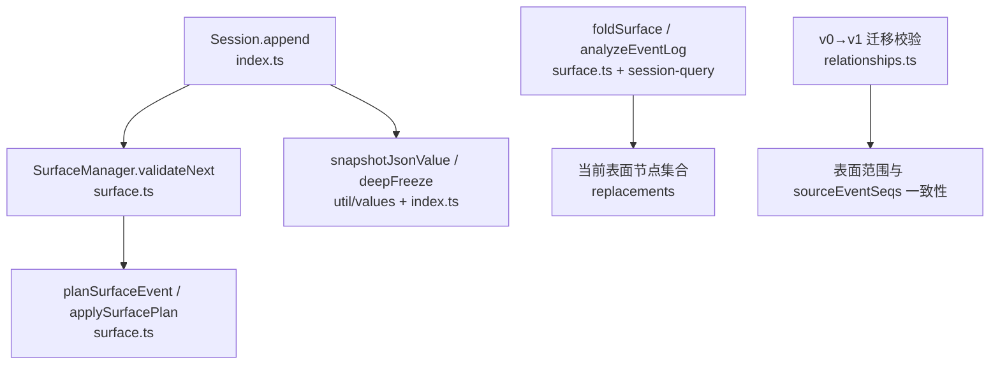
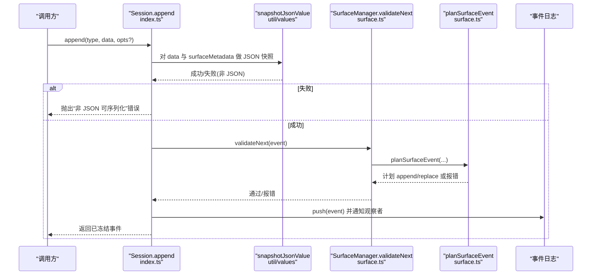
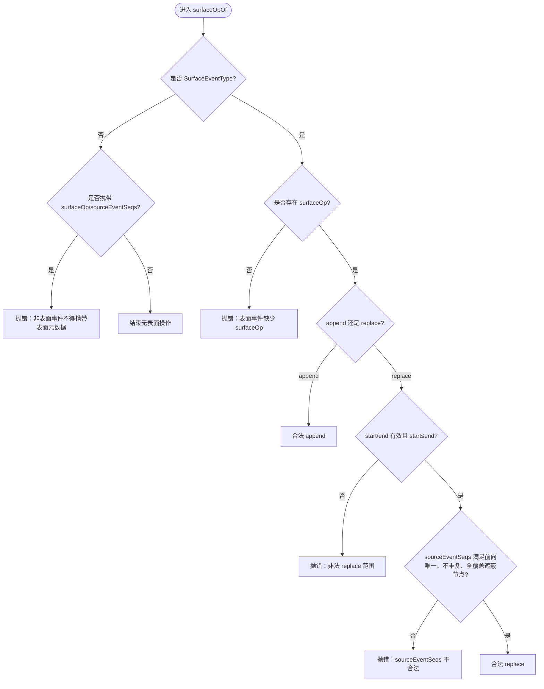
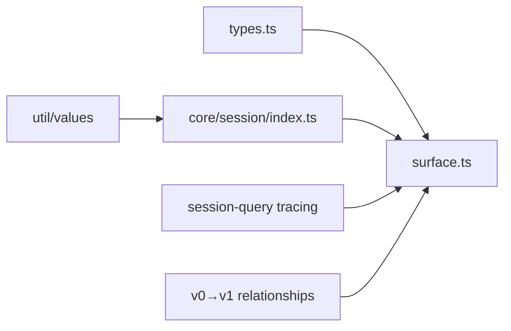

# 事件验证机制

<cite>
**本文引用的文件**
- [packages/core/session/src/types.ts](file://packages/core/session/src/types.ts)
- [packages/core/session/src/surface.ts](file://packages/core/session/src/surface.ts)
- [packages/core/session/src/index.ts](file://packages/core/session/src/index.ts)
- [packages/util/values/src/index.ts](file://packages/util/values/src/index.ts)
- [packages/session-query/session-query/src/tracing.ts](file://packages/session-query/session-query/src/tracing.ts)
- [packages/session/session-format-v0-to-v1/src/relationships.ts](file://packages/session/session-format-v0-to-v1/src/relationships.ts)
- [packages/core/session/tests/session.spec.ts](file://packages/core/session/tests/session.spec.ts)
</cite>

## 目录
1. [简介](#简介)
2. [项目结构](#项目结构)
3. [核心组件](#核心组件)
4. [架构总览](#架构总览)
5. [详细组件分析](#详细组件分析)
6. [依赖关系分析](#依赖关系分析)
7. [性能考量](#性能考量)
8. [故障排查指南](#故障排查指南)
9. [结论](#结论)

## 简介
本文件系统性阐述会话事件（SessionEvent）的不可变性与类型安全设计，重点解释：
- 基于判别联合（discriminated union）的事件模型与 SurfaceEventType 约束
- surfaceOp 与 sourceEventSeqs 的条件性存在及语义
- isJsonValue 验证规则，确保所有事件数据可无损 JSON 序列化
- SurfaceIntent 接口如何保证有序表面上的插入与替换正确性
- 常见验证错误示例与调试方法

## 项目结构
围绕事件验证的核心代码分布在以下模块：
- 类型定义与事件模型：types.ts
- 有序表面折叠与增量校验：surface.ts
- Session 追加入口、JSON 快照与冻结：index.ts
- JSON 合法性与深拷贝工具：util/values
- 日志分析与调试辅助：session-query tracing
- 历史格式迁移中的表面关系校验：session-format-v0-to-v1 relationships
- 测试用例覆盖典型失败路径：tests/session.spec.ts

图表来源
- [packages/core/session/src/index.ts:699-728](file://packages/core/session/src/index.ts#L699-L728)
- [packages/core/session/src/surface.ts:334-392](file://packages/core/session/src/surface.ts#L334-L392)
- [packages/util/values/src/index.ts:167-183](file://packages/util/values/src/index.ts#L167-L183)
- [packages/session-query/session-query/src/tracing.ts:181-224](file://packages/session-query/session-query/src/tracing.ts#L181-L224)
- [packages/session/session-format-v0-to-v1/src/relationships.ts:382-396](file://packages/session/session-format-v0-to-v1/src/relationships.ts#L382-L396)

章节来源
- [packages/core/session/src/index.ts:699-728](file://packages/core/session/src/index.ts#L699-L728)
- [packages/core/session/src/surface.ts:334-392](file://packages/core/session/src/surface.ts#L334-L392)
- [packages/util/values/src/index.ts:167-183](file://packages/util/values/src/index.ts#L167-L183)
- [packages/session-query/session-query/src/tracing.ts:181-224](file://packages/session-query/session-query/src/tracing.ts#L181-L224)
- [packages/session/session-format-v0-to-v1/src/relationships.ts:382-396](file://packages/session/session-format-v0-to-v1/src/relationships.ts#L382-L396)

## 核心组件
- SessionEvent 与 SurfaceEventType：通过判别联合将 type 作为区分键，使 data 形状在编译期被精确收窄；仅 user/message、assistant/message、tool/result 三类事件可进入有序表面。
- SurfaceOp：append 或 replace(start,end)。replace 必须引用当前表面的连续区间，且 sourceEventSeqs 需完整覆盖被遮蔽节点。
- SurfaceIntent<T>：附加到 append 调用的元数据，强制 surfaceOp，并对 assistant/message 禁止 sourceEventSeqs（因其内嵌流）。
- SurfaceManager：增量维护当前表面节点序列与替换代数，提供 validateNext 进行“先验校验”，再落盘。
- isJsonValue/snapshotJsonValue：严格判定并剥离非 JSON 值（BigInt、函数、symbol、undefined、负零、非有限数、循环引用、稀疏数组、非普通对象等），同时生成不可变快照。

章节来源
- [packages/core/session/src/types.ts:254-476](file://packages/core/session/src/types.ts#L254-L476)
- [packages/core/session/src/surface.ts:21-75](file://packages/core/session/src/surface.ts#L21-L75)
- [packages/core/session/src/surface.ts:174-218](file://packages/core/session/src/surface.ts#L174-L218)
- [packages/core/session/src/index.ts:699-728](file://packages/core/session/src/index.ts#L699-L728)
- [packages/util/values/src/index.ts:167-183](file://packages/util/values/src/index.ts#L167-L183)

## 架构总览
事件从调用方进入 Session.append，经历 JSON 快照与冻结、表面元数据构造、SurfaceManager 预校验，最终写入日志并触发观察者。读取端可通过 foldSurface 重放事件得到当前表面，或通过 tracing 分析事件在表面中的状态（current/shadowed/log-only）。

图表来源
- [packages/core/session/src/index.ts:699-728](file://packages/core/session/src/index.ts#L699-L728)
- [packages/core/session/src/surface.ts:334-392](file://packages/core/session/src/surface.ts#L334-L392)
- [packages/util/values/src/index.ts:167-183](file://packages/util/values/src/index.ts#L167-L183)

## 详细组件分析

### 事件模型与不可变性
- 判别联合：SessionEvent 以 type 为区分键，data 随类型精确收窄，避免运行时分支错误。
- 条件字段：sourceEventSeqs 与 surfaceOp 仅在 SurfaceEventType 上存在；非表面事件携带这些字段会在校验阶段被拒绝。
- 不可变快照：append 使用 snapshotJsonValue 生成不可变副本，再用 deepFreeze 冻结，防止后续修改污染持久化内容。

章节来源
- [packages/core/session/src/types.ts:447-476](file://packages/core/session/src/types.ts#L447-L476)
- [packages/core/session/src/index.ts:709-728](file://packages/core/session/src/index.ts#L709-L728)
- [packages/util/values/src/index.ts:167-183](file://packages/util/values/src/index.ts#L167-L183)

### SurfaceIntent 与 surfaceOp/sourceEventSeqs 约束
- SurfaceIntent<T> 强制 surfaceOp，并在 T=assistant/message 时禁止 sourceEventSeqs（因为该事件内嵌 provider stream，不再引用顶层源事件）。
- surfaceOp 允许 append 或 replace(start,end)。replace 必须指向当前表面中存在的 start/end，且 start≤end。
- sourceEventSeqs 必须为非空、去重、全部小于当前事件 seq 的安全整数数组；replace 场景下必须包含所有被遮蔽的表面节点。

图表来源
- [packages/core/session/src/surface.ts:194-218](file://packages/core/session/src/surface.ts#L194-L218)
- [packages/core/session/src/surface.ts:220-256](file://packages/core/session/src/surface.ts#L220-L256)
- [packages/core/session/src/surface.ts:258-279](file://packages/core/session/src/surface.ts#L258-L279)

章节来源
- [packages/core/session/src/types.ts:381-432](file://packages/core/session/src/types.ts#L381-L432)
- [packages/core/session/src/surface.ts:194-279](file://packages/core/session/src/surface.ts#L194-L279)

### isJsonValue 验证规则
- 接受：null、布尔、字符串、有限数字（排除 -0）、普通数组（无稀疏项）、普通对象（仅可枚举字符串键）。
- 拒绝：BigInt、函数、symbol、undefined、-0、NaN/Infinity、循环引用、稀疏数组、带 getter 的属性、非普通原型链对象、Date/Map/Set 等实例。
- 作用：在 append 时对 data 与 surfaceMetadata 分别执行一次遍历，既做合法性检查又生成独立快照，避免状态获取器在验证与存储间产生不一致。

章节来源
- [packages/util/values/src/index.ts:71-183](file://packages/util/values/src/index.ts#L71-L183)
- [packages/core/session/src/index.ts:709-716](file://packages/core/session/src/index.ts#L709-L716)

### 有序表面与推导消息
- SurfaceManager 维护 nodes（当前表面节点序列）与 replaceGeneration（替换次数），validateNext 在不改变状态的前提下计算计划，随后才应用。
- deriveEventMessage 将表面节点投影为 LLM 消息；空内容的 assistant/message 不产生消息。
- 读取端可使用 foldSurface 重放事件得到等价表面，或使用 tracing 分析每个事件在当前表面、被遮蔽或仅日志中的角色。

章节来源
- [packages/core/session/src/surface.ts:77-149](file://packages/core/session/src/surface.ts#L77-L149)
- [packages/core/session/src/surface.ts:400-414](file://packages/core/session/src/surface.ts#L400-L414)
- [packages/session-query/session-query/src/tracing.ts:181-224](file://packages/session-query/session-query/src/tracing.ts#L181-L224)

### 历史迁移中的表面关系校验
- v0→v1 迁移过程中同样要求 surfaceOp 存在，replace 的 start/end 必须在当前表面中找到，且 sourceEventSeqs 必须覆盖被遮蔽节点，否则抛出迁移错误。

章节来源
- [packages/session/session-format-v0-to-v1/src/relationships.ts:382-396](file://packages/session/session-format-v0-to-v1/src/relationships.ts#L382-L396)

## 依赖关系分析
- Session.append 依赖 util/values 的 JSON 快照能力，以及 surface.ts 的表面折叠与校验。
- surface.ts 依赖 types.ts 的类型定义与边界断言。
- session-query tracing 复用 foldSurface 实现日志分析。
- v0→v1 迁移逻辑复用表面概念，确保向后兼容。

图表来源
- [packages/core/session/src/types.ts:254-476](file://packages/core/session/src/types.ts#L254-L476)
- [packages/core/session/src/surface.ts:1-20](file://packages/core/session/src/surface.ts#L1-L20)
- [packages/core/session/src/index.ts:9-23](file://packages/core/session/src/index.ts#L9-L23)
- [packages/session-query/session-query/src/tracing.ts:181-224](file://packages/session-query/session-query/src/tracing.ts#L181-L224)
- [packages/session/session-format-v0-to-v1/src/relationships.ts:382-396](file://packages/session/session-format-v0-to-v1/src/relationships.ts#L382-L396)

章节来源
- [packages/core/session/src/index.ts:9-23](file://packages/core/session/src/index.ts#L9-L23)
- [packages/core/session/src/surface.ts:1-20](file://packages/core/session/src/surface.ts#L1-L20)

## 性能考量
- 单次遍历：append 中对 data 与 surfaceMetadata 各做一次 walkJsonValue，避免多次序列化/反序列化。
- 增量折叠：SurfaceManager 仅处理新增尾部事件，避免全量重算；replace 增加 replaceGeneration 用于缓存失效。
- 冻结策略：deepFreeze 采用迭代方式，避免栈溢出；对 AbortSignal 特殊处理保持可变性。

章节来源
- [packages/core/session/src/index.ts:709-728](file://packages/core/session/src/index.ts#L709-L728)
- [packages/core/session/src/surface.ts:416-479](file://packages/core/session/src/surface.ts#L416-L479)
- [packages/util/values/src/index.ts:205-240](file://packages/util/values/src/index.ts#L205-L240)

## 故障排查指南
常见验证错误与定位建议：

- 非 JSON 可序列化数据
  - 现象：append 抛出“携带非 JSON 可序列化数据”
  - 原因：data 或 surfaceMetadata 包含 BigInt、函数、symbol、undefined、-0、非有限数、循环引用、稀疏数组或非普通对象
  - 定位：检查 event.data 与 SurfaceIntent 中的 surfaceOp/sourceEventSeqs 是否可被 snapshotJsonValue 接受
  - 参考：[packages/core/session/src/index.ts:709-716](file://packages/core/session/src/index.ts#L709-L716), [packages/util/values/src/index.ts:71-183](file://packages/util/values/src/index.ts#L71-L183)

- 非表面事件携带表面元数据
  - 现象：surfaceOp/sourceEventSeqs 出现在 turn/start、assistant/attempt 等非表面事件
  - 原因：isSurfaceEligibleType 为 false 时不允许携带
  - 参考：[packages/core/session/src/surface.ts:194-218](file://packages/core/session/src/surface.ts#L194-L218)

- 表面事件缺少 surfaceOp
  - 现象：user/message、assistant/message、tool/result 未提供 surfaceOp
  - 原因：SurfaceEventType 必须声明如何进入有序表面
  - 参考：[packages/core/session/src/surface.ts:194-218](file://packages/core/session/src/surface.ts#L194-L218)

- 非法 replace 范围
  - 现象：replace 的 start/end 不在当前表面或 start>end
  - 原因：replacementRange 查找失败或顺序错误
  - 参考：[packages/core/session/src/surface.ts:258-279](file://packages/core/session/src/surface.ts#L258-L279)

- sourceEventSeqs 不合法
  - 现象：为空、含重复、包含不小于当前 seq 的值、缺失被遮蔽节点
  - 原因：assertProvenance 校验失败
  - 参考：[packages/core/session/src/surface.ts:220-256](file://packages/core/session/src/surface.ts#L220-L256)

- assistant/message 不应携带 sourceEventSeqs
  - 现象：assistant/message 附带 sourceEventSeqs
  - 原因：V2 助手消息内嵌 provider stream，不再引用顶层源事件
  - 参考：[packages/core/session/src/surface.ts:220-256](file://packages/core/session/src/surface.ts#L220-L256)

- 种子事件表面校验失败
  - 现象：Session.create/fromRestore 的种子事件在表面折叠时报错
  - 行为：包装上下文信息，便于定位索引与错误原因
  - 参考：[packages/core/session/src/index.ts:551-579](file://packages/core/session/src/index.ts#L551-L579), [packages/core/session/tests/session.spec.ts:817-855](file://packages/core/session/tests/session.spec.ts#L817-L855)

调试方法建议：
- 使用 foldSurface 重放事件日志，观察 nodes 与 replacements，确认表面变化是否符合预期
- 使用 session-query 的 analyzeEventLog 输出每个事件的 surface 状态（current/shadowed/log-only）
- 对可疑事件打印其 type、seq、time、data 与 surface metadata，结合上述规则逐项核对

章节来源
- [packages/core/session/src/surface.ts:194-279](file://packages/core/session/src/surface.ts#L194-L279)
- [packages/core/session/src/index.ts:551-579](file://packages/core/session/src/index.ts#L551-L579)
- [packages/session-query/session-query/src/tracing.ts:181-224](file://packages/session-query/session-query/src/tracing.ts#L181-L224)
- [packages/core/session/tests/session.spec.ts:817-855](file://packages/core/session/tests/session.spec.ts#L817-L855)

## 结论
本机制通过严格的类型系统（判别联合与条件字段）、不可变快照（isJsonValue 与 deepFreeze）与有序表面（SurfaceIntent/SurfaceOp/SurfaceManager）三重保障，确保会话事件在追加、替换与重放过程中的正确性与一致性。开发者在扩展事件类型或自定义表面操作时，应遵循现有约束，并利用提供的折叠与分析工具进行验证与排障。