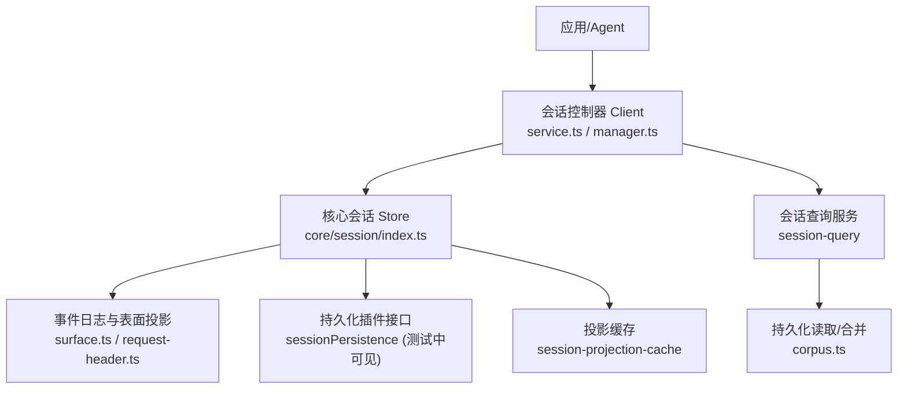
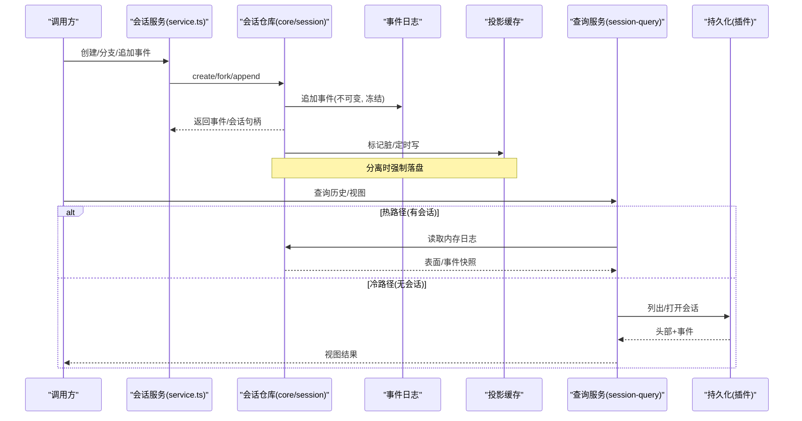
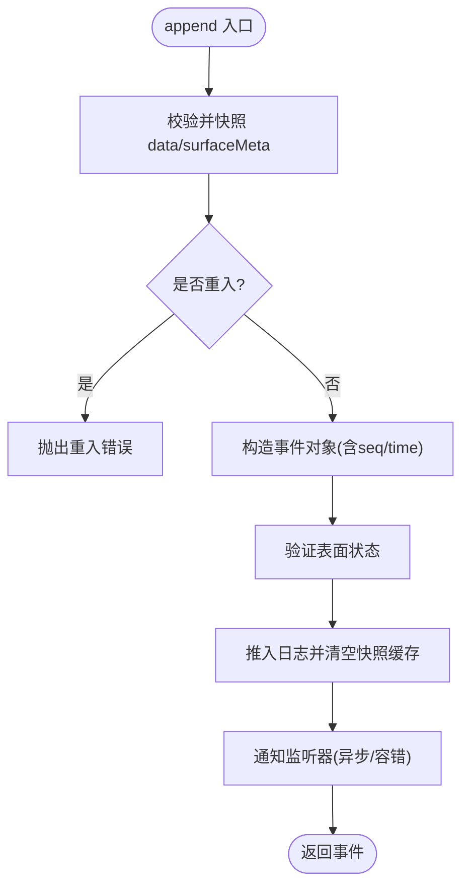
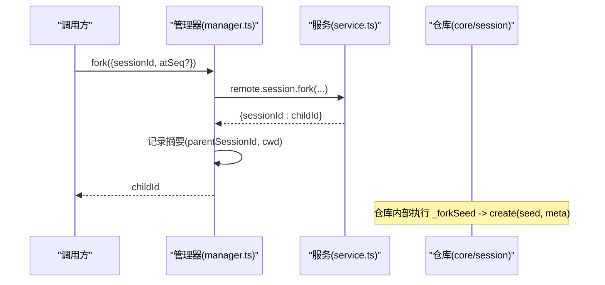
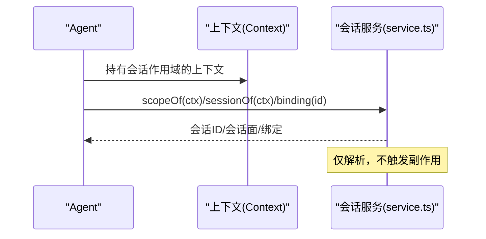
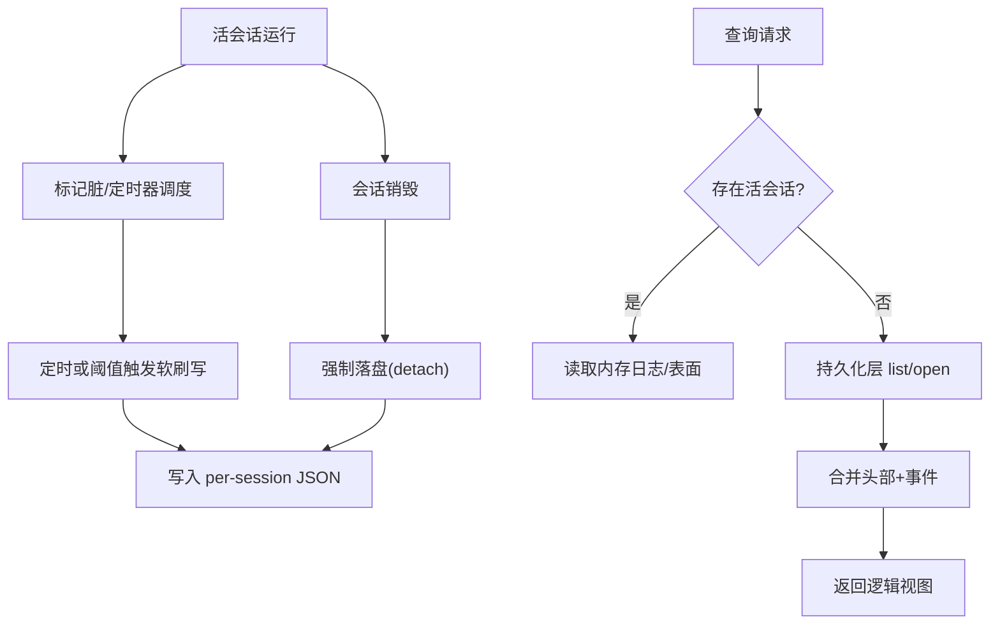
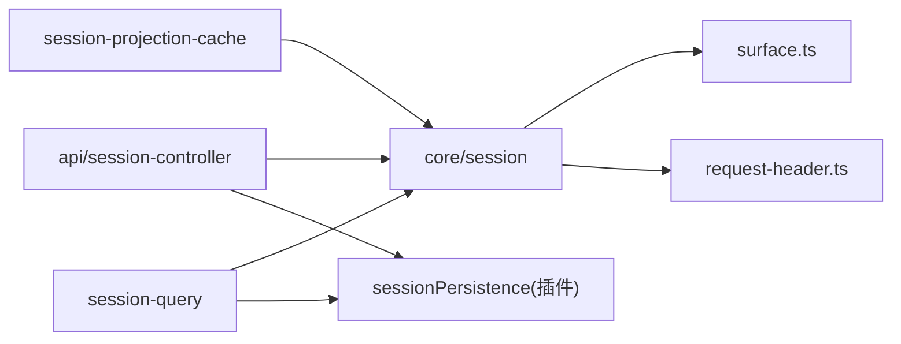

# 会话管理系统

<cite>
**本文引用的文件**
- [packages/core/session/src/index.ts](file://packages/core/session/src/index.ts)
- [packages/core/session/src/types.ts](file://packages/core/session/src/types.ts)
- [packages/core/session/src/surface.ts](file://packages/core/session/src/surface.ts)
- [packages/core/session/src/request-header.ts](file://packages/core/session/src/request-header.ts)
- [packages/api/session-controller/src/client/sessions/service.ts](file://packages/api/session-controller/src/client/sessions/service.ts)
- [packages/api/session-controller/src/client/sessions/manager.ts](file://packages/api/session-controller/src/client/sessions/manager.ts)
- [packages/api/session-controller/src/client/contract/sessions.ts](file://packages/api/session-controller/src/client/contract/sessions.ts)
- [packages/session/session-projection-cache/src/index.ts](file://packages/session/session-projection-cache/src/index.ts)
- [packages/session-query/session-query/src/corpus.ts](file://packages/session-query/session-query/src/corpus.ts)
- [packages/session-query/session-query/src/types.ts](file://packages/session-query/session-query/src/types.ts)
- [packages/session-query/session-query/tests/session-query.spec.ts](file://packages/session-query/session-query/tests/session-query.spec.ts)
- [packages/session/session-projection-cache/tests/cache.spec.ts](file://packages/session/session-projection-cache/tests/cache.spec.ts)
- [packages/api/session-controller/tests/session-projections.host.spec.ts](file://packages/api/session-controller/tests/session-projections.host.spec.ts)
- [docs/subsystems/session.md](file://docs/subsystems/session.md)
</cite>

## 目录
1. [简介](#简介)
2. [项目结构](#项目结构)
3. [核心组件](#核心组件)
4. [架构总览](#架构总览)
5. [详细组件分析](#详细组件分析)
6. [依赖关系分析](#依赖关系分析)
7. [性能考量](#性能考量)
8. [故障排查指南](#故障排查指南)
9. [结论](#结论)
10. [附录：API 参考与示例](#附录api-参考与示例)

## 简介
本文件系统性地梳理并文档化“会话管理系统”的设计与实现，重点覆盖：
- 追加式事件日志（Append-only Log）设计原理、SessionEvent 模型、事件类型与日志结构
- 内存存储机制：会话状态管理、数据持久化策略、缓存优化
- 会话分支与恢复：会话克隆、版本管理、冲突解决
- 会话与 Agent 的绑定关系：会话上下文、权限隔离、资源管理
- 使用示例：创建会话、记录事件、查询历史、恢复状态
- 完整的会话管理 API 参考

## 项目结构
该子系统由多个包协作完成：
- core/session：定义 Session 类、事件模型、表面投影、请求头折叠等核心能力
- api/session-controller：对外暴露会话服务（创建、分支、列表、作用域绑定等）
- session/session-projection-cache：将会话的“模型可见表面”定期落盘为冷读缓存
- session-query：提供对会话历史与逻辑会话视图的查询能力（热路径优先，冷路径回退到持久层）



**图表来源**
- [packages/core/session/src/index.ts:451-749](file://packages/core/session/src/index.ts#L451-L749)
- [packages/api/session-controller/src/client/sessions/service.ts:488-511](file://packages/api/session-controller/src/client/sessions/service.ts#L488-L511)
- [packages/api/session-controller/src/client/sessions/manager.ts:587-615](file://packages/api/session-controller/src/client/sessions/manager.ts#L587-L615)
- [packages/session/session-projection-cache/src/index.ts:331-352](file://packages/session/session-projection-cache/src/index.ts#L331-L352)
- [packages/session-query/session-query/src/corpus.ts:34-54](file://packages/session-query/session-query/src/corpus.ts#L34-L54)

**章节来源**
- [packages/core/session/src/index.ts:451-749](file://packages/core/session/src/index.ts#L451-L749)
- [packages/core/session/src/types.ts:16-128](file://packages/core/session/src/types.ts#L16-L128)

## 核心组件
- Session（事件源会话）：维护不可变追加日志、表面投影、请求头/上下文折叠、派生消息缓存；支持快照与恢复构造。
- SurfaceManager（有序表面）：基于 surfaceOp/sourceEventSeqs 维护“模型可见”的消息序列，支持追加与替换（如压缩）。
- SessionStore（会话仓库）：负责会话生命周期、分支（fork）、作用域绑定、事件发布与 flush 钩子。
- 投影缓存（Projection Cache）：按会话粒度将“模型表面”写入独立文件，支持节流与分离时强制落盘。
- 会话查询（Session Query）：优先从活会话构建视图，未命中则通过持久化层读取并合并。

**章节来源**
- [packages/core/session/src/index.ts:451-749](file://packages/core/session/src/index.ts#L451-L749)
- [packages/core/session/src/surface.ts](file://packages/core/session/src/surface.ts)
- [packages/session/session-projection-cache/src/index.ts:331-352](file://packages/session/session-projection-cache/src/index.ts#L331-L352)
- [packages/session-query/session-query/src/corpus.ts:34-54](file://packages/session-query/session-query/src/corpus.ts#L34-L54)

## 架构总览
系统以“事件溯源”为核心：所有会话状态变更都以不可变事件追加到日志中；上层视图（消息历史、统计、UI）均从日志推导。持久化通过插件解耦，查询服务在热路径直接消费内存日志，冷路径回落到持久化存储。



**图表来源**
- [packages/api/session-controller/src/client/sessions/service.ts:488-511](file://packages/api/session-controller/src/client/sessions/service.ts#L488-L511)
- [packages/core/session/src/index.ts:699-749](file://packages/core/session/src/index.ts#L699-L749)
- [packages/session/session-projection-cache/src/index.ts:331-352](file://packages/session/session-projection-cache/src/index.ts#L331-L352)
- [packages/session-query/session-query/src/corpus.ts:34-54](file://packages/session-query/session-query/src/corpus.ts#L34-L54)

## 详细组件分析

### 事件溯源与 SessionEvent 模型
- 事件类型：turn/step 边界、用户/助手消息、工具调用与结果、请求头/上下文、种子结束标记等，详见类型定义。
- 事件结构：type、seq（单调递增）、time、data；可选项 ignorable 用于向前兼容；SurfaceEventType 额外携带 sourceEventSeqs 与 surfaceOp。
- 表面操作：append 追加到尾部；replace 替换一段节点（需引用被替换节点的 seq），用于压缩等场景。
- 版本控制：SESSION_FORMAT_VERSION 保证读写一致性；Header 中的 version 字段参与校验。

```mermaid
classDiagram
class Session {
+header : SessionHeader
+inheritedEventCount : SessionLogOffset
+firstLiveSeq : SessionLogOffset
+append(type, data, opts)
+snapshotEvents(from,to)
+eventAt(seq)
+requestHeader()
+requestContext()
}
class SessionEvent {
+type : string
+seq : number
+time : number
+data : any
+ignorable? : boolean
+sourceEventSeqs? : number[]
+surfaceOp? : "append"|{op : "replace",start,end}
}
class SurfaceManager {
+validateNext(event)
}
Session --> SurfaceManager : "维护有序表面"
Session --> SessionEvent : "追加/快照"
```

**图表来源**
- [packages/core/session/src/index.ts:451-749](file://packages/core/session/src/index.ts#L451-L749)
- [packages/core/session/src/types.ts:447-476](file://packages/core/session/src/types.ts#L447-L476)
- [packages/core/session/src/surface.ts](file://packages/core/session/src/surface.ts)

**章节来源**
- [packages/core/session/src/types.ts:16-128](file://packages/core/session/src/types.ts#L16-L128)
- [packages/core/session/src/types.ts:254-376](file://packages/core/session/src/types.ts#L254-L376)
- [packages/core/session/src/types.ts:387-432](file://packages/core/session/src/types.ts#L387-L432)
- [packages/core/session/src/types.ts:447-476](file://packages/core/session/src/types.ts#L447-L476)
- [docs/subsystems/session.md:190-212](file://docs/subsystems/session.md#L190-L212)

### 追加式日志与内存存储
- 不可变日志：append 会深拷贝并冻结 data，确保日志内容稳定且可序列化。
- 快照缓存：全量 snapshot 会被缓存直到下一次 append；区间快照通过 slice 生成并冻结。
- 顺序性：seq = log.length，严格连续；恢复/种子构造时会校验连续性。
- 表面投影：仅 SurfaceEventType 可进入有序表面，非表面事件不携带 surfaceOp。



**图表来源**
- [packages/core/session/src/index.ts:699-749](file://packages/core/session/src/index.ts#L699-L749)
- [packages/core/session/src/index.ts:610-639](file://packages/core/session/src/index.ts#L610-L639)

**章节来源**
- [packages/core/session/src/index.ts:610-639](file://packages/core/session/src/index.ts#L610-L639)
- [packages/core/session/src/index.ts:699-749](file://packages/core/session/src/index.ts#L699-L749)

### 会话分支与恢复（Fork/Resume）
- 分支（fork）：从源会话的稳定前缀克隆出子会话，支持指定边界 seq；子会话继承 cwd、parentSession、isSeeded，并设置 inheritedEventCount。
- 恢复（resume）：从持久化加载事件与 Header，构造“恢复模式”的 Session，校验事件 envelope、流一致性、Header 版本等。
- 冲突与一致性：fork 时校验边界不在 open turn 内；恢复时对 assistant stream 与 message/content/usage/replayState 的一致性进行断言。



**图表来源**
- [packages/api/session-controller/src/client/sessions/manager.ts:587-615](file://packages/api/session-controller/src/client/sessions/manager.ts#L587-L615)
- [packages/api/session-controller/src/client/sessions/service.ts:439-453](file://packages/api/session-controller/src/client/sessions/service.ts#L439-L453)
- [packages/core/session/src/index.ts:1162-1191](file://packages/core/session/src/index.ts#L1162-L1191)

**章节来源**
- [packages/core/session/src/index.ts:1162-1191](file://packages/core/session/src/index.ts#L1162-L1191)
- [packages/core/session/src/index.ts:513-539](file://packages/core/session/src/index.ts#L513-L539)
- [packages/core/session/src/index.ts:249-315](file://packages/core/session/src/index.ts#L249-L315)

### 会话与 Agent 绑定与作用域
- 作用域解析：通过 ctx.sessions.scopeOf(ctx) 获取会话 id；sessionOf(ctx) 返回会话面；binding(id) 返回稳定的会话绑定。
- 权限隔离：每个会话拥有独立的上下文与作用域，事件分发按作用域过滤，避免跨会话泄漏。
- 资源管理：会话创建/销毁伴随 session/created 与 session/disposed 事件，便于外部订阅与清理。



**图表来源**
- [packages/api/session-controller/src/client/sessions/service.ts:488-511](file://packages/api/session-controller/src/client/sessions/service.ts#L488-L511)
- [packages/api/session-controller/src/client/contract/sessions.ts:96-123](file://packages/api/session-controller/src/client/contract/sessions.ts#L96-L123)

**章节来源**
- [packages/api/session-controller/src/client/sessions/service.ts:488-511](file://packages/api/session-controller/src/client/sessions/service.ts#L488-L511)
- [packages/api/session-controller/src/client/contract/sessions.ts:96-123](file://packages/api/session-controller/src/client/contract/sessions.ts#L96-L123)

### 持久化与缓存优化
- 持久化插件：通过 session/event 与 session/flush 事件驱动写入；测试中可见 append/flush/close 语义与访问控制（read/write）。
- 投影缓存：按会话粒度写入 JSON 文件，支持节流（writeEveryEvents/writeIntervalMs）；会话分离时强制落盘，确保冷读可用。
- 查询回退：查询服务优先使用活会话；若无会话，则通过持久化层列出/打开会话，构建逻辑视图。



**图表来源**
- [packages/session/session-projection-cache/src/index.ts:331-352](file://packages/session/session-projection-cache/src/index.ts#L331-L352)
- [packages/session/session-projection-cache/tests/cache.spec.ts:119-149](file://packages/session/session-projection-cache/tests/cache.spec.ts#L119-L149)
- [packages/session-query/session-query/src/corpus.ts:34-54](file://packages/session-query/session-query/src/corpus.ts#L34-L54)
- [packages/session-query/session-query/tests/session-query.spec.ts:73-97](file://packages/session-query/session-query/tests/session-query.spec.ts#L73-L97)

**章节来源**
- [packages/session/session-projection-cache/src/index.ts:331-352](file://packages/session/session-projection-cache/src/index.ts#L331-L352)
- [packages/session-query/session-query/src/corpus.ts:34-54](file://packages/session-query/session-query/src/corpus.ts#L34-L54)
- [packages/session-query/session-query/tests/session-query.spec.ts:73-97](file://packages/session-query/session-query/tests/session-query.spec.ts#L73-L97)

## 依赖关系分析
- core/session 依赖 surface 与 request-header 完成表面与请求头折叠；对外暴露 Session、事件类型与辅助函数。
- api/session-controller 依赖 core/session 与持久化抽象，提供远程/本地统一的会话服务。
- session-projection-cache 作为 domain consumer，订阅会话生命周期事件并落盘。
- session-query 可选依赖持久化层，实现热/冷路径切换。



**图表来源**
- [packages/core/session/src/index.ts:9-23](file://packages/core/session/src/index.ts#L9-L23)
- [packages/api/session-controller/src/client/sessions/service.ts:488-511](file://packages/api/session-controller/src/client/sessions/service.ts#L488-L511)
- [packages/session/session-projection-cache/src/index.ts:331-352](file://packages/session/session-projection-cache/src/index.ts#L331-L352)
- [packages/session-query/session-query/src/corpus.ts:34-54](file://packages/session-query/session-query/src/corpus.ts#L34-L54)

**章节来源**
- [packages/core/session/src/index.ts:9-23](file://packages/core/session/src/index.ts#L9-L23)
- [packages/api/session-controller/src/client/sessions/service.ts:488-511](file://packages/api/session-controller/src/client/sessions/service.ts#L488-L511)

## 性能考量
- 不可变快照复用：全量快照在 append 前复用，减少重复拷贝。
- 增量折叠：请求头与上下文仅在首次遇到新事件时折叠一次，后续 O(1) 读取。
- 表面投影：仅对 SurfaceEventType 计算表面，降低无关事件开销。
- 投影缓存：按会话粒度写入，避免全局大文件重写；节流与分离时强制落盘平衡吞吐与延迟。
- 查询热路径：优先内存读取，避免不必要的 I/O。

[本节为通用性能建议，不直接分析具体文件]

## 故障排查指南
- 事件校验失败：检查 event.data 是否可 JSON 序列化；assistant/message 的 stream 与 content/usage/replayState 必须一致。
- 分支边界非法：fork 的 boundary 不能落在 open turn 中间；空源会话允许 fork 空子会话。
- 作用域为空：scopeOf 返回 undefined 表示上下文未标记会话；确认通过 ctx.sessions.scope 正确注入。
- 持久化拒绝：检查访问权限（read/write）；测试中 read 模式下 append/flush 会抛错。
- 冷读不一致：确认投影缓存已 detach 落盘；必要时手动触发 write。

**章节来源**
- [packages/core/session/src/index.ts:249-315](file://packages/core/session/src/index.ts#L249-L315)
- [packages/core/session/src/index.ts:1162-1191](file://packages/core/session/src/index.ts#L1162-L1191)
- [packages/session-query/session-query/tests/session-query.spec.ts:73-97](file://packages/session-query/session-query/tests/session-query.spec.ts#L73-L97)
- [packages/api/session-controller/tests/session-projections.host.spec.ts:485-509](file://packages/api/session-controller/tests/session-projections.host.spec.ts#L485-L509)

## 结论
本系统以事件溯源为核心，通过不可变日志、有序表面、作用域绑定与分层缓存，实现了高可靠、可扩展的会话管理。分支与恢复机制保证了历史一致性与可重放性；查询服务的热/冷路径设计兼顾了性能与可用性。开发者可基于提供的 API 安全地创建、分支、查询与会话绑定，并通过持久化插件扩展存储后端。

[本节为总结性内容，不直接分析具体文件]

## 附录：API 参考与示例

### 关键类型与常量
- SessionId、SessionSeq、SessionLogOffset：品牌化数值类型，确保类型安全
- SESSION_FORMAT_VERSION：当前会话格式版本
- SessionHeader：会话元数据（version、id、createdAt、cwd、parentSession、isSeeded、origin、delegationDepth、agentPreset）
- SessionEventMap：事件类型映射（turn/step、user/assistant/tool、request/*、session/end-seed）
- SurfaceEventType/SurfaceOp：表面事件与插入/替换操作

**章节来源**
- [packages/core/session/src/types.ts:16-128](file://packages/core/session/src/types.ts#L16-L128)
- [packages/core/session/src/types.ts:254-376](file://packages/core/session/src/types.ts#L254-L376)
- [packages/core/session/src/types.ts:387-432](file://packages/core/session/src/types.ts#L387-L432)
- [packages/core/session/src/types.ts:447-476](file://packages/core/session/src/types.ts#L447-L476)

### 会话生命周期 API
- 创建会话：ctx.sessions.create(id, options)
- 分支会话：ctx.sessions.fork(source, boundary?, childId?)
- 追加事件：session.append(type, data, opts?)
- 读取历史：session.snapshotEvents(from, to)、session.eventAt(seq)
- 请求头/上下文：session.requestHeader()、session.requestContext()

**章节来源**
- [packages/core/session/src/index.ts:513-539](file://packages/core/session/src/index.ts#L513-L539)
- [packages/core/session/src/index.ts:610-639](file://packages/core/session/src/index.ts#L610-L639)
- [packages/core/session/src/index.ts:699-749](file://packages/core/session/src/index.ts#L699-L749)
- [packages/core/session/src/index.ts:751-793](file://packages/core/session/src/index.ts#L751-L793)

### 会话与 Agent 绑定 API
- 解析会话 ID：ctx.sessions.scopeOf(ctx)
- 获取会话面：ctx.sessions.sessionOf(ctx)
- 获取绑定：ctx.sessions.binding(id)

**章节来源**
- [packages/api/session-controller/src/client/sessions/service.ts:488-511](file://packages/api/session-controller/src/client/sessions/service.ts#L488-L511)
- [packages/api/session-controller/src/client/contract/sessions.ts:96-123](file://packages/api/session-controller/src/client/contract/sessions.ts#L96-L123)

### 分支与恢复流程（代码级时序）
- 客户端发起 fork，服务端返回子会话 ID，管理器更新摘要并建立父子关系
- 仓库内部执行 _forkSeed -> create(seed, meta)，设置 inheritedEventCount 与 parentSession

**章节来源**
- [packages/api/session-controller/src/client/sessions/manager.ts:587-615](file://packages/api/session-controller/src/client/sessions/manager.ts#L587-L615)
- [packages/api/session-controller/src/client/sessions/service.ts:439-453](file://packages/api/session-controller/src/client/sessions/service.ts#L439-L453)
- [packages/core/session/src/index.ts:1162-1191](file://packages/core/session/src/index.ts#L1162-L1191)

### 持久化与缓存（代码级时序）
- 会话事件触发 session/event，持久化插件缓冲写入
- 定时或阈值触发 flushSoft，会话分离时强制落盘
- 查询服务优先热路径，否则走持久化层 list/open

**章节来源**
- [packages/session/session-projection-cache/src/index.ts:331-352](file://packages/session/session-projection-cache/src/index.ts#L331-L352)
- [packages/session-query/session-query/src/corpus.ts:34-54](file://packages/session-query/session-query/src/corpus.ts#L34-L54)
- [packages/session-query/session-query/tests/session-query.spec.ts:73-97](file://packages/session-query/session-query/tests/session-query.spec.ts#L73-L97)

### 使用示例（步骤指引）
- 创建会话：调用 ctx.sessions.create，传入 id 与可选 meta（createdAt、cwd、agentPreset 等）
- 记录事件：session.append('turn/start', {turn})；session.append('user/message', msg, {surfaceOp:'append'})；随后 loop 产出 assistant/message 与 tool/result
- 查询历史：session.snapshotEvents(0, session.seq) 获取完整日志；或按范围查询
- 恢复状态：从持久化读取 header 与 events，使用 Session.fromRestore 构造恢复会话，再交由 store 管理

[以上为步骤指引，不直接展示代码片段]