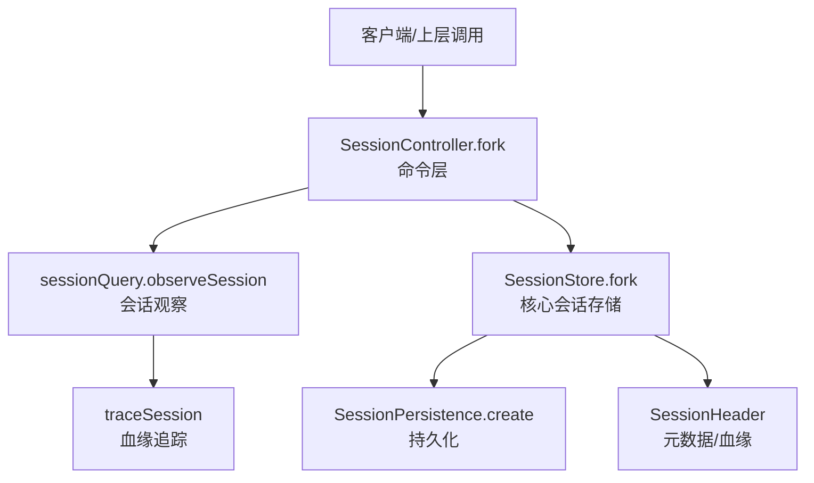
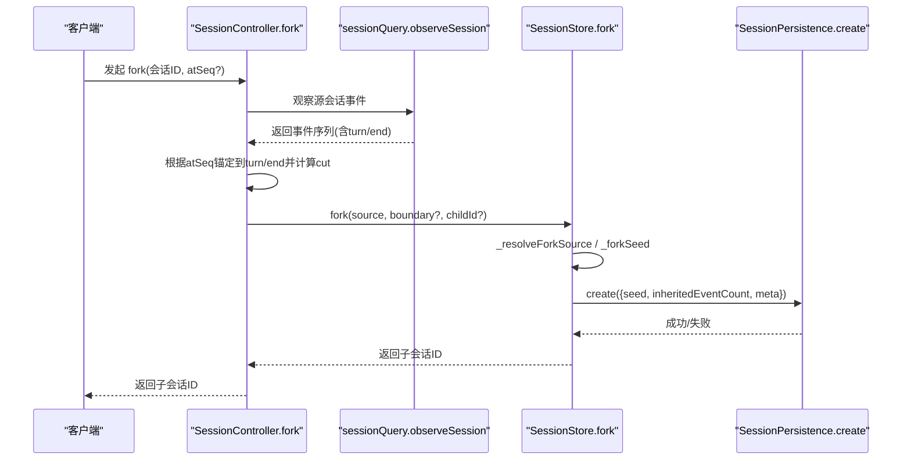
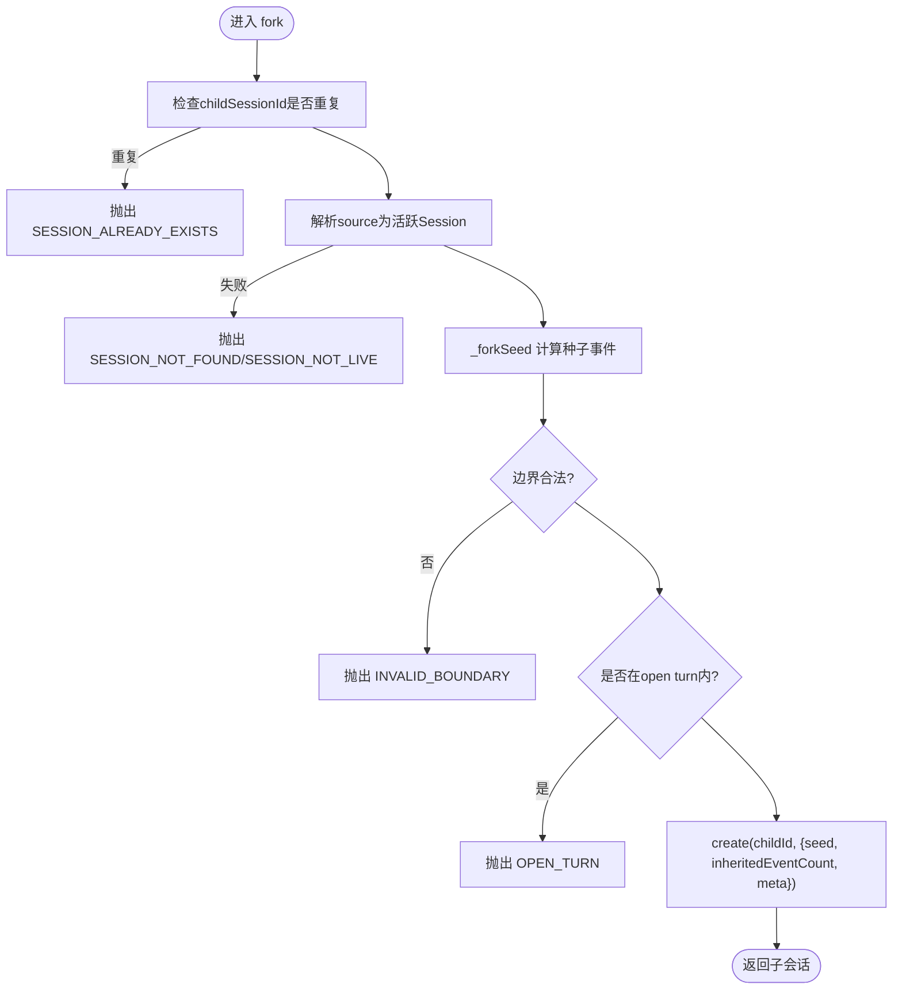
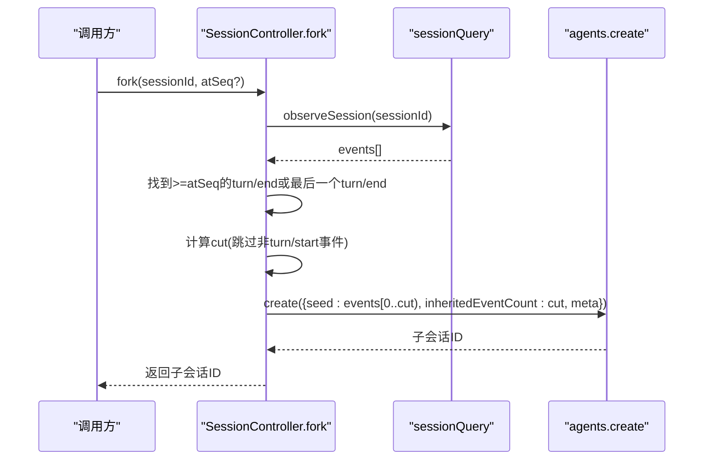
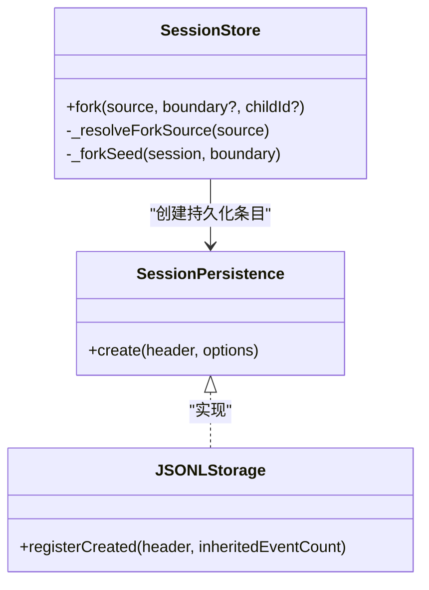
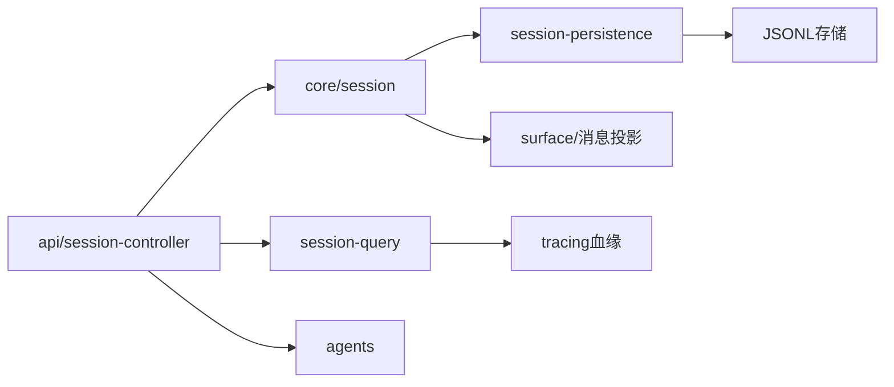

# 会话克隆与分支创建

<cite>
**本文引用的文件**
- [packages/core/session/src/index.ts](file://packages/core/session/src/index.ts)
- [packages/api/session-controller/src/commands.ts](file://packages/api/session-controller/src/commands.ts)
- [packages/api/session-controller/src/client/sessions/service.ts](file://packages/api/session-controller/src/client/sessions/service.ts)
- [packages/core/session/tests/fork.spec.ts](file://packages/core/session/tests/fork.spec.ts)
- [docs/subsystems/persistence.md](file://docs/subsystems/persistence.md)
- [packages/session-query/session-query/src/tracing.ts](file://packages/session-query/session-query/src/tracing.ts)
- [packages/session/session-persistence/src/index.ts](file://packages/session/session-persistence/src/index.ts)
- [packages/session/session-persistence-jsonl/src/storage.ts](file://packages/session/session-persistence-jsonl/src/storage.ts)
</cite>

## 目录
1. [简介](#简介)
2. [项目结构](#项目结构)
3. [核心组件](#核心组件)
4. [架构总览](#架构总览)
5. [详细组件分析](#详细组件分析)
6. [依赖关系分析](#依赖关系分析)
7. [性能考量](#性能考量)
8. [故障排查指南](#故障排查指南)
9. [结论](#结论)
10. [附录：API参考与最佳实践](#附录api参考与最佳实践)

## 简介
本文件围绕“会话克隆与分支创建”展开，系统性说明如何基于现有会话或会话ID创建分支（fork），包括边界选择策略、生命周期管理、冲突预防机制，以及面向开发者的使用示例与最佳实践。重点覆盖以下主题：
- SessionForkSource 的使用方式：支持传入 Session 对象或 SessionId
- 分支边界选择：seq 边界校验、open turn 检测、连续性检查
- 生命周期管理：父会话引用、版本继承、状态复制
- 冲突预防：唯一性检查、命名空间隔离、并发控制
- 代码级流程与错误类型
- API 参考与常见用法

## 项目结构
与分支创建相关的核心实现分布在如下模块：
- 核心会话存储与 fork 能力：packages/core/session/src/index.ts
- 对外命令层（RPC/网关）：packages/api/session-controller/src/commands.ts
- 客户端封装：packages/api/session-controller/src/client/sessions/service.ts
- 测试用例（边界与异常）：packages/core/session/tests/fork.spec.ts
- 持久化元数据约定：docs/subsystems/persistence.md
- 会话血缘追踪：packages/session-query/session-query/src/tracing.ts
- 持久化接口与后端：packages/session/session-persistence/src/index.ts, packages/session/session-persistence-jsonl/src/storage.ts

图表来源
- [packages/api/session-controller/src/commands.ts:188-286](file://packages/api/session-controller/src/commands.ts#L188-L286)
- [packages/core/session/src/index.ts:1176-1249](file://packages/core/session/src/index.ts#L1176-L1249)
- [packages/session/session-persistence/src/index.ts:60-70](file://packages/session/session-persistence/src/index.ts#L60-L70)
- [packages/session-query/session-query/src/tracing.ts:119-179](file://packages/session-query/session-query/src/tracing.ts#L119-L179)

章节来源
- [packages/core/session/src/index.ts:1176-1249](file://packages/core/session/src/index.ts#L1176-L1249)
- [packages/api/session-controller/src/commands.ts:188-286](file://packages/api/session-controller/src/commands.ts#L188-L286)

## 核心组件
- SessionStore.fork：核心入口，接收 SessionForkSource（Session | SessionId）、可选边界 seq、可选子会话 ID；完成边界校验、种子事件裁剪、子会话创建与元数据设置。
- _forkSeed：内部方法，负责边界合法性、连续性、open turn 检测，并返回要复制到子会话的种子事件数组。
- _resolveForkSource：将 SessionForkSource 解析为当前进程内活跃的 Session，避免使用过期或不同实例的句柄。
- 命令层 fork：通过 sessionQuery 获取稳定快照，按 atSeq 锚定到最近完成的 turn/end，计算 cut 点，构造子会话并写入持久化。
- 持久化：以 inheritedEventCount 精确记录继承前缀长度，配合 isSeeded 标记，确保可恢复性与一致性。
- 血缘追踪：通过 parentSession 字段构建祖先/后代树，支持完整性判断与环检测。

章节来源
- [packages/core/session/src/index.ts:1176-1249](file://packages/core/session/src/index.ts#L1176-L1249)
- [packages/api/session-controller/src/commands.ts:188-286](file://packages/api/session-controller/src/commands.ts#L188-L286)
- [docs/subsystems/persistence.md:178-211](file://docs/subsystems/persistence.md#L178-L211)
- [packages/session-query/session-query/src/tracing.ts:119-179](file://packages/session-query/session-query/src/tracing.ts#L119-L179)

## 架构总览
下图展示了从外部请求到核心存储与持久化的完整调用链，以及关键校验点。

图表来源
- [packages/api/session-controller/src/commands.ts:188-286](file://packages/api/session-controller/src/commands.ts#L188-L286)
- [packages/core/session/src/index.ts:1176-1249](file://packages/core/session/src/index.ts#L1176-L1249)
- [packages/session/session-persistence/src/index.ts:60-70](file://packages/session/session-persistence/src/index.ts#L60-L70)

## 详细组件分析

### SessionStore.fork 与边界选择
- 输入：
  - source: SessionForkSource（Session 或 SessionId）
  - boundary?: SessionSeq（可选，默认取最后一个事件 seq）
  - childSessionId?: SessionId（可选，未提供则由存储生成）
- 行为要点：
  - 若显式提供 childSessionId，先进行唯一性检查，已存在则抛出 SESSION_ALREADY_EXISTS
  - 解析 source：
    - 字符串：查找活跃会话，不存在则抛出 SESSION_NOT_FOUND
    - Session 对象：必须来自当前 store 实例，否则抛出 SESSION_NOT_LIVE
  - 计算种子事件：
    - 校验 boundary 为非负安全整数且小于当前会话长度
    - 校验边界对应的事件存在且连续
    - 扫描至边界为止的最后一次 turn/start 或 turn/end，若最后一个是 turn/start，则拒绝 OPEN_TURN
    - 返回 [0..boundary] 的不可变事件快照作为 seed
  - 创建子会话：
    - 传递 seed 与 inheritedEventCount=seed.length
    - 元数据 meta 包含 parentSession、isSeeded=true，必要时继承 cwd
- 复杂度：
  - 边界扫描与 lastTurnBoundary 查找为 O(n)，n 为边界位置
  - 事件快照为 O(n) 拷贝，但后续不可变共享

图表来源
- [packages/core/session/src/index.ts:1176-1249](file://packages/core/session/src/index.ts#L1176-L1249)

章节来源
- [packages/core/session/src/index.ts:1176-1249](file://packages/core/session/src/index.ts#L1176-L1249)
- [packages/core/session/tests/fork.spec.ts:179-232](file://packages/core/session/tests/fork.spec.ts#L179-L232)

### 命令层 fork：atSeq 锚定与 cut 计算
- 作用：在 RPC/网关层，将用户提供的 atSeq 转换为一个安全的“已完成 turn”的切点，保证分支起点位于稳定的 turn/end 之后。
- 步骤：
  - 校验 atSeq 为非负安全整数
  - 通过 observeSession 获取源会话事件
  - 若 atSeq 存在，找到首个 turn/end 且其 seq >= atSeq；否则回退到最后一个 turn/end
  - 若无可用 turn/end，返回不可用错误
  - 计算 cut：从该 turn/end 向后推进到下一个 turn/start（或末尾），得到子会话的 seed 长度
  - 创建子会话，携带 inheritedEventCount=cut，meta.parentSession=源会话id，meta.isSeeded=true
  - 可选：附加工作区并绑定

图表来源
- [packages/api/session-controller/src/commands.ts:188-286](file://packages/api/session-controller/src/commands.ts#L188-L286)

章节来源
- [packages/api/session-controller/src/commands.ts:188-286](file://packages/api/session-controller/src/commands.ts#L188-L286)

### 生命周期管理：父会话引用、版本继承、状态复制
- 父会话引用：子会话 header.parentSession 指向源会话 id，便于血缘查询与导航
- 版本继承：子会话 header.version 由系统填充，保持格式一致；isSeeded=true 表示该会话由历史种子构造
- 状态复制：
  - seed：从源会话截取 [0..cut) 的事件数组，作为子会话初始日志
  - inheritedEventCount：精确记录继承前缀长度，用于区分“继承事件”和“子会话自有事件”
  - 首条自有事件之前会插入 end-seed 标记，标识继承边界
- 工作区与配置：
  - 命令层可选择复制工作区并 attach 到子会话
  - 元数据中可携带 agentPreset、cwd 等上下文信息

章节来源
- [docs/subsystems/persistence.md:178-211](file://docs/subsystems/persistence.md#L178-L211)
- [packages/api/session-controller/src/commands.ts:234-286](file://packages/api/session-controller/src/commands.ts#L234-L286)
- [packages/core/session/src/index.ts:1182-1191](file://packages/core/session/src/index.ts#L1182-L1191)

### 冲突预防机制：唯一性、命名空间隔离、并发控制
- 唯一性检查：
  - 显式 childSessionId 时，在创建前检查是否已存在，防止重复
  - 未显式提供时，由存储层策略生成唯一 ID
- 命名空间隔离：
  - 通过 parentSession 建立父子关系，查询时可构建完整血缘树
  - 血缘追踪支持检测环与缺失父节点，保障图结构正确性
- 并发控制：
  - 持久化后端对同一会话 ID 的 create/open 持有锁，避免跨进程重复创建或写冲突
  - 内存态 writers/pending 集合保护同一进程内的并发注册

图表来源
- [packages/core/session/src/index.ts:1176-1249](file://packages/core/session/src/index.ts#L1176-L1249)
- [packages/session/session-persistence/src/index.ts:60-70](file://packages/session/session-persistence/src/index.ts#L60-L70)
- [packages/session/session-persistence-jsonl/src/storage.ts:365-388](file://packages/session/session-persistence-jsonl/src/storage.ts#L365-L388)

章节来源
- [packages/core/session/tests/fork.spec.ts:301-319](file://packages/core/session/tests/fork.spec.ts#L301-L319)
- [packages/session/session-persistence-jsonl/src/storage.ts:365-388](file://packages/session/session-persistence-jsonl/src/storage.ts#L365-L388)
- [packages/session-query/session-query/src/tracing.ts:132-179](file://packages/session-query/session-query/src/tracing.ts#L132-L179)

### 边界条件与错误处理
- 无效边界：
  - 非安全整数、负数、超出范围、不连续索引均会触发 INVALID_BOUNDARY
- open turn：
  - 边界落在 turn/start 之后但未到达 turn/end，触发 OPEN_TURN
- 源会话不存在或不匹配：
  - SESSION_NOT_FOUND、SESSION_NOT_LIVE
- 子会话ID重复：
  - SESSION_ALREADY_EXISTS（优先于边界校验）

章节来源
- [packages/core/session/src/index.ts:1193-1233](file://packages/core/session/src/index.ts#L1193-L1233)
- [packages/core/session/tests/fork.spec.ts:179-232](file://packages/core/session/tests/fork.spec.ts#L179-L232)

## 依赖关系分析
- SessionStore 依赖：
  - Session 事件模型与 SurfaceManager（用于事件有效性验证）
  - 持久化接口（inheritedEventCount、isSeeded）
- 命令层依赖：
  - sessionQuery 获取稳定事件视图
  - agents 服务创建新会话并注入预设/模型
- 持久化后端：
  - JSONL 存储维护 writers/pending，保证并发安全
- 血缘追踪：
  - 基于 parentSession 构建祖先/后代树，支持不完整血缘提示

图表来源
- [packages/core/session/src/index.ts:1-33](file://packages/core/session/src/index.ts#L1-L33)
- [packages/api/session-controller/src/commands.ts:188-286](file://packages/api/session-controller/src/commands.ts#L188-L286)
- [packages/session/session-persistence/src/index.ts:45-70](file://packages/session/session-persistence/src/index.ts#L45-L70)
- [packages/session-query/session-query/src/tracing.ts:119-179](file://packages/session-query/session-query/src/tracing.ts#L119-L179)

章节来源
- [packages/core/session/src/index.ts:1-33](file://packages/core/session/src/index.ts#L1-L33)
- [packages/api/session-controller/src/commands.ts:188-286](file://packages/api/session-controller/src/commands.ts#L188-L286)

## 性能考量
- 事件快照与裁剪：
  - fork 会复制 [0..boundary] 的事件数组，时间复杂度 O(n)；建议合理选择边界，避免过大历史复制
- 边界扫描：
  - lastTurnBoundary 查找为线性扫描；在长会话中应优先使用 turn/end 作为边界
- 持久化写入：
  - JSONL 后端的 registerCreated 与 append 阶段持有锁，避免并发写冲突；高并发场景下注意批大小与重试策略
- 血缘查询：
  - traceSession 构建祖先/后代树，复杂度与会话数量相关；建议在批量查询时复用观察结果

## 故障排查指南
- 常见问题与定位：
  - “边界不在会话中”：检查 boundary 是否小于当前会话长度，且事件索引连续
  - “open turn 内无法 fork”：确认边界位于 turn/end 之后
  - “子会话ID重复”：避免显式指定已存在的 childSessionId，或改用自动生成
  - “源会话不存在/非活跃”：确保传入的是当前 store 中的活跃 Session，或使用 sessionId 让系统解析
- 诊断手段：
  - 使用 sessionQuery.traceSession 查看血缘完整性
  - 检查持久化后端的 writers/pending 集合，确认是否存在并发冲突
  - 查看命令层日志，确认 atSeq 锚定是否正确

章节来源
- [packages/core/session/tests/fork.spec.ts:179-232](file://packages/core/session/tests/fork.spec.ts#L179-L232)
- [packages/session-query/session-query/src/tracing.ts:132-179](file://packages/session-query/session-query/src/tracing.ts#L132-L179)
- [packages/session/session-persistence-jsonl/src/storage.ts:365-388](file://packages/session/session-persistence-jsonl/src/storage.ts#L365-L388)

## 结论
本方案通过 SessionStore.fork 提供了稳健的会话克隆与分支创建能力，结合命令层的 atSeq 锚定与持久化的 inheritedEventCount 机制，确保了分支边界的稳定性与可恢复性。通过严格的边界校验、open turn 检测、唯一性检查与并发控制，有效避免了分支冲突与数据不一致。开发者可据此在不同层级（命令层、客户端、核心存储）安全地创建和管理会话分支。

## 附录：API参考与最佳实践

### API 参考
- SessionStore.fork
  - 参数：
    - source: SessionForkSource（Session | SessionId）
    - boundary?: SessionSeq（可选，默认取最后一个事件 seq）
    - childSessionId?: SessionId（可选）
  - 返回：子 Session
  - 错误：
    - SESSION_ALREADY_EXISTS：子会话ID重复
    - SESSION_NOT_FOUND：源会话不存在
    - SESSION_NOT_LIVE：传入的 Session 不是当前 store 实例
    - INVALID_BOUNDARY：边界非法或不连续
    - OPEN_TURN：边界位于 open turn 内
- 命令层 fork
  - 参数：sessionId, atSeq?
  - 行为：将 atSeq 锚定到最近的 turn/end，计算 cut，创建子会话并持久化
  - 返回：子会话ID
- 客户端封装
  - 提供便捷方法，自动处理 atSeq 转换与重命名等逻辑

章节来源
- [packages/core/session/src/index.ts:1176-1249](file://packages/core/session/src/index.ts#L1176-L1249)
- [packages/api/session-controller/src/commands.ts:188-286](file://packages/api/session-controller/src/commands.ts#L188-L286)
- [packages/api/session-controller/src/client/sessions/service.ts:439-453](file://packages/api/session-controller/src/client/sessions/service.ts#L439-L453)

### 最佳实践
- 边界选择：
  - 优先使用 turn/end 作为边界，避免 open turn
  - 对于大会话，尽量缩小边界以减少复制成本
- 唯一性与命名空间：
  - 尽量避免显式指定 childSessionId，交由系统生成
  - 利用 parentSession 构建清晰的血缘关系，便于追溯
- 并发与持久化：
  - 在高并发场景下，注意持久化后端的锁与重试策略
  - 使用 inheritedEventCount 精确记录继承前缀，确保可恢复性
- 调试与观测：
  - 使用 traceSession 检查血缘完整性
  - 关注命令层日志，确认 atSeq 锚定与 cut 计算是否符合预期

章节来源
- [docs/subsystems/persistence.md:178-211](file://docs/subsystems/persistence.md#L178-L211)
- [packages/session-query/session-query/src/tracing.ts:119-179](file://packages/session-query/session-query/src/tracing.ts#L119-L179)
- [packages/core/session/tests/fork.spec.ts:116-177](file://packages/core/session/tests/fork.spec.ts#L116-L177)