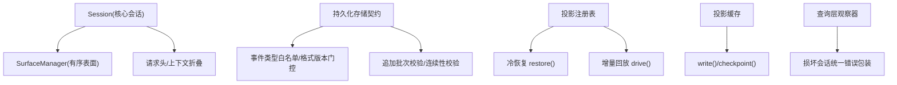
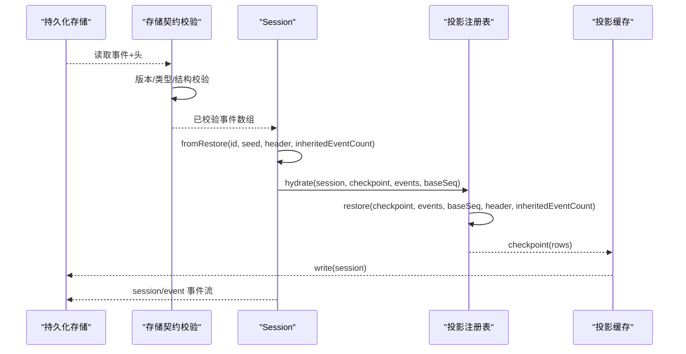
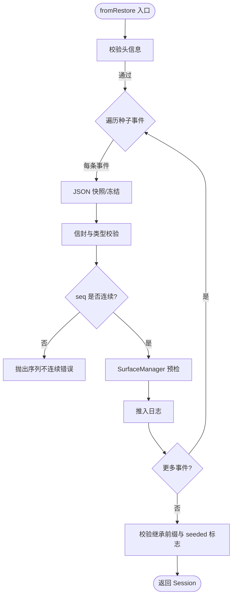
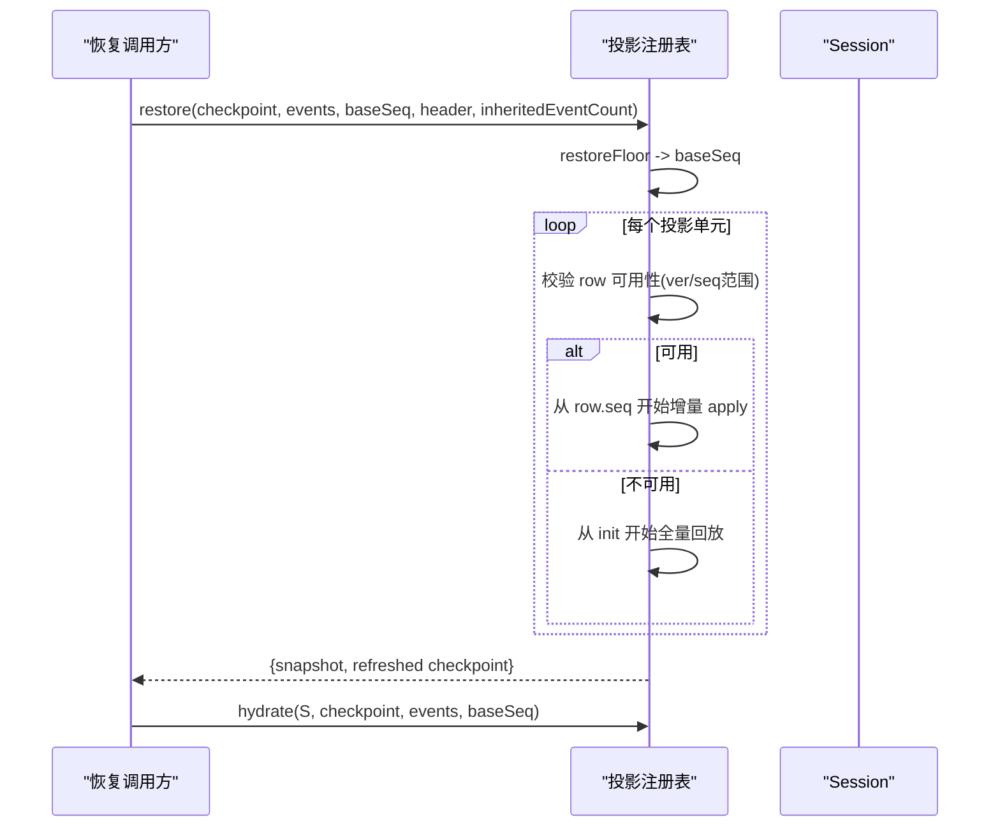
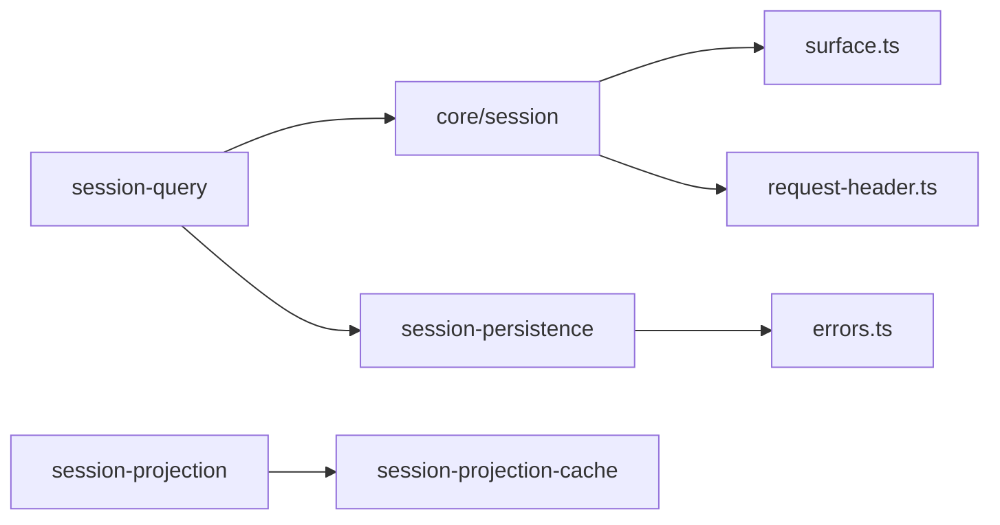

# 会话恢复与重建

<cite>
**本文引用的文件**
- [packages/core/session/src/index.ts](file://packages/core/session/src/index.ts)
- [packages/session/session-projection/src/index.ts](file://packages/session/session-projection/src/index.ts)
- [packages/session/session-persistence/src/storage-contract.ts](file://packages/session/session-persistence/src/storage-contract.ts)
- [packages/session/session-persistence/src/errors.ts](file://packages/session/session-persistence/src/errors.ts)
- [packages/session/session-projection-cache/src/index.ts](file://packages/session/session-projection-cache/src/index.ts)
- [packages/session/session-turn-outline/tests/projection.spec.ts](file://packages/session/session-turn-outline/tests/projection.spec.ts)
- [packages/session/session-projection/tests/registry.spec.ts](file://packages/session/session-projection/tests/registry.spec.ts)
- [packages/session-query/session-query/src/observation.ts](file://packages/session-query/session-query/src/observation.ts)
- [packages/compaction/compaction/src/invariant.ts](file://packages/compaction/compaction/src/invariant.ts)
- [docs/subsystems/session.md](file://docs/subsystems/session.md)
</cite>

## 目录
1. [简介](#简介)
2. [项目结构](#项目结构)
3. [核心组件](#核心组件)
4. [架构总览](#架构总览)
5. [详细组件分析](#详细组件分析)
6. [依赖关系分析](#依赖关系分析)
7. [性能考虑](#性能考虑)
8. [故障排除指南](#故障排除指南)
9. [结论](#结论)
10. [附录：API参考与示例路径](#附录api参考与示例路径)

## 简介
本文件系统性阐述从事件日志重建会话的完整流程，覆盖以下主题：
- 使用 Session.fromRestore 进行断点续传与增量恢复
- 事件序列验证、数据完整性检查与状态一致性保证
- 损坏事件检测、自动修复策略与数据回滚机制
- 恢复过程中的性能优化（批量处理、内存管理、错误恢复）
- 恢复异常处理与结果验证方法
- 面向开发者的会话恢复 API 参考与故障排除指南

## 项目结构
与会话恢复相关的关键模块与职责：
- 核心会话与事件日志：Session 类、append、surface 投影、头信息折叠等
- 持久化存储契约：版本门控、事件类型白名单、追加批次校验、连续性校验
- 投影系统：按事件驱动的状态机，支持冷启动恢复、增量回放、可检查点
- 投影缓存：将投影状态持久化，提供快速恢复与一致性保障
- 查询层：对损坏会话的统一错误包装与诊断

图示来源
- [packages/core/session/src/index.ts:451-852](file://packages/core/session/src/index.ts#L451-L852)
- [packages/session/session-projection/src/index.ts:199-712](file://packages/session/session-projection/src/index.ts#L199-L712)
- [packages/session/session-persistence/src/storage-contract.ts:1-152](file://packages/session/session-persistence/src/storage-contract.ts#L1-L152)
- [packages/session/session-projection-cache/src/index.ts:237-261](file://packages/session/session-projection-cache/src/index.ts#L237-L261)
- [packages/session-query/session-query/src/observation.ts:128-144](file://packages/session-query/session-query/src/observation.ts#L128-L144)

章节来源
- [packages/core/session/src/index.ts:451-852](file://packages/core/session/src/index.ts#L451-L852)
- [packages/session/session-projection/src/index.ts:199-712](file://packages/session/session-projection/src/index.ts#L199-L712)
- [packages/session/session-persistence/src/storage-contract.ts:1-152](file://packages/session/session-persistence/src/storage-contract.ts#L1-L152)

## 核心组件
- Session（核心会话）
  - 提供静态工厂 create/fromRestore，用于快照式创建与从持久化恢复
  - 严格验证种子事件（seq 连续、JSON 可序列化、表面标记合法）
  - 维护首条“进程内”事件偏移 firstLiveSeq，区分构造输入与后续追加
  - 通过 SurfaceManager 维护消息面，确保消息历史一致性与可推导性
  - 增量折叠请求头与上下文，避免重复计算
- 持久化存储契约
  - 版本门控：拒绝不支持的格式版本或未知事件类型
  - 事件校验：在读取时 adopt 并冻结事件，拒绝非法结构
  - 追加批次校验：确保 seq 连续，防止写入错位
- 投影系统
  - 以纯函数 apply 驱动状态机，支持 init + 增量回放
  - 提供 restore 冷恢复、hydrate 热注入、checkpoint 写回
  - 通过 restoreFloor 计算最小回放起点，检测日志收缩
- 投影缓存
  - 在 flush 之后落盘，保证“先事件后状态”的一致性
  - 通过 identity 匹配防止跨会话污染
- 查询层
  - 对恢复失败的会话进行统一错误包装，便于上层诊断

章节来源
- [packages/core/session/src/index.ts:92-156](file://packages/core/session/src/index.ts#L92-L156)
- [packages/core/session/src/index.ts:541-608](file://packages/core/session/src/index.ts#L541-L608)
- [packages/core/session/src/index.ts:699-749](file://packages/core/session/src/index.ts#L699-L749)
- [packages/session/session-persistence/src/storage-contract.ts:35-104](file://packages/session/session-persistence/src/storage-contract.ts#L35-L104)
- [packages/session/session-persistence/src/storage-contract.ts:145-152](file://packages/session/session-persistence/src/storage-contract.ts#L145-L152)
- [packages/session/session-projection/src/index.ts:425-540](file://packages/session/session-projection/src/index.ts#L425-L540)
- [packages/session/session-projection-cache/src/index.ts:237-261](file://packages/session/session-projection-cache/src/index.ts#L237-L261)

## 架构总览
下图展示从持久化到会话恢复的端到端流程：读取事件与头 → 存储契约校验 → 构建 Session → 投影系统冷恢复/增量回放 → 缓存落盘 → 对外暴露。

图示来源
- [packages/session/session-persistence/src/storage-contract.ts:69-104](file://packages/session/session-persistence/src/storage-contract.ts#L69-L104)
- [packages/core/session/src/index.ts:532-608](file://packages/core/session/src/index.ts#L532-L608)
- [packages/session/session-projection/src/index.ts:495-540](file://packages/session/session-projection/src/index.ts#L495-L540)
- [packages/session/session-projection-cache/src/index.ts:237-261](file://packages/session/session-projection-cache/src/index.ts#L237-L261)

## 详细组件分析

### Session.fromRestore 与事件序列验证
- 入口：Session.fromRestore(id, seed, header, inheritedEventCount)
- 关键验证：
  - 头信息：validateRestoredSessionHeader 严格校验字段与类型
  - 种子事件：逐条做 JSON 快照、信封校验、seq 必须从 0 连续
  - 表面过渡：通过 SurfaceManager.validateNext 预检 surfaceOp/sourceEventSeqs
  - 继承前缀：inheritedEventCount 必须 ≤ 日志长度； seeded 场景需满足特定约束
- 结果：返回一个不可变、深冻结的 Session，firstLiveSeq 标记进程内首次追加位置

图示来源
- [packages/core/session/src/index.ts:532-608](file://packages/core/session/src/index.ts#L532-L608)
- [packages/core/session/src/index.ts:92-156](file://packages/core/session/src/index.ts#L92-L156)

章节来源
- [packages/core/session/src/index.ts:532-608](file://packages/core/session/src/index.ts#L532-L608)
- [packages/core/session/src/index.ts:92-156](file://packages/core/session/src/index.ts#L92-L156)

### 断点续传与增量恢复
- 冷恢复：ProjectionRegistry.restore 基于 checkpoint 与事件尾部回放
  - 使用 restoreFloor 计算最小 baseSeq，确保能检测到日志收缩
  - 若某 key 的 row 超出当前日志末端，则强制从 seq 0 重读
- 热注入：hydrate 将恢复后的单元状态安装到 Session 的缓存中，后续 live 事件仅推进未消费部分
- 一致性：每个单元 stateVersion 变化会丢弃旧行，避免语义漂移

图示来源
- [packages/session/session-projection/src/index.ts:425-540](file://packages/session/session-projection/src/index.ts#L425-L540)
- [packages/session/session-projection/src/index.ts:552-595](file://packages/session/session-projection/src/index.ts#L552-L595)

章节来源
- [packages/session/session-projection/src/index.ts:425-540](file://packages/session/session-projection/src/index.ts#L425-L540)
- [packages/session/session-projection/src/index.ts:552-595](file://packages/session/session-projection/src/index.ts#L552-L595)

### 数据完整性检查与状态一致性
- 存储层：
  - 版本门控：assertVersion 拒绝不支持的格式版本
  - 事件白名单：validateStoredEvents 拒绝未知事件类型（除非 ignorable）
  - 追加连续性：assertContiguous 确保写入 seq 连续
- 会话层：
  - 种子事件严格校验（信封、JSON 可序列化、seq 连续、surface 合法性）
  - 头信息严格校验（字段类型、值域、绝对路径等）
- 投影层：
  - 每单元 stateVersion 变更即失效旧行，避免语义不一致
  - restore 对缺失 seq 或越界 row 报错，要求从 seq 0 重读

章节来源
- [packages/session/session-persistence/src/storage-contract.ts:46-104](file://packages/session/session-persistence/src/storage-contract.ts#L46-L104)
- [packages/session/session-persistence/src/storage-contract.ts:145-152](file://packages/session/session-persistence/src/storage-contract.ts#L145-L152)
- [packages/core/session/src/index.ts:92-156](file://packages/core/session/src/index.ts#L92-L156)
- [packages/core/session/src/index.ts:541-608](file://packages/core/session/src/index.ts#L541-L608)
- [packages/session/session-projection/src/index.ts:495-540](file://packages/session/session-projection/src/index.ts#L495-L540)

### 损坏事件检测、自动修复与数据回滚
- 损坏检测：
  - 存储契约在读取阶段抛出 SessionFormatUnsupportedError / SessionPersistenceCorruptionError
  - 投影恢复遇到缺失 seq 或越界 row 直接报错，触发上层重读
- 自动修复策略：
  - 当检测到日志收缩或 row 越界时，强制从 seq 0 重新回放，丢弃不可信的水位
  - 投影缓存仅在 flush 成功后写回，避免“状态超前于事件”的不一致
- 数据回滚：
  - 会话 append 失败不会改变日志（在 push 之前完成全部校验）
  - 持久化失败由上层重试/回退；缓存写回发生在 flush 之后，天然具备屏障

章节来源
- [packages/session/session-persistence/src/errors.ts:92-138](file://packages/session/session-persistence/src/errors.ts#L92-L138)
- [packages/session/session-projection/src/index.ts:495-540](file://packages/session/session-projection/src/index.ts#L495-L540)
- [packages/session/session-projection-cache/src/index.ts:237-261](file://packages/session/session-projection-cache/src/index.ts#L237-L261)
- [packages/core/session/src/index.ts:699-749](file://packages/core/session/src/index.ts#L699-L749)

### 恢复过程中的性能优化
- 批量处理：
  - 持久化层 materializeAppendBatch 一次性快照批事件，减少多次拷贝
  - 投影层 hydrate 复用已恢复单元格，避免重复回放
- 内存管理：
  - 事件与头信息在边界处被冻结，避免深层复制与意外修改
  - 投影 view 采用引用比较，减少不必要的通知与序列化
- 错误恢复：
  - 投影恢复遇到不可用 row 时，明确提示“从 seq 0 重读”，便于上层快速定位
  - 查询层对损坏会话统一包装错误，便于监控与告警

章节来源
- [packages/session/session-persistence/src/storage-contract.ts:123-137](file://packages/session/session-persistence/src/storage-contract.ts#L123-L137)
- [packages/session/session-projection/src/index.ts:552-595](file://packages/session/session-projection/src/index.ts#L552-L595)
- [packages/session-query/session-query/src/observation.ts:128-144](file://packages/session-query/session-query/src/observation.ts#L128-L144)

### 具体代码示例（路径指引）
- 恢复会话
  - 使用 Session.fromRestore：[packages/core/session/src/index.ts:532-539](file://packages/core/session/src/index.ts#L532-L539)
  - 投影冷恢复：[packages/session/session-projection/src/index.ts:495-540](file://packages/session/session-projection/src/index.ts#L495-L540)
  - 投影热注入：[packages/session/session-projection/src/index.ts:552-595](file://packages/session/session-projection/src/index.ts#L552-L595)
- 处理恢复异常
  - 存储格式/类型不支持：[packages/session/session-persistence/src/errors.ts:104-138](file://packages/session/session-persistence/src/errors.ts#L104-L138)
  - 查询层损坏会话包装：[packages/session-query/session-query/src/observation.ts:128-144](file://packages/session-query/session-query/src/observation.ts#L128-L144)
- 验证恢复结果
  - 投影视图快照：[packages/session/session-projection/src/index.ts:338-352](file://packages/session/session-projection/src/index.ts#L338-L352)
  - 投影检查点校验（如 turnOutline 单调递增）：[packages/session/session-turn-outline/tests/projection.spec.ts:238-270](file://packages/session/session-turn-outline/tests/projection.spec.ts#L238-L270)
  - 日志收缩检测（越界 row 抛错）：[packages/session/session-projection/tests/registry.spec.ts:715-743](file://packages/session/session-projection/tests/registry.spec.ts#L715-L743)

章节来源
- [packages/core/session/src/index.ts:532-539](file://packages/core/session/src/index.ts#L532-L539)
- [packages/session/session-projection/src/index.ts:495-540](file://packages/session/session-projection/src/index.ts#L495-L540)
- [packages/session/session-projection/src/index.ts:552-595](file://packages/session/session-projection/src/index.ts#L552-L595)
- [packages/session/session-persistence/src/errors.ts:104-138](file://packages/session/session-persistence/src/errors.ts#L104-L138)
- [packages/session-query/session-query/src/observation.ts:128-144](file://packages/session-query/session-query/src/observation.ts#L128-L144)
- [packages/session/session-projection/src/index.ts:338-352](file://packages/session/session-projection/src/index.ts#L338-L352)
- [packages/session/session-turn-outline/tests/projection.spec.ts:238-270](file://packages/session/session-turn-outline/tests/projection.spec.ts#L238-L270)
- [packages/session/session-projection/tests/registry.spec.ts:715-743](file://packages/session/session-projection/tests/registry.spec.ts#L715-L743)

## 依赖关系分析
- Session 依赖 SurfaceManager 维护消息面，依赖 request-header 折叠逻辑
- 持久化契约为所有后端提供统一的版本/类型/连续性校验
- 投影系统订阅 session/event，驱动各领域状态机，并通过缓存持久化
- 查询层依赖会话与持久化能力，对异常进行统一封装

图示来源
- [packages/core/session/src/index.ts:1-32](file://packages/core/session/src/index.ts#L1-L32)
- [packages/session/session-persistence/src/errors.ts:1-138](file://packages/session/session-persistence/src/errors.ts#L1-L138)
- [packages/session/session-projection/src/index.ts:1-48](file://packages/session/session-projection/src/index.ts#L1-L48)
- [packages/session/session-projection-cache/src/index.ts:112-128](file://packages/session/session-projection-cache/src/index.ts#L112-L128)
- [packages/session-query/session-query/src/observation.ts:128-144](file://packages/session-query/session-query/src/observation.ts#L128-L144)

章节来源
- [packages/core/session/src/index.ts:1-32](file://packages/core/session/src/index.ts#L1-L32)
- [packages/session/session-persistence/src/errors.ts:1-138](file://packages/session/session-persistence/src/errors.ts#L1-L138)
- [packages/session/session-projection/src/index.ts:1-48](file://packages/session/session-projection/src/index.ts#L1-L48)
- [packages/session/session-projection-cache/src/index.ts:112-128](file://packages/session/session-projection-cache/src/index.ts#L112-L128)
- [packages/session-query/session-query/src/observation.ts:128-144](file://packages/session-query/session-query/src/observation.ts#L128-L144)

## 性能考虑
- 事件与头信息的冻结与快照在边界处集中完成，避免重复深拷贝
- 投影单元采用惰性构建与增量推进，减少不必要的全量回放
- 缓存写回位于 flush 之后，形成一致性屏障，降低崩溃恢复成本
- 批量写入与视图引用比较减少网络与序列化开销

[本节为通用性能建议，无需特定文件来源]

## 故障排除指南
- 常见错误与定位
  - 格式版本不支持/未知事件类型：查看存储契约抛出的 SessionFormatUnsupportedError，必要时升级 harness
  - 事件结构损坏：捕获 SessionPersistenceCorruptionError，结合 raw log 路径定位问题
  - 投影恢复失败：根据“re-read from seq 0”提示，确认是否存在日志截断或 row 越界
  - 查询层损坏会话：统一错误码 SESSION_QUERY_CORRUPT_SESSION，便于监控告警
- 排查步骤
  - 确认存储版本与事件白名单是否匹配当前构建
  - 检查追加批次 seq 是否连续，避免写入错位
  - 核对投影单元的 stateVersion 是否与运行时一致
  - 若日志收缩，强制从 seq 0 重放，丢弃不可信水位
- 回滚与恢复
  - 会话 append 失败不改变日志，可直接重试
  - 投影缓存仅在 flush 后写回，崩溃后可安全重放
  - 对于损坏会话，优先尝试从更早的 checkpoint 恢复

章节来源
- [packages/session/session-persistence/src/errors.ts:92-138](file://packages/session/session-persistence/src/errors.ts#L92-L138)
- [packages/session/session-projection/src/index.ts:495-540](file://packages/session/session-projection/src/index.ts#L495-L540)
- [packages/session/session-projection-cache/src/index.ts:237-261](file://packages/session/session-projection-cache/src/index.ts#L237-L261)
- [packages/session-query/session-query/src/observation.ts:128-144](file://packages/session-query/session-query/src/observation.ts#L128-L144)

## 结论
本方案通过严格的存储契约、会话级事件验证与投影系统的冷/热恢复机制，实现了高可靠性的会话恢复与重建。借助批量处理、内存冻结与一致性屏障，系统在性能与一致性之间取得平衡。配合完善的错误分类与回滚策略，可在复杂故障场景下快速定位与恢复。

[本节为总结性内容，无需特定文件来源]

## 附录：API参考与示例路径
- Session 公共 API（含 fromRestore）
  - 文档声明：[docs/subsystems/session.md:374-572](file://docs/subsystems/session.md#L374-L572)
  - 实现要点：[packages/core/session/src/index.ts:532-608](file://packages/core/session/src/index.ts#L532-L608)
- 持久化契约
  - 版本/类型/结构校验：[packages/session/session-persistence/src/storage-contract.ts:46-104](file://packages/session/session-persistence/src/storage-contract.ts#L46-L104)
  - 追加批次与连续性：[packages/session/session-persistence/src/storage-contract.ts:123-152](file://packages/session/session-persistence/src/storage-contract.ts#L123-L152)
- 投影系统
  - 冷恢复与增量回放：[packages/session/session-projection/src/index.ts:425-540](file://packages/session/session-projection/src/index.ts#L425-L540)
  - 热注入与缓存写回：[packages/session/session-projection/src/index.ts:552-595](file://packages/session/session-projection/src/index.ts#L552-L595)
  - 投影缓存一致性：[packages/session/session-projection-cache/src/index.ts:237-261](file://packages/session/session-projection-cache/src/index.ts#L237-L261)
- 测试与用例
  - 投影检查点单调性：[packages/session/session-turn-outline/tests/projection.spec.ts:238-270](file://packages/session/session-turn-outline/tests/projection.spec.ts#L238-L270)
  - 日志收缩检测：[packages/session/session-projection/tests/registry.spec.ts:715-743](file://packages/session/session-projection/tests/registry.spec.ts#L715-L743)
- 压缩与边界保护
  - 压缩边界与转场保护：[packages/compaction/compaction/src/invariant.ts:116-162](file://packages/compaction/compaction/src/invariant.ts#L116-L162)

章节来源
- [docs/subsystems/session.md:374-572](file://docs/subsystems/session.md#L374-L572)
- [packages/core/session/src/index.ts:532-608](file://packages/core/session/src/index.ts#L532-L608)
- [packages/session/session-persistence/src/storage-contract.ts:46-152](file://packages/session/session-persistence/src/storage-contract.ts#L46-L152)
- [packages/session/session-projection/src/index.ts:425-595](file://packages/session/session-projection/src/index.ts#L425-L595)
- [packages/session/session-projection-cache/src/index.ts:237-261](file://packages/session/session-projection-cache/src/index.ts#L237-L261)
- [packages/session/session-turn-outline/tests/projection.spec.ts:238-270](file://packages/session/session-turn-outline/tests/projection.spec.ts#L238-L270)
- [packages/session/session-projection/tests/registry.spec.ts:715-743](file://packages/session/session-projection/tests/registry.spec.ts#L715-L743)
- [packages/compaction/compaction/src/invariant.ts:116-162](file://packages/compaction/compaction/src/invariant.ts#L116-L162)