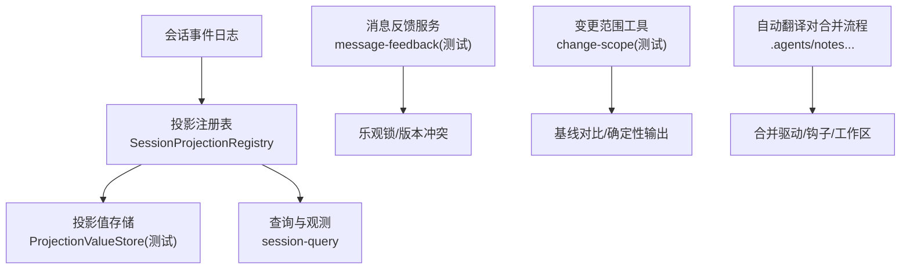
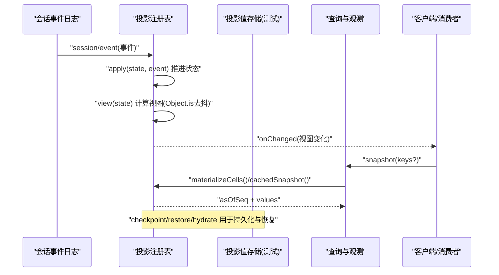
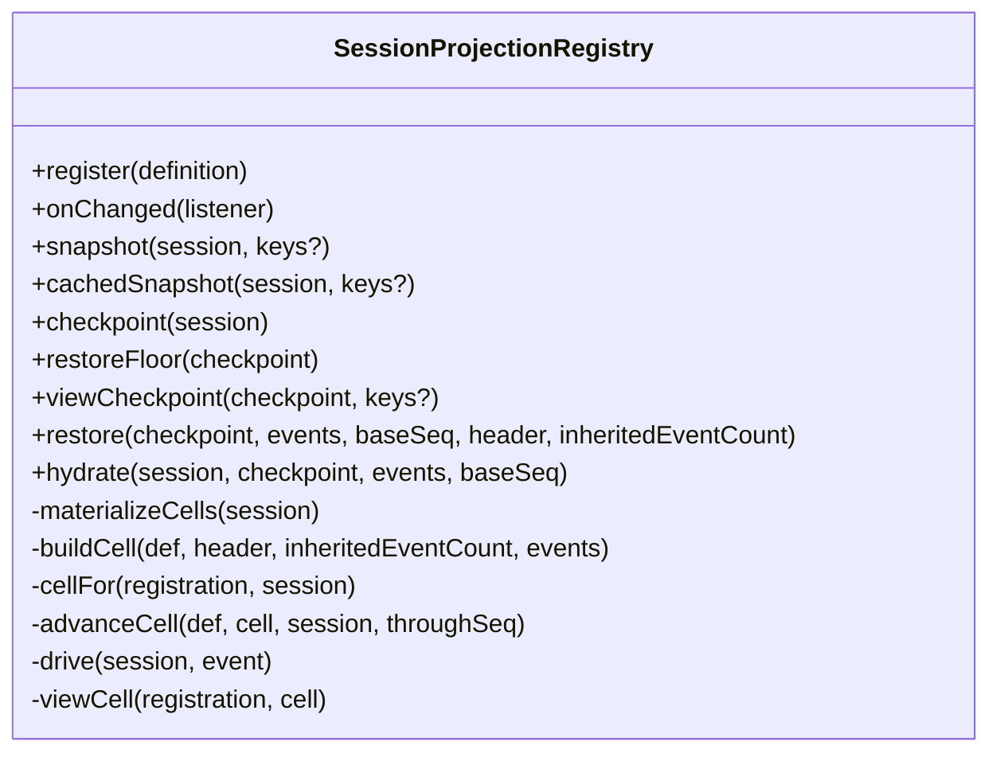
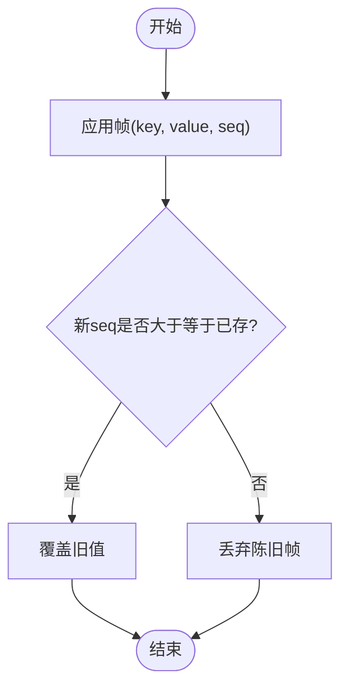
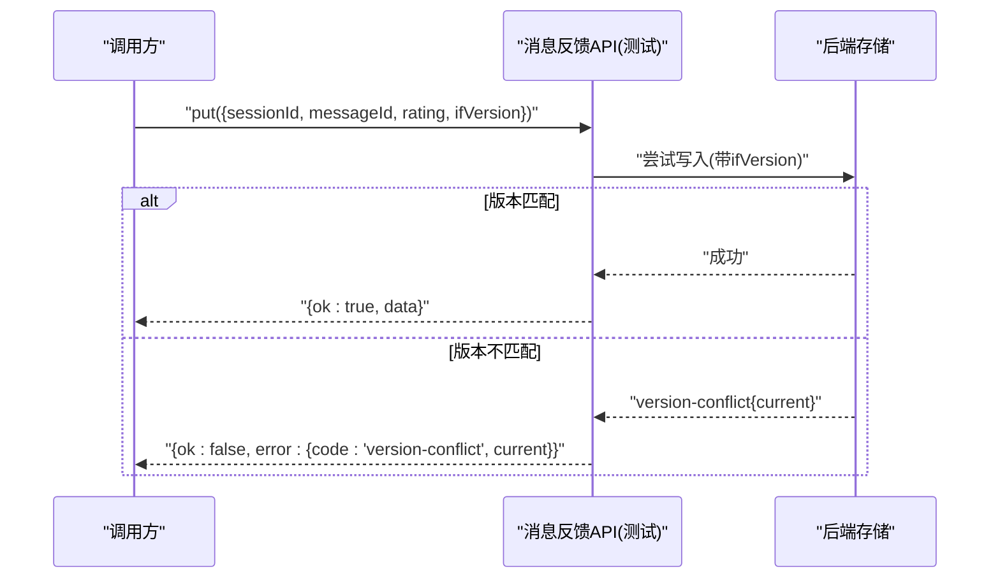
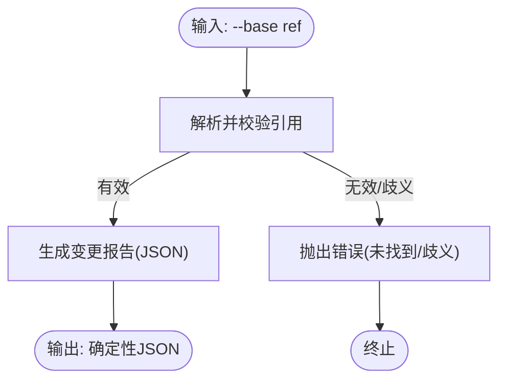
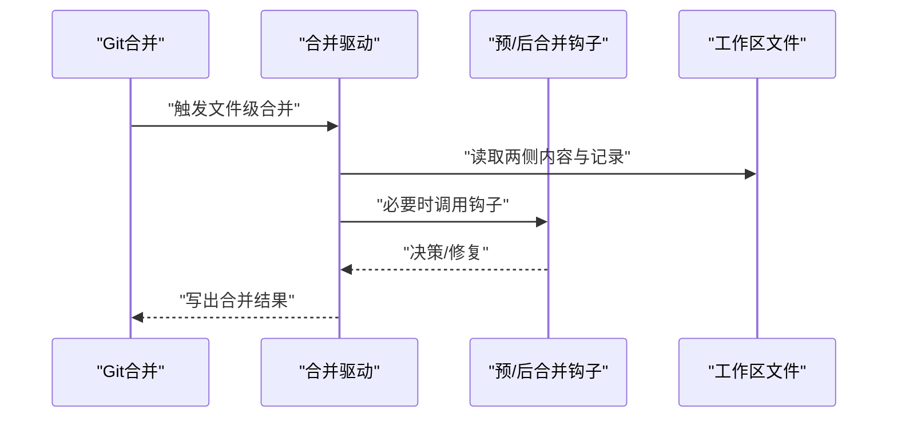
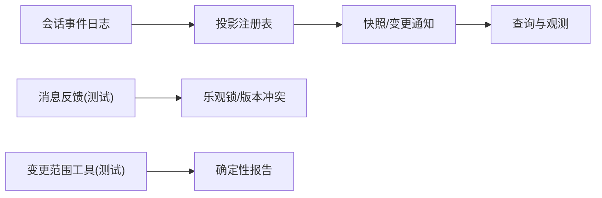

# 分支冲突检测与解决

<cite>
**本文引用的文件**
- [packages/session/session-projection/src/index.ts](file://packages/session/session-projection/src/index.ts)
- [packages/session/session-projection/src/types.ts](file://packages/session/session-projection/src/types.ts)
- [packages/api/session-controller/tests/projection-store.client.spec.ts](file://packages/api/session-controller/tests/projection-store.client.spec.ts)
- [packages/feedback/message-feedback/tests/message-feedback.spec.ts](file://packages/feedback/message-feedback/tests/message-feedback.spec.ts)
- [scripts/change-scope.spec.ts](file://scripts/change-scope.spec.ts)
- [.agents/notes/implemented/process/2026-08-08-automatic-translation-pairing-merges.md](file://.agents/notes/implemented/process/2026-08-08-automatic-translation-pairing-merges.md)
</cite>

## 目录
1. [简介](#简介)
2. [项目结构](#项目结构)
3. [核心组件](#核心组件)
4. [架构总览](#架构总览)
5. [详细组件分析](#详细组件分析)
6. [依赖关系分析](#依赖关系分析)
7. [性能考虑](#性能考虑)
8. [故障排查指南](#故障排查指南)
9. [结论](#结论)
10. [附录](#附录)

## 简介
本文件围绕“分支冲突检测与解决”展开，聚焦于会话事件序列的版本化投影、版本比较与合并策略、数据一致性与回滚机制，以及冲突预防（乐观锁、版本号管理、并发控制）。文档将结合代码级实现，给出事件差异检测、表面状态对比、依赖关系分析的可视化说明，并提供冲突检测、执行合并、处理冲突场景的参考路径与最佳实践。

## 项目结构
本项目采用能力分层的模块化设计：
- 会话事件日志与投影：通过会话事件驱动纯函数式状态折叠，形成可持久化的投影缓存与客户端视图。
- 查询与观测：基于持久化层读取会话快照并构建一致的投影切面。
- 反馈与消息：提供带版本控制的写操作，支持乐观锁与版本冲突返回。
- 变更范围工具：用于在仓库范围内生成确定性的变更报告，辅助分支基线对比。

图表来源
- [packages/session/session-projection/src/index.ts:181-712](file://packages/session/session-projection/src/index.ts#L181-L712)
- [packages/api/session-controller/tests/projection-store.client.spec.ts:27-44](file://packages/api/session-controller/tests/projection-store.client.spec.ts#L27-L44)
- [packages/feedback/message-feedback/tests/message-feedback.spec.ts:91-124](file://packages/feedback/message-feedback/tests/message-feedback.spec.ts#L91-L124)
- [scripts/change-scope.spec.ts:215-241](file://scripts/change-scope.spec.ts#L215-L241)
- [.agents/notes/implemented/process/2026-08-08-automatic-translation-pairing-merges.md:37-49](file://.agents/notes/implemented/process/2026-08-08-automatic-translation-pairing-merges.md#L37-L49)

章节来源
- [packages/session/session-projection/src/index.ts:181-712](file://packages/session/session-projection/src/index.ts#L181-L712)
- [packages/session/session-projection/src/types.ts:1-25](file://packages/session/session-projection/src/types.ts#L1-L25)
- [packages/api/session-controller/tests/projection-store.client.spec.ts:27-44](file://packages/api/session-controller/tests/projection-store.client.spec.ts#L27-L44)
- [packages/feedback/message-feedback/tests/message-feedback.spec.ts:91-124](file://packages/feedback/message-feedback/tests/message-feedback.spec.ts#L91-L124)
- [scripts/change-scope.spec.ts:215-241](file://scripts/change-scope.spec.ts#L215-L241)
- [.agents/notes/implemented/process/2026-08-08-automatic-translation-pairing-merges.md:37-49](file://.agents/notes/implemented/process/2026-08-08-automatic-translation-pairing-merges.md#L37-L49)

## 核心组件
- 会话投影注册表（SessionProjectionRegistry）
  - 职责：订阅会话事件，按纯函数 apply 推进各域的状态；维护 per-session 的水位缓存；计算并广播客户端视图变化；提供检查点与恢复能力。
  - 关键特性：stateVersion 校验、完整值事件规则、Object.is 视图去抖、懒加载与增量推进、冷启动 restore/hydrate。
- 投影类型表（SessionProjectionMap / SessionProjectionStateMap）
  - 职责：定义可扩展的客户端视图与宿主状态映射，供多包合并扩展。
- 投影值存储（测试中的 ProjectionValueStore）
  - 职责：演示帧级 last-wins 语义，验证重放与陈旧帧丢弃。
- 消息反馈（测试）
  - 职责：演示 ifVersion 乐观锁与 version-conflict 错误返回。
- 变更范围工具（测试）
  - 职责：基于仓库基线生成确定性 JSON 报告，辅助分支差异对比。

章节来源
- [packages/session/session-projection/src/index.ts:40-147](file://packages/session/session-projection/src/index.ts#L40-L147)
- [packages/session/session-projection/src/types.ts:1-25](file://packages/session/session-projection/src/types.ts#L1-L25)
- [packages/api/session-controller/tests/projection-store.client.spec.ts:27-44](file://packages/api/session-controller/tests/projection-store.client.spec.ts#L27-L44)
- [packages/feedback/message-feedback/tests/message-feedback.spec.ts:91-124](file://packages/feedback/message-feedback/tests/message-feedback.spec.ts#L91-L124)
- [scripts/change-scope.spec.ts:215-241](file://scripts/change-scope.spec.ts#L215-L241)

## 架构总览
下图展示从事件到投影、再到查询与客户端视图的整体数据流，以及与持久化检查点的交互。

图表来源
- [packages/session/session-projection/src/index.ts:207-223](file://packages/session/session-projection/src/index.ts#L207-L223)
- [packages/session/session-projection/src/index.ts:654-701](file://packages/session/session-projection/src/index.ts#L654-L701)
- [packages/session/session-projection/src/index.ts:396-540](file://packages/session/session-projection/src/index.ts#L396-L540)
- [packages/api/session-controller/tests/projection-store.client.spec.ts:27-44](file://packages/api/session-controller/tests/projection-store.client.spec.ts#L27-L44)

## 详细组件分析

### 组件A：会话投影注册表（SessionProjectionRegistry）
- 事件驱动的状态机
  - 每个注册的单元由 init 初始化，apply 为纯同步折叠，保证无副作用与可重放。
  - 使用 stateVersion 标识状态结构版本，防止旧检查点被错误前向应用。
- 视图与一致性
  - view 产出客户端可见值，使用 Object.is 比较以抑制内部状态变化导致的重复通知。
  - snapshot 提供一致切面 asOfSeq，确保所有值反映同一事件水位。
- 持久化与恢复
  - checkpoint 序列化当前状态与水位；restoreFloor 计算最小可用起始位置；restore 进行冷启动重放；hydrate 将恢复结果注入会话。
- 并发与幂等
  - advanceCell 与 drive 均按 seq 推进，遇到缺失或乱序会抛出错误，保障事件连续性。

图表来源
- [packages/session/session-projection/src/index.ts:199-712](file://packages/session/session-projection/src/index.ts#L199-L712)

章节来源
- [packages/session/session-projection/src/index.ts:40-147](file://packages/session/session-projection/src/index.ts#L40-L147)
- [packages/session/session-projection/src/index.ts:199-712](file://packages/session/session-projection/src/index.ts#L199-L712)

### 组件B：投影值存储（测试）
- 语义：按 seq 的 last-wins 策略应用帧，重放与陈旧帧会被丢弃，体现最终一致性。
- 用途：验证投影值在重放与并发写入下的正确性。

图表来源
- [packages/api/session-controller/tests/projection-store.client.spec.ts:27-44](file://packages/api/session-controller/tests/projection-store.client.spec.ts#L27-L44)

章节来源
- [packages/api/session-controller/tests/projection-store.client.spec.ts:27-44](file://packages/api/session-controller/tests/projection-store.client.spec.ts#L27-L44)

### 组件C：消息反馈（乐观锁与版本冲突）
- 写操作支持 ifVersion 参数，当版本不匹配时返回 version-conflict 错误，包含当前值以便重试或提示。
- 适用于分支合并后需要协调并发修改的场景。

图表来源
- [packages/feedback/message-feedback/tests/message-feedback.spec.ts:91-124](file://packages/feedback/message-feedback/tests/message-feedback.spec.ts#L91-L124)

章节来源
- [packages/feedback/message-feedback/tests/message-feedback.spec.ts:91-124](file://packages/feedback/message-feedback/tests/message-feedback.spec.ts#L91-L124)

### 组件D：变更范围工具（基线对比）
- 通过 --base 指定基线，生成确定性 JSON 报告，便于跨分支比较差异。
- 对无效引用或歧义引用进行错误提示，保证对比过程健壮。

图表来源
- [scripts/change-scope.spec.ts:215-241](file://scripts/change-scope.spec.ts#L215-L241)

章节来源
- [scripts/change-scope.spec.ts:215-241](file://scripts/change-scope.spec.ts#L215-L241)

### 组件E：自动翻译对合并流程（合并驱动）
- 通过合并驱动与钩子协作，在合并过程中自动解决特定文件的冲突，避免手动干预。
- 强调本地与工作区权限，避免远程自动化介入带来的复杂性。

图表来源
- [.agents/notes/implemented/process/2026-08-08-automatic-translation-pairing-merges.md:37-49](file://.agents/notes/implemented/process/2026-08-08-automatic-translation-pairing-merges.md#L37-L49)

章节来源
- [.agents/notes/implemented/process/2026-08-08-automatic-translation-pairing-merges.md:37-49](file://.agents/notes/implemented/process/2026-08-08-automatic-translation-pairing-merges.md#L37-L49)

## 依赖关系分析
- 会话投影注册表依赖会话事件源与持久化检查点接口，对外暴露快照与变更通知。
- 查询与观测依赖投影注册表提供的快照能力，屏蔽底层事件细节。
- 消息反馈与投影值存储在测试中体现乐观锁与 last-wins 语义，作为冲突处理的参考模式。
- 变更范围工具依赖仓库引用解析，输出确定性报告，服务于分支基线对比。

图表来源
- [packages/session/session-projection/src/index.ts:181-712](file://packages/session/session-projection/src/index.ts#L181-L712)
- [packages/feedback/message-feedback/tests/message-feedback.spec.ts:91-124](file://packages/feedback/message-feedback/tests/message-feedback.spec.ts#L91-L124)
- [scripts/change-scope.spec.ts:215-241](file://scripts/change-scope.spec.ts#L215-L241)

章节来源
- [packages/session/session-projection/src/index.ts:181-712](file://packages/session/session-projection/src/index.ts#L181-L712)
- [packages/feedback/message-feedback/tests/message-feedback.spec.ts:91-124](file://packages/feedback/message-feedback/tests/message-feedback.spec.ts#L91-L124)
- [scripts/change-scope.spec.ts:215-241](file://scripts/change-scope.spec.ts#L215-L241)

## 性能考虑
- 纯函数 apply 与 Object.is 视图比较减少不必要的下游工作。
- 懒加载与增量推进避免重复重放历史。
- 检查点与恢复降低冷启动成本，同时保证一致性。
- 查询侧 cachedSnapshot 提供快速只读路径，适合热点读取。

[本节为通用指导，无需具体文件引用]

## 故障排查指南
- 事件缺失或乱序
  - 现象：恢复或推进时报错“无法跨越缺失 seq”。
  - 处理：检查事件日志完整性，确保 seq 连续且有序。
- 版本不匹配
  - 现象：消息反馈返回 version-conflict。
  - 处理：读取当前值，重新计算并提交新版本。
- 引用无效或歧义
  - 现象：变更范围工具报错“未找到/歧义”。
  - 处理：确认 --base 指向有效的提交或分支。
- 视图不一致
  - 现象：客户端视图未按预期更新。
  - 处理：确认 apply 返回相同引用以抑制不必要通知；检查 viewSchema 与 view 实现。

章节来源
- [packages/session/session-projection/src/index.ts:514-532](file://packages/session/session-projection/src/index.ts#L514-L532)
- [packages/feedback/message-feedback/tests/message-feedback.spec.ts:91-124](file://packages/feedback/message-feedback/tests/message-feedback.spec.ts#L91-L124)
- [scripts/change-scope.spec.ts:215-241](file://scripts/change-scope.spec.ts#L215-L241)

## 结论
本方案通过事件驱动的投影模型与严格的版本控制，实现了可靠的分支冲突检测与解决：
- 事件序列差异检测：基于 seq 与 apply 的幂等推进，配合检查点与恢复，确保可重放与一致性。
- 表面状态对比：通过 snapshot 与 cachedSnapshot 提供一致切面，便于差异比对。
- 依赖关系分析：投影注册表与查询/反馈模块解耦，便于独立演进。
- 合并策略：自动合并驱动与钩子协作，减少手动干预；乐观锁与版本冲突提供安全屏障。
- 数据一致性：完整值事件、stateVersion 校验、last-wins 语义与事务性恢复共同保障最终一致性。
- 冲突预防：版本号管理、乐观锁与并发控制（seq 推进、Object.is 去抖）降低冲突概率。

开发者可参考以下路径获取示例与最佳实践：
- 检测冲突：消息反馈的 ifVersion 与 version-conflict 行为
  - [packages/feedback/message-feedback/tests/message-feedback.spec.ts:91-124](file://packages/feedback/message-feedback/tests/message-feedback.spec.ts#L91-L124)
- 执行合并：投影注册表的 restore/hydrate/checkpoint
  - [packages/session/session-projection/src/index.ts:396-540](file://packages/session/session-projection/src/index.ts#L396-L540)
- 处理冲突场景：变更范围工具的基线对比与错误处理
  - [scripts/change-scope.spec.ts:215-241](file://scripts/change-scope.spec.ts#L215-L241)
- 自动合并流程：合并驱动与钩子的协作
  - [.agents/notes/implemented/process/2026-08-08-automatic-translation-pairing-merges.md:37-49](file://.agents/notes/implemented/process/2026-08-08-automatic-translation-pairing-merges.md#L37-L49)

[本节为总结，无需具体文件引用]

## 附录
- 术语
  - 事件序列：按 seq 顺序追加的不可变事件流。
  - 投影：基于事件流的纯函数状态折叠与客户端视图。
  - 检查点：持久化的状态切片，含 stateVersion、seq、val。
  - 乐观锁：通过 ifVersion 控制写入，失败返回版本冲突。
  - Last-wins：同 key 下更高 seq 的值覆盖低 seq 值。

[本节为概念说明，无需具体文件引用]