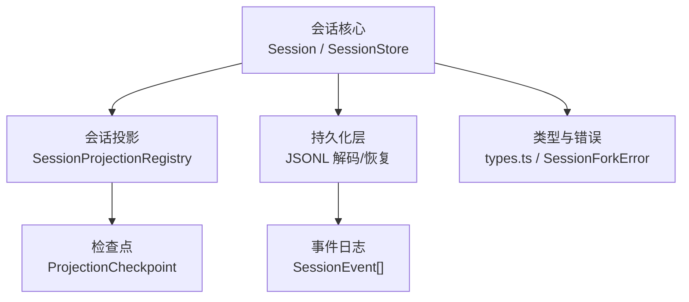
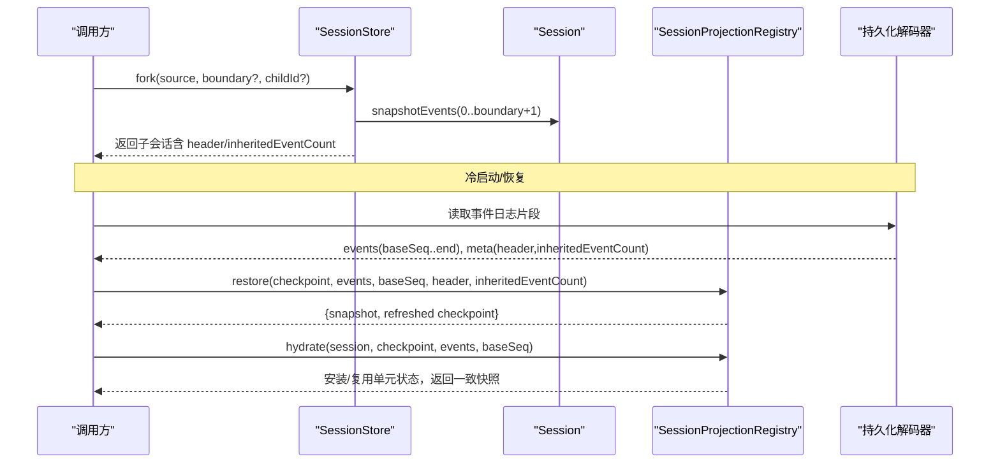
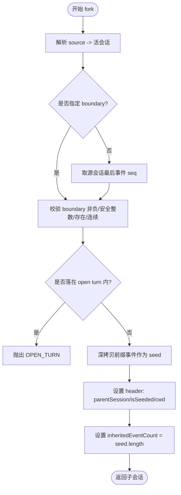
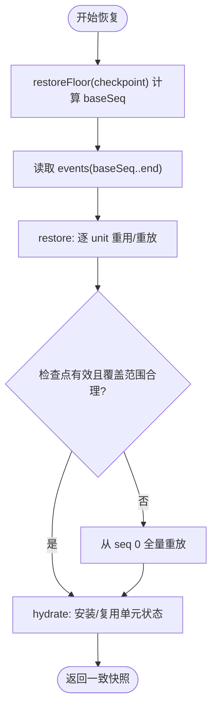
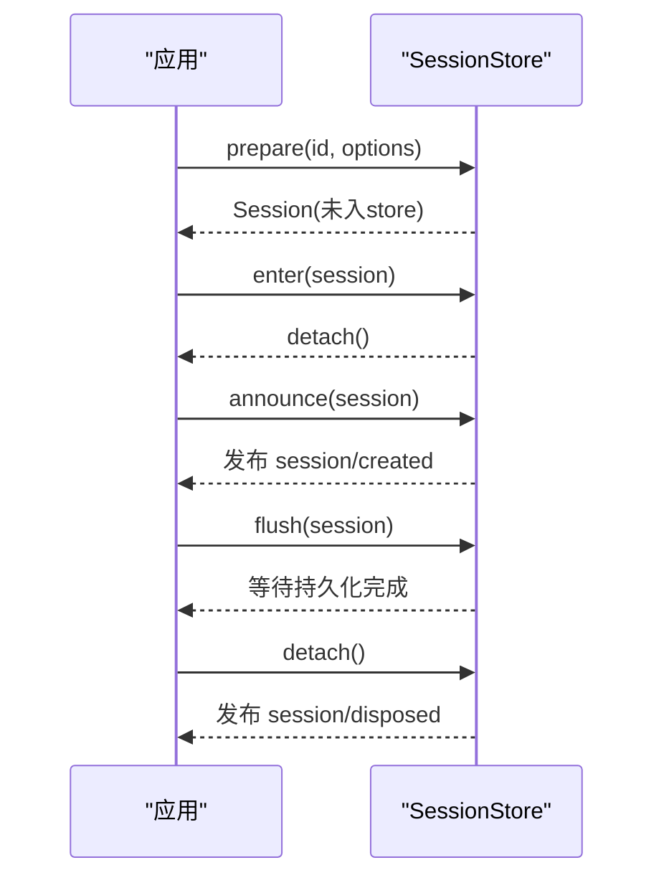
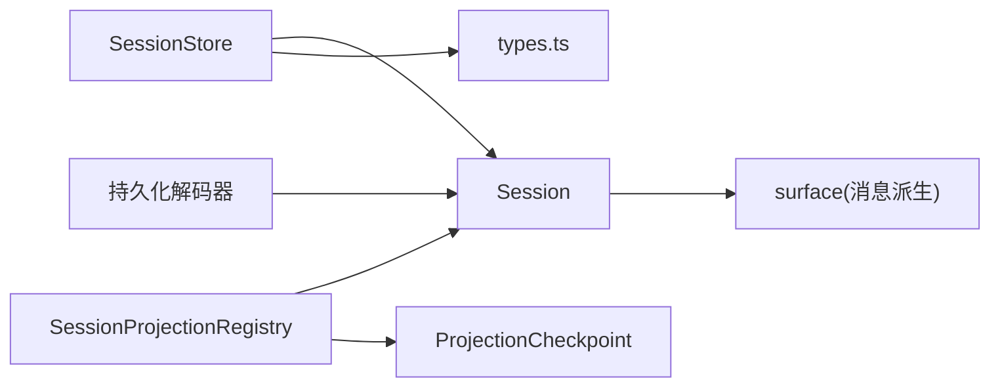

# 分支管理

<cite>
**本文引用的文件**
- [packages/core/session/src/index.ts](file://packages/core/session/src/index.ts)
- [packages/core/session/src/types.ts](file://packages/core/session/src/types.ts)
- [packages/core/session/tests/fork.spec.ts](file://packages/core/session/tests/fork.spec.ts)
- [packages/core/session/tests/session.spec.ts](file://packages/core/session/tests/session.spec.ts)
- [packages/session/session-projection/src/index.ts](file://packages/session/session-projection/src/index.ts)
- [packages/session/session-persistence-jsonl/src/index.ts](file://packages/session/session-persistence-jsonl/src/index.ts)
- [packages/session/session-persistence/src/storage-contract.ts](file://packages/session/session-persistence/src/storage-contract.ts)
</cite>

## 目录
1. [简介](#简介)
2. [项目结构](#项目结构)
3. [核心组件](#核心组件)
4. [架构总览](#架构总览)
5. [详细组件分析](#详细组件分析)
6. [依赖关系分析](#依赖关系分析)
7. [性能考量](#性能考量)
8. [故障排查指南](#故障排查指南)
9. [结论](#结论)
10. [附录：API参考与使用模式](#附录api参考与使用模式)

## 简介
本文件围绕“会话分支管理”展开，系统性说明以下能力：
- 会话克隆与分支机制：基于 SessionForkSource 的 fork API、边界选择策略、版本与继承计数。
- 会话恢复：从事件日志重建会话、断点续传、状态一致性保证（投影检查点 + 冷启动重放）。
- 冲突检测与解决：通过版本比较、可恢复性判定与回退策略保障数据一致性。
- 生命周期管理：创建、激活、休眠、销毁等操作的顺序与约束。
- 代码示例路径：以“章节来源”形式给出关键实现位置，便于快速定位源码。

## 项目结构
与分支管理直接相关的模块与职责：
- 会话核心与会话存储：定义 Session、SessionStore、事件模型、表面（surface）与消息派生。
- 会话投影：将事件流驱动为可持久化的状态快照，提供 restore/checkpoint/hydrate 等冷/热恢复能力。
- 持久化层：读取/解析存储的事件日志，处理压缩、截断、损坏尾部的恢复。
- 类型与错误：SessionId、SessionSeq、SessionLogOffset、SessionHeader、SessionEvent、SessionForkError 等。

**图表来源**
- [packages/core/session/src/index.ts:880-1255](file://packages/core/session/src/index.ts#L880-L1255)
- [packages/session/session-projection/src/index.ts:199-712](file://packages/session/session-projection/src/index.ts#L199-L712)
- [packages/session/session-persistence-jsonl/src/index.ts:481-518](file://packages/session/session-persistence-jsonl/src/index.ts#L481-L518)
- [packages/core/session/src/types.ts:16-128](file://packages/core/session/src/types.ts#L16-L128)

**章节来源**
- [packages/core/session/src/index.ts:880-1255](file://packages/core/session/src/index.ts#L880-L1255)
- [packages/session/session-projection/src/index.ts:199-712](file://packages/session/session-projection/src/index.ts#L199-L712)
- [packages/session/session-persistence-jsonl/src/index.ts:481-518](file://packages/session/session-persistence-jsonl/src/index.ts#L481-L518)
- [packages/core/session/src/types.ts:16-128](file://packages/core/session/src/types.ts#L16-L128)

## 核心组件
- Session：追加式事件日志、有序表面（surface）、消息派生、种子标记（end-seed）、继承计数 inheritedEventCount。
- SessionStore：会话注册表与生命周期（prepare/enter/announce/create），以及 fork 分支入口。
- SessionProjectionRegistry：按单位（unit）驱动的状态机，支持 checkpoint/restore/hydrate/cachedSnapshot/viewCheckpoint。
- 持久化解码器：负责读取 JSONL 或压缩前缀，识别 tornTruncateTo、recoveredTail，并返回稳定快照。

关键要点：
- 分支通过 SessionStore.fork(source, boundary?, childId?) 完成；boundary 为包含式 seq，默认取源会话最后一个事件。
- 子会话 header 记录 parentSession、isSeeded、cwd 继承；inheritedEventCount 精确标识继承前缀长度。
- 恢复流程：restoreFloor → read(events ≥ baseSeq) → restore → hydrate，确保 watermark 一致性与崩溃修复。

**章节来源**
- [packages/core/session/src/index.ts:451-852](file://packages/core/session/src/index.ts#L451-L852)
- [packages/core/session/src/index.ts:1162-1234](file://packages/core/session/src/index.ts#L1162-L1234)
- [packages/session/session-projection/src/index.ts:409-540](file://packages/session/session-projection/src/index.ts#L409-L540)
- [packages/session/session-persistence-jsonl/src/index.ts:481-518](file://packages/session/session-persistence-jsonl/src/index.ts#L481-L518)

## 架构总览
下图展示“分支创建—恢复—投影驱动—持久化”的整体协作关系。

**图表来源**
- [packages/core/session/src/index.ts:1162-1234](file://packages/core/session/src/index.ts#L1162-L1234)
- [packages/session/session-projection/src/index.ts:409-540](file://packages/session/session-projection/src/index.ts#L409-L540)
- [packages/session/session-persistence-jsonl/src/index.ts:481-518](file://packages/session/session-persistence-jsonl/src/index.ts#L481-L518)

## 详细组件分析

### 分支创建与边界选择（fork）
- 输入：SessionForkSource = Session | SessionId；可选 boundary（包含式 seq）；可选 childSessionId。
- 边界校验：
  - 必须是非负安全整数且小于当前会话长度。
  - 边界事件必须存在且连续（索引=seq）。
  - 所选前缀不得结束于未闭合的 turn/start（避免半执行态）。
- 结果：
  - 子会话继承父会话 cwd（若存在），header 中设置 parentSession、isSeeded=true。
  - inheritedEventCount = 复制的前缀长度；构造时会在继承切点追加 session/end-seed（带 inherited 标记）。
- 错误：
  - SESSION_NOT_FOUND / SESSION_NOT_LIVE / SESSION_ALREADY_EXISTS / INVALID_BOUNDARY / OPEN_TURN。

**图表来源**
- [packages/core/session/src/index.ts:1162-1234](file://packages/core/session/src/index.ts#L1162-L1234)
- [packages/core/session/src/index.ts:1193-1234](file://packages/core/session/src/index.ts#L1193-L1234)

**章节来源**
- [packages/core/session/src/index.ts:1162-1234](file://packages/core/session/src/index.ts#L1162-L1234)
- [packages/core/session/tests/fork.spec.ts:60-321](file://packages/core/session/tests/fork.spec.ts#L60-L321)

### 会话恢复与断点续传（restore/hydrate）
- 目标：从持久化事件日志恢复会话状态，并在有检查点的情况下仅回放增量尾部。
- 步骤：
  1) restoreFloor(checkpoint)：计算需要读取的最小 baseSeq（最低可用 watermark 的前一位置）。
  2) 读取 events ≥ baseSeq（由持久化层提供）。
  3) restore(checkpoint, events, baseSeq, header, inheritedEventCount)：对每个 unit 尝试重用检查点行；不可用时从 init 重放；验证 seq 连续性；输出新的 checkpoint 与快照。
  4) hydrate(session, checkpoint, events, baseSeq)：将恢复后的单元状态安装到已 prepare 的 Session 上，后续发布复用这些单元。
- 一致性保证：
  - 检查点行 ver 必须匹配当前 stateVersion。
  - 若检查点声称覆盖到的 seq 超出实际提供的 endSeq（例如崩溃后日志被截断），则强制从 seq 0 全量重放。
  - 恢复过程要求事件 seq 严格连续，缺失即报错。

**图表来源**
- [packages/session/session-projection/src/index.ts:409-540](file://packages/session/session-projection/src/index.ts#L409-L540)
- [packages/session/session-projection/src/index.ts:552-595](file://packages/session/session-projection/src/index.ts#L552-L595)

**章节来源**
- [packages/session/session-projection/src/index.ts:409-540](file://packages/session/session-projection/src/index.ts#L409-L540)
- [packages/session/session-projection/src/index.ts:552-595](file://packages/session/session-projection/src/index.ts#L552-L595)
- [packages/session/session-persistence-jsonl/src/index.ts:481-518](file://packages/session/session-persistence-jsonl/src/index.ts#L481-L518)

### 版本管理与冲突检测
- 格式版本：SESSION_FORMAT_VERSION 用于头信息校验，不兼容版本将被拒绝。
- 投影状态版本：每个 unit 的 stateVersion 用于检查点行有效性判断；版本不匹配则丢弃旧行并重放。
- 冲突场景：
  - 检查点行 seq > 实际 endSeq（日志被截断）→ 触发全量重放。
  - 检查点行 seq < baseSeq-1（早于基线）→ 视为不可用，需重放。
  - 事件序列不连续 → 恢复失败，提示缺失 seq。
- 解决策略：
  - 以“最小必要重放”为原则：尽可能重用检查点，仅在必要时回溯到 init。
  - 当无法局部修复（如截断导致水印失效）时，退回全量重放以保证一致性。

**章节来源**
- [packages/core/session/src/types.ts:64-86](file://packages/core/session/src/types.ts#L64-L86)
- [packages/session/session-projection/src/index.ts:409-540](file://packages/session/session-projection/src/index.ts#L409-L540)
- [packages/session/session-persistence/src/storage-contract.ts:41-53](file://packages/session/session-persistence/src/storage-contract.ts#L41-L53)

### 会话生命周期管理（创建/激活/休眠/销毁）
- 创建：
  - create(id?, options?)：内部调用 prepare + enter + announce，自动进入 store 并发布 session/created。
  - prepare(id?, options?)：仅构建 Session 与 header，不入 store。
- 激活：
  - enter(session)：将 prepare 的会话加入 store，安装发布钩子，返回 detach 释放器。
  - announce(session)：发布 session/created；若监听器抛错，detach 会配对释放，保持原子性。
- 休眠/销毁：
  - detach()：移除 store 条目与发布钩；若已在 announced 阶段，则发出 session/disposed。
  - flush(session)：触发 session/flush 并行持久化检查点，等待所有监听器完成。
- 约束：
  - 同一会话对象不能同时 attach 到多个 store。
  - 重复 announce 会被拒绝，保证一对 created/disposed 的生命周期。

**图表来源**
- [packages/core/session/src/index.ts:925-1091](file://packages/core/session/src/index.ts#L925-L1091)
- [packages/core/session/src/index.ts:1117-1134](file://packages/core/session/src/index.ts#L1117-L1134)

**章节来源**
- [packages/core/session/src/index.ts:925-1091](file://packages/core/session/src/index.ts#L925-L1091)
- [packages/core/session/tests/session.spec.ts:1305-1411](file://packages/core/session/tests/session.spec.ts#L1305-L1411)

## 依赖关系分析
- SessionStore 依赖 Session 的 append/snapshot 能力，并通过 surface 管理消息派生。
- SessionProjectionRegistry 订阅 session/event，驱动各 unit 的 apply，维护 per-session 单元状态与视图。
- 持久化层提供事件读取与损坏恢复，供上层进行 restore/hydrate。
- 类型系统确保事件 envelope、header、surfaceOp 的一致性，防止非法状态进入日志。

**图表来源**
- [packages/core/session/src/index.ts:880-1255](file://packages/core/session/src/index.ts#L880-L1255)
- [packages/session/session-projection/src/index.ts:199-712](file://packages/session/session-projection/src/index.ts#L199-L712)
- [packages/core/session/src/types.ts:16-128](file://packages/core/session/src/types.ts#L16-L128)

**章节来源**
- [packages/core/session/src/index.ts:880-1255](file://packages/core/session/src/index.ts#L880-L1255)
- [packages/session/session-projection/src/index.ts:199-712](file://packages/session/session-projection/src/index.ts#L199-L712)
- [packages/core/session/src/types.ts:16-128](file://packages/core/session/src/types.ts#L16-L128)

## 性能考量
- 分支创建：仅复制选定前缀事件，避免全量拷贝；冻结数据保证不可变与共享。
- 消息派生：基于 surface 节点缓存，增量更新 O(新节点数)，replace 时重建。
- 投影驱动：懒加载单元 cell，首次访问才折叠历史；变更时按 Object.is 比较视图，减少通知开销。
- 恢复优化：优先重用检查点行，仅回放增量尾部；在日志截断时回退到全量重放，保证正确性。

[本节为通用性能讨论，不直接分析具体文件]

## 故障排查指南
- 分支边界错误：
  - 现象：INVALID_BOUNDARY / OPEN_TURN。
  - 排查：确认 boundary 是否为合法 seq、是否存在、是否处于 open turn 内。
  - 参考：[packages/core/session/src/index.ts:1193-1234](file://packages/core/session/src/index.ts#L1193-L1234)
- 恢复失败：
  - 现象：restore 抛出“无法从某 seq 恢复/缺失 seq/需从 seq 0 重读”。
  - 排查：检查检查点 ver 是否匹配、seq 是否在 baseSeq 范围内、日志是否完整连续。
  - 参考：[packages/session/session-projection/src/index.ts:471-540](file://packages/session/session-projection/src/index.ts#L471-L540)
- 持久化版本不兼容：
  - 现象：不支持的格式版本被拒绝。
  - 排查：确认 SESSION_FORMAT_VERSION 与存储头一致。
  - 参考：[packages/session/session-persistence/src/storage-contract.ts:41-53](file://packages/session/session-persistence/src/storage-contract.ts#L41-L53)
- 生命周期异常：
  - 现象：重复 announce、重复 attach、创建后未发布等。
  - 排查：遵循 prepare→enter→announce 顺序，确保 detach 配对释放。
  - 参考：[packages/core/session/tests/session.spec.ts:1305-1411](file://packages/core/session/tests/session.spec.ts#L1305-L1411)

**章节来源**
- [packages/core/session/src/index.ts:1193-1234](file://packages/core/session/src/index.ts#L1193-L1234)
- [packages/session/session-projection/src/index.ts:471-540](file://packages/session/session-projection/src/index.ts#L471-L540)
- [packages/session/session-persistence/src/storage-contract.ts:41-53](file://packages/session/session-persistence/src/storage-contract.ts#L41-L53)
- [packages/core/session/tests/session.spec.ts:1305-1411](file://packages/core/session/tests/session.spec.ts#L1305-L1411)

## 结论
- 分支管理以“事件溯源 + 有序表面 + 投影状态”为核心，确保可复现、可恢复、可扩展。
- fork 提供安全的分支边界选择与继承语义；restore/hydrate 提供稳健的断点续传与一致性保证。
- 通过严格的版本控制与检查点校验，系统在崩溃/截断场景下仍能回到一致状态。
- 生命周期管理确保创建/激活/销毁的原子性与幂等性，避免资源泄漏与竞态。

[本节为总结性内容，不直接分析具体文件]

## 附录：API参考与使用模式

### 分支相关 API
- SessionStore.fork(source, boundary?, childSessionId?)
  - 作用：基于源会话的稳定前缀创建子会话。
  - 关键点：boundary 为包含式 seq；默认取最后事件；禁止 open turn 结尾；子会话继承 cwd、parentSession、isSeeded。
  - 参考：[packages/core/session/src/index.ts:1162-1234](file://packages/core/session/src/index.ts#L1162-L1234)

### 恢复相关 API
- SessionProjectionRegistry.restoreFloor(checkpoint)
  - 作用：计算需要读取的最小 baseSeq。
  - 参考：[packages/session/session-projection/src/index.ts:409-435](file://packages/session/session-projection/src/index.ts#L409-L435)
- SessionProjectionRegistry.restore(checkpoint, events, baseSeq, header, inheritedEventCount)
  - 作用：冷启动重放，产出快照与刷新后的检查点。
  - 参考：[packages/session/session-projection/src/index.ts:471-540](file://packages/session/session-projection/src/index.ts#L471-L540)
- SessionProjectionRegistry.hydrate(session, checkpoint, events, baseSeq)
  - 作用：将恢复结果安装到已 prepare 的 Session，后续发布复用单元。
  - 参考：[packages/session/session-projection/src/index.ts:552-595](file://packages/session/session-projection/src/index.ts#L552-L595)

### 生命周期相关 API
- SessionStore.prepare(id?, options?)
  - 作用：构建 Session 与 header，不入 store。
  - 参考：[packages/core/session/src/index.ts:938-984](file://packages/core/session/src/index.ts#L938-L984)
- SessionStore.enter(session)
  - 作用：将会话加入 store，安装发布钩子，返回 detach。
  - 参考：[packages/core/session/src/index.ts:986-1042](file://packages/core/session/src/index.ts#L986-L1042)
- SessionStore.announce(session)
  - 作用：发布 session/created，支持回滚与幂等保护。
  - 参考：[packages/core/session/src/index.ts:1056-1091](file://packages/core/session/src/index.ts#L1056-L1091)
- SessionStore.flush(session)
  - 作用：触发 session/flush 持久化检查点。
  - 参考：[packages/core/session/src/index.ts:1104-1134](file://packages/core/session/src/index.ts#L1104-L1134)

### 使用模式示例（以“章节来源”代替代码）
- 创建分支：
  - 参考：[packages/core/session/tests/fork.spec.ts:60-114](file://packages/core/session/tests/fork.spec.ts#L60-L114)
- 恢复会话：
  - 参考：[packages/session/session-projection/src/index.ts:471-540](file://packages/session/session-projection/src/index.ts#L471-L540)
- 处理冲突（检查点无效/日志截断）：
  - 参考：[packages/session/session-projection/src/index.ts:471-540](file://packages/session/session-projection/src/index.ts#L471-L540)
- 管理生命周期：
  - 参考：[packages/core/session/tests/session.spec.ts:1305-1411](file://packages/core/session/tests/session.spec.ts#L1305-L1411)