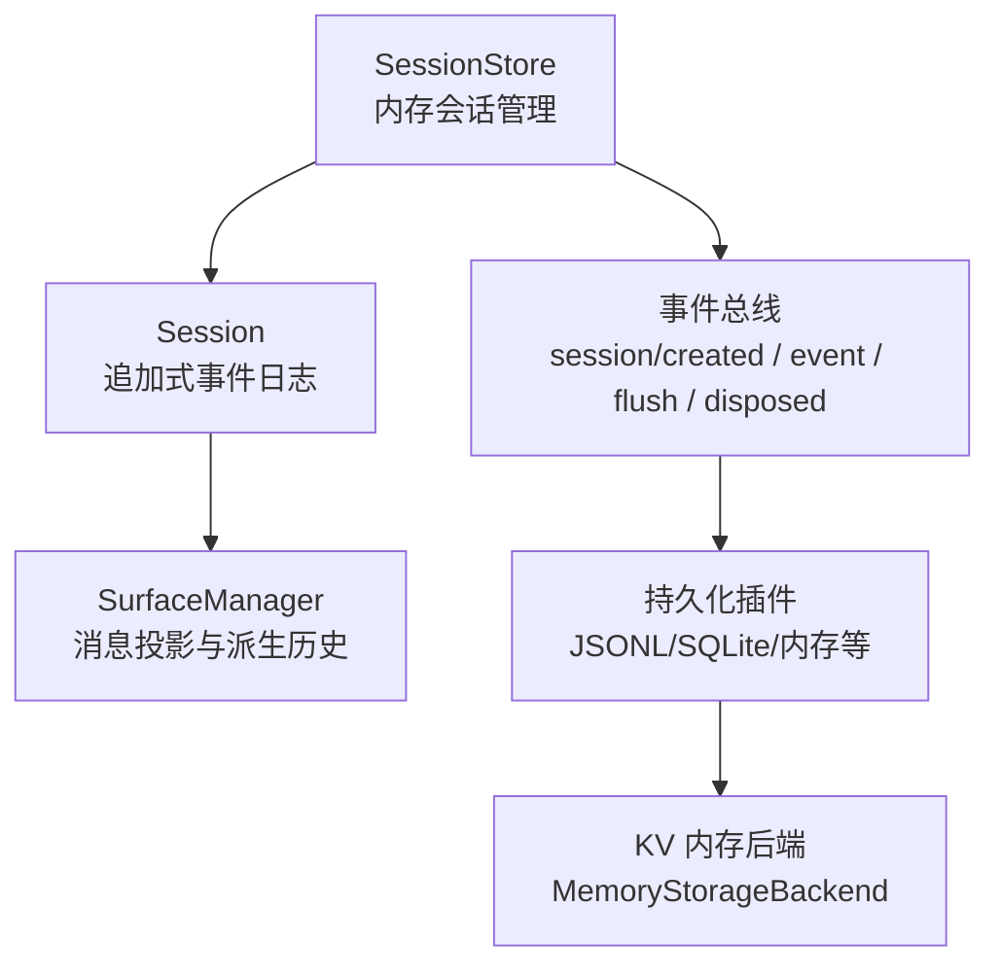
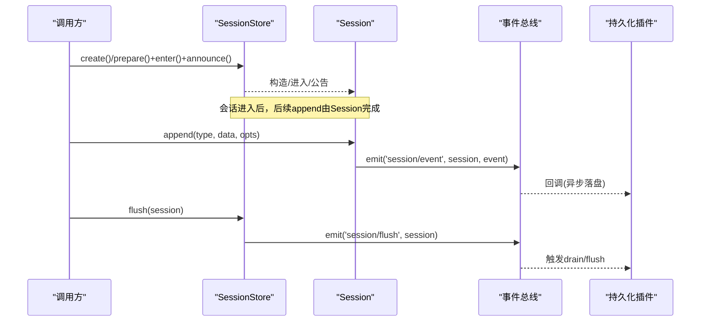
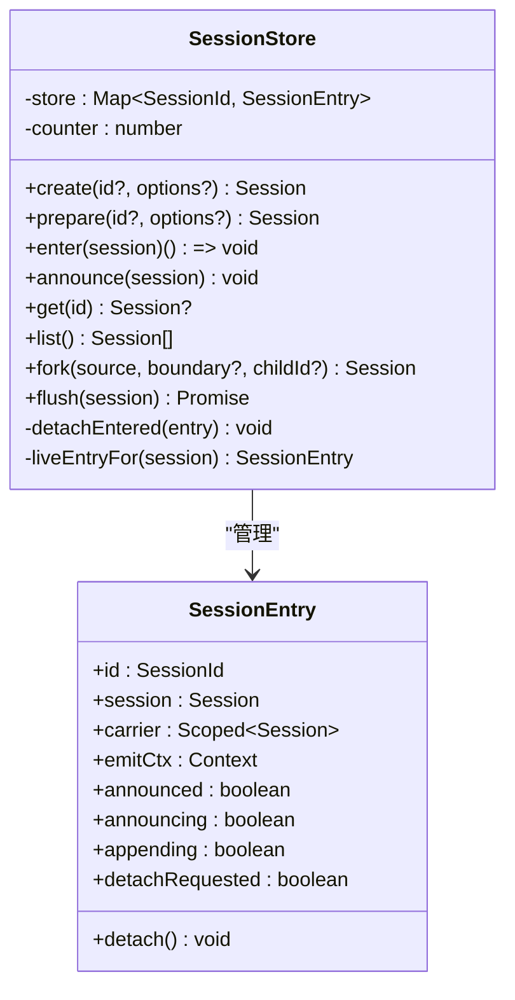
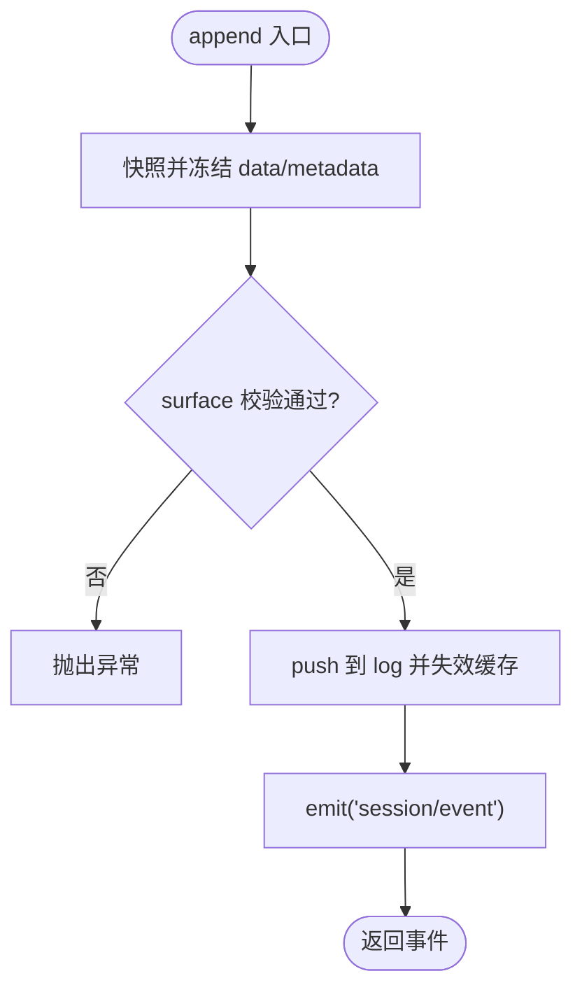
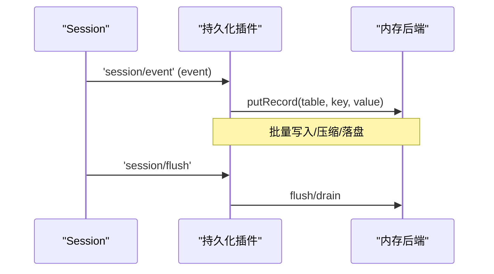
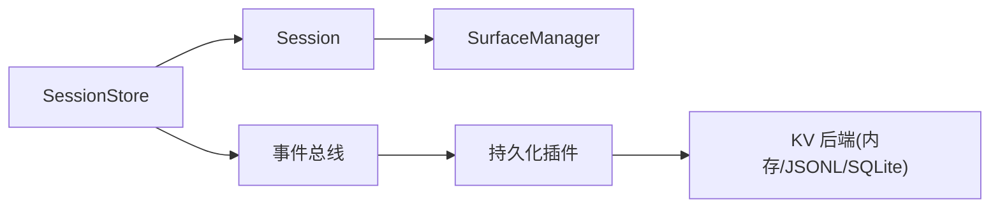

# 内存存储实现

<cite>
**本文引用的文件**
- [packages/core/session/src/index.ts](file://packages/core/session/src/index.ts)
- [packages/storage/storage-domain/tests/helpers/memory-backend.ts](file://packages/storage/storage-domain/tests/helpers/memory-backend.ts)
- [packages/session-query/session-query-sqlite/tests/sqlite.spec.ts](file://packages/session-query/session-query-sqlite/tests/sqlite.spec.ts)
- [packages/feedback/message-feedback/tests/helpers.ts](file://packages/feedback/message-feedback/tests/helpers.ts)
- [packages/session/session-persistence-jsonl/src/index.ts](file://packages/session/session-persistence-jsonl/src/index.ts)
- [packages/session/session-persistence/src/storage-contract.ts](file://packages/session/session-persistence/src/storage-contract.ts)
</cite>

## 目录
1. [简介](#简介)
2. [项目结构](#项目结构)
3. [核心组件](#核心组件)
4. [架构总览](#架构总览)
5. [详细组件分析](#详细组件分析)
6. [依赖关系分析](#依赖关系分析)
7. [性能考量](#性能考量)
8. [故障排查指南](#故障排查指南)
9. [结论](#结论)
10. [附录：API参考与示例路径](#附录api参考与示例路径)

## 简介
本文件聚焦“内存存储实现”，围绕会话的创建、存储、查询与删除，深入解析 SessionStore 类的设计与行为，以及 SessionEntry 的内部状态机。同时说明会话 ID 生成机制、会话状态维护、事件日志的内存布局与追加式日志的实现原理（数组存储、索引机制、缓存策略）。文末提供 API 参考与性能优化建议，帮助开发者高效使用并扩展该内存存储子系统。

## 项目结构
- 会话核心在 packages/core/session/src/index.ts 中实现，包含 Session 与 SessionStore 两类关键类型与逻辑。
- 内存持久化后端在 packages/storage/storage-domain/tests/helpers/memory-backend.ts 中提供，用于测试与演示 KV 型内存存储。
- 其他测试中的“内存式”持久化契约与行为可参考 sqlite 与 message-feedback 的测试辅助实现，体现 append/flush/close/stat/list 等接口约定。
- 持久化插件通过订阅 session/event 与 session/flush 事件进行异步落盘，确保热路径不阻塞。

图表来源
- [packages/core/session/src/index.ts:887-1255](file://packages/core/session/src/index.ts#L887-L1255)
- [packages/storage/storage-domain/tests/helpers/memory-backend.ts:117-160](file://packages/storage/storage-domain/tests/helpers/memory-backend.ts#L117-L160)

章节来源
- [packages/core/session/src/index.ts:887-1255](file://packages/core/session/src/index.ts#L887-L1255)
- [packages/storage/storage-domain/tests/helpers/memory-backend.ts:117-160](file://packages/storage/storage-domain/tests/helpers/memory-backend.ts#L117-L160)

## 核心组件
- SessionStore：内存会话仓库，负责会话生命周期（prepare/enter/announce）、查找（get/list）、派生（fork）与刷新（flush）。
- Session：追加式事件日志容器，维护不可变头信息、序列号、表面投影与派生消息缓存。
- SessionEntry：会话在 Store 中的内部条目，封装附加状态（是否已公告、是否正在公告或追加、分离请求等），并通过 WeakMap 与 Session 实例关联。
- SurfaceManager：基于 surfaceOp 标记维护有序的消息节点序列，支持增量派生与替换重建。
- 持久化插件：订阅 session/event 与 session/flush，将事件写入后端（如 JSONL、SQLite、内存等）。

章节来源
- [packages/core/session/src/index.ts:427-441](file://packages/core/session/src/index.ts#L427-L441)
- [packages/core/session/src/index.ts:451-852](file://packages/core/session/src/index.ts#L451-L852)
- [packages/core/session/src/index.ts:887-1255](file://packages/core/session/src/index.ts#L887-L1255)

## 架构总览
会话系统采用“事件溯源 + 内存追加日志 + 派生视图”的架构：
- 所有变更以不可变事件追加到 Session.log，保证顺序一致性与可重放性。
- SurfaceManager 根据 surfaceOp 维护消息节点的有序序列，deriveMessages 按需增量构建派生历史。
- SessionStore 作为内存注册中心，管理会话的进入、公告、分离与刷新；持久化插件通过事件总线异步消费。

图表来源
- [packages/core/session/src/index.ts:925-936](file://packages/core/session/src/index.ts#L925-L936)
- [packages/core/session/src/index.ts:699-749](file://packages/core/session/src/index.ts#L699-L749)
- [packages/core/session/src/index.ts:1117-1134](file://packages/core/session/src/index.ts#L1117-L1134)

## 详细组件分析

### SessionStore：内存会话仓库
- 会话创建与ID生成
  - 未指定 id 时，按自增计数器生成 session-<n> 形式的唯一标识，避免冲突。
  - 支持传入元数据（cwd、parentSession、isSeeded、origin、delegationDepth、agentPreset），并校验为不可变 JSON 记录。
- 生命周期管理
  - prepare：仅构造 Session，不入 store。
  - enter：安装发布钩子，加入 store，返回 detach 析构器；若处于公告或追加中，延迟分离直到同步边界结束。
  - announce：仅一次公告，抛出重复公告错误；失败回滚会触发配对释放。
  - get/list：查询当前存活会话。
  - fork：从源会话前缀派生子会话，校验边界与开轮保护，设置 inheritedEventCount。
  - flush：统一入口派发 session/flush，聚合监听结果，首个失败即抛出。
- 并发与一致性
  - 通过 appending/announcing/detachRequested 标志位保证同一会话的追加与公告互斥，且分离操作在安全边界内执行。
  - 使用 WeakMap 将 Session 与其内部条目关联，避免外部持有导致泄漏。

图表来源
- [packages/core/session/src/index.ts:887-1255](file://packages/core/session/src/index.ts#L887-L1255)
- [packages/core/session/src/index.ts:427-441](file://packages/core/session/src/index.ts#L427-L441)

章节来源
- [packages/core/session/src/index.ts:925-984](file://packages/core/session/src/index.ts#L925-L984)
- [packages/core/session/src/index.ts:1008-1091](file://packages/core/session/src/index.ts#L1008-L1091)
- [packages/core/session/src/index.ts:1117-1134](file://packages/core/session/src/index.ts#L1117-L1134)
- [packages/core/session/src/index.ts:1176-1249](file://packages/core/session/src/index.ts#L1176-L1249)

### Session：追加式事件日志与派生历史
- 内存布局
  - log：SessionEvent[]，严格连续 seq=索引，追加即提交。
  - eventsSnapshot：全量快照缓存，下次 append 失效。
  - derived：派生消息缓存，按 surface 节点增量构建。
  - headerFold/contextFold：对 request/header、request/context 的增量折叠缓存。
- 事件追加
  - append 先深拷贝并冻结 data 与 surface metadata，再验证 surface 约束，最后 push 入 log 并广播 session/event。
  - 禁止重入追加，防止并发竞争。
- 查询与派生
  - eventAt/snapshotEvents/ownEvents/isOwnSeq：精确访问与范围切片。
  - deriveMessages：基于 surface.nodes 增量投影，返回新数组但 Message 对象共享且冻结。
- 种子与恢复
  - fromRestore/snapshot：校验 seed 的连续性、形状与 JSON 可序列化性，必要时插入 end-seed 标记。

图表来源
- [packages/core/session/src/index.ts:699-749](file://packages/core/session/src/index.ts#L699-L749)
- [packages/core/session/src/index.ts:610-661](file://packages/core/session/src/index.ts#L610-L661)
- [packages/core/session/src/index.ts:820-841](file://packages/core/session/src/index.ts#L820-L841)

章节来源
- [packages/core/session/src/index.ts:451-852](file://packages/core/session/src/index.ts#L451-L852)

### SessionEntry：内部状态机
- 字段
  - announced/announcing/appending/detachRequested：控制公告与追加的生命周期与分离时机。
  - carrier/emitCtx：用于作用域过滤的事件派发上下文。
- 行为
  - 在 append 期间阻止分离，在 announce 期间阻止分离，直至同步边界结束。
  - 分离时清理 store 与 attachments，并在已公告情况下触发 session/disposed。

章节来源
- [packages/core/session/src/index.ts:427-441](file://packages/core/session/src/index.ts#L427-L441)
- [packages/core/session/src/index.ts:1029-1054](file://packages/core/session/src/index.ts#L1029-L1054)

### 持久化与内存后端
- 事件流
  - 持久化插件订阅 session/event，将事件入队异步写入；session/flush 触发 drain/flush。
  - 关闭时确保缓冲事件排空后再关闭句柄。
- 内存后端
  - MemoryStorageBackend 提供 kv.open/putRecord/deleteRecord/setGlobal/close 等能力，适合测试与轻量场景。
- 追加连续性校验
  - 持久化层需保证事件 seq 连续，否则拒绝批次。

图表来源
- [packages/session/session-persistence-jsonl/src/index.ts:979-1005](file://packages/session/session-persistence-jsonl/src/index.ts#L979-L1005)
- [packages/storage/storage-domain/tests/helpers/memory-backend.ts:82-109](file://packages/storage/storage-domain/tests/helpers/memory-backend.ts#L82-L109)
- [packages/session/session-persistence/src/storage-contract.ts:139-151](file://packages/session/session-persistence/src/storage-contract.ts#L139-L151)

章节来源
- [packages/session/session-persistence-jsonl/src/index.ts:979-1005](file://packages/session/session-persistence-jsonl/src/index.ts#L979-L1005)
- [packages/storage/storage-domain/tests/helpers/memory-backend.ts:117-160](file://packages/storage/storage-domain/tests/helpers/memory-backend.ts#L117-L160)
- [packages/session/session-persistence/src/storage-contract.ts:139-151](file://packages/session/session-persistence/src/storage-contract.ts#L139-L151)

## 依赖关系分析
- SessionStore 依赖 Session 与事件总线；Session 依赖 SurfaceManager 与 LLM 消息派生工具。
- 持久化插件依赖事件总线与具体后端（JSONL/SQLite/内存等）。
- 内存后端提供 KV 抽象，被上层持久化实现复用。

图表来源
- [packages/core/session/src/index.ts:887-1255](file://packages/core/session/src/index.ts#L887-L1255)
- [packages/storage/storage-domain/tests/helpers/memory-backend.ts:117-160](file://packages/storage/storage-domain/tests/helpers/memory-backend.ts#L117-L160)

章节来源
- [packages/core/session/src/index.ts:887-1255](file://packages/core/session/src/index.ts#L887-L1255)
- [packages/storage/storage-domain/tests/helpers/memory-backend.ts:117-160](file://packages/storage/storage-domain/tests/helpers/memory-backend.ts#L117-L160)

## 性能考量
- 追加路径零 I/O：append 仅做内存操作与事件广播，I/O 由插件异步处理。
- 派生历史增量构建：deriveMessages 仅对新节点计算，避免全量重建。
- 快照与冻结：eventsSnapshot 与 deepFreeze 减少复制与意外修改成本。
- 头部折叠缓存：requestHeader/requestContext 增量折叠，降低重复扫描开销。
- 内存后端：kv.putRecord 直接映射到 Map/Set，适合高吞吐测试与小型工作负载。

[本节为通用性能讨论，无需特定文件引用]

## 故障排查指南
- 重复公告/重复附加
  - 现象：抛出“已公告/已附加”错误。
  - 原因：多次 announce 或将同一 Session 附加到多个 Store。
  - 定位：检查 SessionStore.enter/announce 调用链。
- 非 JSON 可序列化数据
  - 现象：append 抛出“非 JSON 可序列化”。
  - 原因：data 中包含 BigInt、函数、Symbol、undefined、循环引用等。
  - 定位：检查事件 data 与 surface metadata。
- 持久化 seq 不连续
  - 现象：持久化层拒绝批次。
  - 原因：事件 seq 不满足连续递增。
  - 定位：检查事件生成与批处理逻辑。
- 资源未释放
  - 现象：内存占用增长。
  - 原因：未调用 detach/flush/close。
  - 定位：确认 effect 生命周期与 dispose 调用。

章节来源
- [packages/core/session/src/index.ts:1063-1091](file://packages/core/session/src/index.ts#L1063-L1091)
- [packages/core/session/src/index.ts:699-749](file://packages/core/session/src/index.ts#L699-L749)
- [packages/session/session-persistence/src/storage-contract.ts:139-151](file://packages/session/session-persistence/src/storage-contract.ts#L139-L151)

## 结论
该内存存储实现以事件溯源为核心，通过 SessionStore 管理会话生命周期，Session 维护追加式日志与派生历史，配合事件总线与持久化插件实现解耦与可扩展性。其设计在保证一致性的同时，提供了高性能的内存路径与灵活的持久化策略。对于需要快速迭代与测试的场景，内存后端足以胜任；生产环境可通过 JSONL/SQLite 等后端获得更强的可靠性与可观测性。

## 附录：API参考与示例路径
- 创建会话
  - 便捷创建：ctx.sessions.create(id?, options?)
  - 分步创建：prepare -> enter -> announce
  - 示例路径：[packages/core/session/src/index.ts:925-936](file://packages/core/session/src/index.ts#L925-L936), [packages/core/session/src/index.ts:958-984](file://packages/core/session/src/index.ts#L958-L984)
- 存储事件
  - session.append(type, data, opts)
  - 示例路径：[packages/core/session/src/index.ts:699-749](file://packages/core/session/src/index.ts#L699-L749)
- 查询历史
  - session.eventAt(seq)、session.snapshotEvents(from,to)、session.ownEvents()
  - 示例路径：[packages/core/session/src/index.ts:610-661](file://packages/core/session/src/index.ts#L610-L661)
- 派生消息
  - session.deriveMessages()
  - 示例路径：[packages/core/session/src/index.ts:820-841](file://packages/core/session/src/index.ts#L820-L841)
- 刷新与关闭
  - ctx.sessions.flush(session)
  - 持久化插件的 drain/flush/close
  - 示例路径：[packages/core/session/src/index.ts:1117-1134](file://packages/core/session/src/index.ts#L1117-L1134), [packages/session/session-persistence-jsonl/src/index.ts:979-1005](file://packages/session/session-persistence-jsonl/src/index.ts#L979-L1005)
- 内存后端使用
  - MemoryStorageBackend.kv.open/putRecord/deleteRecord/close
  - 示例路径：[packages/storage/storage-domain/tests/helpers/memory-backend.ts:117-160](file://packages/storage/storage-domain/tests/helpers/memory-backend.ts#L117-L160)
- 测试中的内存式持久化契约
  - 示例：sqlite 与 message-feedback 测试中的 create/open/stat/list/append/flush/close
  - 示例路径：[packages/session-query/session-query-sqlite/tests/sqlite.spec.ts:155-181](file://packages/session-query/session-query-sqlite/tests/sqlite.spec.ts#L155-L181), [packages/feedback/message-feedback/tests/helpers.ts:118-147](file://packages/feedback/message-feedback/tests/helpers.ts#L118-L147)