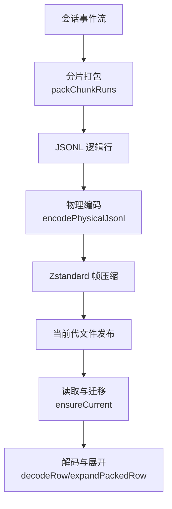
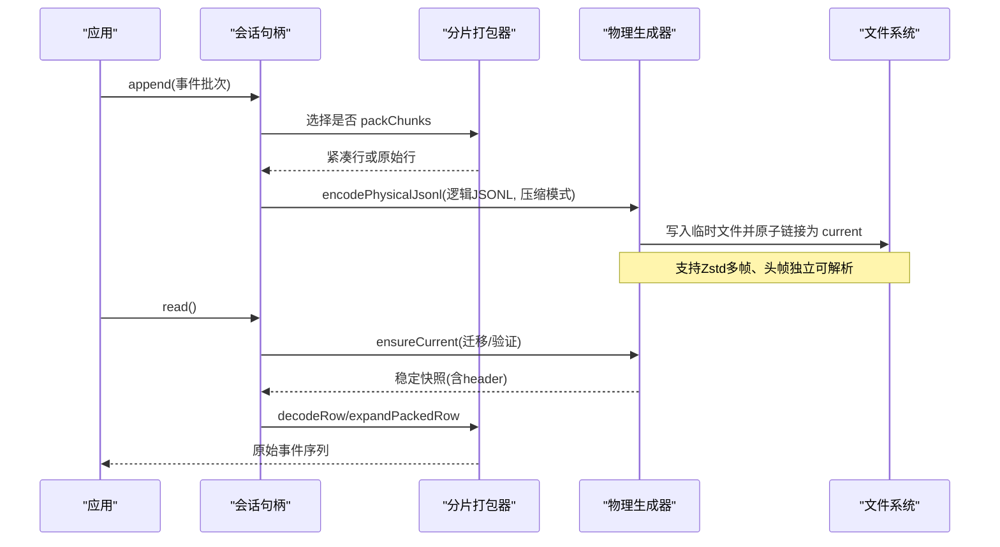
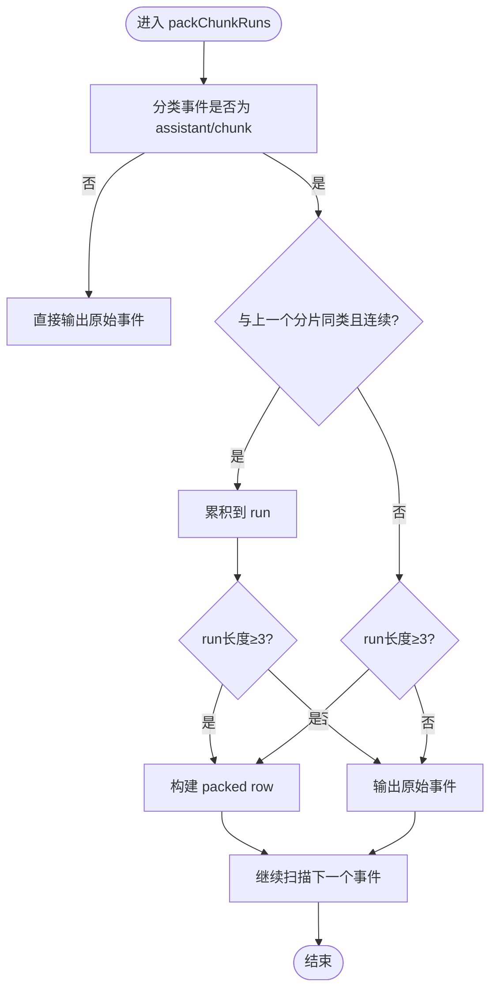
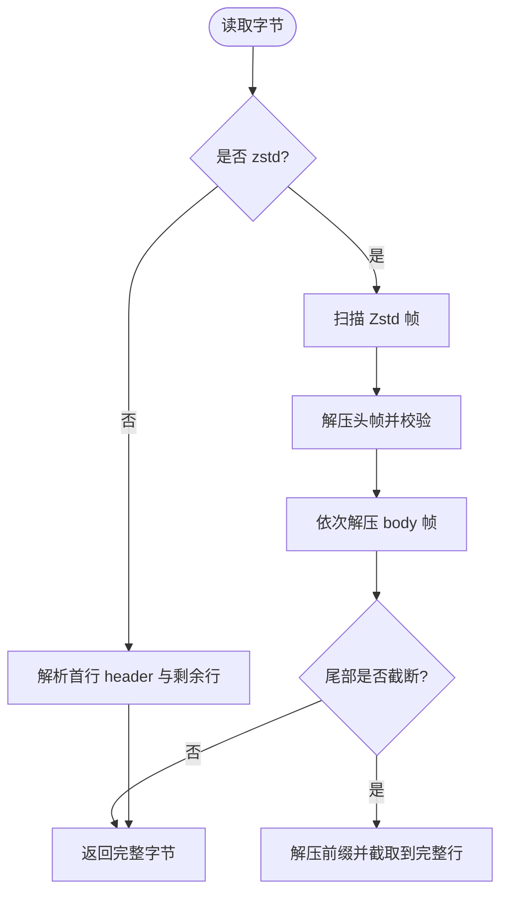
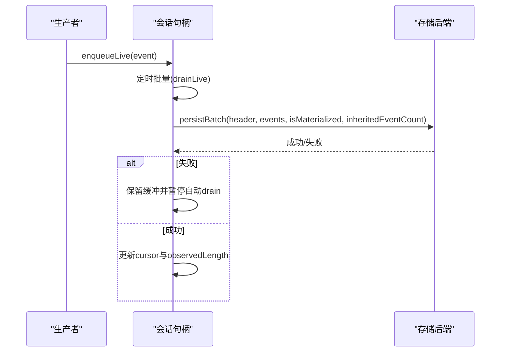
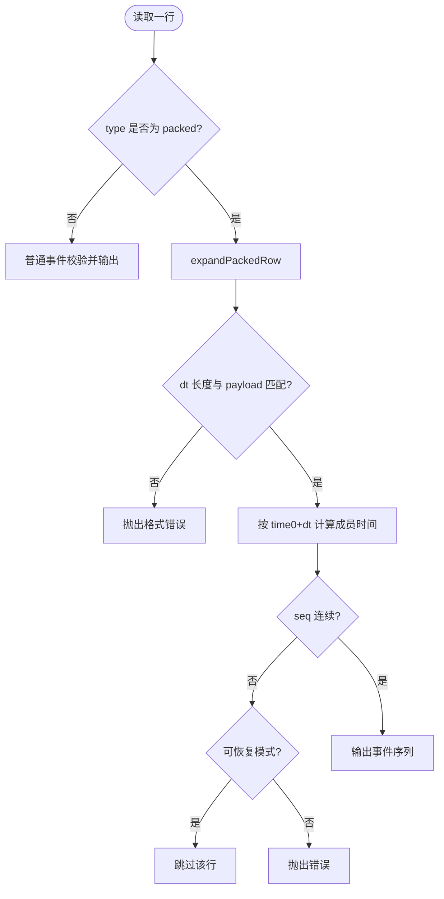
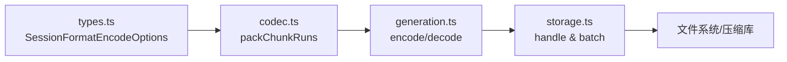

# 分片存储机制

<cite>
**本文引用的文件**
- [packages/session/session-format-v0-to-v1/src/codec.ts](file://packages/session/session-format-v0-to-v1/src/codec.ts)
- [packages/session/session-persistence-jsonl/src/storage.ts](file://packages/session/session-persistence-jsonl/src/storage.ts)
- [packages/session/session-persistence-jsonl/src/generation.ts](file://packages/session/session-persistence-jsonl/src/generation.ts)
- [packages/session/session-format/src/types.ts](file://packages/session/session-format/src/types.ts)
- [packages/test-support/session-snapshot/src/suite.ts](file://packages/test-support/session-snapshot/src/suite.ts)
- [packages/test-support/session-snapshot/src/session-files.ts](file://packages/test-support/session-snapshot/src/session-files.ts)
</cite>

## 目录
1. [简介](#简介)
2. [项目结构](#项目结构)
3. [核心组件](#核心组件)
4. [架构总览](#架构总览)
5. [详细组件分析](#详细组件分析)
6. [依赖关系分析](#依赖关系分析)
7. [性能考量](#性能考量)
8. [故障排除指南](#故障排除指南)
9. [结论](#结论)
10. [附录：示例与最佳实践](#附录示例与最佳实践)

## 简介
本文件系统性阐述会话分片存储机制，聚焦 chunk-rows（分片行）的设计与实现。内容涵盖：
- 大会话的分片策略与打包算法
- 数据压缩与物理格式设计
- ChunkRow 结构体定义、边界计算、元数据管理与版本兼容
- packChunkRuns 的合并与打包逻辑
- decodeStorageRecord 的解码、完整性校验与错误处理
- 读取与恢复流程
- 最佳实践与故障排除

## 项目结构
围绕分片存储的关键模块分布在 session-format 系列与 JSONL 持久化层：
- 格式编解码与分片打包：session-format-v0-to-v1/codec.ts
- 物理 JSONL 生成、压缩与回滚：session-persistence-jsonl/generation.ts
- 会话句柄与写入批处理：session-persistence-jsonl/storage.ts
- 通用类型与编码选项：session-format/types.ts
- 测试辅助与文件名约定：test-support/session-snapshot/*

图表来源
- [packages/session/session-format-v0-to-v1/src/codec.ts:315-412](file://packages/session/session-format-v0-to-v1/src/codec.ts#L315-L412)
- [packages/session/session-persistence-jsonl/src/generation.ts:395-406](file://packages/session/session-persistence-jsonl/src/generation.ts#L395-L406)
- [packages/session/session-persistence-jsonl/src/generation.ts:658-758](file://packages/session/session-persistence-jsonl/src/generation.ts#L658-L758)

章节来源
- [packages/session/session-format-v0-to-v1/src/codec.ts:1-417](file://packages/session/session-format-v0-to-v1/src/codec.ts#L1-L417)
- [packages/session/session-persistence-jsonl/src/generation.ts:1-784](file://packages/session/session-persistence-jsonl/src/generation.ts#L1-L784)
- [packages/session/session-persistence-jsonl/src/storage.ts:1-534](file://packages/session/session-persistence-jsonl/src/storage.ts#L1-L534)
- [packages/session/session-format/src/types.ts:1-151](file://packages/session/session-format/src/types.ts#L1-L151)

## 核心组件
- 分片打包器：将连续的 assistant/chunk 事件聚合成紧凑的 text-chunks/reasoning-chunks/tool-call-chunks 记录，减少行数并提升压缩率。
- 物理编码器：将逻辑 JSONL 转换为带独立头帧与可选 body 帧的 Zstandard 流，支持截断恢复。
- 会话句柄：负责追加、刷新、关闭时的缓冲与批处理，保证顺序与幂等性。
- 类型契约：定义 SessionFormatEncodeOptions.packChunks 控制是否启用分片打包。

章节来源
- [packages/session/session-format-v0-to-v1/src/codec.ts:315-412](file://packages/session/session-format-v0-to-v1/src/codec.ts#L315-L412)
- [packages/session/session-persistence-jsonl/src/generation.ts:395-406](file://packages/session/session-persistence-jsonl/src/generation.ts#L395-L406)
- [packages/session/session-persistence-jsonl/src/storage.ts:117-178](file://packages/session/session-persistence-jsonl/src/storage.ts#L117-L178)
- [packages/session/session-format/src/types.ts:80-89](file://packages/session/session-format/src/types.ts#L80-L89)

## 架构总览
分片存储贯穿“事件→分片→物理编码→落盘→读取→解码→还原”的完整链路：
- 写入路径：事件流经分片打包器压缩为紧凑行，再经 JSONL 编码与 Zstd 压缩后以原子方式发布到当前代文件。
- 读取路径：从当前代或历史代读取稳定快照，解析头部，必要时进行迁移；对分片行进行解码展开为原始事件序列。

图表来源
- [packages/session/session-persistence-jsonl/src/storage.ts:153-178](file://packages/session/session-persistence-jsonl/src/storage.ts#L153-L178)
- [packages/session/session-persistence-jsonl/src/generation.ts:658-758](file://packages/session/session-persistence-jsonl/src/generation.ts#L658-L758)
- [packages/session/session-format-v0-to-v1/src/codec.ts:150-206](file://packages/session/session-format-v0-to-v1/src/codec.ts#L150-L206)

## 详细组件分析

### 分片打包器与 ChunkRow 结构
- 触发条件：assistant/chunk 事件连续出现且满足同 turn/step/index/time 连续性时，按类型归类为 text-delta、reasoning-delta 或 tool-call-delta。
- 合并阈值：连续同类分片达到至少 3 条时打包为一行，否则保持原始行，避免过度聚合导致随机访问成本上升。
- 打包产物：text-chunks / reasoning-chunks / tool-call-chunks，包含 seq0、time0、data 字段：
  - data.turn / step / index：定位所属对话轮次与索引
  - data.dt：相邻成员时间差数组（长度 = texts/args 长度 - 1）
  - data.texts 或 data.args：分片文本或参数增量
- 兼容性：解码侧 expandPackedRow 严格校验 dt 长度与 payload 一致，并按 time0 + dt 累加还原每个成员时间戳。

图表来源
- [packages/session/session-format-v0-to-v1/src/codec.ts:315-341](file://packages/session/session-format-v0-to-v1/src/codec.ts#L315-L341)
- [packages/session/session-format-v0-to-v1/src/codec.ts:380-412](file://packages/session/session-format-v0-to-v1/src/codec.ts#L380-L412)

章节来源
- [packages/session/session-format-v0-to-v1/src/codec.ts:194-264](file://packages/session/session-format-v0-to-v1/src/codec.ts#L194-L264)
- [packages/session/session-format-v0-to-v1/src/codec.ts:315-412](file://packages/session/session-format-v0-to-v1/src/codec.ts#L315-L412)

### 物理格式与压缩
- 逻辑 JSONL：首行为 header，后续每行一个 JSON 对象，末尾换行。
- 压缩策略：
  - 头帧独立：首个 Zstandard 帧仅包含 header，便于快速识别版本与身份。
  - Body 帧：其余行作为单独帧压缩，支持部分损坏恢复。
- 截断恢复：若尾部帧不完整，尝试解压前缀并截取到最后一个完整换行，确保返回有效前缀。
- 文件名约定：raw 与 .zstd 后缀区分压缩模式，便于解析与迁移。

图表来源
- [packages/session/session-persistence-jsonl/src/generation.ts:346-380](file://packages/session/session-persistence-jsonl/src/generation.ts#L346-L380)
- [packages/session/session-persistence-jsonl/src/generation.ts:395-406](file://packages/session/session-persistence-jsonl/src/generation.ts#L395-L406)
- [packages/test-support/session-snapshot/src/session-files.ts:181-199](file://packages/test-support/session-snapshot/src/session-files.ts#L181-L199)

章节来源
- [packages/session/session-persistence-jsonl/src/generation.ts:292-319](file://packages/session/session-persistence-jsonl/src/generation.ts#L292-L319)
- [packages/session/session-persistence-jsonl/src/generation.ts:346-406](file://packages/session/session-persistence-jsonl/src/generation.ts#L346-L406)
- [packages/test-support/session-snapshot/src/session-files.ts:174-199](file://packages/test-support/session-snapshot/src/session-files.ts#L174-L199)

### 会话句柄与写入批处理
- 追加与刷新：append 校验批次连续性并排队执行；flush 在空会话下仍会持久化 header-only 文件，确保进程崩溃后可恢复。
- 缓冲与节流：live 事件通过定时器批量写入，最大延迟 200ms，失败时保留缓冲并在下次重试。
- 一致性保障：维护 observedLength，拒绝短于之前观察到的前缀；跨进程写锁在首次物化时获取。

图表来源
- [packages/session/session-persistence-jsonl/src/storage.ts:240-282](file://packages/session/session-persistence-jsonl/src/storage.ts#L240-L282)
- [packages/session/session-persistence-jsonl/src/storage.ts:284-309](file://packages/session/session-persistence-jsonl/src/storage.ts#L284-L309)

章节来源
- [packages/session/session-persistence-jsonl/src/storage.ts:117-178](file://packages/session/session-persistence-jsonl/src/storage.ts#L117-L178)
- [packages/session/session-persistence-jsonl/src/storage.ts:240-309](file://packages/session/session-persistence-jsonl/src/storage.ts#L240-L309)

### 解码与完整性校验（decodeStorageRecord 等价流程）
- 行解码：decodeRow 根据 type 判断是否为 packed 行；若是则 expandPackedRow 展开为 assistant/chunk 事件序列。
- 完整性校验：
  - 校验 seq 连续性，遇到 gap 立即中止或降级为可恢复模式。
  - 校验 dt 长度与 payload 长度匹配，成员时间必须为安全整数。
  - 校验 sourceEventSeqs 范围与单调递增约束。
- 可恢复模式：遇到损坏行时跳过非关键行，直到遇到 turn/end 才抛出错误，保证尽可能多的有效事件被恢复。

图表来源
- [packages/session/session-format-v0-to-v1/src/codec.ts:150-206](file://packages/session/session-format-v0-to-v1/src/codec.ts#L150-L206)
- [packages/session/session-format-v0-to-v1/src/codec.ts:208-264](file://packages/session/session-format-v0-to-v1/src/codec.ts#L208-L264)
- [packages/session/session-format-v0-to-v1/src/codec.ts:266-291](file://packages/session/session-format-v0-to-v1/src/codec.ts#L266-L291)

章节来源
- [packages/session/session-format-v0-to-v1/src/codec.ts:150-291](file://packages/session/session-format-v0-to-v1/src/codec.ts#L150-L291)

### 版本兼容与迁移
- 版本识别：header.version 决定使用哪个 codec 解码；generation 层确保当前代与目标版本一致。
- 迁移策略：历史代通过 format.migrate 转换为当前逻辑表示，再编码为当前代；迁移失败时提供明确错误类型。
- 文件名与压缩：.zstd 后缀标识压缩模式，解析时据此选择解码路径。

章节来源
- [packages/session/session-persistence-jsonl/src/generation.ts:658-758](file://packages/session/session-persistence-jsonl/src/generation.ts#L658-L758)
- [packages/test-support/session-snapshot/src/session-files.ts:181-199](file://packages/test-support/session-snapshot/src/session-files.ts#L181-L199)

## 依赖关系分析
- 分片打包器依赖类型契约中的 SessionFormatEncodeOptions.packChunks 控制是否启用。
- 物理生成器依赖 Zstandard 编解码工具与文件系统抽象，确保原子发布与截断恢复。
- 会话句柄依赖持久化合同与错误类型，保证并发安全与一致性。

图表来源
- [packages/session/session-format/src/types.ts:80-89](file://packages/session/session-format/src/types.ts#L80-L89)
- [packages/session/session-format-v0-to-v1/src/codec.ts:315-412](file://packages/session/session-format-v0-to-v1/src/codec.ts#L315-L412)
- [packages/session/session-persistence-jsonl/src/generation.ts:395-406](file://packages/session/session-persistence-jsonl/src/generation.ts#L395-L406)
- [packages/session/session-persistence-jsonl/src/storage.ts:153-178](file://packages/session/session-persistence-jsonl/src/storage.ts#L153-L178)

章节来源
- [packages/session/session-format/src/types.ts:1-151](file://packages/session/session-format/src/types.ts#L1-L151)
- [packages/session/session-format-v0-to-v1/src/codec.ts:1-417](file://packages/session/session-format-v0-to-v1/src/codec.ts#L1-L417)
- [packages/session/session-persistence-jsonl/src/generation.ts:1-784](file://packages/session/session-persistence-jsonl/src/generation.ts#L1-L784)
- [packages/session/session-persistence-jsonl/src/storage.ts:1-534](file://packages/session/session-persistence-jsonl/src/storage.ts#L1-L534)

## 性能考量
- 分片阈值：最少 3 条同类分片才打包，平衡压缩收益与随机访问开销。
- 压缩粒度：头帧独立、body 分帧，利于快速解析与局部恢复。
- 写入批处理：200ms 窗口聚合 live 事件，降低 I/O 频率。
- 内存占用：packed 行以 dt 与 texts/args 数组存储，避免重复字段；测试套件中通过逻辑记录展开对齐刷新。

[本节为通用指导，不直接分析具体文件]

## 故障排除指南
- 常见错误与定位：
  - 空或无头日志：检查首行是否存在且为合法 JSON，zstd 模式下确认头帧完整。
  - dt 长度不匹配：校验 packed 行的 data.dt 与 payload 长度一致。
  - seq 不连续：检查事件序列是否缺失或乱序，必要时启用可恢复模式。
  - 目标冲突：迁移发布时若 current 已存在且不匹配，需清理或重命名后重试。
- 恢复策略：
  - 截断恢复：优先返回完整前缀，忽略损坏尾部直至下一个完整行。
  - 可恢复解码：跳过损坏行，遇到 turn/end 才终止，最大化恢复有效事件。

章节来源
- [packages/session/session-persistence-jsonl/src/generation.ts:346-380](file://packages/session/session-persistence-jsonl/src/generation.ts#L346-L380)
- [packages/session/session-format-v0-to-v1/src/codec.ts:150-206](file://packages/session/session-format-v0-to-v1/src/codec.ts#L150-L206)
- [packages/session/session-format-v0-to-v1/src/codec.ts:208-264](file://packages/session/session-format-v0-to-v1/src/codec.ts#L208-L264)

## 结论
该分片存储机制通过紧凑的行表示与独立的头帧压缩，显著降低大会话的存储体积与 I/O 压力，同时提供健壮的截断恢复与版本迁移能力。分片打包阈值与写入批处理在吞吐与延迟之间取得平衡，适合高并发、长会话场景。

[本节为总结，不直接分析具体文件]

## 附录：示例与最佳实践
- 启用分片打包：
  - 在编码选项中设置 packChunks 为 true，使连续 assistant/chunk 事件被聚合成 packed 行。
  - 参考路径：[packages/session/session-format/src/types.ts:80-89](file://packages/session/session-format/src/types.ts#L80-L89)
- 处理大会话的分片存储：
  - 写入：调用 append 提交批次，必要时 flush 确保空会话持久化。
  - 参考路径：[packages/session/session-persistence-jsonl/src/storage.ts:153-178](file://packages/session/session-persistence-jsonl/src/storage.ts#L153-L178)
- 读取与恢复：
  - 读取当前代或历史代，必要时迁移至当前版本；对 packed 行进行解码展开。
  - 参考路径：[packages/session/session-persistence-jsonl/src/generation.ts:658-758](file://packages/session/session-persistence-jsonl/src/generation.ts#L658-L758)
  - 参考路径：[packages/session/session-format-v0-to-v1/src/codec.ts:150-206](file://packages/session/session-format-v0-to-v1/src/codec.ts#L150-L206)
- 测试与对齐：
  - 使用测试套件将 packed 行的时间 envelope 展开为逻辑记录，确保 UI 刷新对齐。
  - 参考路径：[packages/test-support/session-snapshot/src/suite.ts:716-731](file://packages/test-support/session-snapshot/src/suite.ts#L716-L731)

章节来源
- [packages/session/session-format/src/types.ts:80-89](file://packages/session/session-format/src/types.ts#L80-L89)
- [packages/session/session-persistence-jsonl/src/storage.ts:153-178](file://packages/session/session-persistence-jsonl/src/storage.ts#L153-L178)
- [packages/session/session-persistence-jsonl/src/generation.ts:658-758](file://packages/session/session-persistence-jsonl/src/generation.ts#L658-L758)
- [packages/session/session-format-v0-to-v1/src/codec.ts:150-206](file://packages/session/session-format-v0-to-v1/src/codec.ts#L150-L206)
- [packages/test-support/session-snapshot/src/suite.ts:716-731](file://packages/test-support/session-snapshot/src/suite.ts#L716-L731)