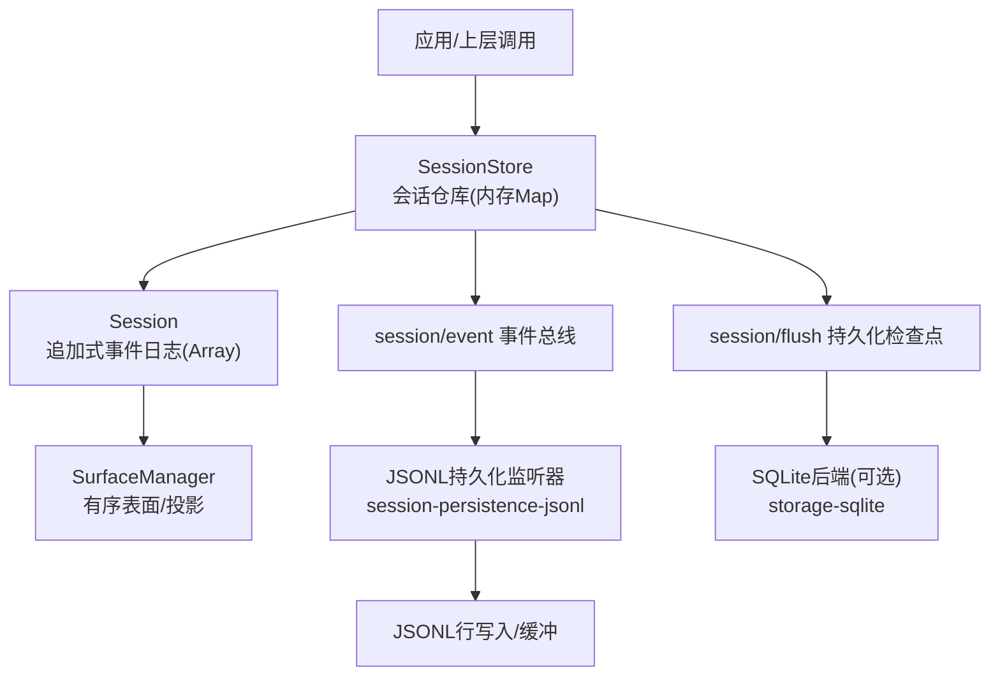
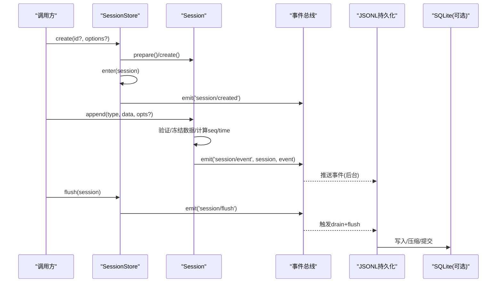
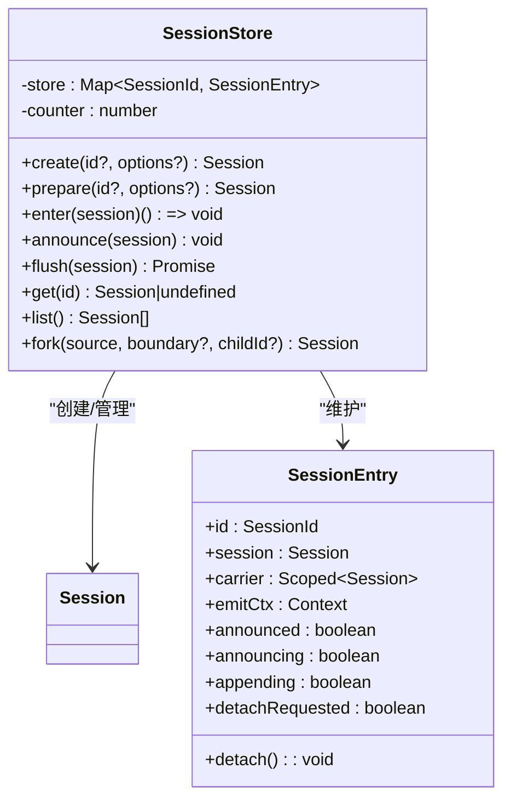
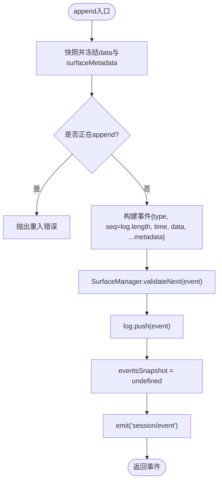
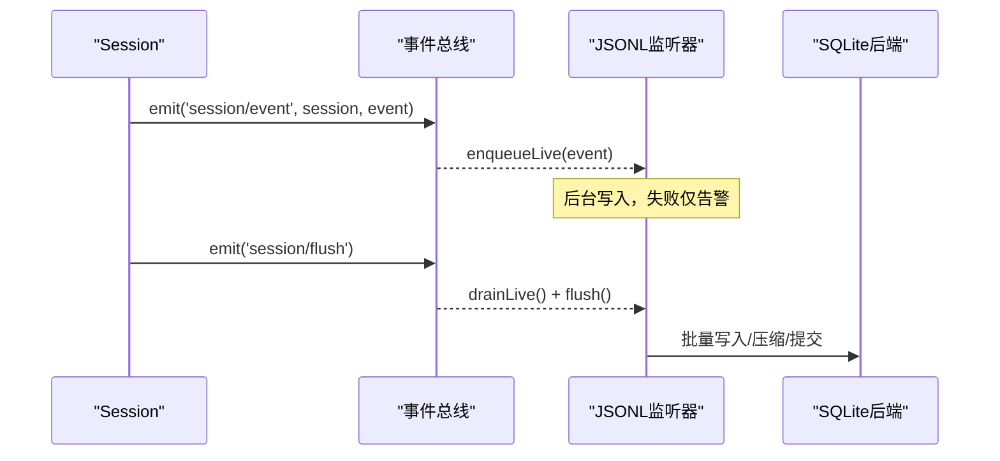
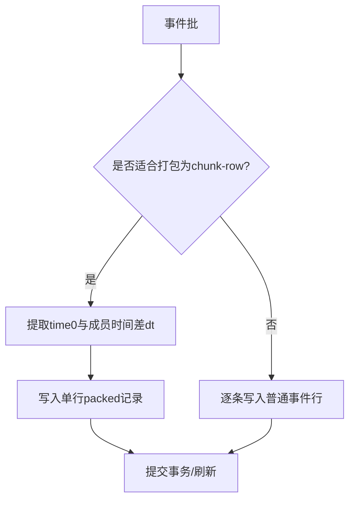
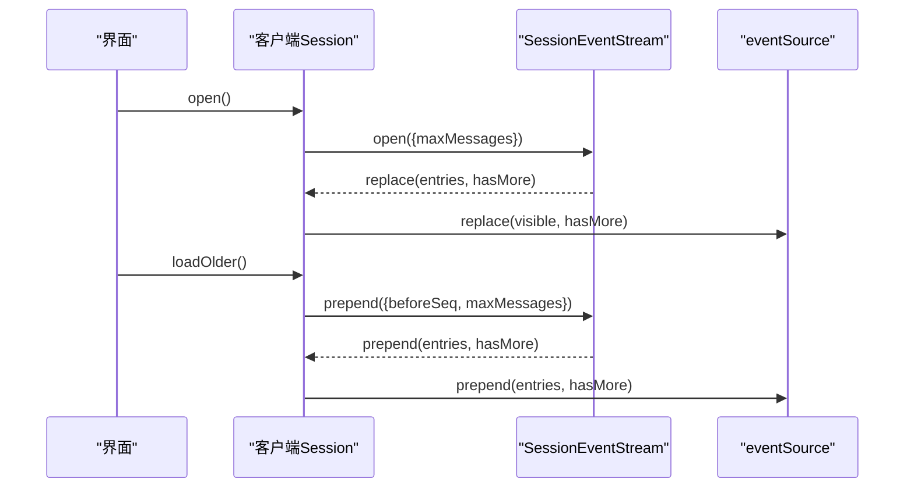
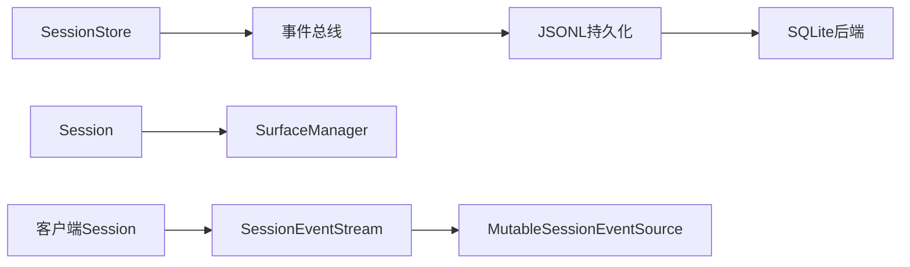

# 存储机制

<cite>
**本文引用的文件**
- [packages/core/session/src/index.ts](file://packages/core/session/src/index.ts)
- [packages/session/session-persistence-jsonl/src/storage.ts](file://packages/session/session-persistence-jsonl/src/storage.ts)
- [packages/session/session-persistence-jsonl/src/format.ts](file://packages/session/session-persistence-jsonl/src/format.ts)
- [packages/storage/storage-domain/src/domain.ts](file://packages/storage/storage-domain/src/domain.ts)
- [packages/storage/storage-domain/src/events.ts](file://packages/storage/storage-domain/src/events.ts)
- [packages/storage/storage-sqlite/src/schema.ts](file://packages/storage/storage-sqlite/src/schema.ts)
- [packages/storage/storage-sqlite/src/unit.ts](file://packages/storage/storage-sqlite/src/unit.ts)
- [packages/test-support/session-snapshot/src/suite.ts](file://packages/test-support/session-snapshot/src/suite.ts)
- [packages/api/session-controller/src/client/sessions/session.ts](file://packages/api/session-controller/src/client/sessions/session.ts)
</cite>

## 目录
1. [简介](#简介)
2. [项目结构](#项目结构)
3. [核心组件](#核心组件)
4. [架构总览](#架构总览)
5. [详细组件分析](#详细组件分析)
6. [依赖关系分析](#依赖关系分析)
7. [性能考量](#性能考量)
8. [故障排查指南](#故障排查指南)
9. [结论](#结论)
10. [附录：API参考与最佳实践](#附录api参考与最佳实践)

## 简介
本文件围绕“会话存储机制”展开，重点解释追加式事件日志的内存存储实现、SessionStore类的设计与会话生命周期管理、内存优化策略；详述会话的创建、查询、删除操作（含会话ID生成、状态维护、并发访问控制）；说明事件日志的数据结构设计（数组存储、索引机制、内存占用优化）；解释会话的分片存储机制（chunk-rows的实现、大会话处理策略、性能考虑）；并提供具体代码示例路径以展示如何创建会话、存储事件、查询历史、清理资源。最后给出完整的存储API参考与最佳实践。

## 项目结构
- 会话核心与内存存储位于 packages/core/session/src/index.ts，包含 SessionStore（会话仓库）、Session（会话对象，内部使用数组作为追加式事件日志）。
- 持久化插件位于 packages/session/session-persistence-jsonl/src/storage.ts，订阅 session/event 与 session/flush 事件，将事件写入JSONL或触发落盘。
- 存储域与契约位于 packages/storage/storage-domain/src，定义通用领域模型与事件类型。
- SQLite后端位于 packages/storage/storage-sqlite/src，提供schema与单元写入逻辑。
- JSON格式压缩与序列化位于 packages/session/session-persistence-jsonl/src/format.ts，负责sourceEventSeqs等字段的紧凑编码。
- 测试快照工具在 packages/test-support/session-snapshot/src/suite.ts，涉及packed chunk-row的时间戳保持等。
- 客户端会话窗口在 packages/api/session-controller/src/client/sessions/session.ts，负责历史分页加载与追加。

**图示来源**
- [packages/core/session/src/index.ts:887-1251](file://packages/core/session/src/index.ts#L887-L1251)
- [packages/session/session-persistence-jsonl/src/storage.ts:491-519](file://packages/session/session-persistence-jsonl/src/storage.ts#L491-L519)
- [packages/storage/storage-sqlite/src/schema.ts](file://packages/storage/storage-sqlite/src/schema.ts)

**章节来源**
- [packages/core/session/src/index.ts:887-1251](file://packages/core/session/src/index.ts#L887-L1251)
- [packages/session/session-persistence-jsonl/src/storage.ts:491-519](file://packages/session/session-persistence-jsonl/src/storage.ts#L491-L519)

## 核心组件
- SessionStore：会话仓库，维护内存中的会话集合，负责会话创建、进入、公告、分离、分叉、刷新等生命周期管理。
- Session：会话对象，内部以数组为追加式事件日志，提供append、snapshotEvents、eventAt、deriveMessages等方法。
- SurfaceManager：维护有序表面与消息投影，确保消息历史可推导且可增量更新。
- 持久化监听器：订阅session/event与session/flush，异步落盘并支持flush检查点。
- 存储域与后端：定义存储契约、事件类型，并提供JSONL与SQLite两种后端实现。

**章节来源**
- [packages/core/session/src/index.ts:451-850](file://packages/core/session/src/index.ts#L451-L850)
- [packages/core/session/src/index.ts:887-1251](file://packages/core/session/src/index.ts#L887-L1251)
- [packages/session/session-persistence-jsonl/src/storage.ts:491-519](file://packages/session/session-persistence-jsonl/src/storage.ts#L491-L519)

## 架构总览
系统采用事件溯源模式：所有会话变更通过追加事件表达，内存中维护一个不可变的完整快照缓存与增量投影；持久化层通过事件总线异步消费事件并在检查点时落盘。

**图示来源**
- [packages/core/session/src/index.ts:925-936](file://packages/core/session/src/index.ts#L925-L936)
- [packages/core/session/src/index.ts:1008-1042](file://packages/core/session/src/index.ts#L1008-L1042)
- [packages/core/session/src/index.ts:699-749](file://packages/core/session/src/index.ts#L699-L749)
- [packages/session/session-persistence-jsonl/src/storage.ts:500-519](file://packages/session/session-persistence-jsonl/src/storage.ts#L500-L519)

## 详细组件分析

### SessionStore：会话仓库与生命周期
- 设计要点
  - 内存存储：使用Map<SessionId, SessionEntry>维护活跃会话，counter用于自增生成唯一id。
  - 生命周期：prepare/enter/announce/detach形成原子化的创建与发布流程；announce抛出时回滚attach，避免泄漏。
  - 并发控制：通过entry.announcing/appending标志防止重入；detachRequested在同步回调期间延迟分离。
  - 分叉：fork基于源会话的连续前缀构建子会话，校验边界与turn完整性。
  - 刷新：flush聚合所有session/flush监听器，保证持久化检查点。

- 关键行为
  - create：构造会话并进入store，随后发布session/created。
  - prepare：仅构造会话，不进入store，供复合effect内精细编排。
  - enter：安装发布钩子并加入store，返回detach函数。
  - announce：发布一次session/created，失败则回滚。
  - detachEntered：移除store条目，必要时延迟到发布完成。
  - fork：从源会话截取连续事件前缀创建子会话，设置inheritedEventCount。
  - get/list：查询活跃会话。

**图示来源**
- [packages/core/session/src/index.ts:887-1251](file://packages/core/session/src/index.ts#L887-L1251)

**章节来源**
- [packages/core/session/src/index.ts:887-1251](file://packages/core/session/src/index.ts#L887-L1251)

### Session：追加式事件日志与内存优化
- 数据结构
  - 日志：私有数组log: SessionEvent[]，seq严格等于log.length，保证连续性。
  - 快照缓存：eventsSnapshot缓存完整快照，减少重复拷贝成本。
  - 投影缓存：derived与derivedNodes缓存消息历史投影，按surface节点增量构建。
  - 表面管理器：SurfaceManager维护有序表面与投影，确保消息历史一致性。

- 追加与验证
  - append：对data与surfaceMetadata进行lossless-JSON快照与深冻结；校验surface合约；记录seq/time；发布session/event；重置eventsSnapshot。
  - 种子恢复：fromRestore/构造函数对seed进行严格校验（seq连续性、JSON可序列化、surface合法性），并可能追加end-seed标记。

- 查询与导出
  - eventAt：O(1)读取指定seq的事件。
  - snapshotEvents：范围切片并冻结；全量时使用缓存。
  - deriveMessages：基于surface节点增量推导消息历史，共享冻结对象，避免二次拷贝。

**图示来源**
- [packages/core/session/src/index.ts:699-749](file://packages/core/session/src/index.ts#L699-L749)

**章节来源**
- [packages/core/session/src/index.ts:500-850](file://packages/core/session/src/index.ts#L500-L850)

### 持久化：JSONL与SQLite后端
- JSONL监听器
  - 订阅session/event：后台写入队列，失败仅记录警告，不影响追加成功。
  - 订阅session/flush：drain缓冲区并flush，确保检查点。
  - 会话销毁：close时执行最终drain，聚合失败。

- 格式压缩
  - sourceEventSeqs：连续区间压缩为[start,end]对，减少存储体积。
  - assistant流：嵌套事件数据，每事件一行，便于回放与部分输出。

- SQLite后端
  - schema：定义events表结构与ROWID选择，权衡压缩与WAL粒度。
  - unit：批量写入与事务提交，保留FULL级别以确保append后持久化。

**图示来源**
- [packages/session/session-persistence-jsonl/src/storage.ts:500-519](file://packages/session/session-persistence-jsonl/src/storage.ts#L500-L519)
- [packages/session/session-persistence-jsonl/src/format.ts:310-331](file://packages/session/session-persistence-jsonl/src/format.ts#L310-L331)
- [packages/storage/storage-sqlite/src/schema.ts](file://packages/storage/storage-sqlite/src/schema.ts)

**章节来源**
- [packages/session/session-persistence-jsonl/src/storage.ts:491-519](file://packages/session/session-persistence-jsonl/src/storage.ts#L491-L519)
- [packages/session/session-persistence-jsonl/src/format.ts:310-331](file://packages/session/session-persistence-jsonl/src/format.ts#L310-L331)
- [packages/storage/storage-sqlite/src/schema.ts](file://packages/storage/storage-sqlite/src/schema.ts)

### 分片存储机制：chunk-rows与大会话策略
- packed chunk-row
  - 将多个成员事件打包为一行，保留time0与dt时间差数组，降低行数与WAL写入。
  - 测试套件中preservePackedMemberTimes确保逻辑时间信息在新行中正确继承。

- 性能与取舍
  - 拒绝合并逻辑chunk事件：避免改变序列引用、回放与部分输出。
  - 拒绝周期性compactor：避免引入额外写入生命周期与竞态。
  - 保留ROWID：对比WITHOUT ROWID更节省空间。
  - 页面大小：默认4KiB，变化不大但影响WAL粒度。

**图示来源**
- [packages/test-support/session-snapshot/src/suite.ts:815-837](file://packages/test-support/session-snapshot/src/suite.ts#L815-L837)
- [.agents/notes/archived/architecture/2026-08-18-sqlite-physical-chunk-row-compression.md:46-58](file://.agents/notes/archived/architecture/2026-08-18-sqlite-physical-chunk-row-compression.md#L46-L58)

**章节来源**
- [packages/test-support/session-snapshot/src/suite.ts:815-837](file://packages/test-support/session-snapshot/src/suite.ts#L815-L837)
- [.agents/notes/archived/architecture/2026-08-18-sqlite-physical-chunk-row-compression.md:46-58](file://.agents/notes/archived/architecture/2026-08-18-sqlite-physical-chunk-row-compression.md#L46-L58)

### 客户端会话窗口与历史加载
- 客户端Session维护baseSeq、hasMore、loadingOlder等状态，支持open/loadOlder/loadThrough等操作。
- 通过SessionEventStream获取replace/prepend/append等变更，驱动本地eventSource更新。
- 对assistant流进行rebaseline/settle/abandon处理，保证UI与历史一致。

**图示来源**
- [packages/api/session-controller/src/client/sessions/session.ts:377-452](file://packages/api/session-controller/src/client/sessions/session.ts#L377-L452)
- [packages/api/session-controller/src/client/sessions/session.ts:634-708](file://packages/api/session-controller/src/client/sessions/session.ts#L634-L708)

**章节来源**
- [packages/api/session-controller/src/client/sessions/session.ts:377-452](file://packages/api/session-controller/src/client/sessions/session.ts#L377-L452)
- [packages/api/session-controller/src/client/sessions/session.ts:634-708](file://packages/api/session-controller/src/client/sessions/session.ts#L634-L708)

## 依赖关系分析
- SessionStore依赖Context事件总线发布/订阅session/created、session/event、session/flush、session/disposed。
- Session依赖SurfaceManager进行消息投影与历史推导。
- JSONL持久化监听器依赖事件总线接收session/event与session/flush。
- SQLite后端依赖schema定义与unit写入逻辑。
- 客户端Session依赖SessionEventStream与MutableSessionEventSource维护历史窗口。

**图示来源**
- [packages/core/session/src/index.ts:887-1251](file://packages/core/session/src/index.ts#L887-L1251)
- [packages/session/session-persistence-jsonl/src/storage.ts:491-519](file://packages/session/session-persistence-jsonl/src/storage.ts#L491-L519)
- [packages/api/session-controller/src/client/sessions/session.ts:377-452](file://packages/api/session-controller/src/client/sessions/session.ts#L377-L452)

**章节来源**
- [packages/core/session/src/index.ts:887-1251](file://packages/core/session/src/index.ts#L887-L1251)
- [packages/session/session-persistence-jsonl/src/storage.ts:491-519](file://packages/session/session-persistence-jsonl/src/storage.ts#L491-L519)
- [packages/api/session-controller/src/client/sessions/session.ts:377-452](file://packages/api/session-controller/src/client/sessions/session.ts#L377-L452)

## 性能考量
- 内存优化
  - 事件日志使用数组，seq=长度，避免额外索引结构。
  - eventsSnapshot缓存完整快照，减少重复拷贝。
  - derived消息历史增量构建，共享冻结对象，避免二次深拷贝。
  - surface节点序列保证只遍历新增节点。

- 持久化优化
  - sourceEventSeqs区间压缩减少冗余。
  - packed chunk-row减少行数与WAL写入。
  - 保留ROWID与默认页面大小，平衡空间与I/O粒度。
  - 异步写入与flush检查点解耦追加热路径与落盘。

- 并发与吞吐
  - append路径无阻塞I/O，监听器后台处理。
  - flush并行等待所有监听器完成，首个失败传播。
  - 客户端分页加载避免一次性拉取全部历史。

[本节为通用指导，无需特定文件来源]

## 故障排查指南
- 常见错误
  - 非JSON可序列化数据：append会抛出错误，需检查data与surfaceMetadata。
  - 重入冲突：append过程中再次append会报错，需避免嵌套调用。
  - 种子不一致：fromRestore要求seed的seq连续且与inheritedEventCount匹配。
  - 持久化失败：JSONL监听器记录警告但不影响追加；检查flush是否被调用。

- 定位方法
  - 查看session/event与session/flush事件是否被正确订阅。
  - 检查SQLite后端事务提交与压缩逻辑。
  - 确认客户端Session的open/loadOlder/loadThrough是否正确处理hasMore与baseSeq。

**章节来源**
- [packages/core/session/src/index.ts:699-749](file://packages/core/session/src/index.ts#L699-L749)
- [packages/core/session/src/index.ts:541-608](file://packages/core/session/src/index.ts#L541-L608)
- [packages/session/session-persistence-jsonl/src/storage.ts:500-519](file://packages/session/session-persistence-jsonl/src/storage.ts#L500-L519)

## 结论
该存储机制以事件溯源为核心，通过SessionStore与Session在内存中维护追加式日志，结合SurfaceManager实现高效的消息投影与历史推导；持久化层通过事件总线异步消费并在检查点落盘，支持JSONL与SQLite后端，并通过packed chunk-row与sourceEventSeqs压缩优化存储体积与I/O。整体设计在保证一致性与可回放性的同时，兼顾了性能与可扩展性。

[本节为总结，无需特定文件来源]

## 附录：API参考与最佳实践

- 创建会话
  - 使用SessionStore.create或prepare+enter+announce组合，确保生命周期原子性。
  - 示例路径：[packages/core/session/src/index.ts:925-936](file://packages/core/session/src/index.ts#L925-L936)

- 存储事件
  - 使用Session.append，确保data与surfaceMetadata可JSON序列化。
  - 示例路径：[packages/core/session/src/index.ts:699-749](file://packages/core/session/src/index.ts#L699-L749)

- 查询历史
  - 使用Session.snapshotEvents或eventAt获取事件快照或单个事件。
  - 示例路径：[packages/core/session/src/index.ts:618-639](file://packages/core/session/src/index.ts#L618-L639)

- 清理资源
  - 调用SessionStore.detach或确保effect卸载时自动分离；触发session/flush确保落盘。
  - 示例路径：[packages/core/session/src/index.ts:1044-1054](file://packages/core/session/src/index.ts#L1044-L1054)

- 最佳实践
  - 始终通过SessionStore管理会话生命周期，避免直接操作内部状态。
  - 在append前验证数据可序列化，避免运行时异常。
  - 合理使用flush确保检查点，特别是在关键业务操作后。
  - 对于大会话，利用客户端分页加载与packed chunk-row优化性能。

**章节来源**
- [packages/core/session/src/index.ts:925-936](file://packages/core/session/src/index.ts#L925-L936)
- [packages/core/session/src/index.ts:699-749](file://packages/core/session/src/index.ts#L699-L749)
- [packages/core/session/src/index.ts:618-639](file://packages/core/session/src/index.ts#L618-L639)
- [packages/core/session/src/index.ts:1044-1054](file://packages/core/session/src/index.ts#L1044-L1054)