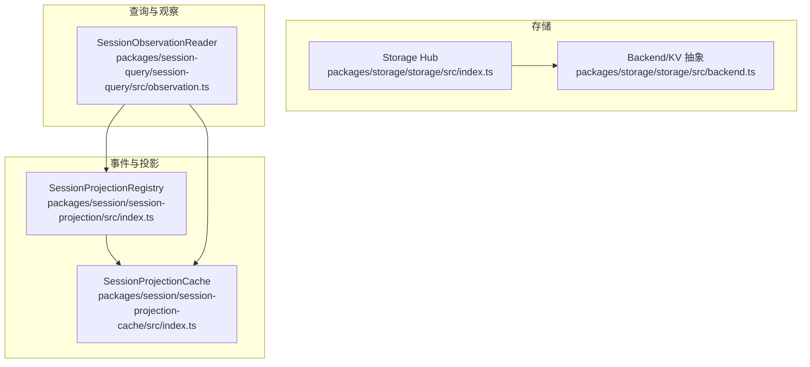
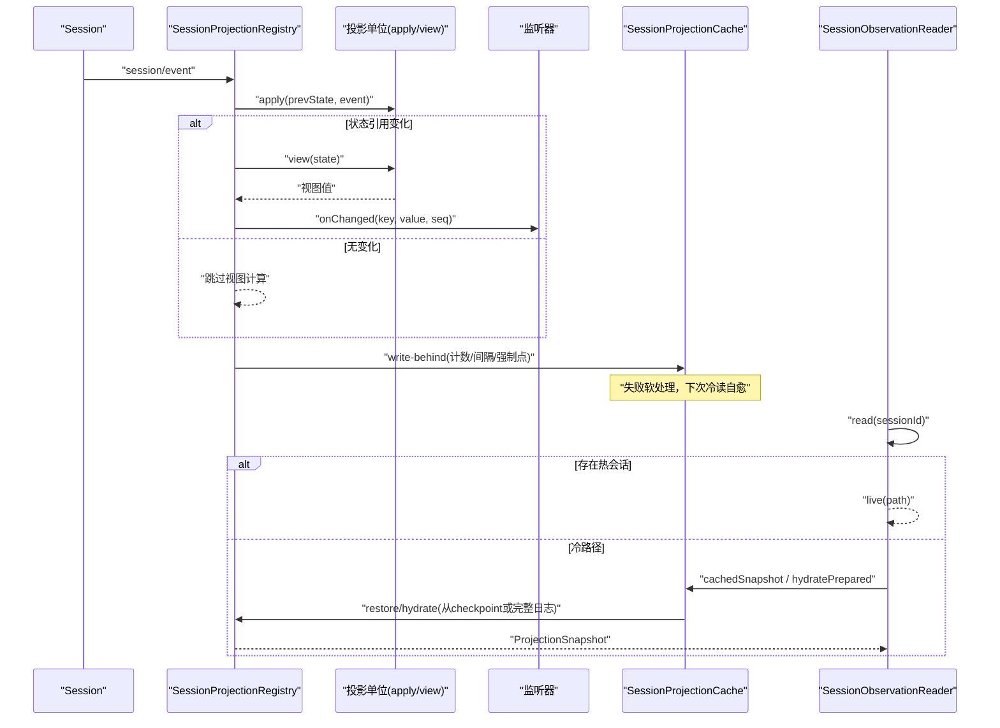
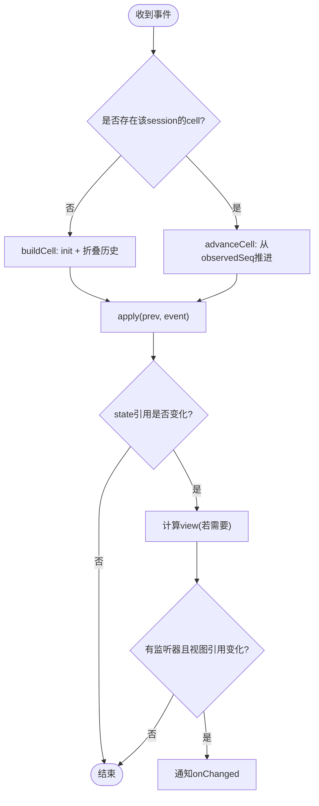
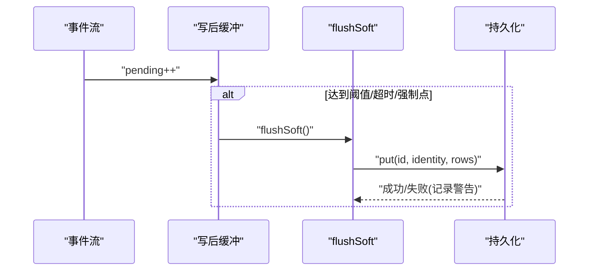
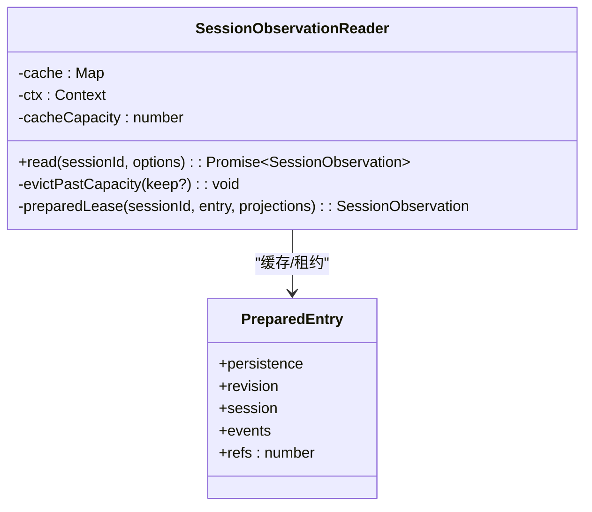
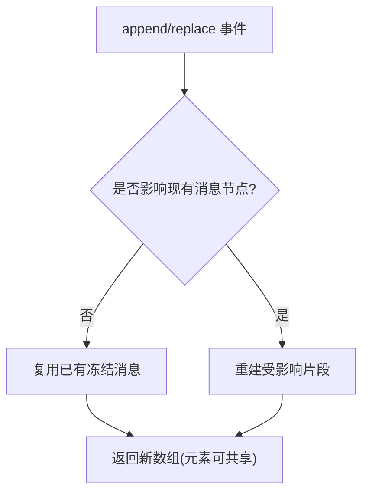
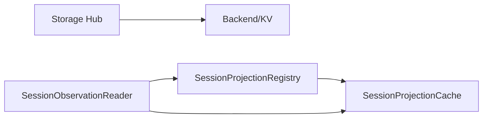

# 性能优化策略

<cite>
**本文引用的文件**
- [packages/storage/storage/src/index.ts](file://packages/storage/storage/src/index.ts)
- [packages/storage/storage/src/backend.ts](file://packages/storage/storage/src/backend.ts)
- [packages/session/session-projection/src/index.ts](file://packages/session/session-projection/src/index.ts)
- [packages/session/session-projection-cache/src/index.ts](file://packages/session/session-projection-cache/src/index.ts)
- [packages/session-query/session-query/src/observation.ts](file://packages/session-query/session-query/src/observation.ts)
- [packages/core/session/tests/derived-cache.spec.ts](file://packages/core/session/tests/derived-cache.spec.ts)
- [packages/core/session/src/index.ts](file://packages/core/session/src/index.ts)
- [packages/client/ui-conversation/tests/history-transport.perf.client.ts](file://packages/client/ui-conversation/tests/history-transport.perf.client.ts)
</cite>

## 目录
1. [引言](#引言)
2. [项目结构](#项目结构)
3. [核心组件](#核心组件)
4. [架构总览](#架构总览)
5. [详细组件分析](#详细组件分析)
6. [依赖关系分析](#依赖关系分析)
7. [性能考量](#性能考量)
8. [故障排查指南](#故障排查指南)
9. [结论](#结论)
10. [附录](#附录)

## 引言
本文件围绕存储与事件处理链路的性能优化，系统阐述内存使用优化（对象冻结、引用计数、垃圾回收优化）、事件日志的性能考虑（批量操作、懒加载、缓存策略）、SurfaceManager（会话投影）的增量更新与变更检测机制、deriveMessages 的增量推导与共享对象复用，并提供可执行的基准测试方法与监控调优建议。目标是帮助开发者在高吞吐、低延迟场景下稳定运行并避免内存泄漏。

## 项目结构
本项目在“存储—事件—投影—查询”四层中实现高性能：
- 存储层：统一的 Storage Hub 与后端抽象，支持 KV 单元与 per-record/single 布局，保证原子写入与可恢复性。
- 事件与投影：SessionProjectionRegistry 以纯函数式 apply 驱动状态演进，按 Object.is 比较视图变化，按需计算客户端视图。
- 持久化投影缓存：SessionProjectionCache 提供写后缓冲、阈值/时间触发落盘、冷读回灌与版本校验。
- 观察与缓存：SessionObservationReader 提供冷/热路径观察，带容量限制与租约引用计数，避免过度内存占用。

**图表来源**
- [packages/storage/storage/src/index.ts:1-99](file://packages/storage/storage/src/index.ts#L1-L99)
- [packages/storage/storage/src/backend.ts:1-139](file://packages/storage/storage/src/backend.ts#L1-L139)
- [packages/session/session-projection/src/index.ts:182-701](file://packages/session/session-projection/src/index.ts#L182-L701)
- [packages/session/session-projection-cache/src/index.ts:92-392](file://packages/session/session-projection-cache/src/index.ts#L92-L392)
- [packages/session-query/session-query/src/observation.ts:75-305](file://packages/session-query/session-query/src/observation.ts#L75-L305)

**章节来源**
- [packages/storage/storage/src/index.ts:1-99](file://packages/storage/storage/src/index.ts#L1-L99)
- [packages/storage/storage/src/backend.ts:1-139](file://packages/storage/storage/src/backend.ts#L1-L139)

## 核心组件
- Storage Hub：注册后端、挂载数据形式，不直接做 IO；通过 BackendRegistry 管理多后端并存。
- SessionProjectionRegistry：订阅 session/event，对每个注册的投影单位执行 apply；仅在状态引用变化时计算 view 并通知监听者；维护 per-session 单元格与视图缓存。
- SessionProjectionCache：将投影状态持久化为 checkpoint；支持 writeEveryEvents/writeIntervalMs 节流；在创建、turn/end、释放时强制落盘；冷读时从 checkpoint 恢复并回写刷新。
- SessionObservationReader：统一冷/热读取；冷路径构建 PreparedEntry 并缓存，基于 revision 命中；LRU 淘汰 + 引用计数租约；可选跳过投影计算。

**章节来源**
- [packages/storage/storage/src/index.ts:47-93](file://packages/storage/storage/src/index.ts#L47-L93)
- [packages/session/session-projection/src/index.ts:182-701](file://packages/session/session-projection/src/index.ts#L182-L701)
- [packages/session/session-projection-cache/src/index.ts:92-392](file://packages/session/session-projection-cache/src/index.ts#L92-L392)
- [packages/session-query/session-query/src/observation.ts:75-305](file://packages/session-query/session-query/src/observation.ts#L75-L305)

## 架构总览
下图展示一次事件驱动的投影更新与持久化流程，以及冷读时的缓存与恢复路径。

**图表来源**
- [packages/session/session-projection/src/index.ts:220-701](file://packages/session/session-projection/src/index.ts#L220-L701)
- [packages/session/session-projection-cache/src/index.ts:301-392](file://packages/session/session-projection-cache/src/index.ts#L301-L392)
- [packages/session-query/session-query/src/observation.ts:93-157](file://packages/session-query/session-query/src/observation.ts#L93-L157)

## 详细组件分析

### 存储后端与数据布局
- 后端契约：KV 单元支持 single/per-record 布局，per-record 避免单条大记录导致整份重写；open/loadAll/putRecord/deleteRecord/close 等接口保证原子性与幂等。
- Hub 挂载：Storage.mount/form 提供插件化数据形式挂载，错误时抛出明确错误码，便于诊断。

**章节来源**
- [packages/storage/storage/src/backend.ts:17-139](file://packages/storage/storage/src/backend.ts#L17-L139)
- [packages/storage/storage/src/index.ts:47-93](file://packages/storage/storage/src/index.ts#L47-L93)

### 会话投影（SurfaceManager）：增量更新、变更检测、投影缓存
- 增量推进：advanceCell 仅从 observedSeq+1 推进到目标 seq，避免重复折叠历史。
- 变更检测：apply 返回新状态引用才视为变化；views 双缓冲缓存最近两次视图，Object.is 比较决定是否通知监听器。
- 懒加载：首次访问某 session 的某 key 时才 buildCell 折叠历史；snapshot/cachedSnapshot 按需产出视图。
- 持久化：checkpoint 序列化 state 为 JSON；restore 使用 ver/seq 校验，缺失或不匹配则回退全量重放。

**图表来源**
- [packages/session/session-projection/src/index.ts:597-701](file://packages/session/session-projection/src/index.ts#L597-L701)

**章节来源**
- [packages/session/session-projection/src/index.ts:182-701](file://packages/session/session-projection/src/index.ts#L182-L701)

### 投影缓存：批量与节流、冷读回灌
- 写后缓冲：每事件递增 pending，达到 writeEveryEvents 或到达 writeIntervalMs 触发 flushSoft；turn/end、创建、释放为强制落盘点。
- 冷读加速：coldSnapshot 从 checkpoint 恢复，跳过已折叠前缀；失败软处理，回写刷新下一轮。
- 零 I/O 列表：cachedSnapshot 直接从域内存表读取，用于快速列出会话标题等元信息。

**图表来源**
- [packages/session/session-projection-cache/src/index.ts:301-392](file://packages/session/session-projection-cache/src/index.ts#L301-L392)

**章节来源**
- [packages/session/session-projection-cache/src/index.ts:92-392](file://packages/session/session-projection-cache/src/index.ts#L92-L392)

### 观察器：冷/热路径与缓存淘汰
- 热路径：直接取 live session 的事件快照与投影。
- 冷路径：stat -> loadSource -> prepare Session -> 可选投影 -> 放入缓存；缓存基于 persistence + revision 键控，LRU 淘汰未租用的条目。
- 租约与引用计数：preparedLease 返回可 retain/dispose 的观察句柄；refs 归零时尝试淘汰。

**图表来源**
- [packages/session-query/session-query/src/observation.ts:75-305](file://packages/session-query/session-query/src/observation.ts#L75-L305)

**章节来源**
- [packages/session-query/session-query/src/observation.ts:75-305](file://packages/session-query/session-query/src/observation.ts#L75-L305)

### deriveMessages 的增量推导与共享对象
- 增量推导：表面替换（replace）会重建相关片段，其余消息节点保持共享引用；每次调用返回新数组但元素可共享冻结的消息对象。
- 共享与冻结：内容来自已冻结的日志事件，避免复制；测试覆盖 deep-equal 与 replay 一致性。
- 单事件投影：deriveEventMessage 与整体推导保持一致，复用已冻结 content。

**图表来源**
- [packages/core/session/tests/derived-cache.spec.ts:22-88](file://packages/core/session/tests/derived-cache.spec.ts#L22-L88)

**章节来源**
- [packages/core/session/tests/derived-cache.spec.ts:22-88](file://packages/core/session/tests/derived-cache.spec.ts#L22-L88)

### 内存使用优化：对象冻结、引用计数、GC 优化
- 对象冻结：深度冻结恢复后的对象，避免意外修改与提升 GC 友好度；使用迭代栈替代递归遍历，防止深树爆栈。
- 引用计数：观察器 PreparedEntry.refs 控制缓存项生命周期；投影 Registry 的 Registration.refs 控制单位生命周期；投影单元格 views 双缓冲减少重复计算。
- GC 优化：惰性构建 cell、按需计算 view、结构化克隆 detached 状态落盘、LRU 淘汰与租约释放，降低峰值堆占用。

**章节来源**
- [packages/core/session/src/index.ts:195-209](file://packages/core/session/src/index.ts#L195-L209)
- [packages/session-query/session-query/src/observation.ts:222-268](file://packages/session-query/session-query/src/observation.ts#L222-L268)
- [packages/session/session-projection/src/index.ts:149-174](file://packages/session/session-projection/src/index.ts#L149-L174)

## 依赖关系分析
- Storage Hub 依赖 BackendRegistry 管理多后端；后端提供 KV 能力，被上层 domain 使用。
- SessionProjectionRegistry 依赖 Session 事件流，输出 ProjectionSnapshot 给 UI/导出/查询。
- SessionProjectionCache 依赖 Storage Domain 与 SessionProjections，负责 checkpoint 读写。
- SessionObservationReader 依赖 Sessions/Persistence/Projections，提供冷/热观察。

**图表来源**
- [packages/storage/storage/src/index.ts:47-93](file://packages/storage/storage/src/index.ts#L47-L93)
- [packages/session/session-projection/src/index.ts:182-701](file://packages/session/session-projection/src/index.ts#L182-L701)
- [packages/session/session-projection-cache/src/index.ts:92-392](file://packages/session/session-projection-cache/src/index.ts#L92-L392)
- [packages/session-query/session-query/src/observation.ts:75-305](file://packages/session-query/session-query/src/observation.ts#L75-L305)

**章节来源**
- [packages/storage/storage/src/index.ts:47-93](file://packages/storage/storage/src/index.ts#L47-L93)
- [packages/session/session-projection/src/index.ts:182-701](file://packages/session/session-projection/src/index.ts#L182-L701)
- [packages/session/session-projection-cache/src/index.ts:92-392](file://packages/session/session-projection-cache/src/index.ts#L92-L392)
- [packages/session-query/session-query/src/observation.ts:75-305](file://packages/session-query/session-query/src/observation.ts#L75-L305)

## 性能考量
- 事件批处理与节流
  - 投影缓存采用 writeEveryEvents 与 writeIntervalMs 双阈值节流，减少频繁磁盘写入。
  - 强制落盘点（创建、turn/end、释放）确保关键一致性边界。
- 懒加载与按需计算
  - 投影单元格 lazy build，只在首次访问或事件推进时折叠历史。
  - 视图计算仅在状态引用变化时进行，并通过双缓冲与 Object.is 抑制多余通知。
- 缓存与共享
  - 观察器缓存 PreparedEntry，基于 revision 精确命中，LRU 淘汰未租用条目。
  - deriveMessages 共享冻结消息对象，减少复制与 GC 压力。
- 内存安全与稳定性
  - 深度冻结避免意外修改；结构化克隆落盘，避免持有活引用。
  - 错误软处理（缓存写失败不影响主路径），自愈于下一次冷读。

[本节为通用指导，无需特定文件来源]

## 故障排查指南
- 投影状态不一致
  - 检查 stateVersion 是否匹配；不匹配会丢弃旧行并重新折叠。
  - 确认 restoreFloor 与 tail 读取范围正确，避免截断导致的陈旧数据。
- 缓存未生效
  - 确认 coldSnapshot/hydratePrepared 使用的 header/inheritedEventCount 一致。
  - 观察 preparedLease 的 refs 是否正确释放，避免缓存膨胀。
- 写入抖动
  - 调整 writeEveryEvents 与 writeIntervalMs，平衡延迟与落盘频率。
  - 关注 turn/end 强制落盘是否过于频繁，必要时合并业务事件。
- 内存泄漏迹象
  - 观察 PreparedEntry.refs 是否长期不为 0；确认 dispose/释放路径。
  - 检查投影监听器是否及时取消，避免闭包持有长生命周期对象。

**章节来源**
- [packages/session/session-projection/src/index.ts:425-540](file://packages/session/session-projection/src/index.ts#L425-L540)
- [packages/session/session-projection-cache/src/index.ts:277-392](file://packages/session/session-projection-cache/src/index.ts#L277-L392)
- [packages/session-query/session-query/src/observation.ts:222-268](file://packages/session-query/session-query/src/observation.ts#L222-L268)

## 结论
通过“纯函数式投影 + 增量推进 + 视图引用比较 + 写后节流 + 冷读回灌 + 观察器缓存与租约”的组合，系统在事件高吞吐场景下实现了稳定的延迟与内存占用。结合对象冻结、共享对象与结构化克隆，进一步降低了 GC 压力与拷贝成本。建议在部署中根据负载特征调优写阈值与缓存容量，并配合基准测试持续验证性能回归。

[本节为总结性内容，无需特定文件来源]

## 附录

### 性能测试与基准方法
- 内存峰值采样
  - 使用 V8 暴露 gc 与 process.memoryUsage 测量基线到峰值的差值，多次采样取中位数。
  - 参考用例路径：history-transport.perf.client.ts 中的 sampledPeakHeap。
- 投影缓存节流验证
  - 通过配置 writeEveryEvents 与 writeIntervalMs，验证事件计数与定时器触发行为。
  - 参考用例路径：session-projection-cache tests 中的 count/interval 场景。
- deriveMessages 一致性
  - 对比 deriveMessages 与 from-scratch replay 结果，确保增量推导等价。
  - 参考用例路径：derived-cache.spec.ts 中的 grow/replace/snapshot 场景。

**章节来源**
- [packages/client/ui-conversation/tests/history-transport.perf.client.ts:188-232](file://packages/client/ui-conversation/tests/history-transport.perf.client.ts#L188-L232)
- [packages/session/session-projection-cache/tests/cache.spec.ts:236-262](file://packages/session/session-projection-cache/tests/cache.spec.ts#L236-L262)
- [packages/core/session/tests/derived-cache.spec.ts:22-88](file://packages/core/session/tests/derived-cache.spec.ts#L22-L88)

### 监控与调优建议
- 指标采集
  - 投影：onChanged 调用次数、视图计算耗时、状态变化率。
  - 缓存：write 触发次数、失败率、冷读命中率、缓存大小与淘汰率。
  - 观察器：prepared 缓存命中、refs 分布、LRU 淘汰频率。
- 调优方向
  - 提高 writeEveryEvents 以降低写放大，但会增加崩溃恢复代价。
  - 增大 cacheCapacity 以提升冷读命中率，需评估内存预算。
  - 针对热点会话启用更激进的投影预计算（如 title）。
- 内存泄漏预防
  - 确保所有 on onChanged 返回的 disposer 被调用。
  - 避免在闭包中持有长生命周期对象；优先使用弱引用或显式清理。
  - 定期采样堆快照，定位未被释放的 PreparedEntry/Registration。

[本节为通用指导，无需特定文件来源]