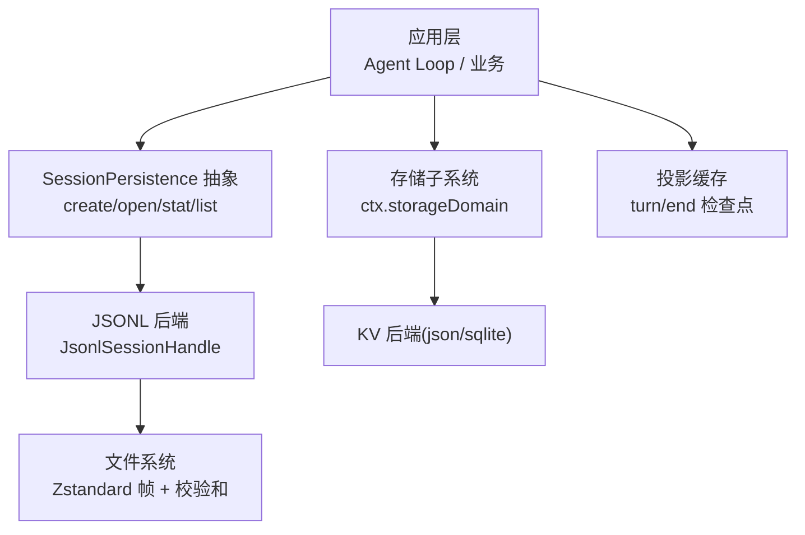
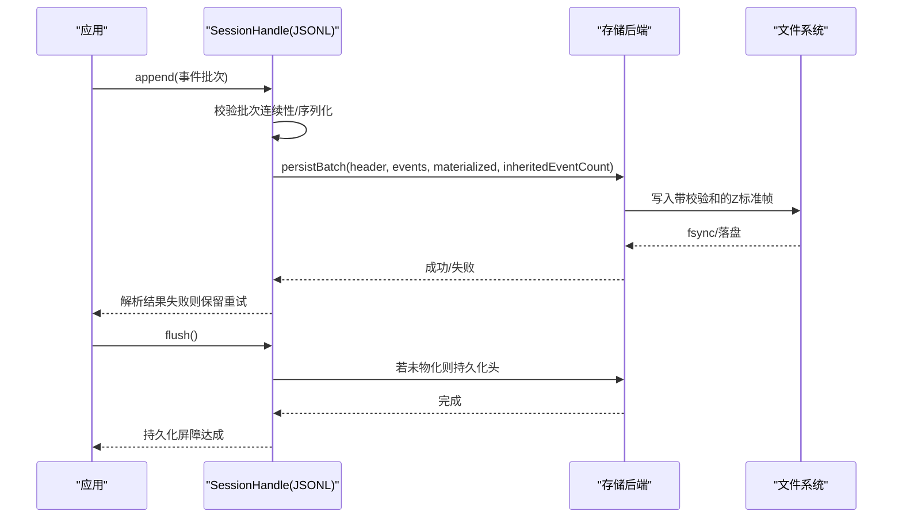
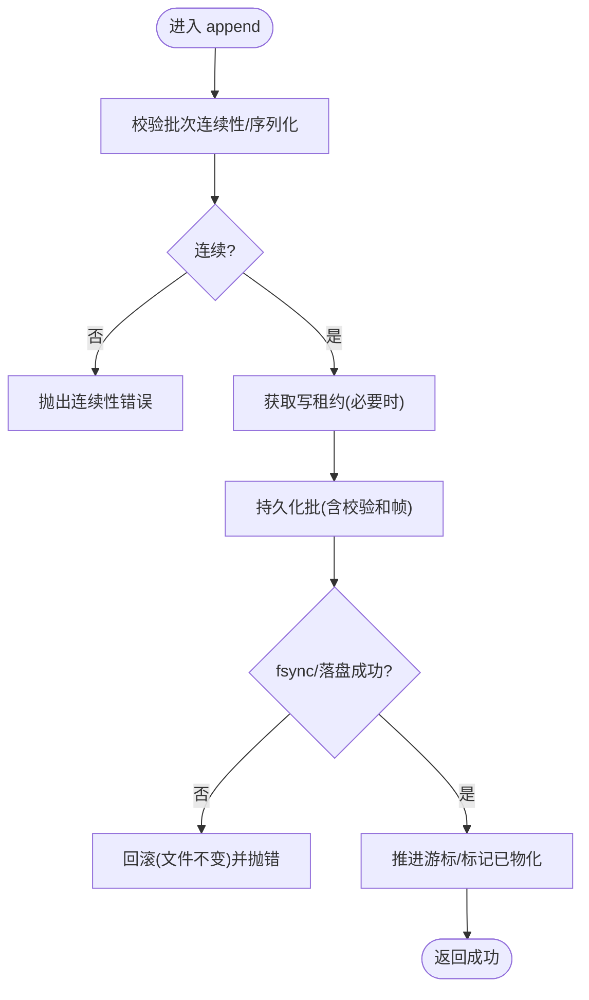
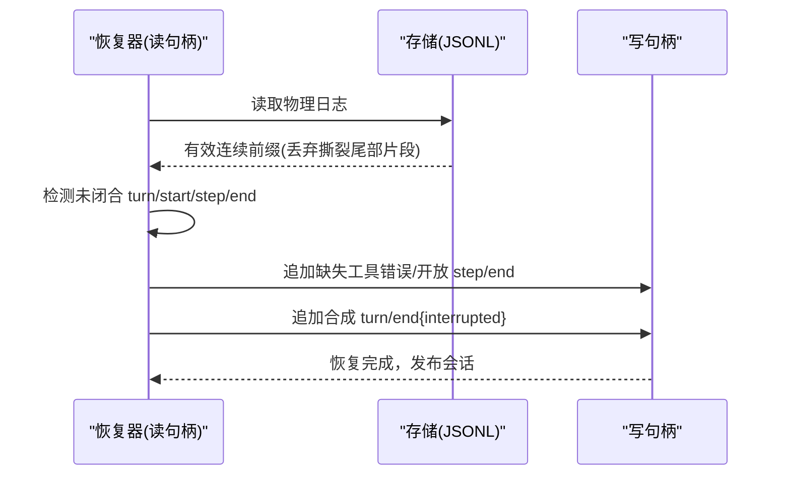
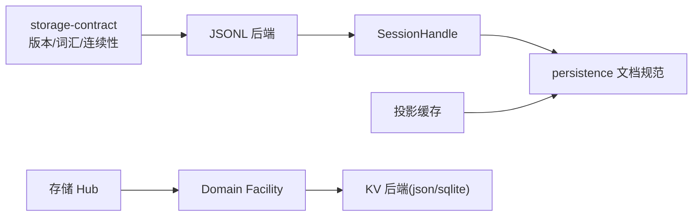

# 可靠性保证

<cite>
**本文引用的文件**
- [packages/session/session-persistence/src/storage-contract.ts](file://packages/session/session-persistence/src/storage-contract.ts)
- [packages/session/session-persistence-jsonl/src/storage.ts](file://packages/session/session-persistence-jsonl/src/storage.ts)
- [docs/subsystems/persistence.md](file://docs/subsystems/persistence.md)
- [packages/session/session-projection-cache/src/index.ts](file://packages/session/session-projection-cache/src/index.ts)
- [packages/storage/storage-domain/src/error.ts](file://packages/storage/storage-domain/src/error.ts)
- [packages/storage/storage-json/tests/json-backend.spec.ts](file://packages/storage/storage-json/tests/json-backend.spec.ts)
- [packages/session/session-persistence-jsonl/tests/zstd.spec.ts](file://packages/session/session-persistence-jsonl/tests/zstd.spec.ts)
- [packages/typert/protocol/src/remote-error.ts](file://packages/typert/protocol/src/remote-error.ts)
- [packages/api/gateway/src/client/index.ts](file://packages/api/gateway/src/client/index.ts)
- [packages/api/workspace-controller/src/directory-picker.ts](file://packages/api/workspace-controller/src/directory-picker.ts)
</cite>

## 目录
1. [简介](#简介)
2. [项目结构](#项目结构)
3. [核心组件](#核心组件)
4. [架构总览](#架构总览)
5. [详细组件分析](#详细组件分析)
6. [依赖关系分析](#依赖关系分析)
7. [性能考量](#性能考量)
8. [故障排查指南](#故障排查指南)
9. [结论](#结论)
10. [附录](#附录)

## 简介
本文件聚焦“持久化可靠性保证”，围绕事件日志的原子写入、回滚策略与并发控制，崩溃恢复流程（中断轮次检测、合成结束事件、数据完整性校验），备份与恢复策略（增量/全量/灾难恢复），以及数据完整性验证（校验和计算、损坏检测、自动修复）进行系统化说明。同时提供面向开发者的实践指引：如何处理持久化错误、实现自定义恢复逻辑、监控存储健康状态，并给出可操作的配置与排障建议。

## 项目结构
- 会话事件日志的持久化抽象与JSONL后端实现位于 session-persistence 与 session-persistence-jsonl 包中，通过 SessionHandle 暴露 read/append/flush/close 能力，并以单写者所有权保障一致性。
- 投影缓存（session-projection-cache）在关键边界（如 turn/end）做失败软检查点，确保查询侧快速一致视图。
- 通用存储子系统 storage 提供 KV 域抽象与后端（json/sqlite），用于非事件日志数据的持久化。
- 文档 subsystems/persistence.md 对持久化语义、崩溃恢复、格式拒绝等做了权威描述。

**图示来源**
- [packages/session/session-persistence-jsonl/src/storage.ts:84-178](file://packages/session/session-persistence-jsonl/src/storage.ts#L84-L178)
- [docs/subsystems/persistence.md:9-12](file://docs/subsystems/persistence.md#L9-L12)
- [packages/storage/storage-domain/src/spec.ts](file://packages/storage/storage-domain/src/spec.ts)

**章节来源**
- [docs/subsystems/persistence.md:9-12](file://docs/subsystems/persistence.md#L9-L12)
- [packages/session/session-persistence-jsonl/src/storage.ts:84-178](file://packages/session/session-persistence-jsonl/src/storage.ts#L84-L178)

## 核心组件
- SessionHandle（读/写通道）：以句柄为中心的单写者模型，read 返回有效连续前缀，append 追加连续批次，flush 作为持久化屏障，close 释放资源并保证最终排空。
- JSONL 后端：按会话维护追加式日志，默认使用带校验和的 Zstandard 帧；支持 torn-tail 截断与恢复重写；跨进程写锁保障互斥。
- 投影缓存：在 turn/end 等强制点进行失败软检查点，失败不阻塞主路径，下次强制点自愈。
- 存储子系统：为 KV 数据提供统一域抽象与后端路由，支持单文件或每记录文档布局，具备版本兼容与无效记录备份跳过策略。

**章节来源**
- [docs/subsystems/persistence.md:9-12](file://docs/subsystems/persistence.md#L9-L12)
- [packages/session/session-persistence-jsonl/src/storage.ts:84-178](file://packages/session/session-persistence-jsonl/src/storage.ts#L84-L178)
- [packages/session/session-projection-cache/src/index.ts:237-262](file://packages/session/session-projection-cache/src/index.ts#L237-L262)
- [docs/subsystems/storage.md:26-48](file://docs/subsystems/storage.md#L26-L48)

## 架构总览
下图展示了从应用到持久化的关键调用链与一致性保障点：

**图示来源**
- [packages/session/session-persistence-jsonl/src/storage.ts:148-178](file://packages/session/session-persistence-jsonl/src/storage.ts#L148-L178)
- [packages/session/session-persistence-jsonl/src/storage.ts:284-309](file://packages/session/session-persistence-jsonl/src/storage.ts#L284-L309)

## 详细组件分析

### 事务一致性与原子写入
- 原子性：JSONL 后端以“批”为单位写入，每个批包含完整的事件序列，并在落盘后推进游标；失败时保持原状，由上层重试。
- 连续性：写入前严格校验 seq 连续性，防止乱序或覆盖。
- 持久化屏障：flush 是唯一的持久化承诺点；对于空会话，flush 会物化头部使其可被列出。
- 并发控制：同一会话仅允许一个活跃写句柄；跨进程通过写租约（write lease）互斥。

**图示来源**
- [packages/session/session-persistence-jsonl/src/storage.ts:148-178](file://packages/session/session-persistence-jsonl/src/storage.ts#L148-L178)
- [packages/session/session-persistence-jsonl/src/storage.ts:284-309](file://packages/session/session-persistence-jsonl/src/storage.ts#L284-L309)
- [packages/session/session-persistence/src/storage-contract.ts:139-151](file://packages/session/session-persistence/src/storage-contract.ts#L139-L151)

**章节来源**
- [packages/session/session-persistence-jsonl/src/storage.ts:148-178](file://packages/session/session-persistence-jsonl/src/storage.ts#L148-L178)
- [packages/session/session-persistence-jsonl/src/storage.ts:284-309](file://packages/session/session-persistence-jsonl/src/storage.ts#L284-L309)
- [packages/session/session-persistence/src/storage-contract.ts:139-151](file://packages/session/session-persistence/src/storage-contract.ts#L139-L151)

### 回滚策略
- 写失败回滚：当 fsync 或底层写入失败时，JSONL 后端保证文件内容不变，上层捕获错误并重试下一批。
- 内存一致性：存储子系统的 KV 写入先持久化再更新内存，失败不改变内存，避免脏读。
- 关闭兜底：句柄 close 会尽力排空缓冲并释放租约，即使部分步骤失败也会聚合异常上报。

**章节来源**
- [packages/session/session-persistence-jsonl/tests/zstd.spec.ts:737-768](file://packages/session/session-persistence-jsonl/tests/zstd.spec.ts#L737-L768)
- [packages/storage/storage-json/tests/json-backend.spec.ts:83-108](file://packages/storage/storage-json/tests/json-backend.spec.ts#L83-L108)
- [packages/session/session-persistence-jsonl/src/storage.ts:180-226](file://packages/session/session-persistence-jsonl/src/storage.ts#L180-L226)

### 并发控制
- 单写者：同一会话在同一进程内仅允许一个写句柄；重复 open('write') 直接拒绝。
- 跨进程互斥：首次物化写时获取写租约，贯穿句柄生命周期，避免多进程竞争。
- 读可见性：读句柄始终返回有效连续前缀，不会观察到比之前更短的逻辑日志。

**章节来源**
- [packages/session/session-persistence-jsonl/src/storage.ts:311-320](file://packages/session/session-persistence-jsonl/src/storage.ts#L311-L320)
- [packages/session/session-persistence-jsonl/src/storage.ts:117-146](file://packages/session/session-persistence-jsonl/src/storage.ts#L117-L146)

### 崩溃恢复流程
- 中断轮次检测：冷启动读取物理有效连续日志；若存在未闭合的 turn/start 且无对应 turn/end，则判定为中断轮次。
- 合成结束事件：恢复阶段通过写句柄追加缺失的工具错误、开放 step/end 及合成的 turn/end{reason:interrupted}，使逻辑日志完整。
- 数据完整性校验：JSONL 后端在首次新写入前截断撕裂尾部，并将从撕裂帧中恢复的完整记录重写到磁盘；读取端拒绝未知事件类型或未来版本。

**图示来源**
- [docs/subsystems/persistence.md:95-101](file://docs/subsystems/persistence.md#L95-L101)
- [packages/session/session-persistence-jsonl/src/storage.ts:284-309](file://packages/session/session-persistence-jsonl/src/storage.ts#L284-L309)

**章节来源**
- [docs/subsystems/persistence.md:95-101](file://docs/subsystems/persistence.md#L95-L101)
- [packages/session/session-persistence-jsonl/src/storage.ts:284-309](file://packages/session/session-persistence-jsonl/src/storage.ts#L284-L309)

### 备份与恢复策略
- 增量备份：基于事件日志的追加特性，可按时间或轮次增量复制新增帧；投影缓存的失败软检查点可作为轻量级快照点。
- 全量备份：导出会话目录下的 JSONL 日志与头部元数据；KV 域可使用 per-record 布局便于逐条备份。
- 灾难恢复：冷启动时读取最新可用日志，执行恢复阶段的合成事件补齐；KV 域遇到无效记录可选择“备份并跳过”继续启动。

**章节来源**
- [packages/session/session-projection-cache/src/index.ts:354-385](file://packages/session/session-projection-cache/src/index.ts#L354-L385)
- [docs/subsystems/storage.md:54-92](file://docs/subsystems/storage.md#L54-L92)

### 数据完整性验证
- 校验和计算：JSONL 后端默认使用带校验和的 Zstandard 帧，落盘失败时回滚文件，保证一致性。
- 损坏检测：读取端拒绝未知事件类型或未来版本；对历史遗留形状进行拒绝或迁移限制。
- 自动修复：首次写入前截断撕裂尾部，并将恢复出的完整记录重写；KV 域支持将损坏记录备份并跳过，避免阻断启动。

**章节来源**
- [packages/session/session-persistence-jsonl/tests/zstd.spec.ts:737-768](file://packages/session/session-persistence-jsonl/tests/zstd.spec.ts#L737-L768)
- [packages/session/session-persistence/src/storage-contract.ts:41-104](file://packages/session/session-persistence/src/storage-contract.ts#L41-L104)
- [docs/subsystems/storage.md:54-92](file://docs/subsystems/storage.md#L54-L92)

### 代码示例与最佳实践（路径引用）
- 处理持久化错误
  - 捕获 append/flush 失败并触发重试与告警：[packages/session/session-persistence-jsonl/src/storage.ts:148-178](file://packages/session/session-persistence-jsonl/src/storage.ts#L148-L178)
  - 关闭时聚合异常并释放租约：[packages/session/session-persistence-jsonl/src/storage.ts:180-226](file://packages/session/session-persistence-jsonl/src/storage.ts#L180-L226)
  - 远程错误封装与分类（跨进程边界）：[packages/typert/protocol/src/remote-error.ts:1-31](file://packages/typert/protocol/src/remote-error.ts#L1-L31)，[packages/api/gateway/src/client/index.ts:731-755](file://packages/api/gateway/src/client/index.ts#L731-L755)，[packages/api/workspace-controller/src/directory-picker.ts:151-174](file://packages/api/workspace-controller/src/directory-picker.ts#L151-L174)
- 实现自定义恢复逻辑
  - 读取物理日志并检测未闭合轮次，追加合成结束事件：[docs/subsystems/persistence.md:95-101](file://docs/subsystems/persistence.md#L95-L101)
  - 在首次写入前截断撕裂尾部并重写恢复记录：[packages/session/session-persistence-jsonl/src/storage.ts:284-309](file://packages/session/session-persistence-jsonl/src/storage.ts#L284-L309)
- 监控存储健康状态
  - 投影缓存失败软检查点与自愈：[packages/session/session-projection-cache/src/index.ts:354-385](file://packages/session/session-projection-cache/src/index.ts#L354-L385)
  - KV 域变更事件与错误码：[docs/subsystems/storage.md:132-153](file://docs/subsystems/storage.md#L132-L153)，[packages/storage/storage-domain/src/error.ts:37-53](file://packages/storage/storage-domain/src/error.ts#L37-L53)

## 依赖关系分析
- 会话持久化依赖 JSONL 后端与共享契约（storage-contract），后者负责版本门控、事件词汇表拒绝、批次物化与连续性校验。
- 投影缓存依赖会话服务与存储后端，在 turn/end 等强制点写入检查点，失败不影响主路径。
- 存储子系统通过 hub 注册后端，消费者通过 domain facility 打开域，读写链顺序保证内存与介质一致。

**图示来源**
- [packages/session/session-persistence/src/storage-contract.ts:1-152](file://packages/session/session-persistence/src/storage-contract.ts#L1-L152)
- [packages/session/session-persistence-jsonl/src/storage.ts:84-178](file://packages/session/session-persistence-jsonl/src/storage.ts#L84-L178)
- [docs/subsystems/storage.md:26-48](file://docs/subsystems/storage.md#L26-L48)

**章节来源**
- [packages/session/session-persistence/src/storage-contract.ts:1-152](file://packages/session/session-persistence/src/storage-contract.ts#L1-L152)
- [packages/session/session-persistence-jsonl/src/storage.ts:84-178](file://packages/session/session-persistence-jsonl/src/storage.ts#L84-L178)
- [docs/subsystems/storage.md:26-48](file://docs/subsystems/storage.md#L26-L48)

## 性能考量
- 批量写入与超时窗口：JSONL 后端对实时事件采用有界等待窗口合并批次，降低频繁落盘开销。
- 只读优化：读句柄优先返回已观测到的前缀，避免重复扫描。
- 检查点频率：投影缓存仅在强制点（如 turn/end）写入，减少额外 IO。
- 跨进程锁粒度：写租约在首次物化时获取，贯穿句柄生命周期，避免细粒度锁竞争。

**章节来源**
- [packages/session/session-persistence-jsonl/src/storage.ts:233-282](file://packages/session/session-persistence-jsonl/src/storage.ts#L233-L282)
- [packages/session/session-persistence-jsonl/src/storage.ts:117-146](file://packages/session/session-persistence-jsonl/src/storage.ts#L117-L146)
- [packages/session/session-projection-cache/src/index.ts:237-262](file://packages/session/session-projection-cache/src/index.ts#L237-L262)

## 故障排查指南
- 常见错误与定位
  - 持续性失败：检查 append/flush 是否抛出错误，确认 fsync 与底层写入是否正常。参考：[packages/session/session-persistence-jsonl/tests/zstd.spec.ts:737-768](file://packages/session/session-persistence-jsonl/tests/zstd.spec.ts#L737-L768)
  - 远程调用失败：区分取消与内部错误，使用 RemoteError 分类。参考：[packages/typert/protocol/src/remote-error.ts:1-31](file://packages/typert/protocol/src/remote-error.ts#L1-L31)，[packages/api/gateway/src/client/index.ts:731-755](file://packages/api/gateway/src/client/index.ts#L731-L755)
  - KV 域无效记录：根据 spec 的 invalidRecords 策略决定“备份并跳过”或拒绝。参考：[docs/subsystems/storage.md:54-92](file://docs/subsystems/storage.md#L54-L92)，[packages/storage/storage-domain/src/error.ts:37-53](file://packages/storage/storage-domain/src/error.ts#L37-L53)
- 恢复与自愈
  - 冷启动检测未闭合轮次并合成结束事件，确保逻辑日志完整。参考：[docs/subsystems/persistence.md:95-101](file://docs/subsystems/persistence.md#L95-L101)
  - 投影缓存失败软检查点，待下一个强制点自愈。参考：[packages/session/session-projection-cache/src/index.ts:354-385](file://packages/session/session-projection-cache/src/index.ts#L354-L385)
- 监控指标建议
  - 记录 append/flush 延迟与失败率
  - 监控 torn-tail 截断与恢复次数
  - 跟踪投影缓存检查点写入成功率与自愈次数
  - 统计 KV 域变更事件与无效记录备份次数

**章节来源**
- [packages/session/session-persistence-jsonl/tests/zstd.spec.ts:737-768](file://packages/session/session-persistence-jsonl/tests/zstd.spec.ts#L737-L768)
- [packages/typert/protocol/src/remote-error.ts:1-31](file://packages/typert/protocol/src/remote-error.ts#L1-L31)
- [packages/api/gateway/src/client/index.ts:731-755](file://packages/api/gateway/src/client/index.ts#L731-L755)
- [docs/subsystems/storage.md:54-92](file://docs/subsystems/storage.md#L54-L92)
- [packages/storage/storage-domain/src/error.ts:37-53](file://packages/storage/storage-domain/src/error.ts#L37-L53)
- [packages/session/session-projection-cache/src/index.ts:354-385](file://packages/session/session-projection-cache/src/index.ts#L354-L385)

## 结论
该代码库通过“句柄+单写者+持久化屏障”的设计实现了高可靠的会话事件日志持久化；JSONL 后端的校验和与 torn-tail 处理保障了介质层面的健壮性；投影缓存与 KV 域的失败软策略提升了整体可用性。结合规范的崩溃恢复流程与完善的错误分类，系统能够在多种故障场景下保持稳定与可恢复。

## 附录
- 配置要点
  - 启用 JSONL 后端的校验和与 fsync（默认行为）
  - 合理设置投影缓存的检查点触发点（如 turn/end）
  - 为 KV 域选择合适布局（single/per-record）与 invalidRecords 策略
- 运维建议
  - 定期备份会话目录与 KV 域文件
  - 建立监控与告警：持久化失败、torn-tail 恢复、投影缓存失败、KV 无效记录
  - 演练灾难恢复：冷启动恢复、合成事件补齐、KV 域恢复