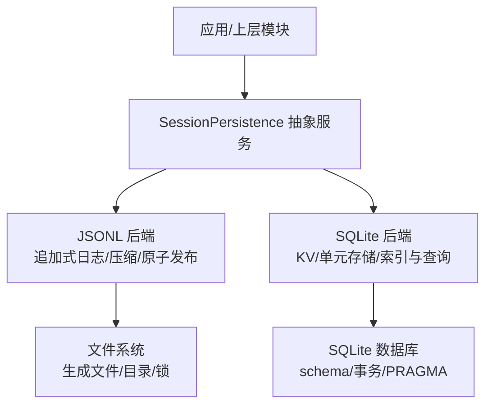
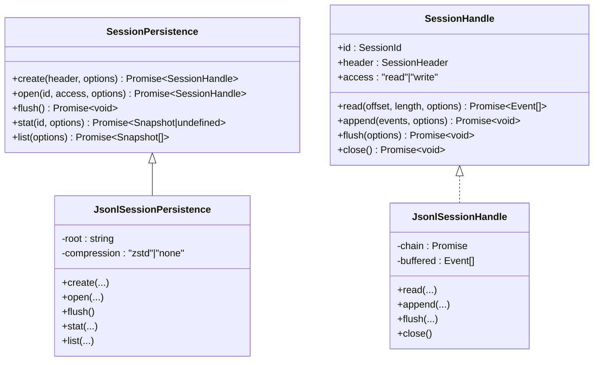
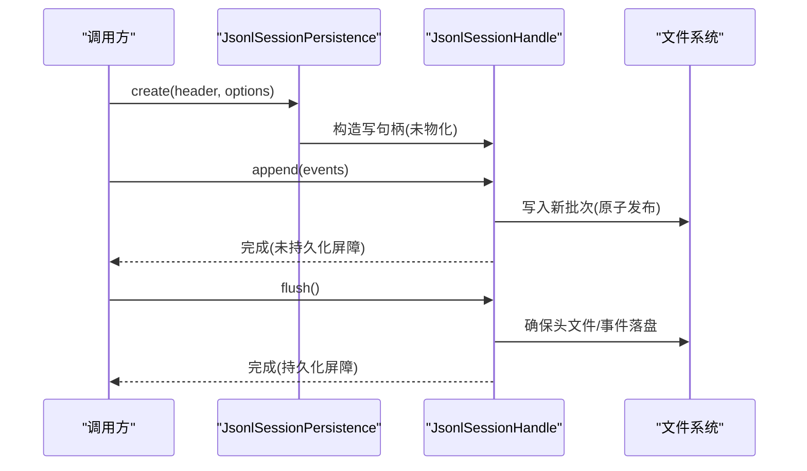
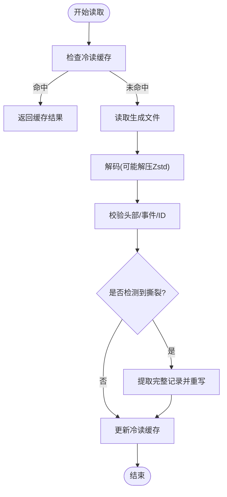
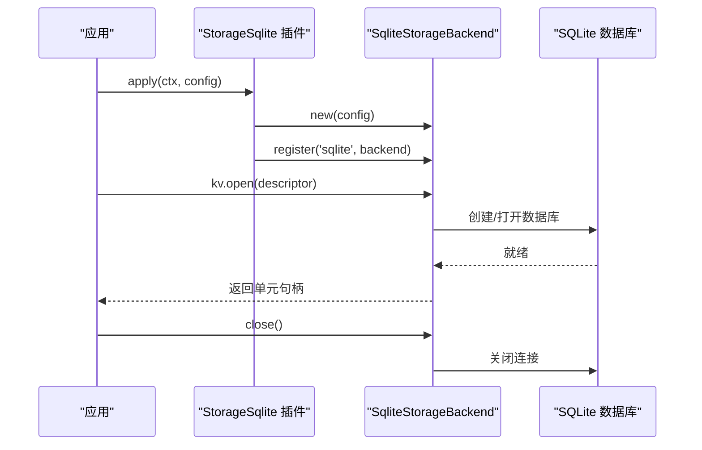
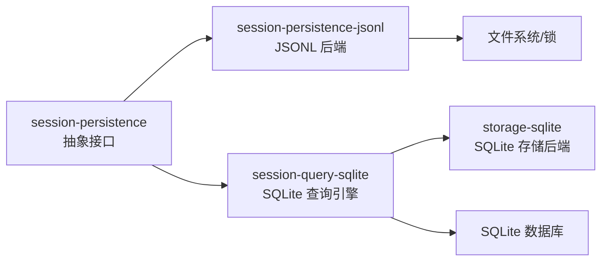

# 存储后端

<cite>
**本文引用的文件**
- [packages/session/session-persistence/src/index.ts](file://packages/session/session-persistence/src/index.ts)
- [packages/session/session-persistence/src/handle.ts](file://packages/session/session-persistence/src/handle.ts)
- [packages/session/session-persistence/src/errors.ts](file://packages/session/session-persistence/src/errors.ts)
- [packages/session/session-persistence-jsonl/src/index.ts](file://packages/session/session-persistence-jsonl/src/index.ts)
- [packages/session/session-persistence-jsonl/src/storage.ts](file://packages/session/session-persistence-jsonl/src/storage.ts)
- [packages/session/session-persistence-jsonl/src/format.ts](file://packages/session/session-persistence-jsonl/src/format.ts)
- [packages/session/session-persistence-jsonl/src/generation.ts](file://packages/session/session-persistence-jsonl/src/generation.ts)
- [packages/session/session-persistence-jsonl/src/zstd.ts](file://packages/session/session-persistence-jsonl/src/zstd.ts)
- [packages/storage/storage-sqlite/src/index.ts](file://packages/storage/storage-sqlite/src/index.ts)
- [packages/session-query/session-query-sqlite/src/schema.ts](file://packages/session-query/session-query-sqlite/src/schema.ts)
</cite>

## 目录
1. [简介](#简介)
2. [项目结构](#项目结构)
3. [核心组件](#核心组件)
4. [架构总览](#架构总览)
5. [详细组件分析](#详细组件分析)
6. [依赖关系分析](#依赖关系分析)
7. [性能考量](#性能考量)
8. [故障排查指南](#故障排查指南)
9. [结论](#结论)
10. [附录：实现与集成示例](#附录：实现与集成示例)

## 简介
本文件聚焦于会话持久化存储后端的抽象接口与两种具体实现：JSONL 后端与 SQLite 后端。内容涵盖 SessionPersistence 抽象接口设计、JSONL 的追加式日志、原子写入、崩溃恢复与压缩存储，以及 SQLite 的表结构、块级存储、查询优化与事务保证。文末提供选择指南、配置选项与自定义后端集成方案，帮助开发者在正确场景下选择合适的后端并稳定集成。

## 项目结构
- 抽象层：session-persistence 定义统一的持久化服务与句柄契约，所有后端必须遵循该契约。
- JSONL 后端：session-persistence-jsonl 基于不可变生成文件（generation）与可选 Zstandard 压缩，提供追加式日志、原子发布、崩溃恢复与冷读缓存。
- SQLite 相关：storage-sqlite 提供通用 KV/单元存储后端；session-query-sqlite 使用 SQLite 构建会话索引与查询能力，具备 schema 校验与迁移策略。

图表来源
- [packages/session/session-persistence/src/index.ts:134-198](file://packages/session/session-persistence/src/index.ts#L134-L198)
- [packages/session/session-persistence-jsonl/src/index.ts:146-197](file://packages/session/session-persistence-jsonl/src/index.ts#L146-L197)
- [packages/storage/storage-sqlite/src/index.ts:158-168](file://packages/storage/storage-sqlite/src/index.ts#L158-L168)
- [packages/session-query/session-query-sqlite/src/schema.ts:63-101](file://packages/session-query/session-query-sqlite/src/schema.ts#L63-L101)

章节来源
- [packages/session/session-persistence/src/index.ts:134-198](file://packages/session/session-persistence/src/index.ts#L134-L198)
- [packages/session/session-persistence-jsonl/src/index.ts:146-197](file://packages/session/session-persistence-jsonl/src/index.ts#L146-L197)
- [packages/storage/storage-sqlite/src/index.ts:158-168](file://packages/storage/storage-sqlite/src/index.ts#L158-L168)

## 核心组件
- SessionPersistence 抽象服务：定义 create/open/flush/stat/list 等核心方法，统一跨后端的行为语义（追加式日志、可见性、刷新屏障）。
- SessionHandle 句柄：每个会话的读写通道，支持 read/append/flush/close，保证单写者、顺序追加与一致性读取。
- 错误体系：未找到、已存在、只读操作、所有权丢失、损坏、格式不支持等稳定错误类型，便于上层统一处理。

章节来源
- [packages/session/session-persistence/src/index.ts:134-198](file://packages/session/session-persistence/src/index.ts#L134-L198)
- [packages/session/session-persistence/src/handle.ts:14-106](file://packages/session/session-persistence/src/handle.ts#L14-L106)
- [packages/session/session-persistence/src/errors.ts:13-138](file://packages/session/session-persistence/src/errors.ts#L13-L138)

## 架构总览

图表来源
- [packages/session/session-persistence/src/index.ts:134-198](file://packages/session/session-persistence/src/index.ts#L134-L198)
- [packages/session/session-persistence/src/handle.ts:14-106](file://packages/session/session-persistence/src/handle.ts#L14-L106)
- [packages/session/session-persistence-jsonl/src/index.ts:146-197](file://packages/session/session-persistence-jsonl/src/index.ts#L146-L197)
- [packages/session/session-persistence-jsonl/src/storage.ts:84-341](file://packages/session/session-persistence-jsonl/src/storage.ts#L84-L341)

## 详细组件分析

### SessionPersistence 抽象接口
- create：创建新会话并获取写句柄，支持继承事件计数以标记 fork 谱系。
- open：打开已有会话为读或写；写模式独占所有权，读模式可并发。
- flush：服务级刷新屏障，确保所有活跃写句柄的缓冲落盘。
- stat/list：轻量元数据观察，返回包含 revision 的可比较令牌，用于缓存失效。
- 语义约定：事件从 seq 0 连续追加且永不重写；物理尾部撕裂不会被读者看到；append 尽力而为，flush 才是持久化屏障。

章节来源
- [packages/session/session-persistence/src/index.ts:134-198](file://packages/session/session-persistence/src/index.ts#L134-L198)
- [packages/session/session-persistence/src/handle.ts:14-106](file://packages/session/session-persistence/src/handle.ts#L14-L106)

### JSONL 后端：追加式日志、原子写入、崩溃恢复、压缩存储
- 文件组织：按项目目录与会话目录组织，每会话一个“生成”（generation）文件集合，当前版本通过不可变文件链接到最新快照。
- 追加与原子发布：新批次写入临时文件，完成后原子替换 current 指针，避免读者读到半写状态。
- 压缩存储：默认 Zstandard 帧压缩，首帧仅含头部行，解码时逐帧流式处理，支持大日志高效存储与读取。
- 崩溃恢复：检测最终帧撕裂，提取完整记录作为 recoveredTail，并在首次新追加前截断并重写，确保一致性。
- 可见性与缓存：冷读 LRU 缓存最近解析的日志，结合文件 revision 保证一致性与性能。
- 进程内写者跟踪：维护 pending 会话与活跃写者，确保单写者与跨进程写锁（目录级内核锁）。

图表来源
- [packages/session/session-persistence-jsonl/src/index.ts:219-238](file://packages/session/session-persistence-jsonl/src/index.ts#L219-L238)
- [packages/session/session-persistence-jsonl/src/storage.ts:153-178](file://packages/session/session-persistence-jsonl/src/storage.ts#L153-L178)
- [packages/session/session-persistence-jsonl/src/index.ts:563-589](file://packages/session/session-persistence-jsonl/src/index.ts#L563-L589)

图表来源
- [packages/session/session-persistence-jsonl/src/index.ts:468-538](file://packages/session/session-persistence-jsonl/src/index.ts#L468-L538)
- [packages/session/session-persistence-jsonl/src/index.ts:645-729](file://packages/session/session-persistence-jsonl/src/index.ts#L645-L729)

章节来源
- [packages/session/session-persistence-jsonl/src/index.ts:146-197](file://packages/session/session-persistence-jsonl/src/index.ts#L146-L197)
- [packages/session/session-persistence-jsonl/src/index.ts:219-382](file://packages/session/session-persistence-jsonl/src/index.ts#L219-L382)
- [packages/session/session-persistence-jsonl/src/index.ts:468-538](file://packages/session/session-persistence-jsonl/src/index.ts#L468-L538)
- [packages/session/session-persistence-jsonl/src/index.ts:563-600](file://packages/session/session-persistence-jsonl/src/index.ts#L563-L600)
- [packages/session/session-persistence-jsonl/src/index.ts:645-729](file://packages/session/session-persistence-jsonl/src/index.ts#L645-L729)
- [packages/session/session-persistence-jsonl/src/storage.ts:84-341](file://packages/session/session-persistence-jsonl/src/storage.ts#L84-L341)
- [packages/session/session-persistence-jsonl/src/storage.ts:357-533](file://packages/session/session-persistence-jsonl/src/storage.ts#L357-L533)
- [packages/session/session-persistence-jsonl/src/format.ts:1-200](file://packages/session/session-persistence-jsonl/src/format.ts#L1-L200)
- [packages/session/session-persistence-jsonl/src/generation.ts:1-200](file://packages/session/session-persistence-jsonl/src/generation.ts#L1-L200)
- [packages/session/session-persistence-jsonl/src/zstd.ts:1-200](file://packages/session/session-persistence-jsonl/src/zstd.ts#L1-L200)

### SQLite 后端：表结构设计、块级存储、查询优化、事务保证
- 注册与生命周期：通过 storage-sqlite 将 sqlite 后端注册到存储中心，插件作用域内提供 backend 实例，dispose 时关闭连接并注销。
- 单元与表：以“单元描述符”声明表结构与版本，开启 STRICT 表约束，自动维护 units 元数据表与 user_version。
- Schema 安全：启动时校验 application_id、拒绝未知用户表，必要时重置派生表并重建 schema。
- PRAGMA 控制：设置 journal_mode 等参数，确保事务与一致性行为符合预期。
- 会话查询：session-query-sqlite 利用 SQLite 建立索引与视图，支持搜索与统计，配合 schema 版本管理进行迁移。

图表来源
- [packages/storage/storage-sqlite/src/index.ts:158-168](file://packages/storage/storage-sqlite/src/index.ts#L158-L168)
- [packages/storage/storage-sqlite/tests/sqlite-backend.spec.ts:53-73](file://packages/storage/storage-sqlite/tests/sqlite-backend.spec.ts#L53-L73)
- [packages/session-query/session-query-sqlite/src/schema.ts:63-101](file://packages/session-query/session-query-sqlite/src/schema.ts#L63-L101)

章节来源
- [packages/storage/storage-sqlite/src/index.ts:135-168](file://packages/storage/storage-sqlite/src/index.ts#L135-L168)
- [packages/storage/storage-sqlite/tests/sqlite-backend.spec.ts:227-262](file://packages/storage/storage-sqlite/tests/sqlite-backend.spec.ts#L227-L262)
- [packages/session-query/session-query-sqlite/src/schema.ts:63-101](file://packages/session-query/session-query-sqlite/src/schema.ts#L63-L101)

### 两种后端对比与适用场景
- JSONL 后端
  - 优势：追加式日志天然适合事件溯源；压缩存储降低体积；原子发布与崩溃恢复保障一致性；冷读缓存提升重复读取性能。
  - 适用：高吞吐追加、需要强一致回放、离线归档与分析、跨进程共享日志的场景。
  - 配置：根目录 root、压缩方式 compression（zstd/none）。
- SQLite 后端
  - 优势：结构化查询能力强；事务保证；schema 管理与迁移完善；适合复杂检索与聚合。
  - 适用：需要多条件查询、统计分析、索引优化的场景。
  - 配置：数据库路径 path、journal_mode 等 PRAGMA 参数。

[本节为概念性对比，不直接分析具体代码文件]

## 依赖关系分析

图表来源
- [packages/session/session-persistence/src/index.ts:134-198](file://packages/session/session-persistence/src/index.ts#L134-L198)
- [packages/session/session-persistence-jsonl/src/index.ts:146-197](file://packages/session/session-persistence-jsonl/src/index.ts#L146-L197)
- [packages/storage/storage-sqlite/src/index.ts:158-168](file://packages/storage/storage-sqlite/src/index.ts#L158-L168)
- [packages/session-query/session-query-sqlite/src/schema.ts:63-101](file://packages/session-query/session-query-sqlite/src/schema.ts#L63-L101)

章节来源
- [packages/session/session-persistence/src/index.ts:134-198](file://packages/session/session-persistence/src/index.ts#L134-L198)
- [packages/session/session-persistence-jsonl/src/index.ts:146-197](file://packages/session/session-persistence-jsonl/src/index.ts#L146-L197)
- [packages/storage/storage-sqlite/src/index.ts:158-168](file://packages/storage/storage-sqlite/src/index.ts#L158-L168)
- [packages/session-query/session-query-sqlite/src/schema.ts:63-101](file://packages/session-query/session-query-sqlite/src/schema.ts#L63-L101)

## 性能考量
- JSONL
  - 追加批量与延迟批处理：事件入队后在固定窗口内合并写入，减少系统调用次数。
  - 压缩与流式解码：Zstandard 帧解码分片执行，避免长时间阻塞事件循环。
  - 冷读缓存：对近期访问的会话日志进行 LRU 缓存，结合文件 revision 保证一致性。
- SQLite
  - 事务与 PRAGMA：合理设置 journal_mode 等参数，平衡一致性与吞吐。
  - 索引与查询：针对常用查询字段建立索引，避免全表扫描。
  - Schema 迁移：识别不兼容版本时重置派生表，确保升级过程安全。

[本节提供一般性指导，不直接分析具体代码文件]

## 故障排查指南
- 常见错误类型
  - 未找到：请求的会话无持久化日志。
  - 已存在/已拥有：重复创建或写所有权冲突。
  - 只读操作：在只读句柄上执行 append/flush。
  - 所有权丢失：跨进程写锁失效，需重新打开写句柄。
  - 损坏/格式不支持：日志校验失败或版本不兼容，附带原始日志位置以便定位。
- 建议处理策略
  - 捕获稳定错误类型，区分“不存在/损坏/格式不支持”，对后者提供用户提示与回退路径。
  - 对于 JSONL 撕裂恢复，关注日志中关于 torn tail 的警告信息，确认后续追加是否成功。
  - 对于 SQLite，检查 schema 版本与 PRAGMA 配置，确保数据库未被外部工具修改。

章节来源
- [packages/session/session-persistence/src/errors.ts:13-138](file://packages/session/session-persistence/src/errors.ts#L13-L138)
- [packages/session/session-persistence-jsonl/src/index.ts:437-458](file://packages/session/session-persistence-jsonl/src/index.ts#L437-L458)
- [packages/session/session-persistence-jsonl/src/index.ts:596-600](file://packages/session/session-persistence-jsonl/src/index.ts#L596-L600)
- [packages/session-query/session-query-sqlite/src/schema.ts:63-101](file://packages/session-query/session-query-sqlite/src/schema.ts#L63-L101)

## 结论
SessionPersistence 抽象提供了统一、稳定的持久化语义，JSONL 后端擅长事件溯源与高吞吐追加，SQLite 后端擅长结构化查询与事务保证。根据业务需求选择合适后端，并结合配置与错误处理策略，可实现高性能、可靠的会话存储方案。

[本节为总结性内容，不直接分析具体代码文件]

## 附录：实现与集成示例

### 自定义存储后端（最小实现要点）
- 继承 SessionPersistence 并实现 create/open/flush/stat/list。
- 实现 SessionHandle 的 read/append/flush/close，保证追加顺序、可见性与刷新屏障。
- 使用错误体系抛出稳定错误，便于上层统一处理。
- 参考 JSONL 后端的 handle 与 tracker 模式，管理写者所有权与后台缓冲。

章节来源
- [packages/session/session-persistence/src/index.ts:134-198](file://packages/session/session-persistence/src/index.ts#L134-L198)
- [packages/session/session-persistence/src/handle.ts:14-106](file://packages/session/session-persistence/src/handle.ts#L14-L106)
- [packages/session/session-persistence-jsonl/src/storage.ts:84-341](file://packages/session/session-persistence-jsonl/src/storage.ts#L84-L341)

### 选择合适后端
- 选择 JSONL：需要事件溯源、追加为主、压缩存储、崩溃恢复。
- 选择 SQLite：需要复杂查询、统计、索引、事务一致性。
- 混合使用：JSONL 负责事件日志，SQLite 负责索引与查询，通过事件投影同步。

[本节为概念性指导，不直接分析具体代码文件]

### 处理存储错误
- 捕获 SessionPersistenceNotFoundError/SessionAlreadyExistsError/SessionReadOnlyError/SessionOwnershipLostError/SessionPersistenceCorruptionError/SessionFormatUnsupportedError。
- 对 JSONL 的撕裂恢复与格式不支持错误，记录原始日志位置并提示升级或修复。
- 对 SQLite 的 schema 不兼容，允许重置派生表并重建索引。

章节来源
- [packages/session/session-persistence/src/errors.ts:13-138](file://packages/session/session-persistence/src/errors.ts#L13-L138)
- [packages/session/session-persistence-jsonl/src/index.ts:437-458](file://packages/session/session-persistence-jsonl/src/index.ts#L437-L458)
- [packages/session-query/session-query-sqlite/src/schema.ts:63-101](file://packages/session-query/session-query-sqlite/src/schema.ts#L63-L101)