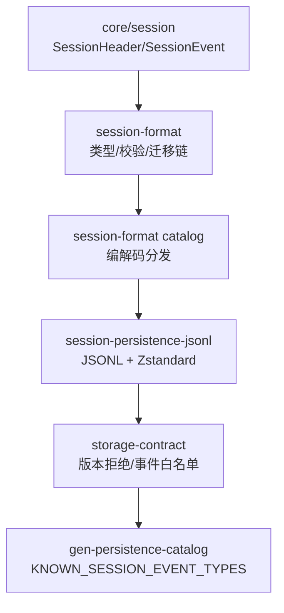
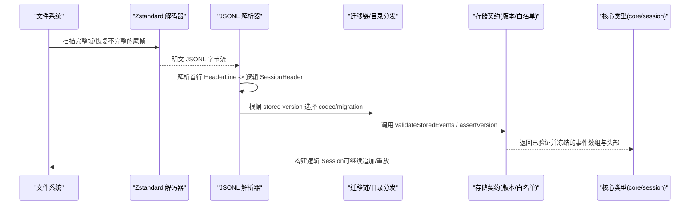
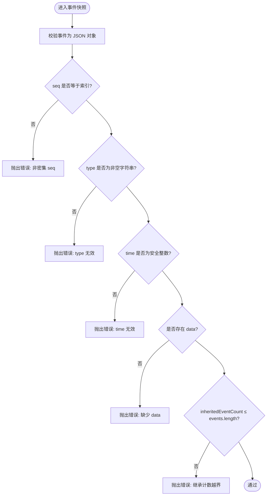
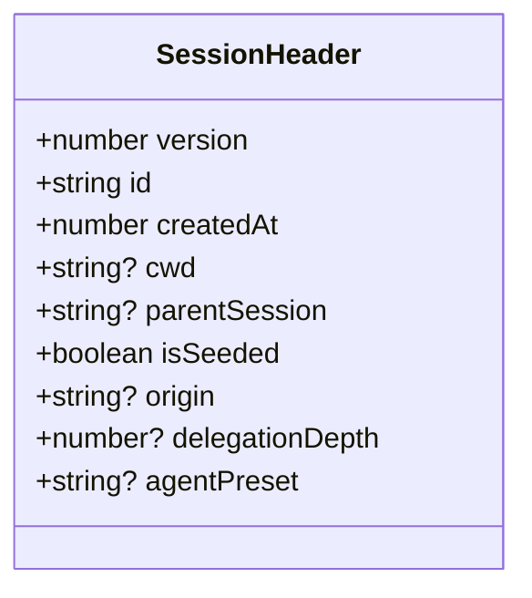
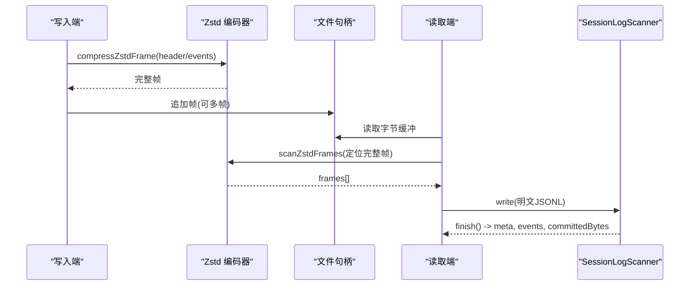
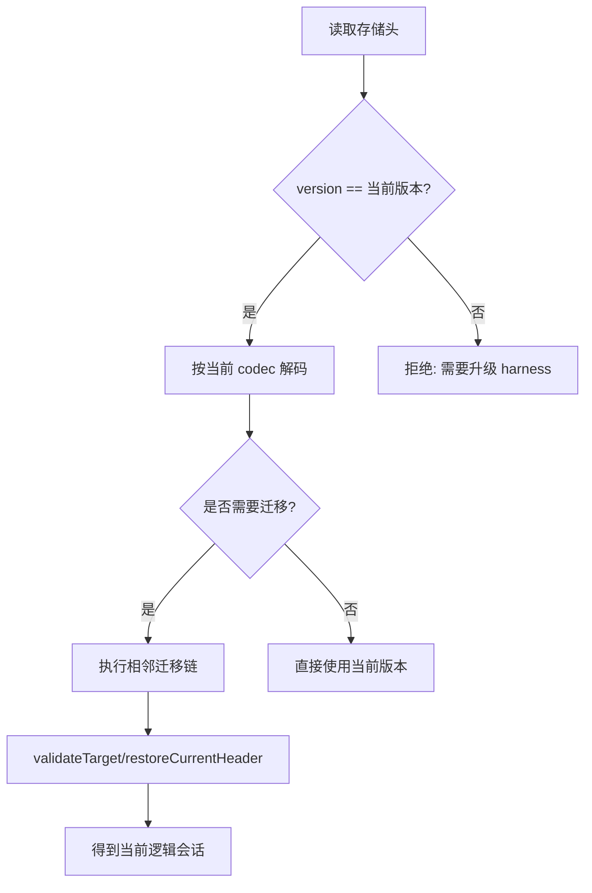
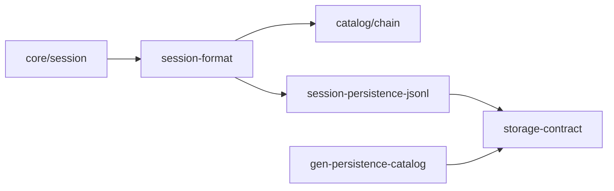

# 序列化格式

<cite>
**本文引用的文件**
- [packages/core/session/src/types.ts](file://packages/core/session/src/types.ts)
- [packages/session/session-format/src/types.ts](file://packages/session/session-format/src/types.ts)
- [packages/session/session-format/src/json.ts](file://packages/session/session-format/src/json.ts)
- [packages/session/session-format/src/chain.ts](file://packages/session/session-format/src/chain.ts)
- [packages/session/session-format/src/catalog.ts](file://packages/session/session-format/src/catalog.ts)
- [packages/session/session-format-v0-to-v1/src/payload-validation.ts](file://packages/session/session-format-v0-to-v1/src/payload-validation.ts)
- [packages/session/session-persistence-jsonl/src/format.ts](file://packages/session/session-persistence-jsonl/src/format.ts)
- [packages/session/session-persistence-jsonl/src/zstd.ts](file://packages/session/session-persistence-jsonl/src/zstd.ts)
- [packages/session/session-persistence/src/storage-contract.ts](file://packages/session/session-persistence/src/storage-contract.ts)
- [scripts/gen-persistence-catalog.ts](file://scripts/gen-persistence-catalog.ts)
</cite>

## 目录
1. [简介](#简介)
2. [项目结构](#项目结构)
3. [核心组件](#核心组件)
4. [架构总览](#架构总览)
5. [详细组件分析](#详细组件分析)
6. [依赖关系分析](#依赖关系分析)
7. [性能考量](#性能考量)
8. [故障排查指南](#故障排查指南)
9. [结论](#结论)
10. [附录：API参考与最佳实践](#附录api参考与最佳实践)

## 简介
本文件系统性说明会话事件序列化格式，覆盖以下要点：
- SessionEvent 数据结构、事件类型定义、字段校验规则与 JSON 序列化约定
- SessionHeader 元数据格式：版本控制、工作目录、会话血缘（种子边界）、委托深度等字段的含义与用途
- 事件压缩技术：Zstandard 帧、增量存储、空间优化策略
- 格式版本兼容性机制：向前兼容、向后兼容、格式拒绝策略
- 具体示例路径：如何序列化和反序列化事件、处理不同版本、实现自定义序列化逻辑
- 开发者 API 参考与最佳实践

## 项目结构
围绕“会话事件序列化”的关键代码分布在如下模块：
- 核心类型与当前格式版本：core/session 类型定义
- 通用格式抽象与校验：session-format
- 迁移链与目录编排：session-format chain/catalog
- JSONL 持久化后端（含 Zstandard 压缩）：session-persistence-jsonl
- 存储契约与版本拒绝：session-persistence storage-contract
- 已知事件类型注册表生成：scripts/gen-persistence-catalog

**图示来源**
- [packages/core/session/src/types.ts:88-128](file://packages/core/session/src/types.ts#L88-L128)
- [packages/session/session-format/src/types.ts:15-42](file://packages/session/session-format/src/types.ts#L15-L42)
- [packages/session/session-format/src/catalog.ts:29-37](file://packages/session/session-format/src/catalog.ts#L29-L37)
- [packages/session/session-persistence-jsonl/src/format.ts:29-55](file://packages/session/session-persistence-jsonl/src/format.ts#L29-L55)
- [packages/session/session-persistence/src/storage-contract.ts:41-53](file://packages/session/session-persistence/src/storage-contract.ts#L41-L53)
- [scripts/gen-persistence-catalog.ts:418-434](file://scripts/gen-persistence-catalog.ts#L418-L434)

**章节来源**
- [packages/core/session/src/types.ts:88-128](file://packages/core/session/src/types.ts#L88-L128)
- [packages/session/session-format/src/types.ts:15-42](file://packages/session/session-format/src/types.ts#L15-L42)
- [packages/session/session-persistence-jsonl/src/format.ts:29-55](file://packages/session/session-persistence-jsonl/src/format.ts#L29-L55)
- [packages/session/session-persistence/src/storage-contract.ts:41-53](file://packages/session/session-persistence/src/storage-contract.ts#L41-L53)
- [scripts/gen-persistence-catalog.ts:418-434](file://scripts/gen-persistence-catalog.ts#L418-L434)

## 核心组件
- 会话头与会话事件
  - SessionHeader：包含 version、id、createdAt、cwd、parentSession、isSeeded、origin、delegationDepth、agentPreset 等字段
  - SessionEvent：type、seq、time、data，以及可选 ignorable、sourceEventSeqs、surfaceOp
- 物理格式抽象
  - EncodedSessionFormatArtifact、SessionFormatCodec、SessionFormatCatalog：定义编码/解码/迁移的接口
- JSONL 后端
  - HeaderLine：首行记录，承载 SessionHeader 的物理映射
  - eventLines：批量事件 JSONL 文本
  - Zstandard 压缩：compressZstdFrame/decompressZstdFrame、scanZstdFrames、createZstdFrameDecoder
- 版本与兼容性
  - SESSION_FORMAT_VERSION：当前格式版本常量
  - assertVersion：拒绝不支持的版本
  - KNOWN_SESSION_EVENT_TYPES：已知事件类型集合（由脚本生成）

**章节来源**
- [packages/core/session/src/types.ts:88-128](file://packages/core/session/src/types.ts#L88-L128)
- [packages/core/session/src/types.ts:447-476](file://packages/core/session/src/types.ts#L447-L476)
- [packages/session/session-format/src/types.ts:80-150](file://packages/session/session-format/src/types.ts#L80-L150)
- [packages/session/session-persistence-jsonl/src/format.ts:74-159](file://packages/session/session-persistence-jsonl/src/format.ts#L74-L159)
- [packages/session/session-persistence-jsonl/src/zstd.ts:25-156](file://packages/session/session-persistence-jsonl/src/zstd.ts#L25-L156)
- [packages/session/session-persistence/src/storage-contract.ts:41-53](file://packages/session/session-persistence/src/storage-contract.ts#L41-L53)
- [scripts/gen-persistence-catalog.ts:418-434](file://scripts/gen-persistence-catalog.ts#L418-L434)

## 架构总览
下图展示从“物理存储”到“逻辑会话”的读取流程，以及写入时的压缩与追加策略。

**图示来源**
- [packages/session/session-persistence-jsonl/src/zstd.ts:41-104](file://packages/session/session-persistence-jsonl/src/zstd.ts#L41-L104)
- [packages/session/session-persistence-jsonl/src/format.ts:389-406](file://packages/session/session-persistence-jsonl/src/format.ts#L389-L406)
- [packages/session/session-format/src/catalog.ts:29-37](file://packages/session/session-format/src/catalog.ts#L29-L37)
- [packages/session/session-persistence/src/storage-contract.ts:41-53](file://packages/session/session-persistence/src/storage-contract.ts#L41-L53)
- [packages/core/session/src/types.ts:88-128](file://packages/core/session/src/types.ts#L88-L128)

## 详细组件分析

### 事件模型与字段校验
- 事件类型与字段
  - type：非空字符串，标识事件种类
  - seq：单调递增的安全整数，必须连续
  - time：Unix 毫秒时间戳（安全整数）
  - data：无损 JSON 值
  - ignorable：可选标记，允许未知但可忽略的事件被跳过
  - sourceEventSeqs/surfaceOp：仅对表面事件（user/message、assistant/message、tool/result）存在
- 校验要点
  - 事件对象必须为 JSON 对象；events 数组中每个元素必须为对象
  - seq 必须与索引一致（无空洞）
  - type 必须为非空字符串；time 必须为安全整数；data 必须存在
  - inheritedEventCount 不能超过 events 长度
  - 对历史 v0/v1 的 payload 校验会检查引用 seq 必须早于当前事件且去重

**图示来源**
- [packages/session/session-format/src/json.ts:87-115](file://packages/session/session-format/src/json.ts#L87-L115)
- [packages/session/session-format-v0-to-v1/src/payload-validation.ts:377-397](file://packages/session/session-format-v0-to-v1/src/payload-validation.ts#L377-L397)

**章节来源**
- [packages/core/session/src/types.ts:447-476](file://packages/core/session/src/types.ts#L447-L476)
- [packages/session/session-format/src/json.ts:87-115](file://packages/session/session-format/src/json.ts#L87-L115)
- [packages/session/session-format-v0-to-v1/src/payload-validation.ts:377-397](file://packages/session/session-format-v0-to-v1/src/payload-validation.ts#L377-L397)

### 会话头（SessionHeader）语义
- version：当前逻辑格式版本（写入时固定为 SESSION_FORMAT_VERSION）
- id：会话唯一标识
- createdAt：创建时间（非负安全整数）
- cwd：创建会话的工作目录（绝对路径，可选）
- parentSession：父会话 ID（种子血缘，可选）
- isSeeded：是否包含继承的事件前缀（种子）
- origin：子代理产物分类（'subagent'，可选）
- delegationDepth：委托深度（顶层为 0，子代理为父深度+1）
- agentPreset：代理预设 ID（可选）

**图示来源**
- [packages/core/session/src/types.ts:88-128](file://packages/core/session/src/types.ts#L88-L128)
- [packages/session/session-format/src/types.ts:15-26](file://packages/session/session-format/src/types.ts#L15-L26)

**章节来源**
- [packages/core/session/src/types.ts:88-128](file://packages/core/session/src/types.ts#L88-L128)
- [packages/session/session-format/src/types.ts:15-26](file://packages/session/session-format/src/types.ts#L15-L26)

### JSONL 物理格式与压缩
- 文件布局
  - 首行：JSONL 记录的 header line（type 为 'session'），携带 version、id、createdAt、isSeeded、delegationDepth 等
  - 后续行：事件 JSONL 文本，每行一个事件或打包后的事件批次
  - 文件名：按 generationLogFilename(version, compression) 命名，支持 .jsonl 或 .jsonl.zstd
- 压缩
  - 使用 Zstandard 帧，带校验和；支持多帧拼接
  - scanZstdFrames：在不解压的情况下定位完整帧范围，支持最大帧数限制
  - createZstdFrameDecoder：在 Node 私有解码器可用时选择高效同步解码器，否则回退到公共一次性 API
  - decompressZstdPrefix：用于从不完整尾帧恢复可用明文
- 追加与恢复
  - SessionLogScanner：逐行解析事件，维护 committedBytes，遇到损坏则记录 issue，并在 turn/end 处抛出
  - 通过 last tagged session/end-seed 推导继承切割点（inherited cut）

**图示来源**
- [packages/session/session-persistence-jsonl/src/format.ts:29-55](file://packages/session/session-persistence-jsonl/src/format.ts#L29-L55)
- [packages/session/session-persistence-jsonl/src/format.ts:310-318](file://packages/session/session-persistence-jsonl/src/format.ts#L310-L318)
- [packages/session/session-persistence-jsonl/src/format.ts:414-496](file://packages/session/session-persistence-jsonl/src/format.ts#L414-L496)
- [packages/session/session-persistence-jsonl/src/zstd.ts:41-104](file://packages/session/session-persistence-jsonl/src/zstd.ts#L41-L104)
- [packages/session/session-persistence-jsonl/src/zstd.ts:106-156](file://packages/session/session-persistence-jsonl/src/zstd.ts#L106-L156)

**章节来源**
- [packages/session/session-persistence-jsonl/src/format.ts:74-159](file://packages/session/session-persistence-jsonl/src/format.ts#L74-L159)
- [packages/session/session-persistence-jsonl/src/format.ts:310-318](file://packages/session/session-persistence-jsonl/src/format.ts#L310-L318)
- [packages/session/session-persistence-jsonl/src/format.ts:414-496](file://packages/session/session-persistence-jsonl/src/format.ts#L414-L496)
- [packages/session/session-persistence-jsonl/src/zstd.ts:41-104](file://packages/session/session-persistence-jsonl/src/zstd.ts#L41-L104)
- [packages/session/session-persistence-jsonl/src/zstd.ts:106-156](file://packages/session/session-persistence-jsonl/src/zstd.ts#L106-L156)

### 版本兼容性与迁移链
- 版本常量：SESSION_FORMAT_VERSION 表示当前支持的逻辑版本
- 版本拒绝：
  - storage-contract.assertVersion：若存储头版本不等于当前版本，直接拒绝并提示升级 harness
  - format.ts 中的 refuseForeignFormatVersion：在解析事件之前先拒绝外部版本，避免误报“日志损坏”
- 迁移链：
  - chain.ts：要求相邻迁移 fromVersion->toVersion=from+1，构建有序迁移计划
  - catalog.ts：根据 stored version 选择对应 codec，并对 encodeCurrent 进行版本约束
  - 迁移声明需满足名称唯一、邻接性、可达性等约束
- 兼容策略
  - 向前兼容：新 harness 可读取旧版本（通过迁移链）
  - 向后兼容：旧 harness 无法读取新版本（明确拒绝，要求升级）
  - 事件词汇增长：通过 ignorable 标记允许未知但可忽略的事件；未知且非忽略的事件将被拒绝

**图示来源**
- [packages/session/session-persistence/src/storage-contract.ts:41-53](file://packages/session/session-persistence/src/storage-contract.ts#L41-L53)
- [packages/session/session-persistence-jsonl/src/format.ts:373-387](file://packages/session/session-persistence-jsonl/src/format.ts#L373-L387)
- [packages/session/session-format/src/chain.ts:21-76](file://packages/session/session-format/src/chain.ts#L21-L76)
- [packages/session/session-format/src/catalog.ts:29-37](file://packages/session/session-format/src/catalog.ts#L29-L37)

**章节来源**
- [packages/core/session/src/types.ts:64-86](file://packages/core/session/src/types.ts#L64-L86)
- [packages/session/session-persistence/src/storage-contract.ts:41-53](file://packages/session/session-persistence/src/storage-contract.ts#L41-L53)
- [packages/session/session-persistence-jsonl/src/format.ts:373-387](file://packages/session/session-persistence-jsonl/src/format.ts#L373-L387)
- [packages/session/session-format/src/chain.ts:21-76](file://packages/session/session-format/src/chain.ts#L21-L76)
- [packages/session/session-format/src/catalog.ts:29-37](file://packages/session/session-format/src/catalog.ts#L29-L37)

### 事件压缩与空间优化
- Zstandard 帧
  - 每帧独立可解码，带校验和，便于并发追加与崩溃恢复
  - scanZstdFrames 支持只读场景下的帧扫描与最大帧数限制，减少内存占用
- 增量存储
  - 以帧为单位追加，未完成的尾帧可通过 decompressZstdPrefix 恢复部分明文
  - SessionLogScanner 维护 committedBytes，确保只提交完整事件前缀
- 空间优化
  - provenance 压缩：sourceEventSeqs 的连续区间在存储时被压缩为起止对，读取时再展开
  - 紧凑事件数据：Assistant 流作为嵌套事件数据嵌入，避免额外开销

**章节来源**
- [packages/session/session-persistence-jsonl/src/zstd.ts:41-104](file://packages/session/session-persistence-jsonl/src/zstd.ts#L41-L104)
- [packages/session/session-persistence-jsonl/src/zstd.ts:106-156](file://packages/session/session-persistence-jsonl/src/zstd.ts#L106-L156)
- [packages/session/session-persistence-jsonl/src/format.ts:320-349](file://packages/session/session-persistence-jsonl/src/format.ts#L320-L349)
- [packages/session/session-persistence-jsonl/src/format.ts:414-496](file://packages/session/session-persistence-jsonl/src/format.ts#L414-L496)

### 工作目录、血缘与种子边界
- 工作目录（cwd）
  - 存储在 header 中，用于组织项目目录与会话目录；路径需为绝对路径
- 血缘（parentSession）
  - 记录父会话 ID，用于追踪 fork 来源
- 种子边界（isSeeded 与 end-seed 标记）
  - isSeeded 表示是否包含继承事件前缀
  - 最后一个 tagged session/end-seed（inherited=true）确定继承切割点
  - 若 isSeeded 为真但找不到继承标记，或为假却存在继承标记，均视为损坏

**章节来源**
- [packages/session/session-persistence-jsonl/src/format.ts:74-159](file://packages/session/session-persistence-jsonl/src/format.ts#L74-L159)
- [packages/session/session-persistence-jsonl/src/format.ts:358-371](file://packages/session/session-persistence-jsonl/src/format.ts#L358-L371)

## 依赖关系分析
- core/session 提供 SessionHeader/SessionEvent 与当前版本常量
- session-format 提供通用类型、校验、迁移链与目录分发
- session-persistence-jsonl 实现 JSONL 物理格式与 Zstandard 压缩
- storage-contract 统一版本拒绝与事件白名单校验
- gen-persistence-catalog 生成 KNOWN_SESSION_EVENT_TYPES，供运行时拒绝未知事件类型

**图示来源**
- [packages/core/session/src/types.ts:88-128](file://packages/core/session/src/types.ts#L88-L128)
- [packages/session/session-format/src/types.ts:80-150](file://packages/session/session-format/src/types.ts#L80-L150)
- [packages/session/session-format/src/catalog.ts:29-37](file://packages/session/session-format/src/catalog.ts#L29-L37)
- [packages/session/session-persistence-jsonl/src/format.ts:29-55](file://packages/session/session-persistence-jsonl/src/format.ts#L29-L55)
- [packages/session/session-persistence/src/storage-contract.ts:41-53](file://packages/session/session-persistence/src/storage-contract.ts#L41-L53)
- [scripts/gen-persistence-catalog.ts:418-434](file://scripts/gen-persistence-catalog.ts#L418-L434)

**章节来源**
- [packages/core/session/src/types.ts:88-128](file://packages/core/session/src/types.ts#L88-L128)
- [packages/session/session-format/src/types.ts:80-150](file://packages/session/session-format/src/types.ts#L80-L150)
- [packages/session/session-format/src/catalog.ts:29-37](file://packages/session/session-format/src/catalog.ts#L29-L37)
- [packages/session/session-persistence-jsonl/src/format.ts:29-55](file://packages/session/session-persistence-jsonl/src/format.ts#L29-L55)
- [packages/session/session-persistence/src/storage-contract.ts:41-53](file://packages/session/session-persistence/src/storage-contract.ts#L41-L53)
- [scripts/gen-persistence-catalog.ts:418-434](file://scripts/gen-persistence-catalog.ts#L418-L434)

## 性能考量
- 压缩与 I/O
  - Zstandard 帧级压缩带来高压缩比与快速解压；多帧拼接支持增量追加与崩溃恢复
  - 只读场景可使用 maxFrames 限制扫描帧数，降低内存占用
- 事件批处理
  - eventLines 将一批事件合并为 JSONL 文本，减少系统调用与 I/O 次数
- 内存友好
  - 流式解析与 committedBytes 跟踪，避免加载整个文件到内存
  - provenance 压缩减少 sourceEventSeqs 的存储体积

[本节为通用指导，无需特定文件来源]

## 故障排查指南
- 常见错误与原因
  - 版本不匹配：assertVersion 拒绝非当前版本，提示升级 harness
  - 未知事件类型：validateStoredEvents 拒绝未知且非 ignorable 的事件类型
  - 损坏日志：SessionLogScanner 在解析失败或 seq 不连续时记录 issue，并在 turn/end 处抛出
  - 种子边界不一致：isSeeded 与 end-seed 标记冲突时报错
- 建议步骤
  - 确认 harness 版本与存储格式版本一致
  - 检查事件数据是否可 JSON 序列化
  - 对于不完整尾帧，使用 decompressZstdPrefix 恢复可用明文
  - 审查 provenance 压缩是否正确展开

**章节来源**
- [packages/session/session-persistence/src/storage-contract.ts:41-53](file://packages/session/session-persistence/src/storage-contract.ts#L41-L53)
- [packages/session/session-persistence/src/storage-contract.ts:55-104](file://packages/session/session-persistence/src/storage-contract.ts#L55-L104)
- [packages/session/session-persistence-jsonl/src/format.ts:498-529](file://packages/session/session-persistence-jsonl/src/format.ts#L498-L529)
- [packages/session/session-persistence-jsonl/src/format.ts:358-371](file://packages/session/session-persistence-jsonl/src/format.ts#L358-L371)
- [packages/session/session-persistence-jsonl/src/zstd.ts:147-156](file://packages/session/session-persistence-jsonl/src/zstd.ts#L147-L156)

## 结论
该序列化格式通过严格的类型与校验、清晰的版本管理与迁移链、高效的 Zstandard 压缩与增量追加机制，实现了高可靠、可扩展、易恢复的会话事件持久化方案。开发者应遵循版本拒绝策略与事件白名单机制，合理使用压缩与批处理，确保数据完整性与性能。

[本节为总结，无需特定文件来源]

## 附录：API参考与最佳实践

### 关键 API 概览
- 核心类型与版本
  - SESSION_FORMAT_VERSION：当前逻辑格式版本
  - SessionHeader/SessionEvent：会话头与事件结构
- 格式抽象
  - SessionFormatCodec.decodeHeader/decodeArtifact/decodeRecoverableArtifact
  - SessionFormatCatalog.readHeader/decodeArtifact/migrate/encodeCurrent
- JSONL 后端
  - toHeaderLine/fromHeaderLine：头部的物理映射
  - eventLines：事件批次的 JSONL 文本
  - logPath/generationLogFilename：文件路径与命名
  - scanLog：解析完整或不完整日志
- 压缩
  - compressZstdFrame/decompressZstdFrame：单帧压缩/解压
  - scanZstdFrames：帧扫描
  - createZstdFrameDecoder：解码器工厂
  - decompressZstdPrefix：不完整帧恢复
- 存储契约
  - assertVersion：版本拒绝
  - validateStoredEvents：事件白名单与冻结
  - materializeCreateHeader/materializeAppendBatch：输入快照与校验
  - assertContiguous：追加连续性校验

**章节来源**
- [packages/core/session/src/types.ts:64-86](file://packages/core/session/src/types.ts#L64-L86)
- [packages/core/session/src/types.ts:88-128](file://packages/core/session/src/types.ts#L88-L128)
- [packages/core/session/src/types.ts:447-476](file://packages/core/session/src/types.ts#L447-L476)
- [packages/session/session-format/src/types.ts:80-150](file://packages/session/session-format/src/types.ts#L80-L150)
- [packages/session/session-persistence-jsonl/src/format.ts:74-159](file://packages/session/session-persistence-jsonl/src/format.ts#L74-L159)
- [packages/session/session-persistence-jsonl/src/format.ts:310-318](file://packages/session/session-persistence-jsonl/src/format.ts#L310-L318)
- [packages/session/session-persistence-jsonl/src/format.ts:283-308](file://packages/session/session-persistence-jsonl/src/format.ts#L283-L308)
- [packages/session/session-persistence-jsonl/src/format.ts:540-546](file://packages/session/session-persistence-jsonl/src/format.ts#L540-L546)
- [packages/session/session-persistence-jsonl/src/zstd.ts:106-156](file://packages/session/session-persistence-jsonl/src/zstd.ts#L106-L156)
- [packages/session/session-persistence/src/storage-contract.ts:41-53](file://packages/session/session-persistence/src/storage-contract.ts#L41-L53)
- [packages/session/session-persistence/src/storage-contract.ts:55-104](file://packages/session/session-persistence/src/storage-contract.ts#L55-L104)
- [packages/session/session-persistence/src/storage-contract.ts:106-152](file://packages/session/session-persistence/src/storage-contract.ts#L106-L152)

### 示例路径（序列化/反序列化/版本处理/自定义逻辑）
- 序列化事件批次为 JSONL 文本
  - 参考路径：[eventLines:310-318](file://packages/session/session-persistence-jsonl/src/format.ts#L310-L318)
- 将逻辑头写入物理头行
  - 参考路径：[toHeaderLine:114-137](file://packages/session/session-persistence-jsonl/src/format.ts#L114-L137)
- 解析物理头行为逻辑头
  - 参考路径：[fromHeaderLine:144-159](file://packages/session/session-persistence-jsonl/src/format.ts#L144-L159)
- 解析完整或不完整日志
  - 参考路径：[scanLog:540-546](file://packages/session/session-persistence-jsonl/src/format.ts#L540-L546)
- 压缩/解压 Zstandard 帧
  - 参考路径：[compressZstdFrame:106-113](file://packages/session/session-persistence-jsonl/src/zstd.ts#L106-L113)、[decompressZstdFrame:115-122](file://packages/session/session-persistence-jsonl/src/zstd.ts#L115-L122)
- 帧扫描与不完整帧恢复
  - 参考路径：[scanZstdFrames:41-104](file://packages/session/session-persistence-jsonl/src/zstd.ts#L41-L104)、[decompressZstdPrefix:147-156](file://packages/session/session-persistence-jsonl/src/zstd.ts#L147-L156)
- 版本拒绝与事件白名单校验
  - 参考路径：[assertVersion:41-53](file://packages/session/session-persistence/src/storage-contract.ts#L41-L53)、[validateStoredEvents:55-104](file://packages/session/session-persistence/src/storage-contract.ts#L55-L104)
- 迁移链与目录分发
  - 参考路径：[createSessionFormatChain:48-76](file://packages/session/session-format/src/chain.ts#L48-L76)、[catalog readHeader/decodeArtifact:29-37](file://packages/session/session-format/src/catalog.ts#L29-L37)

### 最佳实践
- 写入侧
  - 使用 eventLines 批量写入以减少 I/O
  - 使用 compressZstdFrame 对帧进行压缩，并采用 append-only 追加模式
  - 保持 provenance 压缩（sourceEventSeqs 区间压缩）以降低存储体积
- 读取侧
  - 先调用 refuseForeignFormatVersion/assertVersion 拒绝不支持版本
  - 使用 scanZstdFrames 定位完整帧，必要时用 decompressZstdPrefix 恢复不完整帧
  - 通过 SessionLogScanner 流式解析，关注 committedBytes 与 issue 状态
- 兼容性与演进
  - 新增事件类型时，如不影响重建可设置 ignorable=true；否则需考虑迁移与版本升级
  - 变更逻辑格式时，确保提供相邻迁移并更新 catalog，保证向前兼容
  - 严格遵循版本拒绝策略，避免旧 harness 误读新日志

[本节为通用指导，无需特定文件来源]