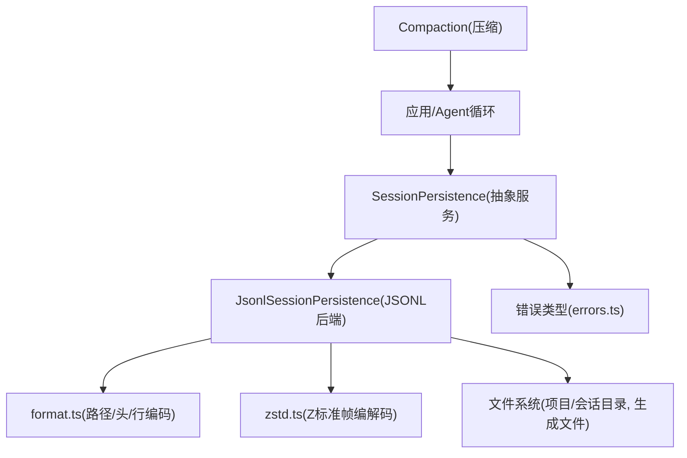
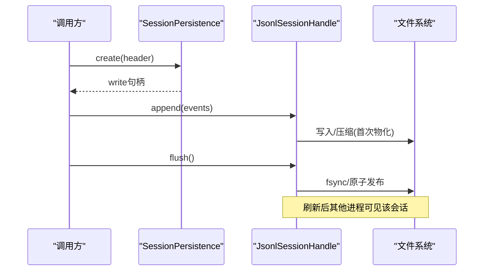
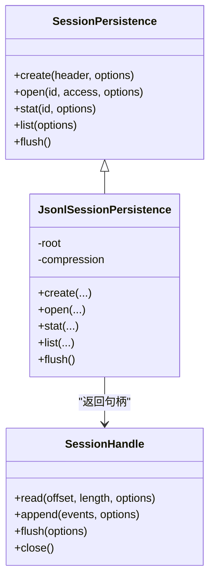
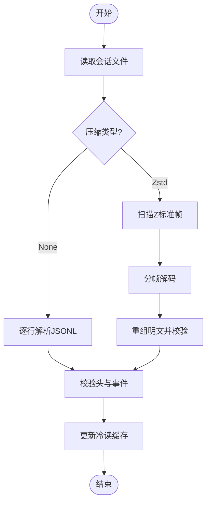
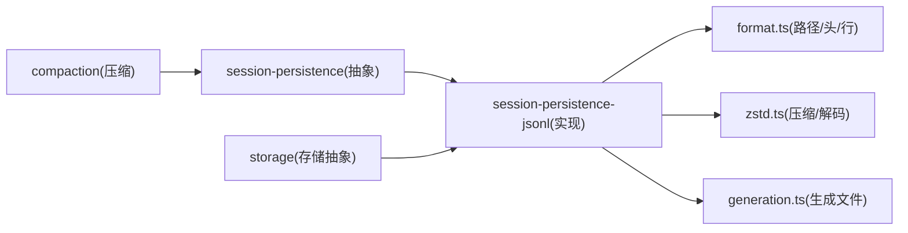

# 持久化策略

<cite>
**本文引用的文件**
- [packages/session/session-persistence/src/index.ts](file://packages/session/session-persistence/src/index.ts)
- [packages/session/session-persistence-jsonl/src/index.ts](file://packages/session/session-persistence-jsonl/src/index.ts)
- [packages/session/session-persistence-jsonl/src/format.ts](file://packages/session/session-persistence-jsonl/src/format.ts)
- [packages/session/session-persistence-jsonl/src/zstd.ts](file://packages/session/session-persistence-jsonl/src/zstd.ts)
- [packages/session/session-persistence/src/errors.ts](file://packages/session/session-persistence/src/errors.ts)
- [docs/subsystems/persistence.md](file://docs/subsystems/persistence.md)
- [docs/persistence-catalog.md](file://docs/persistence-catalog.md)
- [docs/subsystems/compaction.md](file://docs/subsystems/compaction.md)
- [packages/storage/storage/src/backend.ts](file://packages/storage/storage/src/backend.ts)
</cite>

## 目录
1. [简介](#简介)
2. [项目结构](#项目结构)
3. [核心组件](#核心组件)
4. [架构总览](#架构总览)
5. [详细组件分析](#详细组件分析)
6. [依赖关系分析](#依赖关系分析)
7. [性能与优化](#性能与优化)
8. [故障排查指南](#故障排查指南)
9. [结论](#结论)
10. [附录：API参考与部署要点](#附录api参考与部署要点)

## 简介
本文件系统性阐述会话事件日志的持久化策略，覆盖数据序列化格式、存储后端抽象、事务与一致性保证、插件化架构（事件监听、批量写入、错误处理）、压缩与空间优化（事件压缩、增量存储、空间回收），以及可靠性保障（完整性校验、故障恢复、备份策略）。同时提供自定义持久化后端的实现指引、配置选项说明、错误处理实践，以及面向开发者的完整 API 参考与部署建议。

## 项目结构
- 持久化抽象服务定义位于 session-persistence 包，暴露统一的 SessionPersistence 接口与 SessionHandle 访问模型。
- JSONL 后端实现位于 session-persistence-jsonl 包，提供基于文件的追加式日志、Zstandard 帧压缩、原子生成文件发布、崩溃恢复等能力。
- 存储后端抽象在 storage 包中定义了通用介质与单元操作契约，便于扩展其他存储形态。
- 文档子系统包含持久化设计说明、事件目录、压缩与回放等专题文档。

图表来源
- [packages/session/session-persistence/src/index.ts:114-198](file://packages/session/session-persistence/src/index.ts#L114-L198)
- [packages/session/session-persistence-jsonl/src/index.ts:146-197](file://packages/session/session-persistence-jsonl/src/index.ts#L146-L197)
- [packages/session/session-persistence-jsonl/src/format.ts:27-55](file://packages/session/session-persistence-jsonl/src/format.ts#L27-L55)
- [packages/session/session-persistence-jsonl/src/zstd.ts:15-23](file://packages/session/session-persistence-jsonl/src/zstd.ts#L15-L23)

章节来源
- [packages/session/session-persistence/src/index.ts:114-198](file://packages/session/session-persistence/src/index.ts#L114-L198)
- [packages/session/session-persistence-jsonl/src/index.ts:146-197](file://packages/session/session-persistence-jsonl/src/index.ts#L146-L197)
- [docs/subsystems/persistence.md:1-10](file://docs/subsystems/persistence.md#L1-L10)

## 核心组件
- SessionPersistence（抽象服务）：定义 create/open/stat/list/flush 等能力，统一跨后端的行为语义（追加不可变、单写者、刷新为耐久性屏障、只读观察不阻塞写者）。
- SessionHandle：每个会话一个句柄，承载 read/append/flush/close；读句柄拒绝写入，写句柄拥有单写者所有权；close 幂等且不可取消。
- JsonlSessionPersistence（JSONL后端）：以每会话目录+不可变生成文件组织日志；支持 Zstandard 帧压缩；提供冷读缓存、原子发布、撕裂尾修复、版本迁移与拒绝策略。
- 错误体系：SessionFormatUnsupportedError、SessionPersistenceCorruptionError、SessionAlreadyOwnedError 等稳定错误类型，用于区分“格式不支持”和“内容损坏”。

章节来源
- [packages/session/session-persistence/src/index.ts:114-198](file://packages/session/session-persistence/src/index.ts#L114-L198)
- [packages/session/session-persistence-jsonl/src/index.ts:146-197](file://packages/session/session-persistence-jsonl/src/index.ts#L146-L197)
- [packages/session/session-persistence/src/errors.ts:12-138](file://packages/session/session-persistence/src/errors.ts#L12-L138)

## 架构总览
- 会话事件是追加型、单调序列、不可重写；读取时仅返回有效连续前缀，撕裂尾部不会返回给读者。
- 写路径通过 append 进行最佳努力持久化，flush 作为耐久性屏障确保已确认的追加可被其他进程观察到。
- 元数据（SessionHeader）与事件体分离存放；头信息携带版本、创建时间、工作目录、父会话、是否种子、代理预设等。
- JSONL后端将事件按行写入，并以 Zstandard 帧为单位进行压缩；首次写入或 flush 时才物化到磁盘。
- 崩溃恢复：若物理尾部撕裂，写路径会在下一次新追加前截断并重建；部分可恢复的完整记录会被重放写入。

图表来源
- [packages/session/session-persistence/src/index.ts:139-174](file://packages/session/session-persistence/src/index.ts#L139-L174)
- [packages/session/session-persistence-jsonl/src/index.ts:219-238](file://packages/session/session-persistence-jsonl/src/index.ts#L219-L238)
- [packages/session/session-persistence-jsonl/src/index.ts:557-589](file://packages/session/session-persistence-jsonl/src/index.ts#L557-L589)

## 详细组件分析

### 事件日志序列化与格式
- 事件信封：type、seq、time、data，可选 ignorable；表面事件携带 sourceEventSeqs 与 surfaceOp。
- 头信息：首行为 JSON 头，包含 version、id、createdAt、cwd、parentSession、isSeeded、origin、delegationDepth、agentPreset。
- 路径与命名：按 projectDir -> sessionDir -> generationLogFilename 组织；文件名携带版本号与压缩后缀。
- 事件行：eventLines 将事件序列化为 JSONL 行；sourceEventSeqs 在落盘时进行区间压缩以减少体积。

章节来源
- [docs/persistence-catalog.md:12-89](file://docs/persistence-catalog.md#L12-L89)
- [packages/session/session-persistence-jsonl/src/format.ts:74-137](file://packages/session/session-persistence-jsonl/src/format.ts#L74-L137)
- [packages/session/session-persistence-jsonl/src/format.ts:27-55](file://packages/session/session-persistence-jsonl/src/format.ts#L27-L55)
- [packages/session/session-persistence-jsonl/src/format.ts:310-331](file://packages/session/session-persistence-jsonl/src/format.ts#L310-L331)

### 存储后端抽象与插件架构
- 抽象服务：SessionPersistence 暴露 create/open/stat/list/flush，所有后端共享一致语义。
- 句柄模型：SessionHandle 提供 read/append/flush/close；读句柄禁止写入，写句柄拥有单写者所有权。
- 插件注册：JSONL 后端作为插件实现上述接口，并通过 Context 注入；可扩展第三方后端实现相同契约。
- 存储域抽象：storage 包定义 StorageBackend/KvFacet/KvUnit，便于未来扩展键值/表格型介质。

图表来源
- [packages/session/session-persistence/src/index.ts:114-198](file://packages/session/session-persistence/src/index.ts#L114-L198)
- [packages/session/session-persistence-jsonl/src/index.ts:146-197](file://packages/session/session-persistence-jsonl/src/index.ts#L146-L197)
- [packages/storage/storage/src/backend.ts:17-139](file://packages/storage/storage/src/backend.ts#L17-L139)

章节来源
- [packages/session/session-persistence/src/index.ts:114-198](file://packages/session/session-persistence/src/index.ts#L114-L198)
- [packages/storage/storage/src/backend.ts:17-139](file://packages/storage/storage/src/backend.ts#L17-L139)

### 事务保证与一致性
- 追加不可变：事件从 seq 0 开始连续追加，永不重写。
- 刷新即屏障：flush 承诺已确认的追加对同实例后续读取可见，并对外进程物化。
- 单写者：同一会话在同一时刻只有一个写句柄；重复 open('write') 会拒绝。
- 撕裂尾修复：读端不返回撕裂尾部；写端在首次新追加前截断并重建，必要时重放可恢复的完整记录。

章节来源
- [docs/subsystems/persistence.md:91-101](file://docs/subsystems/persistence.md#L91-L101)
- [packages/session/session-persistence/src/index.ts:114-133](file://packages/session/session-persistence/src/index.ts#L114-L133)
- [packages/session/session-persistence-jsonl/src/index.ts:591-600](file://packages/session/session-persistence-jsonl/src/index.ts#L591-L600)

### 事件监听与批量写入
- 事件路由：session/event 同步通知，后端按会话 ID 路由到活跃写句柄的有界写后窗口，不阻塞生产者。
- 批处理窗口：首个待处理事件启动固定内部批处理窗口，后续事件加入而不重置截止时间；过期事件形成后续批次。
- 失败重试：后台写入失败保留事件顺序，暂停自动路径并通过日志报告；下次显式 flush 重试并向调用方抛出错误。
- 关闭清理：session/disposed 与 close 均执行最终排空，确保后端销毁无丢失。

章节来源
- [docs/subsystems/persistence.md:91-94](file://docs/subsystems/persistence.md#L91-L94)

### 错误处理策略
- 格式拒绝：当构建无法忠实解释日志时抛出 SessionFormatUnsupportedError，附带原始日志位置（JSONL后端提供）。
- 损坏检测：解析或校验失败抛出 SessionPersistenceCorruptionError，携带原因与上下文。
- 权限与状态：SessionAlreadyOwnedError、SessionReadOnlyError、SessionHandleClosedError 等明确区分使用场景。
- 版本拒绝：方向感知的拒绝文本提示升级或回退策略。

章节来源
- [packages/session/session-persistence/src/errors.ts:12-138](file://packages/session/session-persistence/src/errors.ts#L12-L138)
- [packages/session/session-persistence-jsonl/src/index.ts:435-458](file://packages/session/session-persistence-jsonl/src/index.ts#L435-L458)

### 数据压缩与优化
- 压缩格式：默认使用 Zstandard 帧串联；可选择 none 禁用压缩。
- 帧扫描：scanZstdFrames 定位完整帧范围，识别撕裂尾部起始位置。
- 流式解码：createZstdFrameDecoder 提供多帧迭代解码，控制 yield 间隔避免阻塞事件循环。
- 事件级压缩：sourceEventSeqs 在落盘时使用区间编码减少体积。
- 冷读缓存：最近冷读日志按会话ID与文件修订缓存，避免重复解析。

图表来源
- [packages/session/session-persistence-jsonl/src/zstd.ts:41-104](file://packages/session/session-persistence-jsonl/src/zstd.ts#L41-L104)
- [packages/session/session-persistence-jsonl/src/format.ts:310-331](file://packages/session/session-persistence-jsonl/src/format.ts#L310-L331)
- [packages/session/session-persistence-jsonl/src/index.ts:160-167](file://packages/session/session-persistence-jsonl/src/index.ts#L160-L167)

章节来源
- [packages/session/session-persistence-jsonl/src/zstd.ts:41-104](file://packages/session/session-persistence-jsonl/src/zstd.ts#L41-L104)
- [packages/session/session-persistence-jsonl/src/format.ts:310-331](file://packages/session/session-persistence-jsonl/src/format.ts#L310-L331)
- [packages/session/session-persistence-jsonl/src/index.ts:160-167](file://packages/session/session-persistence-jsonl/src/index.ts#L160-L167)

### 增量存储与空间回收
- 增量追加：每次 append 追加新的 JSONL 行（或新的 Zstd 帧），不重写历史。
- 生成文件：每代生成文件不可变，当前版本由文件名与头版本共同标识。
- 空间回收：压缩后的帧减少体积；工具结果剪枝与摘要压缩可减少表面节点大小。
- 撕裂尾截断：检测到撕裂尾部时，在首次新追加前截断无效字节，避免污染可读前缀。

章节来源
- [docs/subsystems/compaction.md:9-23](file://docs/subsystems/compaction.md#L9-L23)
- [packages/session/session-persistence-jsonl/src/index.ts:591-600](file://packages/session/session-persistence-jsonl/src/index.ts#L591-L600)

### 可靠性保证：完整性校验、故障恢复、备份策略
- 完整性校验：头字段严格校验、事件序列号连续性检查、Zstd 帧校验位验证。
- 故障恢复：崩溃中断的 turn 不截断，仅丢弃未完成的物理尾部片段；写路径在首次新追加前完成修复。
- 备份策略：storage 后端提供 backupRecord 可选能力，可将记录移动到不可见区域以便检查；JSONL后端可通过外部机制定期归档生成文件。

章节来源
- [packages/session/session-persistence-jsonl/src/format.ts:389-406](file://packages/session/session-persistence-jsonl/src/format.ts#L389-L406)
- [packages/session/session-persistence-jsonl/src/zstd.ts:106-122](file://packages/session/session-persistence-jsonl/src/zstd.ts#L106-L122)
- [packages/storage/storage/src/backend.ts:112-123](file://packages/storage/storage/src/backend.ts#L112-L123)

## 依赖关系分析
- 抽象层依赖：session-persistence 定义接口与错误类型，供所有后端实现。
- 实现层依赖：JSONL后端依赖 format.ts（路径/头/行编码）、zstd.ts（压缩/解码）、generation.ts（生成文件管理）。
- 上层集成：compaction 通过 SessionEventMap 扩展事件类型，影响持久化日志内容但不改变持久化接口。
- 存储抽象：storage 后端契约可用于未来扩展非文件介质。

图表来源
- [packages/session/session-persistence/src/index.ts:114-198](file://packages/session/session-persistence/src/index.ts#L114-L198)
- [packages/session/session-persistence-jsonl/src/index.ts:146-197](file://packages/session/session-persistence-jsonl/src/index.ts#L146-L197)
- [docs/subsystems/compaction.md:9-23](file://docs/subsystems/compaction.md#L9-L23)
- [packages/storage/storage/src/backend.ts:17-139](file://packages/storage/storage/src/backend.ts#L17-L139)

章节来源
- [packages/session/session-persistence/src/index.ts:114-198](file://packages/session/session-persistence/src/index.ts#L114-L198)
- [packages/session/session-persistence-jsonl/src/index.ts:146-197](file://packages/session/session-persistence-jsonl/src/index.ts#L146-L197)
- [docs/subsystems/compaction.md:9-23](file://docs/subsystems/compaction.md#L9-L23)
- [packages/storage/storage/src/backend.ts:17-139](file://packages/storage/storage/src/backend.ts#L17-L139)

## 性能与优化
- 批处理窗口：限制写后等待时间，避免无限积压；过期事件形成后续批次，降低延迟。
- 冷读缓存：最近冷读日志按会话ID与文件修订缓存，减少重复解析开销。
- 压缩选择：默认 Zstandard 平衡压缩比与速度；可按需禁用。
- 流式解码：分帧解码并适时 yield，避免长时间阻塞事件循环。
- 事件级压缩：sourceEventSeqs 区间编码减少冗余。

章节来源
- [docs/subsystems/persistence.md:91-94](file://docs/subsystems/persistence.md#L91-L94)
- [packages/session/session-persistence-jsonl/src/index.ts:160-167](file://packages/session/session-persistence-jsonl/src/index.ts#L160-L167)
- [packages/session/session-persistence-jsonl/src/zstd.ts:124-145](file://packages/session/session-persistence-jsonl/src/zstd.ts#L124-L145)
- [packages/session/session-persistence-jsonl/src/format.ts:310-331](file://packages/session/session-persistence-jsonl/src/format.ts#L310-L331)

## 故障排查指南
- 格式不支持：检查构建版本与日志版本匹配；查看错误中的原始日志路径。
- 损坏日志：关注解析错误与校验失败；必要时重新生成或迁移到当前版本。
- 写冲突：确认是否存在活跃写句柄；避免并发 open('write')。
- 撕裂尾：观察首次新追加前的截断日志；确认恢复逻辑是否生效。
- 性能问题：调整压缩策略、批处理窗口、冷读缓存命中率。

章节来源
- [packages/session/session-persistence/src/errors.ts:12-138](file://packages/session/session-persistence/src/errors.ts#L12-L138)
- [packages/session/session-persistence-jsonl/src/index.ts:435-458](file://packages/session/session-persistence-jsonl/src/index.ts#L435-L458)
- [packages/session/session-persistence-jsonl/src/index.ts:591-600](file://packages/session/session-persistence-jsonl/src/index.ts#L591-L600)

## 结论
本持久化策略通过抽象服务与句柄模型统一了会话日志的读写语义，结合 JSONL 后端的追加式存储、Zstandard 压缩、原子发布与崩溃恢复，提供了高可靠、高性能、可扩展的持久化方案。配合 compaction 的事件压缩与空间回收，可在长生命周期会话中保持合理的存储与性能表现。

## 附录：API参考与部署要点

### API参考（节选）
- SessionPersistence
  - create(header, options): 创建新会话并获取写句柄
  - open(id, access, options): 打开现有会话（读/写）
  - stat(id, options): 轻量观察会话元数据与修订
  - list(options): 列出所有可见会话
  - flush(): 全局刷新所有活跃写句柄
- SessionHandle
  - read(offset, length, options): 读取事件切片
  - append(events, options): 追加事件批次
  - flush(options): 耐久性屏障
  - close(): 释放句柄

章节来源
- [packages/session/session-persistence/src/index.ts:139-198](file://packages/session/session-persistence/src/index.ts#L139-L198)

### 配置选项（JSONL后端）
- root: 会话文件根目录（必需）
- compression: 'zstd' | 'none'（默认 zstd）

章节来源
- [packages/session/session-persistence-jsonl/src/index.ts:85-97](file://packages/session/session-persistence-jsonl/src/index.ts#L85-L97)

### 自定义持久化后端实现要点
- 实现 SessionPersistence 抽象类，遵循追加不可变、单写者、刷新即屏障的语义。
- 提供 SessionHandle 实现 read/append/flush/close，确保读句柄拒绝写入、写句柄拥有所有权。
- 处理错误：区分格式不支持与损坏，提供原始日志位置（如适用）。
- 支持版本迁移：对历史格式进行安全迁移或拒绝。
- 可选：实现 storage 后端契约以接入键值/表格介质。

章节来源
- [packages/session/session-persistence/src/index.ts:114-198](file://packages/session/session-persistence/src/index.ts#L114-L198)
- [packages/storage/storage/src/backend.ts:17-139](file://packages/storage/storage/src/backend.ts#L17-L139)

### 部署指南
- 初始化 JSONL后端：设置 root 与 compression，注册为 ctx.sessionPersistence。
- 启动流程：确保根目录存在且可写；首次 append 或 flush 时物化会话。
- 监控与运维：关注撕裂尾恢复日志、格式拒绝错误、压缩性能指标。
- 备份策略：定期归档会话目录下的生成文件；必要时使用 backupRecord 移动记录。

章节来源
- [packages/session/session-persistence-jsonl/src/index.ts:146-197](file://packages/session/session-persistence-jsonl/src/index.ts#L146-L197)
- [packages/storage/storage/src/backend.ts:112-123](file://packages/storage/storage/src/backend.ts#L112-L123)