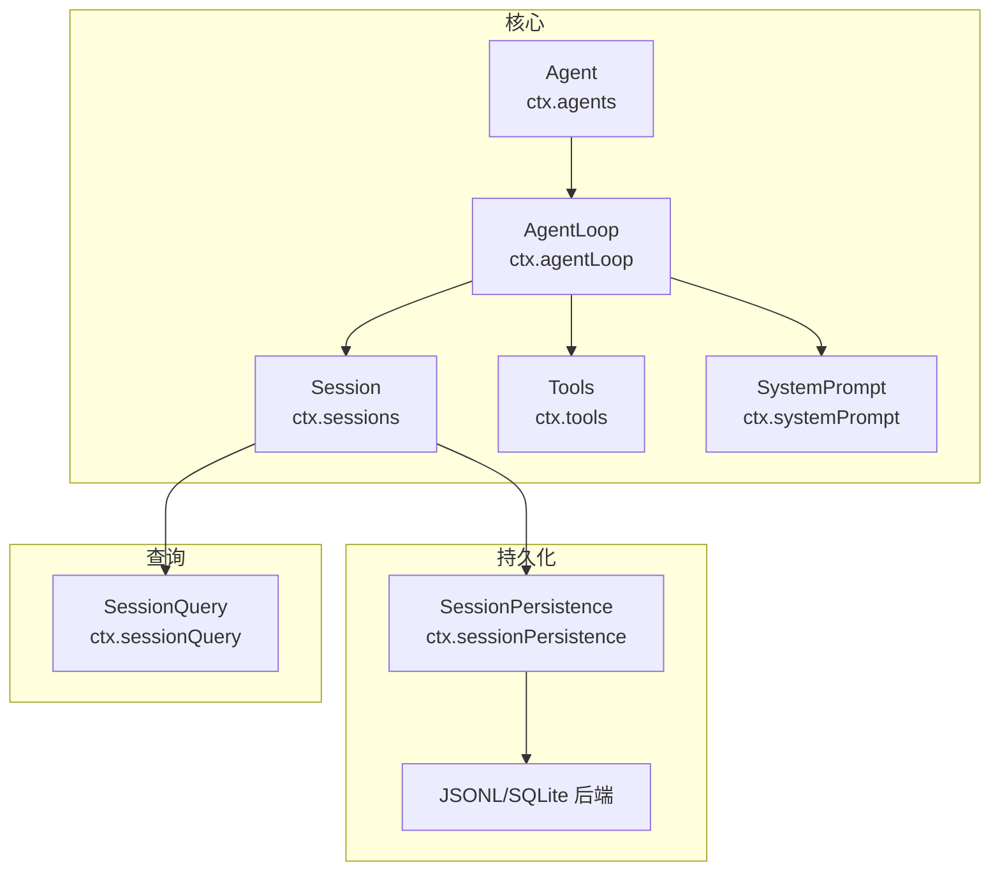
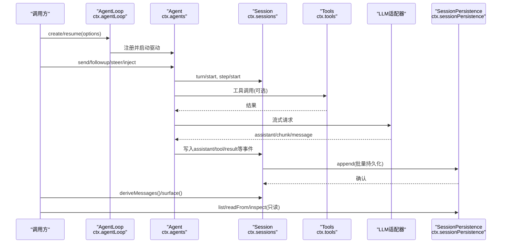
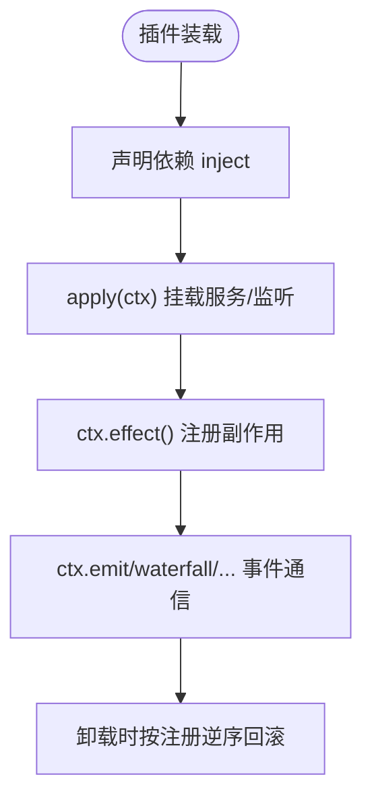
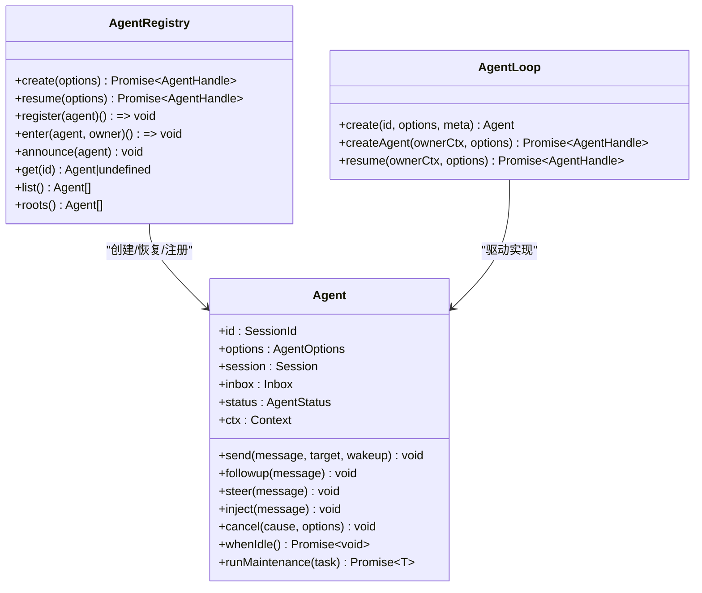
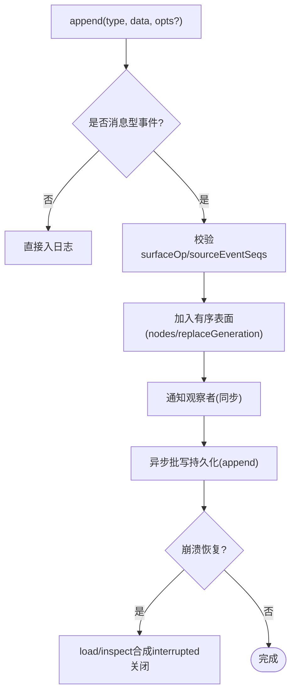
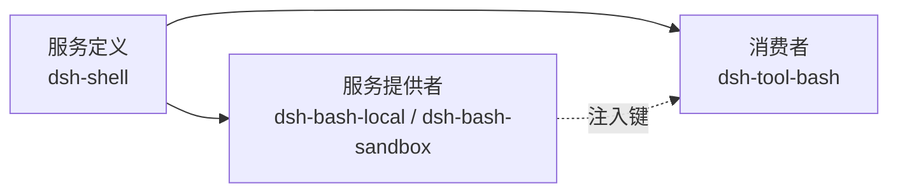
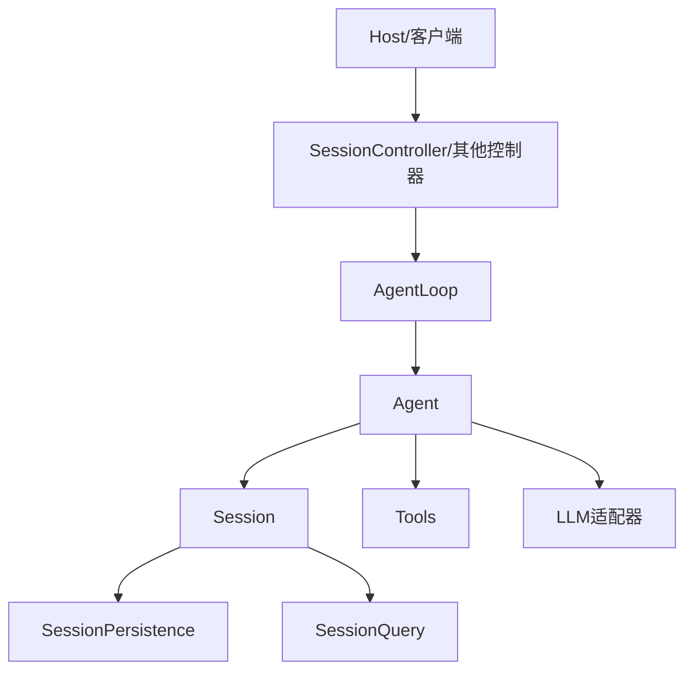
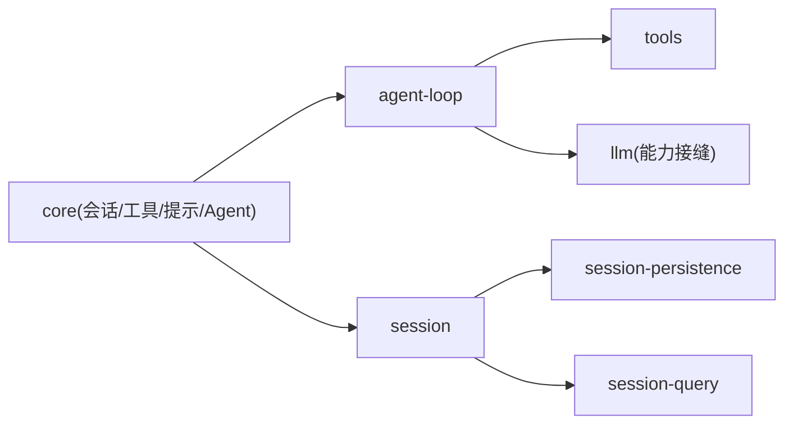

# 核心架构

<cite>
**本文引用的文件**
- [packages/core/agent/src/index.ts](file://packages/core/agent/src/index.ts)
- [packages/core/agent/src/types.ts](file://packages/core/agent/src/types.ts)
- [packages/core/agent-loop/src/index.ts](file://packages/core/agent-loop/src/index.ts)
- [packages/core/session/src/index.ts](file://packages/core/session/src/index.ts)
- [packages/session/session-persistence/src/index.ts](file://packages/session/session-persistence/src/index.ts)
- [packages/session/session-persistence/tests/persistence.spec.ts](file://packages/session/session-persistence/tests/persistence.spec.ts)
- [packages/session-query/session-query/tests/session-query.spec.ts](file://packages/session-query/session-query/tests/session-query.spec.ts)
- [docs/cordis-primer.md](file://docs/cordis-primer.md)
- [docs/subsystems/core.md](file://docs/subsystems/core.md)
- [docs/subsystems/session.md](file://docs/subsystems/session.md)
- [docs/subsystems/persistence.md](file://docs/subsystems/persistence.md)
- [docs/capability-seams.md](file://docs/capability-seams.md)
- [docs/user/develop/practice/index.md](file://docs/user/develop/practice/index.md)
</cite>

## 目录
1. [引言](#引言)
2. [项目结构](#项目结构)
3. [核心组件](#核心组件)
4. [架构总览](#架构总览)
5. [详细组件分析](#详细组件分析)
6. [依赖关系分析](#依赖关系分析)
7. [性能考量](#性能考量)
8. [故障排查指南](#故障排查指南)
9. [结论](#结论)
10. [附录](#附录)

## 引言
本文件面向DeepSeek Harness的核心架构，围绕Cordis插件化框架、Agent管理系统、会话管理与持久化、能力接缝模式进行系统化说明。目标是帮助开发者理解：
- Cordis的插件化与“时空可组合性”编程范式（上下文、服务、事件、注册即副作用）；
- Agent接口、生命周期、并发控制与所有权模型；
- 会话的追加式事件日志、内存存储与持久化策略；
- 能力接缝中“服务定义/提供者/消费者”的角色分离；
- 系统边界与组件交互关系，为扩展与集成提供清晰基础。

## 项目结构
DeepSeek Harness以包为单位组织核心能力，关键目录与职责如下：
- packages/core：会话、工具注册、系统提示组装、Agent类型与默认循环驱动等核心骨架；
- packages/session：会话持久化抽象与后端实现；
- packages/session-query：会话查询与快照；
- docs：子系统文档、能力接缝、Cordis入门教程等权威说明。

图表来源
- [docs/subsystems/core.md:7-18](file://docs/subsystems/core.md#L7-L18)
- [docs/subsystems/session.md:1-12](file://docs/subsystems/session.md#L1-L12)
- [docs/subsystems/persistence.md:1-8](file://docs/subsystems/persistence.md#L1-L8)

章节来源
- [docs/subsystems/core.md:7-18](file://docs/subsystems/core.md#L7-L18)
- [docs/subsystems/session.md:1-12](file://docs/subsystems/session.md#L1-L12)
- [docs/subsystems/persistence.md:1-8](file://docs/subsystems/persistence.md#L1-L8)

## 核心组件
- Cordis插件框架：以Service为核心，通过Context暴露稳定键名服务，使用inject声明依赖，事件用于通信，注册即副作用且可回滚。
- Agent管理：统一Agent接口、创建/恢复工厂、生命周期事件、启动器作用域与取消传播。
- 会话与持久化：追加式SessionEvent日志作为唯一事实源；SessionPersistence抽象出locate/create/append/load/inspect/readFrom/list/snapshots等能力，支持JSONL/SQLite后端与崩溃恢复。
- 能力接缝：服务定义、提供者、消费者三角色解耦，便于独立演进与替换。

章节来源
- [docs/cordis-primer.md:7-13](file://docs/cordis-primer.md#L7-L13)
- [docs/subsystems/core.md:22-51](file://docs/subsystems/core.md#L22-L51)
- [docs/subsystems/session.md:1-12](file://docs/subsystems/session.md#L1-L12)
- [docs/subsystems/persistence.md:1-8](file://docs/subsystems/persistence.md#L1-L8)
- [docs/capability-seams.md:1-10](file://docs/capability-seams.md#L1-L10)

## 架构总览
下图展示从用户输入到模型调用、工具执行、日志落盘与查询的全链路交互。

图表来源
- [docs/subsystems/core.md:7-18](file://docs/subsystems/core.md#L7-L18)
- [docs/subsystems/session.md:224-286](file://docs/subsystems/session.md#L224-L286)
- [docs/subsystems/persistence.md:231-237](file://docs/subsystems/persistence.md#L231-L237)

## 详细组件分析

### Cordis框架与“时空可组合性”
- 插件即Service：函数或类，具备inject与apply(ctx)，在上下文中挂载。
- Context是服务仓库：通过稳定键名访问服务，避免硬耦合。
- 依赖声明：通过inject表达加载顺序，无需手工编排。
- 类型化事件：emit/waterfall/parallel/serial/bail多种分发模式，契约内聚。
- 注册即副作用：prompt片段、tool schema、adapter/provider、监听器等通过effect/on安装，卸载时自动回滚。

图表来源
- [docs/cordis-primer.md:7-13](file://docs/cordis-primer.md#L7-L13)
- [docs/cordis-primer.md:15-35](file://docs/cordis-primer.md#L15-L35)
- [docs/cordis-primer.md:37-45](file://docs/cordis-primer.md#L37-L45)

章节来源
- [docs/cordis-primer.md:7-45](file://docs/cordis-primer.md#L7-L45)

### Agent管理系统
- 接口与能力：Agent暴露send/followup/steer/inject、cancel、whenIdle、runMaintenance等，承载会话驱动的完整生命周期。
- 创建与恢复：通过AgentRegistry.create/resume完成新建或从持久化恢复，返回拥有者句柄AgentHandle，负责有序销毁。
- 生命周期事件：agent/created、agent/disposed、agent/status等，配合session/turn/*、step/*边界。
- 并发与取消：cancel携带原因并传播至AbortSignal；whenIdle等待整代理活动收敛；runMaintenance在空闲阶段执行维护任务。
- 启动器作用域：process-local initiator传递因果归属，不等同于授权。

图表来源
- [packages/core/agent/src/types.ts:59-142](file://packages/core/agent/src/types.ts#L59-L142)
- [packages/core/agent/src/index.ts:611-779](file://packages/core/agent/src/index.ts#L611-L779)
- [packages/core/agent-loop/src/index.ts:349-386](file://packages/core/agent-loop/src/index.ts#L349-L386)

章节来源
- [packages/core/agent/src/types.ts:59-142](file://packages/core/agent/src/types.ts#L59-L142)
- [packages/core/agent/src/index.ts:611-779](file://packages/core/agent/src/index.ts#L611-L779)
- [packages/core/agent-loop/src/index.ts:349-386](file://packages/core/agent-loop/src/index.ts#L349-L386)
- [docs/subsystems/core.md:22-51](file://docs/subsystems/core.md#L22-L51)

### 会话管理：追加式事件日志、内存存储、持久化策略
- 事件模型：SessionEventMap定义所有事件类型，包含turn/step边界、user/assistant消息、工具调用/结果、请求头/上下文、种子结束标记等。
- 表面投影：SurfaceEventType仅三类消息型事件可进入有序表面；SurfaceOp支持append与replace，支撑压缩等重写场景。
- 派生历史：deriveMessages基于表面节点生成模型可见消息数组，缓存并按需重建。
- 内存存储：ctx.sessions维护活会话实例，提供prepare/enter/announce/flush等原子操作。
- 持久化：ctx.sessionPersistence抽象出locate/create/append/prepare/load/inspect/readFrom/list/snapshots；JSONL/SQLite后端实现同一契约；崩溃恢复会合成中断结束的turn/end。
- 测试参考：内存后端与查询后端的测试展示了最小可用实现与行为约定。

图表来源
- [docs/subsystems/session.md:224-286](file://docs/subsystems/session.md#L224-L286)
- [docs/subsystems/session.md:332-492](file://docs/subsystems/session.md#L332-L492)
- [docs/subsystems/persistence.md:9-19](file://docs/subsystems/persistence.md#L9-L19)
- [docs/subsystems/persistence.md:231-237](file://docs/subsystems/persistence.md#L231-L237)

章节来源
- [docs/subsystems/session.md:1-12](file://docs/subsystems/session.md#L1-L12)
- [docs/subsystems/session.md:224-492](file://docs/subsystems/session.md#L224-L492)
- [docs/subsystems/persistence.md:9-19](file://docs/subsystems/persistence.md#L9-L19)
- [docs/subsystems/persistence.md:231-237](file://docs/subsystems/persistence.md#L231-L237)
- [packages/session/session-persistence/tests/persistence.spec.ts:64-98](file://packages/session/session-persistence/tests/persistence.spec.ts#L64-L98)
- [packages/session-query/session-query/tests/session-query.spec.ts:63-85](file://packages/session-query/session-query/tests/session-query.spec.ts#L63-L85)

### 能力接缝模式：服务定义/提供者/消费者
- 角色分离：服务定义（契约与词汇）、服务提供者（具体实现）、消费者（对外API/工具）。
- 优势：三者独立演进，替换提供者不影响消费者契约；包边界清晰。
- 示例：Bash执行能力由shell定义、bash-local/sandbox提供、tool-bash消费。

图表来源
- [docs/user/develop/practice/index.md:7-27](file://docs/user/develop/practice/index.md#L7-L27)
- [docs/capability-seams.md:13-29](file://docs/capability-seams.md#L13-L29)

章节来源
- [docs/user/develop/practice/index.md:7-27](file://docs/user/develop/practice/index.md#L7-L27)
- [docs/capability-seams.md:13-29](file://docs/capability-seams.md#L13-L29)

### 系统边界与组件交互
- 核心回路：AgentLoop驱动，读取Session日志，组装系统提示，调用LLM，执行工具，写回日志并持久化。
- 外部边界：Host RPC（SessionController等）通过Remote命名空间暴露能力；Web/CLI入口通过配置装配插件。
- 可扩展点：事件钩子（agent/*、tools/*、fs/*等）、能力接缝（llm/shell/fs/...）、持久化后端、查询后端。

图表来源
- [docs/subsystems/core.md:7-18](file://docs/subsystems/core.md#L7-L18)
- [docs/subsystems/session.md:580-736](file://docs/subsystems/session.md#L580-L736)
- [docs/subsystems/persistence.md:231-237](file://docs/subsystems/persistence.md#L231-L237)

## 依赖关系分析
- 包级依赖：core下的session/system-prompt/tools/agent/agent-loop构成主回路；session-persistence提供持久化；session-query提供查询；各能力通过能力接缝接入。
- 运行时依赖：AgentLoop依赖agents/sessions/tools/system-prompt/llm；Session依赖持久化与查询；控制器依赖会话与能力接缝。

图表来源
- [docs/subsystems/core.md:7-18](file://docs/subsystems/core.md#L7-L18)
- [docs/subsystems/persistence.md:231-237](file://docs/subsystems/persistence.md#L231-L237)

章节来源
- [docs/subsystems/core.md:7-18](file://docs/subsystems/core.md#L7-L18)
- [docs/subsystems/persistence.md:231-237](file://docs/subsystems/persistence.md#L231-L237)

## 性能考量
- 事件追加路径非阻塞I/O：append同步通知观察者，持久化后台批处理，避免热路径阻塞。
- 表面投影缓存：deriveMessages按需投影并缓存，replace时重建，降低重复计算。
- 持久化批写与检查点：session/flush作为排序与错误观察检查点，减少频繁落盘开销。
- 查询优化：readFrom支持从指定seq读取后缀，listSnapshots提供轻量变更令牌，避免全量加载。

[本节为通用指导，不直接分析具体文件]

## 故障排查指南
- 崩溃恢复：冷加载时若发现未闭合的turn/start，将合成interrupted结束，保持日志平衡且不改写已提交数据。
- 格式拒绝：未知版本或未知事件类型会拒绝加载，避免静默跳过导致后续解析错误。
- 插入校验：append对data进行JSON可序列化校验，非法数据在源头拒绝，防止污染日志。
- 常见症状定位：
  - 会话无法恢复：检查persistence.load/inspect返回值与异常；
  - 工具调用失败：查看tools/post-execute与approval策略；
  - 模型请求失败：关注agent/request-error与agent/pre-step决策。

章节来源
- [docs/subsystems/persistence.md:9-19](file://docs/subsystems/persistence.md#L9-L19)
- [docs/subsystems/persistence.md:92-95](file://docs/subsystems/persistence.md#L92-L95)
- [docs/subsystems/session.md:410-444](file://docs/subsystems/session.md#L410-L444)

## 结论
DeepSeek Harness以Cordis为底座，通过“上下文+服务+事件+副作用”的组合机制，构建了高内聚、低耦合的可插拔架构。Agent管理提供统一的运行体与生命周期语义；会话以追加式事件日志为单一事实源，并通过持久化与查询能力形成完整的可观测性与可恢复性；能力接缝将契约、实现与消费面解耦，使系统具备强大的扩展与替换能力。开发者可据此安全地扩展新能力、替换实现、定制工作流与界面。

## 附录
- 术语速查：
  - 能力接缝：服务定义/提供者/消费者的三元组合；
  - 表面投影：由消息型事件构成的有序视图，支持append与replace；
  - 启动器作用域：进程内因果归属的传播边界。

[本节为概念性内容，不直接分析具体文件]