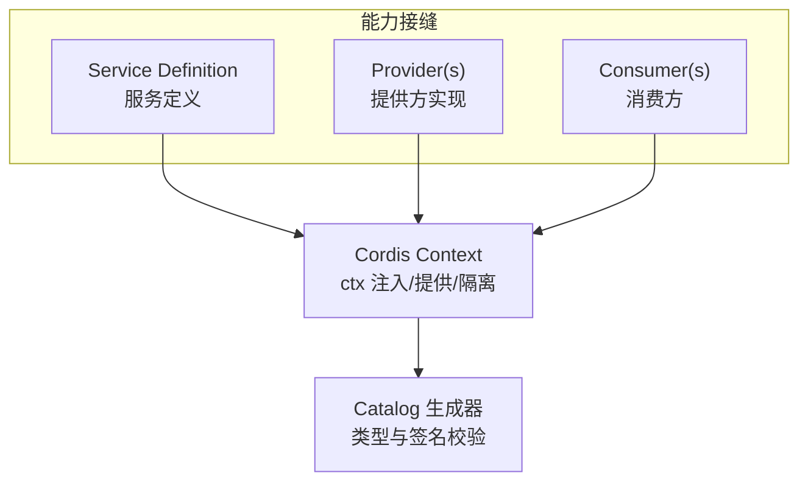
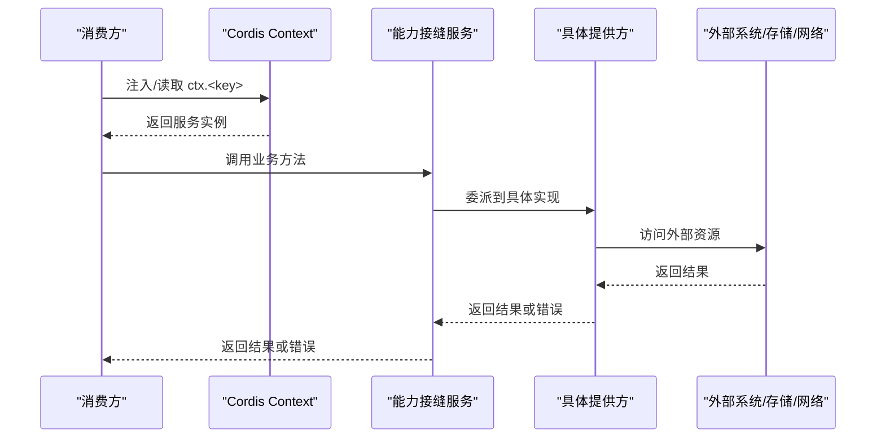
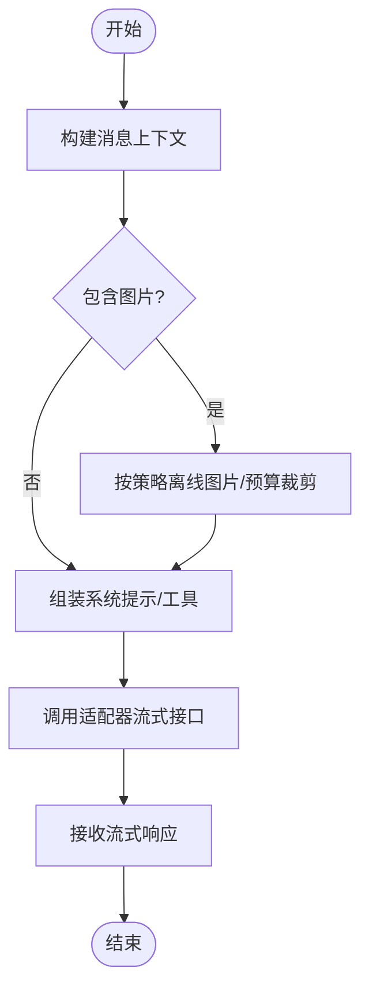
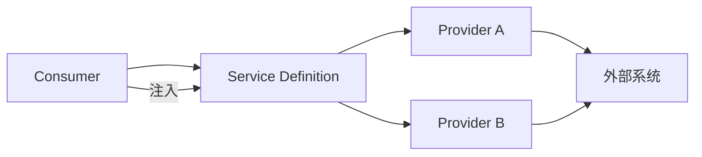

# 能力接缝接口设计

<cite>
**本文引用的文件**
- [docs/capability-seams.md](file://docs/capability-seams.md)
- [docs/capability-seams.zh.md](file://docs/capability-seams.zh.md)
- [docs/glossary.md](file://docs/glossary.md)
- [docs/cordis-api/context.md](file://docs/cordis-api/context.md)
- [packages/llm/llm-pi-ai/src/context.ts](file://packages/llm/llm-pi-ai/src/context.ts)
- [packages/extensions/tool-cordis/src/api-catalog.ts](file://packages/extensions/tool-cordis/src/api-catalog.ts)
- [packages/typert/generator/src/cordis-catalog.ts](file://packages/typert/generator/src/cordis-catalog.ts)
</cite>

## 目录
1. [简介](#简介)
2. [项目结构](#项目结构)
3. [核心组件](#核心组件)
4. [架构总览](#架构总览)
5. [详细组件分析](#详细组件分析)
6. [依赖分析](#依赖分析)
7. [性能考虑](#性能考虑)
8. [故障排查指南](#故障排查指南)
9. [结论](#结论)
10. [附录](#附录)

## 简介
本文件面向“能力接缝（capability seam）”的接口设计与实现规范，围绕 ctx.llm、ctx.fs、ctx.tools 等关键能力接缝，系统阐述：
- 接缝接口的定义规范与设计原则：抽象边界、类型约束、错误处理模式、可替换性。
- 核心接缝 API 规范与调用流程：以上下文注入、服务注册、消费方调用为主线。
- 版本管理与向后兼容策略：通过 Service Definition 与 Catalog 生成机制保障演进安全。
- 生命周期与资源清理：基于 Cordis Context 的 provide/dispose、隔离作用域与事件门控。
- 新能力接缝的设计示例与实践建议：从需求到接口、提供者、消费者落地的完整路径。

## 项目结构
能力接缝在仓库中以“Service Definition + Provider(s) + Consumer(s)”的三角色模式组织，并通过 Cordis 上下文进行装配与发现。文档侧由自动生成脚本维护，确保接口、实现与消费方的关系图与清单始终一致。

图表来源
- [docs/capability-seams.md:493-567](file://docs/capability-seams.md#L493-L567)
- [docs/cordis-api/context.md:14-96](file://docs/cordis-api/context.md#L14-L96)

章节来源
- [docs/capability-seams.md:493-567](file://docs/capability-seams.md#L493-L567)
- [docs/capability-seams.zh.md:495-568](file://docs/capability-seams.zh.md#L495-L568)
- [docs/cordis-api/context.md:14-96](file://docs/cordis-api/context.md#L14-L96)

## 核心组件
- 上下文与注入
  - ctx.extend/isolate/intercept：创建子上下文、按服务名隔离作用域、合并拦截配置。
  - ctx.provide/get/set/accessor/mixin：在服务生命周期内提供、读取、覆盖服务；暴露计算属性或直接混入方法。
- 服务目录与类型契约
  - Catalog 生成器对 Service 的方法签名、JSDoc、参数/返回值进行严格校验，保证跨包契约稳定。
- 关键能力接缝（节选）
  - ctx.llm：LLM 适配器注册与流式调用。
  - ctx.fs：文件系统提供者抽象，支持本地、沙箱、E2B 等后端。
  - ctx.tools：工具注册与受保护执行管线（策略前/后、守卫、结果观测）。
  - 其他重要接缝：ctx.subprocess、ctx.shell、ctx.sandbox、ctx.approval、ctx.storage、ctx.sessionQuery、ctx.spillStore、ctx.lsp、ctx.web、ctx.feishu 等。

章节来源
- [docs/cordis-api/context.md:14-96](file://docs/cordis-api/context.md#L14-L96)
- [docs/cordis-api/context.md:237-365](file://docs/cordis-api/context.md#L237-L365)
- [docs/capability-seams.md:493-567](file://docs/capability-seams.md#L493-L567)
- [docs/capability-seams.zh.md:495-568](file://docs/capability-seams.zh.md#L495-L568)

## 架构总览
下图展示典型能力接缝的运行时交互：消费方通过 ctx 注入获取服务，调用时经过策略与守卫，必要时与持久化、审批、子进程等底层能力协作。

图表来源
- [docs/cordis-api/context.md:237-365](file://docs/cordis-api/context.md#L237-L365)
- [docs/capability-seams.md:493-567](file://docs/capability-seams.md#L493-L567)

## 详细组件分析

### 上下文与注入模型（Cordis Context）
- 作用域与隔离
  - isolate(name, label?)：为指定服务名创建独立作用域，便于同一应用内多实例共存。
  - intercept(name, config)：为下游插件加载期注入服务级拦截配置。
- 服务生命周期
  - provide(name, value)：在当前 fiber 提供并自动管理卸载时的注销。
  - accessor(name, options)：定义计算属性，fiber 卸载时移除。
  - mixin(name, mixins)：将服务成员直接暴露到 ctx，简化调用。
- 查询与覆盖
  - get/set：非注入方式读取/覆盖服务值，strict 控制是否要求当前 fiber 活跃。

章节来源
- [docs/cordis-api/context.md:14-96](file://docs/cordis-api/context.md#L14-L96)
- [docs/cordis-api/context.md:237-365](file://docs/cordis-api/context.md#L237-L365)

### 能力接缝通用设计规范
- 抽象边界
  - 使用 Cordis Service 作为“服务定义”，而非裸 TypeScript interface；明确输入输出类型与作用域语义。
  - 将“协议/传输细节”下沉至 Provider，保持 Consumer 与具体实现解耦。
- 类型约束
  - 通过 Catalog 生成器强制 JSDoc、参数/返回值一致性；对外暴露的类型需稳定且可追溯。
- 错误处理
  - 统一错误分类与可恢复性标记；对不可恢复错误采用快速失败，对可重试错误提供幂等重试点。
- 可替换性与组合
  - 通过 isolate 实现多实现并存；通过 intercept 注入行为增强（如日志、审计、限流）。
- 版本与兼容
  - 新增字段优先可选；废弃字段保留过渡期；通过 Catalog 校验避免破坏性变更。

章节来源
- [docs/glossary.md:7-19](file://docs/glossary.md#L7-L19)
- [packages/typert/generator/src/cordis-catalog.ts:302-328](file://packages/typert/generator/src/cordis-catalog.ts#L302-L328)
- [docs/capability-seams.md:493-567](file://docs/capability-seams.md#L493-L567)

### 关键接缝：ctx.llm（大模型适配）
- 职责
  - 注册 LLM 适配器；提供与模型无关的流式生成能力；承载请求图片预算与附件解析策略。
- 调用流程要点
  - 将 Harness 消息转换为适配器上下文；按需离线图片以控制请求大小；组装工具 schema 与系统提示。
- 错误与降级
  - 不支持的消息形态抛出明确错误；当图片过大时以文本占位符降级，保证请求可发送。
- 生命周期
  - 适配器在启动阶段注册；会话级图片资源随请求生命周期释放。

图表来源
- [packages/llm/llm-pi-ai/src/context.ts:121-139](file://packages/llm/llm-pi-ai/src/context.ts#L121-L139)
- [packages/llm/llm-pi-ai/src/context.ts:209-238](file://packages/llm/llm-pi-ai/src/context.ts#L209-L238)
- [packages/llm/llm-pi-ai/src/context.ts:240-306](file://packages/llm/llm-pi-ai/src/context.ts#L240-L306)

章节来源
- [packages/llm/llm-pi-ai/src/context.ts:121-139](file://packages/llm/llm-pi-ai/src/context.ts#L121-L139)
- [packages/llm/llm-pi-ai/src/context.ts:209-238](file://packages/llm/llm-pi-ai/src/context.ts#L209-L238)
- [packages/llm/llm-pi-ai/src/context.ts:240-306](file://packages/llm/llm-pi-ai/src/context.ts#L240-L306)
- [docs/capability-seams.md:493-567](file://docs/capability-seams.md#L493-L567)

### 关键接缝：ctx.fs（文件系统）
- 职责
  - 抽象文件读写编辑操作；支持本地、沙箱、E2B 等多后端；与观察策略配合实现权限与安全。
- 调用流程要点
  - 工具层通过 ctx.fs 发起操作；沙箱后端按策略限制变更范围；观察策略通过事件门禁贡献状态检查。
- 错误与回滚
  - 权限拒绝、路径非法、I/O 错误应分类上报；写操作尽量幂等并提供原子替换策略。
- 生命周期
  - 后端按需初始化；会话结束时清理临时文件与句柄。

章节来源
- [docs/capability-seams.md:493-567](file://docs/capability-seams.md#L493-L567)
- [docs/capability-seams.zh.md:495-568](file://docs/capability-seams.zh.md#L495-L568)

### 关键接缝：ctx.tools（工具注册与执行）
- 职责
  - 注册工具能力；负责 PTC 模式传输；执行管线包括策略前处理、单调守卫、环绕分派、策略后处理与结果观测。
- 调用流程要点
  - 消费方通过 ctx.tools 调用工具；内部路由到具体实现；最终结果经观测管道进入日志/遥测。
- 错误与审批
  - 工具执行可能触发审批流程；失败时区分可重试与不可重试，并记录诊断信息。
- 生命周期
  - 工具在启动阶段注册；运行期可动态扩展；卸载时清理资源。

章节来源
- [docs/capability-seams.md:493-567](file://docs/capability-seams.md#L493-L567)
- [docs/capability-seams.zh.md:495-568](file://docs/capability-seams.zh.md#L495-L568)

### 其他重要接缝（概览）
- ctx.subprocess：子进程编排，统一进程坐标、stdio 处置、终端机制与 kill 升级。
- ctx.shell：Shell 执行抽象，支持 bash/pwsh、本地/沙箱/远程。
- ctx.sandbox：进程沙箱策略入口，按每次调用包装 argv 并报告执行。
- ctx.approval：一次性权限决策，通过事件瀑布分发，无回答者则关闭失败。
- ctx.storage：非会话存储枢纽，领域优先挂载，后端并列注册。
- ctx.sessionQuery：会话精确读取、过滤、追踪；后端可扩展全文检索与游标。
- ctx.spillStore：溢出存储，保存超大文本并返回定位与取回提示。
- ctx.lsp：语言服务器导航抽象，标准化四种操作。
- ctx.web / ctx.feishu：Web 访问与飞书集成，统一注册与消费。

章节来源
- [docs/capability-seams.md:493-567](file://docs/capability-seams.md#L493-L567)
- [docs/capability-seams.zh.md:495-568](file://docs/capability-seams.zh.md#L495-L568)

## 依赖分析
- 耦合与内聚
  - 消费方仅依赖 Service Definition，不感知具体 Provider；Provider 之间相互独立。
  - Catalog 生成器集中校验契约，降低跨包耦合风险。
- 直接/间接依赖
  - 通过 ctx 注入形成松耦合；通过事件与策略模块形成横向扩展点。
- 循环依赖
  - 以“定义—实现—消费”分层避免环；复杂场景通过事件总线与隔离作用域解耦。
- 外部依赖
  - 网络、文件系统、子进程、数据库等通过 Provider 封装，便于替换与测试。

图表来源
- [docs/capability-seams.md:493-567](file://docs/capability-seams.md#L493-L567)
- [packages/typert/generator/src/cordis-catalog.ts:302-328](file://packages/typert/generator/src/cordis-catalog.ts#L302-L328)

章节来源
- [docs/capability-seams.md:493-567](file://docs/capability-seams.md#L493-L567)
- [packages/typert/generator/src/cordis-catalog.ts:302-328](file://packages/typert/generator/src/cordis-catalog.ts#L302-L328)

## 性能考虑
- 请求尺寸控制：LLM 请求中的图片按预算裁剪与离线，避免网关限制。
- 流式处理：LLM 与工具结果采用流式传输，降低峰值内存。
- 缓存与投影：会话查询与投影缓存减少全量日志回放。
- 资源复用：子进程与终端会话复用，减少启动开销。
- 批处理与扇出：设置与凭据控制器支持批量扇出，提升吞吐。

[本节为通用指导，无需特定文件引用]

## 故障排查指南
- 常见问题定位
  - 注入失败：检查 ctx.get/ctx.inject 的作用域与 isolate 标签是否正确。
  - 类型不匹配：查看 Catalog 生成的方法签名与 JSDoc 是否一致。
  - 权限拒绝：确认 approval/sandbox 策略与用户预设配置。
  - 资源泄漏：确认 provide 返回的 disposer 被正确调用，fiber 卸载时自动清理。
- 调试手段
  - 使用 ctx.logger 输出结构化日志。
  - 通过 catalog 查询服务方法与类型闭包，辅助定位问题。
  - 利用 isolate 隔离问题作用域，逐步缩小范围。

章节来源
- [docs/cordis-api/context.md:237-365](file://docs/cordis-api/context.md#L237-L365)
- [packages/extensions/tool-cordis/src/api-catalog.ts:921-957](file://packages/extensions/tool-cordis/src/api-catalog.ts#L921-L957)

## 结论
能力接缝通过“定义—实现—消费”的清晰分层与 Cordis 上下文的生命周期管理，实现了高内聚、低耦合的可插拔架构。借助 Catalog 生成器的类型与契约校验，系统在演进过程中保持了强大的向后兼容性与可维护性。遵循本文的设计规范，开发者可以安全地扩展新的能力接缝，并在生产环境中获得稳定的性能与可靠性。

[本节为总结性内容，无需特定文件引用]

## 附录

### 新能力接缝设计步骤（示例）
- 需求分析与边界划分
  - 明确能力职责、输入输出、错误类别与生命周期。
- 定义 Service Definition
  - 在 packages/<domain> 中定义 Service，导出 ctx.<key> 与类型。
  - 编写 JSDoc 与方法签名，供 Catalog 生成器校验。
- 实现 Provider(s)
  - 至少一个默认实现；必要时提供沙箱/远程/替代后端。
  - 实现资源初始化与清理，遵循错误分类与幂等性。
- 接入 Consumer
  - 通过 ctx 注入使用；在工具或服务中调用。
  - 结合 approval/sandbox/storage 等横切能力。
- 验证与发布
  - 运行 Catalog 校验与单元测试；更新能力接缝文档图。
  - 灰度发布，监控错误率与性能指标。

章节来源
- [docs/user/develop/practice/index.md:1-27](file://docs/user/develop/practice/index.md#L1-L27)
- [docs/capability-seams.md:493-567](file://docs/capability-seams.md#L493-L567)
- [packages/typert/generator/src/cordis-catalog.ts:302-328](file://packages/typert/generator/src/cordis-catalog.ts#L302-L328)