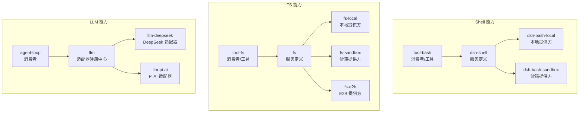
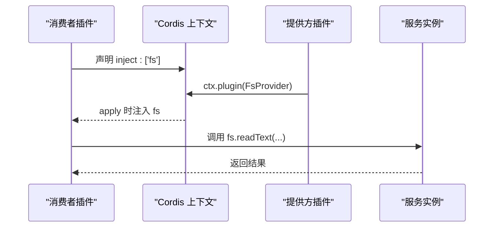
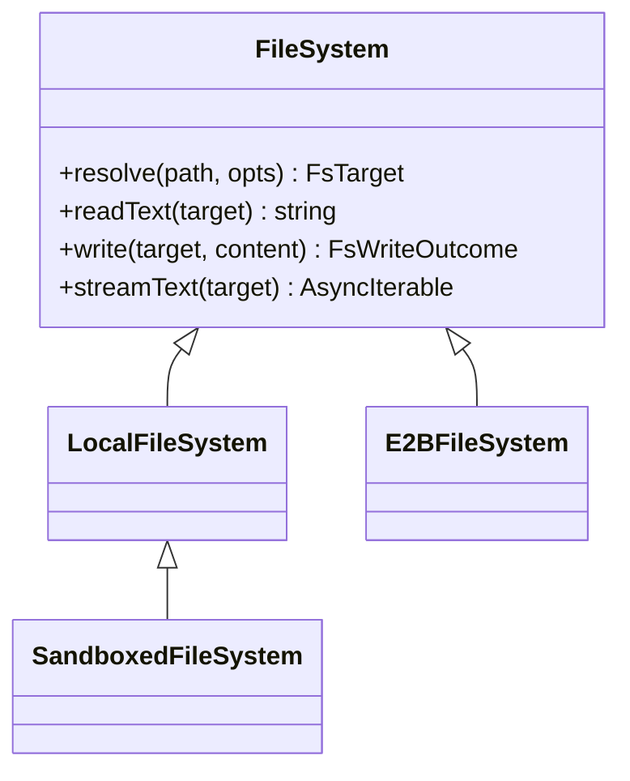
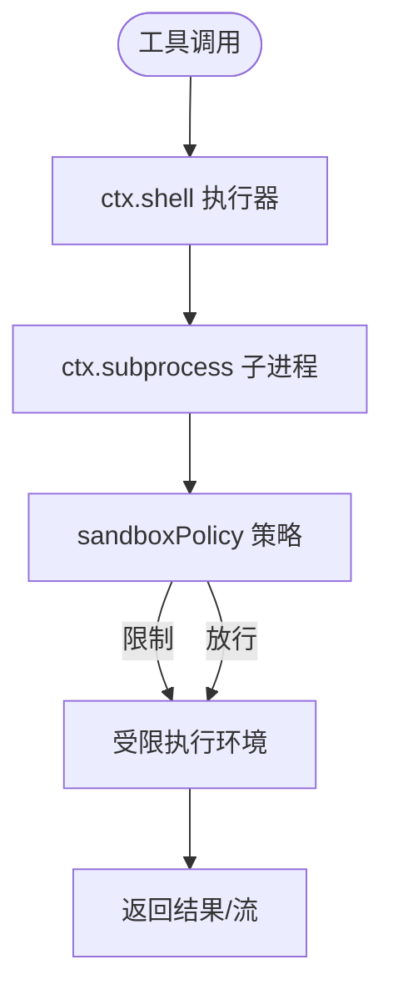
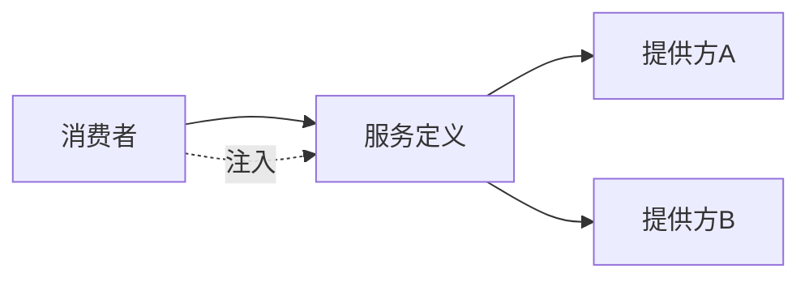

# 能力接缝模式

<cite>
**本文引用的文件**
- [docs/capability-seams.md](file://docs/capability-seams.md)
- [docs/capability-seams.zh.md](file://docs/capability-seams.zh.md)
- [docs/user/develop/practice/index.md](file://docs/user/develop/practice/index.md)
- [docs/user/develop/practice/index.zh.md](file://docs/user/develop/practice/index.zh.md)
- [docs/user/develop/practice/llm-adapter.md](file://docs/user/develop/practice/llm-adapter.md)
- [docs/user/develop/practice/llm-adapter.zh.md](file://docs/user/develop/practice/llm-adapter.zh.md)
- [docs/glossary.md](file://docs/glossary.md)
- [docs/cordis-api/context.md](file://docs/cordis-api/context.md)
- [packages/fs/fs-sandbox/src/index.ts](file://packages/fs/fs-sandbox/src/index.ts)
- [packages/e2b/fs-e2b/src/index.ts](file://packages/e2b/fs-e2b/src/index.ts)
- [packages/llm/llm/src/index.ts](file://packages/llm/llm/src/index.ts)
- [packages/llm/llm/tests/service.spec.ts](file://packages/llm/llm/tests/service.spec.ts)
- [packages/fs/fs/tests/service.spec.ts](file://packages/fs/fs/tests/service.spec.ts)
</cite>

## 目录
1. [简介](#简介)
2. [项目结构](#项目结构)
3. [核心组件](#核心组件)
4. [架构总览](#架构总览)
5. [详细组件分析](#详细组件分析)
6. [依赖关系分析](#依赖关系分析)
7. [性能与可维护性](#性能与可维护性)
8. [故障排查指南](#故障排查指南)
9. [结论](#结论)
10. [附录：扩展指南](#附录扩展指南)

## 简介
能力接缝（Capability Seam）是 DeepSeek Harness 中用于实现“可替换能力”的核心设计。一个能力由三个角色构成：服务定义（Service Definition）、服务提供者（Service Provider）、消费者（Consumer）。通过 Cordis 的服务注册与注入机制，同一接口可以在运行时被不同实现替换，从而实现文件系统、工具执行、LLM 适配器等能力的多提供者支持与降级策略。

本文件面向开发者，系统阐述能力接缝的设计理念、实现原理、注册机制、组合与替换方式，并给出具体扩展步骤与示例路径，帮助你在不破坏模型侧契约的前提下，安全地扩展和替换能力。

## 项目结构
能力接缝在仓库中以“包级职责分离”的方式组织：
- 服务定义通常位于独立包，暴露抽象类或服务类型以及请求/响应类型。
- 服务提供者在各自包中实现或注册该服务。
- 消费者通过 `inject` 声明依赖，调用服务而不感知具体实现。

下图展示了能力接缝的通用结构与典型能力族（以 shell、fs、llm 为例），以及它们如何被工具层消费。



图表来源
- [docs/capability-seams.md:493-566](file://docs/capability-seams.md#L493-L566)
- [docs/user/develop/practice/index.md:11-27](file://docs/user/develop/practice/index.md#L11-L27)

章节来源
- [docs/capability-seams.md:493-566](file://docs/capability-seams.md#L493-L566)
- [docs/user/develop/practice/index.md:11-27](file://docs/user/develop/practice/index.md#L11-L27)

## 核心组件
- 服务定义：拥有 `ctx.<key>` 与服务词汇类型，通常是抽象类或具体注册表；它不是 TypeScript interface。
- 服务提供者：实现或注册服务的具体插件，按部署配置选择。
- 消费者：通过 `inject` 声明依赖，调用服务而不关心实现细节。

关键要点
- “seam”指完整能力（三者集合），而非单一角色。
- 角色应尽可能分包，以便独立演进与替换。
- 消费者只依赖服务定义，不与提供方耦合。

章节来源
- [docs/glossary.md:7-9](file://docs/glossary.md#L7-L9)
- [docs/user/develop/practice/index.md:7-56](file://docs/user/develop/practice/index.md#L7-L56)
- [docs/user/develop/practice/index.zh.md:7-56](file://docs/user/develop/practice/index.zh.md#L7-L56)

## 架构总览
能力接缝通过 Cordis 的上下文与服务注册机制实现解耦：
- 服务定义在某个包中声明 `ctx.<key>` 的类型与行为。
- 提供方插件在启动时通过 `ctx.plugin(...)` 或 `ctx.effect(...)` 将实现挂载到上下文。
- 消费者通过 `inject` 声明所需服务，框架保证在 `apply` 时服务已就绪。
- 多个提供方可以并列注册，但同一 key 在同一上下文中只能有一个活跃实现；可通过 cordis.yml 切换。



图表来源
- [docs/cordis-api/context.md:235-284](file://docs/cordis-api/context.md#L235-L284)
- [docs/user/develop/framework/service.zh.md:1-63](file://docs/user/develop/framework/service.zh.md#L1-L63)

章节来源
- [docs/cordis-api/context.md:235-284](file://docs/cordis-api/context.md#L235-L284)
- [docs/user/develop/framework/service.zh.md:1-63](file://docs/user/develop/framework/service.zh.md#L1-L63)

## 详细组件分析

### 文件系统能力（ctx.fs）
- 角色
  - 服务定义：`fs` 包，定义文件系统原语与错误类型。
  - 提供方：`fs-local`（本地）、`fs-sandbox`（沙箱限制）、`fs-e2b`（E2B 远程）。
  - 消费者：`tool-fs` 等工具通过 `ctx.fs` 调用。
- 关键点
  - 沙箱提供方继承本地实现并增加路径包含检查与策略约束。
  - E2B 提供方将路径解析为进程内绝对路径，并通过 E2B SDK 管理远端工作目录。
  - 观察策略通过事件门禁贡献基于观测状态的检查。



图表来源
- [packages/fs/fs-sandbox/src/index.ts:29-56](file://packages/fs/fs-sandbox/src/index.ts#L29-L56)
- [packages/e2b/fs-e2b/src/index.ts:174-203](file://packages/e2b/fs-e2b/src/index.ts#L174-L203)

章节来源
- [packages/fs/fs-sandbox/src/index.ts:29-56](file://packages/fs/fs-sandbox/src/index.ts#L29-L56)
- [packages/e2b/fs-e2b/src/index.ts:174-203](file://packages/e2b/fs-e2b/src/index.ts#L174-L203)
- [docs/capability-seams.md:549-551](file://docs/capability-seams.md#L549-L551)

### 工具执行能力（ctx.shell / ctx.subprocess）
- 角色
  - 服务定义：`shell` 与 `subprocess` 分别定义命令执行与子进程生命周期。
  - 提供方：`bash-local`、`bash-sandbox`、`pwsh-local`、`lsp-stdio`、`subprocess-local`、`subprocess-e2b`。
  - 消费者：`tool-bash`、`tool-pwsh`、`terminal-bash`、`hooks-*` 等。
- 关键点
  - 工具层通过 `ctx.shell` 调用，底层通过 `ctx.subprocess` 管理进程树、stdio 与终止升级。
  - 沙箱提供方统一读取 `sandboxPolicy`，确保 bash 与 fs 限制到相同根目录。



图表来源
- [docs/capability-seams.md:540-547](file://docs/capability-seams.md#L540-L547)

章节来源
- [docs/capability-seams.md:540-547](file://docs/capability-seams.md#L540-L547)

### LLM 适配器能力（ctx.llm）
- 角色
  - 服务定义：`llm` 包，提供适配器注册中心与流式调用 API。
  - 提供方：`llm-deepseek`、`llm-pi-ai`、测试用 `llm-replay`。
  - 消费者：`agent-loop`、压缩模块等。
- 关键点
  - 适配器需实现 `stream()`，遵循 StreamChunk 协议。
  - 通过 `registerAdapter(providers, adapter)` 注册路由名；每个 provider 路由仅能有一个适配器所有者。
  - 支持模型发现、推理强度元数据、重试策略与错误码稳定化。

```mermaid
sequenceDiagram
participant Loop as "agent-loop"
participant Llm as "ctx.llm"
participant Adapter as "适配器实现"
participant Provider as "外部提供方API"
Loop->>Llm : stream({provider, model, messages})
Llm->>Adapter : 选择并调用 stream()
Adapter->>Provider : 发送请求
Provider-->>Adapter : 流式响应
Adapter-->>Llm : yield StreamChunk...
Llm-->>Loop : 聚合块与使用量
```

图表来源
- [packages/llm/llm/src/index.ts:1-38](file://packages/llm/llm/src/index.ts#L1-L38)
- [packages/llm/llm/tests/service.spec.ts:248-272](file://packages/llm/llm/tests/service.spec.ts#L248-L272)
- [docs/user/develop/practice/llm-adapter.md:52-124](file://docs/user/develop/practice/llm-adapter.md#L52-L124)

章节来源
- [packages/llm/llm/src/index.ts:1-38](file://packages/llm/llm/src/index.ts#L1-L38)
- [packages/llm/llm/tests/service.spec.ts:248-272](file://packages/llm/llm/tests/service.spec.ts#L248-L272)
- [docs/user/develop/practice/llm-adapter.md:52-124](file://docs/user/develop/practice/llm-adapter.md#L52-L124)

### 其他能力举例
- 会话查询（ctx.sessionQuery）：精确读取、过滤、追踪；后端可扩展全文检索与游标。
- 凭据（ctx.credentials）：配置携带引用，提供方持有值；每次操作按需解析，便于轮换。
- 审批（ctx.approval）：一次性权限决策通过事件瀑布分发；无回答方则关闭失败。
- 存储（ctx.storage）：非会话存储枢纽，领域优先的数据形态挂载到 hub。

章节来源
- [docs/capability-seams.md:517-566](file://docs/capability-seams.md#L517-L566)

## 依赖关系分析
- 服务定义与提供方之间是“实现/注册”关系；消费者与提供方之间无直接依赖。
- 同一能力可以有多个提供方，但同一上下文键只能有一个活跃实现；重复注册会报错。
- 通过 cordis.yml 组合插件，决定加载哪些提供方与消费者。



图表来源
- [packages/fs/fs/tests/service.spec.ts:85-121](file://packages/fs/fs/tests/service.spec.ts#L85-L121)
- [docs/capability-seams.md:493-566](file://docs/capability-seams.md#L493-L566)

章节来源
- [packages/fs/fs/tests/service.spec.ts:85-121](file://packages/fs/fs/tests/service.spec.ts#L85-L121)
- [docs/capability-seams.md:493-566](file://docs/capability-seams.md#L493-L566)

## 性能与可维护性
- 性能
  - 提供方优化（如沙箱限制、E2B 远端 I/O）不影响消费者代码。
  - LLM 适配器通过流式分片减少内存峰值，合理设置超时与重试策略。
- 可维护性
  - 角色分离使接口稳定后，提供方与消费者可独立演进。
  - 通过明确的配置分层与默认值解析，避免隐式行为。

[本节为通用指导，无需特定文件来源]

## 故障排查指南
- 重复服务注册
  - 现象：加载第二个实现时报错。
  - 原因：同一上下文键只能有一个活跃实现。
  - 处理：检查 cordis.yml，确保只加载一个提供方。
- 服务未就绪
  - 现象：消费者访问 ctx.xxx 为 undefined。
  - 原因：提供方尚未加载或 fiber 已释放。
  - 处理：确认插件顺序与依赖声明，必要时使用 `ctx.get(name, strict?)` 做可选读取。
- LLM 适配器错误
  - 现象：网络错误或协议不匹配。
  - 处理：抛出带稳定 code 的 `LlmError`，保留诊断信息；合并 attributionHeaders 并传递 signal。

章节来源
- [packages/fs/fs/tests/service.spec.ts:98-110](file://packages/fs/fs/tests/service.spec.ts#L98-L110)
- [docs/cordis-api/context.md:235-284](file://docs/cordis-api/context.md#L235-L284)
- [docs/user/develop/practice/llm-adapter.md:154-189](file://docs/user/develop/practice/llm-adapter.md#L154-L189)

## 结论
能力接缝通过“服务定义—提供方—消费者”的角色分离，结合 Cordis 的注入与注册机制，实现了高内聚、低耦合的可替换能力体系。文件系统、工具执行、LLM 适配器等核心能力均遵循此模式，使得多提供者支持、运行时切换与降级策略成为可能。开发者只需关注服务定义的稳定性，即可在不影响模型侧契约的前提下扩展与替换能力。

[本节为总结，无需特定文件来源]

## 附录：扩展指南

### 如何定义新能力（服务定义）
- 在独立包中定义抽象服务类与请求/响应类型。
- 扩展 `Context` 类型，声明 `ctx.<key>`。
- 导出服务类与类型供提供方与消费者使用。

参考路径
- [docs/user/develop/practice/index.md:60-88](file://docs/user/develop/practice/index.md#L60-L88)
- [docs/user/develop/practice/index.zh.md:60-88](file://docs/user/develop/practice/index.zh.md#L60-L88)

### 如何实现提供方
- 继承服务定义或实现注册逻辑。
- 在插件的 `apply(ctx)` 中通过 `ctx.plugin(...)` 或 `ctx.effect(...)` 提供服务。
- 遵循策略与限制（如沙箱、E2B、凭据解析）。

参考路径
- [docs/user/develop/practice/index.md:90-109](file://docs/user/develop/practice/index.md#L90-L109)
- [docs/user/develop/practice/index.zh.md:90-109](file://docs/user/develop/practice/index.zh.md#L90-L109)
- [packages/fs/fs-sandbox/src/index.ts:29-56](file://packages/fs/fs-sandbox/src/index.ts#L29-L56)

### 如何消费能力
- 在消费者插件中声明 `inject: ['<serviceKey>']`。
- 在 `apply(ctx)` 中调用服务方法，不关心具体实现。
- 通过工具注册将能力暴露给模型。

参考路径
- [docs/user/develop/practice/index.md:111-137](file://docs/user/develop/practice/index.md#L111-L137)
- [docs/user/develop/practice/index.zh.md:111-137](file://docs/user/develop/practice/index.zh.md#L111-L137)

### LLM 适配器实现要点
- 实现 `stream()` 并遵循 StreamChunk 协议。
- 覆写 `resolveModel()` 提供权威模型元数据。
- 通过 `ctx.llm.registerAdapter(['provider'], adapter)` 注册路由。
- 错误处理使用 `LlmError`，合并 attributionHeaders，传递 signal。

参考路径
- [docs/user/develop/practice/llm-adapter.md:11-124](file://docs/user/develop/practice/llm-adapter.md#L11-L124)
- [docs/user/develop/practice/llm-adapter.zh.md:11-124](file://docs/user/develop/practice/llm-adapter.zh.md#L11-L124)
- [packages/llm/llm/tests/service.spec.ts:248-272](file://packages/llm/llm/tests/service.spec.ts#L248-L272)

### 组合与替换
- 在 cordis.yml 中组合插件，选择提供方与消费者。
- 同一能力可并列多个提供方，但同一上下文键只能有一个活跃实现。
- 通过配置切换提供方，实现运行时替换与降级。

参考路径
- [docs/user/develop/practice/index.md:140-145](file://docs/user/develop/practice/index.md#L140-L145)
- [docs/user/develop/practice/index.zh.md:140-145](file://docs/user/develop/practice/index.zh.md#L140-L145)
- [docs/capability-seams.md:493-566](file://docs/capability-seams.md#L493-L566)