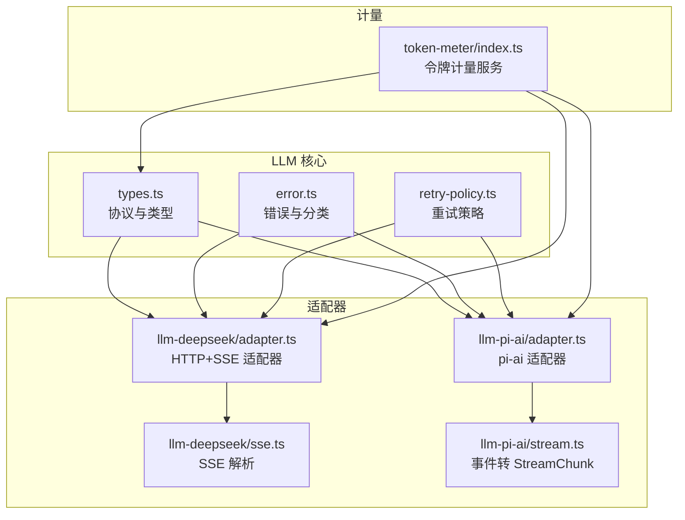
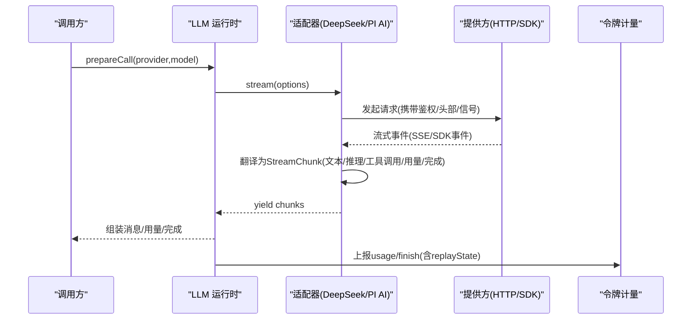
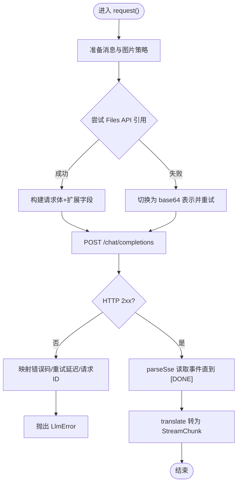
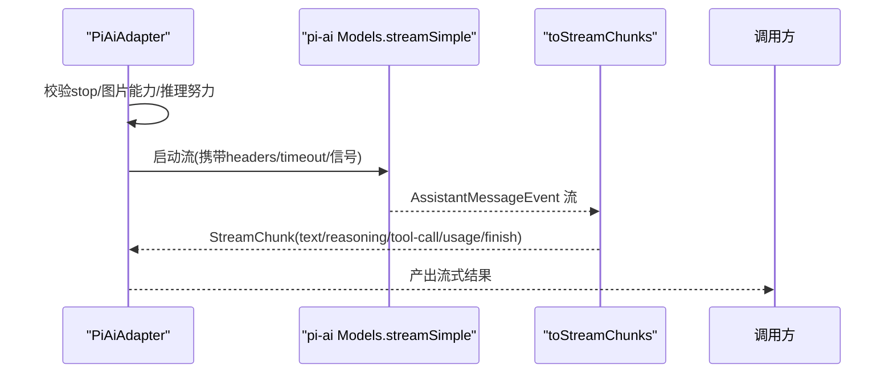
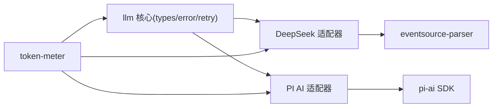

# LLM适配器提供者

<cite>
**本文引用的文件**
- [packages/llm/llm/src/types.ts](file://packages/llm/llm/src/types.ts)
- [packages/llm/llm/src/error.ts](file://packages/llm/llm/src/error.ts)
- [packages/llm/llm/src/retry-policy.ts](file://packages/llm/llm/src/retry-policy.ts)
- [packages/llm/llm-deepseek/src/adapter.ts](file://packages/llm/llm-deepseek/src/adapter.ts)
- [packages/llm/llm-deepseek/src/sse.ts](file://packages/llm/llm-deepseek/src/sse.ts)
- [packages/llm/llm-pi-ai/src/adapter.ts](file://packages/llm/llm-pi-ai/src/adapter.ts)
- [packages/llm/llm-pi-ai/src/stream.ts](file://packages/llm/llm-pi-ai/src/stream.ts)
- [packages/llm/token-meter/src/index.ts](file://packages/llm/token-meter/src/index.ts)
- [docs/cookbook/adding-an-llm-adapter.md](file://docs/cookbook/adding-an-llm-adapter.md)
- [packages/llm/llm-deepseek/tests/adapter.spec.ts](file://packages/llm/llm-deepseek/tests/adapter.spec.ts)
- [packages/llm/llm-pi-ai/tests/adapter.spec.ts](file://packages/llm/llm-pi-ai/tests/adapter.spec.ts)
</cite>

## 目录
1. [简介](#简介)
2. [项目结构](#项目结构)
3. [核心组件](#核心组件)
4. [架构总览](#架构总览)
5. [详细组件分析](#详细组件分析)
6. [依赖关系分析](#依赖关系分析)
7. [性能考量](#性能考量)
8. [故障排查指南](#故障排查指南)
9. [结论](#结论)
10. [附录](#附录)

## 简介
本文件面向希望为 Harness 扩展新的 LLM 提供商的开发者，系统阐述 LLM 适配器的实现架构与协议约定，覆盖流式响应处理、错误重试机制、令牌计量集成；对比 DeepSeek（直连 HTTP + SSE）与 PI AI（封装第三方 SDK）两类适配器的差异；说明认证配置、模型选择策略与性能调优参数；并提供新增适配器的开发步骤、测试策略与模拟环境搭建方法。

## 项目结构
- 通用协议与类型定义位于 llm 包：消息、块、流式协议、错误码、重试策略等。
- 具体适配器：
  - llm-deepseek：直接 HTTP 调用 OpenAI 兼容接口，使用 eventsource-parser 解析 SSE，并自行翻译为 Harness StreamChunk。
  - llm-pi-ai：基于 pi-ai SDK 的多提供商封装，将 SDK 事件转换为 Harness 协议。
- 令牌计量：token-meter 服务通过会话回放与适配器声明的图片请求定价，计算上下文压力与用量。
- 文档与示例：cookbook 提供新增适配器的规范与契约。

图表来源
- [packages/llm/llm/src/types.ts:370-390](file://packages/llm/llm/src/types.ts#L370-L390)
- [packages/llm/llm/src/error.ts:1-164](file://packages/llm/llm/src/error.ts#L1-L164)
- [packages/llm/llm/src/retry-policy.ts:1-196](file://packages/llm/llm/src/retry-policy.ts#L1-L196)
- [packages/llm/llm-deepseek/src/adapter.ts:1-711](file://packages/llm/llm-deepseek/src/adapter.ts#L1-L711)
- [packages/llm/llm-deepseek/src/sse.ts:1-41](file://packages/llm/llm-deepseek/src/sse.ts#L1-L41)
- [packages/llm/llm-pi-ai/src/adapter.ts:1-442](file://packages/llm/llm-pi-ai/src/adapter.ts#L1-L442)
- [packages/llm/llm-pi-ai/src/stream.ts:1-233](file://packages/llm/llm-pi-ai/src/stream.ts#L1-L233)
- [packages/llm/token-meter/src/index.ts:1-327](file://packages/llm/token-meter/src/index.ts#L1-L327)

章节来源
- [packages/llm/llm/src/types.ts:370-390](file://packages/llm/llm/src/types.ts#L370-L390)
- [docs/cookbook/adding-an-llm-adapter.md:1-44](file://docs/cookbook/adding-an-llm-adapter.md#L1-L44)

## 核心组件
- 流式协议 StreamChunk：统一描述文本、推理、工具调用增量、块结束、用量与完成原因；要求 usage 在 finish 之前发出，finish 之后不得再发任何块。
- 错误体系：HarnessError 带稳定 code；适配器需将传输/协议失败以 throw 抛出，或将提供方内联失败以 finish {kind:'error'|'aborted'} 返回。
- 重试策略：normal/always 两种模式，支持退避与抖动；默认可重试代码包含空响应、限流、服务端错误、超时、传输错误。
- 令牌计量：结合适配器提供的图片请求定价与会话回放，计算基线与表面增量，支持按路由定价。

章节来源
- [packages/llm/llm/src/types.ts:126-163](file://packages/llm/llm/src/types.ts#L126-L163)
- [packages/llm/llm/src/types.ts:370-390](file://packages/llm/llm/src/types.ts#L370-L390)
- [packages/llm/llm/src/error.ts:1-164](file://packages/llm/llm/src/error.ts#L1-L164)
- [packages/llm/llm/src/retry-policy.ts:1-196](file://packages/llm/llm/src/retry-policy.ts#L1-L196)
- [packages/llm/token-meter/src/index.ts:124-189](file://packages/llm/token-meter/src/index.ts#L124-L189)

## 架构总览
适配器作为“提供者中立”的桥接层，负责：
- 认证与请求头注入（含归属标识、会话 ID、用途标记）。
- 模型元数据与能力发现（listModels、resolveModel）。
- 流式输出到 StreamChunk 的映射（包括工具调用参数保持原始 JSON 字符串）。
- 错误归一化与重试信号传递（AbortSignal）。
- 可选的图片请求定价（供 token-meter 同步计价）。

图表来源
- [packages/llm/llm-deepseek/src/adapter.ts:442-522](file://packages/llm/llm-deepseek/src/adapter.ts#L442-L522)
- [packages/llm/llm-pi-ai/src/adapter.ts:342-440](file://packages/llm/llm-pi-ai/src/adapter.ts#L342-L440)
- [packages/llm/llm-pi-ai/src/stream.ts:141-233](file://packages/llm/llm-pi-ai/src/stream.ts#L141-L233)
- [packages/llm/token-meter/src/index.ts:124-189](file://packages/llm/token-meter/src/index.ts#L124-L189)

## 详细组件分析

### DeepSeek 适配器（HTTP + SSE）
- 连接与鉴权：每请求解析 Bearer Token，合并归属与会话头部；支持扩展字段注入与接受。
- 图片处理：优先 Files API 引用，失败回退 base64；对超限进行预算控制与去重；对提供方拒绝的已规范化图片给出诊断信息。
- 流式处理：使用 eventsource-parser 解析 SSE，严格等待 [DONE] 终止；空闲超时由 watchdog 管理。
- 错误映射：HTTP 状态与 provider error 映射为稳定 code（如 AUTH、RATE_LIMIT、CONTEXT_WINDOW_EXCEEDED、QUOTA），并携带 requestId/providerRetryAfterMs。
- 模型能力：listModels/resolveModel 暴露输入模态、上下文窗口、默认 maxTokens、推理努力等级。

图表来源
- [packages/llm/llm-deepseek/src/adapter.ts:524-709](file://packages/llm/llm-deepseek/src/adapter.ts#L524-L709)
- [packages/llm/llm-deepseek/src/sse.ts:1-41](file://packages/llm/llm-deepseek/src/sse.ts#L1-L41)

章节来源
- [packages/llm/llm-deepseek/src/adapter.ts:355-711](file://packages/llm/llm-deepseek/src/adapter.ts#L355-L711)
- [packages/llm/llm-deepseek/src/sse.ts:1-41](file://packages/llm/llm-deepseek/src/sse.ts#L1-L41)

### PI AI 适配器（SDK 封装）
- 多提供商快照：每次操作捕获不可变 profiles/models 快照，避免跨配置漂移。
- 认证与头部：支持 per-call apiKey 覆盖；合并部署自定义头与 Harness 归属头，后者优先级更高。
- 流式转换：将 pi-ai 事件流映射为 StreamChunk；工具调用参数从对象序列化为原始 JSON 字符串；错误以 finish 事件返回。
- 模型能力：基于 SDK 的能力元数据，动态报告推理努力等级与上下文窗口；未支持的 effort 提前报错。
- 图片输入：需要持久附件服务；根据 profile 限制像素/字节预算。

图表来源
- [packages/llm/llm-pi-ai/src/adapter.ts:342-440](file://packages/llm/llm-pi-ai/src/adapter.ts#L342-L440)
- [packages/llm/llm-pi-ai/src/stream.ts:141-233](file://packages/llm/llm-pi-ai/src/stream.ts#L141-L233)

章节来源
- [packages/llm/llm-pi-ai/src/adapter.ts:1-442](file://packages/llm/llm-pi-ai/src/adapter.ts#L1-L442)
- [packages/llm/llm-pi-ai/src/stream.ts:1-233](file://packages/llm/llm-pi-ai/src/stream.ts#L1-L233)

### 流式协议与契约
- 块索引：首次出现顺序分配 index，同一块的所有 delta 复用该 index。
- 工具调用参数：端到端保持原始 JSON 字符串；若提供方返回对象，需在 block-end 时重新序列化。
- 用量与完成：usage 必须在 finish 之前发出；finish 之后不得再有任何块。
- 错误路径：throw LlmError（传输/协议失败）或 finish {kind:'error'|'aborted'}（提供方内联失败）。
- 取消：必须尊重 options.signal。
- 不支持选项：如 stop 不被支持则抛 UNSUPPORTED_OPTION。
- 回放状态：finish.replayState 携带最小无损 JSON 投影，用于历史重建。

章节来源
- [docs/cookbook/adding-an-llm-adapter.md:25-35](file://docs/cookbook/adding-an-llm-adapter.md#L25-L35)
- [packages/llm/llm/src/types.ts:370-390](file://packages/llm/llm/src/types.ts#L370-L390)

### 错误与重试
- 错误分类：AUTH、RATE_LIMIT、CONTEXT_WINDOW_EXCEEDED、QUOTA、EMPTY_RESPONSE、TRANSPORT、TIMEOUT、SERVER 等。
- 重试策略：
  - normal：限定最大重试次数与可重试代码集合，配合指数退避与抖动。
  - always：无限重试直至成功、取消或销毁。
- 适配器职责：提供 providerRetryPolicy；将提供方 retry-after 与请求 ID 透传以便上层重试。

章节来源
- [packages/llm/llm/src/error.ts:1-164](file://packages/llm/llm/src/error.ts#L1-L164)
- [packages/llm/llm/src/retry-policy.ts:1-196](file://packages/llm/llm/src/retry-policy.ts#L1-L196)
- [packages/llm/llm-deepseek/src/adapter.ts:313-346](file://packages/llm/llm-deepseek/src/adapter.ts#L313-L346)

### 令牌计量集成
- 适配器需提供 imageRequestPricing：对请求中的图片按视觉 token 与可见文本分别计价，供 token-meter 同步评估。
- token-meter 通过会话回放与适配器路由定价，计算 baseline 与 surface 增量，并在可用时使用 provider usage 精确值。

章节来源
- [packages/llm/token-meter/src/index.ts:124-189](file://packages/llm/token-meter/src/index.ts#L124-L189)
- [packages/llm/token-meter/src/index.ts:191-204](file://packages/llm/token-meter/src/index.ts#L191-L204)
- [packages/llm/llm-deepseek/src/adapter.ts:371-381](file://packages/llm/llm-deepseek/src/adapter.ts#L371-L381)

### 认证配置与模型选择
- 认证：
  - DeepSeek：通过 resolveApiKey 获取 Bearer Token；插件拥有验证与分层策略。
  - PI AI：支持 per-call apiKey 覆盖；同时使用持久凭证存储与 AuthContext 解决其余认证。
- 模型选择：
  - listModels：列出可用模型及输入模态。
  - resolveModel：返回上下文窗口、默认 maxTokens、推理努力列表与默认值。
  - 动态目录：适配器可基于配置目录动态注册新模型，无需重启。

章节来源
- [packages/llm/llm-deepseek/src/adapter.ts:383-432](file://packages/llm/llm-deepseek/src/adapter.ts#L383-L432)
- [packages/llm/llm-pi-ai/src/adapter.ts:281-332](file://packages/llm/llm-pi-ai/src/adapter.ts#L281-L332)
- [docs/cookbook/adding-an-llm-adapter.md:23-24](file://docs/cookbook/adding-an-llm-adapter.md#L23-L24)

### 性能调优参数
- DeepSeek：
  - streamIdleTimeoutMs：单次读取空闲超时。
  - filesApiTimeoutMs：Files API 解析超时。
  - 图片预算：maxRequestFilesBytes、maxInlineRequestImageBytes、imageOffloadByteQuantum、inlineImageOffloadByteQuantum、imageOffloadCountQuantum、maxImagesPerRequest。
  - 默认上下文窗口与 maxTokens。
- PI AI：
  - timeoutMs、websocketConnectTimeoutMs、streamIdleTimeoutMs。
  - thinkingBudgets、cacheRetention、transport。
  - 图片预算：requestImagePixelBudget、requestImageMaxBytes、maxRequestImageBytes。

章节来源
- [packages/llm/llm-deepseek/src/adapter.ts:74-112](file://packages/llm/llm-deepseek/src/adapter.ts#L74-L112)
- [packages/llm/llm-pi-ai/src/adapter.ts:121-139](file://packages/llm/llm-pi-ai/src/adapter.ts#L121-L139)

### 新增适配器开发指南（示例）
- 基本形状：继承 LlmAdapter，实现 stream(options) 产出 StreamChunk；导出 name、inject、Config 与 apply(ctx, config) 注册适配器。
- 协议义务：遵循契约（块索引、工具参数原始 JSON、usage 在 finish 前、错误双路径、signal 支持、不支持选项抛错、replayState 最小无损投影）。
- 结构建议：将线协议类型、请求序列化、传输解析、块翻译、适配器类分离；参考 llm-deepseek 布局。
- 注册方式：effect-based 注册，HMR 安全；每个 provider 路由一个适配器实例；重复注册抛错。

章节来源
- [docs/cookbook/adding-an-llm-adapter.md:7-24](file://docs/cookbook/adding-an-llm-adapter.md#L7-L24)
- [docs/cookbook/adding-an-llm-adapter.md:25-39](file://docs/cookbook/adding-an-llm-adapter.md#L25-L39)

### 测试策略与模拟环境
- 单元测试：
  - 使用 mockServer 构造 SSE/JSON 响应，断言流式输出、错误映射、头部合并、图片预算行为。
  - 针对适配器能力（listModels/resolveModel）、推理努力、停止语义等进行断言。
- 端到端测试：
  - 通过 Context + plugin 装配真实适配器与扩展，验证完整链路。
- 模拟要点：
  - 伪造 SSE 事件序列与终止标志。
  - 模拟图片附件与 Files API 行为。
  - 模拟认证与环境变量注入。

章节来源
- [packages/llm/llm-deepseek/tests/adapter.spec.ts:1-200](file://packages/llm/llm-deepseek/tests/adapter.spec.ts#L1-L200)
- [packages/llm/llm-pi-ai/tests/adapter.spec.ts:1-200](file://packages/llm/llm-pi-ai/tests/adapter.spec.ts#L1-L200)

## 依赖关系分析
- 适配器依赖 llm 核心类型与错误；DeepSeek 依赖 eventsource-parser 解析 SSE；PI AI 依赖 pi-ai SDK。
- token-meter 依赖 llm 的 BlockAssembler 与适配器图片定价能力。
- 适配器通过 Cordis 上下文注入附件服务、凭据、用户 ID、扩展准备器等。

图表来源
- [packages/llm/llm/src/types.ts:370-390](file://packages/llm/llm/src/types.ts#L370-L390)
- [packages/llm/llm-deepseek/src/sse.ts:1-41](file://packages/llm/llm-deepseek/src/sse.ts#L1-L41)
- [packages/llm/llm-pi-ai/src/adapter.ts:29-41](file://packages/llm/llm-pi-ai/src/adapter.ts#L29-L41)
- [packages/llm/token-meter/src/index.ts:1-35](file://packages/llm/token-meter/src/index.ts#L1-L35)

章节来源
- [packages/llm/llm/src/types.ts:370-390](file://packages/llm/llm/src/types.ts#L370-L390)
- [packages/llm/llm-deepseek/src/sse.ts:1-41](file://packages/llm/llm-deepseek/src/sse.ts#L1-L41)
- [packages/llm/llm-pi-ai/src/adapter.ts:29-41](file://packages/llm/llm-pi-ai/src/adapter.ts#L29-L41)
- [packages/llm/token-meter/src/index.ts:1-35](file://packages/llm/token-meter/src/index.ts#L1-L35)

## 性能考量
- 流式空闲超时：合理设置 streamIdleTimeoutMs，避免长连接挂起。
- 图片预算：根据模型与网络条件调整像素/字节上限与降级策略，减少大请求失败率。
- 重试策略：对瞬态错误启用 normal 模式并配置退避；对关键任务可使用 always 模式但需谨慎。
- 头部与扩展：合并部署头与 Harness 头时注意冲突处理，避免冗余负载。
- 令牌计量：利用适配器图片定价提升估算精度，降低表面压力评估误差。

[本节为通用指导，不直接分析具体文件]

## 故障排查指南
- 常见问题定位：
  - 空响应：EMPTY_RESPONSE 表明提供方返回无内容块，应视为失败并可重试。
  - 上下文溢出：CONTEXT_WINDOW_EXCEEDED 提示请求超出模型上下文容量，需压缩历史或降低输入。
  - 配额耗尽：QUOTA 指示账户余额/额度不足，需充值或切换账号。
  - 传输中断：TRANSPORT/TIMEOUT 多为网络或网关问题，检查超时与重试策略。
- 调试技巧：
  - 检查适配器是否正确使用 AbortSignal 与 idleWatchdog。
  - 核对 SSE 是否以 [DONE] 结尾，否则会被判定为截断。
  - 确认工具调用参数是否为原始 JSON 字符串，避免下游解析失败。
  - 查看 providerRetryAfterMs 与 requestId，便于上游重试与追踪。

章节来源
- [packages/llm/llm/src/error.ts:24-49](file://packages/llm/llm/src/error.ts#L24-L49)
- [packages/llm/llm-deepseek/src/sse.ts:20-40](file://packages/llm/llm-deepseek/src/sse.ts#L20-L40)
- [packages/llm/llm-deepseek/src/adapter.ts:661-695](file://packages/llm/llm-deepseek/src/adapter.ts#L661-L695)
- [packages/llm/llm-pi-ai/src/stream.ts:42-68](file://packages/llm/llm-pi-ai/src/stream.ts#L42-L68)

## 结论
本仓库提供了统一的 LLM 适配器协议与两套成熟实现：DeepSeek 直连 HTTP+SSE 与 PI AI 封装 SDK。二者均严格遵循流式协议、错误分类与重试策略，并通过图片请求定价与令牌计量服务实现精准的成本与压力度量。开发者可依据 cookbook 快速实现新提供商适配器，借助测试与模拟环境保障正确性与稳定性。

[本节为总结性内容，不直接分析具体文件]

## 附录
- 新增适配器清单：
  - 继承 LlmAdapter，实现 stream() 产出 StreamChunk。
  - 实现 listModels/resolveModel 暴露模型能力。
  - 提供 imageRequestPricing（可选）以提升计量精度。
  - 在 apply 中注册适配器路由。
- 关键配置项速查：
  - DeepSeek：baseURL、apiKeyEnv、defaults、maxTokens、streamIdleTimeoutMs、图片预算、filesApiTimeoutMs、retryPolicy。
  - PI AI：providers 配置、reasoning/thinkingBudgets/cacheRetention/transport/timeoutMs/streamIdleTimeoutMs、图片预算。
- 测试建议：
  - 使用 mockServer 构造 SSE/事件流，覆盖正常、异常、截断场景。
  - 断言头部合并、推理努力、停止语义、图片预算与错误映射。

[本节为补充信息，不直接分析具体文件]