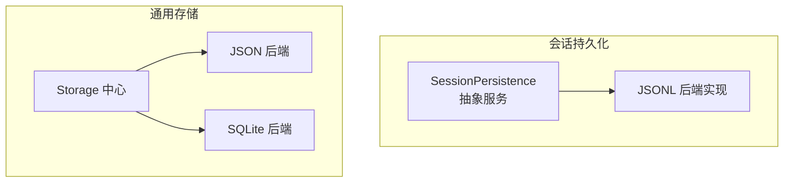
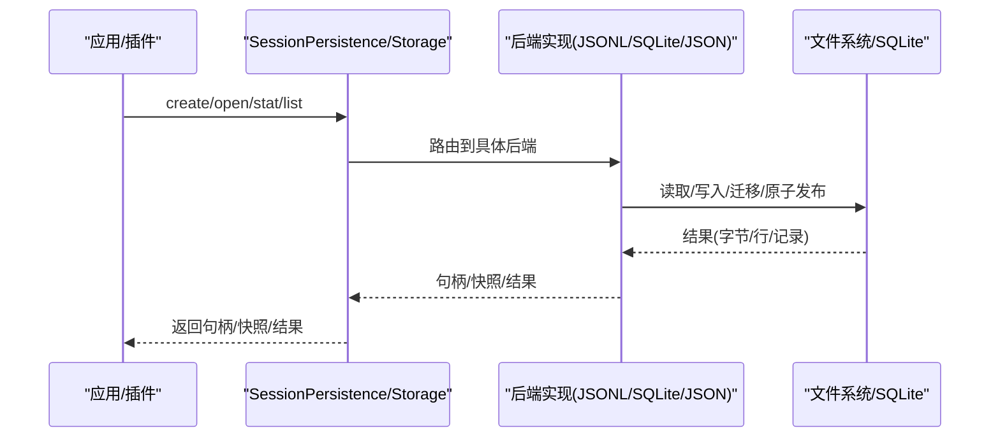
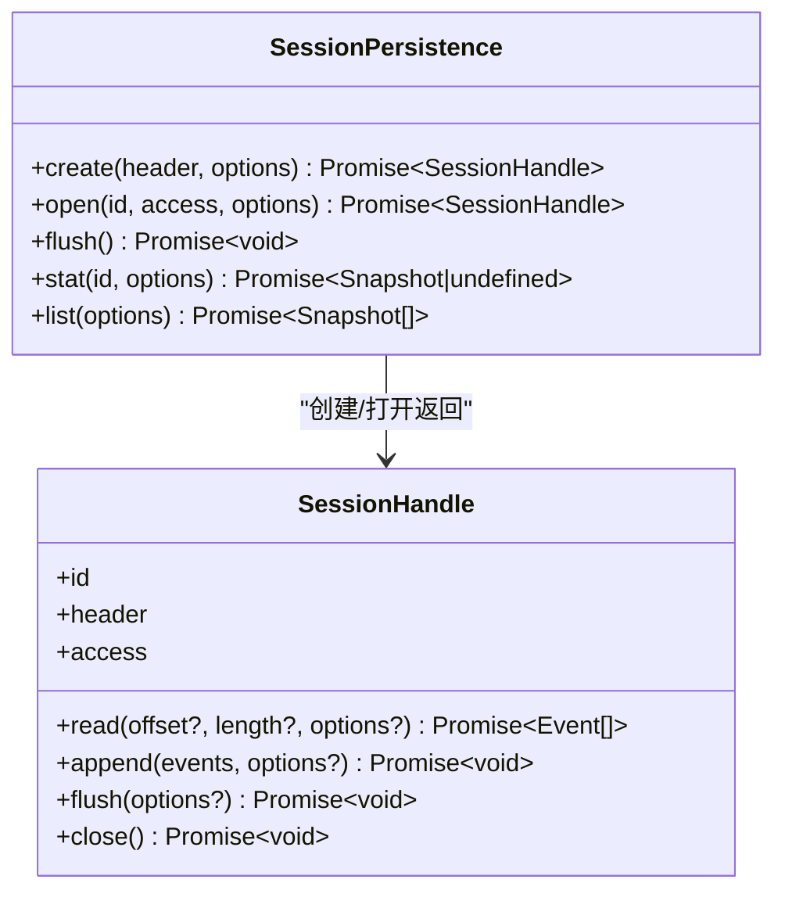
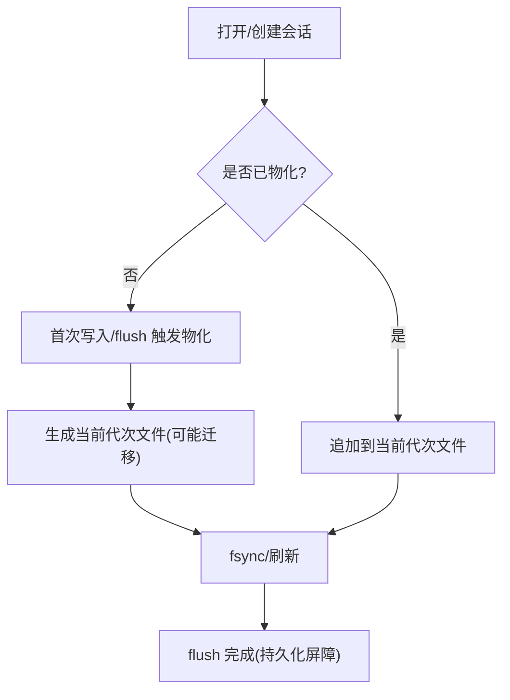
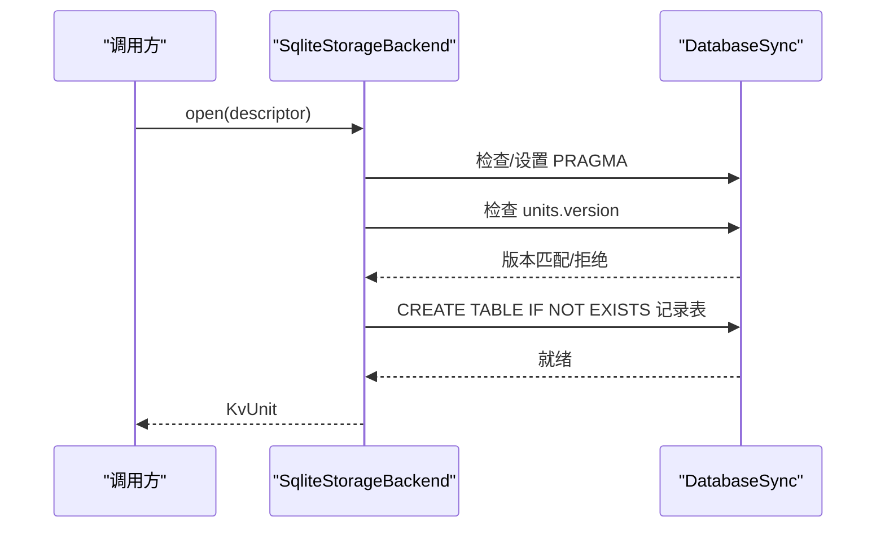
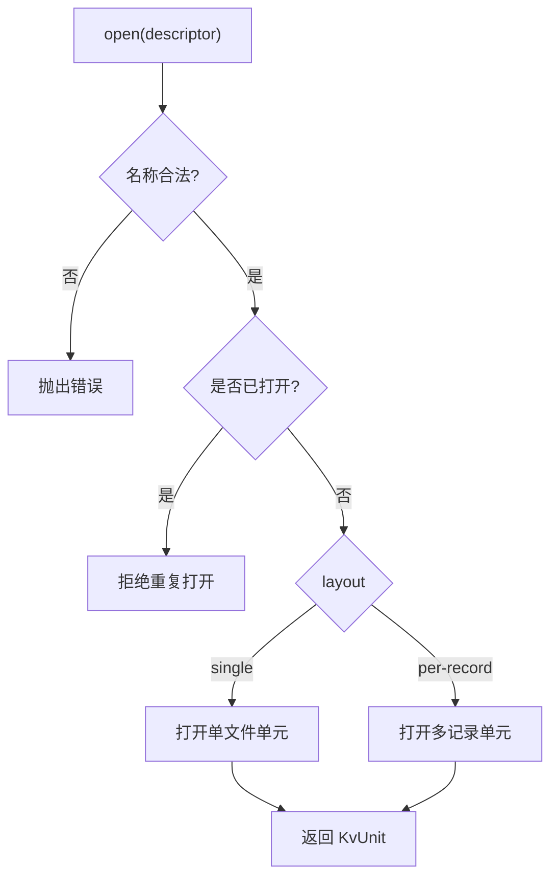
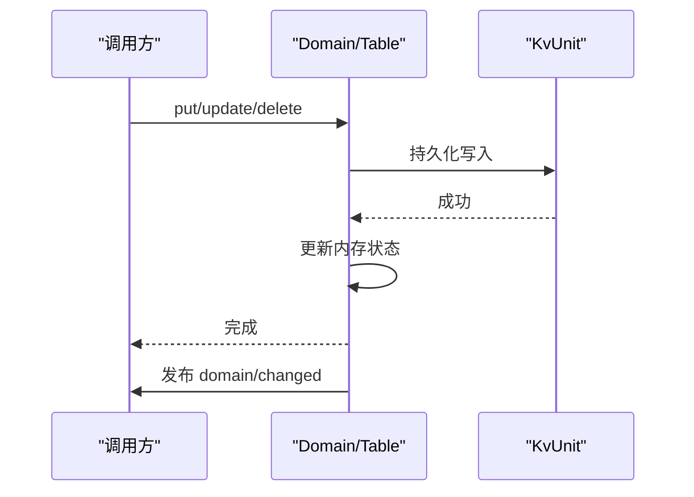
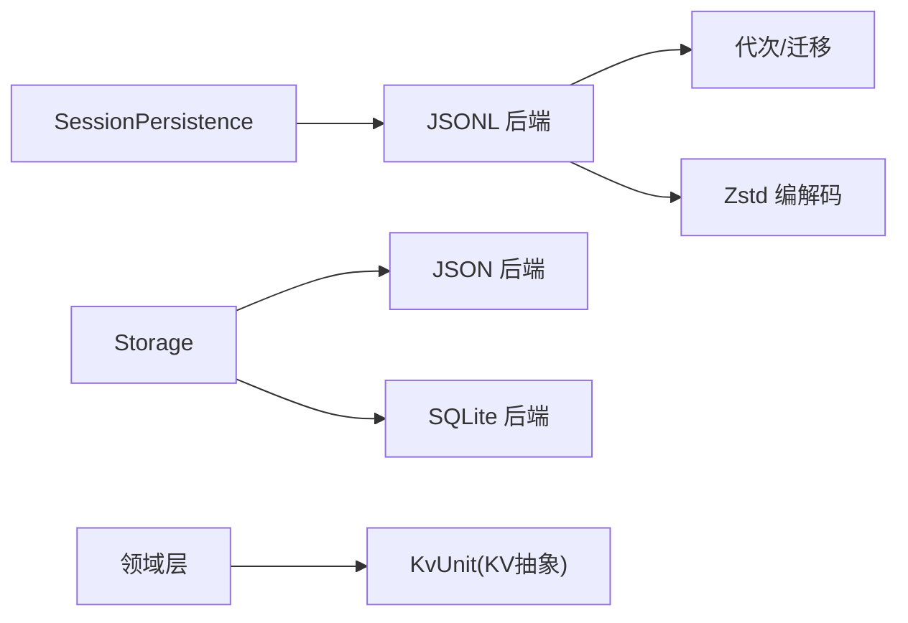

# 持久化提供者

<cite>
**本文引用的文件**
- [packages/session/session-persistence/src/index.ts](file://packages/session/session-persistence/src/index.ts)
- [packages/session/session-persistence-jsonl/src/index.ts](file://packages/session/session-persistence-jsonl/src/index.ts)
- [packages/storage/storage/src/index.ts](file://packages/storage/storage/src/index.ts)
- [packages/storage/storage-json/src/index.ts](file://packages/storage/storage-json/src/index.ts)
- [packages/storage/storage-sqlite/src/index.ts](file://packages/storage/storage-sqlite/src/index.ts)
- [packages/storage/storage-sqlite/src/schema.ts](file://packages/storage/storage-sqlite/src/schema.ts)
- [packages/storage/storage-domain/src/domain.ts](file://packages/storage/storage-domain/src/domain.ts)
- [docs/subsystems/persistence.md](file://docs/subsystems/persistence.md)
- [docs/persistence-catalog.md](file://docs/persistence-catalog.md)
</cite>

## 目录
1. [简介](#简介)
2. [项目结构](#项目结构)
3. [核心组件](#核心组件)
4. [架构总览](#架构总览)
5. [详细组件分析](#详细组件分析)
6. [依赖关系分析](#依赖关系分析)
7. [性能考虑](#性能考虑)
8. [故障排查指南](#故障排查指南)
9. [结论](#结论)
10. [附录：新存储后端开发指南](#附录新存储后端开发指南)

## 简介
本文件围绕“持久化提供者”展开，系统性说明会话事件日志的持久化抽象层、数据序列化与迁移、事务与一致性、并发访问控制、崩溃恢复、查询优化以及不同存储后端（JSONL、SQLite）的实现特点与适用场景。同时提供完整的持久化提供者开发与集成指南，帮助开发者实现新的存储后端并正确接入系统。

## 项目结构
仓库将“持久化”拆分为两层：
- 会话级持久化抽象与实现：以 `SessionPersistence` 抽象服务为核心，提供基于句柄的追加式事件日志接口；内置 JSONL 后端实现。
- 通用 KV 存储抽象与实现：以 `Storage` 中心注册表为入口，提供键值单元抽象；内置 JSON 文件与 SQLite 两种后端。

图表来源
- [packages/session/session-persistence/src/index.ts:114-198](file://packages/session/session-persistence/src/index.ts#L114-L198)
- [packages/session/session-persistence-jsonl/src/index.ts:146-197](file://packages/session/session-persistence-jsonl/src/index.ts#L146-L197)
- [packages/storage/storage/src/index.ts:47-93](file://packages/storage/storage/src/index.ts#L47-L93)
- [packages/storage/storage-json/src/index.ts:39-119](file://packages/storage/storage-json/src/index.ts#L39-L119)
- [packages/storage/storage-sqlite/src/index.ts:55-168](file://packages/storage/storage-sqlite/src/index.ts#L55-L168)

章节来源
- [packages/session/session-persistence/src/index.ts:114-198](file://packages/session/session-persistence/src/index.ts#L114-L198)
- [packages/storage/storage/src/index.ts:47-93](file://packages/storage/storage/src/index.ts#L47-L93)

## 核心组件
- SessionPersistence 抽象服务：定义 create/open/flush/stat/list 等能力，所有后端必须遵循同一语义：事件从 seq 0 连续追加且永不重写；物理尾部损坏不会返回给读者；append 尽力持久化，flush 是持久化屏障；创建后在本进程可见，跨进程在物化后可见。
- SessionHandle：每个会话一个句柄，承载 read/append/flush/close，保证单写者所有权与顺序可见性。
- Storage 中心：命名后端注册表 + 数据形式挂载点，不直接做 IO；后端拥有介质，领域层拥有语义。
- JSON/SQLite 后端：分别提供 per-record/single-unit 的文件布局与 SQLite 数据库布局，均通过 KvFacet/KvUnit 暴露统一 KV 能力。
- Domain 层：对 KV 单元之上的领域模型提供内存权威状态、串行写链、变更事件发布，确保“先持久化、再改内存、再发事件”。

章节来源
- [packages/session/session-persistence/src/index.ts:114-198](file://packages/session/session-persistence/src/index.ts#L114-L198)
- [docs/subsystems/persistence.md:1-10](file://docs/subsystems/persistence.md#L1-L10)
- [packages/storage/storage/src/index.ts:1-99](file://packages/storage/storage/src/index.ts#L1-L99)
- [packages/storage/storage-domain/src/domain.ts:1-120](file://packages/storage/storage-domain/src/domain.ts#L1-L120)

## 架构总览
下图展示从调用方到持久化的完整路径：上层通过会话持久化服务或通用存储中心访问具体后端；JSONL 后端负责会话事件日志的生成、压缩、迁移与原子发布；SQLite/JSON 后端提供 KV 单元用于领域数据。

图表来源
- [packages/session/session-persistence-jsonl/src/index.ts:219-308](file://packages/session/session-persistence-jsonl/src/index.ts#L219-L308)
- [packages/storage/storage-json/src/index.ts:51-80](file://packages/storage/storage-json/src/index.ts#L51-L80)
- [packages/storage/storage-sqlite/src/index.ts:75-123](file://packages/storage/storage-sqlite/src/index.ts#L75-L123)

## 详细组件分析

### 会话持久化抽象与服务契约
- 抽象服务提供 create/open/flush/stat/list，所有后端共享一致语义：追加不可变、损坏尾部丢弃、当前格式校验失败即拒绝、flush 作为持久化屏障。
- 句柄模式：read 不取所有权，write 原子获取单写者；同一会话仅一个活跃写者；读句柄可并发存在。
- 轻量 revision：stat/list 返回的 revision 用于缓存失效判断，不参与 open/read/resume。

图表来源
- [packages/session/session-persistence/src/index.ts:114-198](file://packages/session/session-persistence/src/index.ts#L114-L198)

章节来源
- [packages/session/session-persistence/src/index.ts:114-198](file://packages/session/session-persistence/src/index.ts#L114-L198)
- [docs/subsystems/persistence.md:10-102](file://docs/subsystems/persistence.md#L10-L102)

### JSONL 后端实现要点
- 每会话一个目录，按“代次”组织不可变文件；支持 zstd 压缩或明文 JSONL。
- 启动时选择源代次，必要时执行迁移链生成当前版本目标文件；只发布最终当前代次，源文件保持不变。
- 读取时解析首帧头行，校验身份与版本；支持从损坏尾部恢复完整记录并在下次写入时重写。
- 冷日志 LRU 缓存，结合 stat 派生的 revision 避免重复解析。
- 写路径：首次写入触发物化；后续追加按批次 fsync；flush 作为持久化屏障。
- 跨进程写锁：通过目录级内核锁保障单写者；未物化会话无磁盘痕迹。

图表来源
- [packages/session/session-persistence-jsonl/src/index.ts:219-308](file://packages/session/session-persistence-jsonl/src/index.ts#L219-L308)
- [packages/session/session-persistence-jsonl/src/index.ts:563-600](file://packages/session/session-persistence-jsonl/src/index.ts#L563-L600)
- [packages/session/session-persistence-jsonl/src/generation.ts:395-406](file://packages/session/session-persistence-jsonl/src/generation.ts#L395-L406)

章节来源
- [packages/session/session-persistence-jsonl/src/index.ts:146-197](file://packages/session/session-persistence-jsonl/src/index.ts#L146-L197)
- [packages/session/session-persistence-jsonl/src/index.ts:219-308](file://packages/session/session-persistence-jsonl/src/index.ts#L219-L308)
- [packages/session/session-persistence-jsonl/src/index.ts:468-538](file://packages/session/session-persistence-jsonl/src/index.ts#L468-L538)
- [packages/session/session-persistence-jsonl/src/generation.ts:395-406](file://packages/session/session-persistence-jsonl/src/generation.ts#L395-L406)

### SQLite 后端实现要点
- 单一数据库文件承载多个“单元(unit)”；每个单元维护 version 元信息，表名按规则生成。
- 打开时检查 schema user_version，非当前版本直接拒绝；开启外键约束与指定 journal_mode。
- 单元打开时确保记录表存在；读写通过 prepared statement 进行。
- 关闭时释放所有单元并关闭数据库连接。

图表来源
- [packages/storage/storage-sqlite/src/index.ts:75-123](file://packages/storage/storage-sqlite/src/index.ts#L75-L123)
- [packages/storage/storage-sqlite/src/schema.ts:60-107](file://packages/storage/storage-sqlite/src/schema.ts#L60-L107)

章节来源
- [packages/storage/storage-sqlite/src/index.ts:55-168](file://packages/storage/storage-sqlite/src/index.ts#L55-L168)
- [packages/storage/storage-sqlite/src/schema.ts:14-29](file://packages/storage/storage-sqlite/src/schema.ts#L14-L29)
- [packages/storage/storage-sqlite/src/schema.ts:60-107](file://packages/storage/storage-sqlite/src/schema.ts#L60-L107)

### JSON 后端实现要点
- 支持两种布局：single-unit（整单元文件）与 per-record（每条记录独立文件）。
- 打开时校验 unit/table 名称；并发打开同一 unit 会拒绝；关闭时等待所有 in-flight opens 并完成清理。
- per-record 布局支持旧版文档迁移至新版本记录；single-unit 保持精确版本匹配。

图表来源
- [packages/storage/storage-json/src/index.ts:51-80](file://packages/storage/storage-json/src/index.ts#L51-L80)

章节来源
- [packages/storage/storage-json/src/index.ts:39-119](file://packages/storage/storage-json/src/index.ts#L39-L119)

### 领域层与事务一致性
- 领域层维护内存权威状态，所有写操作进入串行写链：先持久化成功，再更新内存，最后发布变更事件。
- 写链拒绝发生在 close 后；读操作在关闭前仍有效。
- 事件监听器抛错不影响已提交的事务，仅记录警告。

图表来源
- [packages/storage/storage-domain/src/domain.ts:1-120](file://packages/storage/storage-domain/src/domain.ts#L1-L120)
- [packages/storage/storage-domain/src/domain.ts:263-270](file://packages/storage/storage-domain/src/domain.ts#L263-L270)

章节来源
- [packages/storage/storage-domain/src/domain.ts:1-120](file://packages/storage/storage-domain/src/domain.ts#L1-L120)
- [packages/storage/storage-domain/src/domain.ts:263-270](file://packages/storage/storage-domain/src/domain.ts#L263-L270)

### 数据迁移策略
- 会话事件日志：按“代次”组织，迁移链将历史版本转换为当前版本，仅发布最终当前代次文件；源文件保持不变。
- JSON 后端 per-record：接受兼容版本集合，将旧记录迁移为新版本记录；single-unit 严格版本匹配。
- SQLite：schema user_version 必须等于当前版本，否则拒绝；无内建迁移，需外部工具处理。

章节来源
- [packages/session/session-persistence-jsonl/src/index.ts:411-459](file://packages/session/session-persistence-jsonl/src/index.ts#L411-L459)
- [packages/storage/storage-json/src/index.ts:93-102](file://packages/storage/storage-json/src/index.ts#L93-L102)
- [packages/storage/storage-sqlite/src/schema.ts:14-29](file://packages/storage/storage-sqlite/src/schema.ts#L14-L29)
- [packages/storage/storage-sqlite/src/schema.ts:60-107](file://packages/storage/storage-sqlite/src/schema.ts#L60-L107)

### 备份与恢复
- 会话日志：崩溃恢复保留未完成 turn 的边界标记，由上层计算缺失收尾事件并追加；JSONL 可从损坏尾部恢复完整记录并在下次写入时重写。
- JSON 后端：per-record 布局支持旧文档迁移；invalid records 可按领域策略备份并跳过。
- SQLite：journal_mode 可选 wal 或 rollback-journal 模式；用户版本不匹配直接拒绝，需人工干预。

章节来源
- [docs/subsystems/persistence.md:91-102](file://docs/subsystems/persistence.md#L91-L102)
- [packages/session/session-persistence-jsonl/src/index.ts:645-729](file://packages/session/session-persistence-jsonl/src/index.ts#L645-L729)
- [packages/storage/storage-sqlite/src/schema.ts:22-29](file://packages/storage/storage-sqlite/src/schema.ts#L22-L29)

### 并发访问控制与一致性
- 会话写锁：JSONL 使用目录级内核锁，确保单写者；未物化会话无磁盘痕迹，首次写入前才加锁。
- 句柄所有权：write 句柄独占；read 句柄可并发；关闭句柄释放所有权。
- 领域写链：单写串行化，保证内存与介质一致，事件在持久化之后发出。

章节来源
- [packages/session/session-persistence-jsonl/src/index.ts:620-643](file://packages/session/session-persistence-jsonl/src/index.ts#L620-L643)
- [packages/session/session-persistence/src/index.ts:148-161](file://packages/session/session-persistence/src/index.ts#L148-L161)
- [packages/storage/storage-domain/src/domain.ts:1-120](file://packages/storage/storage-domain/src/domain.ts#L1-L120)

### 查询优化
- 轻量 revision：stat/list 返回的 revision 用于缓存失效判断，避免全量重读。
- JSONL 冷日志 LRU 缓存：限制条目数，命中则复用解析结果。
- 列表扫描：仅读取头部与投影缓存提示，避免启动时扫描正文。

章节来源
- [packages/session/session-persistence-jsonl/src/index.ts:317-382](file://packages/session/session-persistence-jsonl/src/index.ts#L317-L382)
- [packages/session/session-persistence-jsonl/src/index.ts:160-167](file://packages/session/session-persistence-jsonl/src/index.ts#L160-L167)
- [docs/subsystems/persistence.md:273-303](file://docs/subsystems/persistence.md#L273-L303)

## 依赖关系分析
- 会话持久化依赖事件类型目录与格式目录，确保版本与事件词汇一致。
- JSONL 后端依赖生成器模块进行代次选择与迁移；依赖压缩/解码工具处理 Zstandard 帧。
- 通用存储中心依赖后端注册表；JSON/SQLite 后端各自实现 KvFacet/KvUnit。
- 领域层依赖 KvUnit 抽象，屏蔽底层介质差异。

图表来源
- [packages/session/session-persistence-jsonl/src/index.ts:146-197](file://packages/session/session-persistence-jsonl/src/index.ts#L146-L197)
- [packages/storage/storage/src/index.ts:47-93](file://packages/storage/storage/src/index.ts#L47-L93)
- [packages/storage/storage-domain/src/domain.ts:1-120](file://packages/storage/storage-domain/src/domain.ts#L1-L120)

章节来源
- [packages/session/session-persistence-jsonl/src/index.ts:146-197](file://packages/session/session-persistence-jsonl/src/index.ts#L146-L197)
- [packages/storage/storage/src/index.ts:47-93](file://packages/storage/storage/src/index.ts#L47-L93)
- [packages/storage/storage-domain/src/domain.ts:1-120](file://packages/storage/storage-domain/src/domain.ts#L1-L120)

## 性能考虑
- JSONL：
  - 默认启用 Zstandard 压缩，减少体积；解码时分帧 yield 避免阻塞事件循环。
  - 冷日志 LRU 缓存与 revision 机制降低重复解析开销。
  - 追加批量化与 fsync 策略平衡吞吐与持久化。
- SQLite：
  - WAL 模式适合本地磁盘；网络挂载建议使用 rollback-journal 模式。
  - 预编译语句与 STRICT 表提升稳定性与性能。
- 通用：
  - 列表与统计操作尽量只读头部/元数据，避免正文扫描。
  - 领域写链串行化避免并发竞争，简化一致性推理。

[本节为通用指导，不直接分析具体文件]

## 故障排查指南
- 会话格式不支持：当遇到未知事件类型或未来版本时，服务会拒绝并附带原始日志路径，便于定位。
- 存储损坏：JSONL 会在解析失败时抛出损坏错误并携带原始路径；SQLite 在 schema 不匹配时抛出版本不匹配错误。
- 写锁冲突：尝试对已有写句柄的会话再次打开 write 会拒绝；关闭句柄后释放所有权。
- 领域关闭：关闭后新写立即拒绝，已排队写继续完成并发送事件。

章节来源
- [packages/session/session-persistence-jsonl/src/index.ts:411-459](file://packages/session/session-persistence-jsonl/src/index.ts#L411-L459)
- [packages/storage/storage-sqlite/src/schema.ts:76-87](file://packages/storage/storage-sqlite/src/schema.ts#L76-L87)
- [packages/storage/storage-domain/src/domain.ts:225-244](file://packages/storage/storage-domain/src/domain.ts#L225-L244)

## 结论
该持久化体系通过“句柄+追加日志”的设计，将高可靠的事件溯源与灵活的存储后端解耦。JSONL 后端提供高性能、可迁移、可恢复的会话日志存储；SQLite/JSON 后端提供稳定的 KV 能力支撑领域数据。统一的抽象、严格的版本与迁移策略、明确的并发与一致性模型，使系统具备可扩展性与可运维性。

[本节为总结，不直接分析具体文件]

## 附录：新存储后端开发指南
- 明确职责边界：
  - 若目标是会话事件日志，请实现 `SessionPersistence` 抽象服务，遵循追加不可变、损坏尾部丢弃、flush 持久化屏障、单写者所有权等语义。
  - 若目标是领域 KV 数据，请实现 `StorageBackend.kv` 并提供 `KvUnit`，遵循版本管理、原子发布、关闭释放等约定。
- 关键实现要点：
  - 序列化与校验：确保事件/记录可 JSON 序列化并通过当前版本校验；未知类型应 fail-closed。
  - 迁移策略：历史版本需能迁移到当前版本；仅发布最终当前代次；源文件保持不变。
  - 并发控制：提供单写者锁（如目录锁/数据库锁），防止竞态；句柄关闭后释放所有权。
  - 崩溃恢复：支持从损坏尾部恢复完整记录或在下次写入时修复；SQLite 需保证 journal_mode 与 schema 版本一致。
  - 查询优化：提供轻量 revision；列表/统计尽量只读元数据；缓存解析结果并限制大小。
- 集成步骤：
  - 注册后端：在 Storage 中心注册 KV 后端；或通过 Cordis 插件注册会话持久化后端。
  - 配置验证：使用 Schema 验证配置项（如 root/path/journalMode/compression）。
  - 生命周期：在 effect/disposer 中注销后端并安全关闭资源。
- 测试建议：
  - 覆盖并发打开/关闭、重复打开拒绝、版本不匹配、损坏恢复、迁移链路、flush 持久化语义。
  - 针对 JSONL 增加 Zstd 帧损坏、截断、回退恢复用例；针对 SQLite 增加 journal_mode 切换与 schema 升级用例。

[本节为通用指南，不直接分析具体文件]