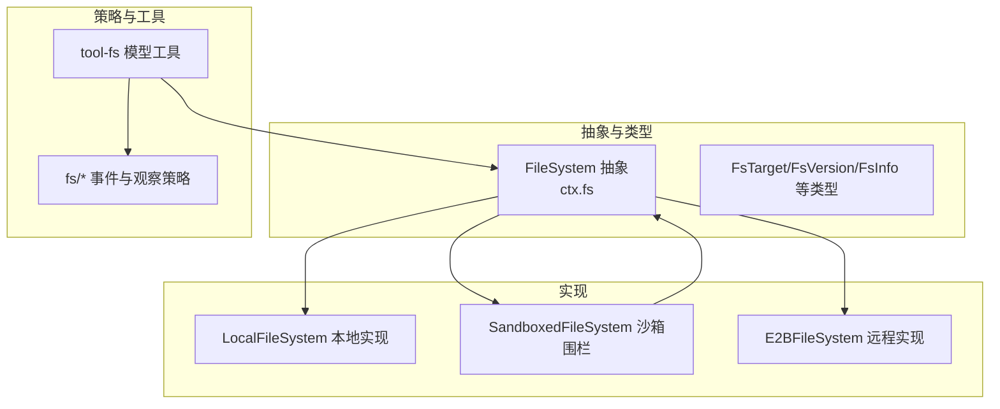
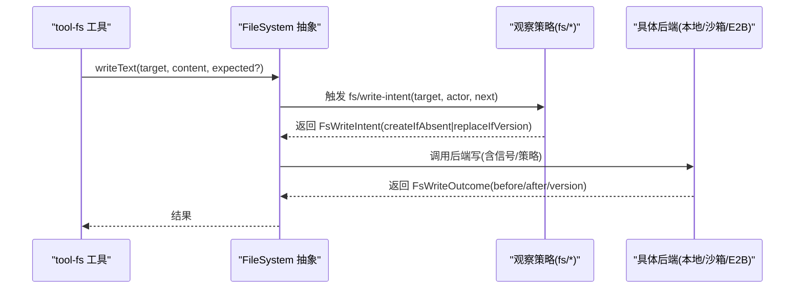
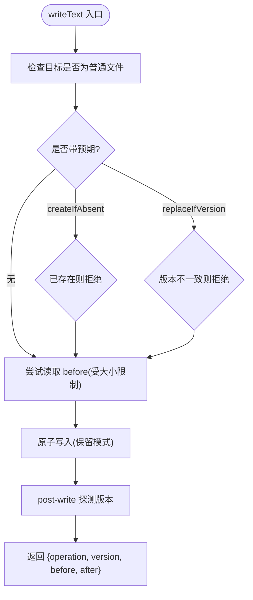
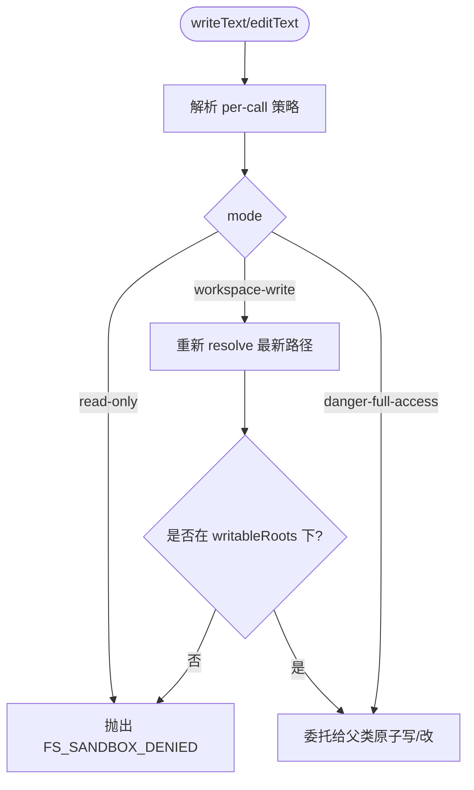
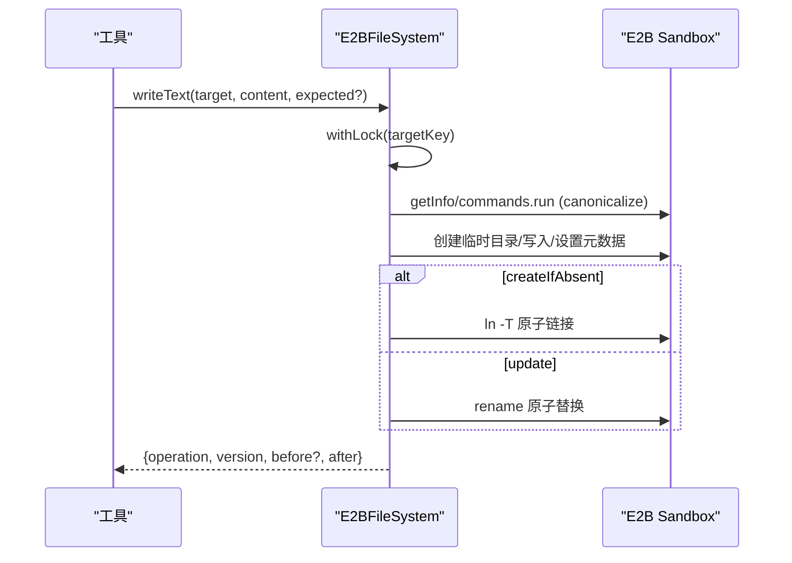
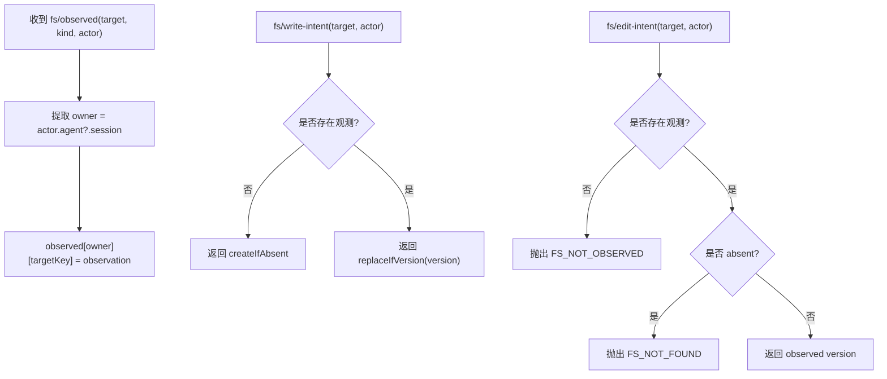
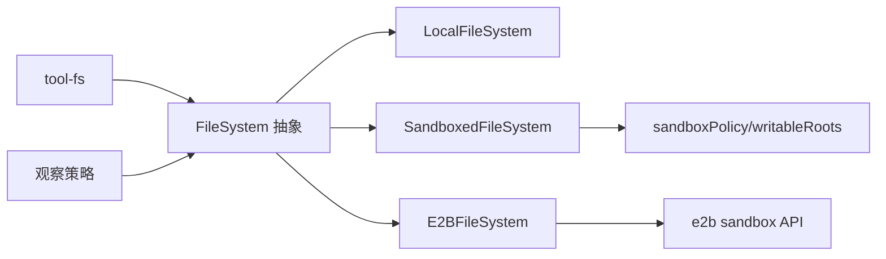

# 文件系统提供者

<cite>
**本文引用的文件**
- [packages/fs/fs/src/index.ts](file://packages/fs/fs/src/index.ts)
- [packages/fs/fs/src/types.ts](file://packages/fs/fs/src/types.ts)
- [packages/fs/fs-local/src/index.ts](file://packages/fs/fs-local/src/index.ts)
- [packages/fs/fs-sandbox/src/index.ts](file://packages/fs/fs-sandbox/src/index.ts)
- [packages/e2b/fs-e2b/src/index.ts](file://packages/e2b/fs-e2b/src/index.ts)
- [packages/fs/fs-observation-policy/src/index.ts](file://packages/fs/fs-observation-policy/src/index.ts)
- [packages/fs/tool-fs/src/index.ts](file://packages/fs/tool-fs/src/index.ts)
- [docs/subsystems/filesystem.md](file://docs/subsystems/filesystem.md)
- [docs/subsystems/sandbox.md](file://docs/subsystems/sandbox.md)
</cite>

## 目录
1. [简介](#简介)
2. [项目结构](#项目结构)
3. [核心组件](#核心组件)
4. [架构总览](#架构总览)
5. [详细组件分析](#详细组件分析)
6. [依赖关系分析](#依赖关系分析)
7. [性能与并发](#性能与并发)
8. [故障排查指南](#故障排查指南)
9. [结论](#结论)
10. [附录：扩展新存储后端开发指南](#附录扩展新存储后端开发指南)

## 简介
本文件系统抽象层通过统一的 `FileSystem` 服务定义，屏蔽本地磁盘、沙箱隔离与远程 E2B 等后端差异，提供稳定的目标标识、元数据、文本/字节读取、目录列举以及原子写入/编辑能力。配合“观察策略”插件，实现基于版本的新鲜度保护；结合沙箱执行策略，对写/改操作进行权限围栏。工具层仅面向模型暴露读/写/编辑能力，不感知后端细节。

## 项目结构
- 抽象接口与服务定义：`@deepseek-ai/dsh-fs`（`packages/fs/fs`）
- 本地实现：`@deepseek-ai/dsh-fs-local`（`packages/fs/fs-local`）
- 沙箱围栏实现：`@deepseek-ai/dsh-fs-sandbox`（`packages/fs/fs-sandbox`）
- 远程 E2B 实现：`@deepseek-ai/dsh-fs-e2b`（`packages/e2b/fs-e2b`）
- 观察策略插件：`@deepseek-ai/dsh-fs-observation-policy`（`packages/fs/fs-observation-policy`）
- 模型侧工具集：`dsh-tool-fs`（`packages/fs/tool-fs`）
- 子系统文档：`docs/subsystems/filesystem.md`、`docs/subsystems/sandbox.md`

图表来源
- [packages/fs/fs/src/index.ts:86-263](file://packages/fs/fs/src/index.ts#L86-L263)
- [packages/fs/fs/src/types.ts:11-198](file://packages/fs/fs/src/types.ts#L11-L198)
- [packages/fs/fs-local/src/index.ts:64-267](file://packages/fs/fs-local/src/index.ts#L64-L267)
- [packages/fs/fs-sandbox/src/index.ts:55-145](file://packages/fs/fs-sandbox/src/index.ts#L55-L145)
- [packages/e2b/fs-e2b/src/index.ts:171-580](file://packages/e2b/fs-e2b/src/index.ts#L171-L580)
- [packages/fs/fs-observation-policy/src/index.ts:106-130](file://packages/fs/fs-observation-policy/src/index.ts#L106-L130)
- [packages/fs/tool-fs/src/index.ts:54-79](file://packages/fs/tool-fs/src/index.ts#L54-L79)

章节来源
- [docs/subsystems/filesystem.md:1-10](file://docs/subsystems/filesystem.md#L1-L10)

## 核心组件
- FileSystem 抽象服务：定义 resolve/stat/lstat/readText/streamText/readBytes/listDir/writeText/editText 等统一接口，并声明 fs/* 事件契约（write-intent、edit-intent、observed）。
- 本地实现 LocalFileSystem：基于 realpath 的目标稳定性、原子写入、LF 归一化、按目标键的串行锁，保证并发安全与一致性。
- 沙箱围栏 SandboxedFileSystem：在写/改前根据 per-call 策略（read-only/workspace-write/danger-full-access）进行路径围栏与拒绝控制。
- E2B 实现 E2BFileSystem：在远程沙箱内完成路径规范化、元数据、流式读取、原子提交（临时目录+rename/ln -T），并维护版本 token。
- 观察策略插件：通过 WeakMap 记录每个会话对目标的“存在/不存在”观测，驱动 write/edit 意图决策。
- 工具层 tool-fs：注册 read/write/edit/read_image 工具，负责窗口化读取、渲染、沙箱控制器与策略集成。

章节来源
- [packages/fs/fs/src/index.ts:86-263](file://packages/fs/fs/src/index.ts#L86-L263)
- [packages/fs/fs/src/types.ts:11-198](file://packages/fs/fs/src/types.ts#L11-L198)
- [packages/fs/fs-local/src/index.ts:64-267](file://packages/fs/fs-local/src/index.ts#L64-L267)
- [packages/fs/fs-sandbox/src/index.ts:55-145](file://packages/fs/fs-sandbox/src/index.ts#L55-L145)
- [packages/e2b/fs-e2b/src/index.ts:171-580](file://packages/e2b/fs-e2b/src/index.ts#L171-L580)
- [packages/fs/fs-observation-policy/src/index.ts:106-130](file://packages/fs/fs-observation-policy/src/index.ts#L106-L130)
- [packages/fs/tool-fs/src/index.ts:54-79](file://packages/fs/tool-fs/src/index.ts#L54-L79)

## 架构总览
文件系统能力由“抽象服务 + 多后端实现 + 策略插件 + 工具层”组成。工具层调用 ctx.fs 提供的统一接口；可选的观察策略通过 fs/* 事件决定写/改意图；沙箱围栏在写/改时依据 per-call 策略限制可写范围。

图表来源
- [packages/fs/fs/src/index.ts:44-78](file://packages/fs/fs/src/index.ts#L44-L78)
- [packages/fs/fs-observation-policy/src/index.ts:116-122](file://packages/fs/fs-observation-policy/src/index.ts#L116-L122)
- [packages/fs/fs-local/src/index.ts:170-223](file://packages/fs/fs-local/src/index.ts#L170-L223)
- [packages/e2b/fs-e2b/src/index.ts:376-403](file://packages/e2b/fs-e2b/src/index.ts#L376-L403)

## 详细组件分析

### 抽象服务与类型契约
- 目标与版本：FsTarget（targetKey/displayPath）、FsVersion（新鲜令牌）
- 元数据：FsInfo（version/type/size）、FsPathInfo（path-level lstat，支持 symlink）
- 目录项：FsDirEntry（name/type/target/version?/size?）
- 写意图：FsWriteIntent（createIfAbsent | replaceIfVersion）
- 写/改结果：FsWriteOutcome（operation/version/before/after）、FsEditOutcome（version/before/after）
- 错误码：FsErrorCode（FS_NOT_FOUND、FS_PERMISSION_DENIED、FS_SANDBOX_DENIED、FS_STALE_VERSION 等）

章节来源
- [packages/fs/fs/src/types.ts:11-198](file://packages/fs/fs/src/types.ts#L11-L198)
- [docs/subsystems/filesystem.md:11-112](file://docs/subsystems/filesystem.md#L11-L112)

### 本地文件系统（LocalFileSystem）
- 目标稳定：基于 realpath，别名共享同一 targetKey，便于跨别名的一致性校验
- 并发安全：以 targetKey 为键的尾链 Promise 锁，序列化写/改，避免竞态
- 原子写入：先捕获可选 diff 基线（before），再原子发布，最后探测新版本
- LF 归一化：写入后统一 LF，diff 计算一致
- 读/流/列：readText/streamText/readBytes/listDir 均遵循抽象契约
- 错误处理：非文件、权限、I/O、中止等错误映射到 FsError

图表来源
- [packages/fs/fs-local/src/index.ts:170-223](file://packages/fs/fs-local/src/index.ts#L170-L223)

章节来源
- [packages/fs/fs-local/src/index.ts:64-267](file://packages/fs/fs-local/src/index.ts#L64-L267)

### 沙箱文件系统（SandboxedFileSystem）
- 继承 LocalFileSystem，复用全部读写与原子机制
- 写/改前围栏：依据 per-call 策略（read-only/workspace-write/danger-full-access）
  - read-only：直接拒绝
  - workspace-write：重新解析最新路径，校验是否在 writableRoots 下
  - danger-full-access：放行
- 拒绝时抛出 FS_SANDBOX_DENIED，供上层提示与升级

图表来源
- [packages/fs/fs-sandbox/src/index.ts:80-145](file://packages/fs/fs-sandbox/src/index.ts#L80-L145)
- [docs/subsystems/sandbox.md:9-23](file://docs/subsystems/sandbox.md#L9-L23)

章节来源
- [packages/fs/fs-sandbox/src/index.ts:55-145](file://packages/fs/fs-sandbox/src/index.ts#L55-L145)
- [docs/subsystems/sandbox.md:9-23](file://docs/subsystems/sandbox.md#L9-L23)

### E2B 文件系统（E2BFileSystem）
- 远程沙箱内路径规范：通过命令获取 canonical path，作为 targetKey
- 元数据与版本：基于 entry 信息生成 FsVersion（包含 metadata/path/type/size/mode/time/symlink）
- 读取：readText 全量解码并拒绝二进制；streamText 分块解码并在首段采样检测二进制；readBytes 带 maxBytes 上限
- 目录列举：listDir 仅返回直接子项，排序稳定，不读取内容
- 原子写入：创建私有临时目录，写入内容并设置版本元数据，使用 ln -T（createIfAbsent）或 rename（update）原子发布，失败清理临时目录
- 错误映射：将远端异常映射为 FsError（FS_NOT_FOUND、FS_PERMISSION_DENIED、FS_IO_ERROR、FS_ABORTED 等）

图表来源
- [packages/e2b/fs-e2b/src/index.ts:376-403](file://packages/e2b/fs-e2b/src/index.ts#L376-L403)
- [packages/e2b/fs-e2b/src/index.ts:510-579](file://packages/e2b/fs-e2b/src/index.ts#L510-L579)

章节来源
- [packages/e2b/fs-e2b/src/index.ts:171-580](file://packages/e2b/fs-e2b/src/index.ts#L171-L580)

### 观察策略与变更通知
- 事件契约：
  - fs/write-intent：单槽水闸，首个监听器决定写意图（createIfAbsent 或 replaceIfVersion）
  - fs/edit-intent：单槽水闸，首个监听器决定编辑版本守卫
  - fs/observed：fire-and-forget 记录“present/absent”，监听器必须同步且无副作用
- 状态管理：WeakMap<owner, Map<targetKey, observation>>，owner 来自事件 actor（通常为 agent.session）
- 决策规则：
  - 写：未观测或确认不存在 → createIfAbsent；已观测存在 → replaceIfVersion
  - 改：未观测 → FS_NOT_OBSERVED；确认不存在 → FS_NOT_FOUND；已观测 → 返回 observed version

图表来源
- [packages/fs/fs-observation-policy/src/index.ts:21-95](file://packages/fs/fs-observation-policy/src/index.ts#L21-L95)
- [packages/fs/fs-observation-policy/src/index.ts:116-129](file://packages/fs/fs-observation-policy/src/index.ts#L116-L129)

章节来源
- [packages/fs/fs-observation-policy/src/index.ts:106-130](file://packages/fs/fs-observation-policy/src/index.ts#L106-L130)
- [docs/subsystems/filesystem.md:181-243](file://docs/subsystems/filesystem.md#L181-L243)

### 工具层与沙箱控制器
- tool-fs 注册 read/write/edit/read_image 工具，配置读取窗口与流阈值
- 沙箱控制器：封装 escalation 字段广告、per-call 策略解析、拒绝标记映射
- 工具调用 ctx.fs 完成实际 I/O，策略插件决定是否加守卫

章节来源
- [packages/fs/tool-fs/src/index.ts:54-79](file://packages/fs/tool-fs/src/index.ts#L54-L79)
- [docs/subsystems/filesystem.md:276-279](file://docs/subsystems/filesystem.md#L276-L279)

## 依赖关系分析
- FileSystem 抽象依赖 Cordis 上下文与事件系统
- 本地实现依赖 Node.js path/buffer/fs 及内部 fsio 模块
- 沙箱实现依赖 dsh-sandbox 的可写根策略
- E2B 实现依赖 dsh-e2b 的 sandbox API 与命令执行
- 观察策略仅依赖事件与类型，不持有持久 I/O
- 工具层依赖抽象服务与策略插件，不感知后端

图表来源
- [packages/fs/fs/src/index.ts:86-263](file://packages/fs/fs/src/index.ts#L86-L263)
- [packages/fs/fs-local/src/index.ts:64-267](file://packages/fs/fs-local/src/index.ts#L64-L267)
- [packages/fs/fs-sandbox/src/index.ts:55-145](file://packages/fs/fs-sandbox/src/index.ts#L55-L145)
- [packages/e2b/fs-e2b/src/index.ts:171-580](file://packages/e2b/fs-e2b/src/index.ts#L171-L580)
- [packages/fs/fs-observation-policy/src/index.ts:106-130](file://packages/fs/fs-observation-policy/src/index.ts#L106-L130)
- [packages/fs/tool-fs/src/index.ts:54-79](file://packages/fs/tool-fs/src/index.ts#L54-L79)

## 性能与并发
- 本地实现：
  - 按 targetKey 的尾链 Promise 锁，确保写/改串行化，避免竞态
  - 写前可选 diff 基线读取受 diffBasisMaxBytes 限制，防止大文件内存爆炸
  - LF 归一化减少 diff 噪声
- E2B 实现：
  - streamText/readBytes 流式读取，避免一次性加载大文件
  - 原子提交通过临时目录+rename/ln -T，降低中间态风险
  - 版本 token 基于元数据哈希，提高冲突检测精度
- 观察策略：
  - WeakMap 弱引用 session，自动释放，避免内存泄漏
  - 事件监听同步且轻量，不影响主流程性能
- 工具层：
  - 读取窗口化（行/字符/字节上限），按需流式切换，提升交互响应

章节来源
- [packages/fs/fs-local/src/index.ts:74-104](file://packages/fs/fs-local/src/index.ts#L74-L104)
- [packages/fs/fs-local/src/index.ts:194-223](file://packages/fs/fs-local/src/index.ts#L194-L223)
- [packages/e2b/fs-e2b/src/index.ts:248-293](file://packages/e2b/fs-e2b/src/index.ts#L248-L293)
- [packages/e2b/fs-e2b/src/index.ts:295-344](file://packages/e2b/fs-e2b/src/index.ts#L295-L344)
- [packages/fs/fs-observation-policy/src/index.ts:21-59](file://packages/fs/fs-observation-policy/src/index.ts#L21-L59)
- [packages/fs/tool-fs/src/index.ts:24-41](file://packages/fs/tool-fs/src/index.ts#L24-L41)

## 故障排查指南
- 常见错误码与含义：
  - FS_NOT_FOUND：目标不存在（读/列/编辑）
  - FS_NOT_DIRECTORY：期望目录但非目录
  - FS_NOT_TEXT：二进制或非 UTF-8 文本
  - FS_NOT_REGULAR_FILE：非普通文件
  - FS_TOO_LARGE：超过最大字节限制
  - FS_PERMISSION_DENIED：宿主内核/远端权限拒绝
  - FS_SANDBOX_DENIED：沙箱策略拒绝写/改
  - FS_STALE_VERSION：版本不一致或目标缺失
  - FS_NOT_OBSERVED：未观测到目标即尝试写/改
  - FS_AMBIGUOUS_EDIT：多处匹配但未启用 replaceAll
  - FS_EDIT_NOT_FOUND：编辑 oldString 未找到
  - FS_ABORTED：被 AbortSignal 取消
- 定位建议：
  - 检查工具调用是否携带正确的 target（resolve 后的稳定目标）
  - 若启用观察策略，确认 read/view 已触发 fs/observed 记录
  - 沙箱模式下确认 per-call 策略与 writableRoots 配置
  - 查看 FsError.code 与 cause 以区分后端错误

章节来源
- [packages/fs/fs/src/types.ts:170-198](file://packages/fs/fs/src/types.ts#L170-L198)
- [docs/subsystems/filesystem.md:244-271](file://docs/subsystems/filesystem.md#L244-L271)

## 结论
该文件系统抽象层通过统一接口、版本守卫、沙箱围栏与事件策略，实现了跨本地、沙箱与远程 E2B 的一致体验。其设计强调：
- 目标稳定性与原子性
- 新鲜度与权限双重保障
- 流式与大文件友好
- 可扩展的后端与策略体系

## 附录：扩展新存储后端开发指南
- 步骤概览
  1. 继承 FileSystem 抽象类，实现所有抽象方法（resolve/stat/lstat/readText/streamText/readBytes/listDir/writeText/editText）
  2. 保持目标 key 稳定（如远程 ID 或规范化路径），确保 contains 语义正确
  3. 实现原子写/改：优先使用临时对象+原子发布，保证 before/after 与版本一致性
  4. 遵守错误契约：抛出 FsError 并使用标准 FsErrorCode
  5. 如需沙箱围栏，可参考 SandboxedFileSystem 在写/改前接入 per-call 策略
  6. 如需版本守卫，配合观察策略插件使用 fs/* 事件
  7. 提供 processPathFromHostPath（如需要宿主路径映射）与 fileUrl（平台无关编码）
  8. 编写测试覆盖：并发写、版本守卫、流式读取、错误分支、目录列举顺序

- 关键实现要点
  - 并发安全：按 targetKey 串行化写/改（参考 LocalFileSystem 的 withLock）
  - 版本令牌：基于后端元数据生成稳定 FsVersion（参考 E2B 的版本构造）
  - 文本处理：统一 LF 归一化，二进制拒绝，UTF-8 严格解码
  - 流式读取：streamText 分块解码，readBytes 带 maxBytes 上限
  - 目录列举：稳定排序，不读取内容，仅返回必要元数据

- 与策略和工具的集成
  - 工具层无需改动，仅依赖 ctx.fs
  - 观察策略通过 fs/* 事件自动生效，无需后端感知
  - 沙箱围栏在写/改前拦截，后端只需关注自身 I/O

章节来源
- [packages/fs/fs/src/index.ts:86-263](file://packages/fs/fs/src/index.ts#L86-L263)
- [packages/fs/fs-local/src/index.ts:90-104](file://packages/fs/fs-local/src/index.ts#L90-L104)
- [packages/e2b/fs-e2b/src/index.ts:122-133](file://packages/e2b/fs-e2b/src/index.ts#L122-L133)
- [packages/fs/fs-observation-policy/src/index.ts:116-129](file://packages/fs/fs-observation-policy/src/index.ts#L116-L129)
- [docs/subsystems/filesystem.md:276-279](file://docs/subsystems/filesystem.md#L276-L279)