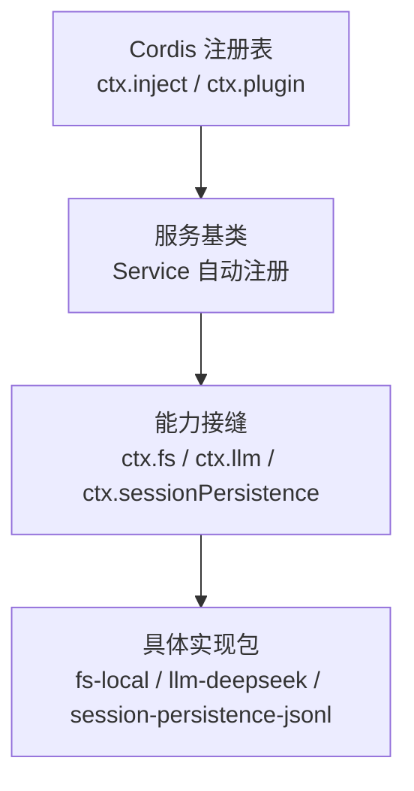
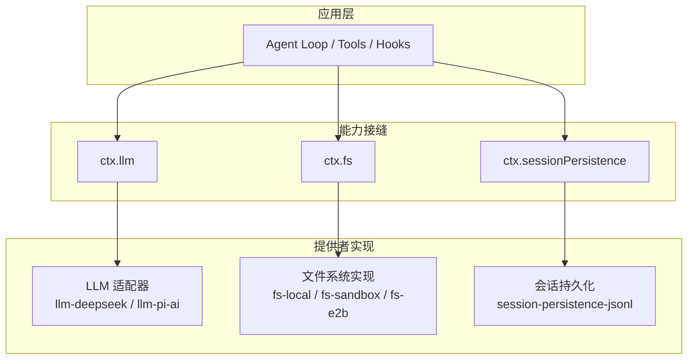
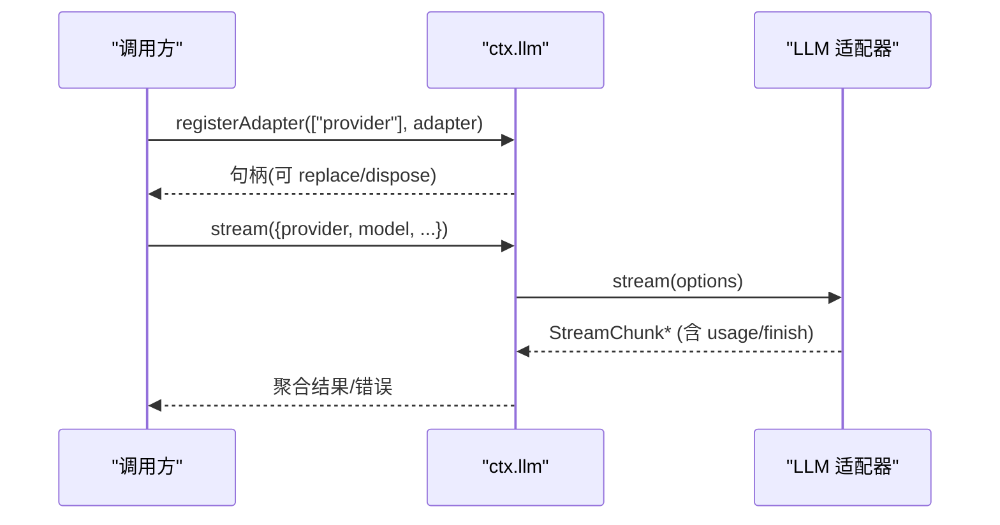
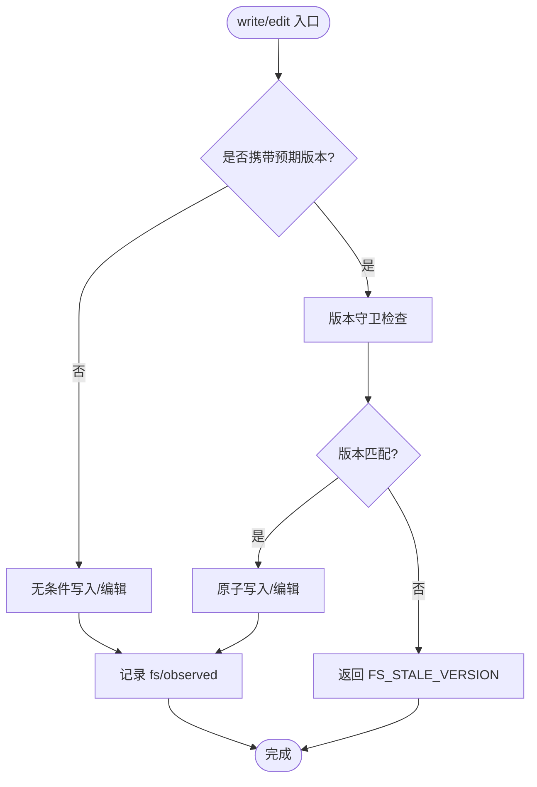
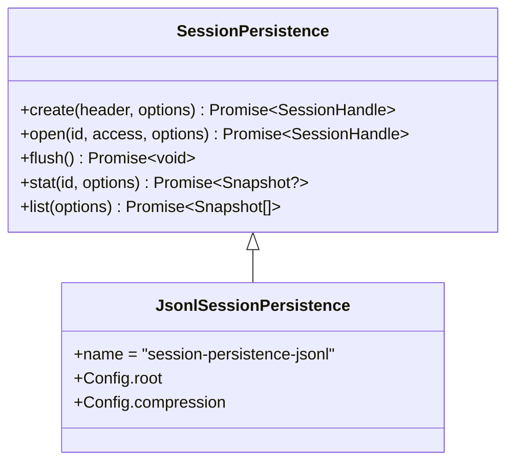
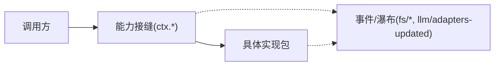

# 能力提供者实现

<cite>
**本文引用的文件**
- [capability-seams.md](file://docs/capability-seams.md)
- [service.md](file://docs/cordis-api/service.md)
- [registry.md](file://docs/cordis-api/registry.md)
- [filesystem.md](file://docs/subsystems/filesystem.md)
- [persistence.md](file://docs/subsystems/persistence.md)
- [llm-streaming.md](file://docs/subsystems/llm-streaming.md)
- [adding-an-llm-adapter.zh.md](file://docs/cookbook/adding-an-llm-adapter.zh.md)
- [index.ts（LLM 运行时）](file://packages/llm/llm/src/index.ts)
- [types.ts（LLM 类型）](file://packages/llm/llm/src/types.ts)
- [session-persistence 抽象接口](file://packages/session/session-persistence/src/index.ts)
- [JSONL 会话持久化后端](file://packages/session/session-persistence-jsonl/src/index.ts)
</cite>

## 目录
1. [简介](#简介)
2. [项目结构](#项目结构)
3. [核心组件](#核心组件)
4. [架构总览](#架构总览)
5. [详细组件分析](#详细组件分析)
6. [依赖关系分析](#依赖关系分析)
7. [性能与监控](#性能与监控)
8. [故障排查指南](#故障排查指南)
9. [结论](#结论)
10. [附录：开发者指南与最佳实践](#附录开发者指南与最佳实践)

## 简介
本文件面向希望为 DeepSeek Harness 开发“能力提供者”的工程师，系统性说明提供者模式的实现原理与落地方式。内容覆盖：
- 服务注册、依赖注入与生命周期管理
- 典型提供者模式：LLM 适配器、文件系统提供者、会话持久化提供者等
- 配置选项与环境适配机制
- 错误处理、性能优化与监控集成
- 新提供者的实现步骤与最佳实践

## 项目结构
DeepSeek Harness 通过 Cordis 框架将“能力”以“服务/提供者”的形式暴露到统一的 ctx 命名空间，并通过插件机制进行装配。关键要点：
- 服务基类 Service：实例在构造时自动注册到 ctx，随所属 fiber 生命周期自动卸载
- 注册表 Registry：支持 inject/plugin，声明式依赖与插件加载
- 能力接缝（Capability Seams）：如 ctx.fs、ctx.llm、ctx.sessionPersistence 等，定义稳定契约，具体实现由不同包提供

图表来源
- [service.md:6-12](file://docs/cordis-api/service.md#L6-L12)
- [registry.md:8-56](file://docs/cordis-api/registry.md#L8-L56)

章节来源
- [service.md:6-12](file://docs/cordis-api/service.md#L6-L12)
- [registry.md:8-56](file://docs/cordis-api/registry.md#L8-L56)

## 核心组件
- 服务与插件
  - Service：继承后在构造函数中完成注册，名称即 ctx 上的键；支持 init/check/config/invoke/extend/tracker/resolveConfig 等扩展点
  - Registry：提供 inject 与 plugin，按声明加载插件并等待依赖就绪
- 能力接缝
  - ctx.llm：LLM 适配器注册与路由选择
  - ctx.fs：文件系统提供者抽象，统一读写、编辑、列举与原子性语义
  - ctx.sessionPersistence：会话持久化抽象，支持创建、打开、flush、stat、list
- 顶层能力图
  - capability-seams 文档给出了所有 ctx 服务的角色、拥有者、实现者与直接消费者，是理解提供者生态的权威索引

章节来源
- [service.md:6-103](file://docs/cordis-api/service.md#L6-L103)
- [registry.md:8-153](file://docs/cordis-api/registry.md#L8-L153)
- [capability-seams.md:493-568](file://docs/capability-seams.md#L493-L568)

## 架构总览
下图展示了 LLM、文件系统与会话持久化三大提供者在运行时的交互关系：应用通过 ctx 调用能力接缝，内部再路由到具体提供者实现。

图表来源
- [capability-seams.md:284-313](file://docs/capability-seams.md#L284-L313)
- [filesystem.md:276-286](file://docs/subsystems/filesystem.md#L276-L286)
- [persistence.md:328-390](file://docs/subsystems/persistence.md#L328-L390)

## 详细组件分析

### LLM 适配器提供者
- 提供者注册与拓扑
  - registerAdapter：为一条或多条 provider 路由注册适配器，重复注册会抛出异常；返回可替换句柄，支持 HMR 安全的热替换
  - registerConfigurableProviders：声明可通过用户配置激活的 provider 路由（即使当前未注册），供配置界面提前展示
  - listProviders/listConfigurableProviders：列出已注册或可配置的 provider 元数据
  - 事件：注册/变更时触发 llm/adapters-updated，便于 UI 刷新
- 协议与流
  - 适配器需实现 stream(options): AsyncIterable<StreamChunk>，遵循 StreamChunk 约定（usage 在 finish 之前发出、arguments 保持原始 JSON、错误两条路径等）
  - resolveModel：提供方无关的模型元数据解析，支持 reasoning/context 等字段
- 配置与环境
  - 使用 Config schema + 环境变量回退，通过 cordis.yml 注入密钥，避免硬编码
- 生命周期
  - 基于 effect/disposer 的生命周期管理，fiber 销毁时自动注销适配器与可配置目录

图表来源
- [index.ts（LLM 运行时）:376-492](file://packages/llm/llm/src/index.ts#L376-L492)
- [llm-streaming.md:465-496](file://docs/subsystems/llm-streaming.md#L465-L496)
- [adding-an-llm-adapter.zh.md:7-44](file://docs/cookbook/adding-an-llm-adapter.zh.md#L7-L44)

章节来源
- [index.ts（LLM 运行时）:376-492](file://packages/llm/llm/src/index.ts#L376-L492)
- [types.ts（LLM 类型）:209-239](file://packages/llm/llm/src/types.ts#L209-L239)
- [llm-streaming.md:465-496](file://docs/subsystems/llm-streaming.md#L465-L496)
- [adding-an-llm-adapter.zh.md:7-44](file://docs/cookbook/adding-an-llm-adapter.zh.md#L7-L44)

### 文件系统提供者
- 抽象与目标
  - FsTarget/FsVersion：稳定的目标标识与版本令牌，禁止消费方解析 targetKey
  - stat/lstat/readText/streamText/readBytes/listDir：只读操作，保证无副作用与边界控制
  - writeText/editText：原子写入/编辑，支持可选的版本守卫（createIfAbsent/replaceIfVersion）
- 策略与事件
  - fs/write-intent、fs/edit-intent：单槽决策瀑布，首个返回意图的监听器决定写/编辑行为
  - fs/observed：记录存在/不存在观察，用于后续守卫判断
- 错误分类
  - 使用稳定的 FsErrorCode（如 FS_NOT_FOUND、FS_STALE_VERSION、FS_PERMISSION_DENIED 等），便于重试、权限与 UI 分支
- 执行上下文
  - 工具执行对象作为 actor 传递，策略插件据此派生所有者（如 agent.session），不读取其字段

图表来源
- [filesystem.md:114-180](file://docs/subsystems/filesystem.md#L114-L180)
- [filesystem.md:181-243](file://docs/subsystems/filesystem.md#L181-L243)
- [filesystem.md:244-275](file://docs/subsystems/filesystem.md#L244-L275)

章节来源
- [filesystem.md:11-275](file://docs/subsystems/filesystem.md#L11-L275)

### 会话持久化提供者
- 抽象接口
  - create/open/flush/stat/list：提供会话级持久化能力，支持多进程并发下的单写者语义
  - SessionHandle：持有写所有权，close 释放；flush 确保落盘
- JSONL 后端
  - 每个会话一个追加日志文件，默认带校验和的 Zstandard 帧存储，可禁用压缩以纯文本行读取
  - 根目录为必填配置；支持延迟实体化、崩溃恢复、迁移等特性

图表来源
- [session-persistence 抽象接口:139-161](file://packages/session/session-persistence/src/index.ts#L139-L161)
- [JSONL 会话持久化后端:119-153](file://packages/session/session-persistence-jsonl/src/index.ts#L119-L153)
- [persistence.md:328-390](file://docs/subsystems/persistence.md#L328-L390)

章节来源
- [session-persistence 抽象接口:139-161](file://packages/session/session-persistence/src/index.ts#L139-L161)
- [JSONL 会话持久化后端:119-153](file://packages/session/session-persistence-jsonl/src/index.ts#L119-L153)
- [persistence.md:328-390](file://docs/subsystems/persistence.md#L328-L390)

## 依赖关系分析
- 耦合与内聚
  - 能力接缝（ctx.*）作为稳定契约，解耦调用方与具体实现，提升内聚性
  - 插件系统（inject/plugin）使提供者按需加载，降低启动成本
- 外部依赖与集成点
  - LLM 适配器依赖网络/SDK；文件系统依赖本地/沙箱/E2B 环境；持久化依赖磁盘 I/O
  - 通过事件（如 fs/*、llm/adapters-updated）与钩子（waterfall）进行松耦合协作
- 循环依赖规避
  - 通过 seam 抽象与事件总线避免直接导入实现包，减少环依赖风险

图表来源
- [capability-seams.md:493-568](file://docs/capability-seams.md#L493-L568)
- [filesystem.md:181-243](file://docs/subsystems/filesystem.md#L181-L243)

章节来源
- [capability-seams.md:493-568](file://docs/capability-seams.md#L493-L568)

## 性能与监控
- 性能考虑
  - LLM 适配器：缓冲 finish/usage，避免尾部抖动；遵守 signal 取消；对不支持选项明确报错而非静默丢弃
  - 文件系统：readBytes 设置 maxBytes 防止无限缓冲；streamText 分块传输大文件；edit 原子化减少竞争
  - 持久化：JSONL 追加写，flush 做耐久性屏障；stat 使用轻量 revision 做缓存失效
- 监控集成
  - 通过事件（如 llm/adapters-updated、fs/observed）与遥测 seam（ctx.sessionTelemetry）上报状态
  - 使用 token-meter 与 compaction 等子系统度量与压缩，降低历史膨胀

[本节为通用指导，无需特定文件引用]

## 故障排查指南
- LLM 适配器
  - 错误路径：从 stream 抛出（传输/协议错误）或以 finish{kind:'error'|'aborted'} 结束流；消费方需同时处理
  - 常见问题：usage 未在 finish 前发出、arguments 非原始 JSON、signal 未传播
- 文件系统
  - 常见错误码：FS_NOT_FOUND、FS_STALE_VERSION、FS_PERMISSION_DENIED、FS_IO_ERROR、FS_SANDBOX_DENIED
  - 问题定位：检查 fs/* 事件是否正确记录观察；确认版本守卫与原子编辑一致性
- 会话持久化
  - 常见问题：多进程写冲突（单写者）、flush 未生效导致数据丢失；检查 handle.close 顺序与 flush 时机

章节来源
- [filesystem.md:244-275](file://docs/subsystems/filesystem.md#L244-L275)
- [persistence.md:328-390](file://docs/subsystems/persistence.md#L328-L390)
- [adding-an-llm-adapter.zh.md:25-35](file://docs/cookbook/adding-an-llm-adapter.zh.md#L25-L35)

## 结论
DeepSeek Harness 通过 Cordis 的服务/插件体系与能力接缝，提供了高内聚、低耦合的提供者模式。LLM、文件系统与会话持久化等核心能力均以稳定契约暴露，具体实现可热插拔、可配置、可观测。遵循本文提供的实现范式与最佳实践，可快速构建高质量的能力提供者。

[本节为总结，无需特定文件引用]

## 附录：开发者指南与最佳实践
- 新 LLM 适配器步骤
  - 定义适配器类，实现 stream 与 resolveModel
  - 通过 apply(ctx, config) 调用 ctx.llm.registerAdapter 注册
  - 使用 Config schema 与环境变量注入密钥
  - 遵循 StreamChunk 协议与错误路径约定
- 新文件系统提供者
  - 实现 FsTarget 解析与 read/write/edit/list 等原语
  - 正确处理 fs/* 事件与版本守卫
  - 使用稳定错误码，避免泄露内部细节
- 新会话持久化提供者
  - 实现 create/open/flush/stat/list，保证单写者与耐久性
  - 选择合适的存储格式（如 JSONL），支持压缩与迁移
- 配置与环境适配
  - 使用 inject/plugin 声明依赖，按需加载
  - 通过 settings 与 credentials seam 分层配置与敏感信息隔离
- 错误处理与健壮性
  - 区分传输错误与业务错误，使用领域错误码
  - 尊重 AbortSignal，及时清理资源
- 性能优化
  - 流式处理大对象，限制内存占用
  - 合理使用缓存与 revision 机制，避免全量重算
- 监控与可观测性
  - 利用事件与遥测 seam 上报关键指标
  - 结合 token-meter、compaction 等子系统优化资源使用

章节来源
- [adding-an-llm-adapter.zh.md:7-44](file://docs/cookbook/adding-an-llm-adapter.zh.md#L7-L44)
- [filesystem.md:11-275](file://docs/subsystems/filesystem.md#L11-L275)
- [persistence.md:328-390](file://docs/subsystems/persistence.md#L328-L390)
- [capability-seams.md:493-568](file://docs/capability-seams.md#L493-L568)