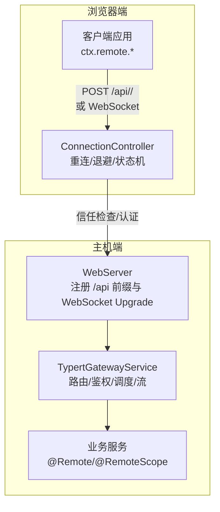
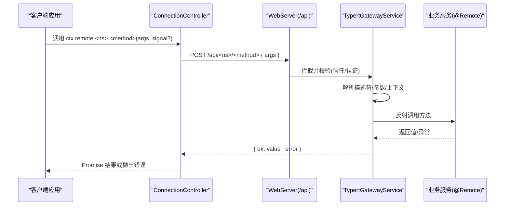
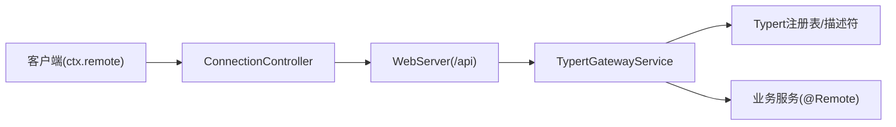
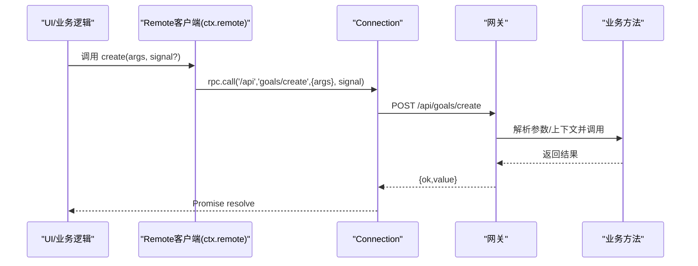

# API消费者

<cite>
**本文引用的文件**
- [packages/api/gateway/src/index.ts](file://packages/api/gateway/src/index.ts)
- [packages/api/gateway/src/remote-error-codes.ts](file://packages/api/gateway/src/remote-error-codes.ts)
- [packages/client/connection/src/client/connection.ts](file://packages/client/connection/src/client/connection.ts)
- [packages/client/connection/src/index.ts](file://packages/client/connection/src/index.ts)
- [packages/client/connection/src/api-path.ts](file://packages/client/connection/src/api-path.ts)
- [docs/api-gateway.md](file://docs/api-gateway.md)
- [docs/subsystems/web-server.md](file://docs/subsystems/web-server.md)
- [docs/subsystems/web-client.md](file://docs/subsystems/web-client.md)
</cite>

## 目录
1. [简介](#简介)
2. [项目结构](#项目结构)
3. [核心组件](#核心组件)
4. [架构总览](#架构总览)
5. [详细组件分析](#详细组件分析)
6. [依赖关系分析](#依赖关系分析)
7. [性能与可靠性](#性能与可靠性)
8. [故障排查指南](#故障排查指南)
9. [结论](#结论)
10. [附录：API使用示例与最佳实践](#附录api使用示例与最佳实践)

## 简介
本指南面向API消费者，聚焦API网关的工作机制与客户端集成方式。内容涵盖请求路由、认证授权、协议转换；REST调用、WebSocket流式通信、RPC调用的使用模式；版本管理、限流控制与错误处理策略；以及性能优化、连接池管理与重试机制。读者可据此构建稳定高效的客户端应用。

## 项目结构
本项目将“API消费者”能力拆分为三层：
- 传输层（Client Connection）：负责浏览器侧的HTTP/WebSocket载体、信任边界校验、会话认证、请求关联与重连。
- 网关层（Typert Gateway）：负责远程方法分发、参数解析与校验、对象/上下文解析、流式通道复用、事件转发。
- 业务服务层（Remote Services）：通过注解暴露远程接口，由构建期生成严格契约与运行时编解码器。

图表来源
- [packages/client/connection/src/client/connection.ts:90-335](file://packages/client/connection/src/client/connection.ts#L90-L335)
- [packages/client/connection/src/index.ts:93-121](file://packages/client/connection/src/index.ts#L93-L121)
- [packages/api/gateway/src/index.ts:169-230](file://packages/api/gateway/src/index.ts#L169-L230)
- [docs/subsystems/web-server.md:9-53](file://docs/subsystems/web-server.md#L9-L53)

章节来源
- [docs/api-gateway.md:80-165](file://docs/api-gateway.md#L80-L165)
- [docs/subsystems/web-client.md:26-33](file://docs/subsystems/web-client.md#L26-L33)
- [docs/subsystems/web-server.md:9-53](file://docs/subsystems/web-server.md#L9-L53)

## 核心组件
- TypertGatewayService：实现远程方法的声明解析、参数校验、对象/上下文解析、流式结果迭代、远程事件转发。
- ConnectionController：维护连接生命周期、指数退避重连、网络可用性感知、就绪握手超时。
- WebServer：提供HTTP服务器与WebSocket升级路由，承载/api桥接与静态资源。
- BrowserAuth：浏览器侧身份认证与会话Cookie管理，配合Host/Origin信任边界。

章节来源
- [packages/api/gateway/src/index.ts:169-230](file://packages/api/gateway/src/index.ts#L169-L230)
- [packages/client/connection/src/client/connection.ts:90-335](file://packages/client/connection/src/client/connection.ts#L90-L335)
- [docs/subsystems/web-server.md:9-53](file://docs/subsystems/web-server.md#L9-L53)
- [packages/client/connection/src/index.ts:93-121](file://packages/client/connection/src/index.ts#L93-L121)

## 架构总览
下图展示一次典型的REST风格RPC调用流程：客户端通过Connection发起POST到/api，网关拦截并分派到具体业务方法，返回统一信封。

图表来源
- [packages/client/connection/src/index.ts:93-121](file://packages/client/connection/src/index.ts#L93-L121)
- [packages/api/gateway/src/index.ts:198-204](file://packages/api/gateway/src/index.ts#L198-L204)
- [packages/api/gateway/src/index.ts:590-629](file://packages/api/gateway/src/index.ts#L590-L629)

## 详细组件分析

### 请求路由与协议转换
- 路由规则：仅接受两段式端点 <namespace>/<method>，并在严格描述符或SRC标记存在时接管。
- 协议转换：客户端以JSON形式发送{ args }，网关将其映射为对业务方法的反射调用；流式方法通过WebSocket多路复用通道返回。
- 开发模式回退：源码启动时基于运行时标记构造弱描述符，支持简单参数名与JSON安全数据。

章节来源
- [packages/api/gateway/src/index.ts:266-290](file://packages/api/gateway/src/index.ts#L266-L290)
- [packages/api/gateway/src/index.ts:590-629](file://packages/api/gateway/src/index.ts#L590-L629)
- [docs/api-gateway.md:119-138](file://docs/api-gateway.md#L119-L138)

### 认证与授权
- 信任边界：Connection在/api前缀上执行Host/Origin校验与浏览器会话认证，未通过则拒绝。
- 上下文解析：网关根据描述符中的Context提供者解析作用域上下文（如Agent/Session），失败会返回明确的网关错误码。
- 远端事件：可选的事件源注册后，网关将允许列表内的普通事件与Scoped瀑布事件转发至客户端。

章节来源
- [packages/client/connection/src/index.ts:93-121](file://packages/client/connection/src/index.ts#L93-L121)
- [packages/api/gateway/src/index.ts:767-800](file://packages/api/gateway/src/index.ts#L767-L800)
- [packages/api/gateway/src/index.ts:238-264](file://packages/api/gateway/src/index.ts#L238-L264)

### REST API、WebSocket与RPC调用模式
- REST/RPC：通过ctx.remote命名空间下的方法调用，底层走POST /api/<ns>/<method>。
- WebSocket流：流式方法通过专用Upgrade路径建立连接，网关内部复用同一连接进行帧收发。
- 事件流：客户端可通过$events逻辑流订阅宿主事件，支持ready帧携带Host信息。

章节来源
- [docs/api-gateway.md:119-130](file://docs/api-gateway.md#L119-L130)
- [packages/api/gateway/src/index.ts:205-229](file://packages/api/gateway/src/index.ts#L205-L229)
- [docs/subsystems/web-client.md:32-33](file://docs/subsystems/web-client.md#L32-L33)

### 版本管理
- 构建期生成：业务包通过注解暴露方法，构建阶段生成严格描述符与客户端类型，变更签名需重新生成。
- 向后兼容：仅当描述符一致时，客户端可复用；新增/删除参数或改变查找键会导致构建或首次调用失败。
- 建议：通过命名空间或语义化版本前缀区分大版本，避免破坏性变更。

章节来源
- [docs/api-gateway.md:95-118](file://docs/api-gateway.md#L95-L118)

### 限流控制
- 当前实现：代码库未内置全局限流器；可在上游反向代理或网关扩展中按IP/用户维度限制QPS。
- 建议：结合外部网关（如Nginx/Envoy）或自定义Fetch拦截器实现令牌桶/漏桶算法。

[本节为通用指导，不直接分析具体文件]

### 错误处理策略
- 统一错误码：网关定义稳定的错误分类（如gateway/arguments-invalid、gateway/service-unavailable等），跨端共享。
- 错误传播：业务抛出的RemoteError原样透传；未分类异常折叠为内部错误。
- 客户端：Connection在请求失败时触发重连；流式通道关闭会终止所有待处理调用。

章节来源
- [packages/api/gateway/src/remote-error-codes.ts:1-36](file://packages/api/gateway/src/remote-error-codes.ts#L1-L36)
- [packages/api/gateway/src/index.ts:128-162](file://packages/api/gateway/src/index.ts#L128-L162)
- [packages/client/connection/src/client/connection.ts:178-289](file://packages/client/connection/src/client/connection.ts#L178-L289)

## 依赖关系分析
- 客户端Connection依赖WebServer提供的/api前缀与认证拦截。
- 网关依赖Typert注册表与业务服务，通过反射与描述符完成调用。
- 业务服务通过注解与构建产物与客户端类型系统对齐。

图表来源
- [packages/client/connection/src/index.ts:93-121](file://packages/client/connection/src/index.ts#L93-L121)
- [packages/api/gateway/src/index.ts:169-230](file://packages/api/gateway/src/index.ts#L169-L230)
- [docs/api-gateway.md:80-93](file://docs/api-gateway.md#L80-L93)

章节来源
- [docs/api-gateway.md:80-93](file://docs/api-gateway.md#L80-L93)

## 性能与可靠性
- 连接与重连：ConnectionController采用指数退避+抖动，支持手动重连与离线暂停恢复。
- 流式传输：WebSocket多路复用减少握手开销，心跳保活防止空闲断开。
- 缓存与压缩：WebServer支持gzip压缩与最小阈值配置，降低带宽占用。
- 重试与取消：客户端AbortSignal贯穿调用链，支持取消与并发控制。

章节来源
- [packages/client/connection/src/client/connection.ts:15-32](file://packages/client/connection/src/client/connection.ts#L15-L32)
- [packages/client/connection/src/client/connection.ts:152-166](file://packages/client/connection/src/client/connection.ts#L152-L166)
- [packages/client/connection/src/client/connection.ts:178-289](file://packages/client/connection/src/client/connection.ts#L178-L289)
- [docs/subsystems/web-server.md:29-53](file://docs/subsystems/web-server.md#L29-L53)
- [packages/api/gateway/src/index.ts:118-126](file://packages/api/gateway/src/index.ts#L118-L126)

## 故障排查指南
- 常见网关错误码
  - gateway/invocation-unavailable：无活动Remote方法导出该端点。
  - gateway/arguments-invalid：参数数量或字段不匹配。
  - gateway/service-unavailable：目标服务不可用。
  - gateway/context-unavailable：上下文提供者缺失或不匹配。
  - gateway/signature-invalid：方法签名不符合要求（如signal位置）。
- 定位步骤
  1) 确认端点是否被严格描述符或SRC标记声明。
  2) 检查参数名称与wire字段是否与描述符一致。
  3) 验证上下文提供者是否已注册且可用。
  4) 查看Connection状态与重连日志，确认物理链路健康。
  5) 若为流式调用，检查WebSocket升级与心跳是否正常。

章节来源
- [packages/api/gateway/src/remote-error-codes.ts:1-36](file://packages/api/gateway/src/remote-error-codes.ts#L1-L36)
- [packages/api/gateway/src/index.ts:631-670](file://packages/api/gateway/src/index.ts#L631-L670)
- [packages/client/connection/src/client/connection.ts:178-289](file://packages/client/connection/src/client/connection.ts#L178-L289)

## 结论
API消费者应优先通过生成的ctx.remote接口进行调用，利用Connection的重连与取消能力保证健壮性；对长时任务使用流式接口并通过WebSocket多路复用提升吞吐。遵循严格的描述符契约与错误码约定，可有效降低联调成本并提升可观测性。

[本节为总结性内容，不直接分析具体文件]

## 附录：API使用示例与最佳实践

### 典型调用序列（REST风格RPC）

图表来源
- [packages/client/connection/src/index.ts:93-121](file://packages/client/connection/src/index.ts#L93-L121)
- [packages/api/gateway/src/index.ts:590-629](file://packages/api/gateway/src/index.ts#L590-L629)

### 流式通信（WebSocket）
- 适用场景：长时任务、增量数据、服务端主动推送。
- 行为：客户端打开流后接收帧序列；连接丢失时由Connection自动重连，逻辑流自行恢复。
- 注意：流式方法必须通过流式载体打开，不能走普通RPC。

章节来源
- [packages/api/gateway/src/index.ts:205-229](file://packages/api/gateway/src/index.ts#L205-L229)
- [docs/api-gateway.md:119-130](file://docs/api-gateway.md#L119-L130)

### 认证与信任边界
- 浏览器侧：Connection在/api前缀上执行Host/Origin校验与Cookie会话认证。
- 服务端：网关在分发前再次校验上下文与权限，确保最小权限原则。

章节来源
- [packages/client/connection/src/index.ts:93-121](file://packages/client/connection/src/index.ts#L93-L121)
- [packages/api/gateway/src/index.ts:767-800](file://packages/api/gateway/src/index.ts#L767-L800)

### 版本管理与兼容性
- 变更签名需重新生成描述符与客户端类型。
- 建议通过命名空间或路由前缀隔离大版本，逐步迁移。

章节来源
- [docs/api-gateway.md:95-118](file://docs/api-gateway.md#L95-L118)

### 限流与容量控制
- 建议在网关上游（反向代理/边缘节点）实施限流，保护后端服务。
- 客户端侧可通过并发上限与队列长度控制压力。

[本节为通用指导，不直接分析具体文件]

### 错误处理与重试
- 使用统一的网关错误码进行分类与上报。
- 客户端利用Connection的指数退避重连；对幂等操作可叠加业务级重试。

章节来源
- [packages/api/gateway/src/remote-error-codes.ts:1-36](file://packages/api/gateway/src/remote-error-codes.ts#L1-L36)
- [packages/client/connection/src/client/connection.ts:152-166](file://packages/client/connection/src/client/connection.ts#L152-L166)

### 性能优化清单
- 启用gzip压缩并设置合理阈值。
- 合理使用流式接口减少往返次数。
- 使用AbortSignal及时取消无用请求。
- 避免在高频路径中进行昂贵序列化/反序列化。

章节来源
- [docs/subsystems/web-server.md:29-53](file://docs/subsystems/web-server.md#L29-L53)
- [packages/api/gateway/src/index.ts:118-126](file://packages/api/gateway/src/index.ts#L118-L126)