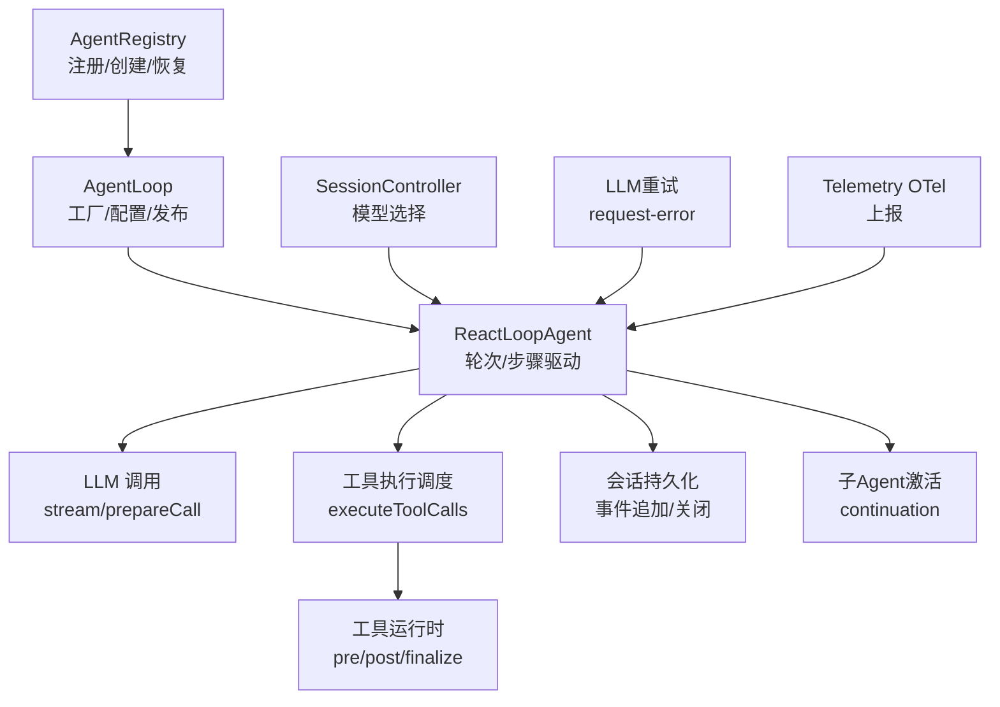
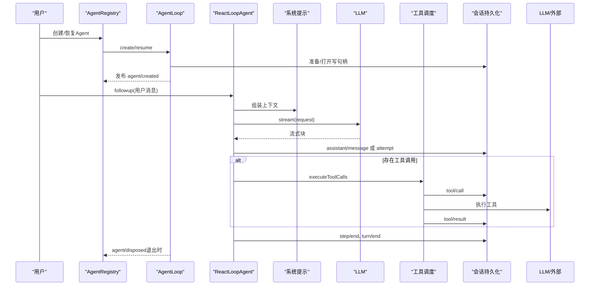
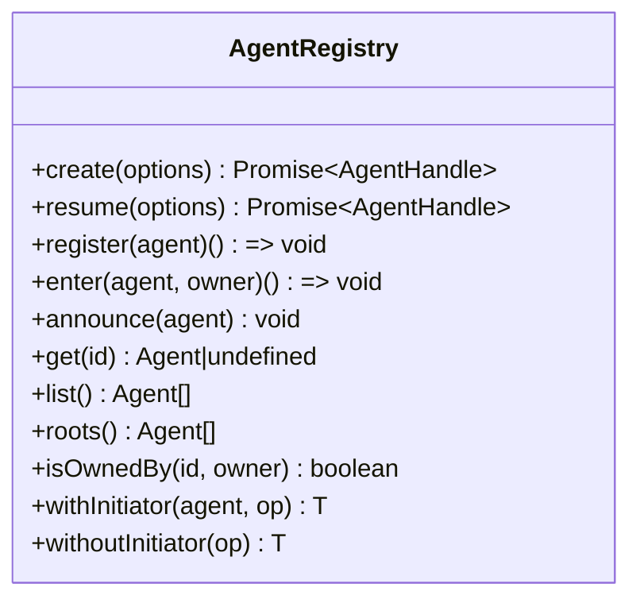
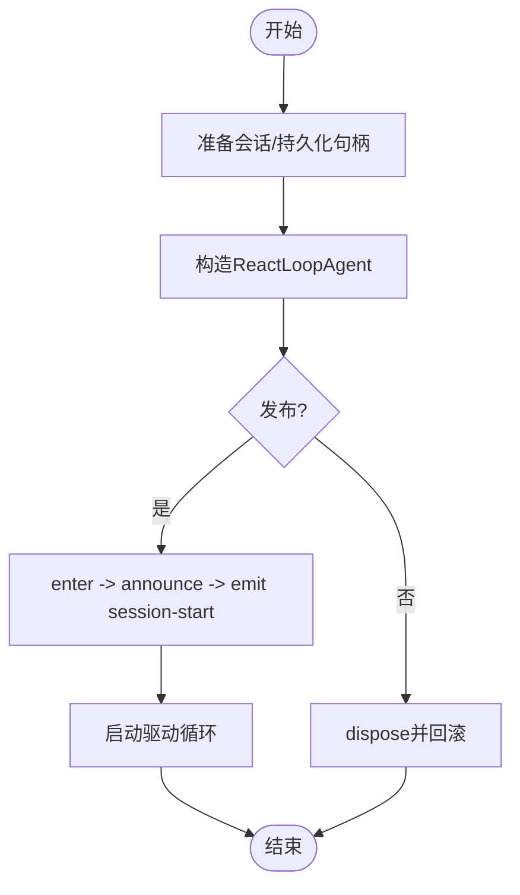
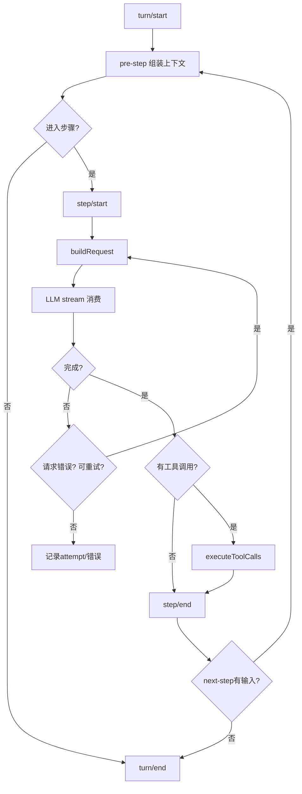
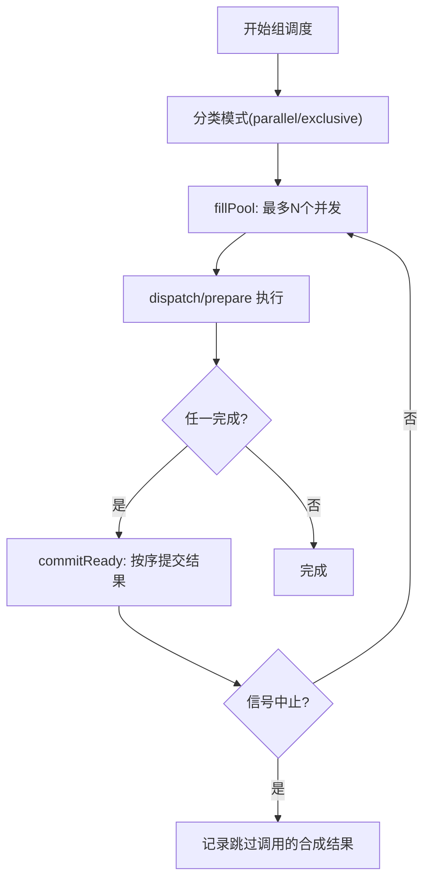
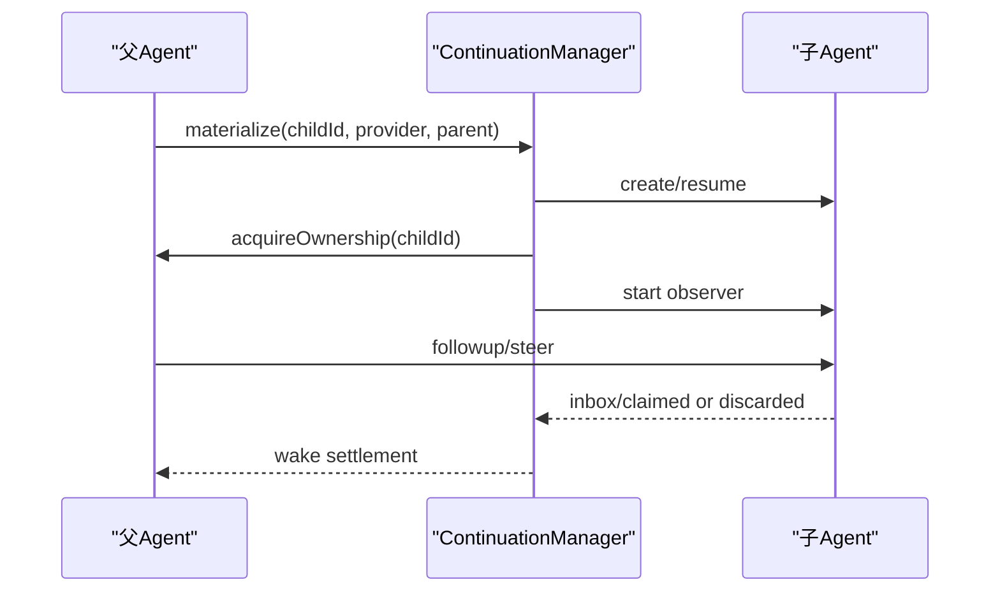
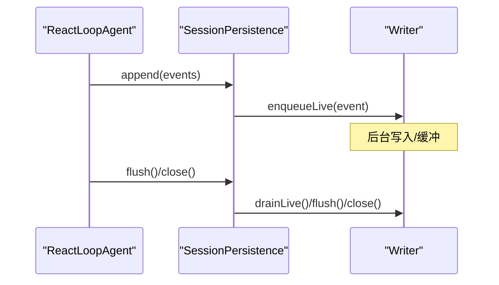
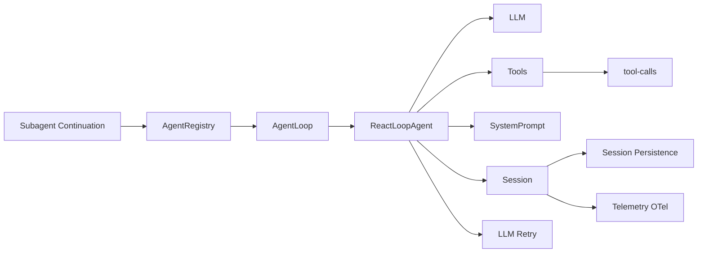
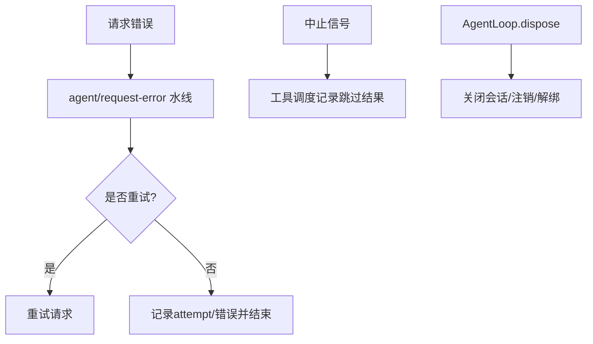

# Agent消费者

<cite>
**本文引用的文件**
- [packages/core/agent/src/index.ts](file://packages/core/agent/src/index.ts)
- [packages/core/agent-loop/src/index.ts](file://packages/core/agent-loop/src/index.ts)
- [packages/core/agent-loop/src/agent.ts](file://packages/core/agent-loop/src/agent.ts)
- [packages/core/agent-loop/src/tool-calls.ts](file://packages/core/agent-loop/src/tool-calls.ts)
- [packages/subagent/subagent/src/continuation.ts](file://packages/subagent/subagent/src/continuation.ts)
- [packages/api/session-controller/src/commands.ts](file://packages/api/session-controller/src/commands.ts)
- [packages/llm/llm-retry/src/index.ts](file://packages/llm/llm-retry/src/index.ts)
- [packages/session/session-persistence-jsonl/src/storage.ts](file://packages/session/session-persistence-jsonl/src/storage.ts)
- [packages/session/session-telemetry-otel/src/index.ts](file://packages/session/session-telemetry-otel/src/index.ts)
- [docs/agent-lifecycle.md](file://docs/agent-lifecycle.md)
</cite>

## 目录
1. [简介](#简介)
2. [项目结构](#项目结构)
3. [核心组件](#核心组件)
4. [架构总览](#架构总览)
5. [详细组件分析](#详细组件分析)
6. [依赖关系分析](#依赖关系分析)
7. [性能与并发](#性能与并发)
8. [错误恢复与资源管理](#错误恢复与资源管理)
9. [使用示例与开发指南](#使用示例与开发指南)
10. [调试、监控与可观测性](#调试监控与可观测性)
11. [故障排查](#故障排查)
12. [结论](#结论)

## 简介
本文件面向“Agent消费者”，系统性说明Agent如何消费LLM调用、工具执行与会话管理等能力，覆盖Agent生命周期、状态同步、并发控制、错误恢复、资源管理、性能优化、调试技巧与监控集成，并提供构建智能体应用的实践指南。文档以代码级事实为依据，配合时序图、流程图和类图帮助读者快速建立整体认知并落地实现。

## 项目结构
围绕Agent消费者的关键代码分布在以下模块：
- Agent注册与生命周期入口：AgentRegistry（进程内Agent注册、创建/恢复门面、发起者上下文）
- Agent循环驱动：AgentLoop（工厂、配置、会话持久化接入、发布流程）
- Agent驱动实例：ReactLoopAgent（轮次/步骤循环、请求组装、流式输出、工具调度）
- 工具执行调度：tool-calls（并行/独占模式、有序提交、中止回退）
- 子Agent激活：subagent continuation（父子归属、所有权、消息投递）
- 会话持久化：session-persistence-jsonl（事件路由、写入、关闭）
- LLM重试策略：llm-retry（请求失败恢复、重试决策）
- 模型选择API：session-controller（会话级模型选择）
- 遥测：session-telemetry-otel（上报模式、开关）

图表来源
- [packages/core/agent/src/index.ts:250-702](file://packages/core/agent/src/index.ts#L250-L702)
- [packages/core/agent-loop/src/index.ts:358-800](file://packages/core/agent-loop/src/index.ts#L358-L800)
- [packages/core/agent-loop/src/agent.ts:70-590](file://packages/core/agent-loop/src/agent.ts#L70-L590)
- [packages/core/agent-loop/src/tool-calls.ts:60-291](file://packages/core/agent-loop/src/tool-calls.ts#L60-L291)
- [packages/subagent/subagent/src/continuation.ts:1214-1399](file://packages/subagent/subagent/src/continuation.ts#L1214-L1399)
- [packages/session/session-persistence-jsonl/src/storage.ts:500-519](file://packages/session/session-persistence-jsonl/src/storage.ts#L500-L519)
- [packages/api/session-controller/src/commands.ts:119-160](file://packages/api/session-controller/src/commands.ts#L119-L160)
- [packages/llm/llm-retry/src/index.ts:194-217](file://packages/llm/llm-retry/src/index.ts#L194-L217)
- [packages/session/session-telemetry-otel/src/index.ts:147-168](file://packages/session/session-telemetry-otel/src/index.ts#L147-L168)

章节来源
- [packages/core/agent/src/index.ts:250-702](file://packages/core/agent/src/index.ts#L250-L702)
- [packages/core/agent-loop/src/index.ts:358-800](file://packages/core/agent-loop/src/index.ts#L358-L800)
- [packages/core/agent-loop/src/agent.ts:70-590](file://packages/core/agent-loop/src/agent.ts#L70-L590)
- [packages/core/agent-loop/src/tool-calls.ts:60-291](file://packages/core/agent-loop/src/tool-calls.ts#L60-L291)

## 核心组件
- AgentRegistry：进程内Agent注册表与创建门面，维护创建者归属、初始化器上下文、发布边界与事件（created/disposed）。
- AgentLoop：具体工厂与驱动服务，负责会话准备、持久化接入、配置注入、发布与统一销毁。
- ReactLoopAgent：单Agent驱动，维护idle/maintenance/running三态，组织turn/step边界，组装请求、流式消费、工具调度与结果提交。
- tool-calls：按模型顺序提交工具调用，支持并行池与独占屏障，保证有序结果与中止安全。
- subagent continuation：子Agent激活、父子所有权、消息投递与回收。
- session persistence：事件路由到后端，flush/close保障落盘。
- llm retry：在请求失败时通过waterfall进行恢复与重试决策。
- session controller：会话级模型选择，影响后续请求头。
- telemetry：可选的OTEL上报，支持禁用/反馈仅/全量模式。

章节来源
- [packages/core/agent/src/index.ts:250-702](file://packages/core/agent/src/index.ts#L250-L702)
- [packages/core/agent-loop/src/index.ts:358-800](file://packages/core/agent-loop/src/index.ts#L358-L800)
- [packages/core/agent-loop/src/agent.ts:70-590](file://packages/core/agent-loop/src/agent.ts#L70-L590)
- [packages/core/agent-loop/src/tool-calls.ts:60-291](file://packages/core/agent-loop/src/tool-calls.ts#L60-L291)
- [packages/subagent/subagent/src/continuation.ts:1214-1399](file://packages/subagent/subagent/src/continuation.ts#L1214-L1399)
- [packages/session/session-persistence-jsonl/src/storage.ts:500-519](file://packages/session/session-persistence-jsonl/src/storage.ts#L500-L519)
- [packages/llm/llm-retry/src/index.ts:194-217](file://packages/llm/llm-retry/src/index.ts#L194-L217)
- [packages/api/session-controller/src/commands.ts:119-160](file://packages/api/session-controller/src/commands.ts#L119-L160)
- [packages/session/session-telemetry-otel/src/index.ts:147-168](file://packages/session/session-telemetry-otel/src/index.ts#L147-L168)

## 架构总览
下图展示一次典型对话从用户输入到模型响应、工具执行、结果提交的完整流转，以及状态与事件的落盘。

图表来源
- [docs/agent-lifecycle.md:8-85](file://docs/agent-lifecycle.md#L8-L85)
- [packages/core/agent-loop/src/agent.ts:257-482](file://packages/core/agent-loop/src/agent.ts#L257-L482)
- [packages/core/agent-loop/src/tool-calls.ts:60-291](file://packages/core/agent-loop/src/tool-calls.ts#L60-L291)
- [packages/core/agent-loop/src/index.ts:689-707](file://packages/core/agent-loop/src/index.ts#L689-L707)

## 详细组件分析

### AgentRegistry：注册、创建与生命周期
- 职责：提供create/resume门面；维护AgentEntry（id/agent/owner/carrier/announced等）；管理initiator上下文；发布agent/created与agent/disposed；校验id一致性；维护roots/list/isOwnedBy。
- 关键点：
  - enter/announce严格顺序：先enter再announce，确保观察者不会看到半构造对象。
  - withInitiator/withoutInitiator：为跨层调用提供同进程因果归属。
  - setFactory：将具体AgentLoop作为工厂注入，避免耦合。
  - 启动/关闭：effect作用域内完成清理，防止泄漏。

图表来源
- [packages/core/agent/src/index.ts:250-702](file://packages/core/agent/src/index.ts#L250-L702)

章节来源
- [packages/core/agent/src/index.ts:250-702](file://packages/core/agent/src/index.ts#L250-L702)

### AgentLoop：工厂、配置与发布
- 职责：实现AgentFactory；处理配置（maxParallelToolCalls、agents数组）；会话持久化接入；创建/恢复/发布；统一销毁。
- 关键点：
  - prepare：构造ReactLoopAgent，绑定AbortSignal融合调用方取消、工厂卸载、所有者fiber卸载。
  - createStoredSession/appendUnstoredSuffix：在发布前持久化预发布事件，失败不残留。
  - setupAndPublish：setup完成后进入enter/announce/emit session-start/start loop。
  - 配置驱动：支持resumeSessionId与sessionId互斥校验与冲突检测。

图表来源
- [packages/core/agent-loop/src/index.ts:530-677](file://packages/core/agent-loop/src/index.ts#L530-L677)
- [packages/core/agent-loop/src/index.ts:689-707](file://packages/core/agent-loop/src/index.ts#L689-L707)
- [packages/core/agent-loop/src/index.ts:754-800](file://packages/core/agent-loop/src/index.ts#L754-L800)

章节来源
- [packages/core/agent-loop/src/index.ts:358-800](file://packages/core/agent-loop/src/index.ts#L358-L800)

### ReactLoopAgent：轮次/步骤驱动与LLM消费
- 职责：维护idle/maintenance/running三态；组织turn/step边界；组装请求；流式消费；工具调度；错误上报。
- 关键点：
  - turn/step：严格append turn/start、step/start、step/end、turn/end；支持max-tokens粘性。
  - buildRequest：基于会话header与waterfall生成最终请求，记录request/header变更。
  - 流式处理：assistant/attempt或assistant/message落盘；中断保留已产出内容。
  - 工具调用：当助手返回tool-call时，交由executeToolCalls有序执行并提交结果。

图表来源
- [packages/core/agent-loop/src/agent.ts:257-590](file://packages/core/agent-loop/src/agent.ts#L257-L590)
- [docs/agent-lifecycle.md:8-85](file://docs/agent-lifecycle.md#L8-L85)

章节来源
- [packages/core/agent-loop/src/agent.ts:70-590](file://packages/core/agent-loop/src/agent.ts#L70-L590)

### 工具执行调度：并发、有序与中止
- 职责：按模型顺序提交工具调用；支持parallel与exclusive模式；维护最大并行度；保证结果有序提交；中止时记录跳过调用的合成结果。
- 关键点：
  - runGroup：fillPool受maxParallelToolCalls限制；inFlight队列竞争；commitReady按序推进committed指针。
  - 中止安全：started调用继续完成；未开始调用记录tool/call+合成result；内部调度失败不伪造结果。
  - 上下文传递：工具结果additionalContexts被接受并加入下一步输入。

图表来源
- [packages/core/agent-loop/src/tool-calls.ts:122-247](file://packages/core/agent-loop/src/tool-calls.ts#L122-L247)
- [packages/core/agent-loop/src/tool-calls.ts:249-291](file://packages/core/agent-loop/src/tool-calls.ts#L249-L291)

章节来源
- [packages/core/agent-loop/src/tool-calls.ts:60-291](file://packages/core/agent-loop/src/tool-calls.ts#L60-L291)

### 子Agent激活与父子关系
- 职责：创建/恢复子Agent；维护父子所有权集合；消息投递（followup/steer）；观察inbox claimed/discarded以判定活跃。
- 关键点：
  - materializeTracked：先create/resume，再acquireOwnership，再start observer，最后watchSettlement。
  - submit：先acquireOwnership再投递，保证父不被提前结算。
  - 撤销：rollbackUnpublished释放ownership并清理activations。

图表来源
- [packages/subagent/subagent/src/continuation.ts:1214-1399](file://packages/subagent/subagent/src/continuation.ts#L1214-L1399)

章节来源
- [packages/subagent/subagent/src/continuation.ts:1214-1399](file://packages/subagent/subagent/src/continuation.ts#L1214-L1399)

### 会话持久化与状态同步
- 事件路由：监听session/event将事件入队到对应会话writer；flush/close保障落盘。
- 发布前持久化：AgentLoop在publish前将预发布事件追加到持久化句柄，失败不残留。
- 状态投影：turnBoundary投影记录openTurnStartSeq、lastStepBoundary等，用于UI与诊断。

图表来源
- [packages/session/session-persistence-jsonl/src/storage.ts:500-519](file://packages/session/session-persistence-jsonl/src/storage.ts#L500-L519)
- [packages/core/agent-loop/src/index.ts:739-746](file://packages/core/agent-loop/src/index.ts#L739-L746)

章节来源
- [packages/session/session-persistence-jsonl/src/storage.ts:500-519](file://packages/session/session-persistence-jsonl/src/storage.ts#L500-L519)
- [packages/core/agent-loop/src/index.ts:739-746](file://packages/core/agent-loop/src/index.ts#L739-L746)

### 模型选择与会话上下文
- 会话级模型选择：通过selectModel解析provider/model/reasoningEffort，更新下次请求的选择并尝试保存默认。
- 请求头：ReactLoopAgent在首次或变化时记录request/header，并在系列请求开始时标记startsSeries。

章节来源
- [packages/api/session-controller/src/commands.ts:119-160](file://packages/api/session-controller/src/commands.ts#L119-L160)
- [packages/core/agent-loop/src/agent.ts:548-563](file://packages/core/agent-loop/src/agent.ts#L548-L563)

## 依赖关系分析
- AgentRegistry依赖AgentLoop提供的工厂；AgentLoop依赖LLM、Tools、SystemPrompt、SessionProjections、SessionPersistence。
- ReactLoopAgent依赖LLM流式接口、Tools执行调度、SystemPrompt组装、Session事件追加。
- tool-calls依赖Tools运行时调度器，按配置上限控制并发。
- subagent continuation依赖AgentRegistry.create/resume与Agent.inbox事件。
- session persistence监听session/event并路由到writer。
- llm-retry订阅agent/request-error进行恢复。
- telemetry监听session/event进行上报。

图表来源
- [packages/core/agent/src/index.ts:250-702](file://packages/core/agent/src/index.ts#L250-L702)
- [packages/core/agent-loop/src/index.ts:358-800](file://packages/core/agent-loop/src/index.ts#L358-L800)
- [packages/core/agent-loop/src/agent.ts:70-590](file://packages/core/agent-loop/src/agent.ts#L70-L590)
- [packages/core/agent-loop/src/tool-calls.ts:60-291](file://packages/core/agent-loop/src/tool-calls.ts#L60-L291)
- [packages/subagent/subagent/src/continuation.ts:1214-1399](file://packages/subagent/subagent/src/continuation.ts#L1214-L1399)
- [packages/session/session-persistence-jsonl/src/storage.ts:500-519](file://packages/session/session-persistence-jsonl/src/storage.ts#L500-L519)
- [packages/llm/llm-retry/src/index.ts:194-217](file://packages/llm/llm-retry/src/index.ts#L194-L217)
- [packages/session/session-telemetry-otel/src/index.ts:147-168](file://packages/session/session-telemetry-otel/src/index.ts#L147-L168)

章节来源
- [packages/core/agent/src/index.ts:250-702](file://packages/core/agent/src/index.ts#L250-L702)
- [packages/core/agent-loop/src/index.ts:358-800](file://packages/core/agent-loop/src/index.ts#L358-L800)
- [packages/core/agent-loop/src/agent.ts:70-590](file://packages/core/agent-loop/src/agent.ts#L70-L590)
- [packages/core/agent-loop/src/tool-calls.ts:60-291](file://packages/core/agent-loop/src/tool-calls.ts#L60-L291)
- [packages/subagent/subagent/src/continuation.ts:1214-1399](file://packages/subagent/subagent/src/continuation.ts#L1214-L1399)
- [packages/session/session-persistence-jsonl/src/storage.ts:500-519](file://packages/session/session-persistence-jsonl/src/storage.ts#L500-L519)
- [packages/llm/llm-retry/src/index.ts:194-217](file://packages/llm/llm-retry/src/index.ts#L194-L217)
- [packages/session/session-telemetry-otel/src/index.ts:147-168](file://packages/session/session-telemetry-otel/src/index.ts#L147-L168)

## 性能与并发
- 工具并行度：通过AgentLoop配置maxParallelToolCalls控制每步最大并发；可在运行期动态调整，新分组生效而当前组不受影响。
- 有序提交：工具结果按模型顺序commitReady推进，避免乱序导致的下游不一致。
- 流式处理：LLM流式消费，减少首字节延迟；assistant/attempt仅在失败/中断时落盘，成功路径直接assistant/message。
- 压缩与溢出：在agent/pre-step阶段进行压力检测与压缩，必要时修剪工具结果并重建请求，降低上下文窗口压力。
- 建议：
  - 合理设置maxParallelToolCalls，结合工具I/O特性调优。
  - 对长会话启用压缩，关注surface generation变化。
  - 利用agent/status与session/event进行性能观测。

章节来源
- [packages/core/agent-loop/src/index.ts:307-412](file://packages/core/agent-loop/src/index.ts#L307-L412)
- [packages/core/agent-loop/src/tool-calls.ts:122-247](file://packages/core/agent-loop/src/tool-calls.ts#L122-L247)
- [docs/agent-lifecycle.md:71-85](file://docs/agent-lifecycle.md#L71-L85)

## 错误恢复与资源管理
- 请求错误恢复：agent/request-error水线允许插件决定retry；llm-retry根据策略（always/normal）与可重试码决定是否重试。
- 中止与取消：AgentLoop在prepare阶段融合调用方signal、工厂卸载、所有者fiber卸载；工具调度在abort时记录跳过调用的合成结果。
- 资源清理：AgentLoop.dispose串行停止机器、关闭会话写句柄、注销Agent、解绑scope；session persistence在session/disposed时关闭writer。
- 子Agent回收：continuation在activation disposal中释放ownership并清理activations。

图表来源
- [packages/llm/llm-retry/src/index.ts:194-217](file://packages/llm/llm-retry/src/index.ts#L194-L217)
- [packages/core/agent-loop/src/tool-calls.ts:238-260](file://packages/core/agent-loop/src/tool-calls.ts#L238-L260)
- [packages/core/agent-loop/src/index.ts:575-616](file://packages/core/agent-loop/src/index.ts#L575-L616)
- [packages/session/session-persistence-jsonl/src/storage.ts:514-519](file://packages/session/session-persistence-jsonl/src/storage.ts#L514-L519)
- [packages/subagent/subagent/src/continuation.ts:1312-1321](file://packages/subagent/subagent/src/continuation.ts#L1312-L1321)

章节来源
- [packages/llm/llm-retry/src/index.ts:194-217](file://packages/llm/llm-retry/src/index.ts#L194-L217)
- [packages/core/agent-loop/src/tool-calls.ts:238-260](file://packages/core/agent-loop/src/tool-calls.ts#L238-L260)
- [packages/core/agent-loop/src/index.ts:575-616](file://packages/core/agent-loop/src/index.ts#L575-L616)
- [packages/session/session-persistence-jsonl/src/storage.ts:514-519](file://packages/session/session-persistence-jsonl/src/storage.ts#L514-L519)
- [packages/subagent/subagent/src/continuation.ts:1312-1321](file://packages/subagent/subagent/src/continuation.ts#L1312-L1321)

## 使用示例与开发指南
- 创建Agent：通过AgentRegistry.create传入sessionId、agentOptions与可选setup；setup中注册工具、变量、策略等，setup完成后发布并启动循环。
- 恢复Agent：通过AgentRegistry.resume加载持久化会话，执行setup后发布。
- 发送消息：使用followup（下一轮）或steer（下一步）注入用户消息；inject用于非唤醒注入。
- 模型选择：通过会话控制器selectModel设置provider/model/reasoningEffort，影响后续请求。
- 工具开发：遵循executionMode约定，注意并发安全与结果格式；工具结果additionalContexts可注入下一步上下文。
- 子Agent：通过continuation创建/恢复子Agent，注意父子所有权与消息投递方式。

参考路径
- [packages/core/agent/src/index.ts:400-425](file://packages/core/agent/src/index.ts#L400-L425)
- [packages/core/agent-loop/src/index.ts:689-707](file://packages/core/agent-loop/src/index.ts#L689-L707)
- [packages/core/agent-loop/src/index.ts:754-800](file://packages/core/agent-loop/src/index.ts#L754-L800)
- [packages/core/agent-loop/src/agent.ts:125-144](file://packages/core/agent-loop/src/agent.ts#L125-L144)
- [packages/api/session-controller/src/commands.ts:119-160](file://packages/api/session-controller/src/commands.ts#L119-L160)
- [packages/core/agent-loop/src/tool-calls.ts:60-102](file://packages/core/agent-loop/src/tool-calls.ts#L60-L102)
- [packages/subagent/subagent/src/continuation.ts:1214-1399](file://packages/subagent/subagent/src/continuation.ts#L1214-L1399)

## 调试、监控与可观测性
- 事件流：优先消费session/event获取可回放数据；agent/*用于实时协调（状态、拦截、错误）。
- 状态观察：agent/status反映idle/running；turnBoundary投影提供turn/step边界信息。
- 日志与警告：session persistence在写入失败时记录警告；telemetry在禁用模式下对feedback事件发出本地警告。
- 遥测：OpenTelemetry后端支持DISABLED/FEEDBACK_ONLY/FULL模式；可通过配置切换。
- 调试技巧：
  - 使用agent/request-error水线定位失败原因与重试策略。
  - 通过tool/call与tool/result定位工具执行问题。
  - 检查request/header变更确认模型/参数变化。

章节来源
- [docs/agent-lifecycle.md:76-85](file://docs/agent-lifecycle.md#L76-L85)
- [packages/session/session-persistence-jsonl/src/storage.ts:500-519](file://packages/session/session-persistence-jsonl/src/storage.ts#L500-L519)
- [packages/session/session-telemetry-otel/src/index.ts:147-168](file://packages/session/session-telemetry-otel/src/index.ts#L147-L168)
- [packages/core/agent-loop/src/agent.ts:548-563](file://packages/core/agent-loop/src/agent.ts#L548-L563)

## 故障排查
- 常见错误：
  - 无工厂：调用create/resume前需注册AgentLoop工厂。
  - 无发起者：工具执行需在initiator边界内。
  - 重复注册：同一id重复enter会抛错。
  - 模型不可用：selectModel失败抛出远程错误。
  - 工具中止：未分派的工具调用记录合成错误。
- 定位方法：
  - 查看agent/error与agent/request-error水线。
  - 检查session/event中的assistant/attempt与tool/call+tool/result配对。
  - 确认maxParallelToolCalls与工具并发安全。
  - 验证session persistence flush/close是否成功。

章节来源
- [packages/core/agent/src/index.ts:210-214](file://packages/core/agent/src/index.ts#L210-L214)
- [packages/core/agent/src/index.ts:317-321](file://packages/core/agent/src/index.ts#L317-L321)
- [packages/core/agent/src/index.ts:469-478](file://packages/core/agent/src/index.ts#L469-L478)
- [packages/api/session-controller/src/commands.ts:143-160](file://packages/api/session-controller/src/commands.ts#L143-L160)
- [packages/core/agent-loop/src/tool-calls.ts:249-260](file://packages/core/agent-loop/src/tool-calls.ts#L249-L260)

## 结论
Agent消费者通过AgentRegistry与AgentLoop协同，将LLM调用、工具执行与会话持久化有机整合，形成稳定、可回放、可恢复的智能体执行环境。开发者应重点关注：
- 正确的生命周期管理（create/resume、setup、publish、dispose）
- 合理的并发与有序提交（maxParallelToolCalls、commitReady）
- 完善的错误恢复（agent/request-error、llm-retry）
- 可靠的持久化与监控（session/event、telemetry）
- 清晰的调试路径（事件流、状态投影、日志）

遵循上述原则，可高效构建健壮、可扩展的智能体应用。