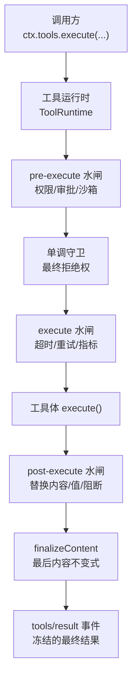
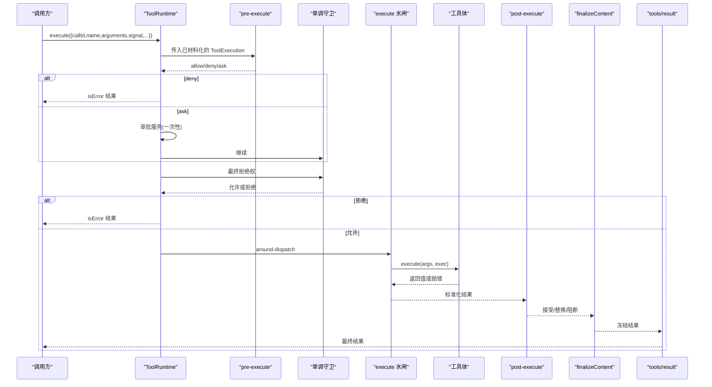
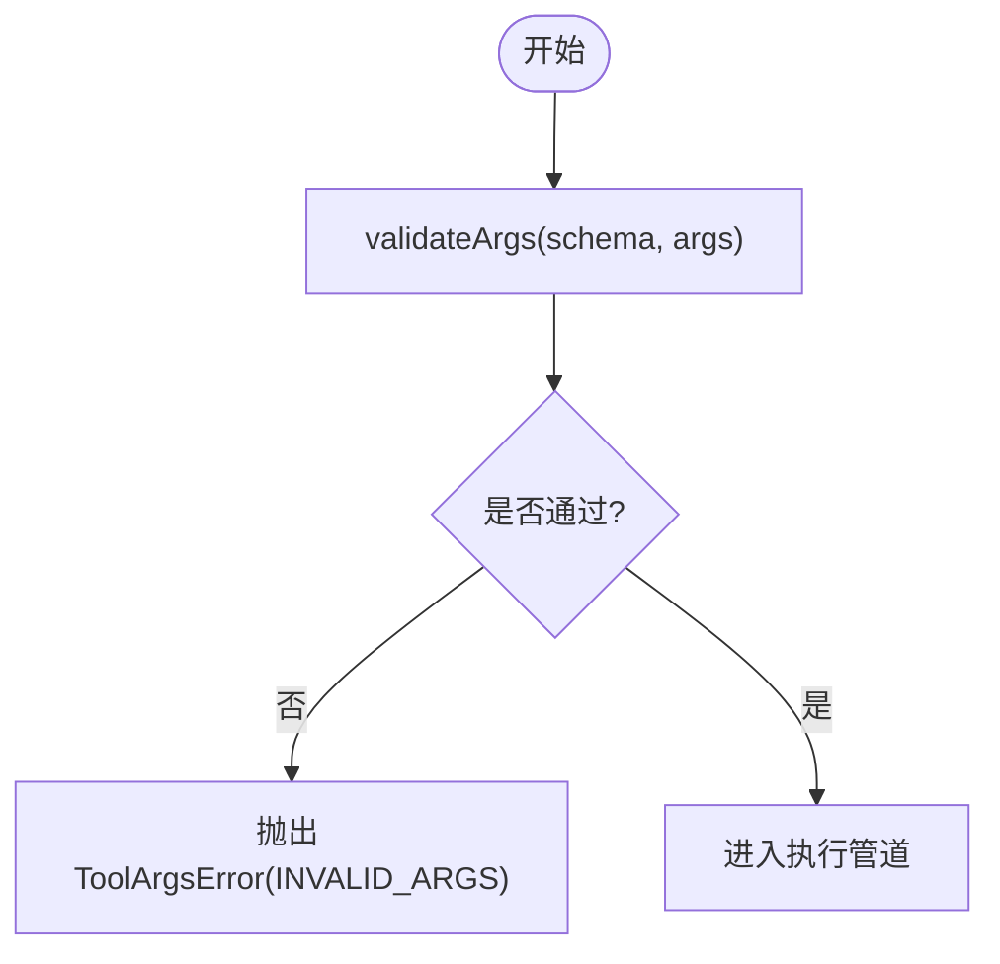
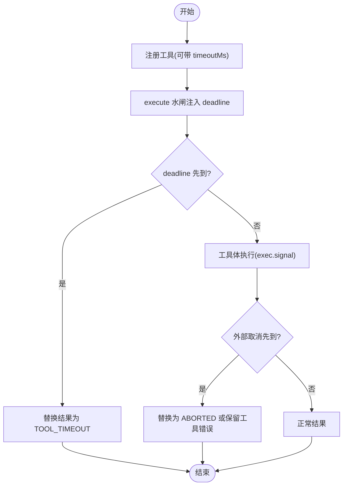
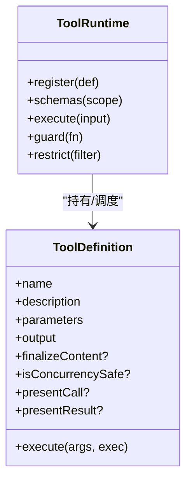

# 工具消费者

<cite>
**本文引用的文件**
- [packages/core/tools/src/index.ts](file://packages/core/tools/src/index.ts)
- [packages/core/tools/src/schema.ts](file://packages/core/tools/src/schema.ts)
- [packages/core/tools/src/types.ts](file://packages/core/tools/src/types.ts)
- [packages/core/tools/tests/tools.spec.ts](file://packages/core/tools/tests/tools.spec.ts)
- [packages/shell/tool-bash/src/index.ts](file://packages/shell/tool-bash/src/index.ts)
- [packages/guard/timeout-policy/tests/timeout-policy.spec.ts](file://packages/guard/timeout-policy/tests/timeout-policy.spec.ts)
- [docs/subsystems/tools.md](file://docs/subsystems/tools.md)
- [docs/tool-execution-pipeline.md](file://docs/tool-execution-pipeline.md)
- [docs/cookbook/adding-a-tool.md](file://docs/cookbook/adding-a-tool.md)
</cite>

## 目录
1. [简介](#简介)
2. [项目结构](#项目结构)
3. [核心组件](#核心组件)
4. [架构总览](#架构总览)
5. [详细组件分析](#详细组件分析)
6. [依赖关系分析](#依赖关系分析)
7. [性能与优化](#性能与优化)
8. [故障排查指南](#故障排查指南)
9. [结论](#结论)
10. [附录：调用示例与最佳实践](#附录调用示例与最佳实践)

## 简介
本文件面向“工具消费者”（即调用工具的代码、Agent 循环、以及通过 SDK 间接调用工具的运行时），系统性说明工具调用机制，包括参数校验、权限检查、执行管道、异步处理、超时控制、错误传播、返回结果处理、性能优化与监控指标。文档同时提供具体调用示例与最佳实践，帮助开发者在代码中正确、安全、高效地使用各种工具。

## 项目结构
- 工具注册与执行管道位于核心包：`packages/core/tools`
- 典型工具实现（如 bash）位于 `packages/shell/tool-bash`
- 超时策略测试位于 `packages/guard/timeout-policy`
- 子系统文档与流水线图位于 `docs/subsystems/tools.md` 与 `docs/tool-execution-pipeline.md`
- 工具编写指南位于 `docs/cookbook/adding-a-tool.md`

图表来源
- [packages/core/tools/src/index.ts:129-200](file://packages/core/tools/src/index.ts#L129-L200)
- [docs/tool-execution-pipeline.md:8-58](file://docs/tool-execution-pipeline.md#L8-L58)

章节来源
- [docs/subsystems/tools.md:1-12](file://docs/subsystems/tools.md#L1-L12)
- [docs/tool-execution-pipeline.md:1-63](file://docs/tool-execution-pipeline.md#L1-L63)

## 核心组件
- ToolDefinition：工具定义，包含模型可见的 schema、输出声明、执行函数、可选的内容终态化回调、并发安全标记、UI 呈现方法等。
- ToolRuntime：工具注册表与执行管道，负责参数材料化、权限/守卫、around-dispatch、post-execute、结果规范化与通知。
- 参数与输出 Schema DSL：统一的 JSON 值类型 DSL，用于参数与输出的强类型约束与推断。
- 执行模式与调度：parallel/exclusive 模式，支持并行分组与独占屏障。
- PTC 模式桥接：run_code 子调用的日志与可替换持久化副本。

章节来源
- [packages/core/tools/src/index.ts:203-280](file://packages/core/tools/src/index.ts#L203-L280)
- [packages/core/tools/src/schema.ts:98-151](file://packages/core/tools/src/schema.ts#L98-L151)
- [docs/subsystems/tools.md:170-255](file://docs/subsystems/tools.md#L170-L255)

## 架构总览
工具调用从调用方进入 ToolRuntime，依次经过 pre-execute 水闸（允许/拒绝/询问）、单调守卫（最终拒绝）、execute 水闸（超时/重试/指标）、工具体执行、post-execute 水闸（接受/替换/阻断/附加上下文）、finalizeContent（内容不变式）、tools/result 事件（冻结的最终结果）。PTC 模式下，run_code 的子调用会额外触发 tools/ptc-dispatch-log 以替换持久化日志副本。

图表来源
- [packages/core/tools/src/index.ts:129-200](file://packages/core/tools/src/index.ts#L129-L200)
- [docs/tool-execution-pipeline.md:8-58](file://docs/tool-execution-pipeline.md#L8-L58)

## 详细组件分析

### 参数验证与类型推断
- 使用统一 ValueSchemaSpec 描述参数与输出，支持 string/number/integer/boolean/null/array/object/json/oneOf。
- defineTool 将参数映射为 JSON Schema，并在执行前对 model 传入的 arguments 进行严格校验；类型不匹配或缺失必填字段会抛出结构化错误。
- 超出 DSL 表达的值级约束（如非空字符串、正数、跨字段规则）需在工具体内自行校验。

图表来源
- [packages/core/tools/src/schema.ts:98-151](file://packages/core/tools/src/schema.ts#L98-L151)
- [packages/core/tools/tests/tools.spec.ts:40-98](file://packages/core/tools/tests/tools.spec.ts#L40-L98)

章节来源
- [packages/core/tools/src/schema.ts:98-151](file://packages/core/tools/src/schema.ts#L98-L151)
- [docs/cookbook/adding-a-tool.md:40-48](file://docs/cookbook/adding-a-tool.md#L40-L48)

### 权限检查与守卫
- pre-execute 水闸：允许/拒绝/询问（审批）。缺少审批能力时，询问转为拒绝。
- 单调守卫：在 pre-execute 之后运行，只能拒绝不能放行，保证后续监听无法撤销拒绝。
- 作用域隔离：按 agent 作用域过滤，避免越权。

章节来源
- [packages/core/tools/src/index.ts:129-200](file://packages/core/tools/src/index.ts#L129-L200)
- [docs/subsystems/tools.md:153-172](file://docs/subsystems/tools.md#L153-L172)

### 执行管道与 around-dispatch
- execute 水闸：用于超时、重试、指标收集等横切关注点。可替换 exec.signal，但必须恢复并达到静默。
- 工具体：只返回“规范化的 JSON 值”，由 registry 快照、校验、冻结后交给 output.render 渲染为模型可见内容。
- post-execute 水闸：接受/替换 content/value/附加上下文/阻断（转为 isError）。
- finalizeContent：最后一次内容级不变式保障，仅能替换 content，不得影响 value/meta/error。

章节来源
- [packages/core/tools/src/index.ts:203-280](file://packages/core/tools/src/index.ts#L203-L280)
- [docs/subsystems/tools.md:170-255](file://docs/subsystems/tools.md#L170-L255)

### 异步处理、取消与超时
- 取消：exec.signal 贯穿整个管道；after-entry 取消若工具体未启动则返回 ABORTED_BEFORE_DISPATCH，否则成功结果会被替换为 ABORTED。
- 超时：工具可通过 timeoutMs 声明预算；由 timeout-policy 插件在 execute 水闸中以 deadline 方式强制，内部将结果替换为 TOOL_TIMEOUT 的结构化错误。
- 协作性：工具需尊重 exec.signal，确保在信号中止后尽快到达静默状态。

图表来源
- [packages/guard/timeout-policy/tests/timeout-policy.spec.ts:97-194](file://packages/guard/timeout-policy/tests/timeout-policy.spec.ts#L97-L194)
- [packages/core/tools/src/index.ts:145-167](file://packages/core/tools/src/index.ts#L145-L167)

章节来源
- [packages/guard/timeout-policy/tests/timeout-policy.spec.ts:97-194](file://packages/guard/timeout-policy/tests/timeout-policy.spec.ts#L97-L194)
- [packages/core/tools/src/index.ts:145-167](file://packages/core/tools/src/index.ts#L145-L167)

### 错误传播与结果规范化
- 未知工具：抛出 ToolNotFoundError（UNKNOWN_TOOL），不会中断 turn。
- 参数错误：ToolArgsError（INVALID_ARGS）。
- 输出违规：ToolOutputError（INVALID_TOOL_OUTPUT），发生在 body 返回值、render、presentationMeta 或 result 字段快照失败时。
- 管道异常：pre/post/execute 水闸抛错会被捕获并归一化为 isError 结果，仍会进入 finalizeContent。
- 最终结果：tools/result 收到冻结的不可变结果，便于持久化与 UI 渲染。

章节来源
- [packages/core/tools/src/index.ts:461-573](file://packages/core/tools/src/index.ts#L461-L573)
- [packages/core/tools/tests/tools.spec.ts:136-200](file://packages/core/tools/tests/tools.spec.ts#L136-L200)

### 不同类型工具的调用模式与返回处理
- 原生工具（native）：直接通过 ctx.tools.execute 调用，返回 ToolExecutionResult。
- PTC 模式（ptc）：模型仅暴露 run_code，SDK 生成工具方法；调用重新进入同一管道，成功返回规范化的 JSON 值，失败抛出 ToolCallError（仅暴露 name/toolName/message）。
- 组合工具：可在 execute 中发起嵌套调用，并通过 deferContext 传递上下文，concludeTurn 标记当前轮次终止。

章节来源
- [docs/cookbook/adding-a-tool.md:61-66](file://docs/cookbook/adding-a-tool.md#L61-L66)
- [packages/core/tools/src/index.ts:397-414](file://packages/core/tools/src/index.ts#L397-L414)

### 实际工具示例：bash 工具
- 参数校验：command/description 必填且非空；timeoutMs 为正数；sandbox_permissions 与 justification 配对校验。
- 执行：遵循 exec.signal，支持后台运行、工作目录、沙箱权限等。
- 返回：由工具输出声明决定，通常渲染为终端卡片或文本。

章节来源
- [packages/shell/tool-bash/src/index.ts:38-67](file://packages/shell/tool-bash/src/index.ts#L38-L67)

## 依赖关系分析
- ToolRuntime 依赖：
  - 系统提示装配（systemPrompt）以生成模型可见的工具 schema。
  - 作用域系统（dsh-scope）以实现 agent 级别的可见性与过滤。
  - LLM 类型（ToolCallId、ContentBlock）与错误类型（HarnessError）。
  - 可选 ApprovalService（用户审批）。
  - CodeRuntime（PTC 模式下的语言后端）。
- 事件与扩展点：
  - tools/pre-execute、tools/execute、tools/post-execute、tools/ptc-dispatch-log、tools/result、tools/change。
  - 这些扩展点使权限、超时、指标、审计、UI 呈现等横切逻辑与工具解耦。

图表来源
- [packages/core/tools/src/index.ts:780-800](file://packages/core/tools/src/index.ts#L780-L800)
- [packages/core/tools/src/index.ts:203-280](file://packages/core/tools/src/index.ts#L203-L280)

章节来源
- [packages/core/tools/src/index.ts:129-200](file://packages/core/tools/src/index.ts#L129-L200)
- [docs/subsystems/tools.md:470-574](file://docs/subsystems/tools.md#L470-L574)

## 性能与优化
- 并发与独占：
  - isConcurrencySafe 可将调用加入并行组；exclusive 形成顺序屏障。
  - PTC 模式下 maxParallelSubCalls 限制子调用并发度（默认 10）。
- 结果快照与冻结：
  - 参数与结果均做 lossless JSON 快照并冻结，减少拷贝与竞态风险。
- 内容终态化：
  - finalizeContent 仅做内容裁剪/格式化，避免重复计算。
- 缓存策略：
  - 工具层无内置缓存；建议在工具实现内基于输入键做幂等缓存（注意失效与一致性）。
- 监控指标：
  - 通过 tools/execute 水闸记录耗时、成功率、错误码分布；通过 tools/result 观察最终结果。
  - 结合 session 事件 tool/code-dispatch-start 与 tool/code-dispatch 追踪子调用生命周期。

章节来源
- [packages/core/tools/src/index.ts:247-261](file://packages/core/tools/src/index.ts#L247-L261)
- [packages/core/tools/src/index.ts:646-667](file://packages/core/tools/src/index.ts#L646-L667)
- [packages/core/tools/src/types.ts:10-57](file://packages/core/tools/src/types.ts#L10-L57)

## 故障排查指南
- 常见错误与定位：
  - UNKNOWN_TOOL：工具名未注册或不可见（作用域/限制）。
  - INVALID_ARGS：参数类型/必填项不符合 schema。
  - INVALID_TOOL_OUTPUT：body 返回值或 render/presentationMeta 不符合 schema/不可序列化。
  - TOOL_TIMEOUT：超过 timeoutMs 预算，检查工具是否响应 exec.signal。
  - ABORTED / ABORTED_BEFORE_DISPATCH：调用被取消，检查上游取消链路与工具清理逻辑。
- 调试建议：
  - 在 tools/execute 水闸打印 exec.name、args、signal 状态。
  - 在 tools/post-execute 检查 result.content、error、meta。
  - 在 tools/result 观察冻结的最终结果，确认持久化一致。
  - 对于 PTC 子调用，核对 tool/code-dispatch-start 与 tool/code-dispatch 的 subCallId 配对。

章节来源
- [packages/core/tools/src/index.ts:461-573](file://packages/core/tools/src/index.ts#L461-L573)
- [packages/core/tools/tests/tools.spec.ts:136-200](file://packages/core/tools/tests/tools.spec.ts#L136-L200)
- [packages/core/tools/src/types.ts:10-57](file://packages/core/tools/src/types.ts#L10-L57)

## 结论
工具消费者应遵循“参数强校验、权限前置、超时协作、结果规范化、可观测”的原则。通过 pre-execute 与守卫完成安全边界，通过 execute 水闸实现横切关注点，通过 post-execute 与 finalizeContent 保证内容与值的契约，最终通过 tools/result 获得不可变结果用于持久化与展示。PTC 模式让 SDK 工具调用无缝接入同一管道，提升一致性与可维护性。

## 附录：调用示例与最佳实践

### 基本调用（原生）
- 入口：ctx.tools.execute({ callId, name, arguments, signal })
- 结果：ToolExecutionResult（content、isError、value、meta）
- 参考路径：[packages/core/tools/tests/tools.spec.ts:90-98](file://packages/core/tools/tests/tools.spec.ts#L90-L98)

### PTC 模式调用（SDK）
- 模型仅暴露 run_code；SDK 生成工具方法，调用重新进入同一管道。
- 成功返回规范化的 JSON 值；失败抛出 ToolCallError（仅暴露 name/toolName/message）。
- 参考路径：[docs/cookbook/adding-a-tool.md:61-66](file://docs/cookbook/adding-a-tool.md#L61-L66)

### 超时与取消
- 工具声明 timeoutMs，由 timeout-policy 在 execute 水闸强制。
- 工具需响应 exec.signal，确保在取消后尽快静默。
- 参考路径：[packages/guard/timeout-policy/tests/timeout-policy.spec.ts:97-194](file://packages/guard/timeout-policy/tests/timeout-policy.spec.ts#L97-L194)

### 权限与审批
- 在 pre-execute 中实现 allow/deny/ask；缺审批能力时 ask 转为 deny。
- 使用 guard 做最终拒绝，不可被后续监听撤销。
- 参考路径：[packages/core/tools/src/index.ts:129-200](file://packages/core/tools/src/index.ts#L129-L200)

### 结果投影与 UI 呈现
- output.render 产出模型可见内容；presentationMeta 产出可重放的结构化元数据。
- presentCall/presentResult 提供 UI 卡片视图（generic/terminal/diff/search/read/web）。
- 参考路径：[docs/subsystems/tools.md:459-468](file://docs/subsystems/tools.md#L459-L468)

### 最佳实践清单
- 参数：用 ValueSchemaSpec 精确描述；超出 DSL 的约束在工具体内校验。
- 执行：只返回规范化的 JSON 值；不要返回内容块。
- 取消：始终尊重 exec.signal；长任务要可中断。
- 超时：合理设置 timeoutMs；确保工具协作性。
- 权限：尽量将策略放在 pre-execute/guard，而非工具内部。
- 结果：保持 value 可序列化、可冻结；presentationMeta 仅承载可重放元数据。
- 可观测：在 execute/post-execute/result 埋点，统计耗时、错误码、吞吐。

章节来源
- [docs/cookbook/adding-a-tool.md:40-98](file://docs/cookbook/adding-a-tool.md#L40-L98)
- [docs/subsystems/tools.md:170-255](file://docs/subsystems/tools.md#L170-L255)
- [packages/core/tools/src/index.ts:203-280](file://packages/core/tools/src/index.ts#L203-L280)