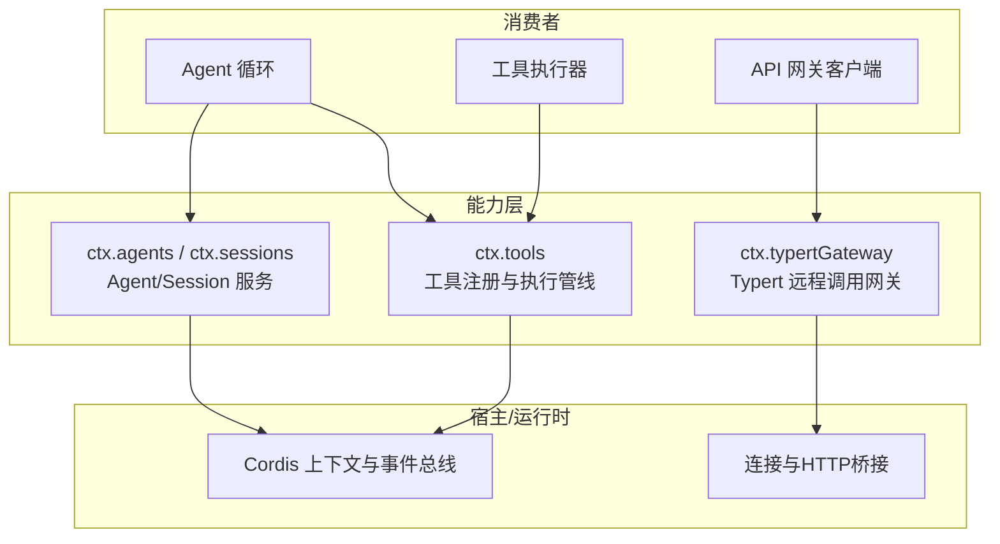
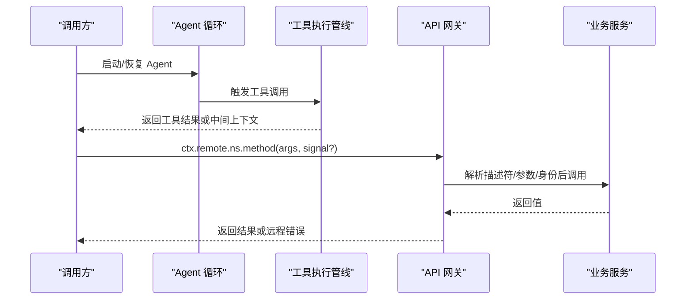
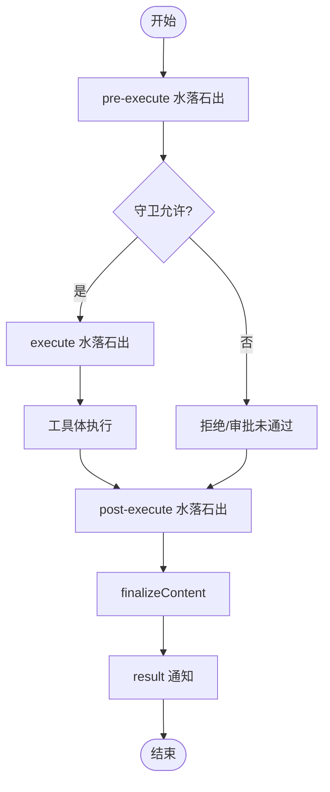
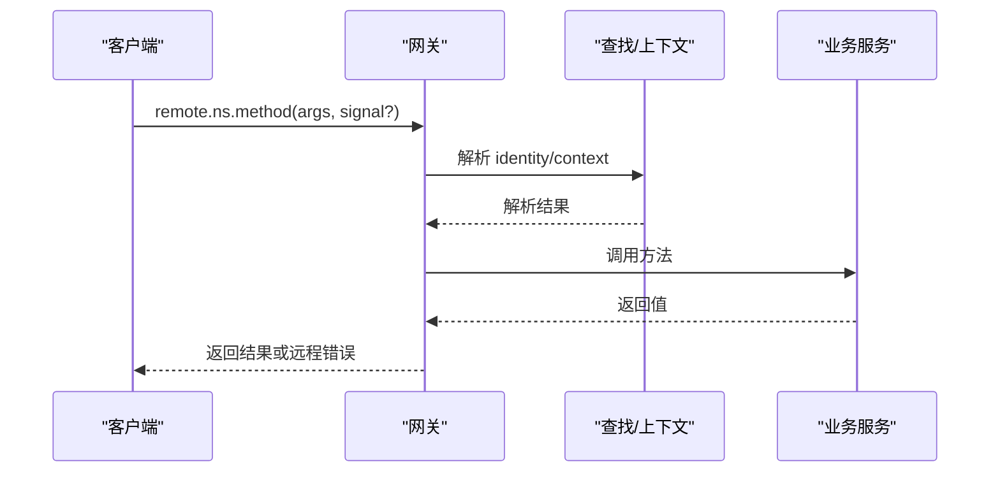
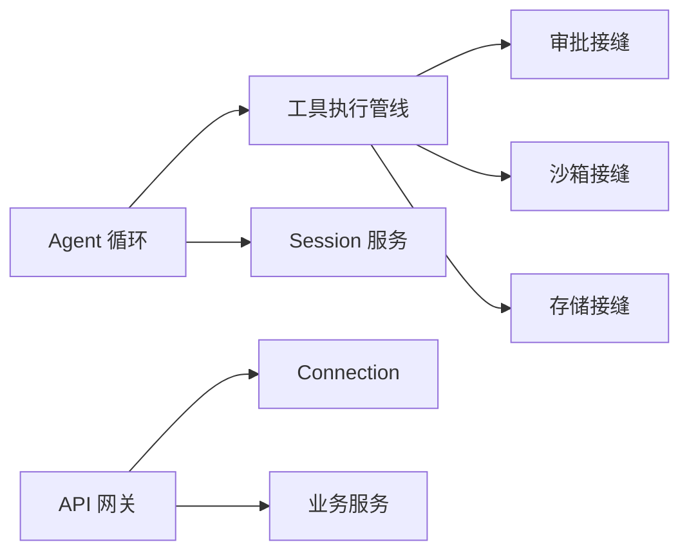

# 能力消费者使用

<cite>
**本文引用的文件**
- [packages/core/tools/src/index.ts](file://packages/core/tools/src/index.ts)
- [packages/core/agent-loop/src/index.ts](file://packages/core/agent-loop/src/index.ts)
- [docs/api-gateway.md](file://docs/api-gateway.md)
- [docs/tool-execution-pipeline.md](file://docs/tool-execution-pipeline.md)
- [docs/event-producer-consumer.md](file://docs/event-producer-consumer.md)
- [docs/capability-seams.md](file://docs/capability-seams.md)
- [packages/api/workspace-controller/src/directory-picker.ts](file://packages/api/workspace-controller/src/directory-picker.ts)
</cite>

## 目录
1. [简介](#简介)
2. [项目结构](#项目结构)
3. [核心组件](#核心组件)
4. [架构总览](#架构总览)
5. [详细组件分析](#详细组件分析)
6. [依赖关系分析](#依赖关系分析)
7. [性能考量](#性能考量)
8. [故障排查指南](#故障排查指南)
9. [结论](#结论)
10. [附录：配置与最佳实践](#附录：配置与最佳实践)

## 简介
本指南面向“能力消费者”，系统阐述在 Harness 中如何消费服务、工具、Agent 循环、API 网关等能力。文档覆盖以下主题：
- 消费模式与实现原理：服务发现、依赖解析、调用封装
- 典型消费者模式：Agent 循环、工具执行器、API 网关
- 配置选项、错误处理与性能监控
- 生命周期管理、资源清理与异常处理机制
- 实战示例与最佳实践，帮助在业务逻辑中安全、高效地消费能力

## 项目结构
Harness 通过“能力接缝（Capability Seams）”将契约、实现与消费者解耦；通过 Cordis 上下文与服务注册完成服务发现与依赖注入；通过工具执行管线统一策略、沙箱、审批与结果归一化；通过 API Gateway 提供跨进程/跨边界的远程方法调用。



图表来源
- [docs/capability-seams.md:493-567](file://docs/capability-seams.md#L493-L567)
- [docs/api-gateway.md:80-93](file://docs/api-gateway.md#L80-L93)

章节来源
- [docs/capability-seams.md:493-567](file://docs/capability-seams.md#L493-L567)
- [docs/api-gateway.md:80-93](file://docs/api-gateway.md#L80-L93)

## 核心组件
- 工具执行管线（ctx.tools）：负责工具注册、参数校验、前置策略、审批、超时重试、后置处理与最终结果观测。
- Agent 循环（agent-loop）：创建/恢复 Agent，编排会话、步骤与轮次边界，管理取消与销毁。
- API 网关（Typert Gateway）：声明式暴露远程方法，生成强类型契约，基于 Connection 的 /api 路由进行调用与返回值校验。
- 能力接缝（Capability Seams）：以 ctx.* 键名暴露可插拔能力（如 shell、fs、subprocess、storage 等），实现与消费者解耦。

章节来源
- [packages/core/tools/src/index.ts:1-200](file://packages/core/tools/src/index.ts#L1-L200)
- [packages/core/agent-loop/src/index.ts:1-200](file://packages/core/agent-loop/src/index.ts#L1-L200)
- [docs/api-gateway.md:1-165](file://docs/api-gateway.md#L1-L165)
- [docs/capability-seams.md:493-567](file://docs/capability-seams.md#L493-L567)

## 架构总览
下图展示三种典型消费者的调用路径与关键节点：
- Agent 循环：消费 Agent/Session 服务，驱动工具执行，监听事件并持久化。
- 工具执行器：进入 pre-execute → guards → execute → post-execute → result 的固定流水线。
- API 网关：客户端通过 ctx.remote.<namespace>.method 发起调用，经 Connection 的 /api 路由到 Host 端，由 Gateway 解析描述符、查找服务、校验参数并调用。



图表来源
- [docs/tool-execution-pipeline.md:8-58](file://docs/tool-execution-pipeline.md#L8-L58)
- [docs/api-gateway.md:119-129](file://docs/api-gateway.md#L119-L129)
- [packages/core/agent-loop/src/index.ts:1-200](file://packages/core/agent-loop/src/index.ts#L1-L200)

## 详细组件分析

### 工具执行管线（工具消费者）
- 入口与阶段
  - tools/pre-execute：钩子、权限、沙箱前置检查
  - 单调守卫：拒绝或弃权，保护调用者身份
  - tools/execute：超时、重试、指标等“环绕”包装
  - 工具体执行：实际工具逻辑
  - fs/* 事件门：仅 tool-fs 的读写变更会触发
  - 工具自有事件：如 todo/write、fs/observed、hook/invoked 等
  - tools/post-execute：接受、替换、增强或阻断结果
  - 定义级 finalizeContent：保证内容不变量
  - tools/result：不可变结果的同步通知
- 取消与失败
  - 调用者取消信号贯穿管线，已启动的工具会等待其静默结束
  - 管线内抛错会被归一化为错误结果，不会中断后续观察
- 审批与策略
  - 缺失审批支持时降级为拒绝；无 Agent 时无法路由审批
- 参考流程图



图表来源
- [docs/tool-execution-pipeline.md:8-58](file://docs/tool-execution-pipeline.md#L8-L58)
- [packages/core/tools/src/index.ts:144-189](file://packages/core/tools/src/index.ts#L144-L189)
- [packages/core/tools/src/index.ts:1500-1699](file://packages/core/tools/src/index.ts#L1500-L1699)

章节来源
- [docs/tool-execution-pipeline.md:1-63](file://docs/tool-execution-pipeline.md#L1-L63)
- [packages/core/tools/src/index.ts:144-189](file://packages/core/tools/src/index.ts#L144-L189)
- [packages/core/tools/src/index.ts:1500-1699](file://packages/core/tools/src/index.ts#L1500-L1699)

### Agent 循环（Agent 消费者）
- 职责
  - 创建/恢复 Agent，维护 Session 与轮次/步骤边界
  - 聚合取消信号：调用方取消、Fiber 卸载、工厂销毁
  - 跟踪活跃 Agent 与启动任务，确保有序销毁
- 取消与资源清理
  - 在资源创建前注册析构器，避免竞态泄漏
  - 通过 AbortController 融合多个所有权信号，确保中止语义清晰
- 参考时序

```mermaid
sequenceDiagram
participant Caller as "调用方"
participant Factory as "工厂所有权"
participant Loop as "Agent 循环"
Caller->>Loop : create/resume(options, callerSignal)
Loop->>Factory : track(注销回调)
Loop->>Loop : 注册 abort 监听(调用方/Fiber/工厂)
alt 取消
Loop-->>Caller : 抛出中止原因
else 正常
Loop-->>Caller : 返回 Agent/Session
end
```

图表来源
- [packages/core/agent-loop/src/index.ts:96-147](file://packages/core/agent-loop/src/index.ts#L96-L147)
- [packages/core/agent-loop/src/index.ts:552-565](file://packages/core/agent-loop/src/index.ts#L552-L565)

章节来源
- [packages/core/agent-loop/src/index.ts:1-200](file://packages/core/agent-loop/src/index.ts#L1-L200)
- [packages/core/agent-loop/src/index.ts:96-147](file://packages/core/agent-loop/src/index.ts#L96-L147)
- [packages/core/agent-loop/src/index.ts:552-565](file://packages/core/agent-loop/src/index.ts#L552-L565)

### API 网关（远程能力消费者）
- 编程模型
  - 服务端用 @Remote/@RemoteScope 暴露方法；构建期生成强类型契约
  - 客户端通过 ctx.remote.<namespace>.method 调用，支持可选 AbortSignal
- 运行时调用
  - 客户端通过 Connection 的 /api 路由发送请求
  - 网关解析描述符、校验参数、解析身份/上下文、调用服务、校验返回值
- 查找与配置
  - lookup provider 提供稳定声明与默认解析器；Host 可通过 configure 覆盖解析策略
  - agent/session 的标准解析由 Session Controller 拥有，自动复用/恢复与会话归属校验
- 热卸载
  - 移除 Client 贡献会同时移除描述符与方法，中止进行中调用，使过期句柄拒绝后续调用



图表来源
- [docs/api-gateway.md:11-15](file://docs/api-gateway.md#L11-L15)
- [docs/api-gateway.md:119-129](file://docs/api-gateway.md#L119-L129)
- [docs/api-gateway.md:127-129](file://docs/api-gateway.md#L127-L129)

章节来源
- [docs/api-gateway.md:1-165](file://docs/api-gateway.md#L1-L165)

### 能力接缝与事件矩阵（横向消费视角）
- 能力接缝
  - 通过 ctx.* 暴露可插拔能力（shell、fs、subprocess、storage、web 等），实现与消费者解耦
  - 同一接口可有多种实现，消费者只依赖契约
- 事件矩阵
  - 生产者/消费者矩阵展示了各事件的声明位置、分发者与监听者
  - 常见事件包括 agent/*、session/*、tools/*、approval/*、credentials/* 等

章节来源
- [docs/capability-seams.md:493-567](file://docs/capability-seams.md#L493-L567)
- [docs/event-producer-consumer.md:8-79](file://docs/event-producer-consumer.md#L8-L79)

## 依赖关系分析
- 低耦合高内聚
  - 工具执行管线与具体工具实现解耦；策略通过水落石出扩展点接入
  - Agent 循环不关心工具细节，只消费工具执行结果与事件
  - API 网关屏蔽传输细节，业务服务只需关注方法签名与返回值
- 直接/间接依赖
  - 工具管线依赖审批、沙箱、存储等能力接缝
  - Agent 循环依赖 Session、System Prompt、Tools 等核心服务
  - 网关依赖 Connection、Typert 注册表与业务服务
- 循环依赖规避
  - 通过能力接缝与事件总线解耦，避免模块间直接循环引用



图表来源
- [docs/capability-seams.md:493-567](file://docs/capability-seams.md#L493-L567)
- [docs/api-gateway.md:80-93](file://docs/api-gateway.md#L80-L93)

章节来源
- [docs/capability-seams.md:493-567](file://docs/capability-seams.md#L493-L567)
- [docs/api-gateway.md:80-93](file://docs/api-gateway.md#L80-L93)

## 性能考量
- 工具执行
  - 使用 monotonic guards 快速拒绝无效调用，减少不必要开销
  - 通过 tools/execute 包装实现超时与重试，避免长尾阻塞
  - 利用 spill 策略对超大文本结果进行落盘与定位，降低内存压力
- Agent 循环
  - 限制并行工具调用数，避免资源争用
  - 合并取消信号，尽早释放资源
- API 网关
  - 严格参数校验与返回值校验，减少无效往返
  - 复用 Connection 的 RPC 通道，降低序列化/网络开销

[本节为通用指导，无需特定文件引用]

## 故障排查指南
- 常见错误分类
  - 网关层：gateway/lookup-unavailable、gateway/internal、gateway/cancelled
  - 会话层：session/not-found、session/agent-busy
  - 工具层：工具不存在、审批拒绝、超时、沙箱拒绝
- 诊断要点
  - 检查是否注册了对应的 lookup/provider
  - 确认调用链上的 AbortSignal 是否被提前中止
  - 查看 tools/result 事件，获取不可变的结果快照
  - 对于目录选择等可取消操作，区分取消与后端失败
- 参考定位

章节来源
- [docs/api-gateway.md:127-129](file://docs/api-gateway.md#L127-L129)
- [packages/api/workspace-controller/src/directory-picker.ts:151-174](file://packages/api/workspace-controller/src/directory-picker.ts#L151-L174)
- [packages/core/tools/src/index.ts:1647-1667](file://packages/core/tools/src/index.ts#L1647-L1667)

## 结论
- 通过能力接缝、工具执行管线与 API 网关，Harness 提供了统一、可插拔、可观测的能力消费方式
- 消费者应遵循“声明契约、弱依赖实现、强校验边界”的原则
- 合理使用取消信号、审批策略与溢出策略，保障稳定性与性能
- 借助事件与结果观察点，建立完善的监控与排障体系

[本节为总结性内容，无需特定文件引用]

## 附录：配置与最佳实践
- 配置建议
  - 明确声明 inject 依赖，避免隐式耦合
  - 为远程方法提供 AbortSignal，支持协作式取消
  - 合理设置工具并行度、超时与重试策略
- 最佳实践
  - 在 pre-execute 做最小成本校验，尽早失败
  - 在 post-execute 做结果增强与审计，不改变主流程
  - 使用 tools/result 做不可变结果观测，便于追踪与回放
  - 网关侧严格校验参数与返回值，避免脏数据流入业务
- 示例指引（以路径代替代码片段）
  - 工具注册与执行：参见 [packages/core/tools/src/index.ts:1-200](file://packages/core/tools/src/index.ts#L1-L200)
  - Agent 创建与取消：参见 [packages/core/agent-loop/src/index.ts:96-147](file://packages/core/agent-loop/src/index.ts#L96-L147)、[packages/core/agent-loop/src/index.ts:552-565](file://packages/core/agent-loop/src/index.ts#L552-L565)
  - 远程方法声明与调用：参见 [docs/api-gateway.md:11-15](file://docs/api-gateway.md#L11-L15)、[docs/api-gateway.md:119-129](file://docs/api-gateway.md#L119-L129)
  - 能力接缝与事件矩阵：参见 [docs/capability-seams.md:493-567](file://docs/capability-seams.md#L493-L567)、[docs/event-producer-consumer.md:8-79](file://docs/event-producer-consumer.md#L8-L79)