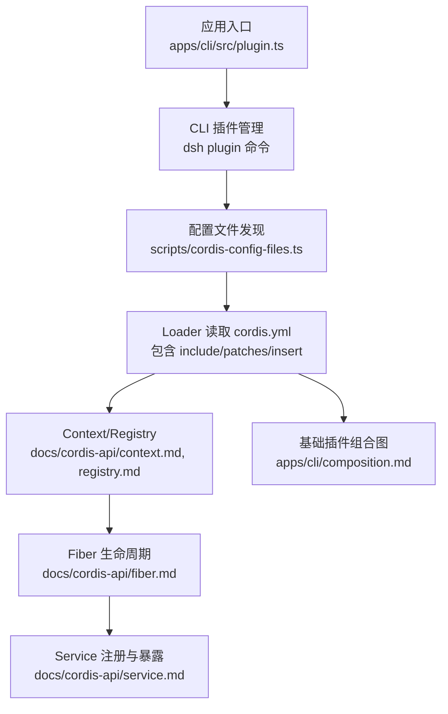
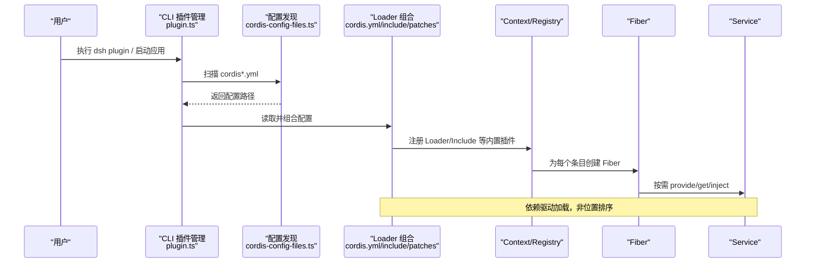
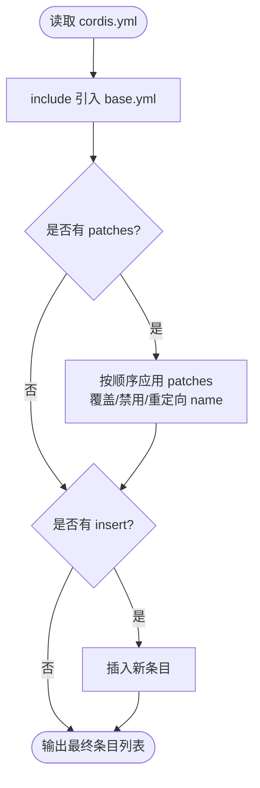
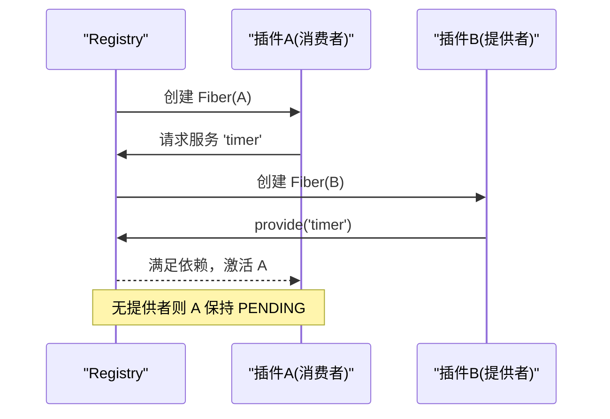
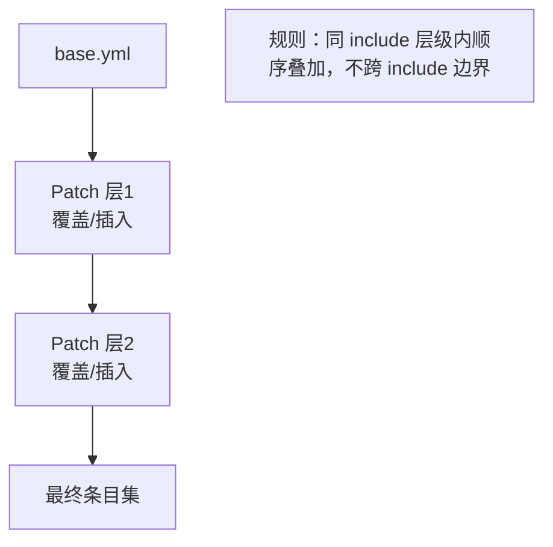
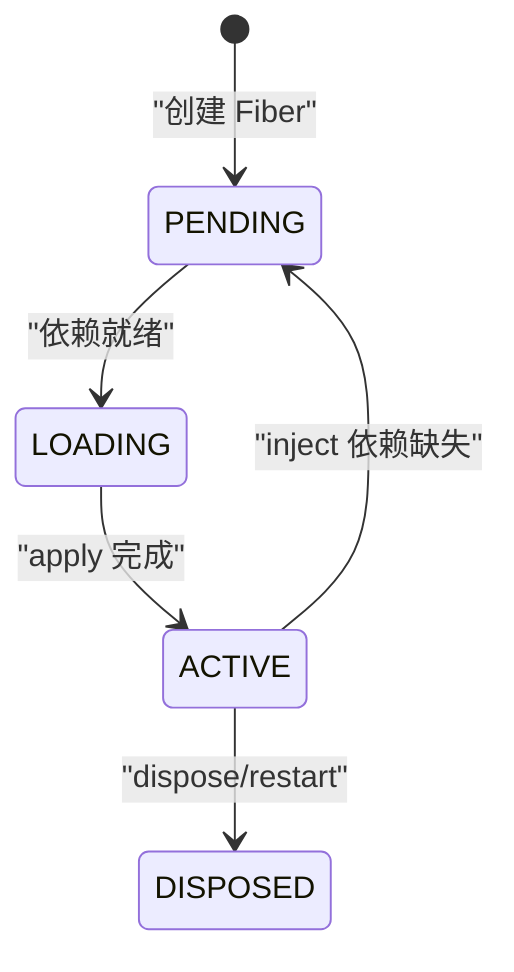
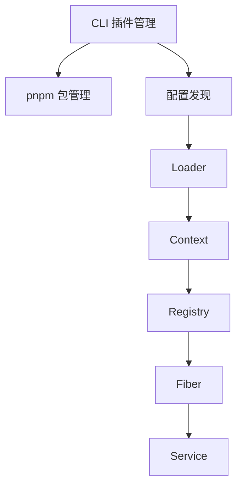

# 插件组合机制

<cite>
**本文引用的文件**
- [apps/cli/composition.md](file://apps/cli/composition.md)
- [apps/cli/src/plugin.ts](file://apps/cli/src/plugin.ts)
- [apps/cli/tests/built-bin.e2e.ts](file://apps/cli/tests/built-bin.e2e.ts)
- [docs/cordis-api/context.md](file://docs/cordis-api/context.md)
- [docs/cordis-api/fiber.md](file://docs/cordis-api/fiber.md)
- [docs/cordis-api/registry.md](file://docs/cordis-api/registry.md)
- [docs/cordis-api/service.md](file://docs/cordis-api/service.md)
- [docs/cordis-tutorial/01-first-plugin.md](file://docs/cordis-tutorial/01-first-plugin.md)
- [docs/cordis-tutorial/06-composition-and-hmr.md](file://docs/cordis-tutorial/06-composition-and-hmr.md)
- [packages/boot/app-boot/tests/config-reload.spec.ts](file://packages/boot/app-boot/tests/config-reload.spec.ts)
- [scripts/cordis-config-files.ts](file://scripts/cordis-config-files.ts)
- [scripts/verify-cordis-config.ts](file://scripts/verify-cordis-config.ts)
- [packages/extensions/tool-cordis/tests/cordis-lifecycle.spec.ts](file://packages/extensions/tool-cordis/tests/cordis-lifecycle.spec.ts)
</cite>

## 目录
1. [简介](#简介)
2. [项目结构](#项目结构)
3. [核心组件](#核心组件)
4. [架构总览](#架构总览)
5. [详细组件分析](#详细组件分析)
6. [依赖关系分析](#依赖关系分析)
7. [性能考量](#性能考量)
8. [故障排除指南](#故障排除指南)
9. [结论](#结论)
10. [附录](#附录)

## 简介
本文件系统性阐述 Cordis 插件系统的组合机制，覆盖插件发现、加载顺序与依赖解析；配置合并策略（优先级、冲突解决、继承）；生命周期钩子（初始化、启动、停止）；并提供可操作的插件组合示例、调试技巧、性能分析与故障排除方法，帮助开发者构建复杂且可维护的插件架构。

## 项目结构
Cordis 插件系统由“配置驱动的组合”和“运行时上下文/服务/Fiber 管理”两部分构成：
- 配置层：通过 YAML 清单声明插件条目、补丁与插入，支持 include、patches、insert 等能力，形成可叠加的配置树。
- 运行层：Context 提供依赖注入与服务注册；Registry 负责插件装载与依赖解析；Fiber 表示单个插件实例的生命周期；Service 是命名服务的基类。

**图表来源**
- [apps/cli/src/plugin.ts:120-163](file://apps/cli/src/plugin.ts#L120-L163)
- [scripts/cordis-config-files.ts:13-18](file://scripts/cordis-config-files.ts#L13-L18)
- [docs/cordis-api/context.md:14-96](file://docs/cordis-api/context.md#L14-L96)
- [docs/cordis-api/registry.md:35-52](file://docs/cordis-api/registry.md#L35-L52)
- [docs/cordis-api/fiber.md:50-129](file://docs/cordis-api/fiber.md#L50-L129)
- [docs/cordis-api/service.md:14-103](file://docs/cordis-api/service.md#L14-L103)
- [apps/cli/composition.md:8-183](file://apps/cli/composition.md#L8-L183)

**章节来源**
- [apps/cli/src/plugin.ts:120-163](file://apps/cli/src/plugin.ts#L120-L163)
- [scripts/cordis-config-files.ts:13-18](file://scripts/cordis-config-files.ts#L13-L18)
- [apps/cli/composition.md:8-183](file://apps/cli/composition.md#L8-L183)

## 核心组件
- Context：插件运行的依赖容器，支持 extend/isolate/intercept 创建子作用域，提供事件、日志、反射与注册表访问。
- Registry：插件装载与依赖注入入口，提供 ctx.plugin(ctx.inject) 等 API。
- Fiber：单个插件实例，承载状态、已验证配置、效果与清理。
- Service：命名服务基类，构造时自动注册到 Context，随 Fiber 卸载而移除。

这些组件共同实现“声明式组合 + 运行时依赖解析 + 可插拔扩展”。

**章节来源**
- [docs/cordis-api/context.md:14-96](file://docs/cordis-api/context.md#L14-L96)
- [docs/cordis-api/registry.md:35-52](file://docs/cordis-api/registry.md#L35-L52)
- [docs/cordis-api/fiber.md:50-129](file://docs/cordis-api/fiber.md#L50-L129)
- [docs/cordis-api/service.md:14-103](file://docs/cordis-api/service.md#L14-L103)

## 架构总览
下图展示从 CLI 到 Loader、再到 Context/Registry/Fiber/Service 的完整装配路径，以及基础插件组合图的生成来源。

**图表来源**
- [apps/cli/src/plugin.ts:120-163](file://apps/cli/src/plugin.ts#L120-L163)
- [scripts/cordis-config-files.ts:13-18](file://scripts/cordis-config-files.ts#L13-L18)
- [docs/cordis-api/context.md:14-96](file://docs/cordis-api/context.md#L14-L96)
- [docs/cordis-api/registry.md:35-52](file://docs/cordis-api/registry.md#L35-L52)
- [docs/cordis-api/fiber.md:50-129](file://docs/cordis-api/fiber.md#L50-L129)
- [docs/cordis-api/service.md:14-103](file://docs/cordis-api/service.md#L14-L103)

## 详细组件分析

### 插件发现与组合（配置层）
- 配置发现：通过 glob 匹配仓库中所有 cordis*.yml/yaml，排除翻译侧车与 vendor/node_modules。
- 组合规则：
  - include：引入外部清单，作为同一 include 层级的一部分。
  - patches：对已有条目进行覆盖或禁用，后层覆盖前层。
  - insert：在 include 层级内插入新条目。
- 层次与边界：补丁不跨越 include 边界，因此后续层仍可修改前面层插入的条目。

**图表来源**
- [scripts/cordis-config-files.ts:13-18](file://scripts/cordis-config-files.ts#L13-L18)
- [packages/boot/app-boot/tests/config-reload.spec.ts:288-376](file://packages/boot/app-boot/tests/config-reload.spec.ts#L288-L376)

**章节来源**
- [scripts/cordis-config-files.ts:13-18](file://scripts/cordis-config-files.ts#L13-L18)
- [packages/boot/app-boot/tests/config-reload.spec.ts:288-376](file://packages/boot/app-boot/tests/config-reload.spec.ts#L288-L376)

### 加载顺序与依赖解析（运行层）
- 加载顺序：条目并发启动，实际执行顺序由依赖决定，而非 YAML 中的位置。
- 依赖注入：通过 inject 声明所需服务名，Registry 等待提供者就绪后再激活消费者。
- 诊断：可通过遍历 Fiber 状态识别 PENDING 原因（缺少提供者）。

**图表来源**
- [docs/cordis-api/registry.md:35-52](file://docs/cordis-api/registry.md#L35-L52)
- [docs/cordis-tutorial/06-composition-and-hmr.md:61-109](file://docs/cordis-tutorial/06-composition-and-hmr.md#L61-L109)

**章节来源**
- [docs/cordis-api/registry.md:35-52](file://docs/cordis-api/registry.md#L35-L52)
- [docs/cordis-tutorial/06-composition-and-hmr.md:61-109](file://docs/cordis-tutorial/06-composition-and-hmr.md#L61-L109)

### 配置合并策略（优先级、冲突、继承）
- 优先级：bundle 层 → 用户层 → --patch 命令行层，在同一 include 层级内按声明顺序叠加。
- 冲突解决：后出现的 patch 覆盖先前的同名字段；可禁用某条目或替换其 name。
- 继承机制：父级条目被 patch 后可被子层继续 patch；insert 的条目同样可被后续层处理。

**图表来源**
- [packages/boot/app-boot/tests/config-reload.spec.ts:349-376](file://packages/boot/app-boot/tests/config-reload.spec.ts#L349-L376)

**章节来源**
- [packages/boot/app-boot/tests/config-reload.spec.ts:349-376](file://packages/boot/app-boot/tests/config-reload.spec.ts#L349-L376)

### 生命周期钩子（初始化、启动、停止）
- 初始化：插件模块导出 apply(ctx)，由 Loader 调用。
- 启动：Fiber 进入 LOADING/ACTIVE 状态，effect 立即执行并收集 disposer。
- 停止：Fiber.dispose 按逆序执行所有 effect 的 disposer，确保资源释放。
- 更新：update(config) 会先触发 internal/update 水线，再重启插件。

**图表来源**
- [docs/cordis-api/fiber.md:50-129](file://docs/cordis-api/fiber.md#L50-L129)
- [docs/cordis-api/fiber.md:212-274](file://docs/cordis-api/fiber.md#L212-L274)
- [packages/extensions/tool-cordis/tests/cordis-lifecycle.spec.ts:122-161](file://packages/extensions/tool-cordis/tests/cordis-lifecycle.spec.ts#L122-L161)

**章节来源**
- [docs/cordis-api/fiber.md:50-129](file://docs/cordis-api/fiber.md#L50-L129)
- [docs/cordis-api/fiber.md:212-274](file://docs/cordis-api/fiber.md#L212-L274)
- [packages/extensions/tool-cordis/tests/cordis-lifecycle.spec.ts:122-161](file://packages/extensions/tool-cordis/tests/cordis-lifecycle.spec.ts#L122-L161)

### 插件组合示例（构建复杂架构）
- 基础组合：参考 dsh-base 的插件清单，将多个功能插件以 include/patches/insert 组合成完整应用。
- 动态组合：通过 CLI 命令管理 profile 的 bundles，安装/更新包后自动同步到层叠栈。
- 端到端验证：使用最小化 bundle 验证生命周期标记文件（ready/settled/disposed），证明组合与卸载流程正确。

**图表来源**
- [apps/cli/composition.md:8-183](file://apps/cli/composition.md#L8-L183)
- [apps/cli/src/plugin.ts:47-91](file://apps/cli/src/plugin.ts#L47-L91)
- [apps/cli/tests/built-bin.e2e.ts:72-175](file://apps/cli/tests/built-bin.e2e.ts#L72-L175)

**章节来源**
- [apps/cli/composition.md:8-183](file://apps/cli/composition.md#L8-L183)
- [apps/cli/src/plugin.ts:47-91](file://apps/cli/src/plugin.ts#L47-L91)
- [apps/cli/tests/built-bin.e2e.ts:72-175](file://apps/cli/tests/built-bin.e2e.ts#L72-L175)

### 开发指南（从零到一）
- 编写插件：导出 name 与 apply(ctx)；或使用对象/类形式（Service 子类）。
- 组合应用：在 cordis.yml 中列出条目；通过 inject 声明依赖；使用 id 稳定标识以便 HMR。
- 热重载：启用 HMR 插件监听保存事件，卸载旧实例并重新加载。
- 调试：遍历 Fiber 状态定位 PENDING；检查模块解析错误与拼写问题。

**章节来源**
- [docs/cordis-tutorial/01-first-plugin.md:1-96](file://docs/cordis-tutorial/01-first-plugin.md#L1-L96)
- [docs/cordis-tutorial/06-composition-and-hmr.md:1-114](file://docs/cordis-tutorial/06-composition-and-hmr.md#L1-L114)

## 依赖关系分析
- 组件耦合：
  - Loader 依赖 Context/Registry 进行装载与注入。
  - Fiber 依赖 Context 获取服务与事件；Service 通过 Context 暴露 API。
- 外部依赖：
  - CLI 通过 pnpm 管理 profile 的 bundles，并在安装成功后同步层叠栈。
  - 配置发现脚本扫描仓库中的 cordis 配置文件。

**图表来源**
- [apps/cli/src/plugin.ts:120-163](file://apps/cli/src/plugin.ts#L120-L163)
- [scripts/cordis-config-files.ts:13-18](file://scripts/cordis-config-files.ts#L13-L18)
- [docs/cordis-api/context.md:14-96](file://docs/cordis-api/context.md#L14-L96)
- [docs/cordis-api/registry.md:35-52](file://docs/cordis-api/registry.md#L35-L52)
- [docs/cordis-api/fiber.md:50-129](file://docs/cordis-api/fiber.md#L50-L129)
- [docs/cordis-api/service.md:14-103](file://docs/cordis-api/service.md#L14-L103)

**章节来源**
- [apps/cli/src/plugin.ts:120-163](file://apps/cli/src/plugin.ts#L120-L163)
- [scripts/cordis-config-files.ts:13-18](file://scripts/cordis-config-files.ts#L13-L18)
- [docs/cordis-api/context.md:14-96](file://docs/cordis-api/context.md#L14-L96)
- [docs/cordis-api/registry.md:35-52](file://docs/cordis-api/registry.md#L35-L52)
- [docs/cordis-api/fiber.md:50-129](file://docs/cordis-api/fiber.md#L50-L129)
- [docs/cordis-api/service.md:14-103](file://docs/cordis-api/service.md#L14-L103)

## 性能考量
- 并发加载：条目并发启动，减少冷启动时间；依赖解析避免不必要的阻塞。
- 热重载：HMR 仅卸载/重装变更插件，降低整体重启成本。
- 配置刷新：include/patches 在每次重读时重新应用，保证一致性但需控制补丁复杂度。
- 诊断开销：遍历 Fiber 状态用于诊断，建议在开发环境使用。

[本节为通用指导，不直接分析具体文件]

## 故障排除指南
- 模块无法解析：Loader 通过日志报告而非崩溃；优先检查拼写与路径。
- 插件始终 PENDING：检查 inject 是否缺少提供者；使用 Registry 枚举 Fiber 状态定位。
- 生命周期异常：确认 effect 的 disposer 是否正确返回；避免在模块顶层创建全局副作用。
- 配置未生效：确认补丁顺序与 include 边界；确保 id 稳定以避免误删重建。

**章节来源**
- [docs/cordis-tutorial/01-first-plugin.md:79-93](file://docs/cordis-tutorial/01-first-plugin.md#L79-L93)
- [docs/cordis-tutorial/06-composition-and-hmr.md:61-109](file://docs/cordis-tutorial/06-composition-and-hmr.md#L61-L109)
- [packages/extensions/tool-cordis/tests/cordis-lifecycle.spec.ts:122-161](file://packages/extensions/tool-cordis/tests/cordis-lifecycle.spec.ts#L122-L161)

## 结论
Cordis 通过“配置驱动的组合 + 运行时依赖注入 + Fiber 生命周期管理”，实现了高内聚、低耦合的插件生态。借助 include/patches/insert 的灵活组合、依赖驱动的加载顺序、以及完善的生命周期与诊断能力，开发者可以构建可扩展、可维护且易于调试的复杂插件架构。

[本节为总结性内容，不直接分析具体文件]

## 附录
- 快速上手：参考教程“你的第一个插件”与“组合与 HMR”。
- 组合图谱：查看 dsh-base 的基础组合图，理解典型插件集合。
- 工具链：CLI 插件管理命令用于 profile 的 bundles 同步与维护。

**章节来源**
- [docs/cordis-tutorial/01-first-plugin.md:1-96](file://docs/cordis-tutorial/01-first-plugin.md#L1-L96)
- [docs/cordis-tutorial/06-composition-and-hmr.md:1-114](file://docs/cordis-tutorial/06-composition-and-hmr.md#L1-L114)
- [apps/cli/composition.md:8-183](file://apps/cli/composition.md#L8-L183)
- [apps/cli/src/plugin.ts:120-163](file://apps/cli/src/plugin.ts#L120-L163)