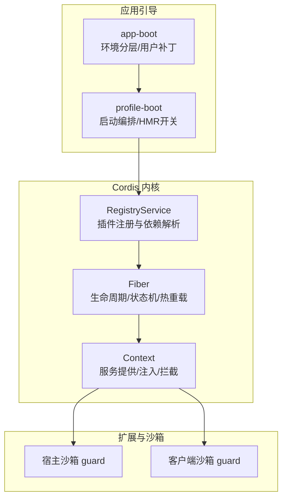
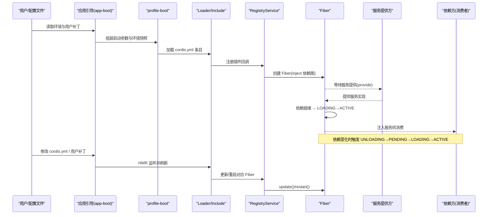
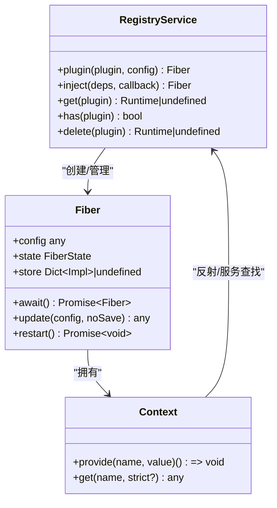
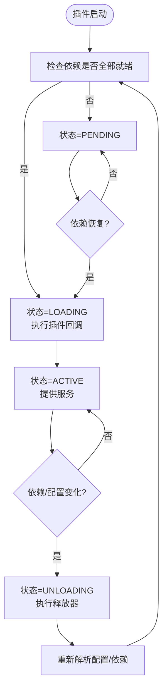
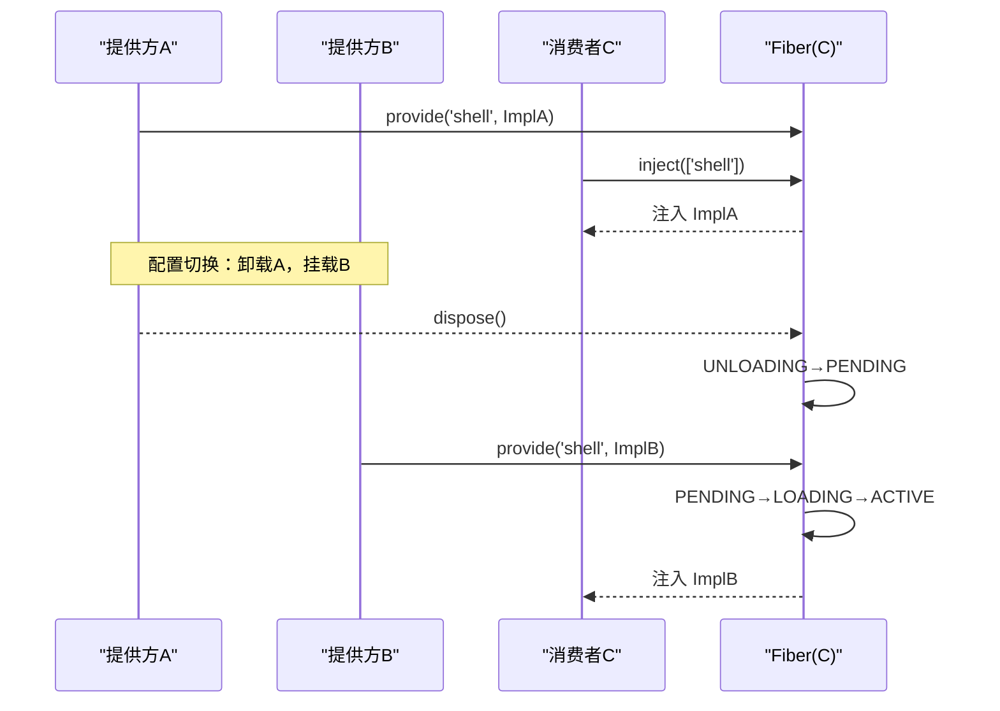
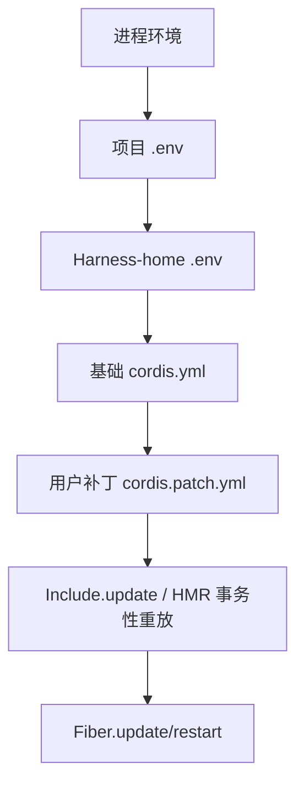

# 能力组合与替换

<cite>
**本文引用的文件**
- [registry.ts](file://vendor/cordis/src/registry.ts)
- [fiber.ts](file://vendor/cordis/src/fiber.ts)
- [context.md](file://docs/cordis-api/context.md)
- [context.zh.md](file://docs/cordis-api/context.zh.md)
- [03-services.md](file://docs/cordis-tutorial/03-services.md)
- [06-composition-and-hmr.md](file://docs/cordis-tutorial/06-composition-and-hmr.md)
- [cordis.yml](file://apps/cli/config/examples/cordis/cordis.yml)
- [index.ts（应用启动与环境分层）](file://packages/boot/app-boot/src/index.ts)
- [profile-boot.ts](file://apps/cli/src/profile-boot.ts)
- [guard.ts（宿主沙箱）](file://packages/extensions/cordis-host-runner/src/guard.ts)
- [client/guard.ts（客户端沙箱）](file://packages/extensions/cordis-client-runner/src/client/guard.ts)
</cite>

## 目录
1. [简介](#简介)
2. [项目结构](#项目结构)
3. [核心组件](#核心组件)
4. [架构总览](#架构总览)
5. [详细组件分析](#详细组件分析)
6. [依赖关系分析](#依赖关系分析)
7. [性能考量](#性能考量)
8. [故障排查指南](#故障排查指南)
9. [结论](#结论)
10. [附录：组合示例与最佳实践](#附录：组合示例与最佳实践)

## 简介
本文件系统性阐述 Cordis 框架的能力组合与替换机制，覆盖插件加载、服务注册、依赖注入、运行时切换、降级处理、多实现支持、配置层次与覆盖、生命周期管理、热重载支持与调试技巧。目标是帮助开发者以最小成本构建可插拔、可替换、可观测的应用组合。

## 项目结构
Cordis 的核心位于 vendor/cordis 源码中，提供 Context、Fiber、Registry 等基础能力；上层通过 apps/cli 的引导流程加载配置并启动应用；boot 层负责环境分层与用户补丁的热更新；扩展层提供宿主/客户端沙箱上下文，限制动态代码对框架内部能力的访问。

**图示来源**
- [registry.ts:195-338](file://vendor/cordis/src/registry.ts#L195-L338)
- [fiber.ts:184-755](file://vendor/cordis/src/fiber.ts#L184-L755)
- [index.ts（应用启动与环境分层）:198-210](file://packages/boot/app-boot/src/index.ts#L198-L210)
- [profile-boot.ts:264-289](file://apps/cli/src/profile-boot.ts#L264-L289)
- [guard.ts（宿主沙箱）:713-738](file://packages/extensions/cordis-host-runner/src/guard.ts#L713-L738)
- [client/guard.ts（客户端沙箱）:180-204](file://packages/extensions/cordis-client-runner/src/client/guard.ts#L180-L204)

**章节来源**
- [registry.ts:195-338](file://vendor/cordis/src/registry.ts#L195-L338)
- [fiber.ts:184-755](file://vendor/cordis/src/fiber.ts#L184-L755)
- [index.ts（应用启动与环境分层）:198-210](file://packages/boot/app-boot/src/index.ts#L198-L210)
- [profile-boot.ts:264-289](file://apps/cli/src/profile-boot.ts#L264-L289)

## 核心组件
- 插件与依赖声明
  - 插件可以是函数、类或对象形式，统一由 RegistryService 解析为可执行回调。
  - 依赖通过 inject 声明，支持数组与对象两种形式，对象形式可为每个服务附加拦截配置。
- Fiber 生命周期
  - 状态机包含 PENDING、LOADING、ACTIVE、FAILED、UNLOADING、DISPOSED。
  - 依赖就绪后进入 LOADING→ACTIVE；依赖丢失则 UNLOADING→PENDING，并在恢复后重新激活。
  - 支持 update/restart 进行热重载与配置变更。
- 服务注册与注入
  - 通过 ctx.provide 提供服务，ctx.get(ctx.serviceName) 读取服务。
  - inject 会等待所有依赖可用后才运行插件，且持续跟踪依赖变化。

**章节来源**
- [registry.ts:19-24](file://vendor/cordis/src/registry.ts#L19-L24)
- [registry.ts:91-146](file://vendor/cordis/src/registry.ts#L91-L146)
- [registry.ts:164-186](file://vendor/cordis/src/registry.ts#L164-L186)
- [fiber.ts:147-154](file://vendor/cordis/src/fiber.ts#L147-L154)
- [fiber.ts:597-696](file://vendor/cordis/src/fiber.ts#L597-L696)
- [context.md:235-284](file://docs/cordis-api/context.md#L235-L284)
- [context.zh.md:288-333](file://docs/cordis-api/context.zh.md#L288-L333)

## 架构总览
下图展示从配置到插件运行的完整链路，以及 HMR 与用户补丁如何驱动热重载。

**图示来源**
- [index.ts（应用启动与环境分层）:198-210](file://packages/boot/app-boot/src/index.ts#L198-L210)
- [profile-boot.ts:264-289](file://apps/cli/src/profile-boot.ts#L264-L289)
- [registry.ts:316-338](file://vendor/cordis/src/registry.ts#L316-L338)
- [fiber.ts:611-696](file://vendor/cordis/src/fiber.ts#L611-L696)

## 详细组件分析

### 插件加载与依赖注入（Registry + Inject）
- 插件形状标准化：函数、类、对象 { apply } 均可被 RegistryService.resolve 识别。
- 依赖声明：
  - 数组形式：仅声明服务名。
  - 对象形式：可为每个服务指定拦截配置，用于在插件上下文中定制行为。
- 注入语义：
  - ctx.inject(deps, callback) 等价于创建一个临时插件，仅在依赖满足时运行。
  - 依赖变化时，相关插件会被卸载并重新加载，避免持有过期引用。

**图示来源**
- [registry.ts:195-338](file://vendor/cordis/src/registry.ts#L195-L338)
- [fiber.ts:184-755](file://vendor/cordis/src/fiber.ts#L184-L755)
- [context.md:235-284](file://docs/cordis-api/context.md#L235-L284)

**章节来源**
- [registry.ts:91-146](file://vendor/cordis/src/registry.ts#L91-L146)
- [registry.ts:164-186](file://vendor/cordis/src/registry.ts#L164-L186)
- [registry.ts:316-338](file://vendor/cordis/src/registry.ts#L316-L338)
- [fiber.ts:597-696](file://vendor/cordis/src/fiber.ts#L597-L696)

### 生命周期与热重载（Fiber 状态机）
- 状态转换：
  - PENDING：等待依赖。
  - LOADING：插件回调执行中。
  - ACTIVE：已提供能力。
  - FAILED：启动失败。
  - UNLOADING：清理资源中。
  - DISPOSED：已销毁。
- 热重载：
  - update(newConfig) 先校验配置，再触发 internal/update 水线，默认走 restart()。
  - restart() 将 epoch 置为 INACTIVE，触发 unload→reload，确保副作用正确回滚。
- 依赖变化：
  - _refresh 计算依赖实现快照，若任一依赖缺失则进入 PENDING；恢复后自动重新激活。

**图示来源**
- [fiber.ts:147-154](file://vendor/cordis/src/fiber.ts#L147-L154)
- [fiber.ts:611-696](file://vendor/cordis/src/fiber.ts#L611-L696)
- [fiber.ts:718-753](file://vendor/cordis/src/fiber.ts#L718-L753)

**章节来源**
- [fiber.ts:184-755](file://vendor/cordis/src/fiber.ts#L184-L755)

### 服务注册、多实现与运行时切换
- 服务注册：
  - 提供方通过 ctx.provide(name, value) 在当前 fiber 作用域内提供服务。
  - 消费方通过 ctx.get(name, strict?) 或注入获取服务。
- 多实现与切换：
  - 同一名称可在不同隔离作用域提供不同实现（如分组 isolate）。
  - 当提供方 fiber 卸载/替换时，依赖方 fiber 自动进入 UNLOADING→PENDING，并在提供方恢复后重新激活，实现“无感”切换。
- 降级策略：
  - 消费方可使用 ctx.get(name, false) 做可选依赖读取，未提供时返回 undefined，便于降级逻辑。
  - 结合 internal/update 钩子，可在配置更新时选择回退到备用实现。

**图示来源**
- [context.md:235-284](file://docs/cordis-api/context.md#L235-L284)
- [context.zh.md:288-333](file://docs/cordis-api/context.zh.md#L288-L333)
- [fiber.ts:597-696](file://vendor/cordis/src/fiber.ts#L597-L696)

**章节来源**
- [context.md:235-284](file://docs/cordis-api/context.md#L235-L284)
- [context.zh.md:288-333](file://docs/cordis-api/context.zh.md#L288-L333)
- [fiber.ts:597-696](file://vendor/cordis/src/fiber.ts#L597-L696)

### 配置层次结构与覆盖机制
- 环境变量分层：
  - 继承进程环境 > 项目 .env > Harness-home .env。
  - 部分变量仅限继承环境设置（安全/引导相关），防止被低优先级层覆盖。
- 用户补丁层：
  - 通过 cordis.patch.yml 以 patch overlay 方式叠加到基础配置上，支持 HMR 事务性重放。
  - watchUserPatches 监听用户补丁文件，合并后调用 Include.update 进行热更新。
- 配置更新流：
  - 修改 cordis.yml 或用户补丁 → Loader 差异对比 → 仅对受影响条目 mount/unmount/update → Fiber.update/restart。

**图示来源**
- [index.ts（应用启动与环境分层）:198-210](file://packages/boot/app-boot/src/index.ts#L198-L210)
- [profile-boot.ts:264-289](file://apps/cli/src/profile-boot.ts#L264-L289)
- [cordis.yml:1-20](file://apps/cli/config/examples/cordis/cordis.yml#L1-L20)

**章节来源**
- [index.ts（应用启动与环境分层）:198-210](file://packages/boot/app-boot/src/index.ts#L198-L210)
- [profile-boot.ts:264-289](file://apps/cli/src/profile-boot.ts#L264-L289)
- [cordis.yml:1-20](file://apps/cli/config/examples/cordis/cordis.yml#L1-L20)

### 沙箱与动态代码安全
- 宿主/客户端沙箱限制：
  - 动态代码只能访问白名单 API（如 ctx.tools.register、ctx.on、ctx.provide、timer 辅助等）。
  - 未声明的服务不可直接属性访问，需通过 ctx.get 可选读取或通过 inject 显式声明。
- 设计目的：
  - 防止动态代码访问框架内部（root、fiber、registry、extend 等），降低安全风险。
  - 通过 inject 声明使运行时能追踪依赖，提供者卸载时自动挂起/恢复。

**章节来源**
- [guard.ts（宿主沙箱）:713-738](file://packages/extensions/cordis-host-runner/src/guard.ts#L713-L738)
- [client/guard.ts（客户端沙箱）:180-204](file://packages/extensions/cordis-client-runner/src/client/guard.ts#L180-L204)

## 依赖关系分析
- 耦合与内聚：
  - RegistryService 与 Fiber 强耦合，前者负责生命周期调度，后者封装状态与副作用。
  - Context 作为服务容器，与 Reflect/Store 配合实现作用域隔离。
- 外部依赖：
  - Loader/Include 负责配置解析与条目管理。
  - HMR 插件监听文件变化，驱动 Include.update，进而触发 Fiber.update/restart。
- 循环依赖：
  - 通过 inject 延迟绑定与 fiber 级作用域，避免启动期循环依赖问题。

**图示来源**
- [registry.ts:195-338](file://vendor/cordis/src/registry.ts#L195-L338)
- [fiber.ts:184-755](file://vendor/cordis/src/fiber.ts#L184-L755)

**章节来源**
- [registry.ts:195-338](file://vendor/cordis/src/registry.ts#L195-L338)
- [fiber.ts:184-755](file://vendor/cordis/src/fiber.ts#L184-L755)

## 性能考量
- 依赖驱动加载：
  - 未满足依赖的插件保持 PENDING，不占用事件循环，避免无效工作。
- 热重载开销：
  - 仅对受影响条目进行 mount/unmount/update，减少全量重建。
  - 释放器按注册逆序执行，保证资源清理顺序正确。
- 配置校验：
  - 使用 Standard Schema 同步校验，避免异步校验带来的不确定性。

[本节为通用指导，无需特定文件来源]

## 故障排查指南
- 插件始终 PENDING：
  - 检查 inject 声明的服务是否有提供方；可通过遍历 registry.values() 查看 Fiber.state。
- 热重载未生效：
  - 确认已启用 HMR 插件，且 cordis.yml 中的条目带有稳定 id。
- 配置更新未持久：
  - 使用 entry.update 时，internal/update 钩子可能阻止重启；需自行持久化新配置。
- 沙箱报错：
  - 动态代码访问未声明服务时会拒绝；改为 ctx.get 可选读取或在 inject 中声明。

**章节来源**
- [06-composition-and-hmr.md:61-110](file://docs/cordis-tutorial/06-composition-and-hmr.md#L61-L110)
- [03-services.md:59-78](file://docs/cordis-tutorial/03-services.md#L59-L78)
- [guard.ts（宿主沙箱）:713-738](file://packages/extensions/cordis-host-runner/src/guard.ts#L713-L738)
- [client/guard.ts（客户端沙箱）:180-204](file://packages/extensions/cordis-client-runner/src/client/guard.ts#L180-L204)

## 结论
Cordis 通过“插件+依赖注入+Fiber 状态机”的组合，实现了高内聚、低耦合的可插拔架构。依赖驱动的加载与卸载保证了运行时切换的安全性与一致性；配置分层与 HMR 提供了灵活的部署与开发体验；沙箱机制保障了动态代码的安全性。遵循本文的最佳实践，可以高效构建复杂、可维护、可演进的应用组合。

## 附录：组合示例与最佳实践

### 典型组合示例
- 基础 Web 能力组合：
  - 在 cordis.yml 中插入 webserver、tool-cordis 等条目，并通过 patch 覆盖端口等配置。
- 服务替换示例：
  - 卸载 dsh-bash-local，挂载另一个 shell 提供方，所有注入 'shell' 的插件将自动重启并使用新实现。
- 用户补丁热更新：
  - 编辑 cordis.patch.yml，HMR 监听并事务性重放，仅对受影响条目进行更新。

**章节来源**
- [cordis.yml:1-20](file://apps/cli/config/examples/cordis/cordis.yml#L1-L20)
- [03-services.md:59-78](file://docs/cordis-tutorial/03-services.md#L59-L78)
- [06-composition-and-hmr.md:23-60](file://docs/cordis-tutorial/06-composition-and-hmr.md#L23-L60)

### 最佳实践清单
- 明确声明依赖：
  - 使用 inject 显式声明所需服务，避免隐式全局访问。
- 提供稳定 id：
  - 为每个配置条目设置 id，便于 HMR 精确识别变更。
- 善用隔离作用域：
  - 通过分组 isolate 提供同名服务的不同实现，互不影响。
- 谨慎使用 ctx.get：
  - 可选依赖用 ctx.get(name, false)，必须依赖用 inject。
- 利用 internal/update：
  - 在配置更新时执行自定义校验/降级逻辑，必要时阻止重启。
- 监控 Fiber 状态：
  - 定期输出 Fiber.state，快速定位 PENDING/FAILED 原因。

[本节为通用指导，无需特定文件来源]