# 运行时能力切换

<cite>
**本文引用的文件**
- [capability-seams.md](file://docs/capability-seams.md)
- [capability-seams.zh.md](file://docs/capability-seams.zh.md)
- [settings/index.ts](file://packages/settings/settings/src/index.ts)
- [credentials/index.ts](file://packages/credentials/credentials/src/index.ts)
- [invariants/index.ts](file://packages/runtime-diagnostics/invariants/src/index.ts)
- [session-persistence-jsonl/index.ts](file://packages/session/session-persistence-jsonl/src/index.ts)
- [session-telemetry-otel/index.ts](file://packages/session/session-telemetry-otel/src/index.ts)
- [permission-presets/index.ts](file://packages/interaction/permission-presets/src/index.ts)
- [permission-presets/invariant.ts](file://packages/interaction/permission-presets/src/invariant.ts)
- [client-build-environment.ts](file://scripts/client-build-environment.ts)
- [agent-presets/mount.ts](file://packages/preset/agent-presets/src/mount.ts)
- [cordis-client-runner/guard.ts](file://packages/extensions/cordis-client-runner/src/client/guard.ts)
</cite>

## 目录
1. [简介](#简介)
2. [项目结构](#项目结构)
3. [核心组件](#核心组件)
4. [架构总览](#架构总览)
5. [详细组件分析](#详细组件分析)
6. [依赖关系分析](#依赖关系分析)
7. [性能考量](#性能考量)
8. [故障排查指南](#故障排查指南)
9. [结论](#结论)
10. [附录](#附录)

## 简介
本文件面向开发者，系统性阐述 DeepSeek Harness 中的“运行时能力切换”机制。围绕服务定位、动态绑定与上下文切换三大主题，结合能力 seam（可替换能力边界）、设置与凭据分层、权限预设、会话持久化与遥测等子系统，给出环境切换、A/B 测试、灰度发布等场景的切换策略与安全保障（权限验证、状态同步、回滚机制）。同时提供监控指标、日志记录与故障恢复策略，并给出实现无缝能力替换的实践要点与参考路径。

## 项目结构
仓库采用多包 monorepo 组织，能力切换的核心由“能力 seam + 配置/凭据分层 + 会话事件流 + 诊断与遥测”共同构成：
- 能力 seam：通过 ctx.* 暴露统一接口，具体实现以插件形式注册，可在运行期按上下文或部署选择不同实现。
- 配置与凭据：settings 提供命名空间化的分层值解析；credentials 提供引用式密钥解析与记录管理。
- 会话与事件：session 仅追加事件，配合 session-persistence 持久化；telemetry 将事件导出到后端。
- 诊断与不变量：invariants 提供包级运行时约束检查；permission presets 将沙箱模式与审批策略组合为可切换预设。
- 客户端与动态加载：dynamic cordis runner 对动态插件进行安全隔离与白名单访问控制。

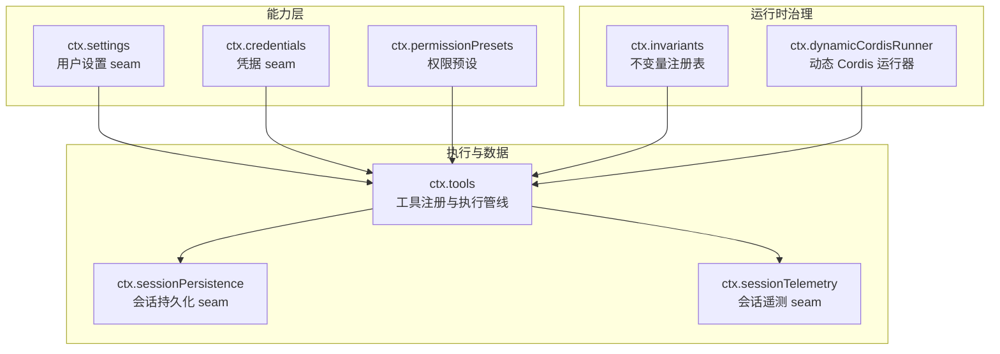

图表来源
- [capability-seams.md:493-568](file://docs/capability-seams.md#L493-L568)
- [capability-seams.zh.md:495-569](file://docs/capability-seams.zh.md#L495-L569)

章节来源
- [capability-seams.md:493-568](file://docs/capability-seams.md#L493-L568)
- [capability-seams.zh.md:495-569](file://docs/capability-seams.zh.md#L495-L569)

## 核心组件
- 设置 seam（ctx.settings）：提供命名空间化的分层配置（schema 默认值 → 组合 base → 用户层），支持 watch、update/replace/mutate、乐观并发 revision 校验、只读提供者与文档路径元信息。
- 凭据 seam（ctx.credentials）：区分“引用”（环境变量名）与“记录”（插件域键），每次操作按需解析最新值；记录提供序列化读写与变更事件。
- 权限预设（ctx.permissionPresets）：将沙箱模式与审批策略打包为预设，一次切换写入单一事件，贯通两个底层选项。
- 会话持久化（ctx.sessionPersistence）：JSONL 后端将 SessionEvent 词汇持久化为每会话一份产物，具备压缩、损坏恢复与截断处理。
- 会话遥测（ctx.sessionTelemetry）：对接 OTLP 日志导出，支持 FULL/FEEDBACK_ONLY/DISABLED 三种模式，带关闭超时与批处理参数校验。
- 不变量（ctx.invariants）：包级运行时约束注册表，支持全局开关与包名白/黑名单过滤，失败抛出 INVARIANT 错误。
- 动态 Cordis 运行器（ctx.dynamicCordisRunner）：在宿主沙箱中运行动态插件，限制 ctx 访问面，拒绝返回 Context 泄漏。

章节来源
- [settings/index.ts:1-147](file://packages/settings/settings/src/index.ts#L1-L147)
- [credentials/index.ts:1-170](file://packages/credentials/credentials/src/index.ts#L1-L170)
- [permission-presets/index.ts:210-250](file://packages/interaction/permission-presets/src/index.ts#L210-L250)
- [session-persistence-jsonl/index.ts:481-518](file://packages/session/session-persistence-jsonl/src/index.ts#L481-L518)
- [session-telemetry-otel/index.ts:43-125](file://packages/session/session-telemetry-otel/src/index.ts#L43-L125)
- [invariants/index.ts:14-66](file://packages/runtime-diagnostics/invariants/src/index.ts#L14-L66)
- [cordis-client-runner/guard.ts:55-83](file://packages/extensions/cordis-client-runner/src/client/guard.ts#L55-L83)

## 架构总览
运行时能力切换的关键在于“以 seam 为边界的可替换实现 + 以 settings/credentials 为驱动的配置/凭据分层 + 以 session 事件为载体的状态传播 + 以 invariants/telemetry 为支撑的诊断与观测”。

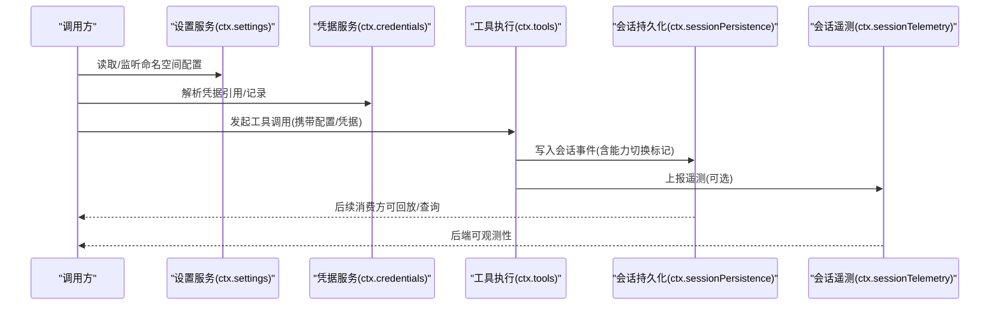

图表来源
- [settings/index.ts:540-691](file://packages/settings/settings/src/index.ts#L540-L691)
- [credentials/index.ts:170-250](file://packages/credentials/credentials/src/index.ts#L170-L250)
- [session-persistence-jsonl/index.ts:481-518](file://packages/session/session-persistence-jsonl/src/index.ts#L481-L518)
- [session-telemetry-otel/index.ts:147-253](file://packages/session/session-telemetry-otel/src/index.ts#L147-L253)

## 详细组件分析

### 设置 seam：分层配置与热更新
- 分层模型：schema 默认值 → 组合 base → 用户层，三者合并后冻结为最终值。
- 写路径：update/replace/mutate 均会 JSON 形状校验、串行队列、revision 乐观锁、持久化后提交并通知观察者。
- 只读与文档：provider 可声明 documentPath，UI 用于打开本地编辑；writable=false 时禁止进程内写入。
- 安装片段：installSection 可将外部来源作为 base，并在卸载时回退。

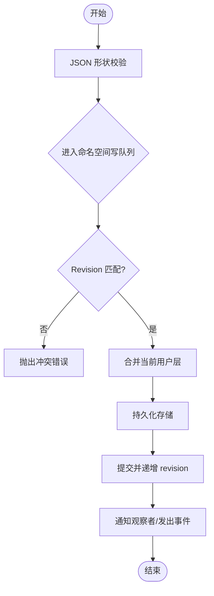

图表来源
- [settings/index.ts:231-295](file://packages/settings/settings/src/index.ts#L231-L295)
- [settings/index.ts:540-691](file://packages/settings/settings/src/index.ts#L540-L691)
- [settings/index.ts:693-727](file://packages/settings/settings/src/index.ts#L693-L727)

章节来源
- [settings/index.ts:1-147](file://packages/settings/settings/src/index.ts#L1-L147)
- [settings/index.ts:540-691](file://packages/settings/settings/src/index.ts#L540-L691)
- [settings/index.ts:693-727](file://packages/settings/settings/src/index.ts#L693-L727)

### 凭据 seam：引用与记录的双通道
- 引用（CredentialRef）：指向环境变量名，每次操作重新解析，确保旋转后的凭据立即生效。
- 记录（CredentialKey）：插件域内的键空间，提供序列化 read/modifyRecord/delete/list/describe。
- 事件：reference-updated/record-updated 广播变更，监听器失败被包含且不污染主流程。

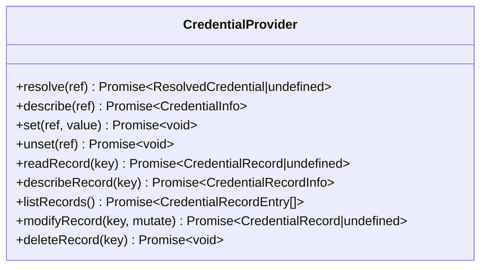

图表来源
- [credentials/index.ts:170-250](file://packages/credentials/credentials/src/index.ts#L170-L250)
- [credentials/index.ts:258-306](file://packages/credentials/credentials/src/index.ts#L258-L306)

章节来源
- [credentials/index.ts:1-170](file://packages/credentials/credentials/src/index.ts#L1-L170)
- [credentials/index.ts:170-250](file://packages/credentials/credentials/src/index.ts#L170-L250)
- [credentials/index.ts:258-306](file://packages/credentials/credentials/src/index.ts#L258-L306)

### 权限预设：一键切换沙箱模式与审批策略
- 预设表将“沙箱模式 + 审批策略”打包，一次切换写入一个 permission/preset 事件，内部再拆分为两个底层选项事件。
- 通过 session projections 暴露 UI 视图，并在会话创建时钉住初始权限。

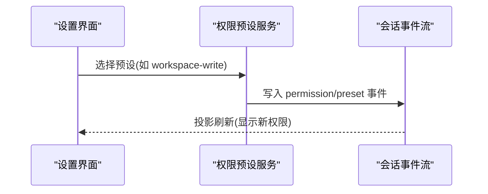

图表来源
- [permission-presets/index.ts:210-250](file://packages/interaction/permission-presets/src/index.ts#L210-L250)
- [capability-seams.zh.md:547-549](file://docs/capability-seams.zh.md#L547-L549)

章节来源
- [permission-presets/index.ts:210-250](file://packages/interaction/permission-presets/src/index.ts#L210-L250)
- [capability-seams.zh.md:547-549](file://docs/capability-seams.zh.md#L547-L549)

### 会话持久化：事件溯源与损坏恢复
- JSONL 后端将 SessionEvent 序列化为每会话文件，支持 zstd 压缩前缀与扫描恢复。
- 遇到损坏或截断，解码器分类错误并保留已解析部分，保证冷启动可恢复。

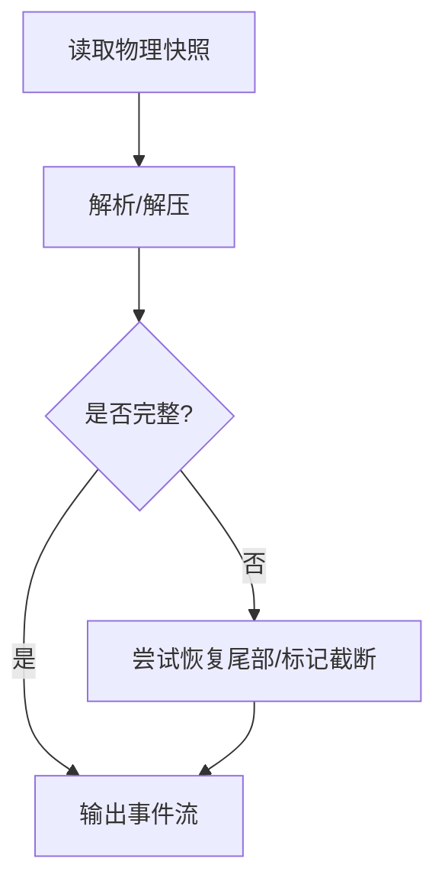

图表来源
- [session-persistence-jsonl/index.ts:481-518](file://packages/session/session-persistence-jsonl/src/index.ts#L481-L518)

章节来源
- [session-persistence-jsonl/index.ts:481-518](file://packages/session/session-persistence-jsonl/src/index.ts#L481-L518)

### 会话遥测：可插拔后端与关闭保护
- 支持 FULL/FEEDBACK_ONLY/DISABLED 三种模式，DISABLED 不构造 SDK 状态。
- 导出链路基于 OTLP 日志，批处理器与导出器配置透传；关闭过程有超时保护，避免阻塞。

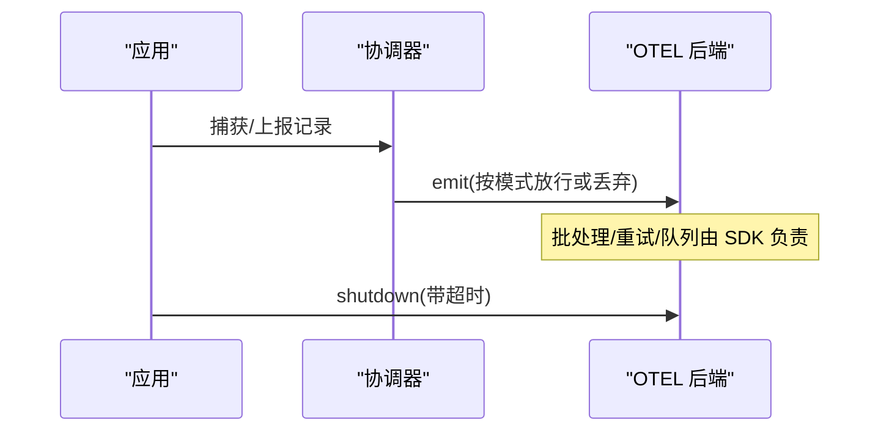

图表来源
- [session-telemetry-otel/index.ts:43-125](file://packages/session/session-telemetry-otel/src/index.ts#L43-L125)
- [session-telemetry-otel/index.ts:147-253](file://packages/session/session-telemetry-otel/src/index.ts#L147-L253)
- [session-telemetry-otel/index.ts:274-298](file://packages/session/session-telemetry-otel/src/index.ts#L274-L298)

章节来源
- [session-telemetry-otel/index.ts:43-125](file://packages/session/session-telemetry-otel/src/index.ts#L43-L125)
- [session-telemetry-otel/index.ts:147-253](file://packages/session/session-telemetry-otel/src/index.ts#L147-L253)
- [session-telemetry-otel/index.ts:274-298](file://packages/session/session-telemetry-otel/src/index.ts#L274-L298)

### 不变量：包级运行时约束
- 支持全局开关与包名白/黑名单过滤；违规抛出 INVARIANT 错误，便于集中诊断。
- 安装器在子 fiber 中运行，失败会释放资源并清理注册。

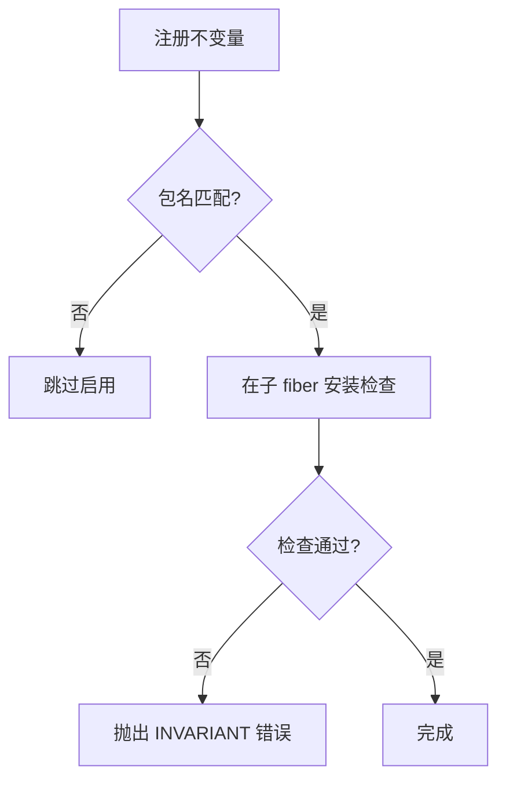

图表来源
- [invariants/index.ts:14-66](file://packages/runtime-diagnostics/invariants/src/index.ts#L14-L66)
- [invariants/index.ts:93-197](file://packages/runtime-diagnostics/invariants/src/index.ts#L93-L197)

章节来源
- [invariants/index.ts:14-66](file://packages/runtime-diagnostics/invariants/src/index.ts#L14-L66)
- [invariants/index.ts:93-197](file://packages/runtime-diagnostics/invariants/src/index.ts#L93-L197)

### 动态 Cordis 运行器：安全隔离与白名单
- 动态插件的 ctx 代理仅暴露声明注入的服务与方法，拒绝返回 Context 泄露。
- 通过守卫包装方法调用，确保效果落在调用者 fiber 上。

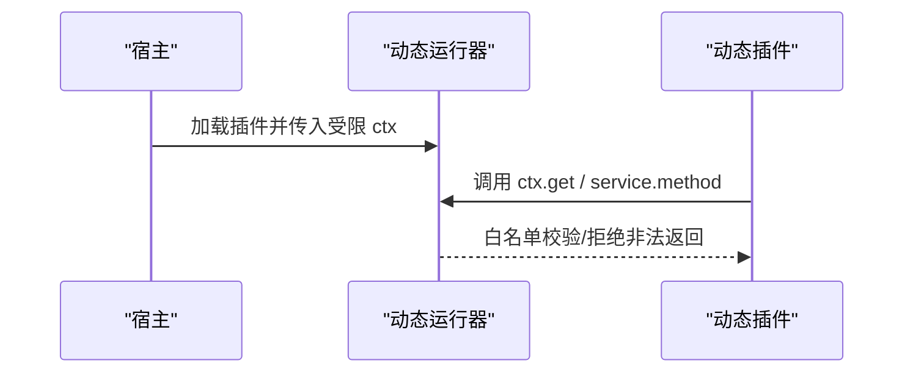

图表来源
- [cordis-client-runner/guard.ts:55-83](file://packages/extensions/cordis-client-runner/src/client/guard.ts#L55-L83)
- [cordis-client-runner/guard.ts:180-204](file://packages/extensions/cordis-client-runner/src/client/guard.ts#L180-L204)

章节来源
- [cordis-client-runner/guard.ts:55-83](file://packages/extensions/cordis-client-runner/src/client/guard.ts#L55-L83)
- [cordis-client-runner/guard.ts:180-204](file://packages/extensions/cordis-client-runner/src/client/guard.ts#L180-L204)

### Agent 预设挂载：作用域内服务选择
- 通过 standingMountFor 与 reflect.store 查找当前 agent 作用域下的服务实例，实现按 agent 的能力装配。

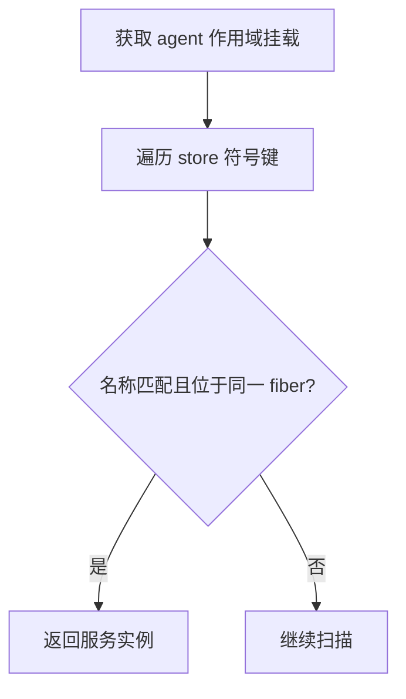

图表来源
- [agent-presets/mount.ts:274-293](file://packages/preset/agent-presets/src/mount.ts#L274-L293)

章节来源
- [agent-presets/mount.ts:274-293](file://packages/preset/agent-presets/src/mount.ts#L274-L293)

## 依赖关系分析
- 能力 seam 与服务消费者：能力 seam 定义于 docs/capability-seams 表格，明确每个 ctx key 的角色、拥有者、实现与直接消费者。
- 典型依赖链：tools 消费 shell/fs/subprocess 等 seam；LLM 适配器消费 credentials/settings；session persistence 被多个模块消费；telemetry 独立输出。

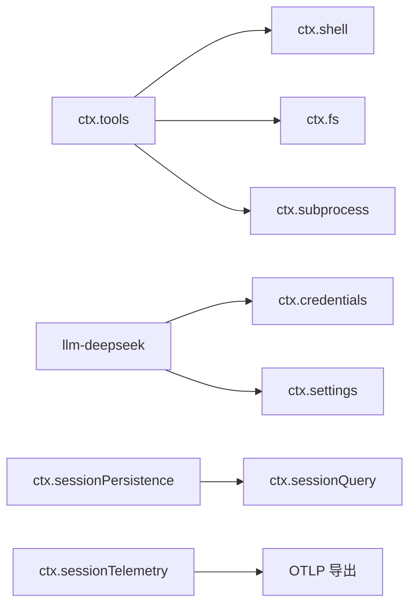

图表来源
- [capability-seams.md:493-568](file://docs/capability-seams.md#L493-L568)
- [capability-seams.zh.md:495-569](file://docs/capability-seams.zh.md#L495-L569)

章节来源
- [capability-seams.md:493-568](file://docs/capability-seams.md#L493-L568)
- [capability-seams.zh.md:495-569](file://docs/capability-seams.zh.md#L495-L569)

## 性能考量
- 设置写路径串行化：按命名空间排队，避免并发覆盖；JSON 形状校验前置，减少无效持久化。
- 观察回调序列化：watcher 回调按提交顺序串行执行，避免竞态。
- 会话持久化：JSONL 增量追加，冷启动通过缓存行+尾部回放降低全量加载成本。
- 遥测批处理：使用批处理器与导出超时，避免阻塞关闭流程。
- 构建期环境裁剪：客户端构建环境仅注入选定公开变量，减少无关依赖。

[本节为通用性能建议，无需特定文件来源]

## 故障排查指南
- 权限预设不一致：通过 invariant 检查已加载与新增预设事件的可解析性，快速定位破坏项。
- 设置冲突：当 expectedRevision 与实际不一致时抛出 SETTINGS_CONFLICT，提示重读并重试。
- 凭据未生效：确认每次操作都重新 resolve 引用；若使用记录，检查 modifyRecord 的互斥语义。
- 会话日志损坏：decodeStoredLog 会分类错误并恢复可用尾部，必要时回退到更早稳定快照。
- 遥测丢失：检查 mode 是否为 DISABLED；确认 exporter.url 有效；关注关闭超时是否触发。
- 动态插件异常：guard 会拒绝返回 Context 或非法属性访问，根据错误信息修正插件声明。

章节来源
- [permission-presets/invariant.ts:21-39](file://packages/interaction/permission-presets/src/invariant.ts#L21-L39)
- [settings/index.ts:149-173](file://packages/settings/settings/src/index.ts#L149-L173)
- [credentials/index.ts:170-250](file://packages/credentials/credentials/src/index.ts#L170-L250)
- [session-persistence-jsonl/index.ts:481-518](file://packages/session/session-persistence-jsonl/src/index.ts#L481-L518)
- [session-telemetry-otel/index.ts:170-195](file://packages/session/session-telemetry-otel/src/index.ts#L170-L195)
- [cordis-client-runner/guard.ts:55-83](file://packages/extensions/cordis-client-runner/src/client/guard.ts#L55-L83)

## 结论
DeepSeek Harness 的运行时能力切换以 seam 为核心抽象，借助 settings/credentials 的分层与引用式解析、session 事件流的幂等传播、invariants 的强约束与 telemetry 的可观测性，实现了高内聚、低耦合、可插拔且安全的切换能力。通过权限预设、Agent 预设挂载与动态 Cordis 运行器的组合，能够在环境切换、A/B 测试与灰度发布等场景中做到细粒度、可控、可回滚的无缝替换。

[本节为总结性内容，无需特定文件来源]

## 附录

### 场景化切换策略与实践

- 环境切换（开发/预发/生产）
  - 通过 settings 分层：composition base 提供默认值，用户层覆盖；结合 clientBuildProcessEnvironment 仅注入构建期公开变量，避免敏感信息泄露。
  - 通过 credentials 引用：在不同环境配置不同的环境变量名或存储后端，运行时按需解析。
  - 通过 permission presets：为不同环境设定更严格的沙箱模式与审批策略。

- A/B 测试
  - 使用 settings 命名空间暴露实验开关，watch 实时生效；结合 tools 的执行管线，对不同分支打点并通过 telemetry 上报。
  - 利用 session 事件流记录实验分组与关键步骤，便于回放与归因。

- 灰度发布
  - 通过 dynamic cordis runner 加载新版本插件，guard 确保安全边界；逐步放量并监控 invariants 与 telemetry。
  - 使用 permission presets 收紧沙箱模式，降低风险面；必要时回滚至旧版本插件或恢复预设。

章节来源
- [client-build-environment.ts:208-224](file://scripts/client-build-environment.ts#L208-L224)
- [settings/index.ts:540-691](file://packages/settings/settings/src/index.ts#L540-L691)
- [credentials/index.ts:170-250](file://packages/credentials/credentials/src/index.ts#L170-L250)
- [permission-presets/index.ts:210-250](file://packages/interaction/permission-presets/src/index.ts#L210-L250)
- [cordis-client-runner/guard.ts:55-83](file://packages/extensions/cordis-client-runner/src/client/guard.ts#L55-L83)

### 监控指标、日志与回滚机制

- 监控指标
  - 设置变更：settings/document-updated 事件携带命名空间与 revision，可用于统计变更频率与回滚次数。
  - 凭据变更：credentials/reference-updated/record-updated 事件，追踪密钥轮换与授权流程。
  - 权限预设：permission/preset 事件，反映沙箱模式与审批策略变化。
  - 遥测：FULL/FEEDBACK_ONLY 模式下上报会话记录，DISABLED 模式仅本地记录。

- 日志记录
  - 设置 provider 在无效用户层时记录警告并保留最后有效值。
  - 凭据监听器失败会被包含并记录，不影响主流程。
  - 会话持久化在解析失败时分类错误并恢复可用尾部。

- 回滚机制
  - 设置层：replace({}) 可重置为用户层为空，重新继承 base 与 schema 默认值。
  - 权限预设：切换回默认预设即可恢复原策略。
  - 动态插件：卸载或禁用新版本插件，恢复旧实现；guard 阻止非法上下文泄露。

章节来源
- [settings/index.ts:693-727](file://packages/settings/settings/src/index.ts#L693-L727)
- [credentials/index.ts:258-306](file://packages/credentials/credentials/src/index.ts#L258-L306)
- [permission-presets/index.ts:210-250](file://packages/interaction/permission-presets/src/index.ts#L210-L250)
- [session-persistence-jsonl/index.ts:481-518](file://packages/session/session-persistence-jsonl/src/index.ts#L481-L518)
- [session-telemetry-otel/index.ts:147-253](file://packages/session/session-telemetry-otel/src/index.ts#L147-L253)