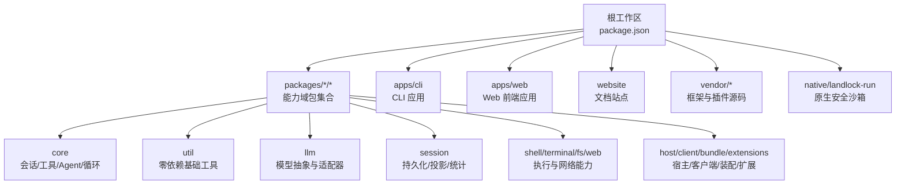
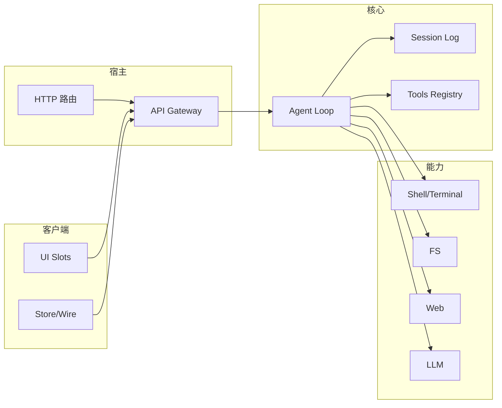
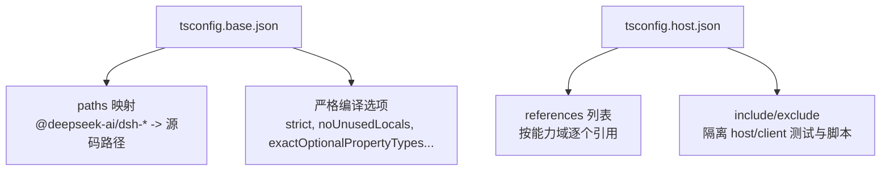
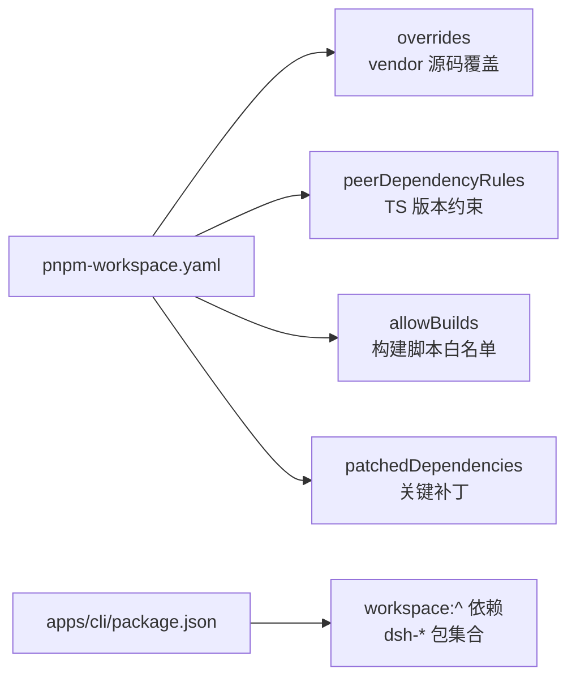
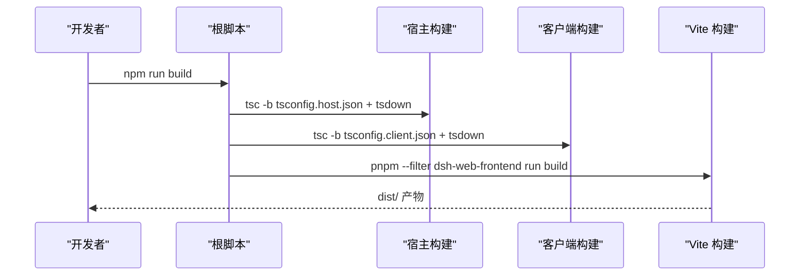
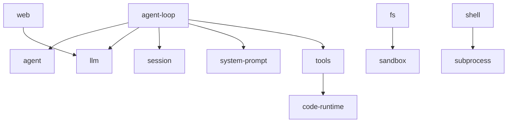

# 模块组织

<cite>
**本文引用的文件**
- [package.json](file://package.json)
- [pnpm-workspace.yaml](file://pnpm-workspace.yaml)
- [tsconfig.base.json](file://tsconfig.base.json)
- [tsconfig.host.json](file://tsconfig.host.json)
- [packages/README.md](file://packages/README.md)
- [packages/core/README.md](file://packages/core/README.md)
- [packages/util/README.md](file://packages/util/README.md)
- [apps/cli/package.json](file://apps/cli/package.json)
- [apps/web/package.json](file://apps/web/package.json)
- [docs/module-graph.md](file://docs/module-graph.md)
</cite>

## 目录
1. [简介](#简介)
2. [项目结构](#项目结构)
3. [核心组件](#核心组件)
4. [架构总览](#架构总览)
5. [详细组件分析](#详细组件分析)
6. [依赖关系分析](#依赖关系分析)
7. [性能与构建优化](#性能与构建优化)
8. [故障排查指南](#故障排查指南)
9. [结论](#结论)
10. [附录：开发环境配置与导航](#附录开发环境配置与导航)

## 简介
本文件面向开发者，系统化说明 DeepSeek Harness 的模块组织方式、包职责划分、TypeScript 工程配置（路径映射、编译选项、类型检查）、包间依赖管理、代码组织与命名规范、构建系统与打包配置，以及多目标构建策略。目标是帮助你在复杂的多包仓库中快速定位模块、理解依赖边界、正确配置本地开发环境并高效参与贡献。

## 项目结构
仓库采用 pnpm workspace 管理，根 package.json 声明工作区范围，将 vendor、packages、apps、website、native/landlock-run 等纳入统一依赖图；apps 提供 CLI 与 Web 前端入口；packages 按能力域分组（core、util、llm、session、shell、fs、web、host、client、bundle、extensions 等）；docs 包含子系统文档与模块图。

**图表来源**
- [package.json:11-18](file://package.json#L11-L18)
- [pnpm-workspace.yaml:1-17](file://pnpm-workspace.yaml#L1-L17)

**章节来源**
- [package.json:11-18](file://package.json#L11-L18)
- [pnpm-workspace.yaml:1-17](file://pnpm-workspace.yaml#L1-L17)

## 核心组件
- 核心骨架（core）：提供会话日志、系统提示组装、工具注册表、Agent 句柄与默认驱动循环，是产品 API 脊柱。
- 共享工具（util）：原子写入、品牌化 ID、双端队列、JSON 值校验、超时、时区、输出保留等零依赖基础库。
- 应用入口（apps）：CLI 负责 profile 启动、插件管理与浏览器 UI 别名；Web 前端基于 client-web 壳库通过 Vite 构建。
- 宿主与客户端（host/client）：Web-GUI 的两端，分别实现 API 网关/HTTP 路由与服务端侧能力，以及浏览器侧 shell/wire/slots/ui-* 插件。
- 装配层（bundle）：可安装的 dsh --profile 补丁层，组合 core 与各能力包形成可发布的产品形态。
- 扩展（extensions）：运行时自修改能力，支持插件/服务动态挂载与卸载。

**章节来源**
- [packages/README.md:24-79](file://packages/README.md#L24-L79)
- [packages/core/README.md:10-36](file://packages/core/README.md#L10-L36)
- [packages/util/README.md:10-42](file://packages/util/README.md#L10-L42)
- [apps/cli/package.json:1-16](file://apps/cli/package.json#L1-L16)
- [apps/web/package.json:1-23](file://apps/web/package.json#L1-L23)

## 架构总览
DeepSeek Harness 以“能力域 + 角色分层”的方式组织：
- 能力域：每个 packages/<group>/<pkg> 聚焦一个能力（如 shell、fs、web、session）。
- 角色分层：Service Definition / Service Provider / Consumer 分离，插件依赖契约而非具体实现，便于替换与演进。
- 宿主/客户端解耦：host 与 client 通过协议交互，避免跨边界耦合。
- 装配层：bundle 将 core 与各能力按需拼装为不同 profile（headless、web-app、sdk 等）。

[此图为概念性架构图，不直接映射到具体源文件，故无图表来源]

## 详细组件分析

### TypeScript 工程配置与路径映射
- 基础配置 tsconfig.base.json：
  - 目标 ES2024、模块 esnext、解析器 bundler。
  - 开启 declaration/sourceMap/composite/incremental，严格模式与多项严格检查。
  - 使用 paths 将大量内部包名映射到源码路径，使 IDE 与 TS 能直接解析到源码，而非仅依赖已编译产物。
  - 注释强调：不要在此添加 include/files，以免污染所有继承项目的匹配范围。
- 宿主聚合 tsconfig.host.json：
  - 继承 base，noEmit 用于纯类型检查。
  - 显式 references 列出所有被类型检查的包，确保跨包类型一致性。
  - 通过 include/exclude 控制测试与脚本的归属，避免 host/client 两侧互相看到对方上下文。
- 客户端聚合 tsconfig.client.json（由根脚本引用）：
  - 与 host 并列的另一类型检查单元，保证两端契约一致。

**图表来源**
- [tsconfig.base.json:5-26](file://tsconfig.base.json#L5-L26)
- [tsconfig.base.json:30-455](file://tsconfig.base.json#L30-L455)
- [tsconfig.host.json:1-12](file://tsconfig.host.json#L1-L12)
- [tsconfig.host.json:10-122](file://tsconfig.host.json#L10-L122)
- [tsconfig.host.json:123-349](file://tsconfig.host.json#L123-L349)

**章节来源**
- [tsconfig.base.json:5-26](file://tsconfig.base.json#L5-L26)
- [tsconfig.base.json:30-455](file://tsconfig.base.json#L30-L455)
- [tsconfig.host.json:1-12](file://tsconfig.host.json#L1-L12)
- [tsconfig.host.json:10-122](file://tsconfig.host.json#L10-L122)
- [tsconfig.host.json:123-349](file://tsconfig.host.json#L123-L349)

### 包之间的依赖管理
- 工作区与版本兼容：
  - pnpm-workspace.yaml 定义工作区范围，linkWorkspacePackages 启用本地链接。
  - overrides 将特定包名指向 vendor 源码，保证本地构建解析到仓库内版本。
  - peerDependencyRules 限制 TypeScript 版本范围，避免类型不一致。
  - allowBuilds 白名单机制严格控制带安装/构建脚本的依赖，提升供应链安全性。
  - patchedDependencies 对关键依赖打补丁（如 node-pty、@yao-pkg/pkg）。
- 内部依赖：
  - apps/cli 通过 workspace:^ 引用大量 dsh-* 包，构成默认产品装配。
  - 包之间遵循“依赖契约（Service Definition）而非具体实现”的原则，保持可插拔。
- 外部依赖：
  - 根 devDependencies 集中管理构建与测试工具（typescript、vitest、vite、oxlint 等）。
  - 通过 pnpm 的 strictDepBuilds 策略，未列入 allowBuilds 的脚本将被拒绝。

**图表来源**
- [pnpm-workspace.yaml:15-83](file://pnpm-workspace.yaml#L15-L83)
- [apps/cli/package.json:30-106](file://apps/cli/package.json#L30-L106)

**章节来源**
- [pnpm-workspace.yaml:15-83](file://pnpm-workspace.yaml#L15-L83)
- [apps/cli/package.json:30-106](file://apps/cli/package.json#L30-L106)

### 代码组织与命名规范
- 包命名：全部以 @deepseek-ai/dsh-* 命名，位于 packages/<group>/<pkg>，每个包属于且仅属于一个组。
- 导出约定：
  - util 组均为库，不注册产品服务或事件，消费方保留业务语义。
  - core 组提供稳定的产品 API 脊柱（会话、工具、Agent、循环），插件与消费者基于其契约扩展。
- 模块边界：
  - 宿主/客户端分离，通过协议交互。
  - 能力域内区分 Service Definition / Provider / Consumer，便于独立演进。
- README 契约：每个包 README 需描述用途、配置、扩展点与模型体验，并在已知限制处明确说明。

**章节来源**
- [packages/README.md:24-79](file://packages/README.md#L24-L79)
- [packages/util/README.md:10-42](file://packages/util/README.md#L10-L42)
- [packages/core/README.md:10-36](file://packages/core/README.md#L10-L36)

### 构建系统与打包配置
- 根脚本：
  - build/build:lib:host/client：分别编译宿主与客户端库，并使用 tsdown 生成产物。
  - build:web：调用 apps/web 的 vite 构建。
  - typecheck/lint/test：统一的类型检查、静态检查与测试流程。
- 多目标构建：
  - bundle 提供多个 profile（headless、web-app、sdk 等），通过组合 core 与能力包形成不同发行形态。
- 资源处理：
  - apps/web 使用 Vite 进行前端构建，支持 React、HMR 与预览打包。
  - 通过 tsconfig 的 composite/incremental 与 references 提升增量编译效率。
- 优化策略：
  - 严格类型检查与路径映射减少运行时错误。
  - 工作区 link 与 vendor 覆盖确保本地构建稳定。
  - 白名单构建脚本与补丁机制保障供应链安全与兼容性。

**图表来源**
- [package.json:19-26](file://package.json#L19-L26)
- [apps/web/package.json:24-30](file://apps/web/package.json#L24-L30)

**章节来源**
- [package.json:19-26](file://package.json#L19-L26)
- [apps/web/package.json:24-30](file://apps/web/package.json#L24-L30)

## 依赖关系分析
- 共享实例依赖图：docs/module-graph.md 展示了各包之间的 peer 依赖关系，按 group 分组并以 mermaid flowchart 呈现。
- 典型依赖链：
  - agent-loop 依赖 agent、llm、session、system-prompt、tools 等核心能力。
  - tools 依赖 agent、code-runtime、llm、session、system-prompt、user-approval 等。
  - fs/shell/web 等能力通过 sandbox、settings、subprocess 等支撑包协作。
- 宿主/客户端契约：
  - host 暴露 API gateway 与 HTTP 路由，client 通过 store/wire 与之通信。
  - 类型契约由 typert 协议与 session 格式维护，确保两端一致。

**图表来源**
- [docs/module-graph.md:365-800](file://docs/module-graph.md#L365-L800)

**章节来源**
- [docs/module-graph.md:365-800](file://docs/module-graph.md#L365-L800)

## 性能与构建优化
- 增量编译：composite 与 incremental 配合 references 提升大型仓库编译速度。
- 严格类型：启用多项严格检查，减少运行时异常与调试成本。
- 路径映射：paths 指向源码，IDE 与 TS 可直接解析，提高开发体验与准确性。
- 依赖治理：allowBuilds 与 patchedDependencies 控制第三方行为，降低不稳定因素。
- 构建并行：workspaces 与 scripts 编排允许并行任务（如 host/client 分别构建）。

[本节为通用指导，不直接分析具体文件，故无章节来源]

## 故障排查指南
- 类型检查失败：
  - 确认 tsconfig.host.json/tsconfig.client.json 的 include/exclude 是否正确隔离 host/client 测试与脚本。
  - 检查 paths 映射是否与实际包目录一致，必要时重新生成路径映射。
- 依赖解析异常：
  - 检查 pnpm-workspace.yaml 的 overrides 与 linkWorkspacePackages 是否生效。
  - 若第三方包引入构建脚本报错，确认是否在 allowBuilds 白名单中。
- 构建产物缺失：
  - 确认先执行宿主与客户端构建，再执行 web 构建。
  - 检查 apps/web 的 vite 配置与依赖是否完整。

**章节来源**
- [tsconfig.host.json:10-122](file://tsconfig.host.json#L10-L122)
- [pnpm-workspace.yaml:15-83](file://pnpm-workspace.yaml#L15-L83)
- [package.json:19-26](file://package.json#L19-L26)

## 结论
DeepSeek Harness 通过清晰的能力域分组、严格的 TypeScript 工程配置与工作区依赖治理，实现了高内聚、低耦合的可插拔架构。core 提供稳定 API 脊柱，util 提供零依赖基础能力，apps 提供应用入口，host/client 解耦前后端，bundle 灵活装配不同发行形态。遵循本文的组织与配置规范，开发者可以高效地在复杂仓库中定位模块、理解依赖边界、正确配置本地环境并参与贡献。

[本节为总结性内容，不直接分析具体文件，故无章节来源]

## 附录：开发环境配置与导航
- 初始化与安装：
  - 使用 pnpm 安装依赖，确保 workspace 链接生效。
  - 如需本地 vendor 覆盖，检查 overrides 配置。
- 常用命令：
  - 构建：npm run build（宿主+客户端+Web）。
  - 类型检查：npm run typecheck。
  - 测试：npm run test（单元测试）、npm run test:e2e（端到端）。
  - 文档站点：npm run docs:dev/docs:build。
- 模块导航：
  - 从 packages/README.md 找到所属组，再进入对应组的 README 获取包清单与说明。
  - 使用 docs/module-graph.md 查看共享实例依赖关系。
  - 在 IDE 中利用 tsconfig.base.json 的 paths 映射获得准确的跳转与补全。

**章节来源**
- [packages/README.md:24-79](file://packages/README.md#L24-L79)
- [docs/module-graph.md:1-800](file://docs/module-graph.md#L1-L800)
- [package.json:19-161](file://package.json#L19-L161)