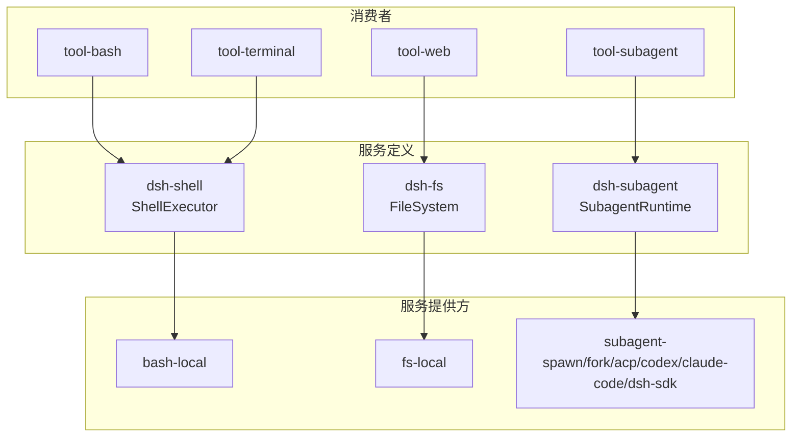
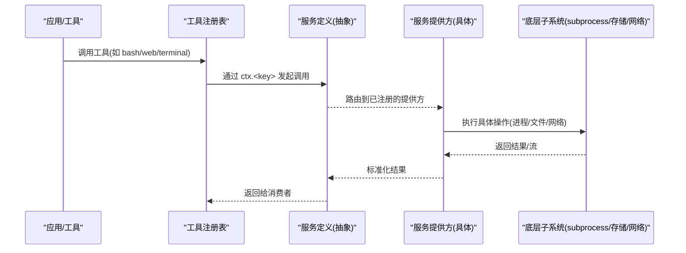
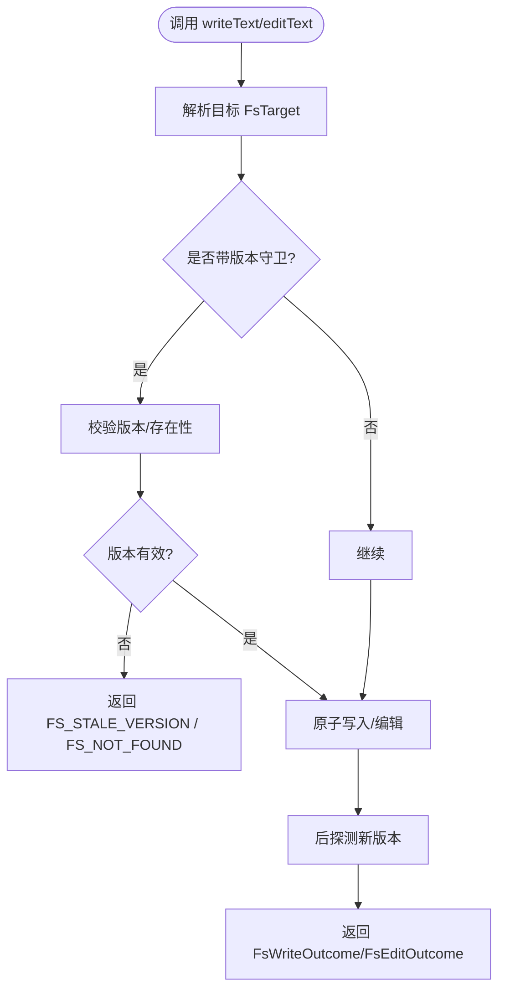
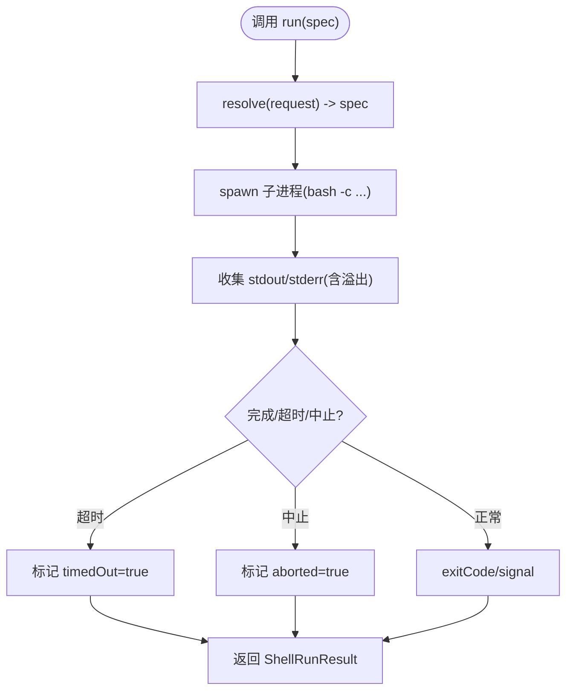
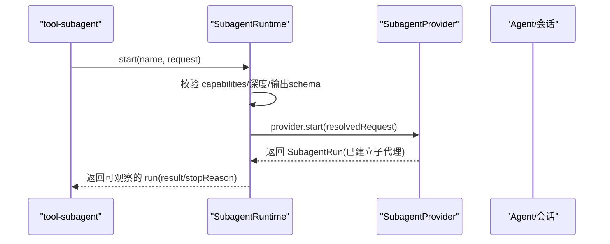
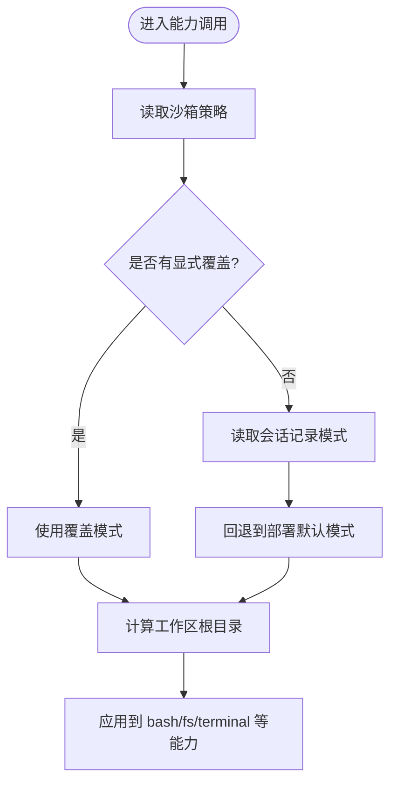
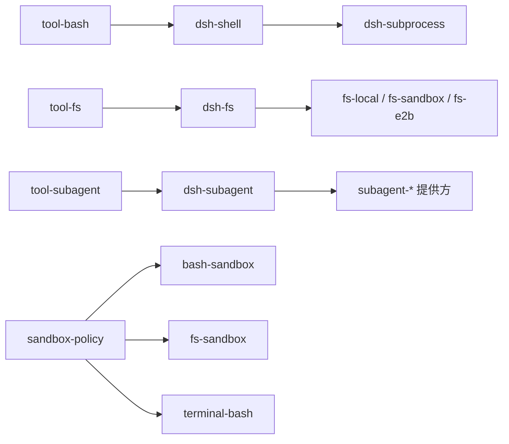

# 能力接缝

<cite>
**本文引用的文件**
- [docs/capability-seams.md](file://docs/capability-seams.md)
- [docs/capability-seams.zh.md](file://docs/capability-seams.zh.md)
- [packages/shell/shell/src/index.ts](file://packages/shell/shell/src/index.ts)
- [packages/shell/bash-local/src/index.ts](file://packages/shell/bash-local/src/index.ts)
- [packages/fs/fs/src/index.ts](file://packages/fs/fs/src/index.ts)
- [packages/fs/fs-local/src/index.ts](file://packages/fs/fs-local/src/index.ts)
- [packages/subagent/subagent/src/index.ts](file://packages/subagent/subagent/src/index.ts)
- [packages/sandbox/sandbox-policy/src/index.ts](file://packages/sandbox/sandbox-policy/src/index.ts)
- [packages/sandbox/sandbox-local/src/index.ts](file://packages/sandbox/sandbox-local/src/index.ts)
- [docs/user/develop/practice/index.md](file://docs/user/develop/practice/index.md)
- [docs/user/develop/practice/index.zh.md](file://docs/user/develop/practice/index.zh.md)
- [.agents/notes/implemented/architecture/2026-06-13-capability-seams.md](file://.agents/notes/implemented/architecture/2026-06-13-capability-seams.md)
- [packages/subagent/subagent/tests/service.spec.ts](file://packages/subagent/subagent/tests/service.spec.ts)
</cite>

## 目录
1. [简介](#简介)
2. [项目结构](#项目结构)
3. [核心组件](#核心组件)
4. [架构总览](#架构总览)
5. [详细组件分析](#详细组件分析)
6. [依赖分析](#依赖分析)
7. [性能考虑](#性能考虑)
8. [故障排查指南](#故障排查指南)
9. [结论](#结论)
10. [附录](#附录)

## 简介
本文件系统化阐述 Harness 的“能力接缝”设计：以可替换能力为核心的三角色模型（服务定义、服务提供方、消费者），并围绕文件系统、Shell 执行、子代理等关键能力，说明如何通过配置与组合在本地执行与远程沙箱之间无缝切换。同时给出版本兼容性与迁移策略、自定义能力开发指南与设计模式最佳实践。

## 项目结构
Harness 将每个可替换能力拆分为三个职责清晰的包：
- 服务定义：声明 ctx 键、抽象基类或注册表、以及领域类型（如 ShellExecutor、FileSystem、SubagentRuntime）。
- 服务提供方：实现具体执行路径（如 bash-local、fs-local、subagent-* 系列）。
- 消费者：面向模型的工具或上层插件，仅依赖服务定义，不感知提供方细节。

下图展示了能力接缝的整体关系与典型消费路径。

图表来源
- [packages/shell/shell/src/index.ts:1-104](file://packages/shell/shell/src/index.ts#L1-L104)
- [packages/fs/fs/src/index.ts:1-253](file://packages/fs/fs/src/index.ts#L1-L253)
- [packages/subagent/subagent/src/index.ts:1-516](file://packages/subagent/subagent/src/index.ts#L1-L516)

章节来源
- [docs/capability-seams.md:1-500](file://docs/capability-seams.md#L1-L500)
- [docs/capability-seams.zh.md:1-502](file://docs/capability-seams.zh.md#L1-L502)

## 核心组件
- 服务定义（Service Definition）
  - 通过 Cordis Service 扩展 Context 键（如 ctx.shell、ctx.fs、ctx.subagents）。
  - 暴露抽象方法或注册表，集中领域类型（请求/结果/进程句柄等）。
  - 示例：ShellExecutor、FileSystem、SubagentRuntime。
- 服务提供方（Service Provider）
  - 继承抽象基类或实现接口，注册到对应 ctx 键。
  - 示例：LocalBashExecutor、LocalFileSystem、各类 subagent 提供方。
- 消费者（Consumer）
  - 通过 inject 获取服务键，调用稳定 API；工具层负责向模型暴露稳定 schema。
  - 示例：tool-bash、tool-terminal、tool-web、tool-subagent。

章节来源
- [packages/shell/shell/src/index.ts:40-104](file://packages/shell/shell/src/index.ts#L40-L104)
- [packages/fs/fs/src/index.ts:44-253](file://packages/fs/fs/src/index.ts#L44-L253)
- [packages/subagent/subagent/src/index.ts:129-168](file://packages/subagent/subagent/src/index.ts#L129-L168)

## 架构总览
下图展示“能力接缝”在运行时的装配方式：消费者注入服务键，运行时由 Cordis 将具体提供方挂载到同一 ctx 键上，从而实现按需切换。

图表来源
- [packages/shell/shell/src/index.ts:65-104](file://packages/shell/shell/src/index.ts#L65-L104)
- [packages/fs/fs/src/index.ts:86-253](file://packages/fs/fs/src/index.ts#L86-L253)
- [packages/subagent/subagent/src/index.ts:378-410](file://packages/subagent/subagent/src/index.ts#L378-L410)

## 详细组件分析

### 文件系统能力接缝（ctx.fs）
- 角色分工
  - 服务定义：FileSystem 抽象类，统一目标标识 FsTarget、原子写入、编辑、读取、列举、包含性检查等。
  - 服务提供方：LocalFileSystem 提供主机文件系统实现；另有 fs-sandbox、fs-e2b 等提供方用于受限环境。
  - 消费者：tool-fs 等工具通过 ctx.fs 进行读写编辑，不关心后端差异。
- 关键设计要点
  - 目标稳定性：resolve 返回稳定 targetKey，保证跨别名/符号链接的一致性。
  - 原子更新：writeText/editText 使用原子发布与版本守卫，避免竞态。
  - 安全边界：sandboxMode 暴露默认限制；fs/* 事件门禁支持观测策略。
- 流程示意

图表来源
- [packages/fs/fs/src/index.ts:166-253](file://packages/fs/fs/src/index.ts#L166-L253)
- [packages/fs/fs-local/src/index.ts:166-255](file://packages/fs/fs-local/src/index.ts#L166-L255)

章节来源
- [packages/fs/fs/src/index.ts:1-253](file://packages/fs/fs/src/index.ts#L1-L253)
- [packages/fs/fs-local/src/index.ts:1-266](file://packages/fs/fs-local/src/index.ts#L1-L266)

### Shell 执行能力接缝（ctx.shell）
- 角色分工
  - 服务定义：ShellExecutor 抽象类，定义 resolve/run/start 语义，明确前台/后台进程、输出收集、超时与终止行为。
  - 服务提供方：LocalBashExecutor 基于 ctx.subprocess 执行 bash；bash-sandbox/pwsh-local 等提供方提供受限或不同 shell。
  - 消费者：tool-bash、tool-pwsh、hooks 桥接等通过 ctx.shell 调用，不感知底层进程管理。
- 关键设计要点
  - 请求规范化：resolve 填充工作目录、超时、输出上限等，run/start 接收已规范化的 Spec。
  - 输出与溢出：stdout/stderr 有内存上限与 spill 文件策略，避免无界缓冲。
  - 生命周期：后台进程随 composition 销毁而清理；通过 subprocess 服务统一管理进程树与 kill 升级。
- 流程图（前台执行）

图表来源
- [packages/shell/shell/src/index.ts:65-104](file://packages/shell/shell/src/index.ts#L65-L104)
- [packages/shell/bash-local/src/index.ts:146-240](file://packages/shell/bash-local/src/index.ts#L146-L240)

章节来源
- [packages/shell/shell/src/index.ts:1-104](file://packages/shell/shell/src/index.ts#L1-L104)
- [packages/shell/bash-local/src/index.ts:1-334](file://packages/shell/bash-local/src/index.ts#L1-L334)

### 子代理能力接缝（ctx.subagents）
- 角色分工
  - 服务定义：SubagentRuntime 提供命名提供方注册表、一次性启动、可继续子代理、后续消息投递、中断与报告等。
  - 服务提供方：spawn-in-process、fork-in-process、acp、codex、claude-code、dsh-sdk 等实现不同传输与宿主。
  - 消费者：tool-subagent、tool-subagent-control、tool-ralph 等通过名称选择提供方。
- 关键设计要点
  - 多提供方并存：按名称注册与查找，start(name, request) 路由到指定提供方。
  - 能力协商：根据请求字段校验提供方 capabilities（如 outputSchema、depthLimit、toolFilter、persona）。
  - 可继续子代理：独立的生命周期管理器，支持持久化、冷恢复、FIFO 入队与中断。
- 序列图（启动子代理）

图表来源
- [packages/subagent/subagent/src/index.ts:420-442](file://packages/subagent/subagent/src/index.ts#L420-L442)
- [packages/subagent/subagent/src/index.ts:496-512](file://packages/subagent/subagent/src/index.ts#L496-L512)

章节来源
- [packages/subagent/subagent/src/index.ts:1-516](file://packages/subagent/subagent/src/index.ts#L1-L516)
- [packages/subagent/subagent/tests/service.spec.ts:44-107](file://packages/subagent/subagent/tests/service.spec.ts#L44-L107)

### 沙箱策略与执行世界（ctx.sandboxPolicy）
- 作用
  - 统一决策每次调用的沙箱模式与工作区根目录，确保 bash 与 fs 等能力不会限制到不同根。
  - 为沙箱提供方（bash-sandbox、fs-sandbox、terminal-bash）提供一致的约束依据。
- 决策优先级
  - 显式批准的模式 > 会话最近记录的 sandbox/mode > 部署默认模式。
- 图示

图表来源
- [packages/sandbox/sandbox-policy/src/index.ts:112-154](file://packages/sandbox/sandbox-policy/src/index.ts#L112-L154)

章节来源
- [packages/sandbox/sandbox-policy/src/index.ts:112-154](file://packages/sandbox/sandbox-policy/src/index.ts#L112-L154)
- [packages/sandbox/sandbox-local/src/index.ts:276-303](file://packages/sandbox/sandbox-local/src/index.ts#L276-L303)

## 依赖分析
- 耦合与内聚
  - 消费者仅依赖服务定义，提供方仅依赖服务定义，三方解耦良好。
  - 沙箱策略作为核心服务被多个能力共同读取，形成低耦合的共享约束中心。
- 直接/间接依赖
  - tool-bash → dsh-shell → dsh-subprocess → 操作系统进程。
  - tool-fs → dsh-fs → 文件系统后端（本地/沙箱/E2B）。
  - tool-subagent → dsh-subagent → 各 subagent 提供方。
- 循环依赖
  - 通过 Cordis 服务注入与事件机制避免循环；服务定义不包含具体实现。
- 外部集成点
  - 子进程、终端 PTY、网络访问、存储后端等由各自 seam 封装。

图表来源
- [packages/shell/shell/src/index.ts:65-104](file://packages/shell/shell/src/index.ts#L65-L104)
- [packages/fs/fs/src/index.ts:86-253](file://packages/fs/fs/src/index.ts#L86-L253)
- [packages/subagent/subagent/src/index.ts:378-410](file://packages/subagent/subagent/src/index.ts#L378-L410)
- [packages/sandbox/sandbox-policy/src/index.ts:112-154](file://packages/sandbox/sandbox-policy/src/index.ts#L112-L154)

章节来源
- [docs/capability-seams.md:209-435](file://docs/capability-seams.md#L209-L435)
- [docs/capability-seams.zh.md:211-437](file://docs/capability-seams.zh.md#L211-L437)

## 性能考虑
- 输出与溢出控制
  - Shell 执行对 stdout/stderr 设置内存上限与 spill 文件，避免大输出导致 OOM。
- 原子写与并发
  - 文件系统按 targetKey 串行化写操作，避免竞态并保证版本一致性。
- 查询与投影
  - 子代理列表通过 session 存储与可选持久化缓存分层读取，避免全量日志回放。
- 超时与取消
  - 前台命令使用 deadline 合并超时与上游取消；后台命令通过 kill 与进程树管理。

[本节为通用性能建议，不直接分析具体文件]

## 故障排查指南
- 提供方未注册或重复注册
  - 现象：启动子代理时报 NO_PROVIDER；重复注册报 DUPLICATE_PROVIDER。
  - 处理：检查 cordis.yml 是否正确加载提供方；确认提供方 name 唯一。
- 能力不支持
  - 现象：UNSUPPORTED_CAPABILITY（如缺少 outputSchema/depthLimit/toolFilter/persona）。
  - 处理：调整请求字段或更换具备该能力的提供方。
- 沙箱策略冲突
  - 现象：bash 与 fs 限制到不同根导致权限错误。
  - 处理：通过 sandbox-policy 统一模式与工作区根；避免混用不同根。
- 文件系统版本冲突
  - 现象：FS_STALE_VERSION/FS_NOT_OBSERVED。
  - 处理：先读取再写；或使用 createIfAbsent 时确保文件不存在。

章节来源
- [packages/subagent/subagent/tests/service.spec.ts:71-107](file://packages/subagent/subagent/tests/service.spec.ts#L71-L107)
- [packages/fs/fs-local/src/index.ts:166-255](file://packages/fs/fs-local/src/index.ts#L166-L255)
- [packages/sandbox/sandbox-policy/src/index.ts:126-154](file://packages/sandbox/sandbox-policy/src/index.ts#L126-L154)

## 结论
Harness 的能力接缝通过“服务定义—服务提供方—消费者”的三角色模型，实现了高内聚、低耦合的可替换能力体系。文件系统、Shell 执行、子代理等核心能力均遵循此模式，并通过沙箱策略与事件门禁保障一致的安全边界。借助 Cordis 的组合机制，可在本地执行与远程沙箱之间无缝切换，且保持模型侧工具契约稳定。

[本节为总结性内容，不直接分析具体文件]

## 附录

### 配置切换：本地执行与远程沙箱的无缝切换
- 通过 cordis.yml 选择不同提供方，例如：
  - 本地执行：加载 bash-local、fs-local。
  - 远程沙箱：加载 bash-sandbox、fs-sandbox、subprocess-e2b 等。
- 切换时，消费者与工具不变，仅变更提供方组合。
- 沙箱策略统一约束工作区根与模式，确保多能力协同一致。

章节来源
- [docs/user/develop/practice/index.zh.md:29-56](file://docs/user/develop/practice/index.zh.md#L29-L56)
- [docs/capability-seams.zh.md:439-499](file://docs/capability-seams.zh.md#L439-L499)

### 版本兼容性与迁移策略
- 服务定义保持稳定：抽象方法与领域类型变更需向后兼容，避免破坏消费者与提供方。
- 渐进式迁移：新增能力字段采用可选字段与默认值；提供方逐步启用新能力。
- 能力协商：子代理通过 capabilities 字段声明支持项，消费者按需请求。
- 事件与投影：通过 session 事件与投影单元维持历史兼容性，冷读阶梯保证查询性能。

章节来源
- [packages/subagent/subagent/src/index.ts:496-512](file://packages/subagent/subagent/src/index.ts#L496-L512)
- [docs/capability-seams.md:437-499](file://docs/capability-seams.md#L437-L499)

### 自定义能力开发完整指南
- 步骤一：编写服务定义
  - 定义抽象服务类与领域类型，扩展 Context 键。
  - 示例参考：ShellExecutor、FileSystem。
- 步骤二：编写服务提供方
  - 继承抽象类或实现接口，注册到 ctx 键。
  - 示例参考：LocalBashExecutor、LocalFileSystem。
- 步骤三：编写消费者
  - 通过 inject 获取服务键，实现工具逻辑。
  - 示例参考：tool-bash、tool-fs、tool-subagent。
- 步骤四：在 cordis.yml 中组合
  - 加载提供方与消费者，完成装配。
- 测试方法
  - 单元测试：验证提供方行为、异常路径与资源清理。
  - 集成测试：通过 Context 插件加载服务，模拟真实调用链。
  - 快照测试：捕获工具输出与交互流程，回归检测。

章节来源
- [docs/user/develop/practice/index.zh.md:58-156](file://docs/user/develop/practice/index.zh.md#L58-L156)
- [packages/subagent/subagent/tests/service.spec.ts:71-107](file://packages/subagent/subagent/tests/service.spec.ts#L71-L107)

### 设计模式与最佳实践
- 三角色分离：服务定义、提供方、消费者分属不同包，降低耦合度。
- 显式默认与规范化：通过 resolve 等方法集中处理默认值与上限，避免隐式分支。
- 能力协商与最小权限：提供方声明能力，消费者按需请求；沙箱策略统一约束。
- 事件驱动与生命周期：通过 Cordis effect 与事件钩子管理资源与清理。
- 不可变数据与版本守卫：文件系统与子代理广泛使用版本/修订号，避免竞态与误写。

章节来源
- [.agents/notes/implemented/architecture/2026-06-13-capability-seams.md:7-34](file://.agents/notes/implemented/architecture/2026-06-13-capability-seams.md#L7-L34)
- [packages/fs/fs/src/index.ts:86-253](file://packages/fs/fs/src/index.ts#L86-L253)
- [packages/subagent/subagent/src/index.ts:378-410](file://packages/subagent/subagent/src/index.ts#L378-L410)