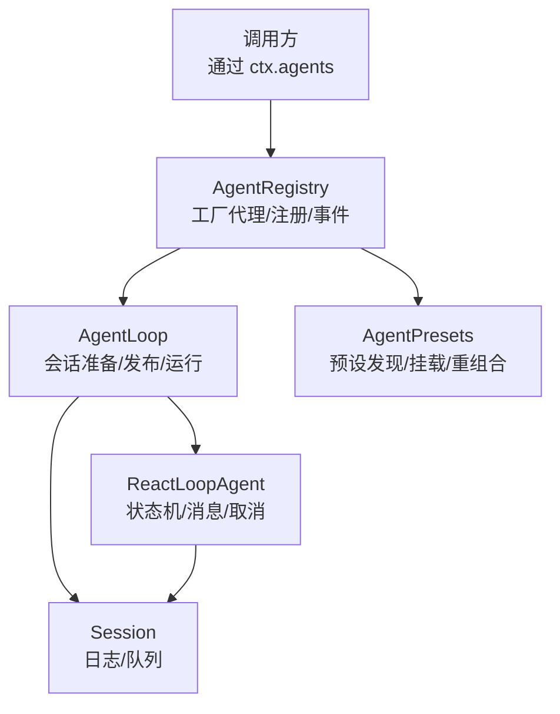
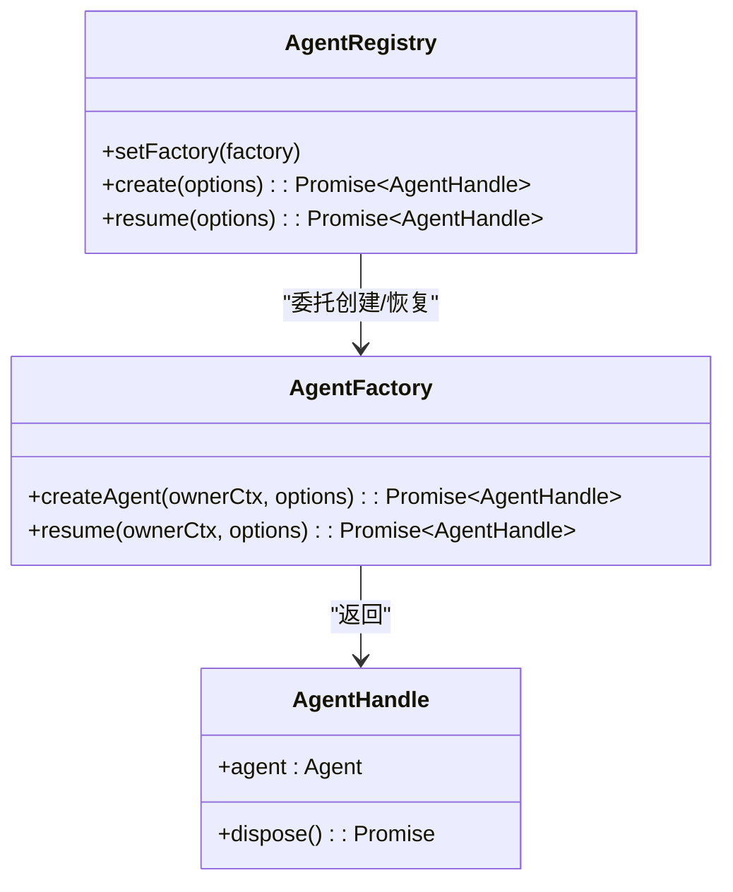
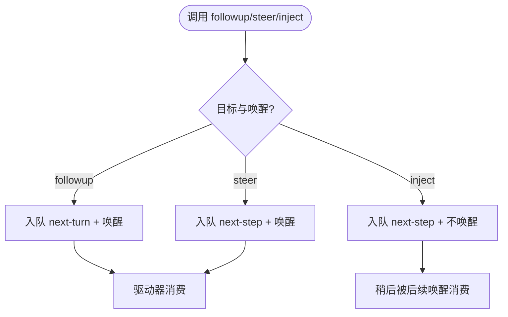
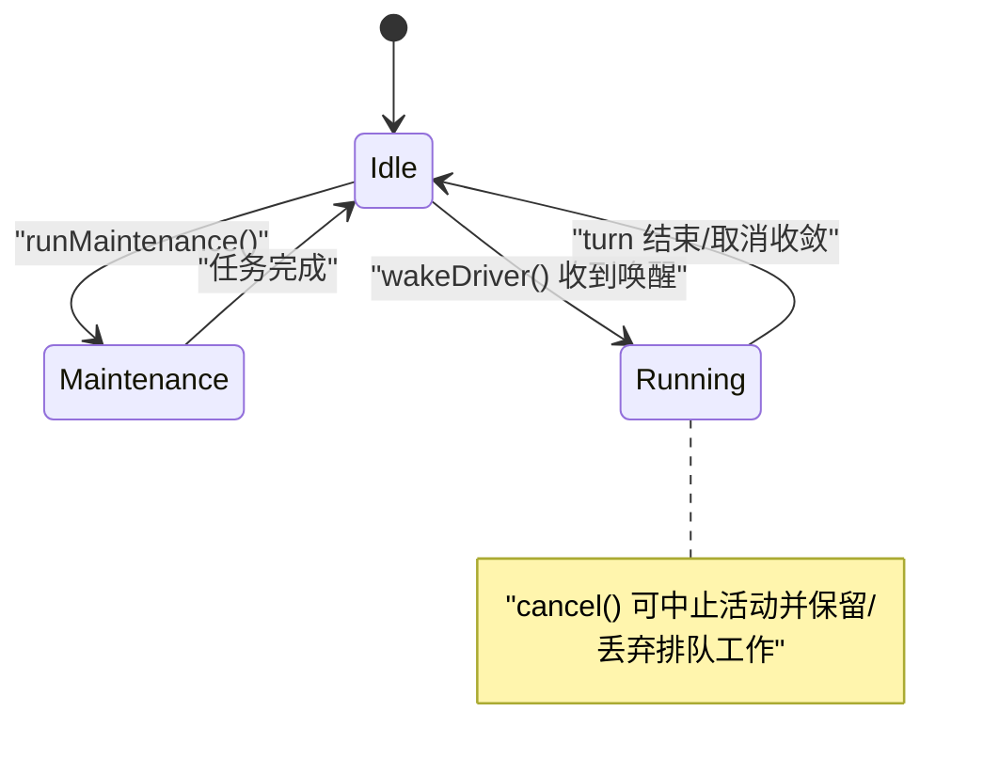
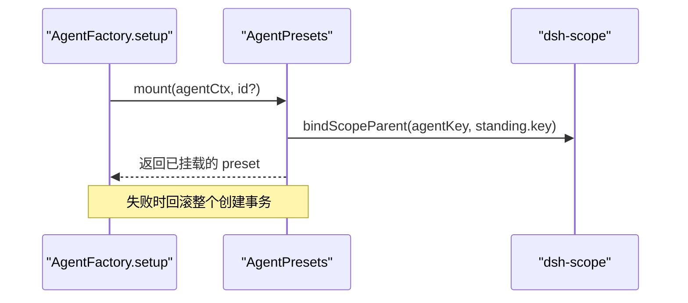
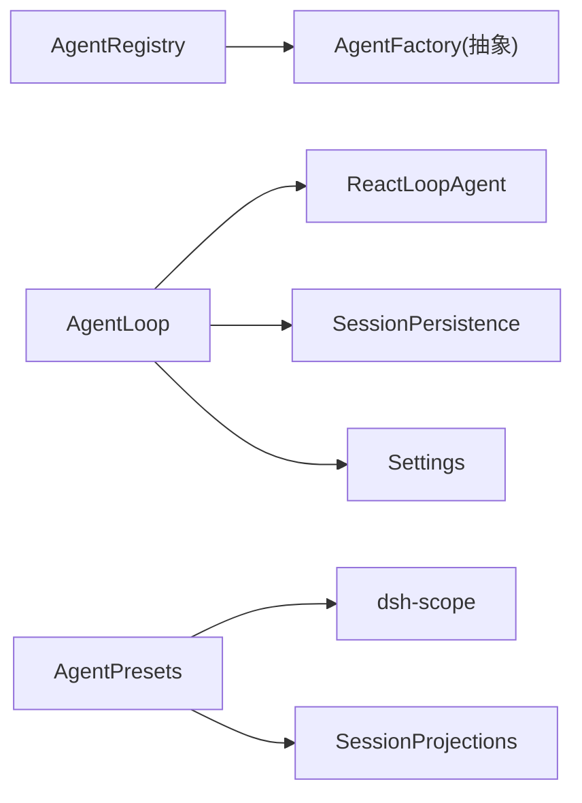

# Agent管理系统

<cite>
**本文引用的文件**
- [packages/core/agent/src/index.ts](file://packages/core/agent/src/index.ts)
- [packages/core/agent/src/types.ts](file://packages/core/agent/src/types.ts)
- [packages/core/agent-loop/src/index.ts](file://packages/core/agent-loop/src/index.ts)
- [packages/core/agent-loop/src/agent.ts](file://packages/core/agent-loop/src/agent.ts)
- [packages/preset/agent-presets/src/index.ts](file://packages/preset/agent-presets/src/index.ts)
- [docs/subsystems/core.md](file://docs/subsystems/core.md)
- [.agents/notes/implemented/simplification/2026-07-30-private-agent-send.zh.md](file://.agents/notes/implemented/simplification/2026-07-30-private-agent-send.zh.md)
- [.agents/notes/implemented/architecture/2026-07-22-unified-send-and-coalesced-user-messages.zh.md](file://.agents/notes/implemented/architecture/2026-07-22-unified-send-and-coalesced-user-messages.zh.md)
- [packages/core/agent/tests/agent.spec.ts](file://packages/core/agent/tests/agent.spec.ts)
</cite>

## 目录
1. [简介](#简介)
2. [项目结构](#项目结构)
3. [核心组件](#核心组件)
4. [架构总览](#架构总览)
5. [详细组件分析](#详细组件分析)
6. [依赖关系分析](#依赖关系分析)
7. [性能考量](#性能考量)
8. [故障排查指南](#故障排查指南)
9. [结论](#结论)
10. [附录](#附录)

## 简介
本文件系统性说明 DeepSeek Harness 的 Agent 管理系统，覆盖 Agent 的创建、注册、生命周期管理与并发控制；详解 AgentHandle 接口（create/resume/dispose）与 Agent 接口的消息路由方法（send/followup/steer/inject）；解释 Agent 状态机（idle/running）与取消机制；提供基于 ctx.agents 工厂模式的配置与使用示例；并介绍 Agent 预设系统与扩展点，给出开发者指南与最佳实践。

## 项目结构
Agent 管理由以下关键模块协作完成：
- 注册与工厂代理层：AgentRegistry（ctx.agents），负责工厂注册、创建/恢复委托、发布事件与启动器上下文传播。
- 驱动与循环层：AgentLoop（插件实现），负责会话准备、Agent 构造、设置提交、发布与运行循环。
- 运行时 Agent：ReactLoopAgent，实现状态机、消息投递、取消与维护任务。
- 类型与事件契约：types.ts 定义 Agent、InboxTarget、inbox spliced 事件等。
- 预设系统：AgentPresets，提供“持久化挂载”的插件组合，支持选择、重组合与继承。



图表来源
- [packages/core/agent/src/index.ts:351-421](file://packages/core/agent/src/index.ts#L351-L421)
- [packages/core/agent-loop/src/index.ts:295-715](file://packages/core/agent-loop/src/index.ts#L295-L715)
- [packages/core/agent-loop/src/agent.ts:106-230](file://packages/core/agent-loop/src/agent.ts#L106-L230)
- [packages/preset/agent-presets/src/index.ts:148-790](file://packages/preset/agent-presets/src/index.ts#L148-L790)

章节来源
- [packages/core/agent/src/index.ts:246-421](file://packages/core/agent/src/index.ts#L246-L421)
- [packages/core/agent-loop/src/index.ts:295-715](file://packages/core/agent-loop/src/index.ts#L295-L715)
- [packages/core/agent-loop/src/agent.ts:106-230](file://packages/core/agent-loop/src/agent.ts#L106-L230)
- [packages/preset/agent-presets/src/index.ts:148-790](file://packages/preset/agent-presets/src/index.ts#L148-L790)

## 核心组件
- AgentRegistry（ctx.agents）
  - setFactory：注册 AgentFactory（唯一），effect-scoped 清理。
  - create/resume：将调用者上下文追踪到工厂，委托实际创建/恢复。
  - register/enter/announce：原子化注册、发布 agent/created、配对 agent/disposed。
  - withInitiator/withoutInitiator：进程内发起者上下文传播，用于归属与审计。
- AgentLoop（插件实现）
  - 配置校验与默认值、声明式 agents 启动、launcher 身份注入。
  - prepare/setupAndPublish：会话准备、可选 setup 提交、发布 session/agent 事件、启动驱动。
  - resumeWith：持久化加载、失败回退、并发安全。
- ReactLoopAgent
  - 状态机 idle/maintenance/running，status 对外暴露 idle/running。
  - send/followup/steer/inject：统一投递到 next-turn/next-step，决定是否唤醒。
  - cancel/runMaintenance/whenIdle：取消、维护任务、空闲等待。
- AgentPresets
  - 发现/列表/解析/挂载/重组合/选择；standing mount 保证同一 preset 共享实例。
  - composeFrom：子 Agent 继承父 Agent 的组成。

章节来源
- [packages/core/agent/src/index.ts:246-698](file://packages/core/agent/src/index.ts#L246-L698)
- [packages/core/agent-loop/src/index.ts:295-715](file://packages/core/agent-loop/src/index.ts#L295-L715)
- [packages/core/agent-loop/src/agent.ts:106-230](file://packages/core/agent-loop/src/agent.ts#L106-L230)
- [packages/preset/agent-presets/src/index.ts:148-790](file://packages/preset/agent-presets/src/index.ts#L148-L790)

## 架构总览
下图展示从调用到运行的完整流程，包括工厂模式、会话准备、发布与驱动启动。

```mermaid
sequenceDiagram
participant Caller as "调用方"
participant Reg as "AgentRegistry(ctx.agents)"
participant Loop as "AgentLoop"
participant Prep as "SessionPreparation"
participant Agent as "ReactLoopAgent"
participant Sess as "Session"
Caller->>Reg : create({sessionId, agentOptions, setup?})
Reg->>Loop : createAgent(ownerCtx, options)
Loop->>Prep : prepare(sessionId, meta)
Loop->>Loop : prepare(ownerCtx, id, options, session, signal?)
Loop->>Agent : new ReactLoopAgent(...)
Loop->>Loop : setup(agentCtx).commit()
Loop->>Sess : announce(session)
Loop->>Reg : announce(agent)
Reg-->>Caller : AgentHandle{agent, dispose}
Note over Agent,Sess : 首次投递或 followup/steer 会唤醒驱动
```

图表来源
- [packages/core/agent/src/index.ts:387-421](file://packages/core/agent/src/index.ts#L387-L421)
- [packages/core/agent-loop/src/index.ts:590-646](file://packages/core/agent-loop/src/index.ts#L590-L646)
- [packages/core/agent-loop/src/index.ts:460-579](file://packages/core/agent-loop/src/index.ts#L460-L579)

## 详细组件分析

### AgentHandle 接口与工厂模式
- AgentHandle
  - agent：当前 Agent 实例。
  - dispose()：停止循环、等待空闲、注销 Agent、移除 Session、释放作用域。
- AgentFactory
  - createAgent(ownerCtx, options)：创建并发布新 Agent。
  - resume(ownerCtx, options)：从持久化恢复 Agent。
- 使用方式
  - 通过 ctx.agents.setFactory 注册工厂（仅一次）。
  - 通过 ctx.agents.create / ctx.agents.resume 获取 AgentHandle。
  - 在 setup 中可执行作用域内装配，提交 commit 后发布。



图表来源
- [packages/core/agent/src/index.ts:148-204](file://packages/core/agent/src/index.ts#L148-L204)
- [packages/core/agent/src/index.ts:351-421](file://packages/core/agent/src/index.ts#L351-L421)

章节来源
- [packages/core/agent/src/index.ts:148-204](file://packages/core/agent/src/index.ts#L148-L204)
- [packages/core/agent/src/index.ts:351-421](file://packages/core/agent/src/index.ts#L351-L421)
- [packages/core/agent/tests/agent.spec.ts:362-408](file://packages/core/agent/tests/agent.spec.ts#L362-L408)

### Agent 接口与消息路由
- Agent 公开能力
  - id/options/session/inbox/status/ctx
  - cancel(cause, options)：清空排队/中止活动，支持 keepInbox。
  - whenIdle()：等待进入空闲。
  - runMaintenance(task)：在空闲阶段执行维护任务。
  - followup(message)：入队下一轮次并唤醒。
  - steer(message)：入队下一步并唤醒。
  - inject(message)：入队下一步但不唤醒。
- 内部路由
  - send(target, wakeup)：统一投递到 next-turn/next-step，wakeup 决定是否唤醒驱动器。
  - 设计决策：对外仅暴露语义明确的 followup/steer/inject，内部 send 为私有辅助。



图表来源
- [packages/core/agent-loop/src/agent.ts:120-139](file://packages/core/agent-loop/src/agent.ts#L120-L139)
- [.agents/notes/implemented/simplification/2026-07-30-private-agent-send.zh.md:1-21](file://.agents/notes/implemented/simplification/2026-07-30-private-agent-send.zh.md#L1-L21)
- [.agents/notes/implemented/architecture/2026-07-22-unified-send-and-coalesced-user-messages.zh.md:1-11](file://.agents/notes/implemented/architecture/2026-07-22-unified-send-and-coalesced-user-messages.zh.md#L1-L11)

章节来源
- [docs/subsystems/core.md:57-142](file://docs/subsystems/core.md#L57-L142)
- [packages/core/agent/src/types.ts:11-47](file://packages/core/agent/src/types.ts#L11-L47)
- [packages/core/agent-loop/src/agent.ts:120-139](file://packages/core/agent-loop/src/agent.ts#L120-L139)

### 状态机与取消机制
- 状态
  - idle：无活动，可接受维护任务或等待唤醒。
  - maintenance：执行 runMaintenance 的任务。
  - running：驱动一个 turn/step 序列。
- 取消
  - cancel(cause, options)：清空 inbox（除非 keepInbox）、中止当前活动、标记 wakeRequested。
  - whenIdle()：等待当前活动结束（含被取消后的收敛）。
- 唤醒与收敛
  - wakeDriver：若处于非 idle，可能 latch 唤醒请求；空闲时立即开启 running 并 kick。
  - kick：循环执行 turn，完成后回到 idle，若有 pending 且 wakeRequested 则再次唤醒。



图表来源
- [packages/core/agent-loop/src/agent.ts:106-230](file://packages/core/agent-loop/src/agent.ts#L106-L230)

章节来源
- [packages/core/agent-loop/src/agent.ts:106-230](file://packages/core/agent-loop/src/agent.ts#L106-L230)

### 生命周期与并发控制
- 工厂所有权
  - FactoryOwnership：跟踪 liveAgents、startupTasks，统一 abort 信号，确保卸载时停止所有 Agent。
- 准备与发布
  - prepare：创建 AbortController，融合 callerSignal、owner effect、factory teardown；构建 Agent 与 detach 闭包。
  - publish：注册 session/agent、发出 session-start、返回 handle。
- 恢复与并发
  - resumeWith：持久化加载与 owner 取消、工厂卸载竞态保护；失败回退到创建。
- 注册冲突边界
  - enter/announce：严格单例注册，避免并发 create/resume 重复发布。

```mermaid
sequenceDiagram
participant Owner as "拥有者 Fiber"
participant Loop as "AgentLoop"
participant Fac as "FactoryOwnership"
participant Ag as "ReactLoopAgent"
Owner->>Loop : create()/resume()
Loop->>Fac : track(dispose)
Loop->>Ag : 构造并准备
Loop->>Loop : publish(source)
Loop-->>Owner : AgentHandle
Owner->>Owner : 持有 handle.dispose()
Note over Fac,Owner : 工厂卸载/所有者卸载触发 abort，等待收敛
```

图表来源
- [packages/core/agent-loop/src/index.ts:39-90](file://packages/core/agent-loop/src/index.ts#L39-L90)
- [packages/core/agent-loop/src/index.ts:460-579](file://packages/core/agent-loop/src/index.ts#L460-L579)
- [packages/core/agent/src/index.ts:450-567](file://packages/core/agent/src/index.ts#L450-L567)

章节来源
- [packages/core/agent-loop/src/index.ts:39-90](file://packages/core/agent-loop/src/index.ts#L39-L90)
- [packages/core/agent-loop/src/index.ts:460-579](file://packages/core/agent-loop/src/index.ts#L460-L579)
- [packages/core/agent/src/index.ts:450-567](file://packages/core/agent/src/index.ts#L450-L567)

### Agent 预设系统与自定义扩展点
- 预设服务（AgentPresets）
  - list/resolve：发现与解析可用预设。
  - mount：为 Agent 的 scope 绑定到 standing mount，使工具、提示段、技能目录可见。
  - composeFrom：子 Agent 继承父 Agent 的组成（同步、无文件 IO）。
  - select/recompose：在空白会话中选择/切换预设，记录 agent-preset/selected。
  - standingKeyFor：冷读场景下获取 composition 的 scope key。
- 扩展点
  - 在 AgentFactory.setup 中调用 mount/composeFrom，确保未发布前完成组合，失败可回滚。
  - 通过 settings 管理默认预设，支持热更新。



图表来源
- [packages/preset/agent-presets/src/index.ts:392-418](file://packages/preset/agent-presets/src/index.ts#L392-L418)
- [packages/preset/agent-presets/src/index.ts:420-455](file://packages/preset/agent-presets/src/index.ts#L420-L455)
- [packages/preset/agent-presets/src/index.ts:653-675](file://packages/preset/agent-presets/src/index.ts#L653-L675)

章节来源
- [packages/preset/agent-presets/src/index.ts:148-790](file://packages/preset/agent-presets/src/index.ts#L148-L790)

## 依赖关系分析
- AgentRegistry 依赖 Cordis Service/Context、Typert、Scope，并通过 setFactory 解耦具体实现。
- AgentLoop 依赖 sessions、llm、tools、systemPrompt、sessionPersistence，并安装 settings section。
- ReactLoopAgent 依赖 Inbox、Dispatch、Session 事件。
- AgentPresets 依赖 loader、scope、settings、sessionProjections，提供 Remote API。



图表来源
- [packages/core/agent/src/index.ts:246-289](file://packages/core/agent/src/index.ts#L246-L289)
- [packages/core/agent-loop/src/index.ts:295-355](file://packages/core/agent-loop/src/index.ts#L295-L355)
- [packages/preset/agent-presets/src/index.ts:148-258](file://packages/preset/agent-presets/src/index.ts#L148-L258)

章节来源
- [packages/core/agent/src/index.ts:246-289](file://packages/core/agent/src/index.ts#L246-L289)
- [packages/core/agent-loop/src/index.ts:295-355](file://packages/core/agent-loop/src/index.ts#L295-L355)
- [packages/preset/agent-presets/src/index.ts:148-258](file://packages/preset/agent-presets/src/index.ts#L148-L258)

## 性能考量
- 并行工具调用上限：AgentLoop 通过设置项 maxParallelToolCalls 控制每步最大并行工具调用数，支持运行时读取最新值。
- 唤醒节流：wakeDriver 在非 idle 时可能 latch 唤醒请求，避免重复唤醒；当收敛时再检查是否有待处理工作。
- 预取与回退：resumeWith 在持久化加载失败时回退到创建，减少阻塞时间。
- 建议
  - 合理设置 maxParallelToolCalls，避免过度并行导致资源争用。
  - 使用 keepInbox 谨慎取消，避免丢失重要排队工作。
  - 对长耗时 setup 使用 AbortSignal 支持快速取消。

[本节为通用指导，无需特定文件引用]

## 故障排查指南
- 常见错误与定位
  - “no agent factory registered”：未通过 ctx.agents.setFactory 注册工厂。
  - “already registered”：重复注册相同 id 的 Agent。
  - “agent loop is not active”：工厂卸载或 fiber 非活跃时尝试创建。
  - “cannot resume: session persistence is not configured”：缺少持久化后端。
- 诊断步骤
  - 确认 ctx.agents.setFactory 已生效且在 effect 范围内。
  - 检查 AgentRegistry.enter/announce 是否成对调用。
  - 监听 agent/status、agent/error、agent/disposed 事件定位状态变化。
  - 使用 whenIdle 等待收敛，结合 cancel(keepInbox) 观察队列行为。

章节来源
- [packages/core/agent/src/index.ts:206-210](file://packages/core/agent/src/index.ts#L206-L210)
- [packages/core/agent/src/index.ts:450-567](file://packages/core/agent/src/index.ts#L450-L567)
- [packages/core/agent-loop/src/index.ts:654-660](file://packages/core/agent-loop/src/index.ts#L654-L660)

## 结论
DeepSeek Harness 的 Agent 管理系统以清晰的职责分层与严格的并发控制为核心：AgentRegistry 提供统一的工厂代理与注册发布；AgentLoop 负责会话准备、设置提交与驱动启动；ReactLoopAgent 实现稳健的状态机与消息路由；AgentPresets 提供可插拔的预设组合与继承。通过 AgentHandle 的 dispose 与 cancel/whenIdle 的配合，系统实现了安全的生命周期管理与资源清理。开发者应遵循工厂模式与预设挂载约定，合理使用取消与并行策略，以获得稳定高效的 Agent 运行体验。

## 附录
- 开发最佳实践
  - 始终通过 ctx.agents.create/resume 获取 AgentHandle，并在合适时机调用 dispose。
  - 在 setup 中完成作用域内装配，必要时返回 commit 进行发布前校验。
  - 使用 followup/steer/inject 表达意图，避免直接操作内部路由。
  - 利用 AgentPresets.mount/composeFrom 组织工具与提示，保持可复用与可替换。
  - 使用 cancel(keepInbox) 精细控制取消范围，配合 whenIdle 观察收敛。
- 参考路径
  - 工厂与注册：[packages/core/agent/src/index.ts:351-421](file://packages/core/agent/src/index.ts#L351-L421)
  - 驱动与状态机：[packages/core/agent-loop/src/agent.ts:106-230](file://packages/core/agent-loop/src/agent.ts#L106-L230)
  - 预设系统：[packages/preset/agent-presets/src/index.ts:392-790](file://packages/preset/agent-presets/src/index.ts#L392-L790)