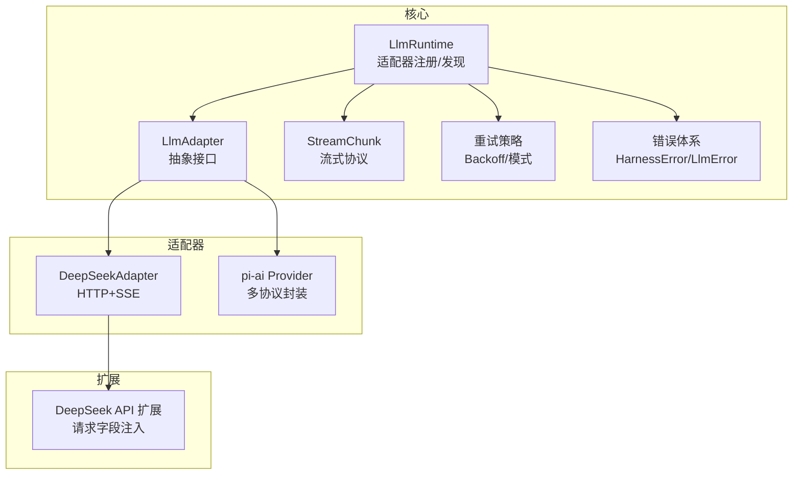
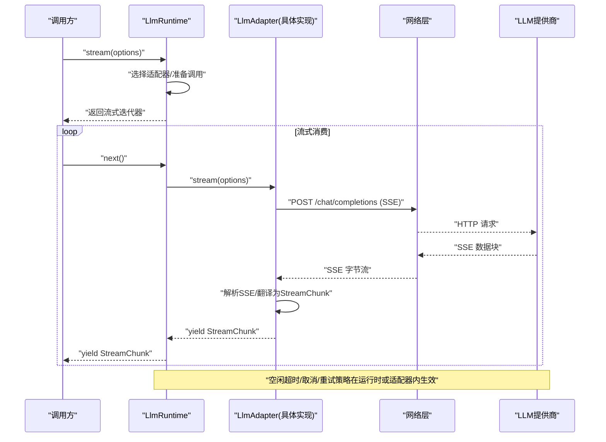
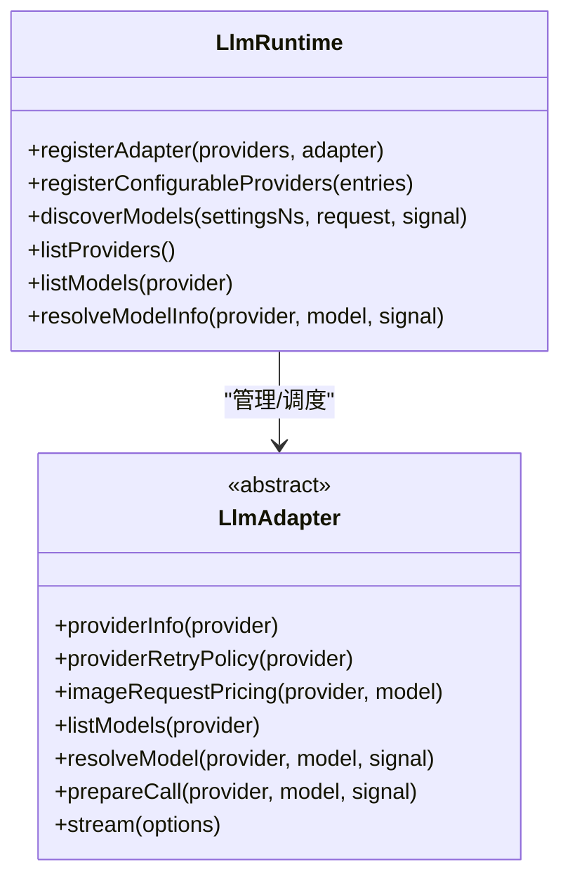
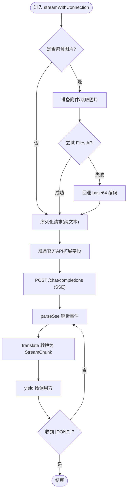
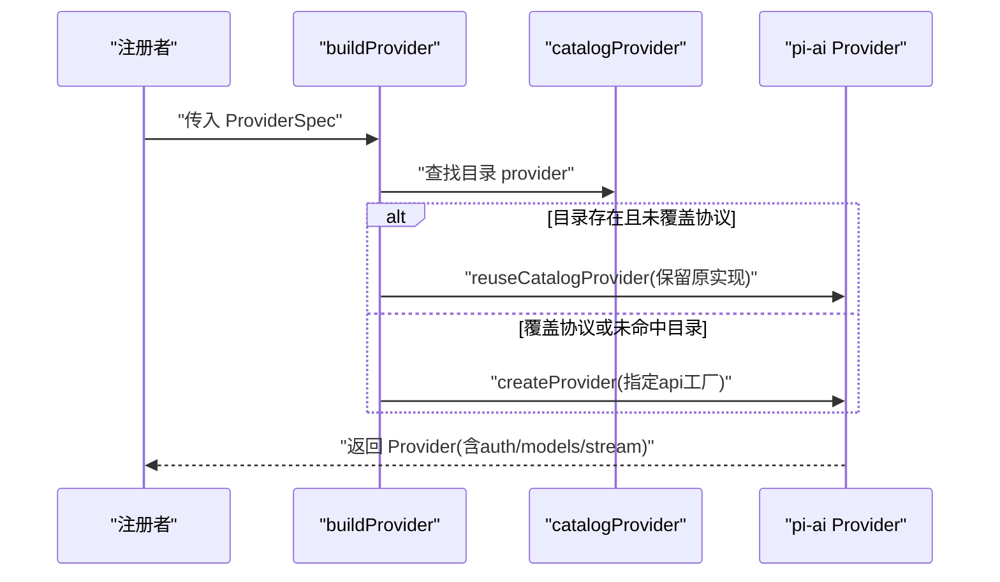
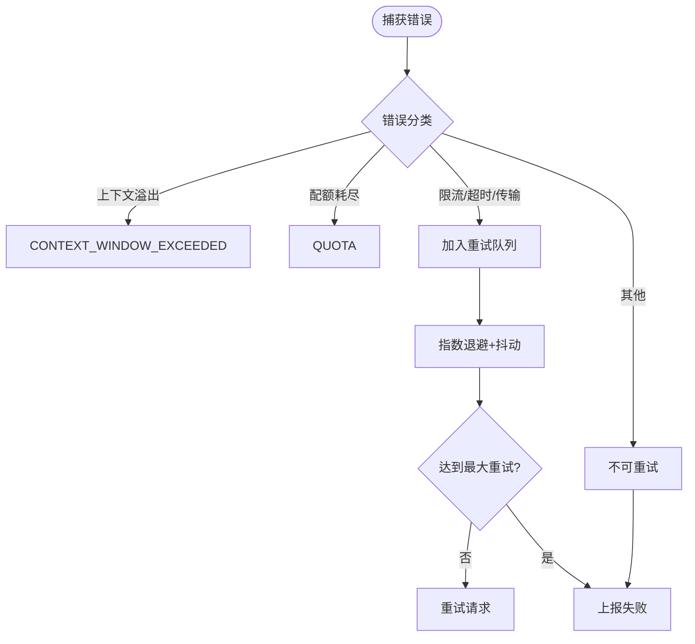
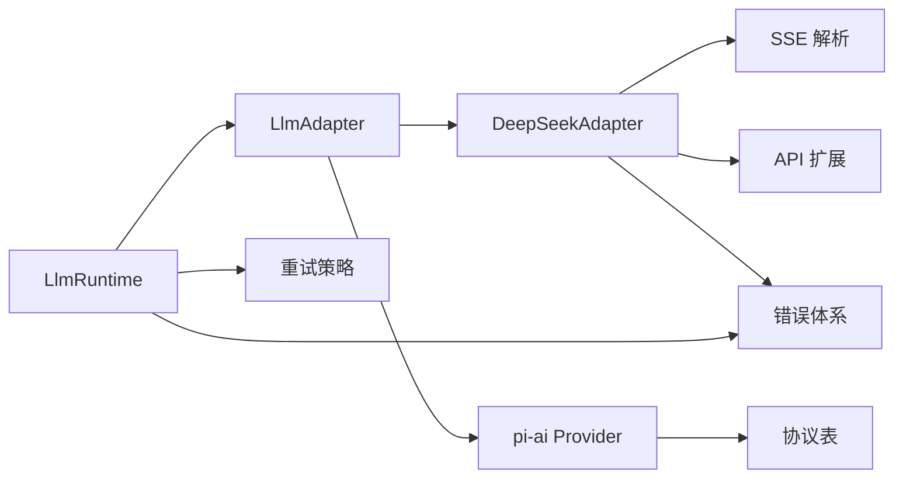

# LLM适配器系统

<cite>
**本文引用的文件**
- [packages/llm/llm/src/index.ts](file://packages/llm/llm/src/index.ts)
- [packages/llm/llm/src/types.ts](file://packages/llm/llm/src/types.ts)
- [packages/llm/llm/src/error.ts](file://packages/llm/llm/src/error.ts)
- [packages/llm/llm/src/retry-policy.ts](file://packages/llm/llm/src/retry-policy.ts)
- [packages/llm/llm-deepseek/src/adapter.ts](file://packages/llm/llm-deepseek/src/adapter.ts)
- [packages/llm/llm-deepseek/src/sse.ts](file://packages/llm/llm-deepseek/src/sse.ts)
- [packages/llm/deepseek-llm-api-extensions/src/types.ts](file://packages/llm/deepseek-llm-api-extensions/src/types.ts)
- [packages/llm/llm-pi-ai/src/provider.ts](file://packages/llm/llm-pi-ai/src/provider.ts)
- [docs/subsystems/llm-streaming.md](file://docs/subsystems/llm-streaming.md)
</cite>

## 目录
1. [简介](#简介)
2. [项目结构](#项目结构)
3. [核心组件](#核心组件)
4. [架构总览](#架构总览)
5. [详细组件分析](#详细组件分析)
6. [依赖关系分析](#依赖关系分析)
7. [性能考量](#性能考量)
8. [故障排查指南](#故障排查指南)
9. [结论](#结论)
10. [附录：新模型适配器开发指南](#附录：新模型适配器开发指南)

## 简介
本文件系统性地说明 DeepSeek Harness 的 LLM 适配器体系：抽象接口设计、多提供商支持机制、流式响应协议与数据格式、请求构建与响应解析流程、重试与错误处理策略，以及新增适配器的集成方法。目标是帮助开发者在不深入底层细节的前提下，快速理解并扩展该系统的 LLM 能力。

## 项目结构
- 核心抽象与运行时
  - llm 包：定义适配器抽象、流式协议、错误类型、重试策略、注册中心与服务入口。
- 具体适配器实现
  - llm-deepseek：基于 OpenAI 兼容接口的直接 HTTP + SSE 适配器。
  - llm-pi-ai：基于 pi-ai SDK 的多协议适配器（OpenAI Completions/Responses、Anthropic Messages）。
- 扩展点
  - deepseek-llm-api-extensions：为 DeepSeek 官方请求体提供可插拔字段扩展机制。
- 文档
  - subsystems/llm-streaming.md：对消息、内容块、流式协议、重试策略、适配器契约等的权威说明。



图表来源
- [packages/llm/llm/src/index.ts:330-468](file://packages/llm/llm/src/index.ts#L330-L468)
- [packages/llm/llm/src/types.ts:370-391](file://packages/llm/llm/src/types.ts#L370-L391)
- [packages/llm/llm/src/retry-policy.ts:14-79](file://packages/llm/llm/src/retry-policy.ts#L14-L79)
- [packages/llm/llm/src/error.ts:13-49](file://packages/llm/llm/src/error.ts#L13-L49)
- [packages/llm/llm-deepseek/src/adapter.ts:355-444](file://packages/llm/llm-deepseek/src/adapter.ts#L355-L444)
- [packages/llm/llm-pi-ai/src/provider.ts:167-193](file://packages/llm/llm-pi-ai/src/provider.ts#L167-L193)
- [packages/llm/deepseek-llm-api-extensions/src/types.ts:18-59](file://packages/llm/deepseek-llm-api-extensions/src/types.ts#L18-L59)

章节来源
- [packages/llm/llm/src/index.ts:330-468](file://packages/llm/llm/src/index.ts#L330-L468)
- [docs/subsystems/llm-streaming.md:167-218](file://docs/subsystems/llm-streaming.md#L167-L218)

## 核心组件
- LlmRuntime：适配器注册中心、模型发现、远程调用入口；暴露 listProviders/listModels/resolveModelInfo/discoverModels 等能力；维护可配置提供者目录与拓扑变更事件。
- LlmAdapter：抽象适配器接口，要求实现 stream()，可选实现 providerInfo/providerRetryPolicy/imageRequestPricing/listModels/resolveModel/prepareCall。
- StreamChunk：适配器到上层的核心流式协议，包含文本/推理/工具调用增量、块起止、用量统计与结束原因。
- 重试策略：normal/always 两种模式，带指数退避与抖动；默认可重试代码集合包含空响应、限流、服务端错误、超时、传输错误等。
- 错误体系：统一 HarnessError/LlmError，携带稳定 code 与结构化失败事实（status、providerRetryAfterMs、requestId），并提供上下文溢出/配额耗尽识别。

章节来源
- [packages/llm/llm/src/index.ts:191-279](file://packages/llm/llm/src/index.ts#L191-L279)
- [packages/llm/llm/src/types.ts:370-391](file://packages/llm/llm/src/types.ts#L370-L391)
- [packages/llm/llm/src/retry-policy.ts:14-79](file://packages/llm/llm/src/retry-policy.ts#L14-L79)
- [packages/llm/llm/src/error.ts:13-49](file://packages/llm/llm/src/error.ts#L13-L49)
- [docs/subsystems/llm-streaming.md:288-304](file://docs/subsystems/llm-streaming.md#L288-L304)

## 架构总览
下图展示一次模型调用的端到端流程：调用方通过 LlmRuntime 发起流式调用，运行时选择已注册的适配器，适配器负责构建请求、发送网络请求、解析 SSE 流、映射为 StreamChunk 并回传；同时结合重试策略与错误体系完成异常处理。



图表来源
- [packages/llm/llm/src/index.ts:330-468](file://packages/llm/llm/src/index.ts#L330-L468)
- [packages/llm/llm-deepseek/src/adapter.ts:524-707](file://packages/llm/llm-deepseek/src/adapter.ts#L524-L707)
- [packages/llm/llm-deepseek/src/sse.ts:28-40](file://packages/llm/llm-deepseek/src/sse.ts#L28-L40)

## 详细组件分析

### 适配器抽象与运行时
- 适配器注册与替换：registerAdapter 支持原子替换路由，保证无间隙切换；registerConfigurableProviders 声明可配置提供者目录；discoverModels 支持对未存储端点的探测。
- 模型元数据：listModels 与 resolveModelInfo 分别用于目录查询与精确模型信息解析；prepareCall 将“模型解析”和“流式入口”绑定在同一代次，避免动态配置漂移。
- 水印拦截：llm/stream 事件允许监听器短路或重写流，便于重试、回放、路由等横切逻辑。



图表来源
- [packages/llm/llm/src/index.ts:330-468](file://packages/llm/llm/src/index.ts#L330-L468)
- [packages/llm/llm/src/index.ts:191-279](file://packages/llm/llm/src/index.ts#L191-L279)

章节来源
- [packages/llm/llm/src/index.ts:330-468](file://packages/llm/llm/src/index.ts#L330-L468)
- [packages/llm/llm/src/index.ts:191-279](file://packages/llm/llm/src/index.ts#L191-L279)

### DeepSeek 适配器（HTTP + SSE）
- 连接与鉴权：通过回调获取 baseURL、apiKey、用户标识、附件服务、TDAI 头、API 扩展等；每次流式调用重新解析连接快照，确保 endpoint 与密钥同代。
- 图片处理：优先使用 Files API 上传引用，失败回退 base64；按像素预算/数量/字节上限进行裁剪与占位文本替换。
- 请求构建：序列化消息与参数，合并官方 API 扩展字段，设置 attributionHeaders、会话/用途标记等。
- 流式处理：SSE 解析器严格遵循规范，遇到 [DONE] 结束；空闲超时用 idleWatchdog 保护；错误分类映射为稳定的 LlmError.code。
- 重试与恢复：当 Files API 映射失效时自动回退并重试；HTTP 非 2xx 抛出结构化错误，携带 status/providerRetryAfterMs/requestId。



图表来源
- [packages/llm/llm-deepseek/src/adapter.ts:446-707](file://packages/llm/llm-deepseek/src/adapter.ts#L446-L707)
- [packages/llm/llm-deepseek/src/sse.ts:28-40](file://packages/llm/llm-deepseek/src/sse.ts#L28-L40)

章节来源
- [packages/llm/llm-deepseek/src/adapter.ts:355-707](file://packages/llm/llm-deepseek/src/adapter.ts#L355-L707)
- [packages/llm/llm-deepseek/src/sse.ts:28-40](file://packages/llm/llm-deepseek/src/sse.ts#L28-L40)

### pi-ai 多协议适配器
- 协议表：仅开放 openai-completions、openai-responses、anthropic-messages 三种协议，避免暴露无法表达凭据/区域的复杂协议。
- 目录复用：若配置指向已安装目录中的 provider 且未覆盖协议，则复用其实现以保留原生能力（如 Bedrock 的 Smithy 模块）。
- 认证注入：为目录 provider 补充 harnessApiKeyAuth，使显式 apiKey 能正确传递；无凭据时交由协议自身校验。



图表来源
- [packages/llm/llm-pi-ai/src/provider.ts:167-193](file://packages/llm/llm-pi-ai/src/provider.ts#L167-L193)
- [packages/llm/llm-pi-ai/src/provider.ts:131-159](file://packages/llm/llm-pi-ai/src/provider.ts#L131-L159)

章节来源
- [packages/llm/llm-pi-ai/src/provider.ts:1-193](file://packages/llm/llm-pi-ai/src/provider.ts#L1-L193)

### 流式协议 StreamChunk 与传输
- 协议要点：block-start/text-delta/reasoning-delta/tool-call-delta/block-end/usage/finish；index 关联同一块的增量；usage 在 finish 之前；tool 参数保持原始 JSON 字符串。
- SSE 传输：DeepSeek 适配器使用 eventsource-parser 严格解析，[DONE] 作为终止标志；EOF 前未收到 [DONE] 视为截断并抛错。
- 组装：上层可使用 BlockAssembler 将 StreamChunk 折叠为完整 ContentBlock 与最终 Message，并处理中断/截断场景。

```mermaid
flowchart TD
In(["SSE 字节流"]) --> Decode["TextDecoder + EventSourceParser"]
Decode --> Events{"事件 data"}
Events --> |逐条| Map["translate 映射为 StreamChunk"]
Map --> Out(["yield 到调用方"])
Events --> |到达 [DONE]| Finish(["结束流"])
```

图表来源
- [packages/llm/llm-deepseek/src/sse.ts:28-40](file://packages/llm/llm-deepseek/src/sse.ts#L28-L40)
- [docs/subsystems/llm-streaming.md:167-218](file://docs/subsystems/llm-streaming.md#L167-L218)

章节来源
- [packages/llm/llm-deepseek/src/sse.ts:28-40](file://packages/llm/llm-deepseek/src/sse.ts#L28-L40)
- [docs/subsystems/llm-streaming.md:167-218](file://docs/subsystems/llm-streaming.md#L167-L218)

### 请求构建与响应解析
- 请求构建：GenerateOptions 经适配器序列化为 provider 特定格式；DeepSeek 适配器支持图片 offload、Files API 引用、官方 API 扩展字段合并；pi-ai 适配器通过协议表选择对应实现。
- 响应解析：DeepSeek 适配器解析 SSE 并转换为 StreamChunk；pi-ai 适配器通过 SDK 流式接口产出等价语义的 chunk。
- 扩展点：deepseek-llm-api-extensions 允许插件在请求体顶层注入字段，并在 2xx 后提交接受动作。

章节来源
- [packages/llm/llm-deepseek/src/adapter.ts:524-707](file://packages/llm/llm-deepseek/src/adapter.ts#L524-L707)
- [packages/llm/deepseek-llm-api-extensions/src/types.ts:18-59](file://packages/llm/deepseek-llm-api-extensions/src/types.ts#L18-L59)
- [packages/llm/llm-pi-ai/src/provider.ts:167-193](file://packages/llm/llm-pi-ai/src/provider.ts#L167-L193)

### 多提供商支持与适配器注册
- 注册方式：registerAdapter 将一组 provider 名称绑定到同一适配器实例；支持 replace 原子替换；registerConfigurableProviders 声明可配置提供者目录。
- 模型发现：discoverModels 支持对未存储端点的探测，返回去重后的模型列表；listModels 与 resolveModelInfo 提供目录与精确元数据。
- 协议限制：pi-ai 适配器仅开放有限协议，避免无法表达的凭据/区域问题；目录 provider 可复用原生实现。

章节来源
- [packages/llm/llm/src/index.ts:384-531](file://packages/llm/llm/src/index.ts#L384-L531)
- [packages/llm/llm/src/index.ts:552-614](file://packages/llm/llm/src/index.ts#L552-L614)
- [packages/llm/llm-pi-ai/src/provider.ts:47-63](file://packages/llm/llm-pi-ai/src/provider.ts#L47-L63)

### 推理效率控制与最大令牌数管理
- 默认输出上限：DeepSeek 适配器提供默认 maxTokens 与 contextWindow；resolveModel 返回 defaultMaxTokens 供上层兜底。
- 推理强度：根据配置暴露 reasoning efforts（off/low/high/max），由适配器决定默认值。
- 图片预算：按像素/数量/字节上限进行 offload，避免请求过大；Files API 失败回退 base64。

章节来源
- [packages/llm/llm-deepseek/src/adapter.ts:139-166](file://packages/llm/llm-deepseek/src/adapter.ts#L139-L166)
- [packages/llm/llm-deepseek/src/adapter.ts:387-432](file://packages/llm/llm-deepseek/src/adapter.ts#L387-L432)
- [packages/llm/llm-deepseek/src/adapter.ts:555-615](file://packages/llm/llm-deepseek/src/adapter.ts#L555-L615)

### 错误处理与重试机制
- 错误分类：HTTP 状态映射为稳定 code（AUTH/INVALID_REQUEST/RATE_LIMIT/SERVER/CONTEXT_WINDOW_EXCEEDED/QUOTA 等）；上下文溢出与配额耗尽通过正则识别。
- 重试策略：normal 模式限定可重试代码与次数；always 模式无限重试；均支持指数退避与抖动；默认包含 EMPTY_RESPONSE/RATE_LIMIT/SERVER/TIMEOUT/TRANSPORT。
- 流式保护：idleWatchdog 在读取阻塞时触发 TIMEOUT；调用方 abort 映射为 ABORTED；SSE 截断抛 STREAM_CLOSED。



图表来源
- [packages/llm/llm-deepseek/src/adapter.ts:334-346](file://packages/llm/llm-deepseek/src/adapter.ts#L334-L346)
- [packages/llm/llm/src/error.ts:24-49](file://packages/llm/llm/src/error.ts#L24-L49)
- [packages/llm/llm/src/retry-policy.ts:14-79](file://packages/llm/llm/src/retry-policy.ts#L14-L79)

章节来源
- [packages/llm/llm-deepseek/src/adapter.ts:334-346](file://packages/llm/llm-deepseek/src/adapter.ts#L334-L346)
- [packages/llm/llm/src/error.ts:24-49](file://packages/llm/llm/src/error.ts#L24-L49)
- [packages/llm/llm/src/retry-policy.ts:14-79](file://packages/llm/llm/src/retry-policy.ts#L14-L79)

## 依赖关系分析
- LlmRuntime 依赖 LlmAdapter 抽象，并通过事件与拓扑通知协调多个适配器实例。
- DeepSeekAdapter 依赖 SSE 解析、图片处理、Files API、官方 API 扩展；pi-ai Provider 依赖协议表与目录 provider。
- 重试策略与错误体系被各适配器共享，保证一致的重试与诊断行为。



图表来源
- [packages/llm/llm/src/index.ts:330-468](file://packages/llm/llm/src/index.ts#L330-L468)
- [packages/llm/llm-deepseek/src/adapter.ts:355-707](file://packages/llm/llm-deepseek/src/adapter.ts#L355-L707)
- [packages/llm/llm-pi-ai/src/provider.ts:167-193](file://packages/llm/llm-pi-ai/src/provider.ts#L167-L193)
- [packages/llm/llm/src/retry-policy.ts:14-79](file://packages/llm/llm/src/retry-policy.ts#L14-L79)
- [packages/llm/llm/src/error.ts:13-49](file://packages/llm/llm/src/error.ts#L13-L49)

章节来源
- [packages/llm/llm/src/index.ts:330-468](file://packages/llm/llm/src/index.ts#L330-L468)
- [packages/llm/llm-deepseek/src/adapter.ts:355-707](file://packages/llm/llm-deepseek/src/adapter.ts#L355-L707)
- [packages/llm/llm-pi-ai/src/provider.ts:167-193](file://packages/llm/llm-pi-ai/src/provider.ts#L167-L193)

## 性能考量
- 流式空闲超时：默认 5 分钟，防止长连接挂起；可按需调整 streamIdleTimeoutMs。
- 图片压缩与 offload：按像素/数量/字节阈值裁剪，减少请求体积；Files API 失败回退 base64。
- 重试退避：指数退避加抖动，避免雪崩；合理设置 initialDelayMs、maxDelayMs、jitterRatio。
- 目录复用：pi-ai 适配器复用目录 provider 的实现，减少重复构建与兼容性问题。

章节来源
- [packages/llm/llm-deepseek/src/adapter.ts:139-166](file://packages/llm/llm-deepseek/src/adapter.ts#L139-L166)
- [packages/llm/llm-deepseek/src/adapter.ts:555-615](file://packages/llm/llm-deepseek/src/adapter.ts#L555-L615)
- [packages/llm/llm/src/retry-policy.ts:121-141](file://packages/llm/llm/src/retry-policy.ts#L121-L141)
- [packages/llm/llm-pi-ai/src/provider.ts:131-159](file://packages/llm/llm-pi-ai/src/provider.ts#L131-L159)

## 故障排查指南
- 常见错误码
  - AUTH/INVALID_CREDENTIAL：检查 API Key 是否为空白或非法字符。
  - RATE_LIMIT/QUOTA：查看配额与限流；必要时延长重试间隔。
  - CONTEXT_WINDOW_EXCEEDED：缩短输入或启用压缩；确认模型上下文窗口。
  - EMPTY_RESPONSE：空响应被视为可重试错误，检查上游是否返回有效内容。
  - STREAM_CLOSED：SSE 流提前关闭，检查网络与上游稳定性。
- 调试建议
  - 使用 attributionHeaders 追踪请求来源。
  - 记录 providerRetryAfterMs 与 requestId 以便定位上游问题。
  - 对图片请求，先验证 Files API 可用性，再考虑 base64 回退。

章节来源
- [packages/llm/llm/src/error.ts:24-49](file://packages/llm/llm/src/error.ts#L24-L49)
- [packages/llm/llm-deepseek/src/adapter.ts:334-346](file://packages/llm/llm-deepseek/src/adapter.ts#L334-L346)
- [packages/llm/llm-deepseek/src/sse.ts:28-40](file://packages/llm/llm-deepseek/src/sse.ts#L28-L40)

## 结论
DeepSeek Harness 的 LLM 适配器系统通过清晰的抽象接口、统一的流式协议、健壮的错误与重试机制，以及对多提供商的统一接入，提供了高可扩展性与高可用性的 LLM 集成方案。开发者可基于此快速接入新模型与新提供商，同时保持与现有生态的一致性。

## 附录：新模型适配器开发指南
- 步骤概览
  1. 继承 LlmAdapter，实现 stream()；可选实现 providerInfo/providerRetryPolicy/imageRequestPricing/listModels/resolveModel/prepareCall。
  2. 在 LlmRuntime 中注册适配器与 provider 名称；如需可配置，使用 registerConfigurableProviders。
  3. 实现请求构建与响应解析：将 provider 特定协议映射为 StreamChunk；遵循 usage 在 finish 之前、tool 参数保持原始 JSON 等约定。
  4. 集成错误与重试：将 provider 错误映射为稳定 code；利用重试策略与空闲超时保护流式读取。
  5. 图片与附件：如需支持图片，实现 imageRequestPricing 并按预算进行 offload；优先使用 Files API，失败回退 base64。
  6. 测试与验收：覆盖正常流、中断、超时、错误分支；验证 StreamChunk 顺序与完整性；确保 attributionHeaders 已添加。
- 参考路径
  - 适配器抽象与注册：[packages/llm/llm/src/index.ts:191-279](file://packages/llm/llm/src/index.ts#L191-L279)、[packages/llm/llm/src/index.ts:384-531](file://packages/llm/llm/src/index.ts#L384-L531)
  - 流式协议与组装：[packages/llm/llm/src/types.ts:370-391](file://packages/llm/llm/src/types.ts#L370-L391)、[docs/subsystems/llm-streaming.md:167-218](file://docs/subsystems/llm-streaming.md#L167-L218)
  - DeepSeek 实现参考：[packages/llm/llm-deepseek/src/adapter.ts:355-707](file://packages/llm/llm-deepseek/src/adapter.ts#L355-L707)、[packages/llm/llm-deepseek/src/sse.ts:28-40](file://packages/llm/llm-deepseek/src/sse.ts#L28-L40)
  - pi-ai 多协议参考：[packages/llm/llm-pi-ai/src/provider.ts:167-193](file://packages/llm/llm-pi-ai/src/provider.ts#L167-L193)
  - 错误与重试：[packages/llm/llm/src/error.ts:13-49](file://packages/llm/llm/src/error.ts#L13-L49)、[packages/llm/llm/src/retry-policy.ts:14-79](file://packages/llm/llm/src/retry-policy.ts#L14-L79)