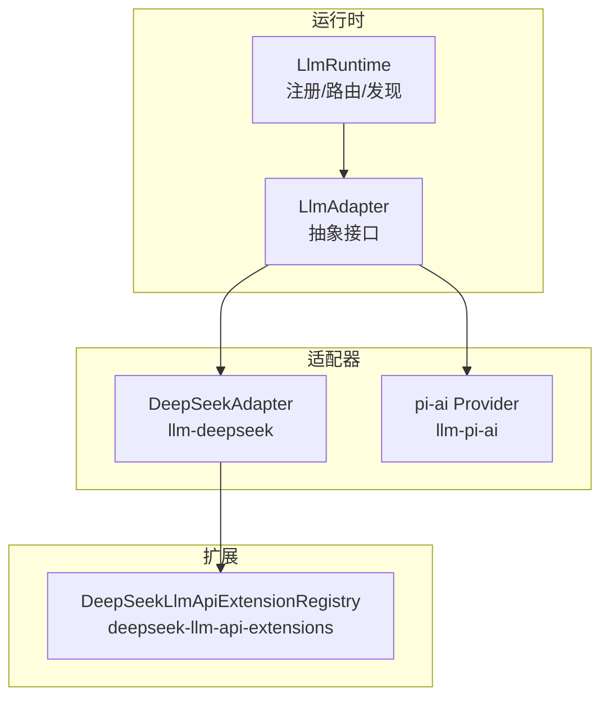
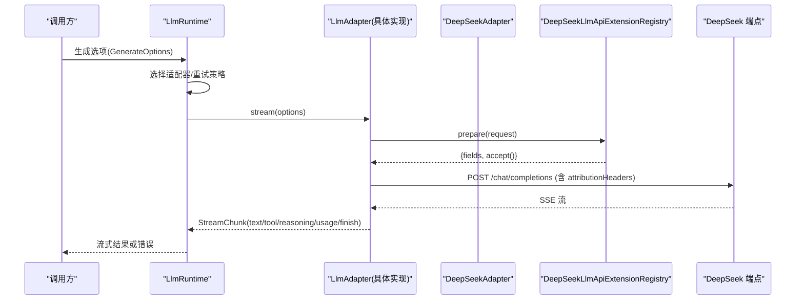
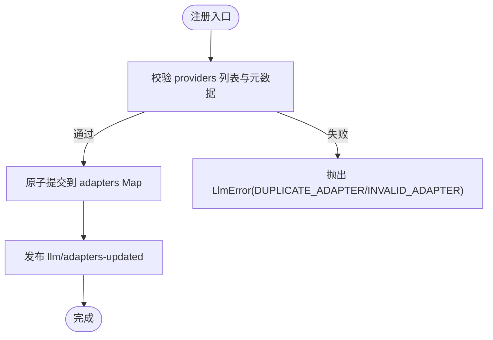
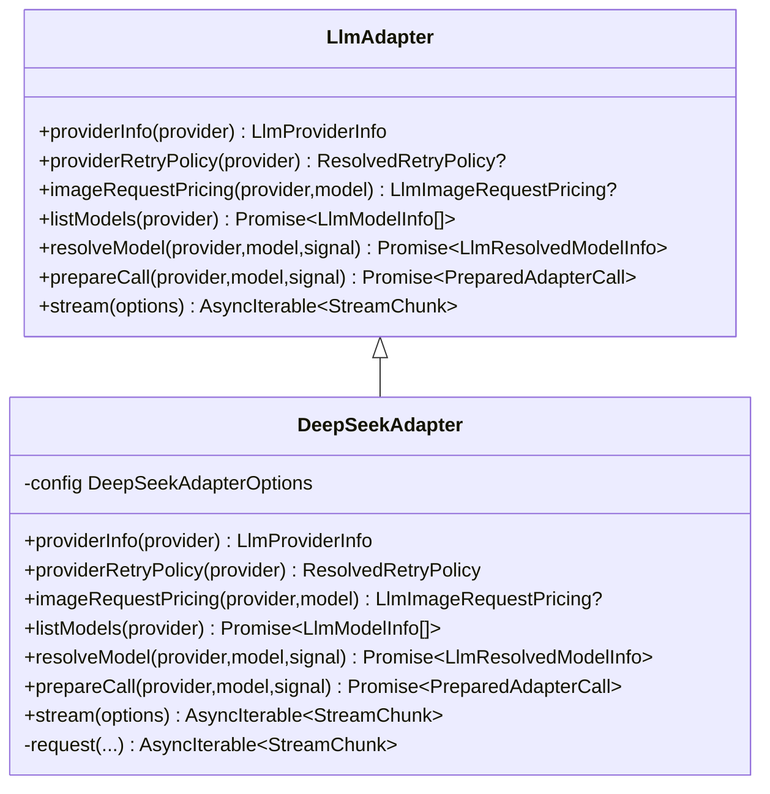
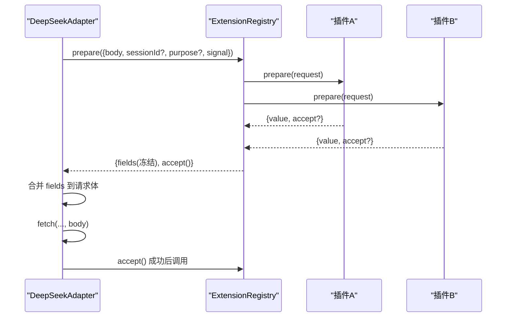
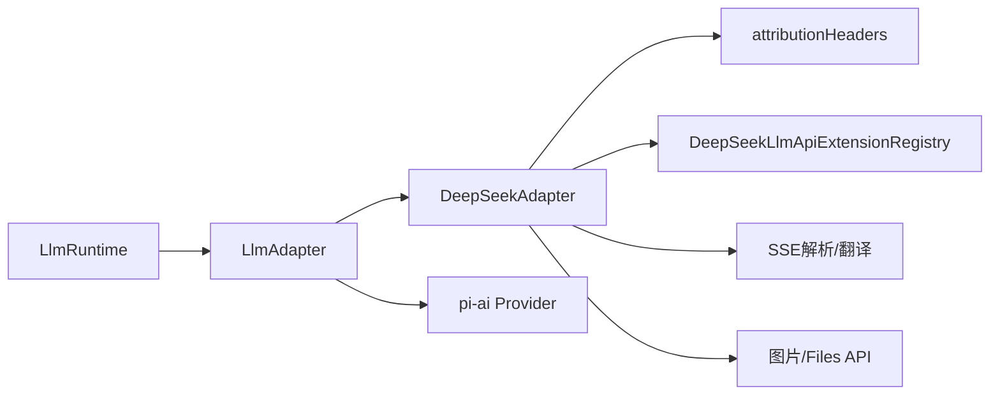
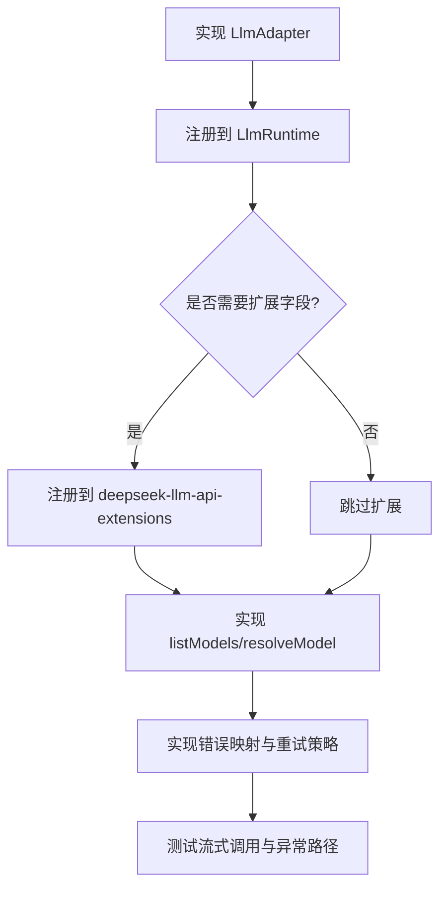

# 提供商集成

<cite>
**本文引用的文件**
- [packages/llm/llm/src/index.ts](file://packages/llm/llm/src/index.ts)
- [packages/llm/llm/src/types.ts](file://packages/llm/llm/src/types.ts)
- [packages/llm/llm/src/attribution.ts](file://packages/llm/llm/src/attribution.ts)
- [packages/llm/llm/src/error.ts](file://packages/llm/llm/src/error.ts)
- [packages/llm/llm/src/adapter-failure.ts](file://packages/llm/llm/src/adapter-failure.ts)
- [packages/llm/llm-deepseek/src/adapter.ts](file://packages/llm/llm-deepseek/src/adapter.ts)
- [packages/llm/deepseek-llm-api-extensions/src/index.ts](file://packages/llm/deepseek-llm-api-extensions/src/index.ts)
- [packages/llm/deepseek-llm-api-extensions/src/types.ts](file://packages/llm/deepseek-llm-api-extensions/src/types.ts)
- [packages/llm/llm-pi-ai/src/provider.ts](file://packages/llm/llm-pi-ai/src/provider.ts)
</cite>

## 目录
1. [简介](#简介)
2. [项目结构](#项目结构)
3. [核心组件](#核心组件)
4. [架构总览](#架构总览)
5. [详细组件分析](#详细组件分析)
6. [依赖关系分析](#依赖关系分析)
7. [性能考量](#性能考量)
8. [故障排查指南](#故障排查指南)
9. [结论](#结论)
10. [附录：新提供商集成开发指南](#附录：新提供商集成开发指南)

## 简介
本文件系统性说明 DeepSeek Harness 中 LLM 提供商的集成机制，重点覆盖：
- 多提供商支持的架构设计与适配器注册流程（registerAdapter、Provider 路由）
- 不同提供商 API 差异与统一适配方案
- DeepSeek 官方 API 扩展机制（ctx.deepseekLlmApiExtensions）
- 认证授权与密钥管理（AppIdentity、attributionHeaders）
- 提供商选择策略与负载均衡（模型发现、能力查询）
- 错误映射与异常处理（LlmFailure 统一处理）
- 请求扩展机制（ctx.deepseekLlmApiExtensions 的使用方式）
- 新提供商集成的开发指南与示例模板

## 项目结构
DeepSeek Harness 将“LLM 运行时”与“具体提供商适配器”解耦：
- llm：定义抽象适配器 LlmAdapter、运行时 LlmRuntime、类型与事件、错误体系、应用归属头
- llm-deepseek：DeepSeek 官方 OpenAI 兼容端点的适配器实现（SSE、图片、重试、扩展字段）
- deepseek-llm-api-extensions：DeepSeek 请求体顶层字段的插件化扩展注册表
- llm-pi-ai：基于 pi-ai 库的多协议适配层（OpenAI Completions/Responses、Anthropic Messages）

图表来源
- [packages/llm/llm/src/index.ts:330-468](file://packages/llm/llm/src/index.ts#L330-L468)
- [packages/llm/llm-deepseek/src/adapter.ts:355-444](file://packages/llm/llm-deepseek/src/adapter.ts#L355-L444)
- [packages/llm/deepseek-llm-api-extensions/src/index.ts:66-129](file://packages/llm/deepseek-llm-api-extensions/src/index.ts#L66-L129)

章节来源
- [packages/llm/llm/src/index.ts:330-468](file://packages/llm/llm/src/index.ts#L330-L468)
- [packages/llm/llm/src/types.ts:12-25](file://packages/llm/llm/src/types.ts#L12-L25)

## 核心组件
- LlmRuntime：适配器注册中心、可插拔的水流拦截点（llm/stream）、模型发现、能力查询、重试策略解析
- LlmAdapter：抽象适配器，要求实现 stream(options)，可选实现 providerInfo、providerRetryPolicy、listModels、resolveModel、prepareCall 等
- DeepSeekAdapter：DeepSeek 官方端点的适配器实现，负责序列化、SSE 解析、图片处理、扩展字段合并、错误映射
- DeepSeekLlmApiExtensionRegistry：提供 ctx.deepseekLlmApiExtensions，允许插件为 DeepSeek 请求体注入顶层字段并执行提交回调
- pi-ai Provider：通过 pi-ai 库桥接多种协议（OpenAI/Anthropic），在 llm-pi-ai 中构建 Provider 实例并接入适配器集合

章节来源
- [packages/llm/llm/src/index.ts:191-279](file://packages/llm/llm/src/index.ts#L191-L279)
- [packages/llm/llm-deepseek/src/adapter.ts:355-444](file://packages/llm/llm-deepseek/src/adapter.ts#L355-L444)
- [packages/llm/deepseek-llm-api-extensions/src/index.ts:66-129](file://packages/llm/deepseek-llm-api-extensions/src/index.ts#L66-L129)
- [packages/llm/llm-pi-ai/src/provider.ts:167-193](file://packages/llm/llm-pi-ai/src/provider.ts#L167-L193)

## 架构总览
下图展示一次模型调用的端到端流程：调用方准备请求 -> LlmRuntime 路由到适配器 -> 适配器组装请求并发送 -> SSE 流式返回 -> 统一错误与完成信号。

图表来源
- [packages/llm/llm/src/index.ts:330-468](file://packages/llm/llm/src/index.ts#L330-L468)
- [packages/llm/llm-deepseek/src/adapter.ts:524-708](file://packages/llm/llm-deepseek/src/adapter.ts#L524-L708)
- [packages/llm/deepseek-llm-api-extensions/src/index.ts:101-129](file://packages/llm/deepseek-llm-api-extensions/src/index.ts#L101-L129)

## 详细组件分析

### 适配器注册与 Provider 路由
- registerAdapter(providers, adapter)：以全有或全无的方式注册一组 provider 路由到同一适配器实例；支持 replace() 原子替换路由；释放时清理并通知拓扑变更
- prepareRoutes/commitRoutes：校验 provider 名称唯一性、元数据合法性，并一次性提交到内部 Map，发布 llm/adapters-updated 事件
- listProviders/listConfigurableProviders/discoverModels：暴露当前可用路由、可配置提供者目录以及针对端点的模型发现能力

图表来源
- [packages/llm/llm/src/index.ts:384-459](file://packages/llm/llm/src/index.ts#L384-L459)

章节来源
- [packages/llm/llm/src/index.ts:384-459](file://packages/llm/llm/src/index.ts#L384-L459)
- [packages/llm/llm/src/types.ts:12-25](file://packages/llm/llm/src/types.ts#L12-L25)

### 抽象适配器 LlmAdapter 与 DeepSeekAdapter
- LlmAdapter 抽象：
  - 必须实现 stream(options)
  - 可选实现 providerInfo、providerRetryPolicy、imageRequestPricing、listModels、resolveModel、prepareCall
- DeepSeekAdapter：
  - 通过 options() 钩子获取连接事实（baseURL、apiKeyEnv、默认值、模型目录、超时、图片策略、重试策略）
  - 每请求 resolveApiKey，确保密钥与端点同代绑定
  - 使用 attributionHeaders() 注入 User-Agent
  - 支持图片附件（Files API 优先，回退 base64），上下文窗口超限、配额不足、速率限制等错误映射
  - 通过 prepareExtensions 合并 DeepSeek 请求扩展字段，并在 HTTP 2xx 后执行 accept()

图表来源
- [packages/llm/llm/src/index.ts:191-279](file://packages/llm/llm/src/index.ts#L191-L279)
- [packages/llm/llm-deepseek/src/adapter.ts:355-444](file://packages/llm/llm-deepseek/src/adapter.ts#L355-L444)

章节来源
- [packages/llm/llm/src/index.ts:191-279](file://packages/llm/llm/src/index.ts#L191-L279)
- [packages/llm/llm-deepseek/src/adapter.ts:355-444](file://packages/llm/llm-deepseek/src/adapter.ts#L355-L444)

### DeepSeek 官方 API 扩展机制（ctx.deepseekLlmApiExtensions）
- 插件通过 register(field, provider) 声明一个顶层字段及其准备逻辑
- 每次请求前，适配器调用 prepare(request) 并行准备所有已注册字段，冻结并克隆返回值，避免外部可变引用泄露
- 若字段提供方定义了 accept()，则在 HTTP 2xx 成功后统一执行，失败聚合为 AggregateError
- 适配器在合并扩展字段时检测冲突，防止覆盖基础请求字段

图表来源
- [packages/llm/deepseek-llm-api-extensions/src/index.ts:66-129](file://packages/llm/deepseek-llm-api-extensions/src/index.ts#L66-L129)
- [packages/llm/deepseek-llm-api-extensions/src/types.ts:18-59](file://packages/llm/deepseek-llm-api-extensions/src/types.ts#L18-L59)
- [packages/llm/llm-deepseek/src/adapter.ts:622-701](file://packages/llm/llm-deepseek/src/adapter.ts#L622-L701)

章节来源
- [packages/llm/deepseek-llm-api-extensions/src/index.ts:66-129](file://packages/llm/deepseek-llm-api-extensions/src/index.ts#L66-L129)
- [packages/llm/deepseek-llm-api-extensions/src/types.ts:18-59](file://packages/llm/deepseek-llm-api-extensions/src/types.ts#L18-L59)
- [packages/llm/llm-deepseek/src/adapter.ts:622-701](file://packages/llm/llm-deepseek/src/adapter.ts#L622-L701)

### 认证授权与密钥管理（AppIdentity 与 attributionHeaders）
- AppIdentity：产品名、版本、仓库 URL，仅包含公开信息，不可携带敏感数据
- attributionHeaders(identity?)：生成标准 User-Agent 头；默认 identity 不可被抑制，白标部署可通过传入自定义 identity 覆盖
- DeepSeekAdapter 在每个请求中合并 attributionHeaders()，并附加 x-deepseek-harness-user-id 与条件性的 session 标识

章节来源
- [packages/llm/llm/src/attribution.ts:18-68](file://packages/llm/llm/src/attribution.ts#L18-L68)
- [packages/llm/llm-deepseek/src/adapter.ts:533-546](file://packages/llm/llm-deepseek/src/adapter.ts#L533-L546)

### 提供商选择策略与负载均衡（模型发现与能力查询）
- 模型目录与能力：
  - listModels(provider)：适配器返回其可 advertised 的模型列表（建议性，不控制路由）
  - resolveModel(provider, model, signal)：精确模型元数据（上下文窗口、默认 maxTokens、推理努力级别等）
  - imageRequestPricing(provider, model)：同步计算图片请求定价（无 I/O）
- 模型发现：
  - registerModelDiscovery(settingsNs, discover)：为设置命名空间注册端点探测函数
  - discoverModels(settingsNs, request, signal)：对未持久化的草稿进行端点探测，去重返回模型清单
- 负载均衡：
  - 通过 registerAdapter 将多个 provider 路由指向同一适配器实例，结合 providerRetryPolicy 与上游重试策略实现容错与负载分散

章节来源
- [packages/llm/llm/src/index.ts:645-715](file://packages/llm/llm/src/index.ts#L645-L715)
- [packages/llm/llm/src/index.ts:552-614](file://packages/llm/llm/src/index.ts#L552-L614)
- [packages/llm/llm-deepseek/src/adapter.ts:383-432](file://packages/llm/llm-deepseek/src/adapter.ts#L383-L432)

### 错误映射与异常处理（LlmFailure 统一处理）
- LlmError：封装 message、code、status、providerRetryAfterMs、requestId，用于稳定机器路由
- 错误码映射：
  - 401/403 -> AUTH
  - 413 -> INVALID_REQUEST
  - 429 -> RATE_LIMIT
  - 400 且上下文超限 -> CONTEXT_WINDOW_EXCEEDED
  - 5xx -> SERVER
  - 其他 -> HTTP_状态码
- 适配器边界归一化：normalizeLlmFailure 将任意抛出的值转换为稳定的 LlmFailure，屏蔽宿主副作用与跨域错误类
- 重试策略：providerRetryPolicy 由适配器提供，运行时解析默认策略；空响应 EMPTY_RESPONSE 视为可重试

章节来源
- [packages/llm/llm/src/index.ts:90-124](file://packages/llm/llm/src/index.ts#L90-L124)
- [packages/llm/llm-deepseek/src/adapter.ts:334-346](file://packages/llm/llm-deepseek/src/adapter.ts#L334-L346)
- [packages/llm/llm/src/error.ts:13-49](file://packages/llm/llm/src/error.ts#L13-L49)
- [packages/llm/llm/src/adapter-failure.ts:16-28](file://packages/llm/llm/src/adapter-failure.ts#L16-L28)

### 请求扩展机制（ctx.deepseekLlmApiExtensions 使用方法）
- 插件注册：
  - ctx.deepseekLlmApiExtensions.register(field, provider)
  - provider.prepare(request) 返回 { value, accept? }
- 适配器侧：
  - 在请求前调用 prepare(request) 收集所有扩展字段
  - 合并到 JSON 请求体，检测字段冲突
  - 成功响应后调用 accept() 提交副作用
- 取消与隔离：
  - 扩展准备受 AbortSignal 保护，取消即停
  - 字段值被结构化克隆并冻结，避免共享可变状态

章节来源
- [packages/llm/deepseek-llm-api-extensions/src/index.ts:73-129](file://packages/llm/deepseek-llm-api-extensions/src/index.ts#L73-L129)
- [packages/llm/deepseek-llm-api-extensions/src/types.ts:18-59](file://packages/llm/deepseek-llm-api-extensions/src/types.ts#L18-L59)
- [packages/llm/llm-deepseek/src/adapter.ts:622-701](file://packages/llm/llm-deepseek/src/adapter.ts#L622-L701)

## 依赖关系分析
- LlmRuntime 依赖 LlmAdapter 抽象，具体实现由插件提供
- DeepSeekAdapter 依赖：
  - attributionHeaders（应用归属）
  - DeepSeekLlmApiExtensionRegistry（请求扩展）
  - 图片与文件存储、SSE 解析、重试策略
- pi-ai Provider 通过协议表（openai-completions、openai-responses、anthropic-messages）构建，复用安装目录中的 Provider 或按需创建

图表来源
- [packages/llm/llm/src/index.ts:330-468](file://packages/llm/llm/src/index.ts#L330-L468)
- [packages/llm/llm-deepseek/src/adapter.ts:355-444](file://packages/llm/llm-deepseek/src/adapter.ts#L355-L444)
- [packages/llm/llm-pi-ai/src/provider.ts:47-63](file://packages/llm/llm-pi-ai/src/provider.ts#L47-L63)

章节来源
- [packages/llm/llm/src/index.ts:330-468](file://packages/llm/llm/src/index.ts#L330-L468)
- [packages/llm/llm-pi-ai/src/provider.ts:47-63](file://packages/llm/llm-pi-ai/src/provider.ts#L47-L63)

## 性能考量
- 图片处理：
  - Files API 优先，超过阈值回退 base64；按预算与数量逐步裁剪
  - 图片请求定价同步计算，避免阻塞测量路径
- 流式读取：
  - idleWatchdog 监控空闲超时，避免长时间挂起
  - 取消信号贯穿 fetch 与 SSE 读取
- 扩展字段：
  - 并行 prepare，冻结与克隆避免后续修改
  - 仅在 2xx 后执行 accept，减少无效副作用

[本节为通用指导，无需特定文件来源]

## 故障排查指南
- 认证失败：
  - 检查 apiKey 是否空白或包含非法字符；使用 assertUsableApiKey 验证
  - 确认 attributionHeaders 已合并到请求头
- 上下文超限：
  - 识别 isContextWindowExceededError 并提示缩短输入或启用压缩
- 配额耗尽：
  - 识别 isQuotaExceededError 并引导用户充值或切换提供商
- 速率限制：
  - 根据 providerRetryAfterMs 调整重试间隔
- 空响应：
  - EMPTY_RESPONSE 被视为可重试，结合重试策略自动恢复
- 扩展字段冲突：
  - 若扩展字段与基础请求字段同名，会抛出 REQUEST_EXTENSION 错误，需调整插件字段名

章节来源
- [packages/llm/llm/src/index.ts:144-159](file://packages/llm/llm/src/index.ts#L144-L159)
- [packages/llm/llm/src/error.ts:24-49](file://packages/llm/llm/src/error.ts#L24-L49)
- [packages/llm/llm-deepseek/src/adapter.ts:622-701](file://packages/llm/llm-deepseek/src/adapter.ts#L622-L701)

## 结论
DeepSeek Harness 通过抽象适配器与运行时注册机制，实现了多提供商的统一接入与可扩展的请求扩展。DeepSeek 官方适配器提供了完整的流式处理、图片支持、错误映射与扩展字段合并能力；同时提供模型发现与能力查询，便于上层做智能选择与负载均衡。统一的错误体系与认证头规范确保了跨提供商的一致性与可观测性。

[本节为总结，无需特定文件来源]

## 附录：新提供商集成开发指南

### 步骤概览
1. 实现 LlmAdapter：
   - 至少实现 stream(options)
   - 可选实现 providerInfo、providerRetryPolicy、listModels、resolveModel、prepareCall、imageRequestPricing
2. 注册适配器：
   - 使用 ctx.llm.registerAdapter(['your-provider'], new YourAdapter())
   - 支持 handle.replace([...]) 动态更新路由
3. 认证与头部：
   - 每个请求合并 attributionHeaders()
   - 如需应用专属身份，传入自定义 AppIdentity
4. 模型发现与能力：
   - 实现 listModels 与 resolveModel，提供 inputModalities、contextWindow、defaultMaxTokens、reasoning 等
   - 如需要，通过 ctx.llm.registerModelDiscovery 注册端点探测
5. 错误映射：
   - 将 HTTP 状态与 provider 错误映射为稳定 code（AUTH、RATE_LIMIT、CONTEXT_WINDOW_EXCEEDED、QUOTA、SERVER 等）
   - 使用 LlmError 包装，附带 status、providerRetryAfterMs、requestId
6. 请求扩展（可选，仅限 DeepSeek 官方端点）：
   - 使用 ctx.deepseekLlmApiExtensions.register(field, provider) 注入顶层字段
   - 在 prepare 中返回 { value, accept? }，并在 2xx 后执行 accept

### 适配器实现模板（路径参考）
- 抽象接口与运行时：
  - [packages/llm/llm/src/index.ts:191-279](file://packages/llm/llm/src/index.ts#L191-L279)
- DeepSeek 适配器参考：
  - [packages/llm/llm-deepseek/src/adapter.ts:355-444](file://packages/llm/llm-deepseek/src/adapter.ts#L355-L444)
- 扩展注册表：
  - [packages/llm/deepseek-llm-api-extensions/src/index.ts:66-129](file://packages/llm/deepseek-llm-api-extensions/src/index.ts#L66-L129)
- 类型定义：
  - [packages/llm/llm/src/types.ts:39-51](file://packages/llm/llm/src/types.ts#L39-L51)
  - [packages/llm/deepseek-llm-api-extensions/src/types.ts:18-59](file://packages/llm/deepseek-llm-api-extensions/src/types.ts#L18-L59)

### 配置方法
- 注册路由：
  - ctx.llm.registerAdapter(['your-provider'], adapter)
  - 使用 handle.replace(['new-provider']) 动态更新
- 可配置提供者目录：
  - ctx.llm.registerConfigurableProviders([{ provider, displayName, settingsNs, settingsPath }])
- 模型发现：
  - ctx.llm.registerModelDiscovery('your-settings-ns', async (req, signal) => [...models])

### 示例流程图（新提供商接入）

[本节为概念性流程，无需特定文件来源]